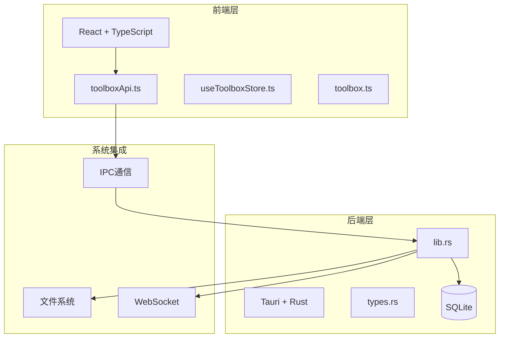
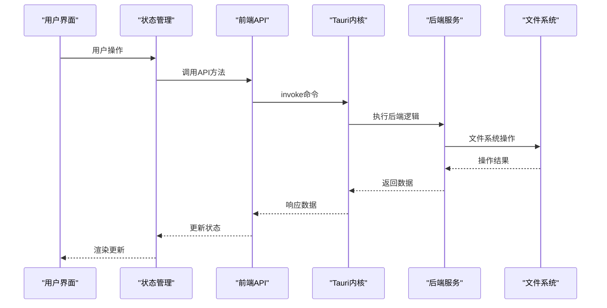
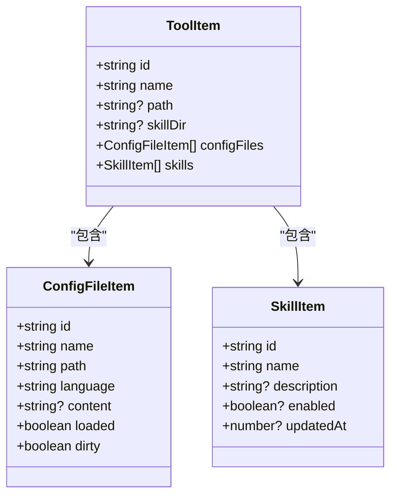
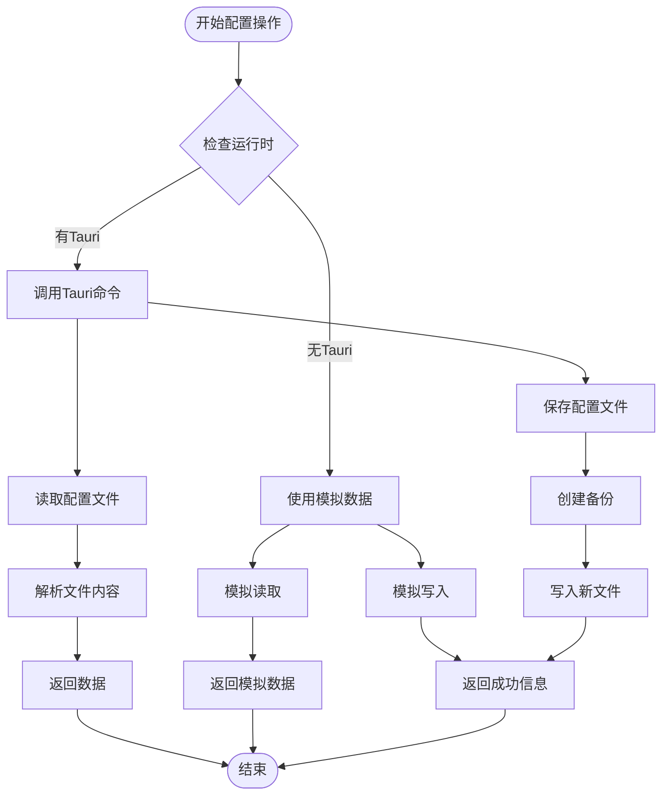
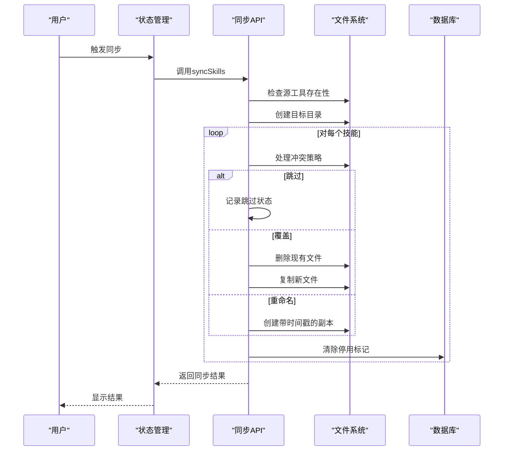
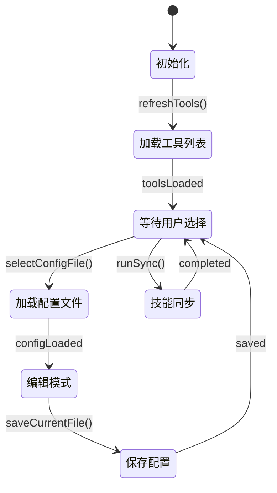
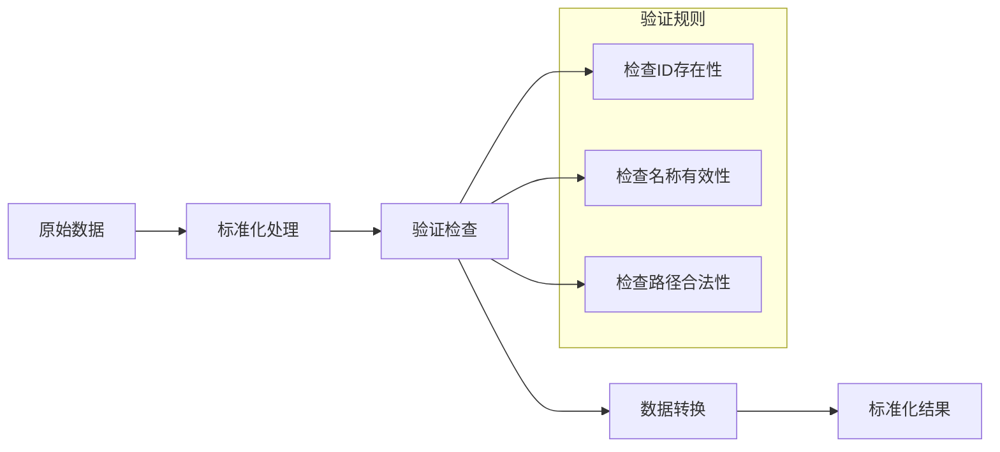
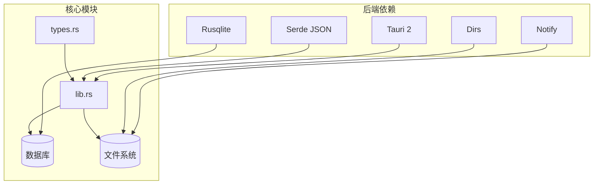

# API参考文档

<cite>
**本文档引用的文件**
- [README.md](file://README.md)
- [package.json](file://package.json)
- [src/lib/toolboxApi.ts](file://src/lib/toolboxApi.ts)
- [src/store/useToolboxStore.ts](file://src/store/useToolboxStore.ts)
- [src/types/toolbox.ts](file://src/types/toolbox.ts)
- [src-tauri/src/lib.rs](file://src-tauri/src/lib.rs)
- [src-tauri/src/toolbox.rs](file://src-tauri/src/toolbox.rs)
- [src-tauri/src/types.rs](file://src-tauri/src/types.rs)
- [src-tauri/Cargo.toml](file://src-tauri/Cargo.toml)
- [src-tauri/tauri.conf.json](file://src-tauri/tauri.conf.json)
</cite>

## 目录
1. [简介](#简介)
2. [项目结构](#项目结构)
3. [核心组件](#核心组件)
4. [架构概览](#架构概览)
5. [详细组件分析](#详细组件分析)
6. [依赖关系分析](#依赖关系分析)
7. [性能考虑](#性能考虑)
8. [故障排除指南](#故障排除指南)
9. [结论](#结论)
10. [附录](#附录)

## 简介

AI工具箱是一个基于Tauri + React的桌面端Agent技能管理工具。该项目提供了完整的前端API接口、后端Tauri命令系统，以及丰富的工具管理功能。

**章节来源**
- [README.md:1-119](file://README.md#L1-L119)

## 项目结构

项目采用前后端分离的架构设计，主要分为以下模块：



**图表来源**
- [src/lib/toolboxApi.ts:1-784](file://src/lib/toolboxApi.ts#L1-L784)
- [src-tauri/src/lib.rs:1-1409](file://src-tauri/src/lib.rs#L1-L1409)

**章节来源**
- [README.md:44-67](file://README.md#L44-L67)
- [package.json:1-63](file://package.json#L1-L63)

## 核心组件

### 前端API组件

前端API通过`toolboxApi.ts`统一管理所有Tauri命令调用，提供类型安全的接口封装。

### 状态管理组件

`useToolboxStore.ts`使用Zustand进行状态管理，集中处理工具状态、配置文件内容、同步操作等。

### 数据类型组件

`toolbox.ts`定义了完整的数据类型系统，包括工具、配置文件、技能、预设等核心实体。

**章节来源**
- [src/lib/toolboxApi.ts:387-784](file://src/lib/toolboxApi.ts#L387-L784)
- [src/store/useToolboxStore.ts:145-556](file://src/store/useToolboxStore.ts#L145-L556)
- [src/types/toolbox.ts:1-152](file://src/types/toolbox.ts#L1-L152)

## 架构概览

AI工具箱采用双层架构设计，前端负责用户界面和业务逻辑，后端负责系统级操作和数据持久化。



**图表来源**
- [src/lib/toolboxApi.ts:104-110](file://src/lib/toolboxApi.ts#L104-L110)
- [src-tauri/src/lib.rs:1372-1405](file://src-tauri/src/lib.rs#L1372-L1405)

## 详细组件分析

### 前端API组件详解

#### 工具管理API

工具管理是AI工具箱的核心功能，提供完整的工具生命周期管理。



**图表来源**
- [src/types/toolbox.ts:33-43](file://src/types/toolbox.ts#L33-L43)
- [src/types/toolbox.ts:22-31](file://src/types/toolbox.ts#L22-L31)
- [src/types/toolbox.ts:7-20](file://src/types/toolbox.ts#L7-L20)

##### 工具列表管理

`listTools()`函数提供工具列表的获取和缓存机制：

- **功能**：获取已启用工具的完整列表
- **参数**：无
- **返回**：Promise<ToolItem[]>
- **错误处理**：自动降级到模拟数据

##### 技能洞察功能

`getSkillInsights()`提供技能同步状态的智能分析：

- **功能**：分析各工具间技能的同步状态和差异
- **算法**：比较技能文件的时间戳和内容差异
- **输出**：按领先工具排序的洞察结果

**章节来源**
- [src/lib/toolboxApi.ts:387-405](file://src/lib/toolboxApi.ts#L387-L405)
- [src/lib/toolboxApi.ts:398-405](file://src/lib/toolboxApi.ts#L398-L405)

#### 配置文件管理API

配置文件管理支持多种格式的配置文件读写操作。



**图表来源**
- [src/lib/toolboxApi.ts:407-436](file://src/lib/toolboxApi.ts#L407-L436)
- [src/lib/toolboxApi.ts:419-436](file://src/lib/toolboxApi.ts#L419-L436)

##### 配置文件读取

`readConfigFile()`支持：
- 多种文件格式（JSON、YAML、TOML等）
- 自动语言检测
- 错误处理和降级机制

##### 配置文件保存

`saveConfigFile()`提供：
- 自动备份机制
- 冲突解决策略
- 失败回滚保护

**章节来源**
- [src/lib/toolboxApi.ts:407-436](file://src/lib/toolboxApi.ts#L407-L436)
- [src/lib/toolboxApi.ts:419-436](file://src/lib/toolboxApi.ts#L419-L436)

#### 技能同步API

技能同步功能支持多工具间的技能传输和冲突解决。



**图表来源**
- [src/lib/toolboxApi.ts:438-465](file://src/lib/toolboxApi.ts#L438-L465)
- [src-tauri/src/lib.rs:933-1037](file://src-tauri/src/lib.rs#L933-L1037)

##### 同步模式

支持两种同步模式：
- **复制模式** (`copy`)：完整复制文件内容
- **符号链接模式** (`symlink`)：创建文件链接

##### 冲突策略

提供三种冲突解决策略：
- **跳过** (`skip`)：遇到冲突时跳过该文件
- **覆盖** (`overwrite`)：删除现有文件并复制新文件
- **重命名** (`rename`)：创建带时间戳的新文件

**章节来源**
- [src/lib/toolboxApi.ts:438-465](file://src/lib/toolboxApi.ts#L438-L465)
- [src-tauri/src/lib.rs:933-1037](file://src-tauri/src/lib.rs#L933-L1037)

### Hook API组件

#### 状态管理Hook

`useToolboxStore`提供完整的状态管理能力：



**图表来源**
- [src/store/useToolboxStore.ts:174-205](file://src/store/useToolboxStore.ts#L174-L205)
- [src/store/useToolboxStore.ts:341-384](file://src/store/useToolboxStore.ts#L341-L384)

##### 核心状态属性

- `tools`: 工具列表数据
- `selectedToolId`: 当前选中的工具ID
- `selectedConfigId`: 当前选中的配置文件ID
- `selectedSkillIds`: 选中的技能ID数组
- `isToolsLoading`: 工具加载状态
- `isConfigLoading`: 配置文件加载状态
- `feedback`: 操作反馈信息

##### 关键操作方法

- `initialize()`: 应用初始化
- `refreshTools()`: 刷新工具列表
- `selectTool()`: 选择工具
- `saveCurrentFile()`: 保存当前配置
- `runSync()`: 执行技能同步
- `toggleSkillEnabled()`: 切换技能启用状态

**章节来源**
- [src/store/useToolboxStore.ts:32-84](file://src/store/useToolboxStore.ts#L32-L84)
- [src/store/useToolboxStore.ts:174-556](file://src/store/useToolboxStore.ts#L174-L556)

### 工具函数组件

#### 数据转换工具

项目提供了强大的数据转换和验证工具：



**图表来源**
- [src/lib/toolboxApi.ts:283-302](file://src/lib/toolboxApi.ts#L283-L302)
- [src/lib/toolboxApi.ts:343-385](file://src/lib/toolboxApi.ts#L343-L385)

##### 工具标准化

`normalizeTool()`函数支持：
- 多种输入格式（字符串、对象、数组）
- 自动字段映射
- 重复数据去重

##### 技能洞察分析

`normalizeSkillInsightsResponse()`提供：
- 多工具技能对比
- 时间差计算
- 文件差异检测

**章节来源**
- [src/lib/toolboxApi.ts:263-302](file://src/lib/toolboxApi.ts#L263-L302)
- [src/lib/toolboxApi.ts:343-385](file://src/lib/toolboxApi.ts#L343-L385)

## 依赖关系分析

### 前端依赖关系

```mermaid
graph TD
subgraph "前端依赖"
React[React 19]
TS[TypeScript]
ZUSTAND[Zustand]
TAURI[@tauri-apps/api]
MONACO[@monaco-editor/react]
end
subgraph "项目模块"
TOOLBOX[AI工具箱]
API[toolboxApi.ts]
STORE[useToolboxStore.ts]
TYPES[toolbox.ts]
end
React --> TOOLBOX
TS --> TOOLBOX
ZUSTAND --> STORE
TAURI --> API
MONACO --> TOOLBOX
TOOLBOX --> API
TOOLBOX --> STORE
TOOLBOX --> TYPES
```

**图表来源**
- [package.json:29-38](file://package.json#L29-L38)
- [src/lib/toolboxApi.ts:1-21](file://src/lib/toolboxApi.ts#L1-L21)

### 后端依赖关系

后端使用Rust和Tauri构建，依赖关系如下：



**图表来源**
- [src-tauri/Cargo.toml:20-30](file://src-tauri/Cargo.toml#L20-L30)
- [src-tauri/src/lib.rs:1-18](file://src-tauri/src/lib.rs#L1-L18)

**章节来源**
- [package.json:29-61](file://package.json#L29-L61)
- [src-tauri/Cargo.toml:1-30](file://src-tauri/Cargo.toml#L1-L30)

## 性能考虑

### 前端性能优化

1. **懒加载策略**：仅在需要时加载工具配置文件
2. **状态缓存**：避免重复的API调用
3. **批量操作**：支持批量技能同步减少文件系统操作次数

### 后端性能优化

1. **文件监控**：使用`notify`库监听文件变化
2. **数据库连接池**：复用数据库连接减少开销
3. **异步操作**：非阻塞的文件系统操作

### 内存管理

- 使用`OnceLock`缓存工具定义
- 及时释放文件句柄和数据库连接
- 避免内存泄漏的闭包引用

## 故障排除指南

### 常见问题及解决方案

#### 工具注册失败

**症状**：工具无法被识别或显示异常
**原因**：配置文件路径错误或权限不足
**解决方案**：
1. 检查工具配置文件路径
2. 验证文件存在性和可读性
3. 确认用户权限

#### 技能同步失败

**症状**：技能同步过程中断或部分失败
**原因**：磁盘空间不足或文件权限问题
**解决方案**：
1. 检查目标磁盘空间
2. 验证目标目录写权限
3. 检查冲突解决策略设置

#### 配置文件保存失败

**症状**：配置文件无法保存或备份创建失败
**原因**：文件锁定或磁盘只读
**解决方案**：
1. 关闭占用配置文件的应用
2. 检查磁盘写入权限
3. 验证备份目录可用性

**章节来源**
- [src/lib/toolboxApi.ts:104-110](file://src/lib/toolboxApi.ts#L104-L110)
- [src-tauri/src/lib.rs:933-1037](file://src-tauri/src/lib.rs#L933-L1037)

## 结论

AI工具箱提供了完整的API生态系统，涵盖了工具管理、配置文件操作、技能同步等核心功能。通过前后端分离的设计，项目实现了良好的可维护性和扩展性。

主要优势：
- 类型安全的API设计
- 完善的错误处理机制
- 灵活的配置管理
- 高效的文件操作

未来改进方向：
- 增强WebSocket支持用于实时通知
- 优化大数据量场景的性能
- 扩展插件系统支持

## 附录

### API版本管理

项目采用语义化版本控制：
- **版本号**：0.2.1
- **更新策略**：小版本更新保持向后兼容
- **破坏性变更**：通过大版本号升级处理

### 协议特定调试工具

1. **健康检查**：`healthcheck()`命令
2. **日志系统**：集成Tauri日志插件
3. **性能监控**：内置操作计时和统计

### 最佳实践建议

1. **错误处理**：始终检查API调用返回值
2. **状态管理**：合理使用loading状态指示
3. **数据验证**：在提交前验证用户输入
4. **性能优化**：避免不必要的API调用