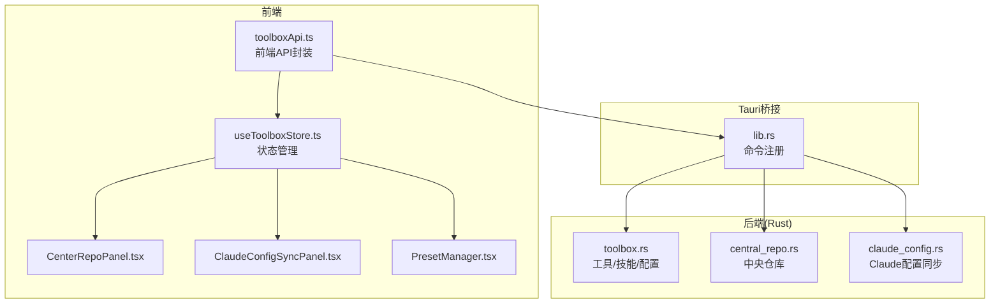
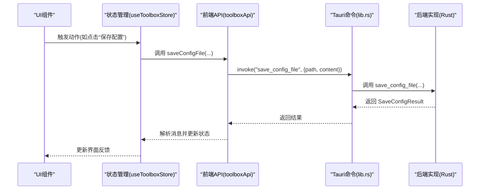
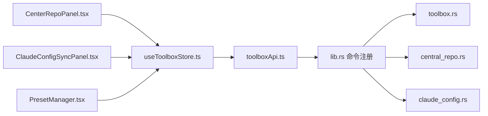

# 前端API接口

<cite>
**本文引用的文件**
- [toolboxApi.ts](file://src/lib/toolboxApi.ts)
- [toolbox.ts](file://src/types/toolbox.ts)
- [useToolboxStore.ts](file://src/store/useToolboxStore.ts)
- [lib.rs](file://src-tauri/src/lib.rs)
- [central_repo.rs](file://src-tauri/src/central_repo.rs)
- [claude_config.rs](file://src-tauri/src/claude_config.rs)
- [CenterRepoPanel.tsx](file://src/components/CenterRepoPanel.tsx)
- [ClaudeConfigSyncPanel.tsx](file://src/components/ClaudeConfigSyncPanel.tsx)
- [PresetManager.tsx](file://src/components/PresetManager.tsx)
</cite>

## 目录
1. [简介](#简介)
2. [项目结构](#项目结构)
3. [核心组件](#核心组件)
4. [架构总览](#架构总览)
5. [详细组件分析](#详细组件分析)
6. [依赖关系分析](#依赖关系分析)
7. [性能考量](#性能考量)
8. [故障排查指南](#故障排查指南)
9. [结论](#结论)
10. [附录](#附录)

## 简介
本文件为 AI 工具箱前端 API 接口的权威文档，聚焦以下能力：
- 工具管理：listTools()、getSkillInsights()、readConfigFile()、saveConfigFile()、listToolRegistry()、upsertToolRegistryItem()、deleteToolRegistryItem()、detectToolPaths()、listConfigBackups()、openPathInFinder()、toggleSkillEnabled()、getSkillDetail()、deleteSkill()
- 技能同步：syncSkills()、批量同步 batchSyncFromCenter()、单个同步 syncFromCenter()
- 中央仓库：discoverCenterSkills()、batchImportToCenter()、listCenterSkills()、deleteCenterSkill()、setSkillCategory()
- 预设管理：listPresets()、savePreset()、deletePreset()
- Claude 配置同步：getClaudeConfigDiff()、applyClaudeConfigFullSync()、listClaudeSettingsSnapshots()、restoreCswitchDbFromBackup()

文档提供每个接口的用途、参数、返回值、使用示例与错误处理策略，帮助开发者快速集成与排障。

## 项目结构
前端通过 Tauri 桥接到 Rust 后端，统一暴露命令接口。前端主要模块如下：
- src/lib/toolboxApi.ts：封装所有前端 API 方法，负责类型转换、错误处理与消息提示
- src/types/toolbox.ts：定义所有数据模型与枚举
- src/store/useToolboxStore.ts：状态管理，协调 UI 与 API 调用
- src/components/*：UI 组件，调用 API 并展示结果
- src-tauri/src/lib.rs：Tauri 命令注册与业务实现入口
- src-tauri/src/central_repo.rs：中央仓库相关逻辑
- src-tauri/src/claude_config.rs：Claude 配置同步逻辑

图表来源
- [toolboxApi.ts:1-784](file://src/lib/toolboxApi.ts#L1-L784)
- [useToolboxStore.ts:1-556](file://src/store/useToolboxStore.ts#L1-L556)
- [lib.rs:1372-1405](file://src-tauri/src/lib.rs#L1372-L1405)
- [central_repo.rs:1-726](file://src-tauri/src/central_repo.rs#L1-L726)
- [claude_config.rs:1-523](file://src-tauri/src/claude_config.rs#L1-L523)

章节来源
- [toolboxApi.ts:1-784](file://src/lib/toolboxApi.ts#L1-L784)
- [useToolboxStore.ts:1-556](file://src/store/useToolboxStore.ts#L1-L556)
- [lib.rs:1372-1405](file://src-tauri/src/lib.rs#L1372-L1405)

## 核心组件
- 前端 API 封装层：统一调用 invoke，进行类型校验与消息提示，兼容无 Tauri 环境的 Mock 行为
- 状态管理层：集中管理工具列表、配置文件、技能洞察、Claude 配置差异、预设等状态
- UI 组件层：围绕工具、中央仓库、Claude 配置、预设构建交互面板
- 后端命令层：以 #[tauri::command] 注册，实现具体业务逻辑

章节来源
- [toolboxApi.ts:387-784](file://src/lib/toolboxApi.ts#L387-L784)
- [useToolboxStore.ts:145-556](file://src/store/useToolboxStore.ts#L145-L556)
- [lib.rs:1372-1405](file://src-tauri/src/lib.rs#L1372-L1405)

## 架构总览
前端通过 @tauri-apps/api 的 invoke 机制调用后端命令。前端 API 层负责：
- 参数标准化与类型转换
- 错误消息提取与反馈
- 无 Tauri 环境下的 Mock 返回

后端命令层负责：
- 文件系统操作、数据库访问、外部进程调用
- 业务规则与冲突策略处理
- 结果序列化与异常抛出

图表来源
- [useToolboxStore.ts:307-339](file://src/store/useToolboxStore.ts#L307-L339)
- [toolboxApi.ts:419-436](file://src/lib/toolboxApi.ts#L419-L436)
- [lib.rs:855-873](file://src-tauri/src/lib.rs#L855-L873)

## 详细组件分析

### 工具管理接口
- listTools()
  - 功能：获取可用工具列表，包含工具元信息、配置文件、技能目录等
  - 参数：无
  - 返回：ToolItem[]（前端类型）
  - 错误：无 Tauri 环境返回内置 Mock 数据
  - 使用示例：见 useToolboxStore.refreshTools()
- getSkillInsights()
  - 功能：计算技能洞察，识别领先者与落后者及差异
  - 参数：无
  - 返回：SkillInsightEntry[]
  - 错误：无 Tauri 环境返回空数组
  - 使用示例：见 useToolboxStore.refreshInsights()
- readConfigFile(tool, file)
  - 功能：读取指定配置文件内容
  - 参数：tool: ToolItem, file: ConfigFileItem
  - 返回：string
  - 错误：无 Tauri 环境返回 Mock 内容
- saveConfigFile(tool, file, content)
  - 功能：保存配置文件，自动备份
  - 参数：tool: ToolItem, file: ConfigFileItem, content: string
  - 返回：string（含备份路径信息）
  - 错误：无 Tauri 环境返回本地草稿提示
- listToolRegistry()
  - 功能：列出工具注册表（含启用状态、配置文件、技能目录）
  - 参数：无
  - 返回：ToolRegistryEntry[]
  - 错误：无 Tauri 环境返回 Mock 数据
- upsertToolRegistryItem(payload)
  - 功能：新增或更新工具注册项
  - 参数：payload 包含 id/name/enabled/configFiles/skillDir
  - 返回：ToolRegistryEntry
  - 错误：非法输入或系统工具禁止修改
- deleteToolRegistryItem(id)
  - 功能：删除工具注册项
  - 参数：id: string
  - 返回：string（操作结果）
  - 错误：系统工具禁止删除、至少保留一个启用工具
- detectToolPaths({id?, name?})
  - 功能：根据工具标识或名称推断配置文件与技能目录
  - 参数：id 或 name 至少提供其一
  - 返回：{ configFiles[], skillDir? }
- listConfigBackups(path)
  - 功能：列出指定配置文件的备份
  - 参数：path: string
  - 返回：BackupItem[]
- openPathInFinder(path)
  - 功能：在系统资源管理器中定位路径
  - 参数：path: string
  - 返回：void
- toggleSkillEnabled({toolId, skillName, enabled})
  - 功能：启用/停用技能（仅数据库标记，不删除文件）
  - 参数：toolId, skillName, enabled: boolean
  - 返回：void
- getSkillDetail(toolId, skillName)
  - 功能：读取技能的 SKILL.md 与 README.md 内容
  - 参数：toolId, skillName
  - 返回：SkillDetailPayload
- deleteSkill({toolId, skillName})
  - 功能：删除技能目录或符号链接
  - 参数：toolId, skillName
  - 返回：string

章节来源
- [toolboxApi.ts:387-580](file://src/lib/toolboxApi.ts#L387-L580)
- [useToolboxStore.ts:183-410](file://src/store/useToolboxStore.ts#L183-L410)
- [lib.rs:621-628](file://src-tauri/src/lib.rs#L621-L628)
- [lib.rs:684-755](file://src-tauri/src/lib.rs#L684-L755)
- [lib.rs:850-853](file://src-tauri/src/lib.rs#L850-L853)
- [lib.rs:855-873](file://src-tauri/src/lib.rs#L855-L873)
- [lib.rs:876-905](file://src-tauri/src/lib.rs#L876-L905)
- [lib.rs:908-930](file://src-tauri/src/lib.rs#L908-L930)
- [lib.rs:1277-1303](file://src-tauri/src/lib.rs#L1277-L1303)
- [lib.rs:1071-1106](file://src-tauri/src/lib.rs#L1071-L1106)
- [lib.rs:1040-1058](file://src-tauri/src/lib.rs#L1040-L1058)

### 技能同步接口
- syncSkills({sourceTool, targetTools, skills, mode, conflictStrategy})
  - 功能：在多个目标工具间同步指定技能
  - 参数：sourceTool, targetTools[], skills[], mode(copy|symlink), conflictStrategy(skip|overwrite|rename)
  - 返回：string（汇总消息）
  - 错误：源/目标工具不存在、技能不存在、不支持的模式或策略
- batchSyncFromCenter(skillNames[], targetToolId, mode, conflictPolicy)
  - 功能：从中央仓库批量同步技能到目标工具
  - 参数：skillNames[], targetToolId, mode, conflictPolicy
  - 返回：SyncOutcome[]（每项包含技能名、目标路径、状态、消息）
  - 错误：工具不存在、技能不存在、策略不支持
- syncFromCenter(skillName, targetToolId, mode, conflictPolicy)
  - 功能：单个技能从中央仓库同步到目标工具
  - 参数：skillName, targetToolId, mode, conflictPolicy
  - 返回：SyncOutcome
  - 错误：同上

章节来源
- [toolboxApi.ts:438-465](file://src/lib/toolboxApi.ts#L438-L465)
- [toolboxApi.ts:676-710](file://src/lib/toolboxApi.ts#L676-L710)
- [lib.rs:933-1037](file://src-tauri/src/lib.rs#L933-L1037)
- [lib.rs:1189-1217](file://src-tauri/src/lib.rs#L1189-L1217)

### 中央仓库接口
- discoverCenterSkills()
  - 功能：扫描各工具目录，发现尚未入库的技能
  - 参数：无
  - 返回：DiscoveredSkill[]
- batchImportToCenter([{skillName, sourceToolId}])
  - 功能：批量导入技能到中央仓库
  - 参数：请求数组
  - 返回：ImportOutcome[]
- listCenterSkills()
  - 功能：列出中央仓库技能，标注来源类型与同步状态
  - 参数：无
  - 返回：CenterSkillInfo[]
- deleteCenterSkill(skillName)
  - 功能：删除中央仓库技能
  - 参数：skillName
  - 返回：string
- setSkillCategory(skillName, category)
  - 功能：设置技能分类(custom/git/system)
  - 参数：skillName, category
  - 返回：void

章节来源
- [toolboxApi.ts:636-644](file://src/lib/toolboxApi.ts#L636-L644)
- [toolboxApi.ts:640-644](file://src/lib/toolboxApi.ts#L640-L644)
- [toolboxApi.ts:690-696](file://src/lib/toolboxApi.ts#L690-L696)
- [toolboxApi.ts:694-696](file://src/lib/toolboxApi.ts#L694-L696)
- [toolboxApi.ts:646-648](file://src/lib/toolboxApi.ts#L646-L648)
- [lib.rs:1225-1228](file://src-tauri/src/lib.rs#L1225-L1228)
- [lib.rs:1231-1237](file://src-tauri/src/lib.rs#L1231-L1237)
- [lib.rs:1133-1180](file://src-tauri/src/lib.rs#L1133-L1180)
- [lib.rs:1220-1222](file://src-tauri/src/lib.rs#L1220-L1222)
- [lib.rs:1183-1186](file://src-tauri/src/lib.rs#L1183-L1186)

### 预设管理接口
- listPresets()
  - 功能：列出预设
  - 参数：无
  - 返回：PresetEntry[]
- savePreset(name, skills, id?)
  - 功能：保存或更新预设
  - 参数：name, skills[], id?(可选)
  - 返回：PresetEntry
- deletePreset(id)
  - 功能：删除预设
  - 参数：id
  - 返回：void

章节来源
- [toolboxApi.ts:734-750](file://src/lib/toolboxApi.ts#L734-L750)
- [lib.rs:1109-1130](file://src-tauri/src/lib.rs#L1109-L1130)

### Claude 配置同步接口
- getClaudeConfigDiff(baseline?)
  - 功能：计算 settings.json 与 cc-switch 公共配置的差异
  - 参数：baseline(kind: live|richest|snapshot:{ts})
  - 返回：ClaudeConfigDiffResult
- applyClaudeConfigFullSync(baseline?)
  - 功能：整段同步，将 settings.json 非排除字段覆盖到 cc-switch
  - 参数：baseline
  - 返回：ClaudeConfigSyncResult（含备份路径与应用字段）
- listClaudeSettingsSnapshots()
  - 功能：列出 Claude 设置快照
  - 参数：无
  - 返回：SnapshotMeta[]
- restoreCswitchDbFromBackup(backupPath)
  - 功能：从备份还原 cc-switch 数据库
  - 参数：backupPath
  - 返回：void

章节来源
- [toolboxApi.ts:756-778](file://src/lib/toolboxApi.ts#L756-L778)
- [lib.rs:1244-1249](file://src-tauri/src/lib.rs#L1244-L1249)
- [lib.rs:1252-1257](file://src-tauri/src/lib.rs#L1252-L1257)
- [lib.rs:1260-1262](file://src-tauri/src/lib.rs#L1260-L1262)
- [lib.rs:1265-1267](file://src-tauri/src/lib.rs#L1265-L1267)

## 依赖关系分析
- 前端 API 依赖 Tauri 命令注册，命令由 lib.rs 统一导出
- 中央仓库与 Claude 配置同步分别在 central_repo.rs 与 claude_config.rs 实现
- UI 组件通过 useToolboxStore 协调 API 调用与状态更新

图表来源
- [toolboxApi.ts:1-784](file://src/lib/toolboxApi.ts#L1-L784)
- [lib.rs:1372-1405](file://src-tauri/src/lib.rs#L1372-L1405)
- [central_repo.rs:1-726](file://src-tauri/src/central_repo.rs#L1-L726)
- [claude_config.rs:1-523](file://src-tauri/src/claude_config.rs#L1-L523)
- [useToolboxStore.ts:1-556](file://src/store/useToolboxStore.ts#L1-L556)
- [CenterRepoPanel.tsx:1-852](file://src/components/CenterRepoPanel.tsx#L1-L852)
- [ClaudeConfigSyncPanel.tsx:1-438](file://src/components/ClaudeConfigSyncPanel.tsx#L1-L438)
- [PresetManager.tsx:1-330](file://src/components/PresetManager.tsx#L1-L330)

章节来源
- [lib.rs:1372-1405](file://src-tauri/src/lib.rs#L1372-L1405)

## 性能考量
- 批量操作：批量导入与批量同步会逐项处理，注意网络与磁盘 I/O 开销
- 文件系统遍历：技能扫描与差异计算涉及目录遍历，建议在后台线程执行
- 备份策略：保存配置与同步操作均会产生备份，注意磁盘空间占用
- UI 刷新：状态变更后集中更新，避免频繁重渲染

## 故障排查指南
- 无 Tauri 环境
  - 现象：部分 API 返回 Mock 数据或空结果
  - 处理：确保在 Tauri 环境中运行或在开发环境正确配置
- 文件权限不足
  - 现象：读取/写入配置文件、保存备份失败
  - 处理：检查用户权限与路径是否存在
- 工具/技能不存在
  - 现象：工具 ID 或技能名无效
  - 处理：先调用 listTools()/listCenterSkills() 获取有效列表
- 冲突策略导致跳过
  - 现象：目标已存在且策略为 skip
  - 处理：调整冲突策略或清理目标
- cc-switch 数据库锁定
  - 现象：写入失败，提示锁定
  - 处理：关闭 cc-switch GUI 后重试
- 快照过多
  - 现象：快照数量超限
  - 处理：清理旧快照或等待自动淘汰

章节来源
- [toolboxApi.ts:387-436](file://src/lib/toolboxApi.ts#L387-L436)
- [lib.rs:972-987](file://src-tauri/src/lib.rs#L972-L987)
- [claude_config.rs:308-330](file://src-tauri/src/claude_config.rs#L308-L330)

## 结论
本文档系统梳理了前端 API 的核心接口与实现要点，涵盖工具管理、技能同步、中央仓库、预设与 Claude 配置同步等模块。通过统一的前端封装与后端命令注册，实现了跨平台、可扩展的工具箱能力。建议在生产环境中结合 UI 组件与状态管理，合理组织调用流程与错误处理。

## 附录
- 数据模型概览（节选）
  - ToolItem、ConfigFileItem、SkillItem、ToolRegistryEntry、SkillInsightEntry、CenterSkillInfo、SyncOutcome、ClaudeConfigDiffResult、PresetEntry 等
- 常用枚举
  - SyncMode: copy | symlink
  - ConflictStrategy: skip | overwrite | rename
  - BaselineKind: live | richest | snapshot:{ts}

章节来源
- [toolbox.ts:1-152](file://src/types/toolbox.ts#L1-L152)