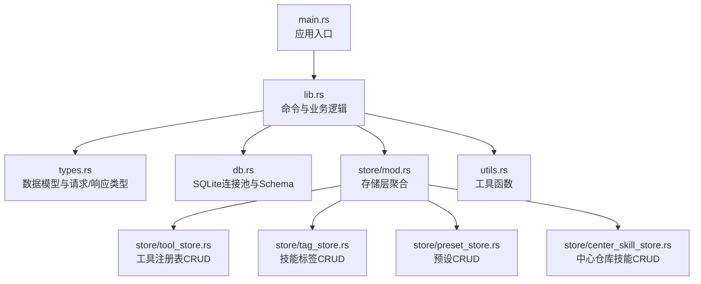
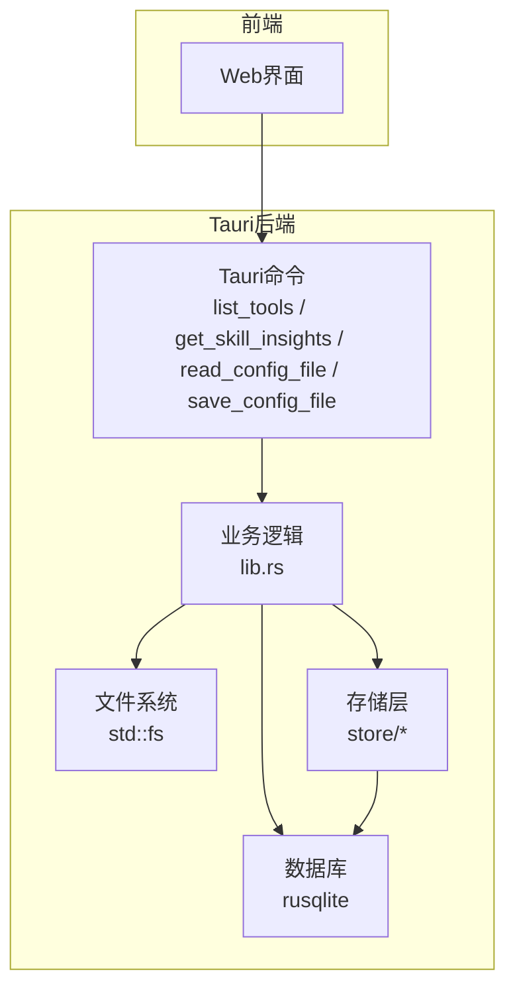
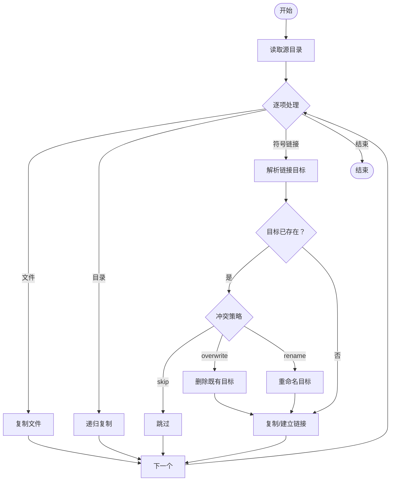
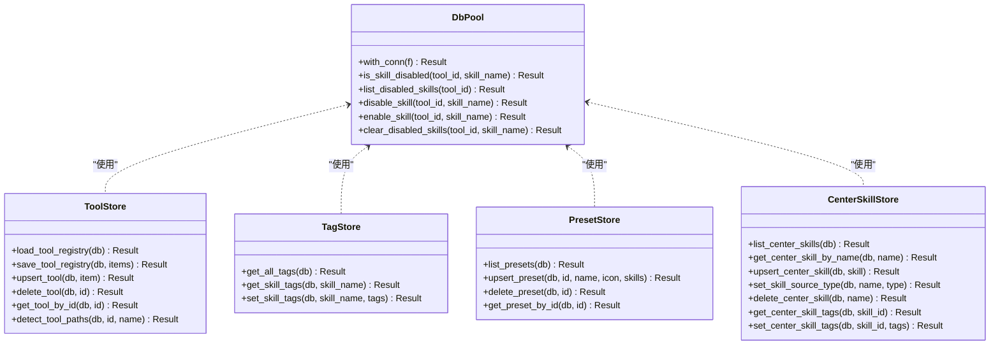
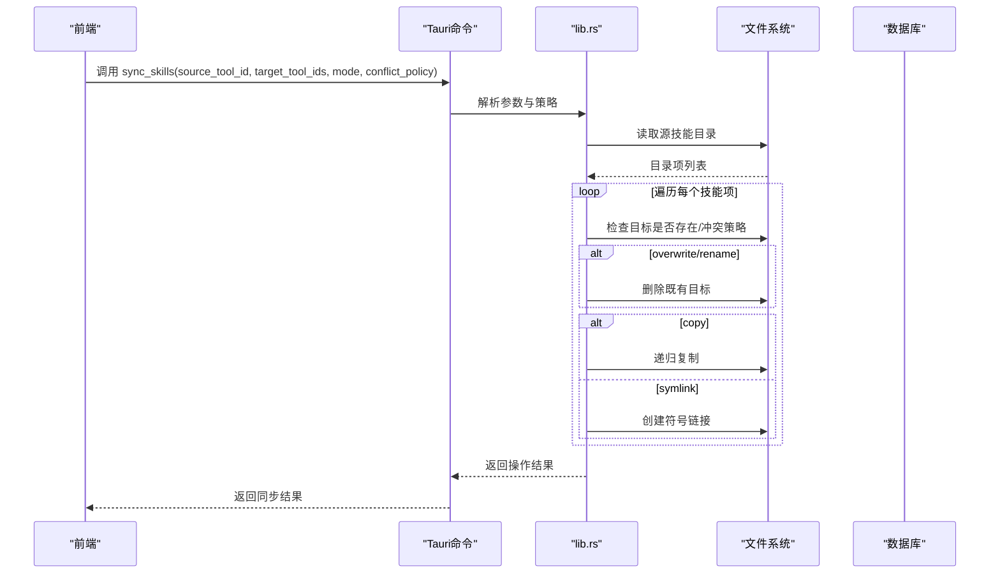
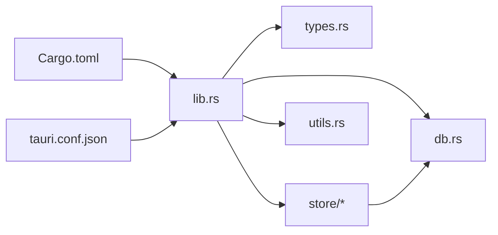

# 后端API接口

<cite>
**本文引用的文件**
- [src-tauri/src/main.rs](file://src-tauri/src/main.rs)
- [src-tauri/src/lib.rs](file://src-tauri/src/lib.rs)
- [src-tauri/src/types.rs](file://src-tauri/src/types.rs)
- [src-tauri/src/db.rs](file://src-tauri/src/db.rs)
- [src-tauri/src/utils.rs](file://src-tauri/src/utils.rs)
- [src-tauri/src/store/mod.rs](file://src-tauri/src/store/mod.rs)
- [src-tauri/src/store/tool_store.rs](file://src-tauri/src/store/tool_store.rs)
- [src-tauri/src/store/tag_store.rs](file://src-tauri/src/store/tag_store.rs)
- [src-tauri/src/store/preset_store.rs](file://src-tauri/src/store/preset_store.rs)
- [src-tauri/src/store/center_skill_store.rs](file://src-tauri/src/store/center_skill_store.rs)
- [src-tauri/Cargo.toml](file://src-tauri/Cargo.toml)
- [src-tauri/tauri.conf.json](file://src-tauri/tauri.conf.json)
</cite>

## 目录
1. [简介](#简介)
2. [项目结构](#项目结构)
3. [核心组件](#核心组件)
4. [架构总览](#架构总览)
5. [详细组件分析](#详细组件分析)
6. [依赖关系分析](#依赖关系分析)
7. [性能考量](#性能考量)
8. [故障排查指南](#故障排查指南)
9. [结论](#结论)
10. [附录](#附录)

## 简介
本文件面向AI工具箱后端API接口，聚焦于Tauri命令与Rust后端实现，涵盖以下主题：
- Tauri命令：list_tools、get_skill_insights、read_config_file、save_config_file 等
- 文件系统操作：文件读写、目录遍历、符号链接处理
- 数据库访问：SQLite操作、数据模型、索引与查询优化
- 工具注册与配置管理：工具路径检测、配置文件解析、技能目录扫描
- 技能同步算法：同步策略、冲突处理、批量操作
- 调用方式、参数校验、错误处理与性能优化建议
- 扩展点与自定义工具支持机制

## 项目结构
后端位于 src-tauri 目录，采用模块化组织：
- 入口与运行时：main.rs、lib.rs
- 类型定义：types.rs
- 数据库：db.rs
- 存储层：store/mod.rs 及其子模块（tool_store、tag_store、preset_store、center_skill_store）
- 工具箱能力：toolbox.rs（历史实现，当前以store/db为主）
- 工具函数：utils.rs
- 依赖与打包配置：Cargo.toml、tauri.conf.json

图表来源
- [src-tauri/src/main.rs:1-7](file://src-tauri/src/main.rs#L1-L7)
- [src-tauri/src/lib.rs:1-120](file://src-tauri/src/lib.rs#L1-L120)
- [src-tauri/src/store/mod.rs:1-5](file://src-tauri/src/store/mod.rs#L1-L5)

章节来源
- [src-tauri/src/main.rs:1-7](file://src-tauri/src/main.rs#L1-L7)
- [src-tauri/src/lib.rs:1-120](file://src-tauri/src/lib.rs#L1-L120)
- [src-tauri/src/store/mod.rs:1-5](file://src-tauri/src/store/mod.rs#L1-L5)

## 核心组件
- 数据模型与类型：统一的请求/响应结构体，用于Tauri命令参数与返回值
- 数据库层：SQLite连接池、Schema与索引、事务封装
- 存储层：工具注册表、技能标签、预设、中心仓库技能的CRUD
- 工具函数：主目录获取、路径拼接、时间戳、元数据读取
- Tauri命令：list_tools、get_skill_insights、read_config_file、save_config_file 等

章节来源
- [src-tauri/src/types.rs:1-367](file://src-tauri/src/types.rs#L1-L367)
- [src-tauri/src/db.rs:1-222](file://src-tauri/src/db.rs#L1-L222)
- [src-tauri/src/store/tool_store.rs:1-380](file://src-tauri/src/store/tool_store.rs#L1-L380)
- [src-tauri/src/store/tag_store.rs:1-78](file://src-tauri/src/store/tag_store.rs#L1-L78)
- [src-tauri/src/store/preset_store.rs:1-181](file://src-tauri/src/store/preset_store.rs#L1-L181)
- [src-tauri/src/store/center_skill_store.rs:1-299](file://src-tauri/src/store/center_skill_store.rs#L1-L299)
- [src-tauri/src/utils.rs:1-12](file://src-tauri/src/utils.rs#L1-L12)

## 架构总览
后端通过Tauri暴露命令给前端，命令在lib.rs中声明并实现，实际业务逻辑由store/db模块完成；文件系统与数据库是两大基础能力。

图表来源
- [src-tauri/src/lib.rs:615-800](file://src-tauri/src/lib.rs#L615-L800)
- [src-tauri/src/db.rs:1-222](file://src-tauri/src/db.rs#L1-L222)
- [src-tauri/src/store/mod.rs:1-5](file://src-tauri/src/store/mod.rs#L1-L5)

## 详细组件分析

### Tauri命令与实现要点
- list_tools
  - 功能：列出启用的工具，构建工具条目（含配置文件存在性、技能目录扫描）
  - 关键流程：加载工具注册表 → 过滤启用项 → 构建工具条目（扫描技能目录、读取描述、标签、禁用状态）
  - 参数与返回：无参数，返回工具条目数组
  - 错误处理：注册表读取失败、技能目录遍历异常均向上抛出
- get_skill_insights
  - 功能：基于多工具技能更新时间差，生成“领先者/落后者”洞察
  - 关键流程：构建工具条目 → 收集各工具技能更新时间 → 对每个技能按更新时间排序 → 计算落后差异与文件差异
  - 返回：按领先时间降序排列的洞察列表
- read_config_file / save_config_file
  - 功能：读取/保存指定工具的配置文件内容
  - 关键流程：定位工具与配置文件 → 读取/写入 → 写入前备份（若原文件存在）
  - 参数：工具ID、可选配置ID或路径、内容
  - 返回：包含备份路径的结果对象

章节来源
- [src-tauri/src/lib.rs:615-800](file://src-tauri/src/lib.rs#L615-L800)
- [src-tauri/src/types.rs:9-167](file://src-tauri/src/types.rs#L9-L167)

### 文件系统操作接口
- 目录遍历与符号链接处理
  - 遍历技能目录：读取目录项 → 判断是否为目录或符号链接指向目录 → 递归遍历避免循环引用（使用哈希集合记录规范路径）
  - 符号链接目标解析：读取链接目标 → 绝对路径直接使用，相对路径与父路径拼接
- 文件读写与备份
  - 读取：直接读取配置文件内容
  - 写入：确保父目录存在 → 若原文件存在则复制为备份 → 写入新内容
- 冲突策略与重命名
  - skip：跳过目标已存在的情况
  - overwrite：删除既有目标（文件/目录/符号链接）后覆盖
  - rename：追加时间戳或序号后缀，确保唯一性

图表来源
- [src-tauri/src/lib.rs:450-576](file://src-tauri/src/lib.rs#L450-L576)

章节来源
- [src-tauri/src/lib.rs:450-576](file://src-tauri/src/lib.rs#L450-L576)

### 数据库访问接口
- 连接池与Schema
  - 单例连接池：初始化时创建数据库文件并执行Schema脚本，包含索引
  - 迁移：动态检查列是否存在并添加（如is_system）
- 查询与事务
  - 工具注册表：查询所有工具及其配置文件，支持upsert、删除（系统工具保护）
  - 技能标签：按技能名读取/设置标签，使用事务保证一致性
  - 预设：增删改查，维护预设与技能的多对多关系
  - 中心仓库技能：CRUD与标签管理，支持按名称查询与按ID查询

图表来源
- [src-tauri/src/db.rs:1-222](file://src-tauri/src/db.rs#L1-L222)
- [src-tauri/src/store/tool_store.rs:1-380](file://src-tauri/src/store/tool_store.rs#L1-L380)
- [src-tauri/src/store/tag_store.rs:1-78](file://src-tauri/src/store/tag_store.rs#L1-L78)
- [src-tauri/src/store/preset_store.rs:1-181](file://src-tauri/src/store/preset_store.rs#L1-L181)
- [src-tauri/src/store/center_skill_store.rs:1-299](file://src-tauri/src/store/center_skill_store.rs#L1-L299)

章节来源
- [src-tauri/src/db.rs:1-222](file://src-tauri/src/db.rs#L1-L222)
- [src-tauri/src/store/tool_store.rs:1-380](file://src-tauri/src/store/tool_store.rs#L1-L380)
- [src-tauri/src/store/tag_store.rs:1-78](file://src-tauri/src/store/tag_store.rs#L1-L78)
- [src-tauri/src/store/preset_store.rs:1-181](file://src-tauri/src/store/preset_store.rs#L1-L181)
- [src-tauri/src/store/center_skill_store.rs:1-299](file://src-tauri/src/store/center_skill_store.rs#L1-L299)

### 工具注册与配置管理
- 默认工具规格与注册表
  - 根据平台生成默认工具规格（含配置文件与技能目录），首次运行创建注册表文件
  - 注册表持久化为JSON，包含工具ID、名称、启用状态、配置文件列表、技能目录、系统标记
- 工具路径探测
  - 根据工具名关键字匹配，探测配置文件与技能目录是否存在，返回结果
- 工具CRUD
  - 支持upsert、删除（系统工具不可删除）、按ID查询
  - 保存时清理旧配置并插入新配置，使用事务保证一致性

章节来源
- [src-tauri/src/lib.rs:209-249](file://src-tauri/src/lib.rs#L209-L249)
- [src-tauri/src/lib.rs:274-323](file://src-tauri/src/lib.rs#L274-L323)
- [src-tauri/src/lib.rs:325-431](file://src-tauri/src/lib.rs#L325-L431)
- [src-tauri/src/store/tool_store.rs:11-245](file://src-tauri/src/store/tool_store.rs#L11-L245)

### 技能同步算法
- 同步策略
  - 复制模式：递归复制源技能目录树，处理符号链接（目录/文件）
  - 符号链接模式：在目标位置创建符号链接，区分Windows/Linux平台
- 冲突处理
  - skip：不覆盖已存在目标
  - overwrite：删除既有目标后复制/链接
  - rename：追加时间戳或序号后缀，确保唯一
- 批量操作
  - 遍历源技能目录，逐项评估冲突策略并执行操作，记录每一步操作详情

图表来源
- [src-tauri/src/lib.rs:684-755](file://src-tauri/src/lib.rs#L684-L755)
- [src-tauri/src/lib.rs:450-576](file://src-tauri/src/lib.rs#L450-L576)

章节来源
- [src-tauri/src/lib.rs:684-755](file://src-tauri/src/lib.rs#L684-L755)
- [src-tauri/src/lib.rs:450-576](file://src-tauri/src/lib.rs#L450-L576)

### 数据模型与类型
- 响应类型：ConfigFile、SkillEntry、ToolEntry、SkillInsightEntry、SyncSkillOutcome 等
- 请求类型：SaveConfigRequest、SyncSkillsRequest、UpsertToolRequest、DeleteToolRequest、ApplyPresetRequest 等
- 工具函数：时间戳、路径转换、元数据修改时间、技能名称规范化、描述提取

章节来源
- [src-tauri/src/types.rs:9-367](file://src-tauri/src/types.rs#L9-L367)

## 依赖关系分析
- Rust生态：tauri、serde、rusqlite、notify、dirs
- 编译与打包：tauri.conf.json 定义应用信息、窗口样式、图标与打包目标

图表来源
- [src-tauri/src/lib.rs:1-20](file://src-tauri/src/lib.rs#L1-L20)
- [src-tauri/Cargo.toml:1-30](file://src-tauri/Cargo.toml#L1-L30)
- [src-tauri/tauri.conf.json:1-43](file://src-tauri/tauri.conf.json#L1-L43)

章节来源
- [src-tauri/Cargo.toml:1-30](file://src-tauri/Cargo.toml#L1-L30)
- [src-tauri/tauri.conf.json:1-43](file://src-tauri/tauri.conf.json#L1-L43)

## 性能考量
- 文件系统
  - 目录遍历：使用递归+去重（哈希集合）避免符号链接环路，减少重复I/O
  - 批量写入：写入前一次性创建父目录，减少多次系统调用
- 数据库
  - 使用事务批量写入工具注册表与预设技能，降低锁竞争
  - 合理索引（如工具配置、技能标签、预设技能、中心仓库标签）提升查询效率
- 命令调用
  - 将耗时操作（如技能目录扫描、文件复制/链接）放在后台线程或异步任务中执行，避免阻塞UI

## 故障排查指南
- 主目录不可用
  - 现象：无法获取用户主目录导致工具路径探测失败
  - 排查：确认运行环境用户主目录可用
  - 相关实现：[src-tauri/src/utils.rs:3-6](file://src-tauri/src/utils.rs#L3-L6)
- 数据库未初始化
  - 现象：调用数据库接口时报“数据库未初始化”
  - 排查：确保在应用启动时调用初始化函数
  - 相关实现：[src-tauri/src/db.rs:212-222](file://src-tauri/src/db.rs#L212-L222)
- 工具系统标记
  - 现象：尝试修改/删除系统工具报错
  - 排查：系统工具is_system字段为真，禁止修改与删除
  - 相关实现：[src-tauri/src/store/tool_store.rs:189-201](file://src-tauri/src/store/tool_store.rs#L189-L201)
- 技能同步冲突
  - 现象：目标已存在导致同步失败
  - 排查：选择合适的冲突策略（skip/overwrite/rename）
  - 相关实现：[src-tauri/src/lib.rs:591-613](file://src-tauri/src/lib.rs#L591-L613)

章节来源
- [src-tauri/src/utils.rs:3-6](file://src-tauri/src/utils.rs#L3-L6)
- [src-tauri/src/db.rs:212-222](file://src-tauri/src/db.rs#L212-L222)
- [src-tauri/src/store/tool_store.rs:189-201](file://src-tauri/src/store/tool_store.rs#L189-L201)
- [src-tauri/src/lib.rs:591-613](file://src-tauri/src/lib.rs#L591-L613)

## 结论
本后端以Tauri为桥接，结合SQLite与文件系统，提供了工具注册、配置管理、技能标签、预设与中心仓库技能的完整数据层支持；同时实现了灵活的技能同步算法与冲突处理策略。通过模块化的存储层与事务封装，保障了数据一致性与可扩展性。建议在生产环境中配合完善的日志与监控，持续优化I/O与数据库查询性能。

## 附录
- Tauri命令调用方式
  - 前端通过Tauri API调用命令，传入请求参数，接收响应或错误
  - 参数校验：命令实现中进行必填字段、格式与范围校验
  - 错误处理：统一返回字符串错误信息，便于前端展示
- 扩展点与自定义工具支持
  - 新增工具：在工具注册表中添加UserToolSpec，包含配置文件与技能目录
  - 自定义同步策略：可在命令层扩展冲突策略枚举与处理分支
  - 自定义存储：新增存储模块并在store/mod.rs聚合，遵循事务与索引约定