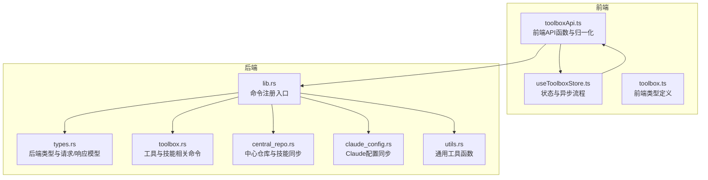
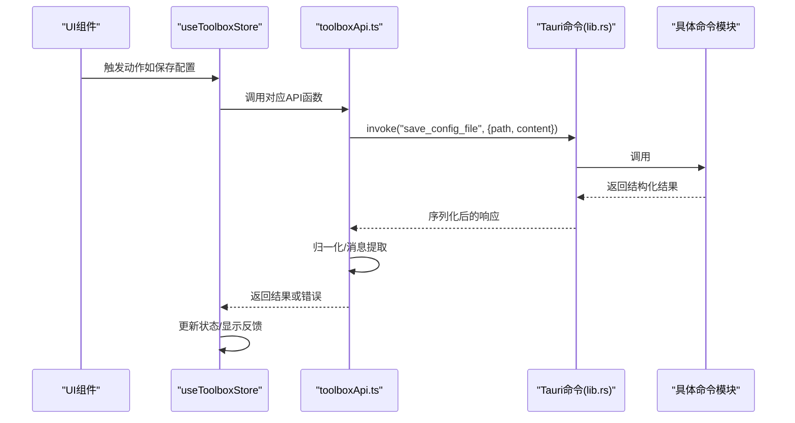
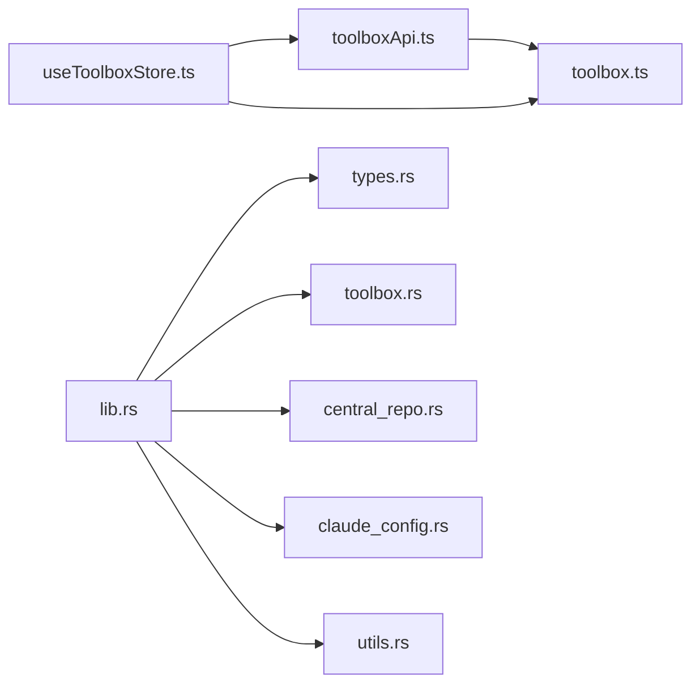

# API接口层

<cite>
**本文引用的文件**
- [toolboxApi.ts](file://src/lib/toolboxApi.ts)
- [useToolboxStore.ts](file://src/store/useToolboxStore.ts)
- [toolbox.ts](file://src/types/toolbox.ts)
- [lib.rs](file://src-tauri/src/lib.rs)
- [types.rs](file://src-tauri/src/types.rs)
- [main.rs](file://src-tauri/src/main.rs)
- [errorUtils.ts](file://src/utils/errorUtils.ts)
- [utils.rs](file://src-tauri/src/utils.rs)
- [central_repo.rs](file://src-tauri/src/central_repo.rs)
- [claude_config.rs](file://src-tauri/src/claude_config.rs)
- [toolbox.rs](file://src-tauri/src/toolbox.rs)
</cite>

## 目录
1. [简介](#简介)
2. [项目结构](#项目结构)
3. [核心组件](#核心组件)
4. [架构总览](#架构总览)
5. [详细组件分析](#详细组件分析)
6. [依赖关系分析](#依赖关系分析)
7. [性能考量](#性能考量)
8. [故障排查指南](#故障排查指南)
9. [结论](#结论)
10. [附录](#附录)

## 简介
本文件聚焦于AI工具箱的API接口层，系统化梳理前端Tauri命令封装的设计模式与实现细节，涵盖：
- 前端API函数的定义、参数校验与返回值处理
- 请求/响应处理机制、错误处理、重试策略与超时管理
- 安全性考虑（参数校验、权限控制、数据验证）
- 异步操作处理（loading状态管理、并发控制、错误恢复）
- 最佳实践（缓存策略、性能优化、用户体验设计）
- 典型使用场景与错误处理示例

## 项目结构
API接口层由三层组成：
- 前端层：通过 @tauri-apps/api 的 invoke 调用后端命令，封装统一的API函数与数据归一化逻辑
- 后端层：Rust Tauri命令模块，负责业务逻辑、文件系统操作、数据库访问与类型序列化
- 存储与状态层：Zustand Store集中管理UI状态、加载态、反馈信息与异步流程

图表来源
- [toolboxApi.ts:1-784](file://src/lib/toolboxApi.ts#L1-L784)
- [useToolboxStore.ts:1-556](file://src/store/useToolboxStore.ts#L1-L556)
- [lib.rs:1-800](file://src-tauri/src/lib.rs#L1-L800)
- [types.rs:1-367](file://src-tauri/src/types.rs#L1-L367)
- [toolbox.rs:1-200](file://src-tauri/src/toolbox.rs#L1-L200)
- [central_repo.rs:1-200](file://src-tauri/src/central_repo.rs#L1-L200)
- [claude_config.rs:1-200](file://src-tauri/src/claude_config.rs#L1-L200)
- [utils.rs:1-12](file://src-tauri/src/utils.rs#L1-L12)

章节来源
- [toolboxApi.ts:1-784](file://src/lib/toolboxApi.ts#L1-L784)
- [useToolboxStore.ts:1-556](file://src/store/useToolboxStore.ts#L1-L556)
- [lib.rs:1-800](file://src-tauri/src/lib.rs#L1-L800)

## 核心组件
- 前端API函数集合：封装所有Tauri命令调用，统一参数传递、响应解析与错误回退（含无Tauri环境下的mock行为）
- 数据归一化器：将后端返回的灵活结构转换为前端稳定类型，确保UI渲染一致性
- Zustand Store：集中管理加载态、错误反馈、选中项与异步流程，提供统一的状态更新与错误提示
- 后端命令模块：按功能域拆分（工具/技能、中心仓库、Claude配置），每个命令以 #[tauri::command] 注解注册

章节来源
- [toolboxApi.ts:387-783](file://src/lib/toolboxApi.ts#L387-L783)
- [useToolboxStore.ts:145-556](file://src/store/useToolboxStore.ts#L145-L556)
- [lib.rs:615-800](file://src-tauri/src/lib.rs#L615-L800)

## 架构总览
前端通过 invoke 调用后端命令，后端命令执行业务逻辑并返回结构化结果。前端API函数负责：
- 参数校验与构造
- 调用 invoke 并解析响应
- 归一化为前端类型
- 提供友好的用户反馈（成功/失败/提示）

图表来源
- [toolboxApi.ts:419-436](file://src/lib/toolboxApi.ts#L419-L436)
- [lib.rs:615-628](file://src-tauri/src/lib.rs#L615-L628)
- [types.rs:47-67](file://src-tauri/src/types.rs#L47-L67)

## 详细组件分析

### 前端API函数与归一化器
- 设计要点
  - 统一的 hasTauriRuntime 检测，无运行时则返回mock数据或空结果，保证开发体验
  - invoke 调用时采用命名参数对象，便于扩展与类型约束
  - 归一化器对后端灵活响应进行健壮解析，支持多种字段别名与缺失字段
  - 错误消息提取统一走 getErrorMessage，避免直接打印未知错误
- 关键函数
  - 列表与洞察：listTools、getSkillInsights
  - 配置文件：readConfigFile、saveConfigFile、listConfigBackups、openPathInFinder
  - 技能同步：syncSkills、deleteSkill
  - 工具注册表：listToolRegistry、upsertToolRegistryItem、deleteToolRegistryItem、detectToolPaths
  - 中心仓库与技能：discoverCenterSkills、batchImportToCenter、setSkillCategory、batchSyncFromCenter、listCenterSkills、deleteCenterSkill、syncFromCenter、importToCenter、installSkillFromGitToCenter、getSkillDetail
  - 预设：listPresets、savePreset、deletePreset
  - Claude配置：getClaudeConfigDiff、applyClaudeConfigFullSync、listClaudeSettingsSnapshots、restoreCswitchDbFromBackup
  - 其他：getHomeDirPath
- 归一化策略
  - 工具/技能/配置文件：多字段别名映射、去重、类型转换
  - 技能洞察：基于时间戳比较，计算落后工具与差异文件
  - 预设/注册表：严格字段校验与默认值填充
  - Claude配置：差异字段分类、快照元数据、排除字段策略

章节来源
- [toolboxApi.ts:104-182](file://src/lib/toolboxApi.ts#L104-L182)
- [toolboxApi.ts:184-302](file://src/lib/toolboxApi.ts#L184-L302)
- [toolboxApi.ts:387-783](file://src/lib/toolboxApi.ts#L387-L783)
- [toolbox.ts:1-152](file://src/types/toolbox.ts#L1-L152)

### 后端命令与类型系统
- 命令注册
  - #[tauri::command] 注解将Rust函数暴露给前端invoke调用
  - 命令按功能域拆分：工具/技能、中心仓库、Claude配置等
- 类型系统
  - 前后端类型一一对应，使用 serde 的 camelCase 序列化规则
  - 请求/响应结构体明确字段含义，便于前后端契约约束
- 工具与技能
  - 扫描工具目录、构建工具条目、读取技能描述、冲突策略处理
- 中心仓库
  - 发现未入库技能、导入技能、批量同步、删除技能、设置分类
- Claude配置
  - 计算配置差异、生成快照、应用整段同步、备份恢复

章节来源
- [lib.rs:615-800](file://src-tauri/src/lib.rs#L615-L800)
- [types.rs:9-166](file://src-tauri/src/types.rs#L9-L166)
- [toolbox.rs:1-200](file://src-tauri/src/toolbox.rs#L1-L200)
- [central_repo.rs:1-200](file://src-tauri/src/central_repo.rs#L1-L200)
- [claude_config.rs:1-200](file://src-tauri/src/claude_config.rs#L1-L200)

### Zustand Store与异步流程
- 状态管理
  - 加载态：isToolsLoading、isConfigLoading、isSaving、isSyncing、isInsightsLoading、isClaudeConfigLoading、isClaudeConfigApplying、isSkillDetailLoading、isPresetsLoading
  - 反馈：OperationFeedback，统一错误/成功/提示展示
  - 选中项：selectedToolId、selectedConfigId、selectedSkillIds、targetToolId
- 流程控制
  - 初始化：refreshTools + refreshInsights
  - 读取配置：selectConfigFile -> readConfigFile -> 归并到工具树
  - 保存配置：saveConfigFile -> 更新原内容与dirty标记
  - 技能同步：runSync -> syncSkills -> 刷新工具与洞察
  - Claude配置：loadClaudeConfigDiff -> applyClaudeConfigFullSync
  - 预设：create/remove/applyPreset
- 错误处理
  - try/catch 包裹API调用，统一通过 buildFeedback 输出
  - getErrorMessage 提取可读错误消息

章节来源
- [useToolboxStore.ts:32-84](file://src/store/useToolboxStore.ts#L32-L84)
- [useToolboxStore.ts:174-556](file://src/store/useToolboxStore.ts#L174-L556)
- [errorUtils.ts:1-10](file://src/utils/errorUtils.ts#L1-L10)

### 请求/响应处理机制与错误处理
- 参数校验
  - 前端：hasTauriRuntime、参数存在性检查、类型转换（数字/字符串）
  - 后端：sanitize_upsert_request、normalize_tool_id、sanitize_skill_name
- 响应解析
  - readContentResponse、readMessageResponse、normalizeToolsResponse、normalizeSkillInsightsResponse
- 错误处理
  - 前端：catch -> buildFeedback -> set(feedback)
  - 后端：Result<T, String> -> 错误字符串传递到前端
- Mock回退
  - 无Tauri环境时，前端API返回mock数据或空数组/空字符串，保障开发调试

章节来源
- [toolboxApi.ts:104-141](file://src/lib/toolboxApi.ts#L104-L141)
- [toolboxApi.ts:323-341](file://src/lib/toolboxApi.ts#L323-L341)
- [lib.rs:284-323](file://src-tauri/src/lib.rs#L284-L323)
- [types.rs:289-294](file://src-tauri/src/types.rs#L289-L294)

### 异步操作处理模式
- loading状态管理
  - 每个异步操作前设置对应loading标志位，完成后清理
  - UI层根据loading态显示骨架屏或禁用按钮
- 并发控制
  - Store内串行化关键流程（如applyPreset循环同步多个工具），避免竞态
  - 对独立操作（如批量导入）可并行，但需聚合结果与反馈
- 错误恢复
  - 失败时保留原始内容与选中项，允许用户重试
  - 成功后刷新相关数据（工具列表、洞察、预设）

章节来源
- [useToolboxStore.ts:307-339](file://src/store/useToolboxStore.ts#L307-L339)
- [useToolboxStore.ts:523-554](file://src/store/useToolboxStore.ts#L523-L554)

### 安全性考虑
- 参数校验
  - 工具ID规范化、技能名合法性检查、必填字段校验
- 权限控制
  - 系统工具不可修改（后端限制）
  - 文件系统操作仅限用户主目录范围
- 数据验证
  - JSON/文本内容解析与校验，避免注入
  - 快照与备份路径校验，防止越权访问

章节来源
- [lib.rs:284-323](file://src-tauri/src/lib.rs#L284-L323)
- [types.rs:289-294](file://src-tauri/src/types.rs#L289-L294)
- [claude_config.rs:138-145](file://src-tauri/src/claude_config.rs#L138-L145)

### 性能优化与缓存策略
- 前端缓存
  - 已加载配置文件内容缓存，避免重复读取
  - 工具与技能列表缓存，配合刷新按钮
- 后端优化
  - 目录扫描与文件元数据读取尽量复用
  - 差异计算使用哈希与时间戳，减少I/O
- 用户体验
  - 骨架屏与占位符提升感知性能
  - 成功/失败反馈即时呈现，减少等待焦虑

章节来源
- [useToolboxStore.ts:256-282](file://src/store/useToolboxStore.ts#L256-L282)
- [toolboxApi.ts:387-405](file://src/lib/toolboxApi.ts#L387-L405)

### 使用场景与最佳实践
- 场景一：读取并编辑配置文件
  - 步骤：selectTool -> selectConfigFile -> setEditorContent -> saveCurrentFile
  - 最佳实践：保存前校验内容变化，避免无效写入；保存后刷新原内容与dirty标记
- 场景二：批量同步技能
  - 步骤：runSync -> syncSkills -> 刷新工具与洞察
  - 最佳实践：选择多个目标工具时注意冲突策略；成功后聚合反馈信息
- 场景三：Claude配置同步
  - 步骤：setClaudeConfigBaseline -> loadClaudeConfigDiff -> applyClaudeConfigSync
  - 最佳实践：先查看差异再应用；应用后自动刷新差异
- 场景四：中心仓库技能管理
  - 步骤：discoverCenterSkills -> batchImportToCenter -> batchSyncFromCenter
  - 最佳实践：导入后立即同步到目标工具，保持一致性

章节来源
- [useToolboxStore.ts:174-410](file://src/store/useToolboxStore.ts#L174-L410)
- [useToolboxStore.ts:412-459](file://src/store/useToolboxStore.ts#L412-L459)
- [useToolboxStore.ts:523-554](file://src/store/useToolboxStore.ts#L523-L554)

## 依赖关系分析
- 前端依赖
  - @tauri-apps/api.invoke：与后端命令通信
  - 自定义API函数：toolboxApi.ts
  - 状态管理：Zustand useToolboxStore.ts
  - 类型定义：src/types/toolbox.ts
- 后端依赖
  - tauri::command：命令导出
  - serde：序列化/反序列化
  - std::fs/path：文件系统操作
  - sqlite：数据库访问（通过db.rs）
- 关键耦合点
  - 前后端类型必须保持camelCase命名一致
  - 命令参数与返回值结构需严格匹配

图表来源
- [toolboxApi.ts:1-21](file://src/lib/toolboxApi.ts#L1-L21)
- [useToolboxStore.ts:1-31](file://src/store/useToolboxStore.ts#L1-L31)
- [lib.rs:1-18](file://src-tauri/src/lib.rs#L1-L18)
- [types.rs:1-5](file://src-tauri/src/types.rs#L1-L5)

章节来源
- [toolboxApi.ts:1-21](file://src/lib/toolboxApi.ts#L1-L21)
- [useToolboxStore.ts:1-31](file://src/store/useToolboxStore.ts#L1-L31)
- [lib.rs:1-18](file://src-tauri/src/lib.rs#L1-L18)

## 性能考量
- I/O优化
  - 目录遍历与文件读取尽量批量处理，避免多次系统调用
  - 缓存文件元数据与哈希，减少重复计算
- 序列化开销
  - 结构体字段精简，避免冗余字段
  - 使用合适的数据类型（u64时间戳、布尔标志位）
- 并发与锁
  - 对共享资源（数据库、文件）加锁或串行化访问
- 内存占用
  - 大文件内容按需加载，避免一次性读入内存

## 故障排查指南
- 常见问题
  - 无Tauri运行时：前端API返回mock数据，确认开发环境
  - 文件不存在或权限不足：检查路径与权限，必要时引导用户打开Finder
  - 技能名非法：后端会拒绝不合法名称，前端需提示用户
  - 同步冲突：根据冲突策略选择skip/overwrite/rename
- 排查步骤
  - 查看Store中的feedback，定位错误类型与消息
  - 检查invoke参数是否符合后端类型定义
  - 核对文件路径是否存在且可读写
  - 对Claude配置差异，确认cc-switch数据库状态与快照数量
- 建议
  - 为关键操作添加重试机制（如网络/文件系统不稳定）
  - 对长时间操作提供进度反馈与取消能力

章节来源
- [useToolboxStore.ts:198-201](file://src/store/useToolboxStore.ts#L198-L201)
- [lib.rs:284-323](file://src-tauri/src/lib.rs#L284-L323)
- [claude_config.rs:151-191](file://src-tauri/src/claude_config.rs#L151-L191)

## 结论
本API接口层通过“前端统一API + 后端命令模块 + Store状态管理”的架构，实现了：
- 明确的职责分离与类型契约
- 健壮的参数校验与错误处理
- 友好的异步流程与反馈机制
- 可扩展的功能域划分（工具/技能、中心仓库、Claude配置）
建议在后续迭代中进一步引入：
- 超时与重试策略（如网络不稳定场景）
- 并发队列与节流控制
- 更细粒度的日志与埋点

## 附录
- 主要API函数清单
  - 工具与技能：listTools、getSkillInsights、syncSkills、deleteSkill、toggleSkillEnabled
  - 配置文件：readConfigFile、saveConfigFile、listConfigBackups、openPathInFinder
  - 工具注册表：listToolRegistry、upsertToolRegistryItem、deleteToolRegistryItem、detectToolPaths
  - 中心仓库：discoverCenterSkills、batchImportToCenter、setSkillCategory、batchSyncFromCenter、listCenterSkills、deleteCenterSkill、syncFromCenter、importToCenter、installSkillFromGitToCenter、getSkillDetail
  - 预设：listPresets、savePreset、deletePreset
  - Claude配置：getClaudeConfigDiff、applyClaudeConfigFullSync、listClaudeSettingsSnapshots、restoreCswitchDbFromBackup
  - 其他：getHomeDirPath

章节来源
- [toolboxApi.ts:387-783](file://src/lib/toolboxApi.ts#L387-L783)