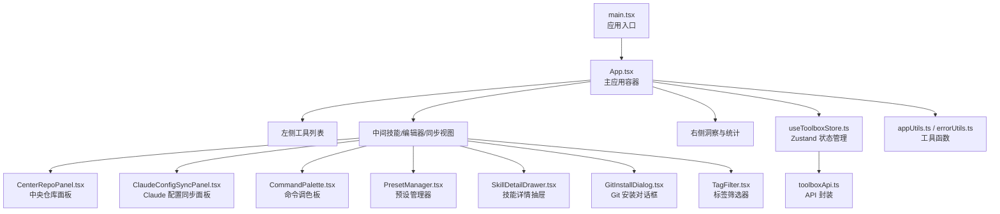
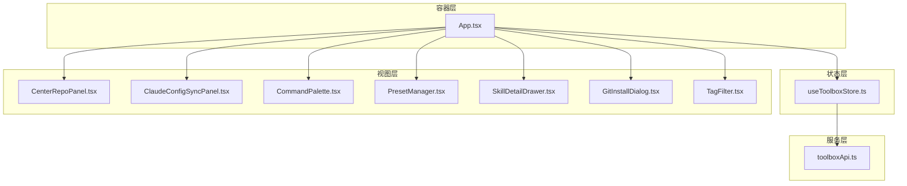
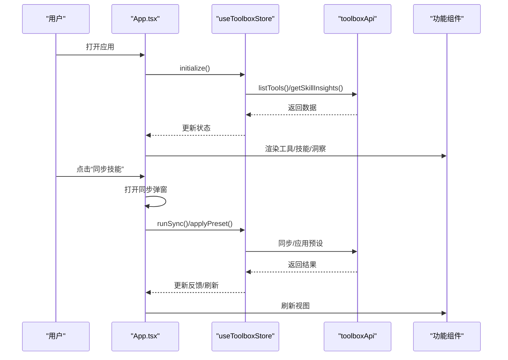
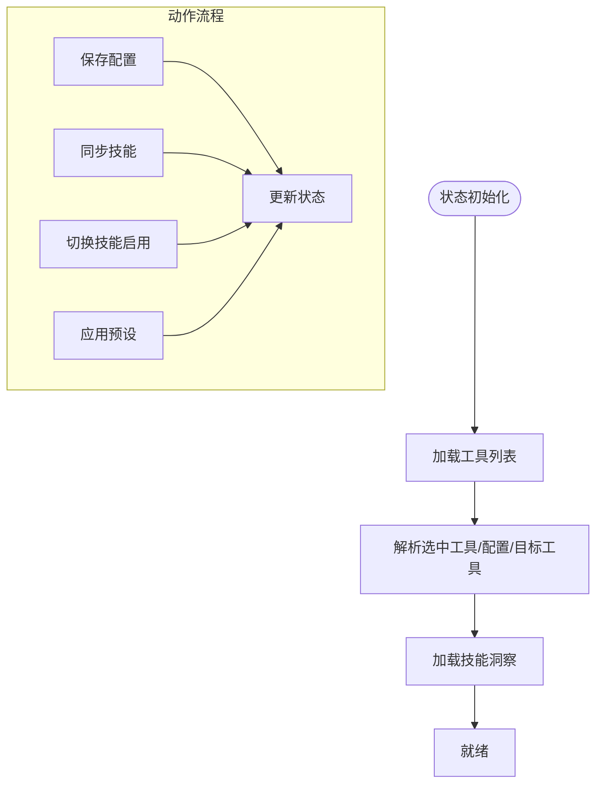
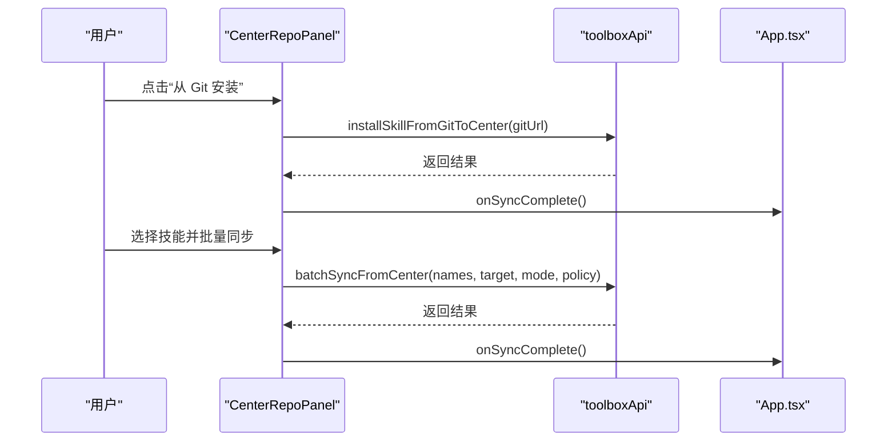
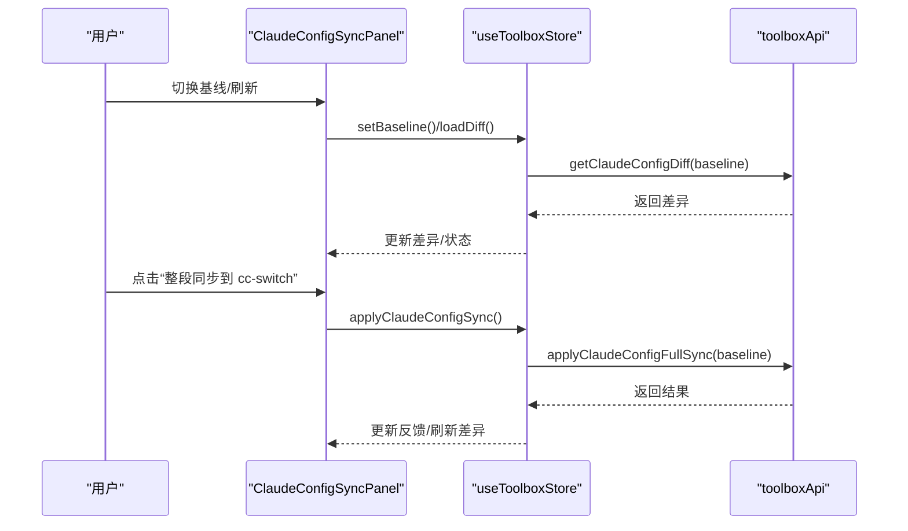
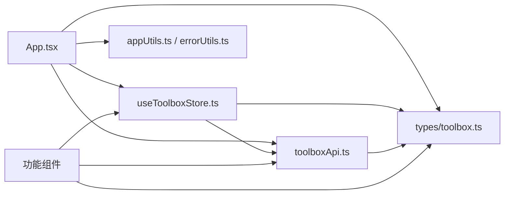

# React组件体系

<cite>
**本文档引用的文件**
- [src/App.tsx](file://src/App.tsx)
- [src/main.tsx](file://src/main.tsx)
- [src/store/useToolboxStore.ts](file://src/store/useToolboxStore.ts)
- [src/types/toolbox.ts](file://src/types/toolbox.ts)
- [src/lib/toolboxApi.ts](file://src/lib/toolboxApi.ts)
- [src/components/CenterRepoPanel.tsx](file://src/components/CenterRepoPanel.tsx)
- [src/components/ClaudeConfigSyncPanel.tsx](file://src/components/ClaudeConfigSyncPanel.tsx)
- [src/components/CommandPalette.tsx](file://src/components/CommandPalette.tsx)
- [src/components/PresetManager.tsx](file://src/components/PresetManager.tsx)
- [src/components/SkillDetailDrawer.tsx](file://src/components/SkillDetailDrawer.tsx)
- [src/components/GitInstallDialog.tsx](file://src/components/GitInstallDialog.tsx)
- [src/components/TagFilter.tsx](file://src/components/TagFilter.tsx)
- [src/utils/appUtils.ts](file://src/utils/appUtils.ts)
- [src/utils/errorUtils.ts](file://src/utils/errorUtils.ts)
</cite>

## 目录
1. [简介](#简介)
2. [项目结构](#项目结构)
3. [核心组件](#核心组件)
4. [架构总览](#架构总览)
5. [组件详解](#组件详解)
6. [依赖关系分析](#依赖关系分析)
7. [性能考量](#性能考量)
8. [故障排查指南](#故障排查指南)
9. [结论](#结论)
10. [附录](#附录)

## 简介
本项目是一个基于 React + Tauri 的桌面应用，围绕“AI 工具箱”构建，提供工具配置管理、技能同步、中央仓库、配置差异对比与同步等功能。组件体系采用分层设计：顶层应用容器负责全局状态与布局，功能组件负责具体业务能力，工具函数模块提供通用能力。

## 项目结构
项目采用按功能域划分的目录结构，核心入口为 main.tsx，应用根组件为 App.tsx，状态管理使用 Zustand，类型定义集中在 types/toolbox.ts，API 层封装在 toolboxApi.ts，功能组件位于 components 目录。

**图表来源**
- [src/main.tsx:1-12](file://src/main.tsx#L1-L12)
- [src/App.tsx:1-1769](file://src/App.tsx#L1-L1769)
- [src/store/useToolboxStore.ts:1-556](file://src/store/useToolboxStore.ts#L1-L556)
- [src/lib/toolboxApi.ts:1-784](file://src/lib/toolboxApi.ts#L1-L784)

**章节来源**
- [src/main.tsx:1-12](file://src/main.tsx#L1-L12)
- [src/App.tsx:1-1769](file://src/App.tsx#L1-L1769)

## 核心组件
- 主应用容器 App.tsx：负责全局布局、主题切换、窗口控制、工具列表与技能视图、编辑器、洞察面板、工具管理、同步弹窗等。
- 状态管理 useToolboxStore.ts：集中管理工具、配置、技能、洞察、预设、反馈、Claude 配置同步等状态，提供 CRUD、同步、保存、洞察刷新等动作。
- 类型定义 types/toolbox.ts：统一描述工具、技能、配置文件、洞察、预设、Claude 配置差异等数据结构。
- API 封装 toolboxApi.ts：统一调用 Tauri 命令，提供工具列表、技能同步、配置读写、中央仓库、预设、Claude 配置差异等接口。
- 功能组件：CenterRepoPanel、ClaudeConfigSyncPanel、CommandPalette、PresetManager、SkillDetailDrawer、GitInstallDialog、TagFilter 等。

**章节来源**
- [src/store/useToolboxStore.ts:1-556](file://src/store/useToolboxStore.ts#L1-L556)
- [src/types/toolbox.ts:1-152](file://src/types/toolbox.ts#L1-L152)
- [src/lib/toolboxApi.ts:1-784](file://src/lib/toolboxApi.ts#L1-L784)

## 架构总览
应用采用“容器组件 + 功能组件”的分层架构：
- 容器层：App.tsx 负责布局、主题、窗口控制、全局状态初始化与联动。
- 状态层：useToolboxStore.ts 提供集中式状态与动作，避免组件间重复逻辑。
- 服务层：toolboxApi.ts 封装 Tauri 命令调用，屏蔽平台差异。
- 视图层：各功能组件负责具体 UI 与交互，通过 props 和回调与容器/状态层通信。

**图表来源**
- [src/App.tsx:1-1769](file://src/App.tsx#L1-L1769)
- [src/store/useToolboxStore.ts:1-556](file://src/store/useToolboxStore.ts#L1-L556)
- [src/lib/toolboxApi.ts:1-784](file://src/lib/toolboxApi.ts#L1-L784)
- [src/components/CenterRepoPanel.tsx:1-852](file://src/components/CenterRepoPanel.tsx#L1-L852)
- [src/components/ClaudeConfigSyncPanel.tsx:1-438](file://src/components/ClaudeConfigSyncPanel.tsx#L1-L438)
- [src/components/CommandPalette.tsx:1-320](file://src/components/CommandPalette.tsx#L1-L320)
- [src/components/PresetManager.tsx:1-330](file://src/components/PresetManager.tsx#L1-L330)
- [src/components/SkillDetailDrawer.tsx:1-120](file://src/components/SkillDetailDrawer.tsx#L1-L120)
- [src/components/GitInstallDialog.tsx:1-151](file://src/components/GitInstallDialog.tsx#L1-L151)
- [src/components/TagFilter.tsx:1-58](file://src/components/TagFilter.tsx#L1-L58)

## 组件详解

### 主应用容器 App.tsx
- 职责
  - 全局主题与算法选择，根据系统主题与用户偏好动态切换。
  - 初始化工具列表与洞察，处理窗口拖拽、最大化/最小化/关闭等桌面行为。
  - 管理工具列表、技能列表、配置编辑器、洞察面板、工具注册表管理、技能同步弹窗等。
  - 通过 useToolboxStore 提供的动作与状态驱动子组件。
- 关键特性
  - 使用 startTransition 延迟初始化，提升首屏体验。
  - 使用 useMemo 优化过滤与排序逻辑，减少不必要的重渲染。
  - 通过 ConfigProvider 与 Ant Design 主题系统集成。
  - 支持命令调色板打开、编辑器模式切换、洞察面板联动。

**图表来源**
- [src/App.tsx:138-610](file://src/App.tsx#L138-L610)
- [src/store/useToolboxStore.ts:174-384](file://src/store/useToolboxStore.ts#L174-L384)
- [src/lib/toolboxApi.ts:438-465](file://src/lib/toolboxApi.ts#L438-L465)

**章节来源**
- [src/App.tsx:138-610](file://src/App.tsx#L138-L610)
- [src/App.tsx:830-1599](file://src/App.tsx#L830-L1599)

### 状态管理 useToolboxStore.ts
- 职责
  - 维护工具列表、选中工具、选中配置、技能、洞察、预设、反馈、Claude 配置差异等状态。
  - 提供动作：初始化、刷新工具、刷新洞察、选择工具/配置、设置编辑器内容、保存当前文件、运行同步、切换技能启用状态、加载 Claude 配置差异、应用同步、预设管理等。
- 设计要点
  - 使用 create 构建 Zustand Store，集中管理复杂状态与副作用。
  - 通过 mergeConfigFile 等工具函数保证状态不可变更新。
  - 通过 buildFeedback 统一反馈消息，便于 UI 展示。

**图表来源**
- [src/store/useToolboxStore.ts:145-556](file://src/store/useToolboxStore.ts#L145-L556)

**章节来源**
- [src/store/useToolboxStore.ts:145-556](file://src/store/useToolboxStore.ts#L145-L556)

### 类型定义 types/toolbox.ts
- 职责
  - 定义工具、技能、配置文件、洞察、预设、Claude 配置差异等核心数据结构。
  - 统一枚举类型：SyncMode、ConflictStrategy、FeedbackTone 等。
- 作用
  - 为 API 层与组件层提供强类型保障，降低耦合度。

**章节来源**
- [src/types/toolbox.ts:1-152](file://src/types/toolbox.ts#L1-L152)

### API 封装 toolboxApi.ts
- 职责
  - 封装 Tauri invoke 调用，提供 listTools、readConfigFile、saveConfigFile、syncSkills、listCenterSkills、batchSyncFromCenter、getSkillDetail、listPresets、savePreset、deletePreset、getClaudeConfigDiff、applyClaudeConfigFullSync 等接口。
  - 提供工具函数：路径规范化、语言识别、响应标准化等。
- 特性
  - 在非 Tauri 环境下提供 mock 数据，便于前端开发与预览。
  - 统一错误消息提取，简化异常处理。

**章节来源**
- [src/lib/toolboxApi.ts:1-784](file://src/lib/toolboxApi.ts#L1-L784)
- [src/utils/appUtils.ts:1-27](file://src/utils/appUtils.ts#L1-L27)
- [src/utils/errorUtils.ts:1-10](file://src/utils/errorUtils.ts#L1-L10)

### 功能组件

#### CenterRepoPanel 中央仓库面板
- 职责
  - 展示中央仓库技能，支持从 Git 安装、从工具导入、批量同步、分类标记、扫描发现等。
- 关键交互
  - 通过 props 接收 tools、syncMode、conflictStrategy，并通过 onClose/onSyncComplete 回调与父组件通信。
  - 使用 Modal/Drawer 弹窗承载复杂操作流。

**图表来源**
- [src/components/CenterRepoPanel.tsx:55-852](file://src/components/CenterRepoPanel.tsx#L55-L852)
- [src/lib/toolboxApi.ts:636-721](file://src/lib/toolboxApi.ts#L636-L721)

**章节来源**
- [src/components/CenterRepoPanel.tsx:55-852](file://src/components/CenterRepoPanel.tsx#L55-L852)

#### ClaudeConfigSyncPanel 配置同步面板
- 职责
  - 对比 settings.json 与 cc-switch 公共配置差异，支持整段同步到 cc-switch。
- 关键交互
  - 通过 useToolboxStore 获取差异、基线、加载状态，支持切换基线、刷新、确认同步等。

**图表来源**
- [src/components/ClaudeConfigSyncPanel.tsx:101-438](file://src/components/ClaudeConfigSyncPanel.tsx#L101-L438)
- [src/store/useToolboxStore.ts:412-459](file://src/store/useToolboxStore.ts#L412-L459)
- [src/lib/toolboxApi.ts:756-779](file://src/lib/toolboxApi.ts#L756-L779)

**章节来源**
- [src/components/ClaudeConfigSyncPanel.tsx:101-438](file://src/components/ClaudeConfigSyncPanel.tsx#L101-L438)

#### CommandPalette 命令调色板
- 职责
  - 提供全局搜索与快速跳转：搜索工具与技能，支持键盘快捷键（Cmd/Ctrl+K 打开、上下导航、Enter 选择）。
- 关键交互
  - 通过 props 接收 tools/skills，暴露 onSelectTool/onSelectSkill/onClose/onOpen 回调。

**章节来源**
- [src/components/CommandPalette.tsx:32-320](file://src/components/CommandPalette.tsx#L32-L320)

#### PresetManager 预设管理器
- 职责
  - 创建、应用、删除技能预设；支持多工具批量应用。
- 关键交互
  - 通过 props 接收 presets/tools/allSkills，暴露 onApply/onCreate/onDelete 回调。

**章节来源**
- [src/components/PresetManager.tsx:171-330](file://src/components/PresetManager.tsx#L171-L330)

#### SkillDetailDrawer 技能详情抽屉
- 职责
  - 展示技能的 skill.md 与 README.md 内容，支持加载状态与空态提示。
- 关键交互
  - 通过 props 接收 open/detail/isLoading/onClose。

**章节来源**
- [src/components/SkillDetailDrawer.tsx:18-120](file://src/components/SkillDetailDrawer.tsx#L18-L120)

#### GitInstallDialog Git 安装对话框
- 职责
  - 从 Git 仓库安装技能到指定工具，支持自动推断技能名称与自定义名称。
- 关键交互
  - 通过 props 接收 tools/isInstalling/onInstall/onClose。

**章节来源**
- [src/components/GitInstallDialog.tsx:30-151](file://src/components/GitInstallDialog.tsx#L30-L151)

#### TagFilter 标签筛选器
- 职责
  - 提供可勾选标签的筛选与清空功能。
- 关键交互
  - 通过 props 接收 allTags/selectedTags/onChange。

**章节来源**
- [src/components/TagFilter.tsx:11-58](file://src/components/TagFilter.tsx#L11-L58)

## 依赖关系分析

**图表来源**
- [src/App.tsx:1-1769](file://src/App.tsx#L1-L1769)
- [src/store/useToolboxStore.ts:1-556](file://src/store/useToolboxStore.ts#L1-L556)
- [src/lib/toolboxApi.ts:1-784](file://src/lib/toolboxApi.ts#L1-L784)
- [src/types/toolbox.ts:1-152](file://src/types/toolbox.ts#L1-L152)
- [src/utils/appUtils.ts:1-27](file://src/utils/appUtils.ts#L1-L27)
- [src/utils/errorUtils.ts:1-10](file://src/utils/errorUtils.ts#L1-L10)

**章节来源**
- [src/App.tsx:1-1769](file://src/App.tsx#L1-L1769)
- [src/store/useToolboxStore.ts:1-556](file://src/store/useToolboxStore.ts#L1-L556)
- [src/lib/toolboxApi.ts:1-784](file://src/lib/toolboxApi.ts#L1-L784)

## 性能考量
- 状态与计算优化
  - 使用 useMemo 优化技能过滤、排序、选项生成等昂贵计算，避免每次渲染都重新计算。
  - 使用 startTransition 延迟初始化与大型任务，提升首屏与切换流畅度。
- 渲染优化
  - 使用分割视图与条件渲染，仅在需要时渲染编辑器或同步面板。
  - 列表渲染中使用 key 与受控组件，减少重排与重绘。
- 网络与 IO
  - 通过 store 的 loading 状态与防抖/节流策略，避免频繁请求。
  - 自动保存采用定时器去抖，减少写入频率。
- 主题与 Monaco
  - 根据主题动态切换 Monaco 主题，避免不必要的组件重建。

[本节为通用指导，无需特定文件引用]

## 故障排查指南
- 常见问题
  - 工具列表为空：检查 initialize 是否正确调用，确认 Tauri 环境与权限。
  - 同步失败：查看反馈消息与错误提取工具，确认源/目标工具与技能选择。
  - Claude 配置同步失败：检查 cc-switch 是否运行、是否有写锁、是否选择了正确的基线。
- 定位手段
  - 使用 feedback 字段查看操作结果与错误详情。
  - 使用 getErrorMessage 统一提取错误消息，便于 UI 提示。
  - 在非 Tauri 环境下，mock 数据可用于验证 UI 逻辑。

**章节来源**
- [src/store/useToolboxStore.ts:86-95](file://src/store/useToolboxStore.ts#L86-L95)
- [src/utils/errorUtils.ts:5-9](file://src/utils/errorUtils.ts#L5-L9)

## 结论
本项目通过清晰的分层架构与集中式状态管理，实现了工具配置、技能同步、中央仓库、洞察与 Claude 配置同步等复杂功能。组件职责明确、通信方式规范，具备良好的可维护性与扩展性。建议后续持续完善类型覆盖、错误边界与性能监控，进一步提升用户体验。

## 附录
- 最佳实践
  - 使用 useToolboxStore 的动作封装复杂业务，避免在组件内直接调用 API。
  - 对于昂贵计算使用 useMemo/useCallback，结合条件渲染减少重渲染。
  - 通过 props 明确组件边界，事件回调与状态更新分离。
  - 使用统一的错误处理与反馈机制，确保用户获得一致的提示体验。

[本节为总结性内容，无需特定文件引用]