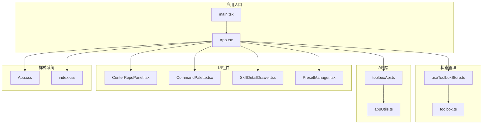
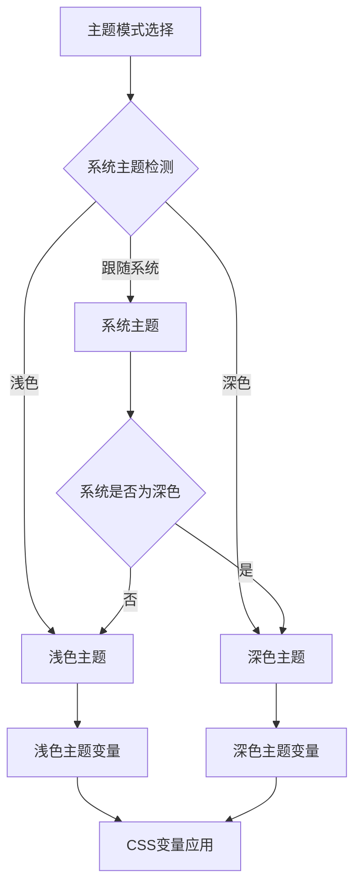
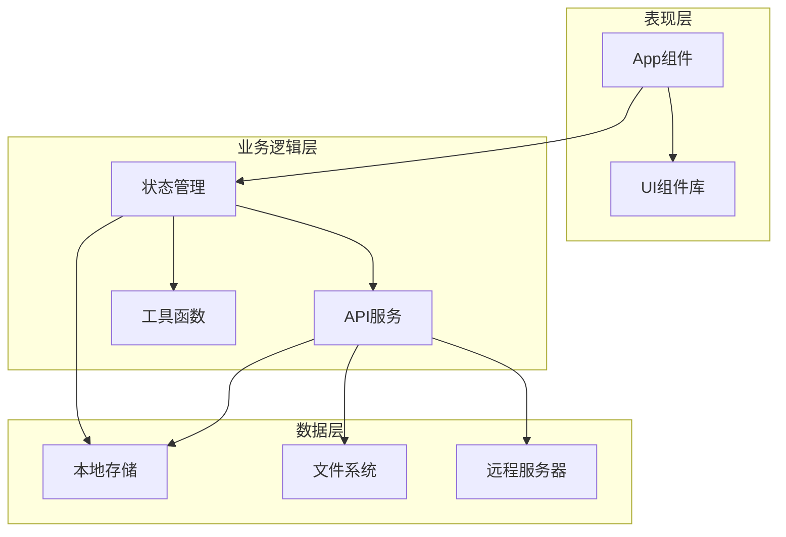
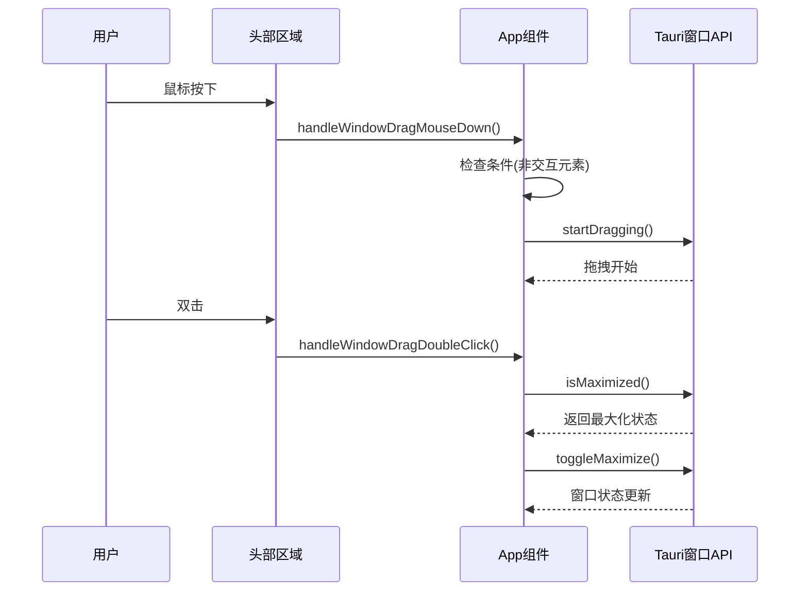
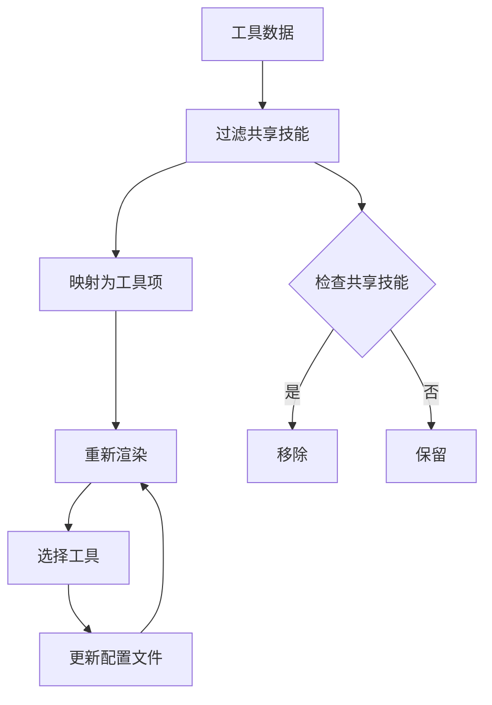
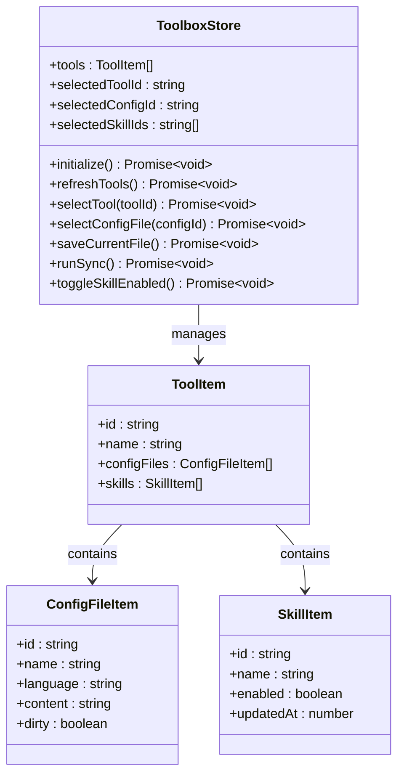
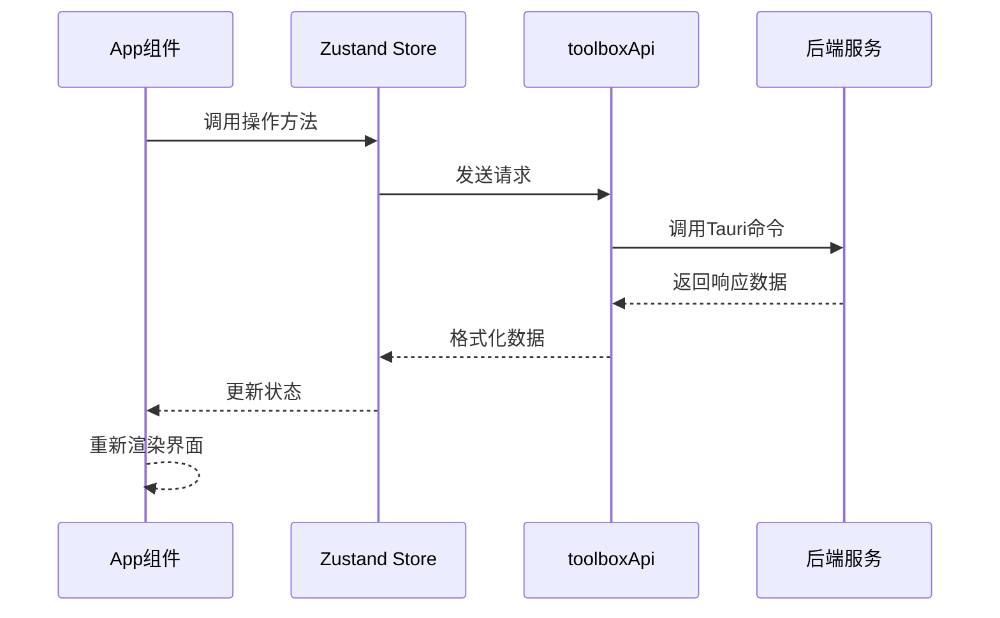
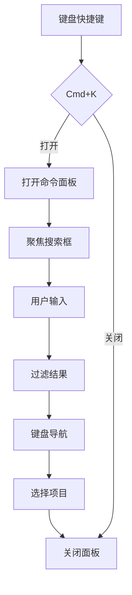
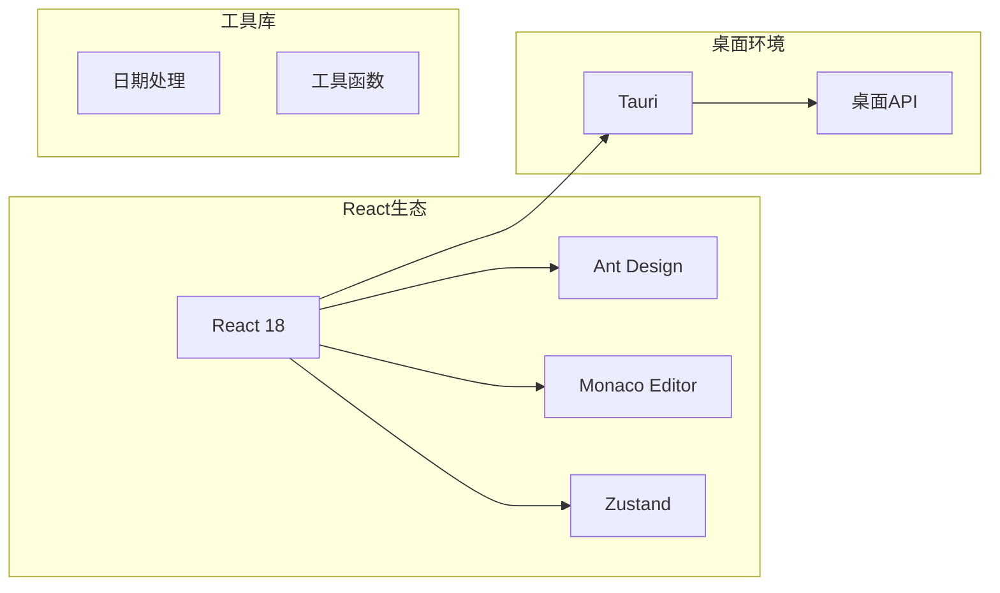
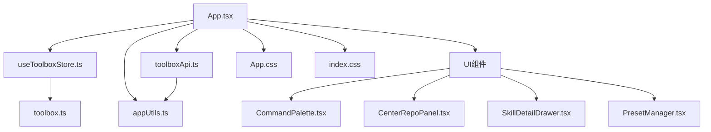

# 主应用组件App

<cite>
**本文档引用的文件**
- [App.tsx](file://src/App.tsx)
- [main.tsx](file://src/main.tsx)
- [useToolboxStore.ts](file://src/store/useToolboxStore.ts)
- [toolboxApi.ts](file://src/lib/toolboxApi.ts)
- [appUtils.ts](file://src/utils/appUtils.ts)
- [CenterRepoPanel.tsx](file://src/components/CenterRepoPanel.tsx)
- [CommandPalette.tsx](file://src/components/CommandPalette.tsx)
- [SkillDetailDrawer.tsx](file://src/components/SkillDetailDrawer.tsx)
- [PresetManager.tsx](file://src/components/PresetManager.tsx)
- [App.css](file://src/App.css)
- [index.css](file://src/index.css)
- [toolbox.ts](file://src/types/toolbox.ts)
</cite>

## 目录
1. [简介](#简介)
2. [项目结构](#项目结构)
3. [核心组件](#核心组件)
4. [架构概览](#架构概览)
5. [详细组件分析](#详细组件分析)
6. [依赖关系分析](#依赖关系分析)
7. [性能考虑](#性能考虑)
8. [故障排除指南](#故障排除指南)
9. [结论](#结论)

## 简介

主应用组件App是AI Toolbox项目的根组件，负责管理整个应用程序的状态、布局和用户界面。该组件实现了现代化的桌面应用架构，集成了状态管理、主题系统、窗口控制、消息提示等多个核心功能模块。

AI Toolbox是一个专为AI开发者设计的工具配置管理平台，支持多种AI开发工具的配置文件管理、技能目录同步和跨工具协作。App组件作为整个应用的中枢，提供了直观的用户界面和强大的功能集合。

## 项目结构

项目采用模块化的React架构设计，主要文件组织如下：

**图表来源**
- [main.tsx:1-12](file://src/main.tsx#L1-L12)
- [App.tsx:1-800](file://src/App.tsx#L1-L800)

**章节来源**
- [main.tsx:1-12](file://src/main.tsx#L1-L12)
- [App.tsx:1-800](file://src/App.tsx#L1-L800)

## 核心组件

### 应用状态管理

App组件使用Zustand状态管理库实现全局状态管理，主要包含以下状态域：

- **工具状态**：管理所有AI开发工具的信息和配置
- **技能状态**：跟踪技能的启用状态和同步状态
- **配置状态**：处理配置文件的读取、编辑和保存
- **反馈状态**：提供用户操作的反馈和通知
- **预设状态**：管理技能预设的创建、应用和删除

### 主题系统实现

应用实现了完整的双主题系统，支持亮色、暗色和系统跟随三种模式：

**图表来源**
- [App.tsx:231-248](file://src/App.tsx#L231-L248)
- [App.css:28-130](file://src/App.css#L28-L130)

### 布局系统

应用采用三面板布局设计，提供灵活的工作空间：

- **左侧工具面板**：显示所有注册的AI工具及其基本信息
- **中间工作面板**：根据工具类型显示技能列表或配置编辑器
- **右侧洞察面板**：提供技能同步洞察和工具统计信息

**章节来源**
- [App.tsx:138-200](file://src/App.tsx#L138-L200)
- [useToolboxStore.ts:32-84](file://src/store/useToolboxStore.ts#L32-L84)

## 架构概览

App组件采用了分层架构设计，确保了良好的可维护性和扩展性：

**图表来源**
- [App.tsx:610-640](file://src/App.tsx#L610-L640)
- [useToolboxStore.ts:145-556](file://src/store/useToolboxStore.ts#L145-L556)

### 组件通信机制

应用实现了多种组件间通信模式：

1. **状态提升**：通过Zustand store集中管理状态
2. **事件处理**：使用React事件系统处理用户交互
3. **API调用**：通过toolboxApi进行数据持久化
4. **回调函数**：组件间通过props传递回调函数

**章节来源**
- [App.tsx:172-195](file://src/App.tsx#L172-L195)
- [useToolboxStore.ts:57-84](file://src/store/useToolboxStore.ts#L57-L84)

## 详细组件分析

### App组件核心功能

#### 窗口拖拽功能

App组件实现了原生窗口拖拽功能，提供类似macOS的用户体验：

**图表来源**
- [App.tsx:555-592](file://src/App.tsx#L555-L592)
- [appUtils.ts:19-27](file://src/utils/appUtils.ts#L19-L27)

#### 工具列表渲染

App组件实现了高效的工具列表渲染机制：

**图表来源**
- [App.tsx:260-264](file://src/App.tsx#L260-L264)
- [App.tsx:120-136](file://src/App.tsx#L120-L136)

#### 技能管理功能

App组件提供了完整的技能管理功能：

- **技能筛选**：支持按名称、描述、路径搜索
- **技能启用/禁用**：实时切换技能状态
- **技能删除**：安全删除不需要的技能
- **技能详情**：查看技能的详细信息和文档

**章节来源**
- [App.tsx:883-1008](file://src/App.tsx#L883-L1008)
- [App.tsx:940-945](file://src/App.tsx#L940-L945)

### 状态管理架构

#### Zustand Store设计

App组件使用Zustand实现高效的状态管理：

**图表来源**
- [useToolboxStore.ts:32-84](file://src/store/useToolboxStore.ts#L32-L84)
- [toolbox.ts:33-43](file://src/types/toolbox.ts#L33-L43)

#### API集成模式

App组件通过toolboxApi实现与后端服务的通信：

**图表来源**
- [useToolboxStore.ts:174-205](file://src/store/useToolboxStore.ts#L174-L205)
- [toolboxApi.ts:387-396](file://src/lib/toolboxApi.ts#L387-L396)

**章节来源**
- [useToolboxStore.ts:145-556](file://src/store/useToolboxStore.ts#L145-L556)
- [toolboxApi.ts:1-784](file://src/lib/toolboxApi.ts#L1-L784)

### UI组件系统

#### 命令面板

CommandPalette组件提供了快速搜索和导航功能：

**图表来源**
- [CommandPalette.tsx:102-156](file://src/components/CommandPalette.tsx#L102-L156)
- [CommandPalette.tsx:244-318](file://src/components/CommandPalette.tsx#L244-L318)

#### 中央仓库面板

CenterRepoPanel组件管理技能的中央仓库：

- **技能发现**：扫描和导入新技能
- **批量操作**：支持批量同步和分类管理
- **Git集成**：从Git仓库安装技能
- **同步管理**：跟踪技能在各工具中的同步状态

**章节来源**
- [CenterRepoPanel.tsx:55-120](file://src/components/CenterRepoPanel.tsx#L55-L120)
- [CenterRepoPanel.tsx:131-148](file://src/components/CenterRepoPanel.tsx#L131-L148)

## 依赖关系分析

### 外部依赖

App组件依赖多个关键外部库：

**图表来源**
- [package.json](file://package.json)

### 内部模块依赖

**图表来源**
- [App.tsx:6-11](file://src/App.tsx#L6-L11)
- [useToolboxStore.ts:1-31](file://src/store/useToolboxStore.ts#L1-L31)

**章节来源**
- [App.tsx:1-800](file://src/App.tsx#L1-L800)
- [useToolboxStore.ts:1-556](file://src/store/useToolboxStore.ts#L1-L556)

## 性能考虑

### 渲染优化

App组件采用了多种性能优化策略：

1. **React.memo优化**：对昂贵的子组件使用memo化
2. **useMemo缓存**：缓存计算结果避免重复计算
3. **useCallback优化**：稳定回调函数引用
4. **虚拟滚动**：对大型列表使用虚拟滚动技术

### 状态管理优化

1. **状态分区**：将不同类型的状区分割到不同的store中
2. **选择器模式**：使用selector函数避免不必要的重渲染
3. **批处理更新**：合并多个状态更新操作

### 资源管理

1. **懒加载**：对不常用的组件使用动态导入
2. **内存管理**：及时清理定时器和事件监听器
3. **网络优化**：实现请求去重和缓存策略

## 故障排除指南

### 常见问题诊断

#### 窗口拖拽失效

**症状**：无法拖拽窗口移动
**可能原因**：
- 事件目标被误判为交互元素
- Tauri运行时检测失败
- 鼠标按键状态异常

**解决方案**：
1. 检查`isInteractiveDragTarget`函数的判断逻辑
2. 验证Tauri运行时环境
3. 确认鼠标事件处理流程

#### 主题切换异常

**症状**：主题切换后样式不生效
**可能原因**：
- CSS变量更新时机问题
- 本地存储读取失败
- 媒体查询监听异常

**解决方案**：
1. 检查`document.documentElement.dataset.theme`设置
2. 验证localStorage的读写操作
3. 确认系统主题监听器的正确性

#### 技能同步失败

**症状**：技能同步操作无响应或报错
**可能原因**：
- API调用参数错误
- 文件权限问题
- 网络连接异常

**解决方案**：
1. 检查syncSkills函数的参数验证
2. 验证文件系统的访问权限
3. 实现重试机制和错误处理

**章节来源**
- [App.tsx:555-592](file://src/App.tsx#L555-L592)
- [App.tsx:231-248](file://src/App.tsx#L231-L248)
- [toolboxApi.ts:438-465](file://src/lib/toolboxApi.ts#L438-L465)

## 结论

App组件作为AI Toolbox的核心，展现了现代React应用的最佳实践。通过精心设计的状态管理、优雅的UI组件系统和完善的错误处理机制，该组件为用户提供了流畅、可靠的AI工具管理体验。

主要优势包括：

1. **模块化设计**：清晰的组件分离和职责划分
2. **状态管理**：高效的Zustand集成和状态优化
3. **主题系统**：完整的双主题支持和动画效果
4. **性能优化**：多层渲染优化和资源管理
5. **可扩展性**：良好的架构设计便于功能扩展

未来可以考虑的改进方向：
- 实现更细粒度的组件拆分
- 增加更多的性能监控指标
- 优化移动端适配
- 增强离线功能支持