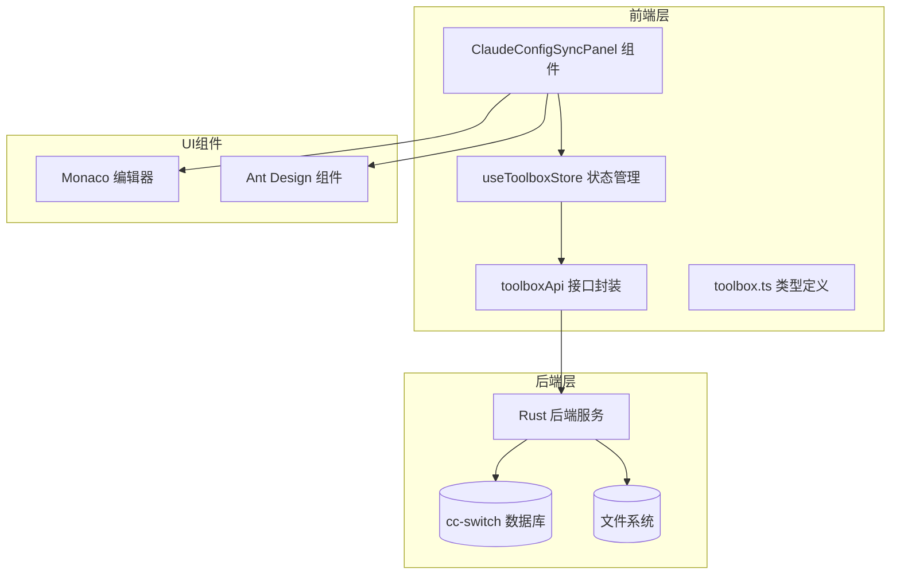
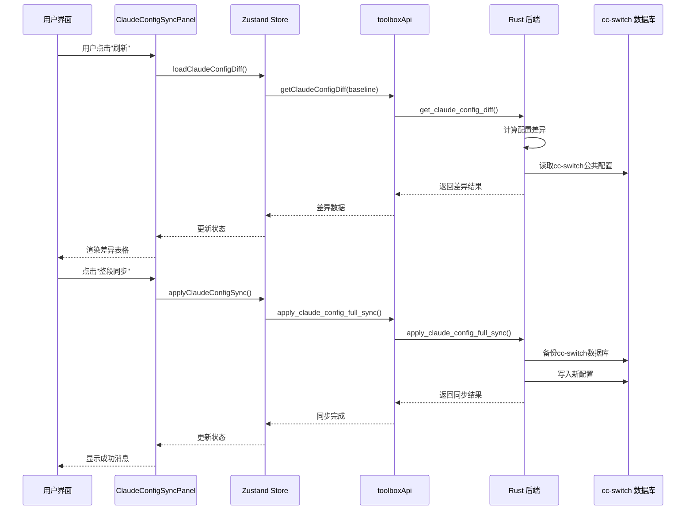
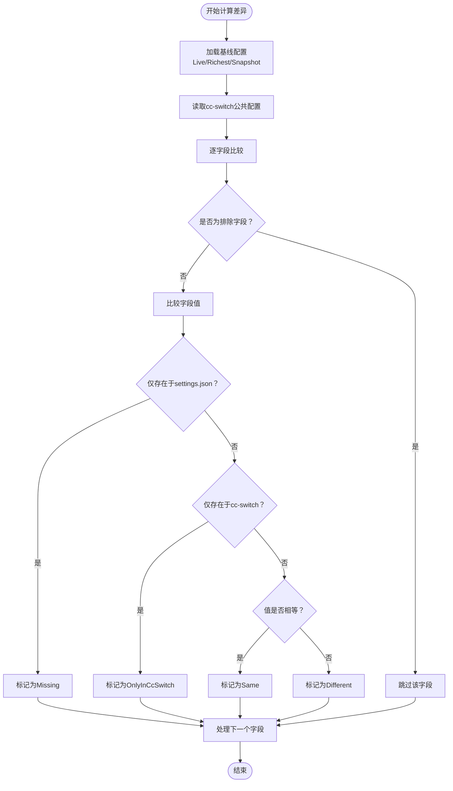
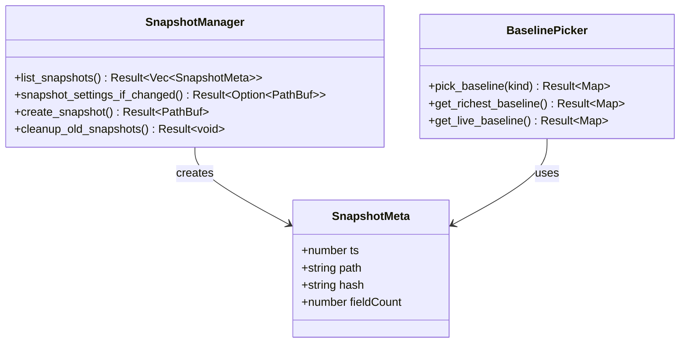
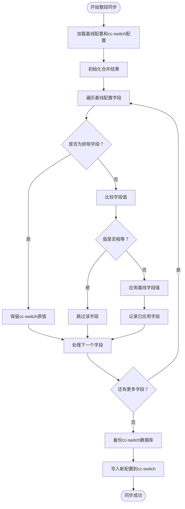
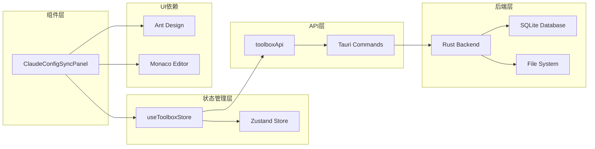

# Claude配置同步面板

<cite>
**本文档引用的文件**
- [ClaudeConfigSyncPanel.tsx](file://src/components/ClaudeConfigSyncPanel.tsx)
- [toolboxApi.ts](file://src/lib/toolboxApi.ts)
- [useToolboxStore.ts](file://src/store/useToolboxStore.ts)
- [claude_config.rs](file://src-tauri/src/claude_config.rs)
- [toolbox.ts](file://src/types/toolbox.ts)
- [App.tsx](file://src/App.tsx)
</cite>

## 目录
1. [简介](#简介)
2. [项目结构](#项目结构)
3. [核心组件](#核心组件)
4. [架构概览](#架构概览)
5. [详细组件分析](#详细组件分析)
6. [依赖关系分析](#依赖关系分析)
7. [性能考虑](#性能考虑)
8. [故障排除指南](#故障排除指南)
9. [结论](#结论)
10. [附录](#附录)

## 简介

Claude配置同步面板是一个专门用于管理Claude AI工具配置同步的React组件。该组件提供了完整的配置文件对比、快照管理和整段同步功能，支持多种基线模式（Live、Richest、Snapshot），并具备完善的错误处理和安全机制。

该组件的核心功能包括：
- 配置文件差异对比和可视化展示
- 多种基线模式选择和切换
- 快照管理（创建、查看、回滚）
- 整段同步到cc-switch公共配置
- 实时状态监控和反馈

## 项目结构

Claude配置同步面板位于前端组件目录中，采用模块化设计，与后端Tauri服务紧密集成。



**图表来源**
- [ClaudeConfigSyncPanel.tsx:1-438](file://src/components/ClaudeConfigSyncPanel.tsx#L1-L438)
- [useToolboxStore.ts:145-555](file://src/store/useToolboxStore.ts#L145-L555)
- [claude_config.rs:1-523](file://src-tauri/src/claude_config.rs#L1-L523)

**章节来源**
- [ClaudeConfigSyncPanel.tsx:101-438](file://src/components/ClaudeConfigSyncPanel.tsx#L101-L438)
- [useToolboxStore.ts:145-555](file://src/store/useToolboxStore.ts#L145-L555)

## 核心组件

### ClaudeConfigSyncPanel 组件架构

组件采用函数式组件设计，结合React Hooks实现状态管理和副作用处理。主要组成部分包括：

- **状态管理**：通过Zustand状态管理库维护配置同步状态
- **UI渲染**：基于Ant Design组件构建响应式界面
- **数据可视化**：使用Monaco编辑器展示JSON差异
- **事件处理**：统一的事件处理器管理用户交互

### 关键状态属性

组件维护以下核心状态：

| 状态属性 | 类型 | 描述 | 默认值 |
|---------|------|------|--------|
| claudeConfigDiff | ClaudeConfigDiffResult \| null | 配置差异结果 | null |
| claudeConfigBaseline | BaselineKind | 基线模式 | { kind: 'live' } |
| isClaudeConfigLoading | boolean | 加载状态 | false |
| isClaudeConfigApplying | boolean | 应用状态 | false |

**章节来源**
- [useToolboxStore.ts:47-50](file://src/store/useToolboxStore.ts#L47-L50)
- [ClaudeConfigSyncPanel.tsx:101-117](file://src/components/ClaudeConfigSyncPanel.tsx#L101-L117)

## 架构概览

组件采用分层架构设计，确保前后端分离和职责明确。



**图表来源**
- [useToolboxStore.ts:412-459](file://src/store/useToolboxStore.ts#L412-L459)
- [toolboxApi.ts:756-774](file://src/lib/toolboxApi.ts#L756-L774)
- [claude_config.rs:430-495](file://src-tauri/src/claude_config.rs#L430-L495)

## 详细组件分析

### 配置差异计算机制

组件的核心功能是计算Claude配置文件与cc-switch公共配置之间的差异。差异类型包括：



**图表来源**
- [claude_config.rs:389-424](file://src-tauri/src/claude_config.rs#L389-L424)
- [toolbox.ts:104-109](file://src/types/toolbox.ts#L104-L109)

### 基线模式选择机制

组件支持三种基线模式，每种模式都有特定的用途和行为：

| 基线模式 | 描述 | 适用场景 | 实现逻辑 |
|---------|------|----------|----------|
| Live | 使用当前settings.json作为基线 | 日常同步、实时对比 | 直接读取settings.json文件 |
| Richest | 使用字段数量最多的快照作为基线 | 历史对比、完整性检查 | 选择field_count最多的快照 |
| Snapshot | 使用指定时间戳的快照作为基线 | 版本回滚、历史对比 | 读取对应时间戳的快照文件 |

**章节来源**
- [claude_config.rs:227-277](file://src-tauri/src/claude_config.rs#L227-L277)
- [toolbox.ts:102](file://src/types/toolbox.ts#L102)

### 快照管理系统

快照系统提供了配置的历史版本管理功能：



**图表来源**
- [claude_config.rs:84-89](file://src-tauri/src/claude_config.rs#L84-L89)
- [claude_config.rs:151-225](file://src-tauri/src/claude_config.rs#L151-L225)

**章节来源**
- [claude_config.rs:151-225](file://src-tauri/src/claude_config.rs#L151-L225)

### 整段同步策略

整段同步是组件的核心功能，采用"permissive merge"策略：



**图表来源**
- [claude_config.rs:463-495](file://src-tauri/src/claude_config.rs#L463-L495)

### 安全机制和错误处理

组件实现了多层次的安全保护机制：

| 安全机制 | 实现方式 | 作用 |
|---------|----------|------|
| 写锁检测 | 检查cc-switch数据库是否被占用 | 防止并发写入冲突 |
| 自动备份 | 同步前自动备份cc-switch数据库 | 提供回滚能力 |
| 排除字段 | 忽略provider私有字段 | 保护敏感配置 |
| 事务控制 | 使用SQLite事务确保原子性 | 保证数据一致性 |

**章节来源**
- [claude_config.rs:308-330](file://src-tauri/src/claude_config.rs#L308-L330)
- [claude_config.rs:332-352](file://src-tauri/src/claude_config.rs#L332-L352)

## 依赖关系分析

组件的依赖关系清晰明确，遵循单一职责原则：



**图表来源**
- [useToolboxStore.ts:145-555](file://src/store/useToolboxStore.ts#L145-L555)
- [toolboxApi.ts:756-774](file://src/lib/toolboxApi.ts#L756-L774)

**章节来源**
- [useToolboxStore.ts:145-555](file://src/store/useToolboxStore.ts#L145-L555)
- [toolboxApi.ts:756-774](file://src/lib/toolboxApi.ts#L756-L774)

## 性能考虑

组件在设计时充分考虑了性能优化：

### 渲染优化
- 使用React.memo避免不必要的重新渲染
- useMemo缓存计算结果，减少重复计算
- 动态加载Monaco编辑器，按需引入

### 状态管理优化
- 分离关注点，避免全局状态污染
- 按需加载数据，支持懒加载
- 合理的loading状态管理

### 后端性能
- 快照系统限制最大快照数量（默认50个）
- 智能快照创建，避免重复快照
- SQLite数据库连接池优化

## 故障排除指南

### 常见问题及解决方案

| 问题类型 | 症状 | 可能原因 | 解决方案 |
|---------|------|----------|----------|
| 同步失败 | 显示错误消息 | cc-switch正在运行 | 退出cc-switch GUI后再试 |
| 无法加载差异 | 页面显示空白 | 文件权限问题 | 检查~/.claude/settings.json权限 |
| 快照创建失败 | 快照数量不变 | 磁盘空间不足 | 清理旧快照或增加磁盘空间 |
| 数据库锁定 | 写入失败 | 并发访问冲突 | 等待其他进程释放锁 |

### 调试技巧

1. **检查cc-switch状态**：组件会自动检测cc-switch数据库写锁状态
2. **查看备份文件**：同步前会自动创建备份，出现问题可手动恢复
3. **验证配置文件**：确保settings.json格式正确且可读
4. **监控日志**：查看浏览器开发者工具的网络请求和错误信息

**章节来源**
- [claude_config.rs:308-330](file://src-tauri/src/claude_config.rs#L308-L330)
- [claude_config.rs:497-522](file://src-tauri/src/claude_config.rs#L497-L522)

## 结论

Claude配置同步面板是一个设计精良、功能完整的配置管理组件。它通过清晰的架构设计、完善的安全机制和友好的用户界面，为用户提供了一个可靠的配置同步解决方案。

主要优势包括：
- **安全性高**：多重安全保护机制，防止数据丢失
- **易用性强**：直观的界面设计和丰富的交互功能
- **扩展性好**：模块化设计便于功能扩展
- **性能优秀**：合理的性能优化确保流畅体验

该组件为AI工具配置管理提供了一个标准化的解决方案，值得在类似场景中推广使用。

## 附录

### 使用示例

#### 基本集成
```typescript
// 在App.tsx中集成组件
{selectedTool?.id === 'claude' && middleTab === 'sync' && (
  <div style={{ flex: 1, minHeight: 0, overflow: 'auto', padding: 16 }}>
    <ClaudeConfigSyncPanel monacoTheme={monacoTheme} />
  </div>
)}
```

#### 同步模式选择
- **整段同步**：适用于需要完全覆盖的场景
- **增量同步**：适用于需要精确控制的场景
- **快照回滚**：适用于需要版本管理的场景

#### 冲突处理策略
- **跳过**：遇到冲突时跳过该字段
- **覆盖**：强制使用基线配置覆盖现有值
- **重命名**：自动重命名冲突字段避免覆盖

### 集成指南

1. **安装依赖**：确保安装Monaco Editor和Ant Design
2. **配置环境**：设置正确的文件路径和权限
3. **初始化组件**：在合适的时机调用组件
4. **处理反馈**：监听并处理组件返回的操作反馈