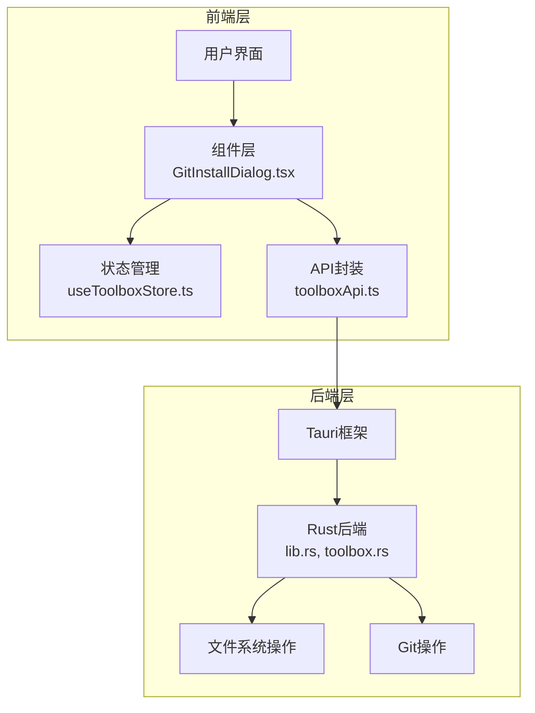
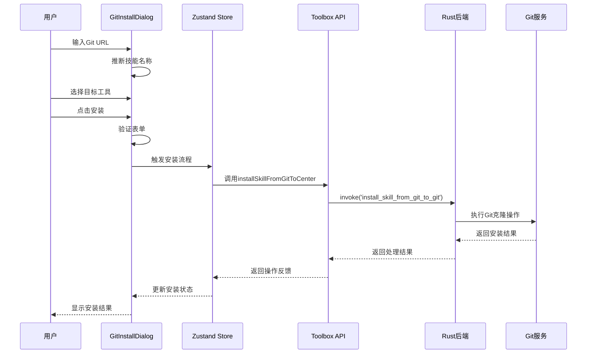
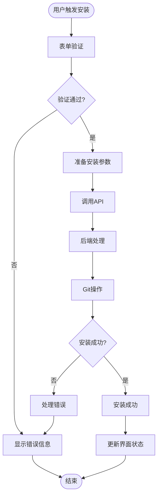
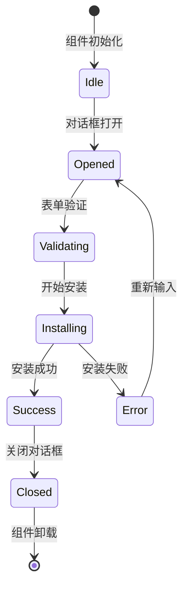
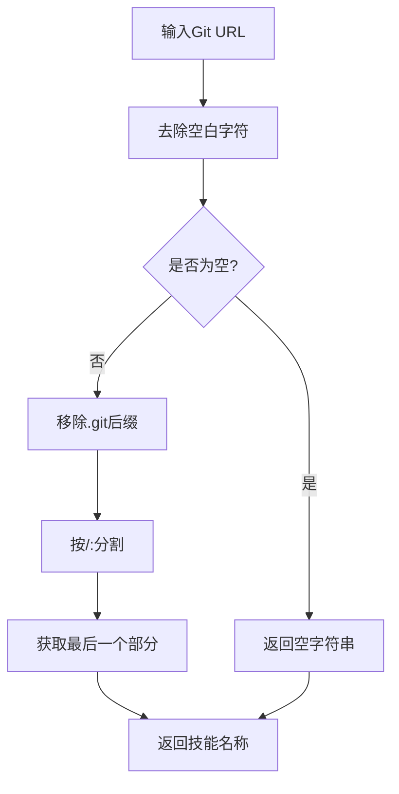
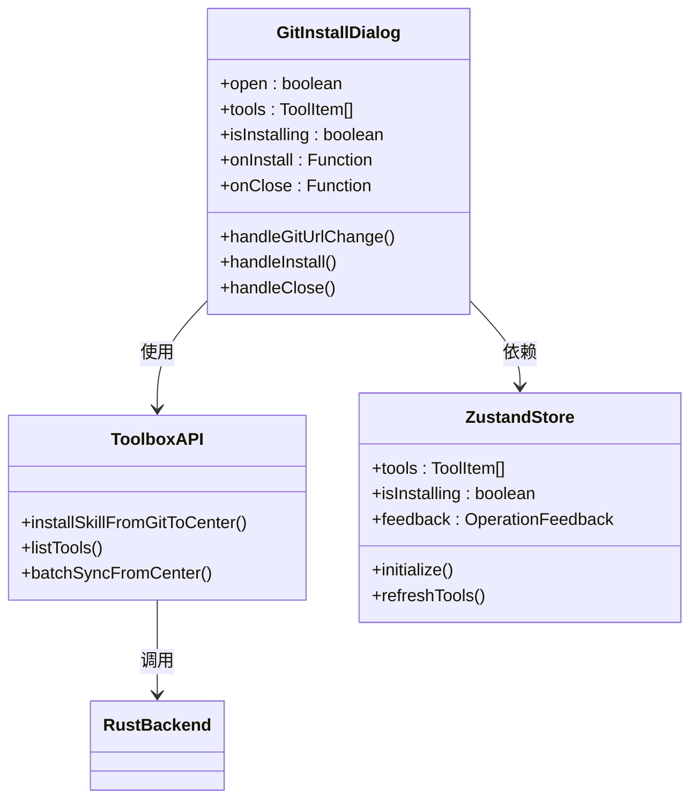
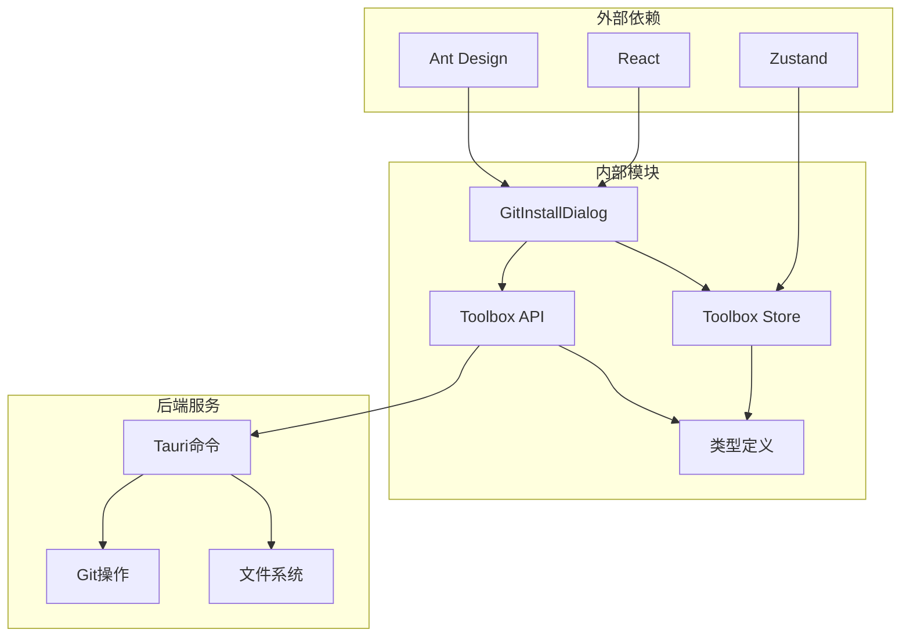

# Git安装对话框

<cite>
**本文档引用的文件**
- [GitInstallDialog.tsx](file://src/components/GitInstallDialog.tsx)
- [toolboxApi.ts](file://src/lib/toolboxApi.ts)
- [useToolboxStore.ts](file://src/store/useToolboxStore.ts)
- [App.tsx](file://src/App.tsx)
- [lib.rs](file://src-tauri/src/lib.rs)
- [toolbox.rs](file://src-tauri/src/toolbox.rs)
- [types.ts](file://src/types/toolbox.ts)
</cite>

## 目录
1. [简介](#简介)
2. [项目结构](#项目结构)
3. [核心组件](#核心组件)
4. [架构概览](#架构概览)
5. [详细组件分析](#详细组件分析)
6. [依赖关系分析](#依赖关系分析)
7. [性能考虑](#性能考虑)
8. [故障排除指南](#故障排除指南)
9. [结论](#结论)

## 简介

Git安装对话框组件是AI Toolbox项目中的一个重要功能模块，用于从Git仓库安装技能到指定的工具中。该组件提供了直观的用户界面，支持Git URL验证、技能名称推断、目标工具选择等功能，并与后端系统进行完整的Git操作集成。

该组件采用现代化的React设计模式，结合Ant Design UI库，实现了完整的表单验证、状态管理和错误处理机制。通过与Tauri后端的深度集成，组件能够执行真实的Git克隆操作，管理技能安装流程，并提供实时的进度反馈。

## 项目结构

AI Toolbox项目采用分层架构设计，Git安装对话框组件位于组件层，与API层、存储层和后端服务层协同工作：

**图表来源**
- [GitInstallDialog.tsx:1-151](file://src/components/GitInstallDialog.tsx#L1-L151)
- [toolboxApi.ts:1-784](file://src/lib/toolboxApi.ts#L1-L784)
- [useToolboxStore.ts:1-556](file://src/store/useToolboxStore.ts#L1-L556)

**章节来源**
- [GitInstallDialog.tsx:1-151](file://src/components/GitInstallDialog.tsx#L1-L151)
- [toolboxApi.ts:1-784](file://src/lib/toolboxApi.ts#L1-L784)

## 核心组件

### GitInstallDialog 组件架构

GitInstallDialog组件是一个高度模块化的React组件，具有以下核心特性：

#### 组件接口设计
组件通过清晰的props接口与父组件通信，支持安装状态管理、工具列表展示和回调函数处理。

#### 状态管理机制
组件内部维护了完整的状态管理逻辑，包括表单状态、安装状态和UI状态的协调控制。

#### 表单验证系统
集成了Ant Design的表单验证机制，确保用户输入的有效性和完整性。

**章节来源**
- [GitInstallDialog.tsx:9-15](file://src/components/GitInstallDialog.tsx#L9-L15)
- [GitInstallDialog.tsx:30-53](file://src/components/GitInstallDialog.tsx#L30-L53)

## 架构概览

### 系统架构图

**图表来源**
- [GitInstallDialog.tsx:61-72](file://src/components/GitInstallDialog.tsx#L61-L72)
- [toolboxApi.ts:716-721](file://src/lib/toolboxApi.ts#L716-L721)
- [lib.rs:615-618](file://src-tauri/src/lib.rs#L615-L618)

### 数据流架构

**图表来源**
- [GitInstallDialog.tsx:61-72](file://src/components/GitInstallDialog.tsx#L61-L72)
- [toolboxApi.ts:716-721](file://src/lib/toolboxApi.ts#L716-L721)

## 详细组件分析

### GitInstallDialog 组件实现

#### 核心功能实现

组件的核心功能围绕Git仓库安装展开，主要包括：

1. **Git URL验证和处理**
2. **技能名称自动推断**
3. **目标工具选择**
4. **安装参数配置**

#### 状态管理机制

**图表来源**
- [GitInstallDialog.tsx:47-53](file://src/components/GitInstallDialog.tsx#L47-L53)
- [GitInstallDialog.tsx:61-78](file://src/components/GitInstallDialog.tsx#L61-L78)

#### URL处理算法

组件实现了智能的Git URL处理逻辑：

**图表来源**
- [GitInstallDialog.tsx:17-28](file://src/components/GitInstallDialog.tsx#L17-L28)

**章节来源**
- [GitInstallDialog.tsx:17-28](file://src/components/GitInstallDialog.tsx#L17-L28)
- [GitInstallDialog.tsx:47-78](file://src/components/GitInstallDialog.tsx#L47-L78)

### API集成架构

#### 前端API封装

组件通过toolboxApi.ts提供的统一API接口与后端进行通信：

**图表来源**
- [GitInstallDialog.tsx:30-151](file://src/components/GitInstallDialog.tsx#L30-L151)
- [toolboxApi.ts:716-721](file://src/lib/toolboxApi.ts#L716-L721)
- [useToolboxStore.ts:145-555](file://src/store/useToolboxStore.ts#L145-L555)

#### 后端Rust实现

后端通过Tauri框架提供命令调用接口：

**章节来源**
- [toolboxApi.ts:716-721](file://src/lib/toolboxApi.ts#L716-L721)
- [lib.rs:615-618](file://src-tauri/src/lib.rs#L615-L618)

### 错误处理机制

组件实现了多层次的错误处理机制：

1. **表单验证错误**
2. **网络请求错误**
3. **Git操作错误**
4. **用户取消操作**

**章节来源**
- [GitInstallDialog.tsx:61-72](file://src/components/GitInstallDialog.tsx#L61-L72)
- [toolboxApi.ts:716-721](file://src/lib/toolboxApi.ts#L716-L721)

## 依赖关系分析

### 组件依赖图

**图表来源**
- [GitInstallDialog.tsx:1-2](file://src/components/GitInstallDialog.tsx#L1-L2)
- [toolboxApi.ts:1-19](file://src/lib/toolboxApi.ts#L1-L19)
- [useToolboxStore.ts:1-18](file://src/store/useToolboxStore.ts#L1-L18)

### 数据类型定义

组件使用了完整的类型系统来确保类型安全：

**章节来源**
- [types.ts:1-152](file://src/types/toolbox.ts#L1-L152)
- [toolboxApi.ts:3-19](file://src/lib/toolboxApi.ts#L3-L19)

## 性能考虑

### 性能优化策略

1. **组件渲染优化**
   - 使用React.memo避免不必要的重渲染
   - useMemo缓存计算结果
   - useCallback优化回调函数

2. **异步操作优化**
   - 并行API调用
   - 请求去抖和节流
   - 内存泄漏防护

3. **用户体验优化**
   - 加载状态指示
   - 错误恢复机制
   - 实时进度反馈

## 故障排除指南

### 常见问题及解决方案

#### Git URL格式问题
- **问题**: URL格式不正确导致安装失败
- **解决方案**: 组件会自动处理常见的Git URL格式，包括HTTPS和SSH协议

#### 网络连接问题
- **问题**: 网络不稳定导致Git克隆失败
- **解决方案**: 提供重试机制和详细的错误信息

#### 权限问题
- **问题**: 文件系统权限不足
- **解决方案**: 检查目标目录权限，必要时提升权限

**章节来源**
- [GitInstallDialog.tsx:61-72](file://src/components/GitInstallDialog.tsx#L61-L72)
- [toolboxApi.ts:716-721](file://src/lib/toolboxApi.ts#L716-L721)

## 结论

Git安装对话框组件展现了现代前端开发的最佳实践，通过精心设计的架构和完善的错误处理机制，为用户提供了一个可靠、易用的Git仓库安装工具。组件不仅实现了基本的功能需求，还考虑了性能优化、用户体验和安全性等多个方面。

该组件的成功实现为类似的功能模块提供了宝贵的参考经验，展示了如何在复杂的前端应用中实现高质量的组件设计和后端集成。