# 中央仓库面板

<cite>
**本文档引用的文件**
- [CenterRepoPanel.tsx](file://src/components/CenterRepoPanel.tsx)
- [toolboxApi.ts](file://src/lib/toolboxApi.ts)
- [useToolboxStore.ts](file://src/store/useToolboxStore.ts)
- [toolbox.ts](file://src/types/toolbox.ts)
- [App.tsx](file://src/App.tsx)
- [errorUtils.ts](file://src/utils/errorUtils.ts)
</cite>

## 目录
1. [简介](#简介)
2. [项目结构](#项目结构)
3. [核心组件](#核心组件)
4. [架构概览](#架构概览)
5. [详细组件分析](#详细组件分析)
6. [依赖关系分析](#依赖关系分析)
7. [性能考虑](#性能考虑)
8. [故障排除指南](#故障排除指南)
9. [结论](#结论)

## 简介

中央仓库面板（CenterRepoPanel）是 AI 工具箱中的核心组件，负责管理和操作中央技能仓库。该组件提供了完整的技能生命周期管理功能，包括技能展示、搜索过滤、分类管理、批量操作以及与后端 API 的深度集成。

该组件采用现代化的 React 架构设计，结合 Ant Design 组件库和 Zustand 状态管理，实现了高性能、用户体验友好的技能管理界面。组件支持多种同步模式和冲突策略，能够灵活适配不同的使用场景。

## 项目结构

中央仓库面板组件位于 `src/components/` 目录下，与 API 层、状态管理器和类型定义形成清晰的分层架构：

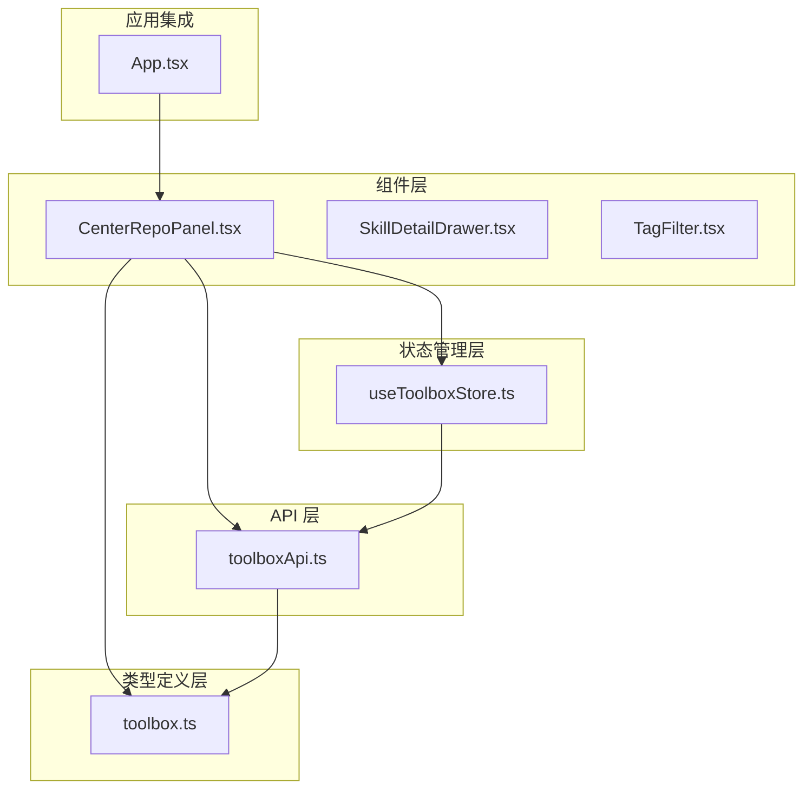

**图表来源**
- [CenterRepoPanel.tsx:1-50](file://src/components/CenterRepoPanel.tsx#L1-L50)
- [toolboxApi.ts:1-50](file://src/lib/toolboxApi.ts#L1-L50)
- [useToolboxStore.ts:1-50](file://src/store/useToolboxStore.ts#L1-L50)

**章节来源**
- [CenterRepoPanel.tsx:1-100](file://src/components/CenterRepoPanel.tsx#L1-L100)
- [toolboxApi.ts:1-100](file://src/lib/toolboxApi.ts#L1-L100)

## 核心组件

### 组件架构设计

CenterRepoPanel 采用了模块化的组件架构，通过多个独立的状态管理钩子实现功能分离：

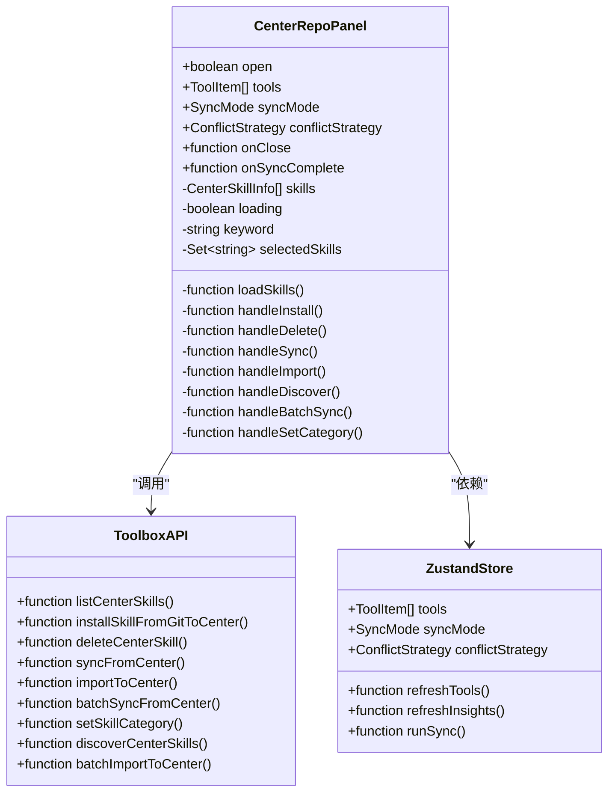

**图表来源**
- [CenterRepoPanel.tsx:46-62](file://src/components/CenterRepoPanel.tsx#L46-L62)
- [toolboxApi.ts:690-721](file://src/lib/toolboxApi.ts#L690-L721)
- [useToolboxStore.ts:145-180](file://src/store/useToolboxStore.ts#L145-L180)

### 主要功能特性

1. **技能展示与管理**
   - 实时技能列表展示
   - 搜索和过滤功能
   - 分类标签管理
   - 同步状态可视化

2. **多级操作支持**
   - 单个技能操作（同步、导入、删除）
   - 批量操作（批量同步、批量分类）
   - 扫描发现新技能

3. **状态管理机制**
   - 组件内部状态管理
   - 全局状态同步
   - 错误处理和反馈

**章节来源**
- [CenterRepoPanel.tsx:99-120](file://src/components/CenterRepoPanel.tsx#L99-L120)
- [CenterRepoPanel.tsx:122-148](file://src/components/CenterRepoPanel.tsx#L122-L148)

## 架构概览

### 数据流架构

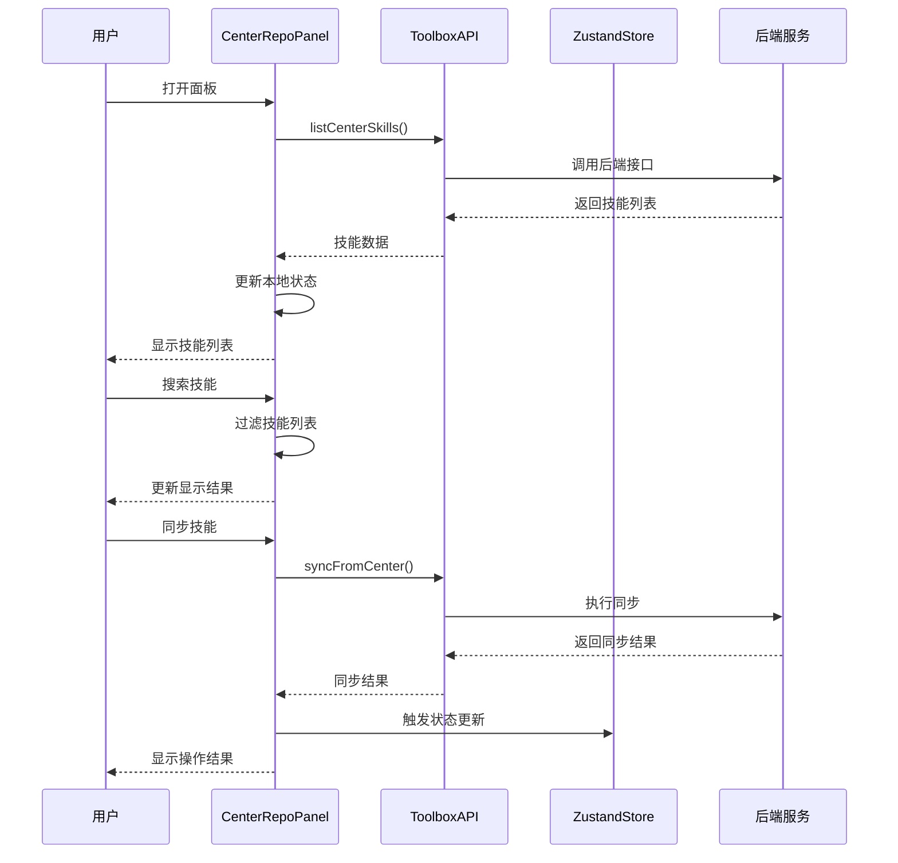

**图表来源**
- [CenterRepoPanel.tsx:99-109](file://src/components/CenterRepoPanel.tsx#L99-L109)
- [toolboxApi.ts:698-710](file://src/lib/toolboxApi.ts#L698-L710)
- [useToolboxStore.ts:341-384](file://src/store/useToolboxStore.ts#L341-L384)

### 状态管理流程

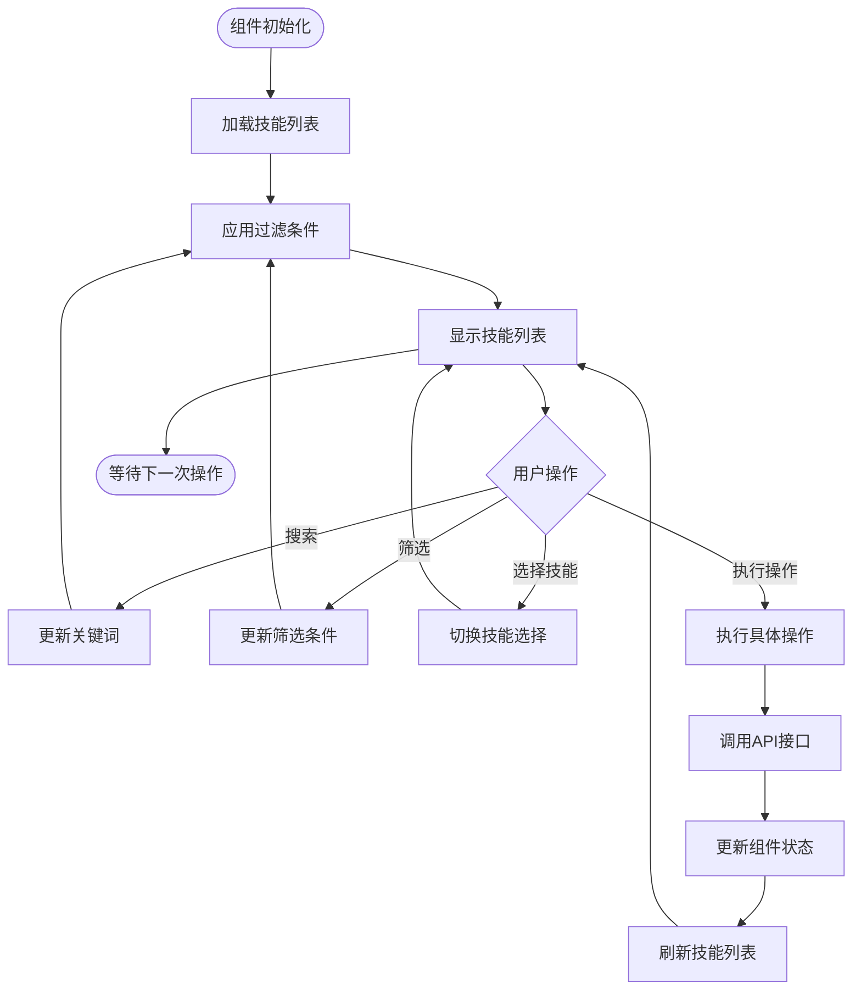

**图表来源**
- [CenterRepoPanel.tsx:122-148](file://src/components/CenterRepoPanel.tsx#L122-L148)
- [CenterRepoPanel.tsx:308-318](file://src/components/CenterRepoPanel.tsx#L308-L318)

## 详细组件分析

### Props 接口定义

CenterRepoPanel 组件通过严格的 TypeScript 接口定义了所有外部依赖：

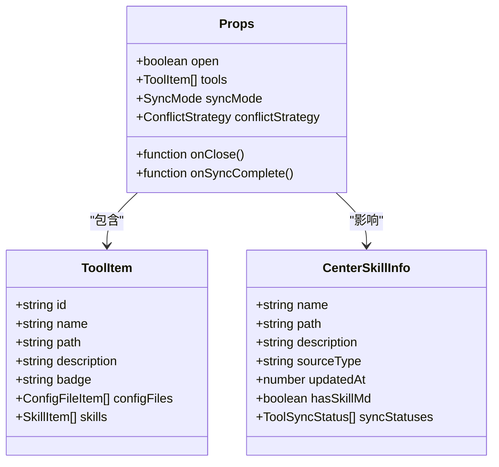

**图表来源**
- [CenterRepoPanel.tsx:46-53](file://src/components/CenterRepoPanel.tsx#L46-L53)
- [toolbox.ts:33-43](file://src/types/toolbox.ts#L33-L43)
- [toolboxApi.ts:658-666](file://src/lib/toolboxApi.ts#L658-L666)

### 技能过滤与搜索机制

组件实现了多层次的技能过滤系统：

1. **源类型过滤**：区分自定义技能和市场技能
2. **同步状态过滤**：显示未同步、部分同步、完全同步的技能
3. **关键词搜索**：支持技能名称和描述的模糊匹配

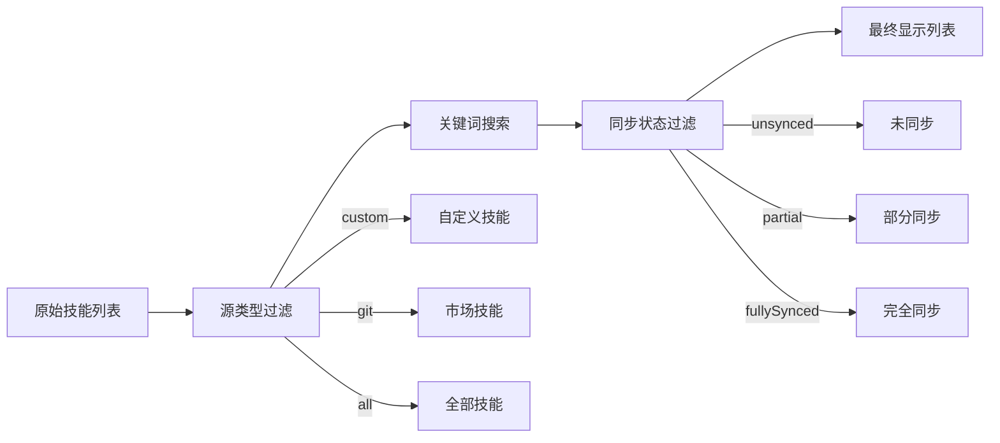

**图表来源**
- [CenterRepoPanel.tsx:131-148](file://src/components/CenterRepoPanel.tsx#L131-L148)
- [CenterRepoPanel.tsx:122-129](file://src/components/CenterRepoPanel.tsx#L122-L129)

**章节来源**
- [CenterRepoPanel.tsx:122-148](file://src/components/CenterRepoPanel.tsx#L122-L148)

### 批量操作功能

组件提供了强大的批量操作能力：

1. **批量同步**：将多个技能同时同步到指定工具
2. **批量分类**：统一修改多个技能的分类标签
3. **批量导入**：从扫描发现的功能导入多个技能

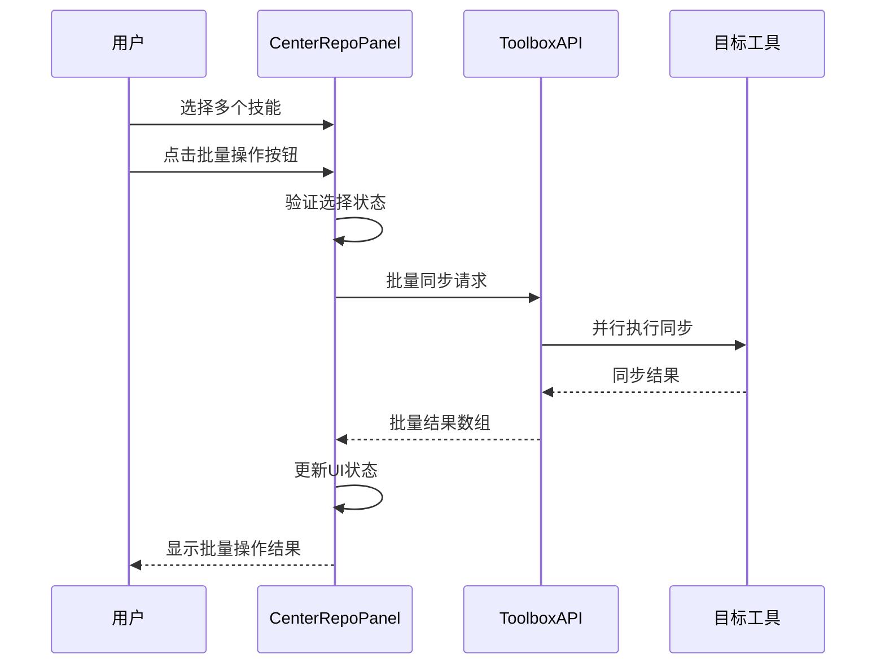

**图表来源**
- [CenterRepoPanel.tsx:329-364](file://src/components/CenterRepoPanel.tsx#L329-L364)
- [toolboxApi.ts:676-688](file://src/lib/toolboxApi.ts#L676-L688)

**章节来源**
- [CenterRepoPanel.tsx:320-401](file://src/components/CenterRepoPanel.tsx#L320-L401)

### 事件处理流程

组件采用事件驱动的方式处理用户交互：

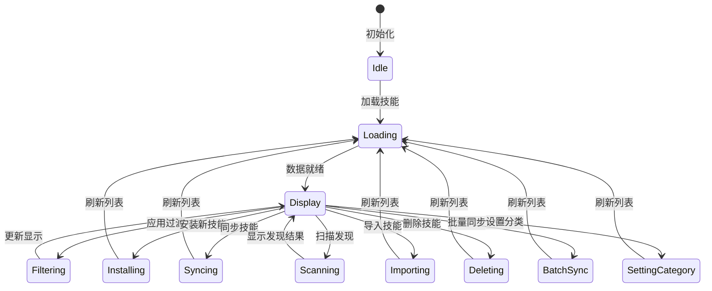

**图表来源**
- [CenterRepoPanel.tsx:150-294](file://src/components/CenterRepoPanel.tsx#L150-L294)

**章节来源**
- [CenterRepoPanel.tsx:150-294](file://src/components/CenterRepoPanel.tsx#L150-L294)

## 依赖关系分析

### 组件间依赖关系

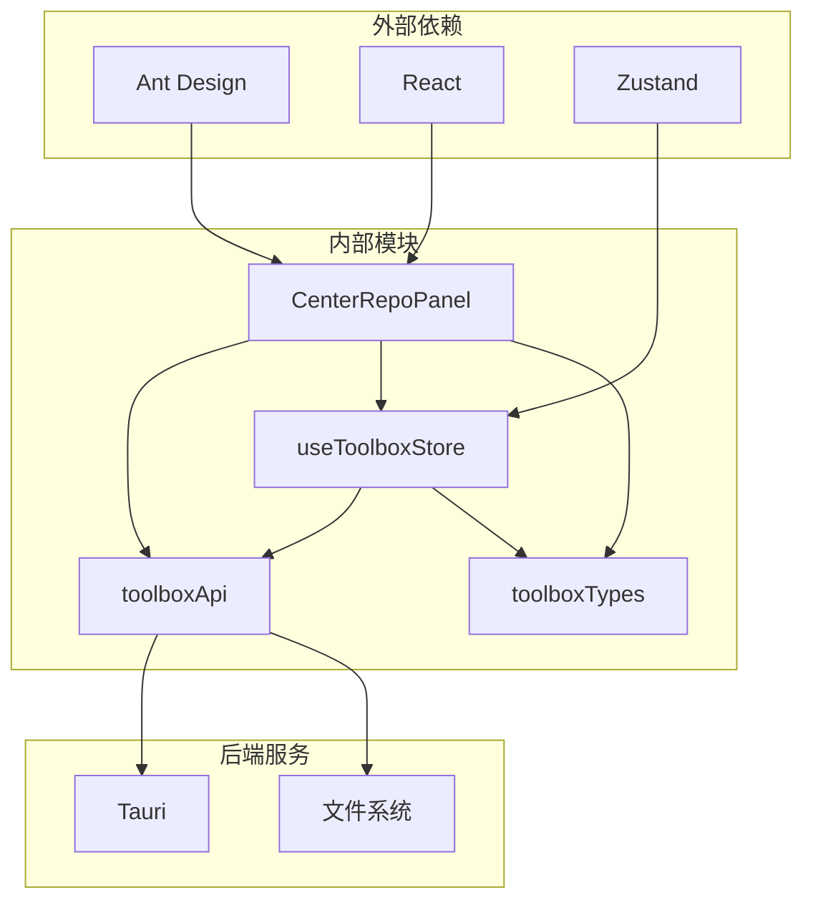

**图表来源**
- [CenterRepoPanel.tsx:1-42](file://src/components/CenterRepoPanel.tsx#L1-L42)
- [toolboxApi.ts:1-21](file://src/lib/toolboxApi.ts#L1-L21)

### API 接口依赖

组件依赖以下核心 API 接口：

| 接口名称 | 功能描述 | 参数类型 | 返回值类型 |
|---------|----------|----------|------------|
| listCenterSkills | 获取中心仓库技能列表 | 无 | CenterSkillInfo[] |
| installSkillFromGitToCenter | 从Git安装技能 | gitUrl: string, skillName?: string | string |
| deleteCenterSkill | 删除中心仓库技能 | skillName: string | void |
| syncFromCenter | 同步技能到工具 | skillName: string, targetToolId: string, mode: string, conflictPolicy: string | SyncOutcome |
| importToCenter | 从工具导入技能 | skillName: string, sourceToolId: string | string |
| batchSyncFromCenter | 批量同步技能 | skillNames: string[], targetToolId: string, mode: string, conflictPolicy: string | SyncOutcome[] |
| setSkillCategory | 设置技能分类 | skillName: string, category: string | void |
| discoverCenterSkills | 发现可导入技能 | 无 | DiscoveredSkill[] |
| batchImportToCenter | 批量导入技能 | {skillName: string, sourceToolId: string}[] | ImportOutcome[] |

**章节来源**
- [toolboxApi.ts:636-721](file://src/lib/toolboxApi.ts#L636-L721)

## 性能考虑

### 优化策略

1. **状态管理优化**
   - 使用 `useMemo` 缓存过滤结果
   - 使用 `useCallback` 优化函数引用
   - 避免不必要的重新渲染

2. **API 调用优化**
   - 批量操作减少网络请求次数
   - 错误处理避免重复调用
   - 加载状态管理提升用户体验

3. **内存管理**
   - Modal 组件销毁时清理状态
   - Set 数据结构优化选择状态
   - 及时清理定时器和订阅

### 性能监控建议

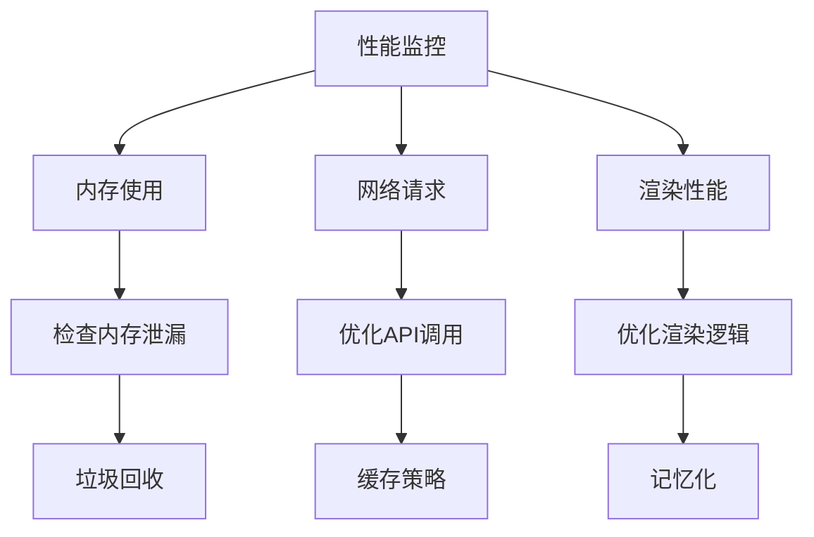

**章节来源**
- [CenterRepoPanel.tsx:99-109](file://src/components/CenterRepoPanel.tsx#L99-L109)
- [CenterRepoPanel.tsx:131-148](file://src/components/CenterRepoPanel.tsx#L131-L148)

## 故障排除指南

### 常见问题及解决方案

1. **技能列表加载失败**
   - 检查网络连接状态
   - 验证后端服务可用性
   - 查看控制台错误日志

2. **同步操作超时**
   - 检查目标工具的可达性
   - 验证同步模式配置
   - 确认冲突策略设置

3. **批量操作失败**
   - 检查技能选择状态
   - 验证目标工具权限
   - 查看单个操作的错误详情

### 错误处理机制

组件采用统一的错误处理策略：

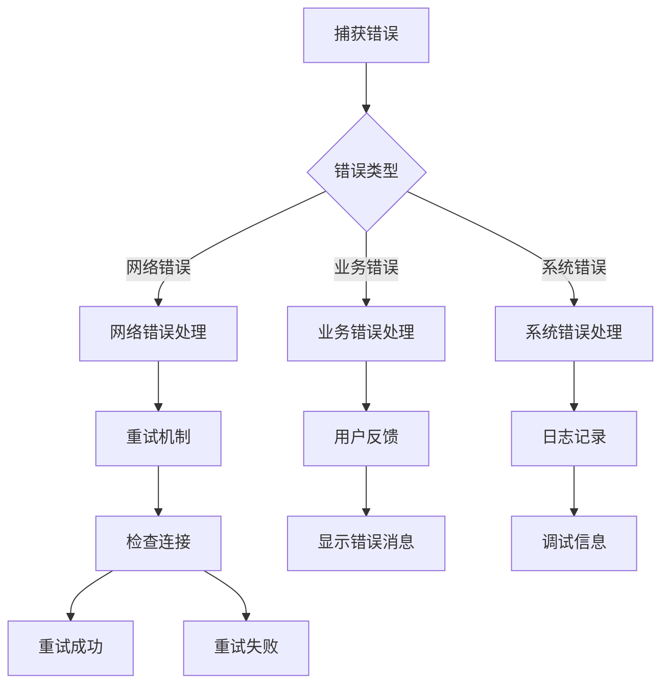

**图表来源**
- [CenterRepoPanel.tsx:104-108](file://src/components/CenterRepoPanel.tsx#L104-L108)
- [errorUtils.ts:5-9](file://src/utils/errorUtils.ts#L5-L9)

**章节来源**
- [CenterRepoPanel.tsx:104-108](file://src/components/CenterRepoPanel.tsx#L104-L108)
- [errorUtils.ts:1-10](file://src/utils/errorUtils.ts#L1-L10)

## 结论

中央仓库面板组件是一个功能完整、架构清晰的技能管理界面。通过合理的设计模式和最佳实践，该组件实现了：

1. **功能完整性**：覆盖了技能管理的所有核心需求
2. **用户体验**：提供直观的操作界面和及时的反馈机制
3. **性能优化**：通过多种技术手段确保组件的高效运行
4. **可维护性**：清晰的代码结构和完善的错误处理

该组件为 AI 工具箱提供了强大的技能管理能力，是整个系统的重要基础设施。通过持续的优化和改进，该组件将继续为用户提供优秀的技能管理体验。