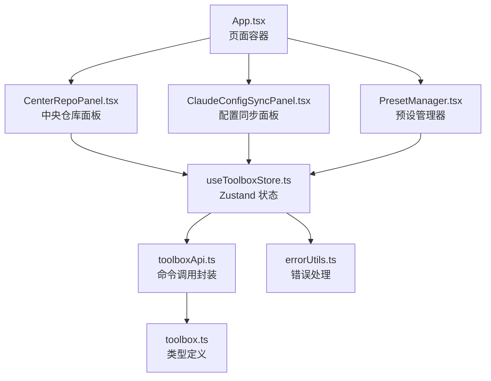
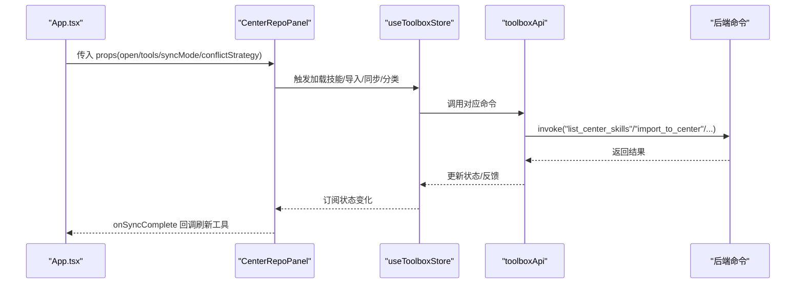
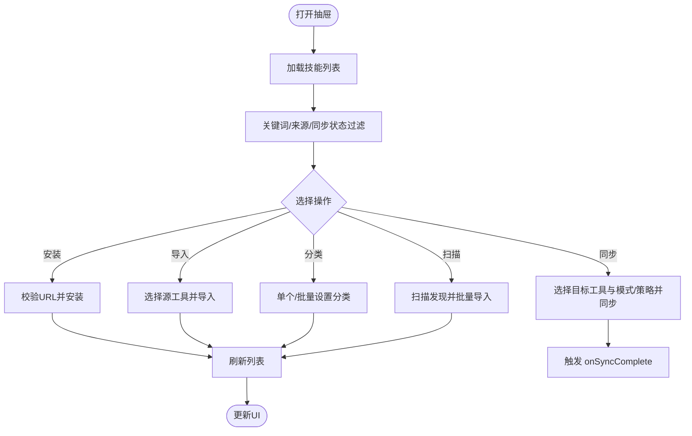
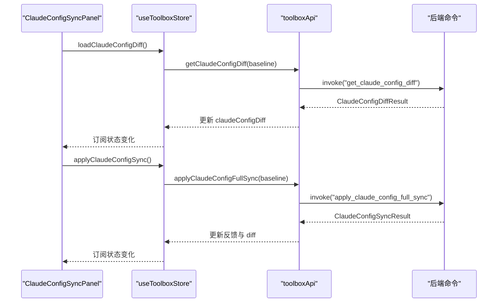
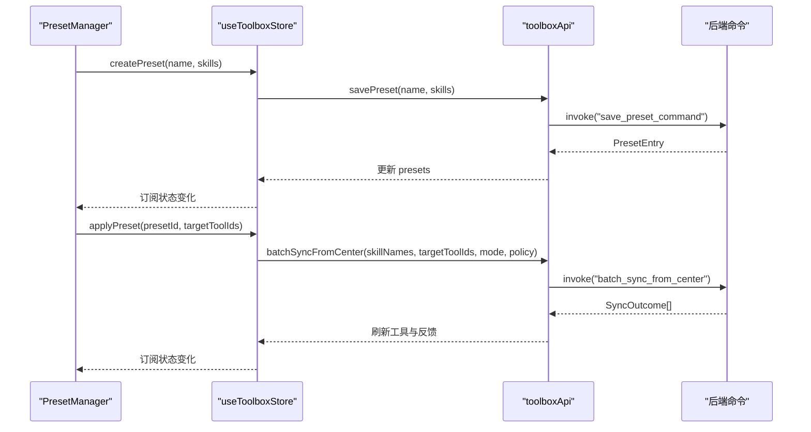
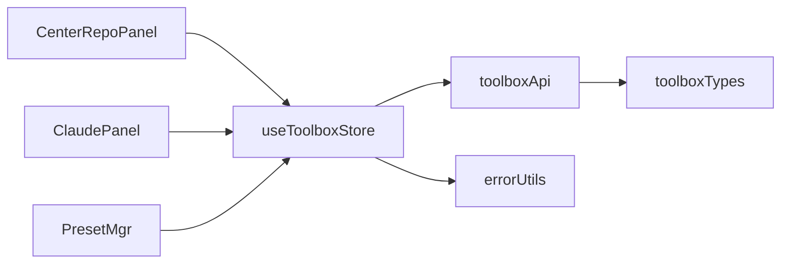

# 功能组件集合

<cite>
**本文档引用的文件**
- [CenterRepoPanel.tsx](file://src/components/CenterRepoPanel.tsx)
- [ClaudeConfigSyncPanel.tsx](file://src/components/ClaudeConfigSyncPanel.tsx)
- [PresetManager.tsx](file://src/components/PresetManager.tsx)
- [useToolboxStore.ts](file://src/store/useToolboxStore.ts)
- [toolboxApi.ts](file://src/lib/toolboxApi.ts)
- [toolbox.ts](file://src/types/toolbox.ts)
- [App.tsx](file://src/App.tsx)
- [errorUtils.ts](file://src/utils/errorUtils.ts)
</cite>

## 目录
1. [简介](#简介)
2. [项目结构](#项目结构)
3. [核心组件](#核心组件)
4. [架构总览](#架构总览)
5. [组件详细分析](#组件详细分析)
6. [依赖关系分析](#依赖关系分析)
7. [性能考量](#性能考量)
8. [故障排查指南](#故障排查指南)
9. [结论](#结论)
10. [附录](#附录)

## 简介
本文件聚焦于功能组件集合的详细设计与实现，重点解析以下核心组件：
- 中央仓库面板 CenterRepoPanel：统一管理技能的中央仓库，支持从 Git 安装、导入、同步、分类标记、批量操作等功能。
- 配置同步面板 ClaudeConfigSyncPanel：针对 Claude Code 配置进行差异比对与整段同步，提供基线选择、锁定状态提示、字段 diff 查看等能力。
- 预设管理器 PresetManager：管理技能预设，支持创建、应用、删除预设，简化批量同步流程。

文档将从职责分工、props 接口、状态管理、事件处理、组件协作与数据流、可复用性、错误处理与边界情况、使用示例与集成指南、性能优化与调试方法等方面进行全面阐述。

## 项目结构
该应用采用“页面容器 + 功能组件 + 状态管理 + 类型定义 + API 层”的分层架构：
- 页面容器 App.tsx：负责布局、路由切换、全局状态联动与模态/抽屉的控制。
- 功能组件：CenterRepoPanel、ClaudeConfigSyncPanel、PresetManager 等，承担具体业务功能。
- 状态管理：useToolboxStore 使用 zustand 管理工具、配置、洞察、反馈、预设、Claude 配置同步等状态。
- 类型定义：toolbox.ts 提供统一的数据模型与枚举类型。
- API 层：toolboxApi.ts 封装与后端命令交互，提供工具、技能、配置、预设、Claude 配置同步等接口。
- 工具函数：errorUtils.ts 提供统一错误消息提取。

图表来源
- [App.tsx:138-1769](file://src/App.tsx#L138-L1769)
- [CenterRepoPanel.tsx:55-852](file://src/components/CenterRepoPanel.tsx#L55-L852)
- [ClaudeConfigSyncPanel.tsx:101-438](file://src/components/ClaudeConfigSyncPanel.tsx#L101-L438)
- [PresetManager.tsx:171-330](file://src/components/PresetManager.tsx#L171-L330)
- [useToolboxStore.ts:145-556](file://src/store/useToolboxStore.ts#L145-L556)
- [toolboxApi.ts:387-784](file://src/lib/toolboxApi.ts#L387-L784)
- [toolbox.ts:1-152](file://src/types/toolbox.ts#L1-L152)
- [errorUtils.ts:1-10](file://src/utils/errorUtils.ts#L1-L10)

章节来源
- [App.tsx:138-1769](file://src/App.tsx#L138-L1769)

## 核心组件
本节概述三个核心组件的职责与关键特性：
- CenterRepoPanel：集中式技能仓库管理，支持 Git 安装、导入、同步、分类标记、批量操作与扫描发现。
- ClaudeConfigSyncPanel：Claude Code 配置差异比对与整段同步，支持基线选择、锁定状态提示、字段 diff 查看。
- PresetManager：技能预设生命周期管理，支持创建、应用、删除与加载状态展示。

章节来源
- [CenterRepoPanel.tsx:46-53](file://src/components/CenterRepoPanel.tsx#L46-L53)
- [ClaudeConfigSyncPanel.tsx:34-36](file://src/components/ClaudeConfigSyncPanel.tsx#L34-L36)
- [PresetManager.tsx:161-169](file://src/components/PresetManager.tsx#L161-L169)

## 架构总览
组件协作与数据流概览如下：
- App.tsx 作为顶层容器，维护工具列表、当前选中工具、配置文件、洞察、主题与预设等状态，并协调模态/抽屉的开关。
- CenterRepoPanel 通过 useToolboxStore 与 toolboxApi 与后端交互，实现技能仓库的增删改查与批量同步。
- ClaudeConfigSyncPanel 通过 store 的加载与应用方法，驱动差异计算与整段同步。
- PresetManager 通过 store 的预设 CRUD 方法，实现预设的创建、应用与删除。

图表来源
- [App.tsx:1754-1763](file://src/App.tsx#L1754-L1763)
- [CenterRepoPanel.tsx:99-120](file://src/components/CenterRepoPanel.tsx#L99-L120)
- [useToolboxStore.ts:523-554](file://src/store/useToolboxStore.ts#L523-L554)
- [toolboxApi.ts:690-721](file://src/lib/toolboxApi.ts#L690-L721)

## 组件详细分析

### CenterRepoPanel 中央仓库面板
- 职责分工
  - 展示与筛选：支持关键词搜索、来源过滤（自定义/市场）、同步状态过滤（未同步/部分/已全量）。
  - 操作入口：Git 安装、从工具导入、同步到工具、删除、扫描发现、批量同步、批量分类标记。
  - 数据来源：通过 listCenterSkills 获取技能列表，通过 discoverCenterSkills 扫描未入库技能。
- Props 接口
  - open: 是否打开抽屉
  - tools: 工具列表（用于目标工具选择）
  - syncMode: 同步模式（copy/symlink）
  - conflictStrategy: 冲突策略（skip/overwrite/rename）
  - onClose: 关闭回调
  - onSyncComplete: 同步完成后回调（刷新工具列表）
- 状态管理
  - 本地状态：技能列表、加载状态、搜索关键词、安装/同步/导入/发现/批量等弹窗状态。
  - 过滤逻辑：基于来源与同步状态的组合筛选，支持全选与取消选择。
- 事件处理机制
  - 安装：校验 Git 地址，调用 installSkillFromGitToCenter，成功后刷新列表。
  - 导入：选择源工具，调用 importToCenter，成功后刷新列表。
  - 同步：选择目标工具与模式/策略，调用 syncFromCenter，根据结果提示并触发 onSyncComplete。
  - 分类标记：单个与批量设置技能分类，调用 setSkillCategory。
  - 扫描发现：调用 discoverCenterSkills，勾选后批量导入 batchImportToCenter。
- 数据流向
  - UI -> Actions -> API -> Store -> UI 更新
  - onSyncComplete -> refreshTools -> Store -> App
- 可复用性设计
  - 通过 props 注入工具列表与同步参数，便于在不同上下文复用。
  - 通过 onClose/onSyncComplete 回调解耦 UI 与业务刷新。
- 错误处理与边界情况
  - 输入校验：安装/导入/同步前检查必填项，避免无效请求。
  - 弹窗确认：删除与批量导入均使用 Modal 确认，防止误操作。
  - 错误提示：统一使用 message 提示，异常时捕获并显示友好信息。
- 使用示例与集成指南
  - 在 App.tsx 中通过按钮触发 centerRepoOpen 并传入 tools/syncMode/conflictStrategy。
  - onSyncComplete 中调用 refreshTools 以确保 UI 与后端状态一致。
- 性能优化与调试
  - 列表渲染：使用虚拟滚动与分页（如需）减少 DOM 压力。
  - 过滤与搜索：使用 useMemo 缓存过滤结果，避免重复计算。
  - 并发控制：批量操作中逐个 setSettingCategory，避免并发写入导致的竞态。

图表来源
- [CenterRepoPanel.tsx:99-120](file://src/components/CenterRepoPanel.tsx#L99-L120)
- [CenterRepoPanel.tsx:150-294](file://src/components/CenterRepoPanel.tsx#L150-L294)
- [CenterRepoPanel.tsx:329-364](file://src/components/CenterRepoPanel.tsx#L329-L364)
- [CenterRepoPanel.tsx:245-294](file://src/components/CenterRepoPanel.tsx#L245-L294)

章节来源
- [CenterRepoPanel.tsx:46-53](file://src/components/CenterRepoPanel.tsx#L46-L53)
- [CenterRepoPanel.tsx:99-120](file://src/components/CenterRepoPanel.tsx#L99-L120)
- [CenterRepoPanel.tsx:150-294](file://src/components/CenterRepoPanel.tsx#L150-L294)
- [CenterRepoPanel.tsx:329-364](file://src/components/CenterRepoPanel.tsx#L329-L364)
- [CenterRepoPanel.tsx:245-294](file://src/components/CenterRepoPanel.tsx#L245-L294)
- [App.tsx:1754-1763](file://src/App.tsx#L1754-L1763)

### ClaudeConfigSyncPanel 配置同步面板
- 职责分工
  - 展示差异：基于 getClaudeConfigDiff 获取字段级差异，统计 missing/different/same/onlyInCcSwitch 数量。
  - 基线选择：支持 live、richest、snapshot 等基线，动态生成快照选项。
  - 同步操作：整段同步 applyClaudeConfigFullSync，带二次确认与备份提示。
  - 交互体验：字段 diff 查看、锁定状态提示、排除字段说明。
- Props 接口
  - monacoTheme: Monaco 编辑器主题（vs/vs-dark）
- 状态管理
  - 通过 useToolboxStore 订阅 claudeConfigDiff、claudeConfigBaseline、isClaudeConfigLoading、isClaudeConfigApplying。
  - 基线变更时自动重新加载差异。
- 事件处理机制
  - 加载差异：首次进入或基线变更时触发 loadClaudeConfigDiff。
  - 设置基线：setClaudeConfigBaseline -> loadClaudeConfigDiff。
  - 应用同步：applyClaudeConfigSync -> applyClaudeConfigFullSync -> loadClaudeConfigDiff。
- 数据流向
  - UI -> Store -> API -> 后端命令 -> Store -> UI 更新
- 可复用性设计
  - 通过 monacoTheme 与 store 订阅，适配不同主题与状态。
  - 通过 confirm modal 与 drawer 解耦复杂交互。
- 错误处理与边界情况
  - cc-switch 写锁：当 cswitchLocked 为真时提示用户退出 GUI。
  - 排除字段：excludedFields 显示并提示不会参与对比/同步。
  - 统一错误消息：通过 getErrorMessage 提取友好提示。
- 使用示例与集成指南
  - 在 App.tsx 的中间区域根据 selectedTool.id === 'claude' 时渲染该面板。
  - 传入 monacoTheme 以适配当前主题。
- 性能优化与调试
  - diff 结果缓存：entries/snapshots/excludedFields 使用 useMemo。
  - drawer 按需渲染：仅在打开时渲染 DiffEditor，减少资源占用。

图表来源
- [ClaudeConfigSyncPanel.tsx:101-117](file://src/components/ClaudeConfigSyncPanel.tsx#L101-L117)
- [ClaudeConfigSyncPanel.tsx:150-154](file://src/components/ClaudeConfigSyncPanel.tsx#L150-L154)
- [useToolboxStore.ts:412-459](file://src/store/useToolboxStore.ts#L412-L459)
- [toolboxApi.ts:756-778](file://src/lib/toolboxApi.ts#L756-L778)

章节来源
- [ClaudeConfigSyncPanel.tsx:34-36](file://src/components/ClaudeConfigSyncPanel.tsx#L34-L36)
- [ClaudeConfigSyncPanel.tsx:101-117](file://src/components/ClaudeConfigSyncPanel.tsx#L101-L117)
- [ClaudeConfigSyncPanel.tsx:150-154](file://src/components/ClaudeConfigSyncPanel.tsx#L150-L154)
- [useToolboxStore.ts:412-459](file://src/store/useToolboxStore.ts#L412-L459)
- [toolboxApi.ts:756-778](file://src/lib/toolboxApi.ts#L756-L778)

### PresetManager 预设管理器
- 职责分工
  - 预设创建：输入名称与技能集合，调用 savePreset。
  - 预设应用：选择目标工具，批量调用 batchSyncFromCenter 同步技能。
  - 预设删除：调用 deletePreset。
  - 加载状态：isLoading 控制加载占位。
- Props 接口
  - presets: 预设数组
  - tools: 工具列表（id/name）
  - allSkills: 所有技能名称集合
  - onApply: 应用预设回调
  - onCreate: 创建预设回调
  - onDelete: 删除预设回调
  - isLoading: 加载状态
- 状态管理
  - 本地状态：createOpen、applyOpen、activePresetId。
  - 通过 useToolboxStore 的 refreshPresets/createPreset/removePreset/applyPreset 驱动。
- 事件处理机制
  - 创建：校验表单，调用 onCreate，成功后刷新预设列表。
  - 应用：选择目标工具，调用 onApply，成功后关闭弹窗并清空状态。
  - 删除：确认后调用 onDelete。
- 数据流向
  - UI -> Store -> API -> Store -> UI 更新
- 可复用性设计
  - 通过回调 onApply/onCreate/onDelete 解耦业务逻辑。
  - 支持外部传入 allSkills 与 tools，便于在不同场景复用。
- 错误处理与边界情况
  - 表单校验：必填项校验，避免无效创建。
  - 应用前校验：至少选择一个目标工具。
  - 统一错误消息：通过 getErrorMessage 提示。
- 使用示例与集成指南
  - 在 App.tsx 中直接渲染 PresetManager，并传入 presets/tools/allSkills 与回调。
  - 通过 refreshPresets 初始化预设列表。
- 性能优化与调试
  - 列表渲染：使用 Dropdown 与按钮组，避免过度 DOM。
  - 状态隔离：create/apply 弹窗独立状态，减少不必要的重渲染。

图表来源
- [PresetManager.tsx:171-330](file://src/components/PresetManager.tsx#L171-L330)
- [useToolboxStore.ts:481-554](file://src/store/useToolboxStore.ts#L481-L554)
- [toolboxApi.ts:734-750](file://src/lib/toolboxApi.ts#L734-L750)

章节来源
- [PresetManager.tsx:161-169](file://src/components/PresetManager.tsx#L161-L169)
- [PresetManager.tsx:171-330](file://src/components/PresetManager.tsx#L171-L330)
- [useToolboxStore.ts:481-554](file://src/store/useToolboxStore.ts#L481-L554)
- [toolboxApi.ts:734-750](file://src/lib/toolboxApi.ts#L734-L750)

## 依赖关系分析
- 组件依赖
  - CenterRepoPanel 依赖 useToolboxStore 与 toolboxApi，用于技能仓库操作与同步。
  - ClaudeConfigSyncPanel 依赖 useToolboxStore 的 Claude 配置相关状态与方法。
  - PresetManager 依赖 useToolboxStore 的预设 CRUD 方法。
- 类型与 API
  - toolbox.ts 定义了工具、技能、配置、洞察、预设、Claude 配置等类型。
  - toolboxApi.ts 提供统一的命令封装，屏蔽 Tauri invoke 细节。
- 错误处理
  - errorUtils.ts 提供统一错误消息提取，保证 UI 提示一致性。

图表来源
- [CenterRepoPanel.tsx:26-42](file://src/components/CenterRepoPanel.tsx#L26-L42)
- [ClaudeConfigSyncPanel.tsx:29-30](file://src/components/ClaudeConfigSyncPanel.tsx#L29-L30)
- [PresetManager.tsx:1-2](file://src/components/PresetManager.tsx#L1-L2)
- [useToolboxStore.ts:1-31](file://src/store/useToolboxStore.ts#L1-L31)
- [toolboxApi.ts:3-19](file://src/lib/toolboxApi.ts#L3-L19)
- [toolbox.ts:1-152](file://src/types/toolbox.ts#L1-L152)
- [errorUtils.ts:1-10](file://src/utils/errorUtils.ts#L1-L10)

章节来源
- [useToolboxStore.ts:1-31](file://src/store/useToolboxStore.ts#L1-L31)
- [toolboxApi.ts:3-19](file://src/lib/toolboxApi.ts#L3-L19)
- [toolbox.ts:1-152](file://src/types/toolbox.ts#L1-L152)
- [errorUtils.ts:1-10](file://src/utils/errorUtils.ts#L1-L10)

## 性能考量
- 状态订阅粒度
  - 仅订阅必要字段，避免无关状态变更导致的重渲染。
  - 对复杂计算使用 useMemo 缓存，如过滤后的技能列表、差异统计等。
- 异步操作
  - 使用 loading 状态与 confirmLoading 控制 UI 响应，避免重复提交。
  - 批量操作中合理拆分步骤，减少一次性大任务的阻塞。
- 渲染优化
  - 列表渲染使用稳定 key，避免不必要的重排。
  - 对大型列表采用虚拟滚动或分页策略（如需扩展）。
- 主题与 Monaco
  - ClaudeConfigSyncPanel 按主题切换 Monaco 主题，避免不必要的重渲染。
- 自动保存
  - App.tsx 中的自动保存定时器在合适时机清理，避免内存泄漏。

[本节为通用指导，不直接分析具体文件]

## 故障排查指南
- 常见问题
  - 无法加载工具/技能：检查 hasTauriRuntime 与 invoke 命令是否可用。
  - 同步失败：确认目标工具存在、技能名称正确、冲突策略合理。
  - Claude 配置同步失败：检查 cc-switch 是否运行、是否有写锁、备份路径是否有效。
  - 预设应用失败：确认预设存在、技能集合非空、目标工具可写。
- 错误处理
  - 统一使用 getErrorMessage 提取错误消息，避免直接抛出未知错误。
  - 对网络/IO 异常进行降级处理，提供友好的提示文案。
- 边界情况
  - 空列表：使用 Empty 占位，避免空白界面。
  - 未选择项：在提交前进行必填校验，防止无效请求。
  - 并发写入：批量操作中逐个处理，避免竞态条件。

章节来源
- [errorUtils.ts:5-9](file://src/utils/errorUtils.ts#L5-L9)
- [useToolboxStore.ts:199-201](file://src/store/useToolboxStore.ts#L199-L201)
- [useToolboxStore.ts:452-458](file://src/store/useToolboxStore.ts#L452-L458)
- [useToolboxStore.ts:549-553](file://src/store/useToolboxStore.ts#L549-L553)

## 结论
本功能组件集合围绕“中央仓库管理、配置同步、预设应用”三大核心场景构建，通过清晰的职责划分、完善的 props 接口、稳健的状态管理与事件处理机制，实现了高内聚低耦合的组件设计。配合统一的类型定义与 API 封装，组件具备良好的可复用性与可维护性。建议在后续迭代中进一步引入虚拟滚动、更细粒度的 loading 状态与错误边界，以提升大规模数据场景下的用户体验。

[本节为总结性内容，不直接分析具体文件]

## 附录
- 使用示例
  - CenterRepoPanel：在 App.tsx 中通过按钮触发 centerRepoOpen，传入 tools/syncMode/conflictStrategy，并在 onSyncComplete 中刷新工具列表。
  - ClaudeConfigSyncPanel：在 App.tsx 中根据 selectedTool.id === 'claude' 渲染，传入 monacoTheme。
  - PresetManager：在 App.tsx 中渲染并传入 presets/tools/allSkills 与回调。
- 集成要点
  - 通过 useToolboxStore 的 refreshTools/refreshPresets 初始化数据。
  - 通过 Modal/Drawer 控制组件可见性，避免不必要的渲染。
  - 通过 confirm modal 与 message 提升交互可靠性与可感知性。

章节来源
- [App.tsx:883-897](file://src/App.tsx#L883-L897)
- [App.tsx:852-862](file://src/App.tsx#L852-L862)
- [App.tsx:1754-1763](file://src/App.tsx#L1754-L1763)