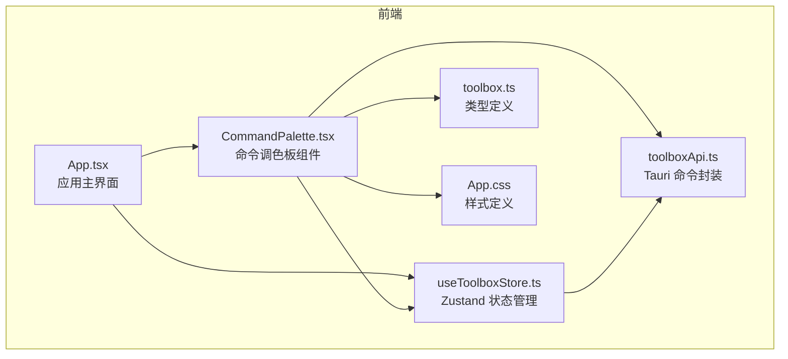
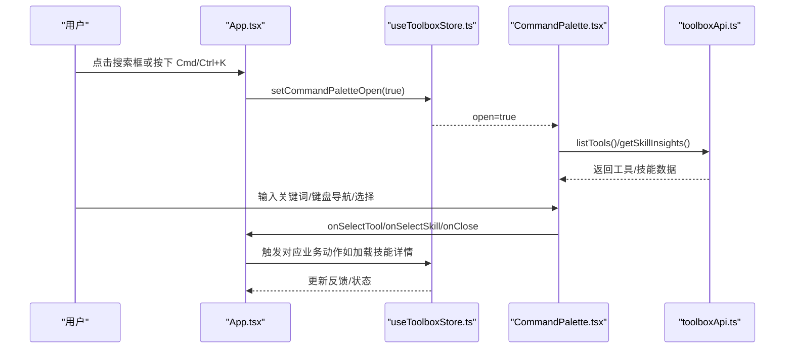
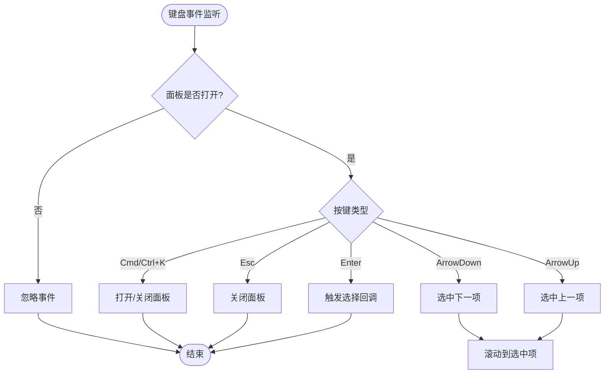
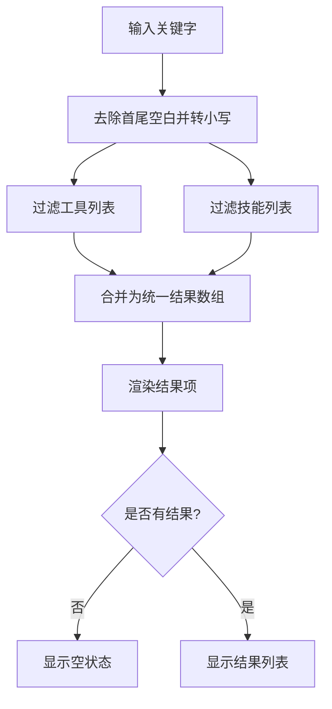
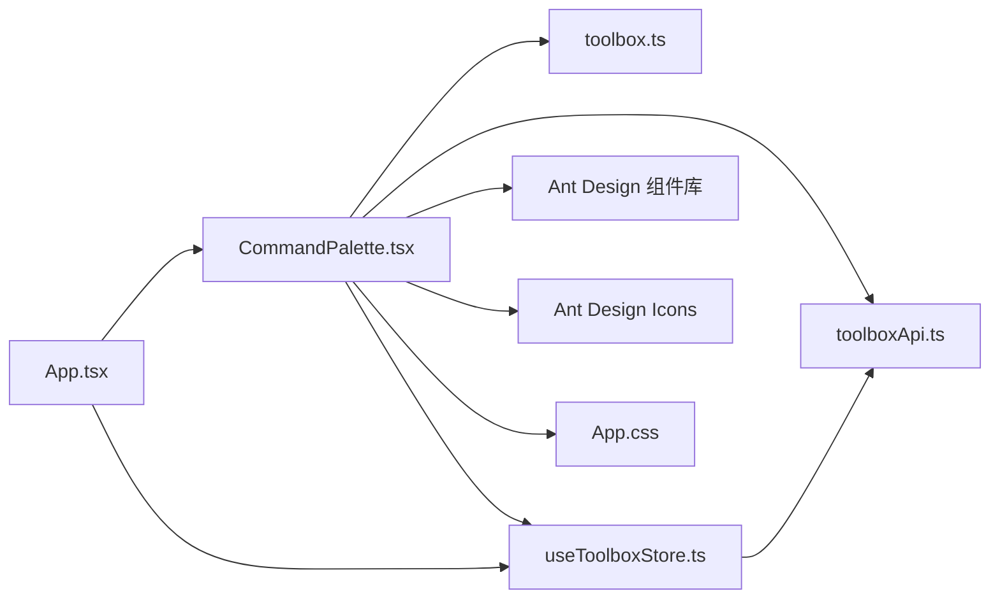

# 命令调色板

<cite>
**本文档引用的文件**
- [CommandPalette.tsx](file://src/components/CommandPalette.tsx)
- [App.tsx](file://src/App.tsx)
- [useToolboxStore.ts](file://src/store/useToolboxStore.ts)
- [toolboxApi.ts](file://src/lib/toolboxApi.ts)
- [toolbox.ts](file://src/types/toolbox.ts)
- [App.css](file://src/App.css)
- [main.tsx](file://src/main.tsx)
</cite>

## 目录
1. [简介](#简介)
2. [项目结构](#项目结构)
3. [核心组件](#核心组件)
4. [架构总览](#架构总览)
5. [详细组件分析](#详细组件分析)
6. [依赖关系分析](#依赖关系分析)
7. [性能考量](#性能考量)
8. [故障排查指南](#故障排查指南)
9. [结论](#结论)
10. [附录](#附录)

## 简介
命令调色板是一个全局的快速导航与功能触发入口，用户可通过键盘快捷键或点击触发弹出搜索面板，输入关键词即可快速定位工具或技能并执行相应操作。该组件采用轻量级模态对话框承载，结合输入过滤、键盘导航与无障碍属性，提供流畅的上下文感知体验。

## 项目结构
命令调色板作为应用的一个独立 UI 组件，位于前端组件目录中，并通过全局状态管理控制其可见性与数据源。其样式定义在应用级样式文件中，确保与整体主题风格一致。

图表来源
- [App.tsx:138-194](file://src/App.tsx#L138-L194)
- [CommandPalette.tsx:32-40](file://src/components/CommandPalette.tsx#L32-L40)
- [useToolboxStore.ts:145-194](file://src/store/useToolboxStore.ts#L145-L194)
- [toolboxApi.ts:387-396](file://src/lib/toolboxApi.ts#L387-L396)
- [toolbox.ts:33-43](file://src/types/toolbox.ts#L33-L43)
- [App.css:2313-2440](file://src/App.css#L2313-L2440)

章节来源
- [App.tsx:138-194](file://src/App.tsx#L138-L194)
- [CommandPalette.tsx:32-40](file://src/components/CommandPalette.tsx#L32-L40)
- [useToolboxStore.ts:145-194](file://src/store/useToolboxStore.ts#L145-L194)
- [toolboxApi.ts:387-396](file://src/lib/toolboxApi.ts#L387-L396)
- [toolbox.ts:33-43](file://src/types/toolbox.ts#L33-L43)
- [App.css:2313-2440](file://src/App.css#L2313-L2440)

## 核心组件
命令调色板组件负责：
- 接收外部传入的工具与技能数据，以及选择回调
- 维护输入关键字、活动索引等内部状态
- 提供键盘快捷键与鼠标交互
- 渲染搜索结果列表与辅助信息
- 与应用状态管理联动控制打开/关闭

关键接口与职责
- Props 输入：open、tools、skills、onSelectTool、onSelectSkill、onClose、onOpen
- 内部状态：keyword、activeIndex、refs（输入框、结果列表、结果项）
- 计算结果：按关键词过滤后的工具与技能列表，合并为统一结果数组
- 事件处理：键盘事件（Cmd/Ctrl+K、Esc、上下箭头、Enter）、鼠标悬停与点击
- 渲染：搜索框、结果列表、空状态、底部提示与计数

章节来源
- [CommandPalette.tsx:21-40](file://src/components/CommandPalette.tsx#L21-L40)
- [CommandPalette.tsx:41-99](file://src/components/CommandPalette.tsx#L41-L99)
- [CommandPalette.tsx:101-156](file://src/components/CommandPalette.tsx#L101-L156)
- [CommandPalette.tsx:184-239](file://src/components/CommandPalette.tsx#L184-L239)

## 架构总览
命令调色板与应用系统通过以下方式交互：
- 应用主界面通过状态管理控制命令调色板的打开/关闭
- 组件从状态管理中获取工具与技能数据
- 用户选择后，组件回调上层函数执行具体业务动作（如打开技能详情、执行同步等）
- Tauri API 用于读取工具列表、技能洞察等数据

图表来源
- [App.tsx:703-703](file://src/App.tsx#L703-L703)
- [useToolboxStore.ts:463-463](file://src/store/useToolboxStore.ts#L463-L463)
- [CommandPalette.tsx:144-150](file://src/components/CommandPalette.tsx#L144-L150)
- [toolboxApi.ts:387-396](file://src/lib/toolboxApi.ts#L387-L396)

## 详细组件分析

### 设计理念与实现要点
- 快速入口：通过全局快捷键 Cmd/Ctrl+K 打开，Esc 关闭，符合用户对“命令面板”的预期
- 上下文感知：根据当前工具与技能数据动态生成候选结果，支持多字段匹配
- 无障碍友好：为结果项提供 role 与 aria-selected 属性，便于屏幕阅读器识别
- 性能优化：使用 useMemo 缓存过滤结果，避免重复计算；滚动到选中项提升导航效率

章节来源
- [CommandPalette.tsx:101-156](file://src/components/CommandPalette.tsx#L101-L156)
- [CommandPalette.tsx:184-239](file://src/components/CommandPalette.tsx#L184-L239)

### 状态管理机制
- 外部状态：由应用状态管理维护 commandPaletteOpen，组件仅接收 open 与回调
- 内部状态：keyword（输入关键字）、activeIndex（当前选中项索引），随输入与键盘导航变化
- 生命周期：打开时聚焦输入框，关闭时清空关键字并重置选中项

章节来源
- [CommandPalette.tsx:41-99](file://src/components/CommandPalette.tsx#L41-L99)
- [useToolboxStore.ts:463-463](file://src/store/useToolboxStore.ts#L463-L463)

### 事件处理流程
- 键盘事件：
  - Cmd/Ctrl+K：打开/关闭面板
  - Esc：关闭面板
  - ArrowUp/ArrowDown：上下导航
  - Enter：选择当前项并触发回调
- 鼠标事件：
  - 鼠标悬停：更新活动索引
  - 点击：触发选择并关闭面板

图表来源
- [CommandPalette.tsx:101-156](file://src/components/CommandPalette.tsx#L101-L156)
- [CommandPalette.tsx:158-164](file://src/components/CommandPalette.tsx#L158-L164)

### 数据流与渲染
- 数据来源：tools 与 skills 由上层传入，组件内部进行过滤与合并
- 渲染策略：根据结果数量决定显示空状态或结果列表；为每个结果项提供唯一 key 与可访问属性
- 结果项类型：工具项与技能项分别渲染不同元信息与标签

图表来源
- [CommandPalette.tsx:48-74](file://src/components/CommandPalette.tsx#L48-L74)
- [CommandPalette.tsx:285-299](file://src/components/CommandPalette.tsx#L285-L299)

### 与应用系统的交互模式
- 命令注册：组件不直接注册命令，而是通过 props 接收工具与技能数据，形成候选集合
- 执行回调：用户选择后，组件调用 onSelectTool 或 onSelectSkill 回调，交由上层处理
- 上下文感知：组件本身不关心业务逻辑，仅负责呈现与交互；业务动作由上层状态管理与 API 调用实现

章节来源
- [CommandPalette.tsx:25-27](file://src/components/CommandPalette.tsx#L25-L27)
- [App.tsx:193-194](file://src/App.tsx#L193-L194)

### 使用示例与集成指南
- 基本集成
  - 在应用主界面中，将命令调色板组件包裹在状态管理之下
  - 通过状态管理的 setCommandPaletteOpen 控制 open 状态
  - 传入 tools 与 skills 数据，以及 onSelectTool、onSelectSkill、onClose、onOpen 回调
- 命令定义
  - 工具与技能数据来源于 Tauri API，组件不直接定义命令
  - 可通过状态管理刷新工具列表与技能洞察
- 快捷键配置
  - 默认支持 Cmd/Ctrl+K 打开/关闭，Esc 关闭
  - 可在组件内扩展更多快捷键映射
- 样式定制
  - 命令调色板样式集中在 App.css 中，可调整颜色、字体、尺寸等变量
  - 通过类名 command-palette-* 进行局部覆盖

章节来源
- [App.tsx:703-703](file://src/App.tsx#L703-L703)
- [useToolboxStore.ts:174-181](file://src/store/useToolboxStore.ts#L174-L181)
- [toolboxApi.ts:387-396](file://src/lib/toolboxApi.ts#L387-L396)
- [App.css:2313-2440](file://src/App.css#L2313-L2440)

### 键盘导航与无障碍支持
- 键盘导航：上下箭头在结果间循环移动，Enter 选择当前项
- 无障碍属性：为结果项设置 role="option" 与 aria-selected，便于屏幕阅读器识别当前选中项
- 焦点管理：打开时自动聚焦输入框，关闭时清空关键字并重置选中项

章节来源
- [CommandPalette.tsx:101-156](file://src/components/CommandPalette.tsx#L101-L156)
- [CommandPalette.tsx:184-239](file://src/components/CommandPalette.tsx#L184-L239)

## 依赖关系分析
命令调色板组件的依赖关系如下：

图表来源
- [CommandPalette.tsx:3-6](file://src/components/CommandPalette.tsx#L3-L6)
- [toolbox.ts:33-43](file://src/types/toolbox.ts#L33-L43)
- [toolboxApi.ts:1-19](file://src/lib/toolboxApi.ts#L1-L19)
- [useToolboxStore.ts:1-18](file://src/store/useToolboxStore.ts#L1-L18)
- [App.tsx:6-69](file://src/App.tsx#L6-L69)
- [App.css:2313-2440](file://src/App.css#L2313-L2440)

章节来源
- [CommandPalette.tsx:3-6](file://src/components/CommandPalette.tsx#L3-L6)
- [toolbox.ts:33-43](file://src/types/toolbox.ts#L33-L43)
- [toolboxApi.ts:1-19](file://src/lib/toolboxApi.ts#L1-L19)
- [useToolboxStore.ts:1-18](file://src/store/useToolboxStore.ts#L1-L18)
- [App.tsx:6-69](file://src/App.tsx#L6-L69)
- [App.css:2313-2440](file://src/App.css#L2313-L2440)

## 性能考量
- 计算优化：使用 useMemo 对过滤后的工具、技能与合并结果进行缓存，减少不必要的重渲染
- DOM 引用：通过 useRef 管理输入框、结果列表与结果项的 DOM 引用，避免频繁查询
- 滚动优化：仅在活动索引变化时滚动到选中项，减少滚动抖动
- 渲染策略：空状态与结果列表分别渲染，避免在无结果时渲染大量节点

章节来源
- [CommandPalette.tsx:50-74](file://src/components/CommandPalette.tsx#L50-L74)
- [CommandPalette.tsx:158-164](file://src/components/CommandPalette.tsx#L158-L164)

## 故障排查指南
- 打不开命令调色板
  - 检查状态管理中的 commandPaletteOpen 是否被正确设置
  - 确认 onOpen 回调是否传入并可调用
- 无法搜索到结果
  - 检查 tools 与 skills 数据是否正确传入
  - 确认过滤逻辑是否按名称、描述、ID 等字段匹配
- 键盘快捷键无效
  - 确认事件监听是否绑定到 document
  - 检查是否与其他快捷键冲突
- 选中项不生效
  - 确认 onSelectTool 或 onSelectSkill 回调是否正确实现
  - 检查 onClose 是否在选择后被调用

章节来源
- [useToolboxStore.ts:463-463](file://src/store/useToolboxStore.ts#L463-L463)
- [CommandPalette.tsx:101-156](file://src/components/CommandPalette.tsx#L101-L156)
- [CommandPalette.tsx:144-150](file://src/components/CommandPalette.tsx#L144-L150)

## 结论
命令调色板组件通过简洁的接口与完善的事件处理，实现了高效的命令入口与上下文感知导航。其与应用状态管理、Tauri API 的解耦设计，使得组件既可独立演进，又能无缝融入整体业务流程。配合样式定制与无障碍支持，能够满足桌面端复杂场景下的快速操作需求。

## 附录
- 类型定义参考：工具与技能的数据结构定义
- 样式参考：命令调色板的 CSS 类名与变量
- 入口集成参考：应用主界面如何触发命令调色板

章节来源
- [toolbox.ts:33-43](file://src/types/toolbox.ts#L33-L43)
- [App.css:2313-2440](file://src/App.css#L2313-L2440)
- [App.tsx:703-703](file://src/App.tsx#L703-L703)