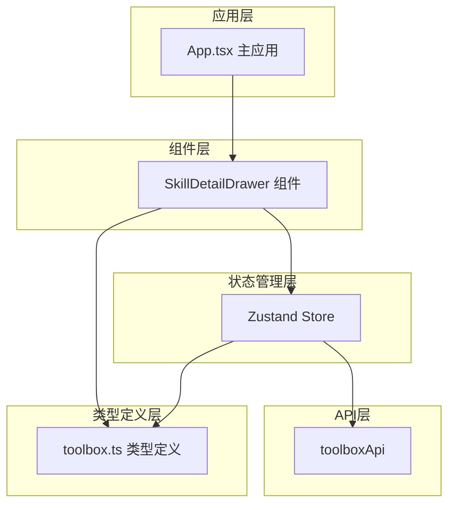
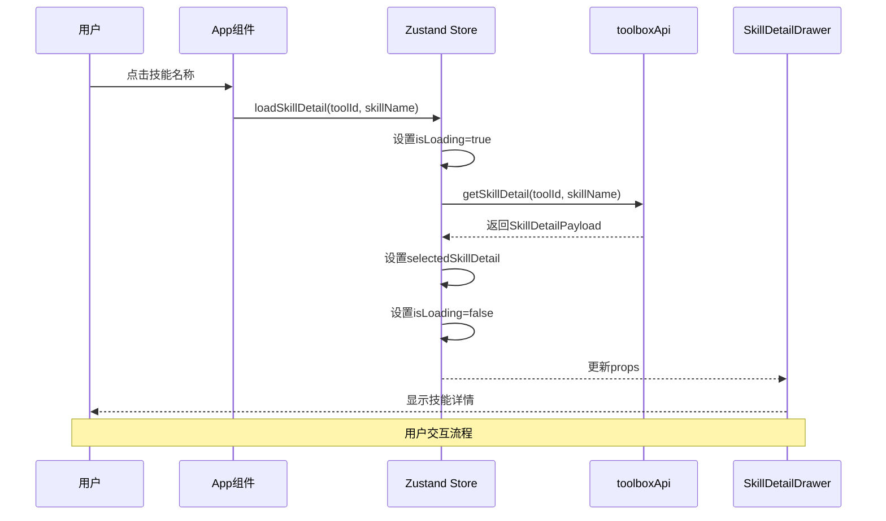
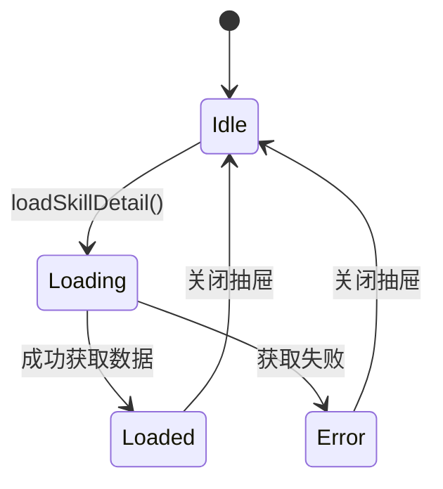
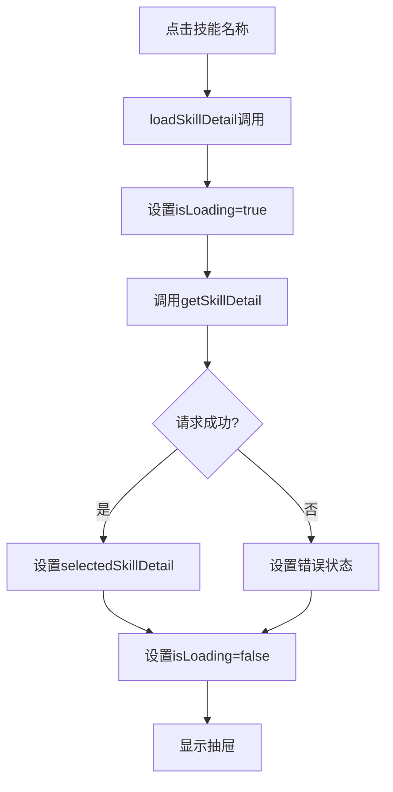
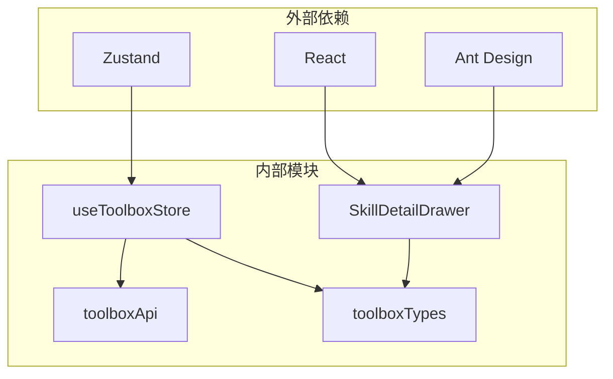

# 技能详情抽屉

<cite>
**本文档引用的文件**
- [SkillDetailDrawer.tsx](file://src/components/SkillDetailDrawer.tsx)
- [toolbox.ts](file://src/types/toolbox.ts)
- [useToolboxStore.ts](file://src/store/useToolboxStore.ts)
- [toolboxApi.ts](file://src/lib/toolboxApi.ts)
- [App.tsx](file://src/App.tsx)
</cite>

## 目录
1. [简介](#简介)
2. [项目结构](#项目结构)
3. [核心组件](#核心组件)
4. [架构概览](#架构概览)
5. [详细组件分析](#详细组件分析)
6. [依赖关系分析](#依赖关系分析)
7. [性能考虑](#性能考虑)
8. [故障排除指南](#故障排除指南)
9. [结论](#结论)
10. [附录](#附录)

## 简介

技能详情抽屉组件是一个专门用于展示AI工具技能详细信息的React组件。它基于Ant Design的Drawer组件构建，提供了技能文档内容的可视化展示功能，支持SKILL.md和README.md两种文档格式的渲染。

该组件采用现代化的React Hooks模式，结合Zustand状态管理库，实现了完整的技能详情加载、展示和交互功能。组件设计遵循响应式原则，能够适配不同屏幕尺寸，并提供了良好的用户体验。

## 项目结构

技能详情抽屉组件位于项目的组件目录中，与应用的主要业务逻辑紧密集成：



**图表来源**
- [SkillDetailDrawer.tsx:1-120](file://src/components/SkillDetailDrawer.tsx#L1-L120)
- [useToolboxStore.ts:145-556](file://src/store/useToolboxStore.ts#L145-L556)
- [toolboxApi.ts:723-728](file://src/lib/toolboxApi.ts#L723-L728)

**章节来源**
- [SkillDetailDrawer.tsx:1-120](file://src/components/SkillDetailDrawer.tsx#L1-L120)
- [App.tsx:1747-1752](file://src/App.tsx#L1747-L1752)

## 核心组件

技能详情抽屉组件的核心功能围绕以下关键特性展开：

### 组件接口设计

组件采用简洁明了的接口设计，包含以下核心属性：

- `open`: 控制抽屉显示/隐藏的布尔值
- `detail`: 技能详情数据对象，包含技能名称和文档内容
- `isLoading`: 加载状态指示器
- `onClose`: 关闭回调函数

### 数据结构定义

组件使用标准化的数据结构来表示技能详情：

```typescript
export interface SkillDetailPayload {
  skillName: string
  skillMdContent?: string
  readmeContent?: string
}
```

该结构支持两种文档格式的展示：
- SKILL.md文档内容
- README.md文档内容

**章节来源**
- [SkillDetailDrawer.tsx:3-14](file://src/components/SkillDetailDrawer.tsx#L3-L14)
- [toolbox.ts:136-140](file://src/types/toolbox.ts#L136-L140)

## 架构概览

技能详情抽屉组件在整个应用架构中扮演着重要的角色，它与状态管理、API调用和UI渲染形成了完整的数据流：



**图表来源**
- [App.tsx:920-922](file://src/App.tsx#L920-L922)
- [useToolboxStore.ts:467-479](file://src/store/useToolboxStore.ts#L467-L479)
- [toolboxApi.ts:723-728](file://src/lib/toolboxApi.ts#L723-L728)

## 详细组件分析

### 组件状态管理机制

技能详情抽屉组件的状态管理采用了分层设计：

#### 1. 组件内部状态
- `open`: 由父组件控制的显示状态
- `isLoading`: 内部加载状态
- `detail`: 当前显示的技能详情数据

#### 2. 全局状态管理
组件通过Zustand状态管理库实现全局状态共享：



**图表来源**
- [useToolboxStore.ts:467-479](file://src/store/useToolboxStore.ts#L467-L479)

#### 3. 状态流转逻辑

组件的状态流转遵循严格的业务逻辑：

**章节来源**
- [useToolboxStore.ts:465-479](file://src/store/useToolboxStore.ts#L465-L479)

### 事件处理流程

组件的事件处理流程设计精简而高效：

#### 1. 技能详情加载流程
当用户点击技能名称时，会触发完整的数据加载流程：



**图表来源**
- [App.tsx:920-922](file://src/App.tsx#L920-L922)
- [useToolboxStore.ts:467-479](file://src/store/useToolboxStore.ts#L467-L479)

#### 2. 抽屉关闭流程
抽屉的关闭通过标准的onClose回调实现，确保状态的一致性。

### 组件渲染逻辑

组件的渲染逻辑根据不同的状态返回相应的UI结构：

#### 1. 加载状态渲染
当组件处于加载状态时，显示大型旋转指示器和加载提示文本。

#### 2. 无数据状态渲染
当没有技能详情数据时，显示友好的空状态提示。

#### 3. 正常内容渲染
当有数据时，根据文档类型分别渲染SKILL.md和README.md内容。

**章节来源**
- [SkillDetailDrawer.tsx:27-116](file://src/components/SkillDetailDrawer.tsx#L27-L116)

### 文档内容展示

组件支持两种文档格式的展示，每种格式都有特定的样式和布局：

#### SKILL.md文档展示
- 使用等宽字体显示
- 应用背景色和边框样式
- 支持长文本换行和滚动

#### README.md文档展示
- 采用相同的样式系统
- 保持内容的原始格式

**章节来源**
- [SkillDetailDrawer.tsx:50-108](file://src/components/SkillDetailDrawer.tsx#L50-L108)

## 依赖关系分析

技能详情抽屉组件的依赖关系清晰明确，遵循单一职责原则：



**图表来源**
- [SkillDetailDrawer.tsx:1](file://src/components/SkillDetailDrawer.tsx#L1)
- [useToolboxStore.ts:1](file://src/store/useToolboxStore.ts#L1)
- [toolboxApi.ts:1](file://src/lib/toolboxApi.ts#L1)

### 组件耦合度分析

组件与外部系统的耦合度较低，主要体现在：

1. **UI框架依赖**: 仅依赖Ant Design的Drawer和Typography组件
2. **状态管理依赖**: 通过Zustand实现状态共享
3. **数据接口依赖**: 通过toolboxApi提供统一的数据访问接口

这种设计使得组件具有良好的可测试性和可维护性。

**章节来源**
- [SkillDetailDrawer.tsx:16-17](file://src/components/SkillDetailDrawer.tsx#L16-L17)
- [useToolboxStore.ts:145-556](file://src/store/useToolboxStore.ts#L145-L556)

## 性能考虑

技能详情抽屉组件在设计时充分考虑了性能优化：

### 1. 渲染优化
- 使用React.memo避免不必要的重新渲染
- 条件渲染减少DOM节点数量
- 动态样式计算最小化

### 2. 状态管理优化
- 局部状态管理减少全局状态更新
- 异步数据加载避免阻塞主线程
- 错误状态快速反馈

### 3. 内存管理
- destroyOnClose属性确保抽屉关闭时释放内存
- 及时清理异步操作避免内存泄漏

## 故障排除指南

### 常见问题及解决方案

#### 1. 技能详情无法加载
**症状**: 抽屉显示加载状态但长时间不消失
**可能原因**:
- API调用失败
- 网络连接问题
- 参数传递错误

**解决方法**:
- 检查网络连接状态
- 验证toolId和skillName参数
- 查看浏览器开发者工具的网络面板

#### 2. 文档内容显示异常
**症状**: 文档内容格式错乱或显示不完整
**可能原因**:
- 文档编码问题
- 字符串处理错误
- 样式冲突

**解决方法**:
- 检查文档编码格式
- 验证字符串转义处理
- 检查CSS样式优先级

#### 3. 抽屉无法关闭
**症状**: 抽屉打开后无法通过正常方式关闭
**可能原因**:
- onClose回调未正确设置
- 父组件状态管理问题
- 事件监听器冲突

**解决方法**:
- 确认onClose回调函数
- 检查父组件状态更新逻辑
- 移除可能的事件监听器冲突

**章节来源**
- [useToolboxStore.ts:471-476](file://src/store/useToolboxStore.ts#L471-L476)

## 结论

技能详情抽屉组件是一个设计精良、功能完善的React组件。它成功地解决了技能详情展示这一核心需求，通过合理的架构设计和状态管理，为用户提供了流畅的使用体验。

组件的主要优势包括：
- **清晰的职责分离**: 组件专注于UI展示，状态管理独立于业务逻辑
- **良好的扩展性**: 支持多种文档格式和自定义样式
- **优秀的用户体验**: 响应式设计和直观的交互流程
- **可靠的错误处理**: 完善的错误状态管理和用户反馈

未来可以考虑的功能增强：
- 添加文档搜索和高亮功能
- 支持更多文档格式
- 实现文档内容缓存机制
- 增加文档编辑功能

## 附录

### 组件属性配置

| 属性名 | 类型 | 必需 | 默认值 | 描述 |
|--------|------|------|--------|------|
| open | boolean | 是 | - | 控制抽屉显示/隐藏 |
| detail | SkillDetailPayload \| null | 是 | - | 技能详情数据 |
| isLoading | boolean | 是 | - | 加载状态指示 |
| onClose | () => void | 是 | - | 关闭回调函数 |

### 使用示例

#### 基本使用
```typescript
<SkillDetailDrawer
  open={skillDetailOpen}
  detail={selectedSkillDetail}
  isLoading={isSkillDetailLoading}
  onClose={() => setSkillDetailOpen(false)}
/>
```

#### 与状态管理集成
```typescript
const {
  skillDetailOpen,
  selectedSkillDetail,
  isSkillDetailLoading,
  setSkillDetailOpen,
  loadSkillDetail
} = useToolboxStore();

// 触发技能详情加载
loadSkillDetail(toolId, skillName);
```

### 样式定制指南

组件支持通过CSS变量进行样式定制：

- `--ant-color-text`: 文本颜色
- `--ant-color-bg-container-secondary`: 容器背景色
- `--ant-color-border`: 边框颜色

这些变量确保了组件在不同主题下的良好适配性。