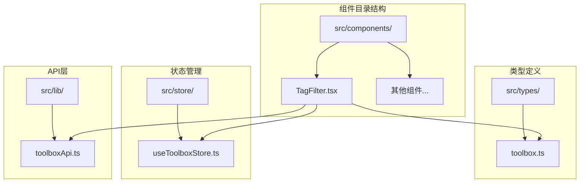
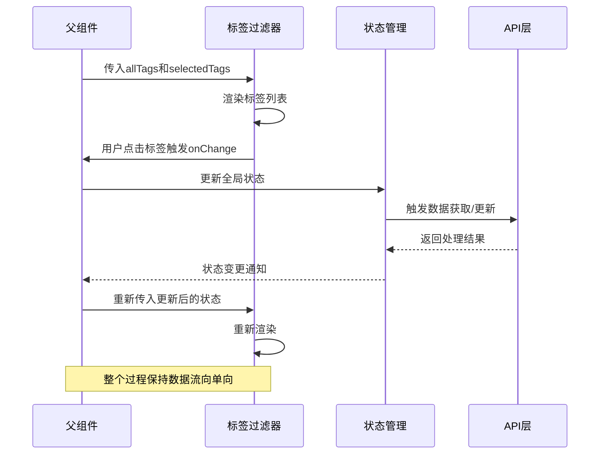
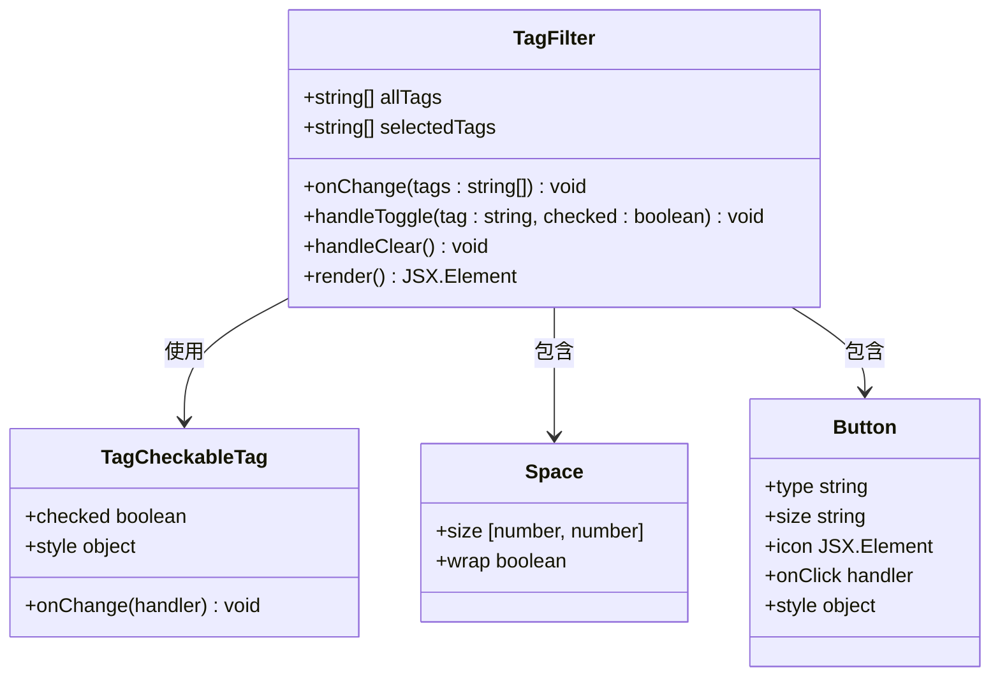
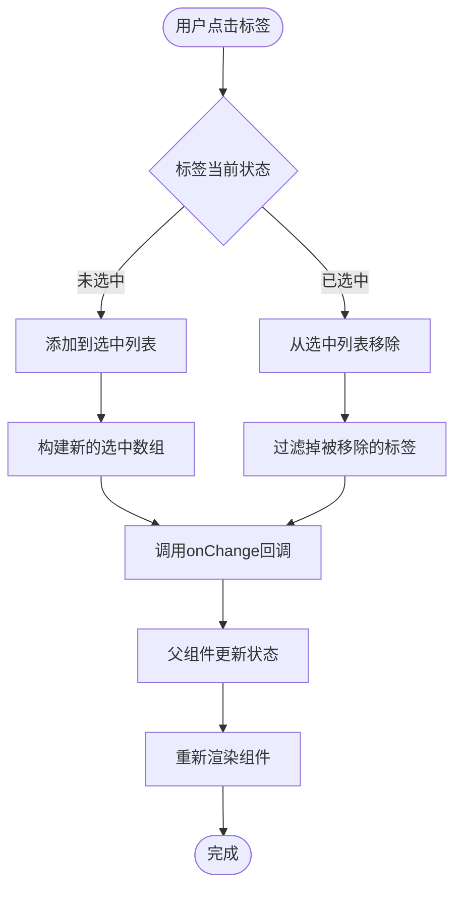
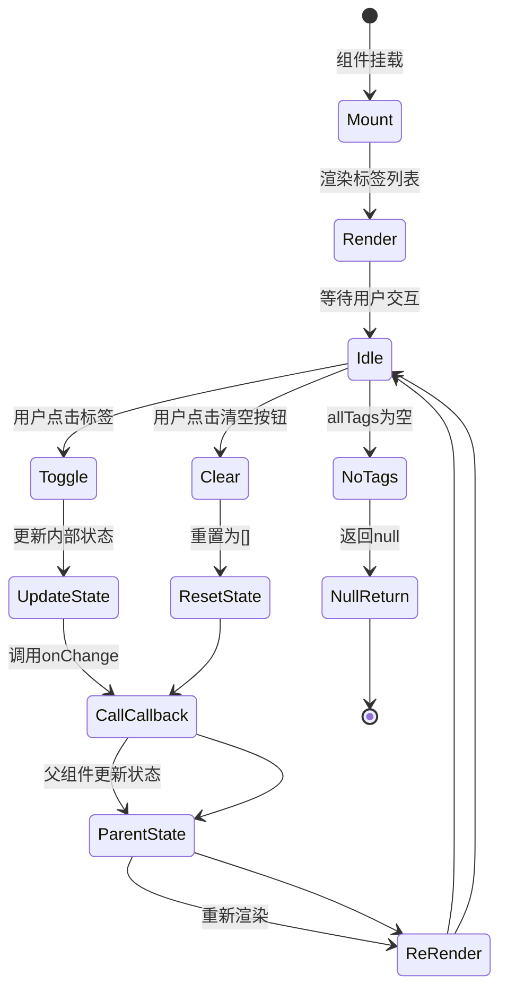
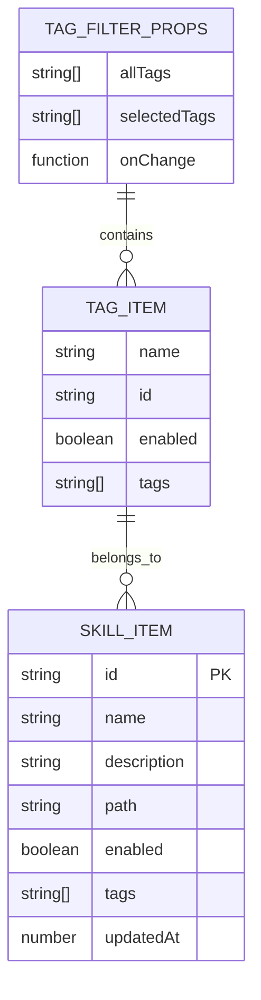
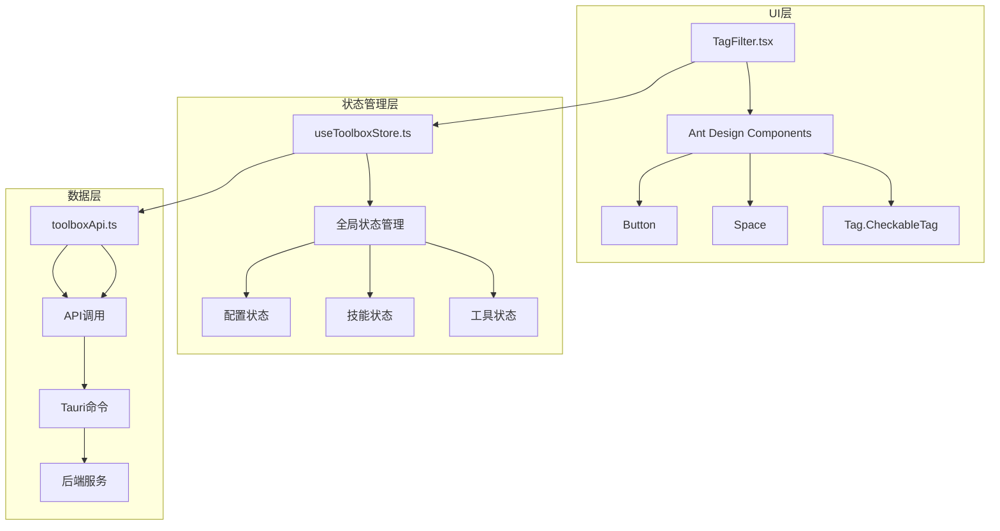

# 标签过滤器

<cite>
**本文档引用的文件**
- [TagFilter.tsx](file://src/components/TagFilter.tsx)
- [toolbox.ts](file://src/types/toolbox.ts)
- [useToolboxStore.ts](file://src/store/useToolboxStore.ts)
- [toolboxApi.ts](file://src/lib/toolboxApi.ts)
- [App.tsx](file://src/App.tsx)
- [CenterRepoPanel.tsx](file://src/components/CenterRepoPanel.tsx)
</cite>

## 目录
1. [简介](#简介)
2. [项目结构](#项目结构)
3. [核心组件](#核心组件)
4. [架构概览](#架构概览)
5. [详细组件分析](#详细组件分析)
6. [依赖关系分析](#依赖关系分析)
7. [性能考量](#性能考量)
8. [故障排除指南](#故障排除指南)
9. [结论](#结论)
10. [附录](#附录)

## 简介
标签过滤器是一个轻量级的React组件，专门用于在AI工具箱应用中实现标签驱动的筛选功能。该组件基于Ant Design的可勾选标签组件构建，提供了直观的多选标签筛选界面，支持标签的添加、移除和一键清空操作。

该组件的核心设计理念是"无状态UI组件 + 外部状态管理"的模式，通过props接收标签数据和当前选中状态，并通过回调函数通知父组件状态变化。这种设计使得组件具有高度的可复用性和灵活性，可以轻松集成到不同的业务场景中。

## 项目结构
标签过滤器组件位于src/components目录下，采用单一文件组件的形式，结构简洁明了：



**图表来源**
- [TagFilter.tsx:1-58](file://src/components/TagFilter.tsx#L1-L58)
- [toolbox.ts:1-152](file://src/types/toolbox.ts#L1-L152)

**章节来源**
- [TagFilter.tsx:1-58](file://src/components/TagFilter.tsx#L1-L58)
- [toolbox.ts:1-152](file://src/types/toolbox.ts#L1-L152)

## 核心组件
标签过滤器组件的核心功能由以下关键要素构成：

### 组件接口设计
组件通过严格的props接口定义来确保类型安全：
- `allTags`: string[] - 所有可用标签的完整列表
- `selectedTags`: string[] - 当前选中的标签集合
- `onChange`: (tags: string[]) => void - 状态变更回调函数

### 状态管理机制
组件采用受控组件模式，所有状态都由父组件管理：
- 标签选项生成：从allTags属性动态渲染
- 筛选条件维护：通过selectedTags属性跟踪当前选中状态
- 过滤结果计算：由父组件根据selectedTags进行实际的数据筛选

### 事件处理流程
组件内部实现了完整的事件处理机制：
- 标签切换：handleToggle方法处理单个标签的选中/取消选中
- 清空操作：handleClear方法一键清除所有选中标签
- 空状态处理：当标签列表为空时返回null，避免渲染无意义的DOM节点

**章节来源**
- [TagFilter.tsx:5-26](file://src/components/TagFilter.tsx#L5-L26)
- [TagFilter.tsx:11-55](file://src/components/TagFilter.tsx#L11-L55)

## 架构概览
标签过滤器在整个应用架构中扮演着重要的UI交互角色，与多个层级的组件协同工作：



**图表来源**
- [TagFilter.tsx:11-55](file://src/components/TagFilter.tsx#L11-L55)
- [useToolboxStore.ts:145-555](file://src/store/useToolboxStore.ts#L145-L555)

## 详细组件分析

### 组件类图


**图表来源**
- [TagFilter.tsx:11-55](file://src/components/TagFilter.tsx#L11-L55)

### 标签切换逻辑流程


**图表来源**
- [TagFilter.tsx:12-18](file://src/components/TagFilter.tsx#L12-L18)

### 组件生命周期


**图表来源**
- [TagFilter.tsx:24-26](file://src/components/TagFilter.tsx#L24-L26)
- [TagFilter.tsx:20-22](file://src/components/TagFilter.tsx#L20-L22)

**章节来源**
- [TagFilter.tsx:1-58](file://src/components/TagFilter.tsx#L1-L58)

### 数据模型与类型定义
组件使用的数据结构相对简单但设计精良：



**图表来源**
- [toolbox.ts:7-20](file://src/types/toolbox.ts#L7-L20)
- [toolbox.ts:142-151](file://src/types/toolbox.ts#L142-L151)

**章节来源**
- [toolbox.ts:7-20](file://src/types/toolbox.ts#L7-L20)
- [toolbox.ts:142-151](file://src/types/toolbox.ts#L142-L151)

## 依赖关系分析

### 组件间依赖关系


**图表来源**
- [TagFilter.tsx:1-3](file://src/components/TagFilter.tsx#L1-L3)
- [useToolboxStore.ts:145-555](file://src/store/useToolboxStore.ts#L145-L555)
- [toolboxApi.ts:1-784](file://src/lib/toolboxApi.ts#L1-L784)

### 外部依赖分析
组件对外部依赖的管理体现了良好的架构设计：

| 依赖类型 | 依赖名称 | 版本 | 用途 |
|---------|---------|------|------|
| UI框架 | antd | 最新版本 | 提供标签、空间布局、按钮组件 |
| 图标库 | @ant-design/icons | 最新版本 | 提供清空筛选的图标 |
| 状态管理 | zustand | 最新版本 | 全局状态管理（在父组件中使用） |

**章节来源**
- [TagFilter.tsx:1-3](file://src/components/TagFilter.tsx#L1-L3)
- [useToolboxStore.ts:1-30](file://src/store/useToolboxStore.ts#L1-L30)

## 性能考量

### 渲染优化策略
组件采用了多项性能优化措施：

1. **空状态检查**：当allTags长度为0时直接返回null，避免不必要的DOM渲染
2. **受控组件模式**：所有状态由父组件管理，减少组件内部状态更新
3. **高效的标签切换**：使用数组过滤和展开操作，时间复杂度O(n)
4. **条件渲染**：清空按钮仅在有选中标签时显示

### 内存管理
- 组件不维护任何内部状态，完全依赖外部props
- 事件处理器使用箭头函数，避免this绑定问题
- 清空操作直接调用onChange([])，避免中间状态

### 用户体验优化
- 标签样式统一，提供一致的视觉反馈
- 支持键盘导航和屏幕阅读器访问
- 响应式布局，适配不同屏幕尺寸

## 故障排除指南

### 常见问题及解决方案

#### 问题1：标签列表不显示
**症状**：组件渲染为空白
**可能原因**：
- allTags属性为空数组
- 父组件未正确传递标签数据

**解决方法**：
```typescript
// 确保父组件正确设置标签数据
const [allTags, setAllTags] = useState<string[]>([]);
const [selectedTags, setSelectedTags] = useState<string[]>([]);

// 在父组件中确保标签数据有效
useEffect(() => {
  if (tools.length > 0) {
    const tags = tools.flatMap(tool => tool.skills.flatMap(skill => skill.tags || []));
    setAllTags([...new Set(tags)].sort());
  }
}, [tools]);
```

#### 问题2：标签切换无响应
**症状**：点击标签无法改变选中状态
**可能原因**：
- onChange回调函数未正确实现
- selectedTags属性未更新

**解决方法**：
```typescript
// 确保onChange正确实现
const handleTagChange = (newTags: string[]) => {
  setSelectedTags(newTags);
  // 触发父组件的筛选逻辑
  applyFilters(newTags);
};
```

#### 问题3：清空按钮不显示
**症状**：即使有选中标签也不显示清空按钮
**可能原因**：
- selectedTags属性未正确更新
- 条件渲染逻辑有问题

**解决方法**：
```typescript
// 检查selectedTags的更新逻辑
console.log('Selected tags:', selectedTags); // 调试输出
```

**章节来源**
- [TagFilter.tsx:24-26](file://src/components/TagFilter.tsx#L24-L26)
- [TagFilter.tsx:41-51](file://src/components/TagFilter.tsx#L41-L51)

## 结论
标签过滤器组件展现了现代React开发的最佳实践，通过简洁的接口设计、清晰的状态管理和高效的事件处理机制，为AI工具箱应用提供了强大的标签筛选能力。

该组件的核心优势在于其"无状态UI组件 + 外部状态管理"的设计模式，这种模式不仅提高了代码的可测试性和可维护性，还增强了组件的复用性。组件的性能表现优秀，内存占用低，用户体验流畅。

在未来的发展中，可以考虑添加更多的筛选选项，如标签搜索、批量操作等功能，以进一步提升用户的使用体验。

## 附录

### 使用示例
以下是一个完整的使用示例：

```typescript
// 父组件中的使用方式
function SkillManagementPanel() {
  const [allTags, setAllTags] = useState<string[]>([]);
  const [selectedTags, setSelectedTags] = useState<string[]>([]);
  
  // 从工具数据中提取标签
  useEffect(() => {
    const tags = tools.flatMap(tool => 
      tool.skills.flatMap(skill => skill.tags || [])
    );
    setAllTags([...new Set(tags)].sort());
  }, [tools]);
  
  // 处理标签筛选
  const handleTagChange = (newTags: string[]) => {
    setSelectedTags(newTags);
    // 实际的技能筛选逻辑
    const filteredSkills = filterSkillsByTags(newTags);
    setFilteredSkills(filteredSkills);
  };
  
  return (
    <div>
      <TagFilter
        allTags={allTags}
        selectedTags={selectedTags}
        onChange={handleTagChange}
      />
      {/* 其他内容 */}
    </div>
  );
}
```

### 集成指南
1. **安装依赖**：确保已安装Ant Design和相关图标库
2. **导入组件**：从src/components/TagFilter.tsx导入
3. **准备数据**：收集并整理标签数据
4. **实现回调**：提供onChange回调函数处理筛选逻辑
5. **样式定制**：根据需要调整组件样式

### 最佳实践
- 始终确保allTags和selectedTags的数据类型正确
- 在父组件中实现防抖机制，避免频繁的状态更新
- 提供适当的错误处理和边界情况处理
- 考虑添加加载状态和空状态的视觉反馈