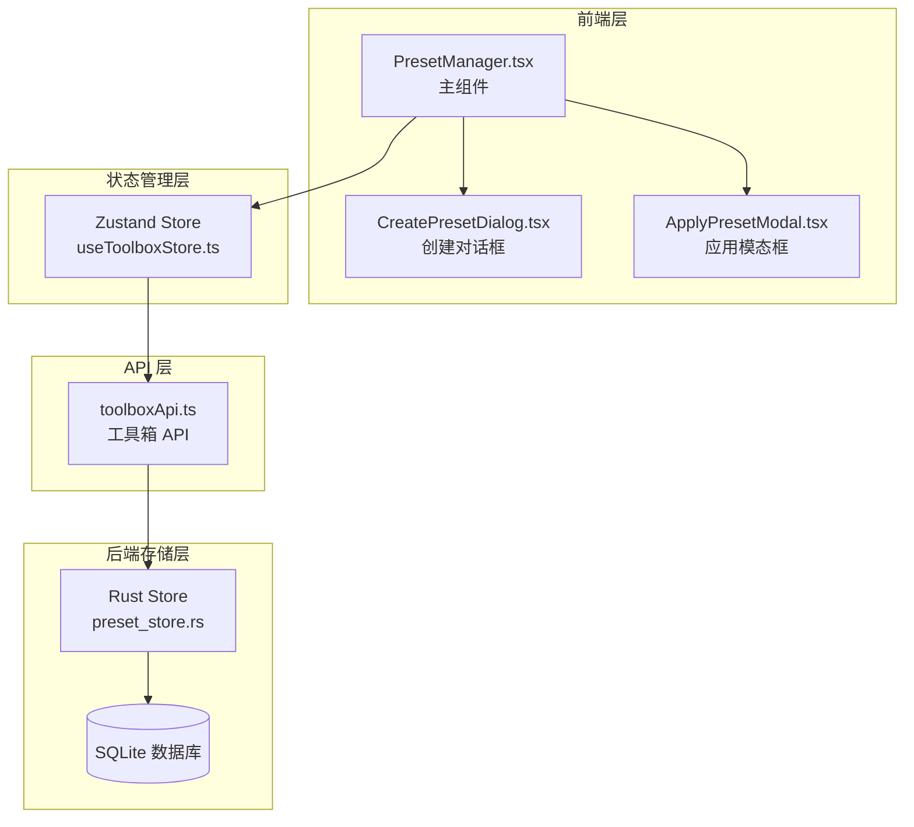
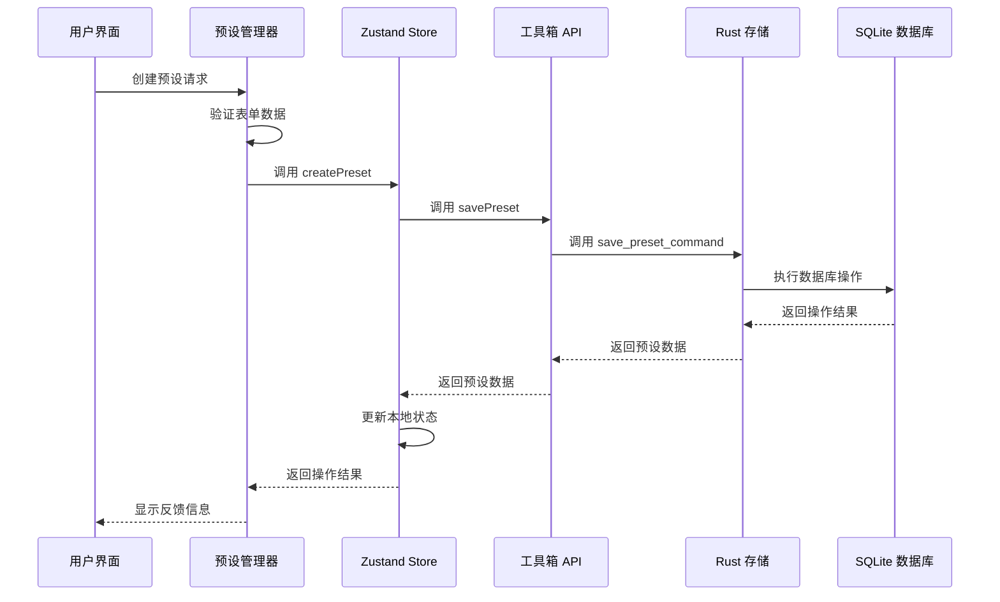
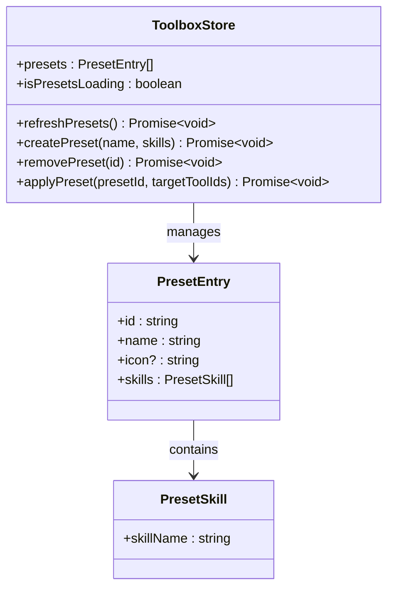
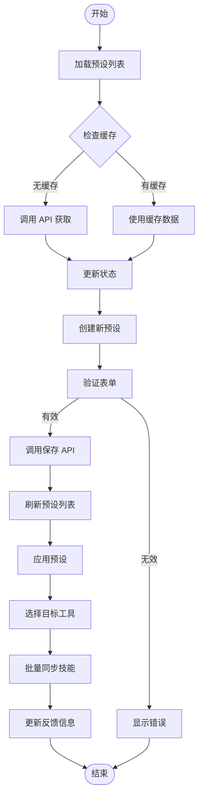
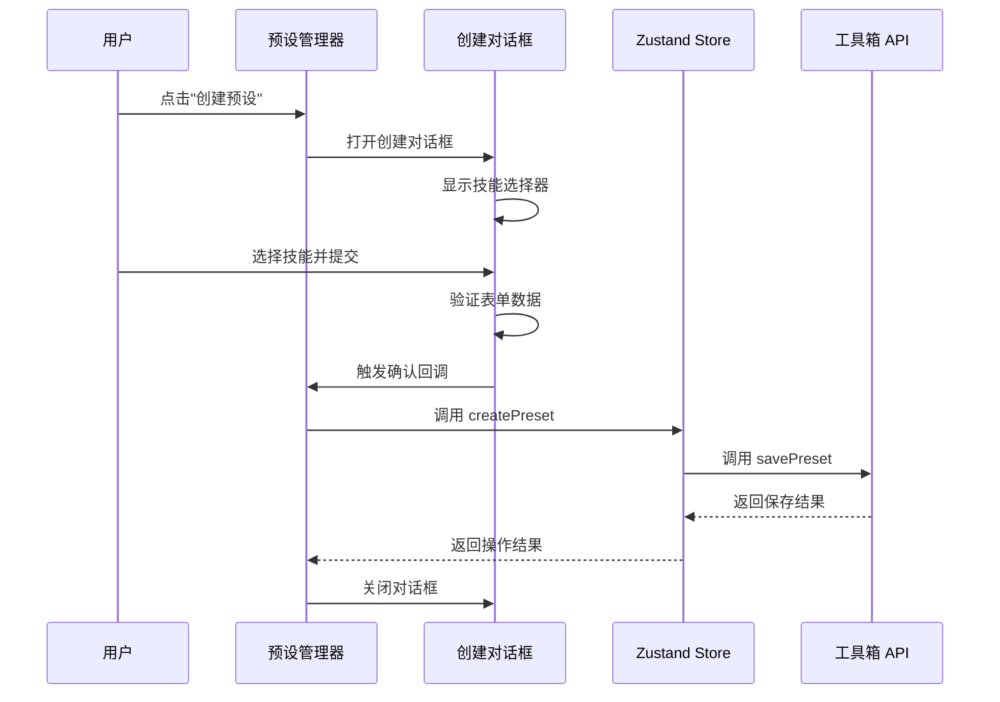
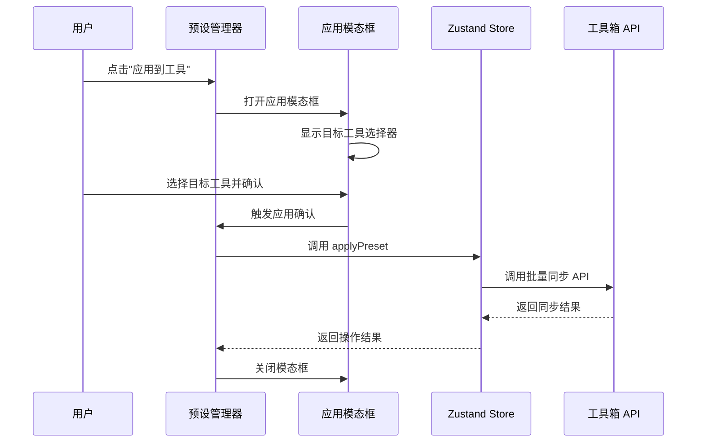
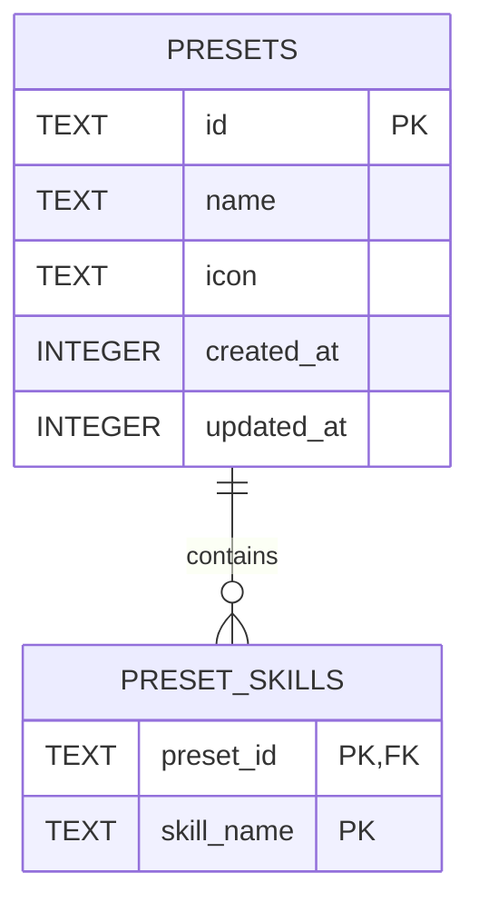
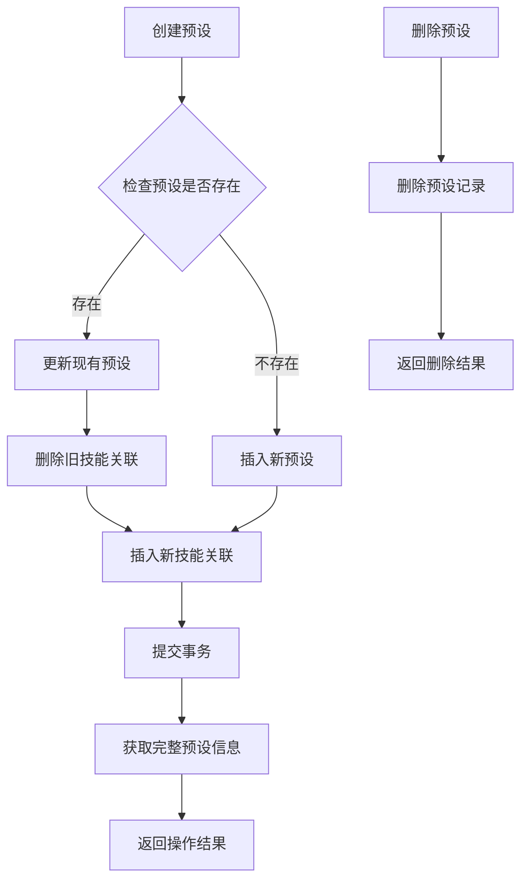
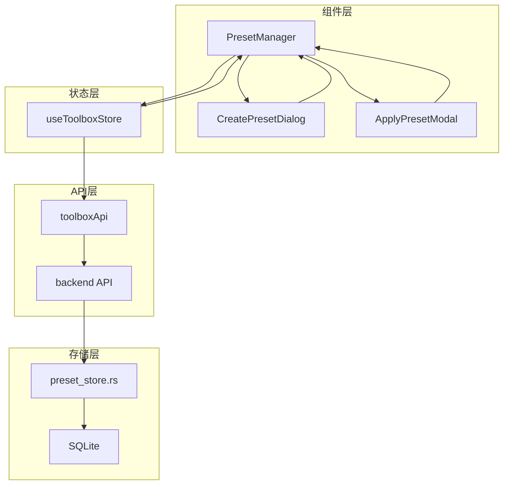

# 预设管理器

<cite>
**本文档引用的文件**
- [PresetManager.tsx](file://src/components/PresetManager.tsx)
- [toolboxApi.ts](file://src/lib/toolboxApi.ts)
- [useToolboxStore.ts](file://src/store/useToolboxStore.ts)
- [App.tsx](file://src/App.tsx)
- [preset_store.rs](file://src-tauri/src/store/preset_store.rs)
- [lib.rs](file://src-tauri/src/lib.rs)
- [types.rs](file://src-tauri/src/types.rs)
- [db.rs](file://src-tauri/src/db.rs)
- [toolbox.ts](file://src/types/toolbox.ts)
</cite>

## 目录
1. [简介](#简介)
2. [项目结构](#项目结构)
3. [核心组件](#核心组件)
4. [架构概览](#架构概览)
5. [详细组件分析](#详细组件分析)
6. [依赖关系分析](#依赖关系分析)
7. [性能考虑](#性能考虑)
8. [故障排除指南](#故障排除指南)
9. [结论](#结论)
10. [附录](#附录)

## 简介

预设管理器是 AI Toolbox 应用中的核心功能模块，负责管理技能预设的创建、编辑、应用和删除操作。该组件提供了一个直观的用户界面，允许用户快速创建技能组合预设，并将其批量应用到多个工具中。

预设管理器采用分层架构设计，包含前端 React 组件层、状态管理层、API 接口层和后端 Rust 存储层。整个系统支持完整的 CRUD 操作，具备良好的错误处理机制和数据持久化能力。

## 项目结构

预设管理器组件位于项目的前端组件目录中，与 API 层和状态管理层紧密协作：



**图表来源**
- [PresetManager.tsx:1-330](file://src/components/PresetManager.tsx#L1-L330)
- [useToolboxStore.ts:145-556](file://src/store/useToolboxStore.ts#L145-L556)
- [toolboxApi.ts:734-750](file://src/lib/toolboxApi.ts#L734-L750)

**章节来源**
- [PresetManager.tsx:1-330](file://src/components/PresetManager.tsx#L1-L330)
- [toolboxApi.ts:1-784](file://src/lib/toolboxApi.ts#L1-L784)
- [useToolboxStore.ts:145-556](file://src/store/useToolboxStore.ts#L145-L556)

## 核心组件

预设管理器由三个主要组件构成，每个组件都有明确的职责分工：

### 主组件 PresetManager
- **职责**: 管理预设列表显示、操作按钮控制、状态管理
- **功能**: 提供预设列表展示、创建新预设、应用预设到工具、删除预设等操作
- **状态**: 管理创建对话框状态、应用模态框状态、活动预设标识

### 创建对话框 CreatePresetDialog
- **职责**: 处理新预设的创建流程
- **功能**: 表单验证、技能选择、确认提交
- **特性**: 支持多选技能、自动清空搜索值、保持下拉框打开

### 应用模态框 ApplyPresetModal
- **职责**: 处理预设的应用操作
- **功能**: 目标工具选择、批量应用执行
- **特性**: 验证用户选择、提供加载状态反馈

**章节来源**
- [PresetManager.tsx:12-104](file://src/components/PresetManager.tsx#L12-L104)
- [PresetManager.tsx:106-159](file://src/components/PresetManager.tsx#L106-L159)
- [PresetManager.tsx:171-330](file://src/components/PresetManager.tsx#L171-L330)

## 架构概览

预设管理器采用分层架构，确保各层职责清晰分离：



**图表来源**
- [useToolboxStore.ts:495-507](file://src/store/useToolboxStore.ts#L495-L507)
- [toolboxApi.ts:738-746](file://src/lib/toolboxApi.ts#L738-L746)
- [lib.rs:1114-1124](file://src-tauri/src/lib.rs#L1114-L1124)

**章节来源**
- [useToolboxStore.ts:481-556](file://src/store/useToolboxStore.ts#L481-L556)
- [toolboxApi.ts:734-750](file://src/lib/toolboxApi.ts#L734-L750)
- [lib.rs:1114-1130](file://src-tauri/src/lib.rs#L1114-L1130)

## 详细组件分析

### 状态管理机制

预设管理器的状态管理采用 Zustand 状态库，实现了集中式状态管理：



**图表来源**
- [useToolboxStore.ts:32-84](file://src/store/useToolboxStore.ts#L32-L84)
- [toolbox.ts:146-151](file://src/types/toolbox.ts#L146-L151)

#### 状态流转流程



**图表来源**
- [useToolboxStore.ts:481-556](file://src/store/useToolboxStore.ts#L481-L556)
- [PresetManager.tsx:191-206](file://src/components/PresetManager.tsx#L191-L206)

### 事件处理流程

预设管理器的事件处理遵循 React 组件生命周期和状态管理模式：

#### 预设创建流程



**图表来源**
- [PresetManager.tsx:203-206](file://src/components/PresetManager.tsx#L203-L206)
- [useToolboxStore.ts:495-507](file://src/store/useToolboxStore.ts#L495-L507)

#### 预设应用流程



**图表来源**
- [PresetManager.tsx:191-201](file://src/components/PresetManager.tsx#L191-L201)
- [useToolboxStore.ts:523-554](file://src/store/useToolboxStore.ts#L523-L554)

### 数据持久化机制

预设管理器采用 SQLite 数据库存储预设数据，确保数据的持久性和可靠性：



**图表来源**
- [db.rs:87-102](file://src-tauri/src/db.rs#L87-L102)
- [preset_store.rs:9-55](file://src-tauri/src/store/preset_store.rs#L9-L55)

#### 数据库操作流程



**图表来源**
- [preset_store.rs:57-127](file://src-tauri/src/store/preset_store.rs#L57-L127)
- [preset_store.rs:129-141](file://src-tauri/src/store/preset_store.rs#L129-L141)

**章节来源**
- [useToolboxStore.ts:481-556](file://src/store/useToolboxStore.ts#L481-L556)
- [preset_store.rs:1-181](file://src-tauri/src/store/preset_store.rs#L1-L181)
- [db.rs:59-147](file://src-tauri/src/db.rs#L59-L147)

## 依赖关系分析

预设管理器组件之间的依赖关系清晰明确，遵循单一职责原则：



**图表来源**
- [PresetManager.tsx:1-330](file://src/components/PresetManager.tsx#L1-L330)
- [useToolboxStore.ts:145-556](file://src/store/useToolboxStore.ts#L145-L556)
- [toolboxApi.ts:734-750](file://src/lib/toolboxApi.ts#L734-L750)

### 组件耦合度分析

- **低耦合**: 组件之间通过 props 和回调函数通信，避免直接依赖
- **高内聚**: 每个组件专注于特定功能，职责单一
- **接口清晰**: API 层提供统一的接口抽象，便于测试和维护

**章节来源**
- [PresetManager.tsx:161-169](file://src/components/PresetManager.tsx#L161-L169)
- [useToolboxStore.ts:481-556](file://src/store/useToolboxStore.ts#L481-L556)

## 性能考虑

预设管理器在设计时充分考虑了性能优化：

### 内存管理
- 使用 React.memo 优化渲染性能
- useMemo 缓存计算结果，避免重复计算
- useState 精确控制状态更新范围

### 异步处理
- 使用 async/await 处理异步操作
- 并发请求处理，避免阻塞用户界面
- 加载状态管理，提供良好的用户体验

### 数据优化
- SQLite 数据库索引优化查询性能
- 事务处理确保数据一致性
- 缓存策略减少重复请求

## 故障排除指南

### 常见问题及解决方案

#### 预设创建失败
**症状**: 创建预设时出现错误提示
**可能原因**:
- 技能名称为空或重复
- 数据库连接异常
- 网络请求超时

**解决方法**:
1. 检查技能选择是否正确
2. 确认数据库服务正常运行
3. 重新尝试网络请求

#### 预设应用失败
**症状**: 应用预设到工具时失败
**可能原因**:
- 目标工具不可用
- 技能同步过程中发生冲突
- 权限不足

**解决方法**:
1. 检查目标工具状态
2. 查看冲突解决策略设置
3. 确认用户权限

#### 数据库异常
**症状**: 预设数据丢失或损坏
**可能原因**:
- 数据库文件损坏
- 事务处理异常
- 系统意外关闭

**解决方法**:
1. 检查数据库文件完整性
2. 重新初始化数据库
3. 恢复备份数据

**章节来源**
- [useToolboxStore.ts:495-521](file://src/store/useToolboxStore.ts#L495-L521)
- [preset_store.rs:129-141](file://src-tauri/src/store/preset_store.rs#L129-L141)

## 结论

预设管理器组件展现了优秀的软件工程实践，具有以下特点：

### 设计优势
- **模块化设计**: 组件职责清晰，易于维护和扩展
- **状态管理**: 采用现代状态管理方案，确保数据一致性
- **错误处理**: 完善的错误处理机制，提升用户体验
- **性能优化**: 多层次性能优化策略

### 功能完整性
- 支持完整的 CRUD 操作
- 提供批量应用功能
- 具备数据持久化能力
- 实现前后端数据同步

### 可扩展性
- 插件化架构设计
- API 接口标准化
- 数据模型灵活扩展
- 状态管理可配置

预设管理器为 AI Toolbox 提供了强大的技能预设管理能力，是整个应用生态系统的重要组成部分。

## 附录

### 使用示例

#### 基本使用流程
1. 在预设管理器中点击"创建预设"
2. 选择所需的技能组合
3. 输入预设名称并确认
4. 在工具列表中选择目标工具
5. 点击"应用到工具"完成操作

#### 高级配置
- 支持预设模板设计
- 批量操作策略配置
- 自定义技能分类管理
- 预设导入导出功能

### 集成指南

#### 前端集成
```typescript
// 在组件中集成预设管理器
import PresetManager from '@/components/PresetManager'

<PresetManager
  presets={presets}
  tools={tools}
  allSkills={allSkills}
  onApply={applyPreset}
  onCreate={createPreset}
  onDelete={deletePreset}
  isLoading={isPresetsLoading}
/>
```

#### 后端集成
```rust
// 注册预设管理相关命令
#[tauri::command]
fn save_preset_command(request: UpsertPresetRequest) -> Result<PresetEntry, String> {
    let db = get_db()?;
    store::preset_store::upsert_preset(db, request.id.as_deref(), &request.name, request.icon.as_deref(), request.skills)
}

#[tauri::command]
fn delete_preset_command(request: DeletePresetRequest) -> Result<(), String> {
    let db = get_db()?;
    store::preset_store::delete_preset(db, &request.id)
}
```