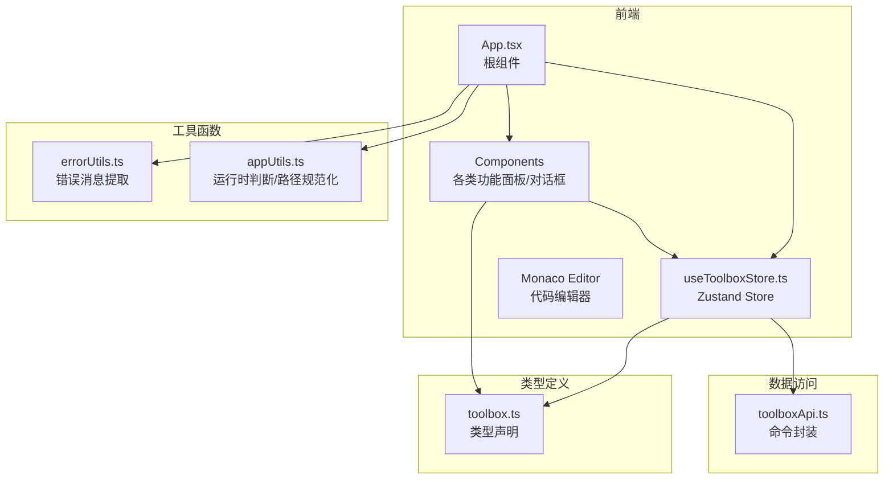
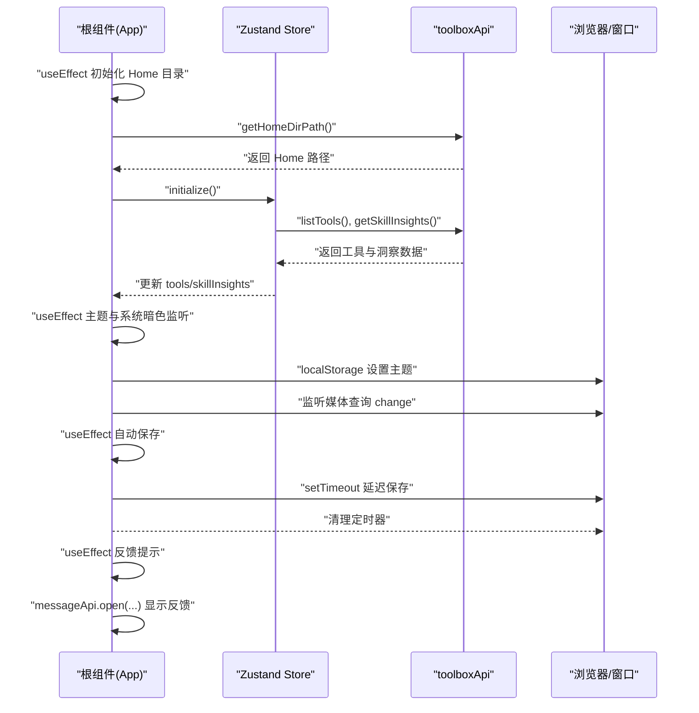
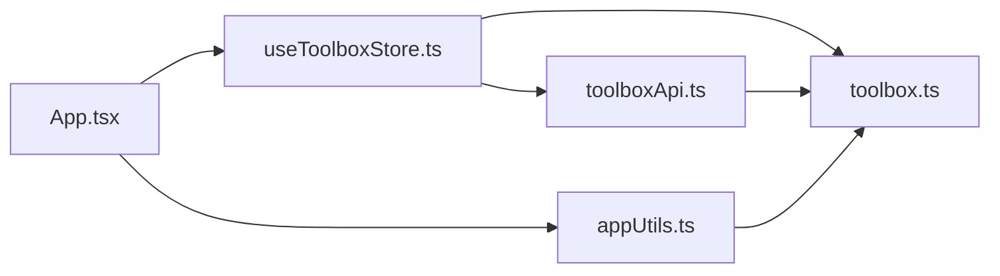

# 组件生命周期管理

<cite>
**本文引用的文件**
- [App.tsx](file://src/App.tsx)
- [main.tsx](file://src/main.tsx)
- [useToolboxStore.ts](file://src/store/useToolboxStore.ts)
- [CenterRepoPanel.tsx](file://src/components/CenterRepoPanel.tsx)
- [SkillDetailDrawer.tsx](file://src/components/SkillDetailDrawer.tsx)
- [CommandPalette.tsx](file://src/components/CommandPalette.tsx)
- [PresetManager.tsx](file://src/components/PresetManager.tsx)
- [ClaudeConfigSyncPanel.tsx](file://src/components/ClaudeConfigSyncPanel.tsx)
- [GitInstallDialog.tsx](file://src/components/GitInstallDialog.tsx)
- [toolboxApi.ts](file://src/lib/toolboxApi.ts)
- [appUtils.ts](file://src/utils/appUtils.ts)
- [errorUtils.ts](file://src/utils/errorUtils.ts)
- [toolbox.ts](file://src/types/toolbox.ts)
</cite>

## 目录
1. [简介](#简介)
2. [项目结构](#项目结构)
3. [核心组件](#核心组件)
4. [架构总览](#架构总览)
5. [详细组件分析](#详细组件分析)
6. [依赖关系分析](#依赖关系分析)
7. [性能考量](#性能考量)
8. [故障排查指南](#故障排查指南)
9. [结论](#结论)
10. [附录](#附录)

## 简介
本文件围绕组件生命周期管理展开，结合项目中实际使用的 React Hook（如 useEffect、useState、useMemo、useCallback、useRef 等），系统梳理组件挂载、更新与卸载阶段的状态初始化、数据加载与清理流程，以及条件渲染、动态加载、懒加载策略。同时，针对文件监控、定时器管理、事件监听等常见生命周期场景给出最佳实践与内存泄漏防护建议，并提供可直接定位到源码位置的参考路径，便于读者对照学习与落地。

## 项目结构
该项目采用前端与桌面端集成的架构：
- 前端层：React + Ant Design + Monaco Editor，负责 UI 与交互。
- 状态层：Zustand Store（useToolboxStore）集中管理全局状态与异步操作。
- 数据访问层：toolboxApi 提供统一的命令调用封装，支持 Tauri 桌面环境与预览模式。
- 工具函数层：appUtils、errorUtils 提供通用能力与错误处理。

图表来源
- [App.tsx:138-218](file://src/App.tsx#L138-L218)
- [useToolboxStore.ts:145-555](file://src/store/useToolboxStore.ts#L145-L555)
- [toolboxApi.ts:387-783](file://src/lib/toolboxApi.ts#L387-L783)
- [appUtils.ts:1-27](file://src/utils/appUtils.ts#L1-L27)
- [errorUtils.ts:1-10](file://src/utils/errorUtils.ts#L1-L10)
- [toolbox.ts:1-152](file://src/types/toolbox.ts#L1-L152)

章节来源
- [main.tsx:1-12](file://src/main.tsx#L1-L12)
- [App.tsx:138-218](file://src/App.tsx#L138-L218)
- [useToolboxStore.ts:145-555](file://src/store/useToolboxStore.ts#L145-L555)

## 核心组件
- 根组件 App：负责主题、系统暗色模式监听、反馈提示、工具与技能数据的初始化与筛选、自动保存、窗口控制等。
- Zustand Store：集中管理工具列表、配置文件、技能洞察、反馈信息、预设、Claude 配置同步等状态与异步动作。
- 功能面板组件：中心仓库面板、技能详情抽屉、命令面板、预设管理、Git 安装对话框、Claude 配置同步面板等。
- 数据访问层：toolboxApi 对 Tauri 命令进行统一封装，提供 listTools、readConfigFile、saveConfigFile、syncSkills 等方法。
- 工具函数：hasTauriRuntime、normalizeFsPath、formatTime、isInteractiveDragTarget 等。

章节来源
- [App.tsx:138-218](file://src/App.tsx#L138-L218)
- [useToolboxStore.ts:145-555](file://src/store/useToolboxStore.ts#L145-L555)
- [toolboxApi.ts:387-783](file://src/lib/toolboxApi.ts#L387-L783)
- [appUtils.ts:1-27](file://src/utils/appUtils.ts#L1-L27)

## 架构总览
下面以 App 与 Store 的交互为例，展示典型的生命周期流程：初始化、主题切换、自动保存、反馈提示、技能过滤与同步目标计算等。

图表来源
- [App.tsx:203-258](file://src/App.tsx#L203-L258)
- [App.tsx:363-376](file://src/App.tsx#L363-L376)
- [useToolboxStore.ts:174-217](file://src/store/useToolboxStore.ts#L174-L217)
- [toolboxApi.ts:387-405](file://src/lib/toolboxApi.ts#L387-L405)

## 详细组件分析

### 根组件 App 的生命周期与状态管理
- 挂载阶段
  - 初始化 Home 目录：在首次渲染时通过 Tauri 命令获取用户主目录，填充到全局变量以便后续路径规范化。
  - 初始化 Store：调用 initialize，异步加载工具列表与技能洞察，避免阻塞首屏渲染。
  - 主题与系统暗色监听：监听系统主题变化，设置本地存储的主题偏好，并根据 resolvedTheme 更新 DOM 属性。
  - 反馈提示：当 feedback 存在时，使用 messageApi 打开提示，避免重复提示“工具列表已刷新”。
- 更新阶段
  - 主题与系统暗色：依赖 themeMode 与 systemDark 计算 resolvedTheme，进而更新 documentElement/body 的 data-theme。
  - 自动保存：当 autoSave 开启且当前配置文件处于脏状态时，延迟触发保存，使用 window.setTimeout 并在组件卸载或依赖变更时清理定时器。
  - 技能过滤：基于 keyword 与技能列表进行 memo 化过滤，减少不必要的渲染。
  - 同步目标选项：根据可见工具集与当前选中工具计算可选目标，确保选中项有效。
  - Tab 联动：当工具切换为非 Claude 时，若当前位于“配置同步”页签，自动回退到“技能”页签。
- 卸载阶段
  - 清理媒体查询监听器与定时器，防止内存泄漏与重复回调。

章节来源
- [App.tsx:138-218](file://src/App.tsx#L138-L218)
- [App.tsx:220-258](file://src/App.tsx#L220-L258)
- [App.tsx:363-376](file://src/App.tsx#L363-L376)
- [App.tsx:260-327](file://src/App.tsx#L260-L327)
- [App.tsx:329-347](file://src/App.tsx#L329-L347)
- [appUtils.ts:1-27](file://src/utils/appUtils.ts#L1-L27)

### Zustand Store 的生命周期与副作用
- 初始化与数据加载
  - initialize：若 tools 已存在则短路，否则依次加载工具列表与技能洞察。
  - refreshTools：加载工具列表后解析选中项，必要时加载对应配置文件内容。
  - refreshInsights：加载技能洞察数据。
- 配置文件读写与保存
  - selectConfigFile：按需加载配置文件内容，标记 loaded/dirty 状态。
  - setEditorContent：实时更新编辑器内容并标记脏状态。
  - saveCurrentFile：保存配置文件，生成反馈信息。
- 同步与预设
  - runSync：执行技能同步，更新反馈并刷新工具与洞察。
  - applyPreset：批量从中心仓库同步技能到多个目标工具。
- Claude 配置同步
  - loadClaudeConfigDiff：加载差异结果，支持 baseline 切换。
  - applyClaudeConfigSync：整段同步到 cc-switch，带备份与反馈。
- 反馈与清理
  - clearFeedback：清除反馈信息。
  - 所有异步操作均设置 loading 状态并在 finally 中复位，避免 UI 卡死。

章节来源
- [useToolboxStore.ts:174-217](file://src/store/useToolboxStore.ts#L174-L217)
- [useToolboxStore.ts:219-283](file://src/store/useToolboxStore.ts#L219-L283)
- [useToolboxStore.ts:285-339](file://src/store/useToolboxStore.ts#L285-L339)
- [useToolboxStore.ts:341-384](file://src/store/useToolboxStore.ts#L341-L384)
- [useToolboxStore.ts:523-554](file://src/store/useToolboxStore.ts#L523-L554)
- [useToolboxStore.ts:412-459](file://src/store/useToolboxStore.ts#L412-L459)

### 中心仓库面板 CenterRepoPanel 的生命周期
- 挂载与打开
  - 打开抽屉时加载技能列表，重置筛选状态与选中集合。
- 更新与筛选
  - 基于 sourceFilter、keyword、filterType 三类维度进行 memo 化筛选，避免重复计算。
- 同步与导入
  - 支持单个技能同步、批量同步、从工具导入、扫描发现并批量导入等，均通过异步 API 调用与反馈提示。
- 清理
  - 组件销毁或隐藏时，利用 destroyOnClose/destroyOnHidden 控制资源释放。

章节来源
- [CenterRepoPanel.tsx:111-120](file://src/components/CenterRepoPanel.tsx#L111-L120)
- [CenterRepoPanel.tsx:131-148](file://src/components/CenterRepoPanel.tsx#L131-L148)
- [CenterRepoPanel.tsx:188-219](file://src/components/CenterRepoPanel.tsx#L188-L219)
- [CenterRepoPanel.tsx:329-364](file://src/components/CenterRepoPanel.tsx#L329-L364)

### 技能详情抽屉 SkillDetailDrawer 的生命周期
- 挂载与打开
  - 打开时显示加载态，异步获取详情内容后渲染。
- 更新与卸载
  - 通过 destroyOnClose 在抽屉关闭时释放资源，避免内存泄漏。

章节来源
- [SkillDetailDrawer.tsx:18-119](file://src/components/SkillDetailDrawer.tsx#L18-L119)

### 命令面板 CommandPalette 的生命周期
- 挂载与打开
  - 打开时聚焦输入框，注册键盘事件监听（Cmd/Ctrl+K 打开/关闭、ESC 关闭、上下键导航、Enter 选择）。
- 更新与清理
  - 关闭时清空关键词与选中索引；卸载时移除键盘事件监听，防止重复绑定。

章节来源
- [CommandPalette.tsx:83-99](file://src/components/CommandPalette.tsx#L83-L99)
- [CommandPalette.tsx:102-156](file://src/components/CommandPalette.tsx#L102-L156)
- [CommandPalette.tsx:159-164](file://src/components/CommandPalette.tsx#L159-L164)

### 预设管理 PresetManager 的生命周期
- 挂载与加载
  - isLoading 时显示加载态；加载完成后渲染预设列表与操作按钮。
- 更新与交互
  - 创建/应用/删除预设均通过异步 API 调用与反馈提示。
- 清理
  - 使用 destroyOnClose 控制对话框资源释放。

章节来源
- [PresetManager.tsx:179-329](file://src/components/PresetManager.tsx#L179-L329)

### Claude 配置同步面板 ClaudeConfigSyncPanel 的生命周期
- 挂载与打开
  - 若无差异结果则自动加载；支持切换 baseline（live、richest、snapshot）并刷新。
- 更新与交互
  - 表格展示字段差异，支持查看 diff；整段同步到 cc-switch 前进行二次确认。
- 清理
  - 使用 destroyOnHidden 控制抽屉资源释放。

章节来源
- [ClaudeConfigSyncPanel.tsx:113-117](file://src/components/ClaudeConfigSyncPanel.tsx#L113-L117)
- [ClaudeConfigSyncPanel.tsx:137-148](file://src/components/ClaudeConfigSyncPanel.tsx#L137-L148)
- [ClaudeConfigSyncPanel.tsx:347-388](file://src/components/ClaudeConfigSyncPanel.tsx#L347-L388)

### Git 安装对话框 GitInstallDialog 的生命周期
- 挂载与打开
  - 打开时重置表单，根据 Git URL 推断技能名称；支持自定义技能名称。
- 更新与清理
  - 关闭时重置表单与自定义名称开关；使用 destroyOnClose 控制资源释放。

章节来源
- [GitInstallDialog.tsx:47-53](file://src/components/GitInstallDialog.tsx#L47-L53)
- [GitInstallDialog.tsx:55-72](file://src/components/GitInstallDialog.tsx#L55-L72)

### 数据访问层 toolboxApi 的生命周期与错误处理
- Tauri 命令封装：listTools、readConfigFile、saveConfigFile、syncSkills、listCenterSkills、batchSyncFromCenter、getSkillDetail、listPresets、savePreset、deletePreset、getClaudeConfigDiff、applyClaudeConfigFullSync 等。
- 预览模式：在非 Tauri 环境下提供 mock 数据与提示，保证开发体验。
- 错误处理：统一通过 getErrorMessage 提取可读错误消息，配合 Store 的 feedback 字段进行 UI 反馈。

章节来源
- [toolboxApi.ts:387-783](file://src/lib/toolboxApi.ts#L387-L783)
- [errorUtils.ts:5-9](file://src/utils/errorUtils.ts#L5-L9)

## 依赖关系分析
- 组件与 Store 的耦合
  - App 通过 useToolboxStore 读取状态与派发动作，避免直接访问 API。
  - 各功能面板通过 Store 的动作与状态驱动 UI 更新，降低耦合度。
- Store 与 API 的依赖
  - Store 内部封装所有异步操作，统一设置 loading 状态与反馈信息。
- 工具函数与类型
  - appUtils 提供运行时判断与路径规范化，toolbox.ts 定义统一的数据结构与枚举。

图表来源
- [App.tsx:138-218](file://src/App.tsx#L138-L218)
- [useToolboxStore.ts:145-555](file://src/store/useToolboxStore.ts#L145-L555)
- [toolboxApi.ts:387-783](file://src/lib/toolboxApi.ts#L387-L783)
- [appUtils.ts:1-27](file://src/utils/appUtils.ts#L1-L27)
- [toolbox.ts:1-152](file://src/types/toolbox.ts#L1-L152)

章节来源
- [App.tsx:138-218](file://src/App.tsx#L138-L218)
- [useToolboxStore.ts:145-555](file://src/store/useToolboxStore.ts#L145-L555)
- [toolboxApi.ts:387-783](file://src/lib/toolboxApi.ts#L387-L783)
- [appUtils.ts:1-27](file://src/utils/appUtils.ts#L1-L27)
- [toolbox.ts:1-152](file://src/types/toolbox.ts#L1-L152)

## 性能考量
- 计算优化
  - 使用 useMemo 对过滤后的技能列表、同步目标选项、技能详情等进行缓存，避免每次渲染都重新计算。
  - 使用 useCallback 包裹回调函数，减少子组件不必要的重渲染。
- 异步与并发
  - Store 中的异步动作统一设置 loading 状态，在 finally 中复位，避免 UI 卡顿。
  - 对于频繁触发的操作（如自动保存），使用 setTimeout 延迟执行并及时清理，避免重复保存。
- 资源释放
  - 对媒体查询监听器、键盘事件监听器、定时器等外部资源，务必在组件卸载或依赖变更时清理，防止内存泄漏。
- 条件渲染与懒加载
  - 抽屉/模态框使用 destroyOnClose/destroyOnHidden，在关闭时释放资源，避免常驻内存。
  - 技能详情等大体量内容采用按需加载与延迟渲染策略。

章节来源
- [App.tsx:260-327](file://src/App.tsx#L260-L327)
- [App.tsx:363-376](file://src/App.tsx#L363-L376)
- [CenterRepoPanel.tsx:111-120](file://src/components/CenterRepoPanel.tsx#L111-L120)
- [CommandPalette.tsx:102-156](file://src/components/CommandPalette.tsx#L102-L156)
- [SkillDetailDrawer.tsx:18-119](file://src/components/SkillDetailDrawer.tsx#L18-L119)

## 故障排查指南
- 反馈提示未出现
  - 检查 feedback 是否为空、是否被“工具列表已刷新”条件拦截。
  - 确认 messageApi 是否正确注入到上下文。
- 自动保存未生效
  - 检查 autoSave、isSaving、selectedFile.dirty 等依赖是否满足保存条件。
  - 确认定时器是否被清理（组件卸载或依赖变更）。
- 主题切换异常
  - 检查 localStorage 主题值是否正确写入，系统暗色监听是否正常。
- 键盘快捷键无效
  - 确认 CommandPalette 的键盘事件监听是否在打开状态下注册，关闭时是否移除。
- 抽屉/模态框资源未释放
  - 确认是否使用了 destroyOnClose/destroyOnHidden，避免常驻 DOM 节点导致内存占用。

章节来源
- [App.tsx:251-258](file://src/App.tsx#L251-L258)
- [App.tsx:363-376](file://src/App.tsx#L363-L376)
- [App.tsx:220-229](file://src/App.tsx#L220-L229)
- [CommandPalette.tsx:102-156](file://src/components/CommandPalette.tsx#L102-L156)
- [SkillDetailDrawer.tsx:18-119](file://src/components/SkillDetailDrawer.tsx#L18-L119)

## 结论
本项目通过明确的生命周期划分与 Hook 使用策略，实现了从初始化、更新到卸载的完整状态管理闭环。Zustand Store 将异步逻辑与 UI 解耦，配合 useMemo/useCallback 等优化手段，兼顾了性能与可维护性。对于事件监听、定时器、外部资源等，均在生命周期钩子里进行正确的注册与清理，有效避免了内存泄漏。建议在新功能开发中遵循现有模式，统一使用 Store 管理状态与副作用，确保生命周期管理的一致性与可靠性。

## 附录
- 最佳实践清单
  - 在 useEffect 中进行一次性初始化与订阅，返回清理函数移除订阅。
  - 使用 useMemo/useCallback 缓存昂贵计算与回调，减少重渲染。
  - 对外部资源（媒体查询、键盘事件、定时器）在卸载时清理。
  - 使用 destroyOnClose/destroyOnHidden 控制抽屉/模态框资源释放。
  - 通过 Store 统一处理异步操作与反馈，避免在组件内直接管理 loading 状态。
- 参考路径
  - [App 初始化与主题监听:203-258](file://src/App.tsx#L203-L258)
  - [App 自动保存与清理:363-376](file://src/App.tsx#L363-L376)
  - [Store 初始化与数据加载:174-217](file://src/store/useToolboxStore.ts#L174-L217)
  - [Store 配置文件读写:247-339](file://src/store/useToolboxStore.ts#L247-L339)
  - [中心仓库面板筛选与同步:131-148](file://src/components/CenterRepoPanel.tsx#L131-L148)
  - [命令面板键盘事件:102-156](file://src/components/CommandPalette.tsx#L102-L156)
  - [技能详情抽屉资源释放:18-119](file://src/components/SkillDetailDrawer.tsx#L18-L119)
  - [Claude 配置同步面板:113-117](file://src/components/ClaudeConfigSyncPanel.tsx#L113-L117)
  - [Git 安装对话框表单重置:47-53](file://src/components/GitInstallDialog.tsx#L47-L53)
  - [API 封装与错误处理:387-783](file://src/lib/toolboxApi.ts#L387-L783)
  - [工具函数与类型定义:1-27](file://src/utils/appUtils.ts#L1-L27), [toolbox.ts:1-152](file://src/types/toolbox.ts#L1-L152)