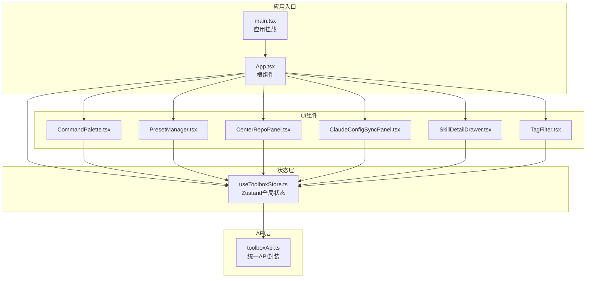
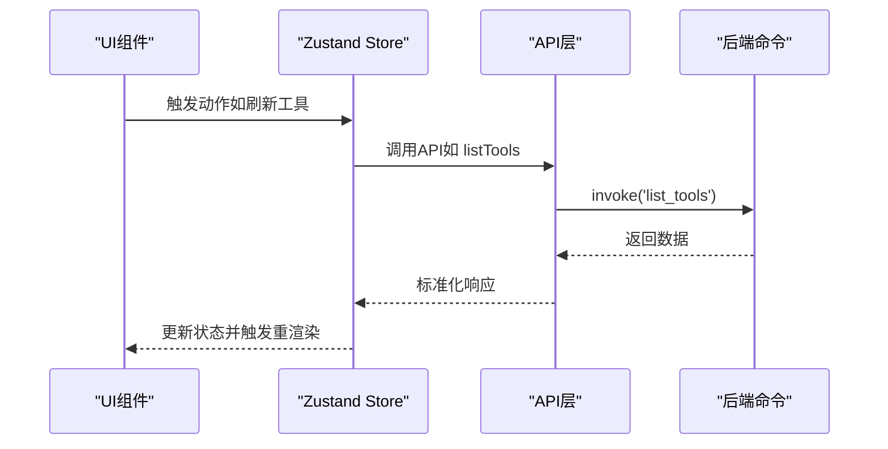
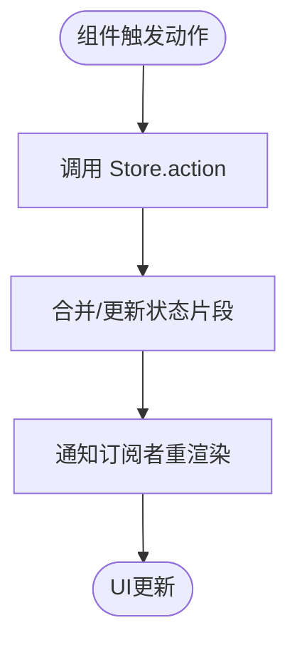
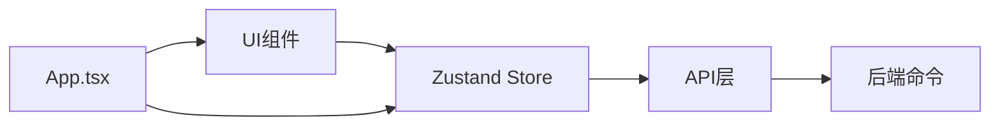

# 组件通信机制

<cite>
**本文档引用的文件**
- [src/App.tsx](file://src/App.tsx)
- [src/store/useToolboxStore.ts](file://src/store/useToolboxStore.ts)
- [src/lib/toolboxApi.ts](file://src/lib/toolboxApi.ts)
- [src/components/CenterRepoPanel.tsx](file://src/components/CenterRepoPanel.tsx)
- [src/components/ClaudeConfigSyncPanel.tsx](file://src/components/ClaudeConfigSyncPanel.tsx)
- [src/components/CommandPalette.tsx](file://src/components/CommandPalette.tsx)
- [src/components/PresetManager.tsx](file://src/components/PresetManager.tsx)
- [src/components/SkillDetailDrawer.tsx](file://src/components/SkillDetailDrawer.tsx)
- [src/components/TagFilter.tsx](file://src/components/TagFilter.tsx)
- [src/types/toolbox.ts](file://src/types/toolbox.ts)
- [src/utils/errorUtils.ts](file://src/utils/errorUtils.ts)
- [src/main.tsx](file://src/main.tsx)
</cite>

## 目录
1. [引言](#引言)
2. [项目结构](#项目结构)
3. [核心组件](#核心组件)
4. [架构总览](#架构总览)
5. [详细组件分析](#详细组件分析)
6. [依赖关系分析](#依赖关系分析)
7. [性能考量](#性能考量)
8. [故障排查指南](#故障排查指南)
9. [结论](#结论)
10. [附录](#附录)

## 引言
本文件系统性梳理本项目的组件通信机制，围绕以下目标展开：
- 解释父子、兄弟与跨层级组件通信模式
- 阐述状态提升、事件冒泡与回调传递
- 详解Zustand全局状态在组件通信中的角色（共享、订阅、更新）
- 分析API层封装对组件通信的影响（数据获取、错误处理、加载状态）
- 提供可定位到具体文件的实现路径示例
- 总结通信性能优化与最佳实践

## 项目结构
项目采用以功能域划分的组织方式，核心入口为应用根组件，状态管理由Zustand集中式存储提供，UI组件按功能拆分，API访问通过统一的工具模块封装。

图表来源
- [src/main.tsx:1-12](file://src/main.tsx#L1-L12)
- [src/App.tsx:138-610](file://src/App.tsx#L138-L610)
- [src/store/useToolboxStore.ts:145-556](file://src/store/useToolboxStore.ts#L145-L556)
- [src/lib/toolboxApi.ts:387-784](file://src/lib/toolboxApi.ts#L387-L784)

章节来源
- [src/main.tsx:1-12](file://src/main.tsx#L1-L12)
- [src/App.tsx:138-610](file://src/App.tsx#L138-L610)

## 核心组件
- 根组件 App.tsx：负责全局布局、主题控制、消息提示、窗口交互、以及协调多个子组件的状态与行为。
- Zustand Store useToolboxStore.ts：集中管理工具列表、配置文件、技能详情、预设、同步状态等，提供统一的读取与更新接口。
- API 层 toolboxApi.ts：封装与后端命令的交互，统一响应解析与错误提取。
- 功能组件：CommandPalette、PresetManager、CenterRepoPanel、ClaudeConfigSyncPanel、SkillDetailDrawer、TagFilter 等，承担各自领域的UI与业务逻辑。

章节来源
- [src/App.tsx:138-610](file://src/App.tsx#L138-L610)
- [src/store/useToolboxStore.ts:145-556](file://src/store/useToolboxStore.ts#L145-L556)
- [src/lib/toolboxApi.ts:387-784](file://src/lib/toolboxApi.ts#L387-L784)

## 架构总览
组件通信遵循“单向数据流 + 全局状态驱动”的设计：
- 父组件通过props向下传递数据与回调
- 子组件通过回调向上触发全局状态更新
- 全局状态通过订阅（Zustand selector）驱动渲染
- API层通过统一封装屏蔽底层差异，提供稳定的数据契约

图表来源
- [src/store/useToolboxStore.ts:183-205](file://src/store/useToolboxStore.ts#L183-L205)
- [src/lib/toolboxApi.ts:387-396](file://src/lib/toolboxApi.ts#L387-L396)

## 详细组件分析

### 父子组件通信：App → 功能组件
- App 通过 props 向子组件传递：
  - 数据：工具列表、选中项、加载状态、反馈信息等
  - 回调：打开/关闭抽屉、切换主题、刷新数据、保存文件等
- 子组件通过回调向上触发全局状态更新，从而实现“状态提升”式的父子联动

示例路径（不含代码内容）：
- App 向 CommandPalette 传递 open/tools/skills/onSelectTool/onSelectSkill/onClose/onOpen
  - [src/App.tsx:700-730](file://src/App.tsx#L700-L730)
  - [src/components/CommandPalette.tsx:21-40](file://src/components/CommandPalette.tsx#L21-L40)
- App 向 PresetManager 传递 presets/tools/allSkills/onApply/onCreate/onDelete/isLoading
  - [src/App.tsx:880-900](file://src/App.tsx#L880-L900)
  - [src/components/PresetManager.tsx:161-179](file://src/components/PresetManager.tsx#L161-L179)

章节来源
- [src/App.tsx:700-730](file://src/App.tsx#L700-L730)
- [src/components/CommandPalette.tsx:21-40](file://src/components/CommandPalette.tsx#L21-L40)
- [src/App.tsx:880-900](file://src/App.tsx#L880-L900)
- [src/components/PresetManager.tsx:161-179](file://src/components/PresetManager.tsx#L161-L179)

### 兄弟组件通信：通过全局状态桥接
- 两个兄弟组件（如 CenterRepoPanel 与 App）不直接通信，而是通过全局状态进行数据交换
- CenterRepoPanel 在内部维护自身状态（如安装、同步、导入等弹窗），但其最终行为（如刷新工具列表、同步完成回调）通过回调通知 App，再由 App 触发 Store 更新

示例路径（不含代码内容）：
- CenterRepoPanel 通过 onSyncComplete 回调通知 App
  - [src/components/CenterRepoPanel.tsx:52-62](file://src/components/CenterRepoPanel.tsx#L52-L62)
  - [src/App.tsx:350-512](file://src/App.tsx#L350-L512)

章节来源
- [src/components/CenterRepoPanel.tsx:52-62](file://src/components/CenterRepoPanel.tsx#L52-L62)
- [src/App.tsx:350-512](file://src/App.tsx#L350-L512)

### 跨层级通信：Zustand 全局状态
- 全局状态作为“跨层级通信中枢”，所有组件均可订阅所需片段
- App 订阅多个 selector（如 tools、selectedToolId、isToolsLoading、feedback 等）以驱动渲染
- 子组件通过调用 Store 的 action（如 refreshTools、selectTool、saveCurrentFile 等）间接影响全局状态

示例路径（不含代码内容）：
- App 订阅全局状态
  - [src/App.tsx:171-201](file://src/App.tsx#L171-L201)
- Store 定义 action（如 refreshTools/selectTool/saveCurrentFile）
  - [src/store/useToolboxStore.ts:183-205](file://src/store/useToolboxStore.ts#L183-L205)
  - [src/store/useToolboxStore.ts:219-245](file://src/store/useToolboxStore.ts#L219-L245)
  - [src/store/useToolboxStore.ts:307-339](file://src/store/useToolboxStore.ts#L307-L339)

章节来源
- [src/App.tsx:171-201](file://src/App.tsx#L171-L201)
- [src/store/useToolboxStore.ts:183-205](file://src/store/useToolboxStore.ts#L183-L205)
- [src/store/useToolboxStore.ts:219-245](file://src/store/useToolboxStore.ts#L219-L245)
- [src/store/useToolboxStore.ts:307-339](file://src/store/useToolboxStore.ts#L307-L339)

### 状态提升模式
- 状态提升体现在 App 对子组件的“数据与回调”传递，使状态集中在父组件或全局状态中
- 示例：App 将工具列表与选中项传给 CommandPalette，后者通过回调让 App 更新全局状态

示例路径（不含代码内容）：
- App 传递 tools/skills 并接收回调
  - [src/App.tsx:700-730](file://src/App.tsx#L700-L730)
  - [src/components/CommandPalette.tsx:21-40](file://src/components/CommandPalette.tsx#L21-L40)

章节来源
- [src/App.tsx:700-730](file://src/App.tsx#L700-L730)
- [src/components/CommandPalette.tsx:21-40](file://src/components/CommandPalette.tsx#L21-L40)

### 事件冒泡处理与回调传递
- 子组件通过回调向上游传递事件，App 或 Store 接收并处理
- 错误处理统一通过工具函数提取可读错误消息，避免组件内重复逻辑

示例路径（不含代码内容）：
- CommandPalette 使用键盘事件与回调
  - [src/components/CommandPalette.tsx:102-156](file://src/components/CommandPalette.tsx#L102-L156)
- 错误消息提取
  - [src/utils/errorUtils.ts:5-9](file://src/utils/errorUtils.ts#L5-L9)

章节来源
- [src/components/CommandPalette.tsx:102-156](file://src/components/CommandPalette.tsx#L102-L156)
- [src/utils/errorUtils.ts:5-9](file://src/utils/errorUtils.ts#L5-L9)

### Zustand 状态管理在组件通信中的作用
- 全局状态共享：App 与多个子组件共享同一份状态，避免多处重复获取
- 状态订阅：组件通过 selector 订阅所需片段，减少不必要的重渲染
- 状态更新：action 内部封装 API 调用与状态合并逻辑，保证一致性

图表来源
- [src/store/useToolboxStore.ts:145-556](file://src/store/useToolboxStore.ts#L145-L556)

章节来源
- [src/store/useToolboxStore.ts:145-556](file://src/store/useToolboxStore.ts#L145-L556)

### API 层封装对组件通信的影响
- 数据获取：Store 的 action 统一封装 API 调用，组件只需关心“是否成功”
- 错误处理：统一使用工具函数提取错误消息，组件通过 feedback 展示
- 加载状态管理：Store 维护 isToolsLoading/isSaving/isConfigLoading 等标志位，组件据此显示加载态

示例路径（不含代码内容）：
- Store 中的 refreshTools 与 saveCurrentFile
  - [src/store/useToolboxStore.ts:183-205](file://src/store/useToolboxStore.ts#L183-L205)
  - [src/store/useToolboxStore.ts:307-339](file://src/store/useToolboxStore.ts#L307-L339)
- API 层 listTools/readConfigFile
  - [src/lib/toolboxApi.ts:387-396](file://src/lib/toolboxApi.ts#L387-L396)
  - [src/lib/toolboxApi.ts:407-417](file://src/lib/toolboxApi.ts#L407-L417)

章节来源
- [src/store/useToolboxStore.ts:183-205](file://src/store/useToolboxStore.ts#L183-L205)
- [src/store/useToolboxStore.ts:307-339](file://src/store/useToolboxStore.ts#L307-L339)
- [src/lib/toolboxApi.ts:387-396](file://src/lib/toolboxApi.ts#L387-L396)
- [src/lib/toolboxApi.ts:407-417](file://src/lib/toolboxApi.ts#L407-L417)

### 具体通信模式实现示例（路径索引）
- 父子：App → CommandPalette（传递 open/tools/skills/onSelectTool/onSelectSkill/onClose/onOpen）
  - [src/App.tsx:700-730](file://src/App.tsx#L700-L730)
  - [src/components/CommandPalette.tsx:21-40](file://src/components/CommandPalette.tsx#L21-L40)
- 兄弟：CenterRepoPanel → App（通过 onSyncComplete 回调）
  - [src/components/CenterRepoPanel.tsx:52-62](file://src/components/CenterRepoPanel.tsx#L52-L62)
  - [src/App.tsx:350-512](file://src/App.tsx#L350-L512)
- 跨层级：App 与多个子组件通过 Zustand 共享状态
  - [src/App.tsx:171-201](file://src/App.tsx#L171-L201)
  - [src/store/useToolboxStore.ts:145-556](file://src/store/useToolboxStore.ts#L145-L556)
- 状态提升：App 将工具列表与选中项传给 CommandPalette，后者通过回调更新全局状态
  - [src/App.tsx:700-730](file://src/App.tsx#L700-L730)
  - [src/components/CommandPalette.tsx:21-40](file://src/components/CommandPalette.tsx#L21-L40)
- 事件冒泡：CommandPalette 键盘事件与回调
  - [src/components/CommandPalette.tsx:102-156](file://src/components/CommandPalette.tsx#L102-L156)
- 错误处理：统一错误消息提取
  - [src/utils/errorUtils.ts:5-9](file://src/utils/errorUtils.ts#L5-L9)

章节来源
- [src/App.tsx:171-201](file://src/App.tsx#L171-L201)
- [src/store/useToolboxStore.ts:145-556](file://src/store/useToolboxStore.ts#L145-L556)
- [src/components/CommandPalette.tsx:102-156](file://src/components/CommandPalette.tsx#L102-L156)
- [src/utils/errorUtils.ts:5-9](file://src/utils/errorUtils.ts#L5-L9)

## 依赖关系分析
- 组件对 Store 的依赖：所有 UI 组件均通过 selector 订阅 Store，形成“组件 → Store → API → 后端”的链路
- Store 对 API 的依赖：Store 的 action 内部调用 API 层函数，统一响应与错误处理
- App 对子组件的依赖：App 作为协调者，将数据与回调传递给子组件，并通过 Store 驱动状态更新

图表来源
- [src/App.tsx:138-610](file://src/App.tsx#L138-L610)
- [src/store/useToolboxStore.ts:145-556](file://src/store/useToolboxStore.ts#L145-L556)
- [src/lib/toolboxApi.ts:387-784](file://src/lib/toolboxApi.ts#L387-L784)

章节来源
- [src/App.tsx:138-610](file://src/App.tsx#L138-L610)
- [src/store/useToolboxStore.ts:145-556](file://src/store/useToolboxStore.ts#L145-L556)
- [src/lib/toolboxApi.ts:387-784](file://src/lib/toolboxApi.ts#L387-L784)

## 性能考量
- 选择器粒度：使用细粒度 selector，避免因全局状态变更导致不必要的重渲染
- 计算缓存：对复杂计算使用 useMemo，减少重复计算
- 异步加载：合理设置 loading 状态，避免阻塞 UI
- 防抖节流：对高频输入（如搜索）可考虑防抖，降低 Store 更新频率
- 事件处理：在子组件中避免创建新函数，使用 useCallback 包裹回调，减少重渲染

## 故障排查指南
- 错误消息提取：统一使用工具函数从异常对象中提取可读消息
  - [src/utils/errorUtils.ts:5-9](file://src/utils/errorUtils.ts#L5-L9)
- Store 中的反馈：通过 feedback 字段统一展示操作结果
  - [src/store/useToolboxStore.ts:86-95](file://src/store/useToolboxStore.ts#L86-L95)
  - [src/store/useToolboxStore.ts:199-201](file://src/store/useToolboxStore.ts#L199-L201)
- API 层错误处理：API 函数内部捕获异常并返回可读消息
  - [src/lib/toolboxApi.ts:387-396](file://src/lib/toolboxApi.ts#L387-L396)

章节来源
- [src/utils/errorUtils.ts:5-9](file://src/utils/errorUtils.ts#L5-L9)
- [src/store/useToolboxStore.ts:86-95](file://src/store/useToolboxStore.ts#L86-L95)
- [src/store/useToolboxStore.ts:199-201](file://src/store/useToolboxStore.ts#L199-L201)
- [src/lib/toolboxApi.ts:387-396](file://src/lib/toolboxApi.ts#L387-L396)

## 结论
本项目通过“全局状态 + 统一API封装”的架构，实现了清晰的组件通信模型：
- 父子通信通过 props 与回调实现
- 兄弟与跨层级通信通过全局状态解耦
- Zustand 提供高效的状态订阅与更新能力
- API 层封装提升了可维护性与一致性
配合合理的性能优化策略，可在复杂场景下保持良好的用户体验与开发效率。

## 附录
- 类型定义参考：工具、技能、配置文件、反馈、同步模式等类型
  - [src/types/toolbox.ts:1-152](file://src/types/toolbox.ts#L1-L152)

章节来源
- [src/types/toolbox.ts:1-152](file://src/types/toolbox.ts#L1-L152)