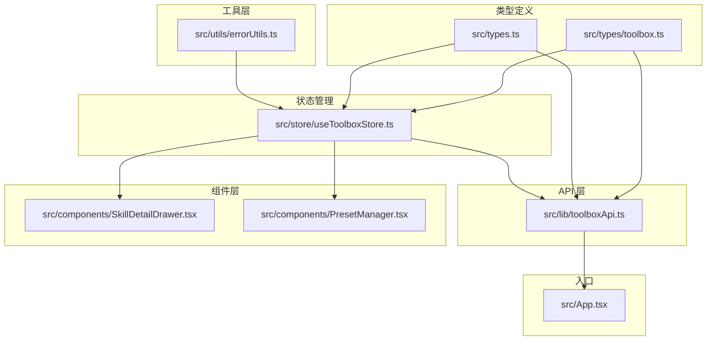
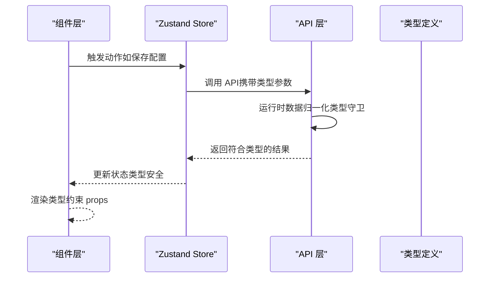
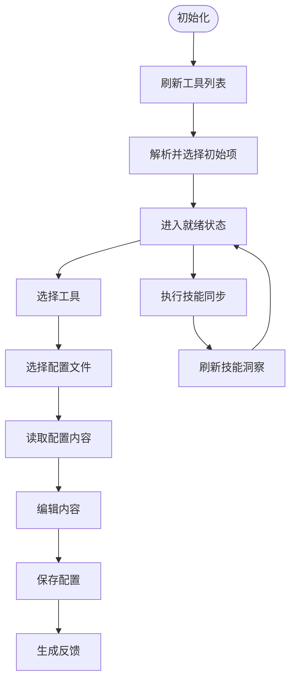
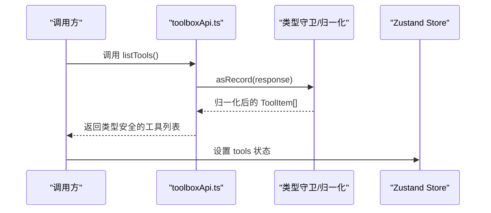
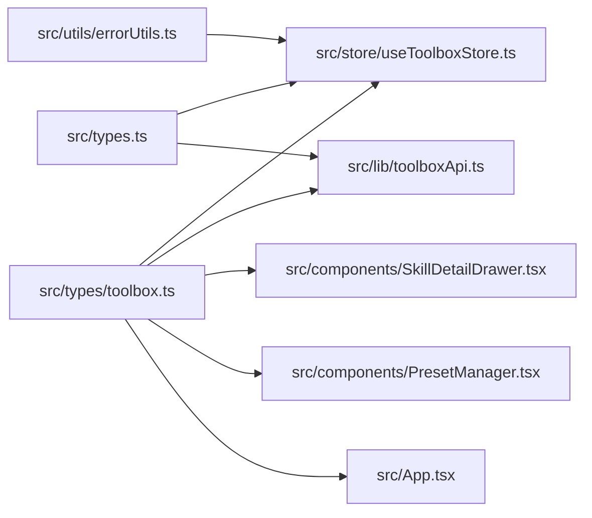

# TypeScript类型系统

<cite>
**本文引用的文件**
- [toolbox.ts](file://src/types/toolbox.ts)
- [types.ts](file://src/types.ts)
- [useToolboxStore.ts](file://src/store/useToolboxStore.ts)
- [toolboxApi.ts](file://src/lib/toolboxApi.ts)
- [SkillDetailDrawer.tsx](file://src/components/SkillDetailDrawer.tsx)
- [PresetManager.tsx](file://src/components/PresetManager.tsx)
- [errorUtils.ts](file://src/utils/errorUtils.ts)
- [App.tsx](file://src/App.tsx)
- [package.json](file://package.json)
- [tsconfig.json](file://tsconfig.json)
</cite>

## 目录
1. [简介](#简介)
2. [项目结构](#项目结构)
3. [核心组件](#核心组件)
4. [架构总览](#架构总览)
5. [详细组件分析](#详细组件分析)
6. [依赖关系分析](#依赖关系分析)
7. [性能考量](#性能考量)
8. [故障排查指南](#故障排查指南)
9. [结论](#结论)
10. [附录](#附录)

## 简介
本文件系统性梳理 AI 工具箱项目的 TypeScript 类型系统，重点围绕以下方面展开：
- 类型定义的设计原则：接口规范、类型别名、联合/交叉/条件类型的应用
- 核心数据模型：ToolItem、SkillItem、ConfigFileItem 等关键实体的字段定义与约束
- 类型安全保证：编译时检查、运行时验证、类型推断
- 复杂类型处理：联合类型、交叉类型、条件类型在项目中的实际运用
- 类型扩展最佳实践：模块声明、类型增强、第三方库集成
- 实际应用示例与常见问题的解决方案

## 项目结构
项目采用前端 React + Zustand 状态管理 + Tauri 后端调用的架构，类型系统主要分布在以下位置：
- 类型定义：src/types 下集中存放核心类型
- 状态管理：src/store 使用 Zustand Store 定义状态与行为
- API 层：src/lib 封装 Tauri 调用，包含运行时数据归一化函数
- 组件层：src/components 使用类型进行 props 约束
- 工具层：src/utils 提供类型安全的错误处理等工具

图表来源
- [toolbox.ts:1-152](file://src/types/toolbox.ts#L1-L152)
- [types.ts:1-38](file://src/types.ts#L1-L38)
- [useToolboxStore.ts:1-556](file://src/store/useToolboxStore.ts#L1-L556)
- [toolboxApi.ts:1-784](file://src/lib/toolboxApi.ts#L1-L784)
- [SkillDetailDrawer.tsx:1-120](file://src/components/SkillDetailDrawer.tsx#L1-L120)
- [PresetManager.tsx:1-330](file://src/components/PresetManager.tsx#L1-L330)
- [errorUtils.ts:1-10](file://src/utils/errorUtils.ts#L1-L10)
- [App.tsx:1-200](file://src/App.tsx#L1-L200)

章节来源
- [toolbox.ts:1-152](file://src/types/toolbox.ts#L1-L152)
- [types.ts:1-38](file://src/types.ts#L1-L38)
- [useToolboxStore.ts:1-556](file://src/store/useToolboxStore.ts#L1-L556)
- [toolboxApi.ts:1-784](file://src/lib/toolboxApi.ts#L1-L784)
- [SkillDetailDrawer.tsx:1-120](file://src/components/SkillDetailDrawer.tsx#L1-L120)
- [PresetManager.tsx:1-330](file://src/components/PresetManager.tsx#L1-L330)
- [errorUtils.ts:1-10](file://src/utils/errorUtils.ts#L1-L10)
- [App.tsx:1-200](file://src/App.tsx#L1-L200)

## 核心组件
本节聚焦于类型系统的核心组成，包括基础类型别名、接口模型以及它们在状态与 API 层的使用方式。

- 基础类型别名（字面量联合）
  - 同步模式：copy | symlink
  - 冲突策略：skip | overwrite | rename
  - 反馈音调：success | error | info
  - 配置差异类型：missing | different | same | onlyInCcSwitch
  - 值类型：scalar | object | array
  - 技能差异类型：added | modified | deleted
  - 基线类型：'live' | 'richest' | { kind: 'snapshot'; ts: number }

- 数据模型接口
  - ToolItem：工具项，包含 id、name、path、skills、configFiles 等字段
  - SkillItem：技能项，包含 id、name、tags、updatedAt 等字段
  - ConfigFileItem：配置文件项，包含 id、name、path、language、content 等字段
  - OperationFeedback：操作反馈，包含 tone、title、detail、timestamp
  - BackupItem：备份项，包含 path、name、updatedAt
  - ToolRegistryConfigFile：注册表配置文件，包含 label、path、kind、exists
  - ToolRegistryEntry：注册表条目，包含 id、name、enabled、configFiles、skillDir
  - SkillDiff：技能差异，包含 fileName、diffType
  - LaggingToolInfo：落后工具信息，包含 toolId、toolName、behindSeconds、diffs
  - SkillInsightEntry：技能洞察条目，包含 skillName、leaderToolId、leaderToolName、leaderUpdatedAt、laggingTools
  - ClaudeConfigDiffResult：Claude 配置差异结果，包含 entries、baselineKind、snapshots、needsSync 等
  - ClaudeConfigSyncResult：Claude 配置同步结果，包含 backupPath、appliedFields
  - SkillDetailPayload：技能详情负载，包含 skillName、skillMdContent、readmeContent
  - PresetSkill：预设技能，包含 skillName
  - PresetEntry：预设条目，包含 id、name、icon、skills

章节来源
- [toolbox.ts:1-152](file://src/types/toolbox.ts#L1-L152)

## 架构总览
类型系统贯穿前端状态、API 层与组件层，形成“类型驱动”的数据流闭环：
- 类型定义层：集中定义核心数据模型与常量类型
- 状态管理层：Zustand Store 使用类型定义约束状态与动作签名
- API 层：封装 Tauri 调用，提供运行时数据归一化函数，确保输入输出符合类型定义
- 组件层：组件 props 使用类型进行约束，保障 UI 交互的数据一致性

图表来源
- [useToolboxStore.ts:145-556](file://src/store/useToolboxStore.ts#L145-L556)
- [toolboxApi.ts:407-436](file://src/lib/toolboxApi.ts#L407-L436)
- [toolbox.ts:1-152](file://src/types/toolbox.ts#L1-L152)

## 详细组件分析

### 类型定义层：设计原则与复杂类型
- 设计原则
  - 明确区分“字面量联合类型”与“接口”，前者用于枚举值，后者用于结构化数据
  - 使用可选字段表达“可能缺失”的数据，避免强制非空导致的运行时风险
  - 使用只读属性与最小必要字段，降低耦合度
  - 对外暴露稳定接口，内部实现通过运行时归一化函数适配多变的外部数据源

- 复杂类型应用
  - 联合类型：SyncMode、ConflictStrategy、FeedbackTone、ConfigDiffType、ValueKind、SkillDiff.diffType
  - 交叉类型：BaselineKind 通过联合构成不同基线场景
  - 条件类型：在运行时通过 asRecord、readString、readNumber 等工具函数进行条件判断与类型收窄

- 典型模式
  - 字面量联合 + 接口组合：如 ToolItem.configFiles 为 ConfigFileItem[]
  - 嵌套接口：SkillInsightEntry 包含 LaggingToolInfo[]
  - 可选字段与默认值：如 ConfigFileItem.content、SkillItem.tags

章节来源
- [toolbox.ts:1-152](file://src/types/toolbox.ts#L1-L152)

### 状态管理层：Zustand Store 与类型绑定
- Store 接口约束
  - 状态字段：tools、selectedToolId、selectedConfigId、selectedSkillIds、targetToolId、syncMode、conflictStrategy、isToolsLoading、isConfigLoading、isSaving、isSyncing、skillInsights、isInsightsLoading、feedback、claudeConfigDiff、claudeConfigBaseline、isClaudeConfigLoading、isClaudeConfigApplying、commandPaletteOpen、skillDetailOpen、selectedSkillDetail、isSkillDetailLoading、presets、isPresetsLoading
  - 动作方法：initialize、refreshTools、refreshInsights、selectTool、selectConfigFile、setEditorContent、setSelectedSkillIds、setTargetToolId、setSyncMode、setConflictStrategy、saveCurrentFile、runSync、toggleSkillEnabled、loadClaudeConfigDiff、setClaudeConfigBaseline、applyClaudeConfigSync、clearFeedback、setCommandPaletteOpen、setSkillDetailOpen、loadSkillDetail、refreshPresets、createPreset、removePreset、applyPreset
  - 类型导入：从 toolbox.ts 导入 ToolItem、ConfigFileItem、SkillItem、OperationFeedback、PresetEntry、SyncMode、ConflictStrategy、BaselineKind、ClaudeConfigDiffResult、SkillDetailPayload、SkillInsightEntry 等

- 关键流程
  - 初始化：调用 refreshTools 与 refreshInsights，自动解析并选择初始项
  - 配置文件读取与保存：通过 readConfigFile/saveConfigFile，结合 mergeConfigFile 深度更新状态
  - 技能同步：runSync 调用 syncSkills，返回反馈并刷新工具与洞察
  - Claude 配置同步：loadClaudeConfigDiff 与 applyClaudeConfigFullSync，支持基线切换

图表来源
- [useToolboxStore.ts:174-217](file://src/store/useToolboxStore.ts#L174-L217)
- [useToolboxStore.ts:219-245](file://src/store/useToolboxStore.ts#L219-L245)
- [useToolboxStore.ts:247-283](file://src/store/useToolboxStore.ts#L247-L283)
- [useToolboxStore.ts:285-339](file://src/store/useToolboxStore.ts#L285-L339)
- [useToolboxStore.ts:341-384](file://src/store/useToolboxStore.ts#L341-L384)

章节来源
- [useToolboxStore.ts:32-84](file://src/store/useToolboxStore.ts#L32-L84)
- [useToolboxStore.ts:145-556](file://src/store/useToolboxStore.ts#L145-L556)

### API 层：运行时数据归一化与类型安全
- 运行时类型守卫
  - UnknownRecord：Record<string, unknown>，作为统一的“未知对象”类型
  - asRecord：将任意值转换为 Record，避免直接访问 null/undefined
  - readString/readArray/readNumber：从多种字段名映射中读取字符串/数组/数字，支持容错
  - uniqById：去重工具，基于 id 去除重复项

- 数据归一化函数
  - normalizeSkill：从多种输入形态归一化为 SkillItem
  - normalizeConfigFile：从多种输入形态归一化为 ConfigFileItem
  - normalizeRegistryConfigFile：从多种输入形态归一化为 ToolRegistryConfigFile
  - normalizeTool：从多种输入形态归一化为 ToolItem
  - normalizeToolsResponse：批量归一化工具列表
  - normalizeToolRegistryEntry：归一化注册表条目
  - normalizeSkillInsightsResponse：归一化技能洞察结果

- API 函数签名
  - listTools/getSkillInsights/readConfigFile/saveConfigFile/syncSkills 等均以类型参数约束输入输出
  - 错误处理：readMessageResponse/readContentResponse 提供容错与默认值

图表来源
- [toolboxApi.ts:387-396](file://src/lib/toolboxApi.ts#L387-L396)
- [toolboxApi.ts:295-302](file://src/lib/toolboxApi.ts#L295-L302)
- [toolboxApi.ts:112-151](file://src/lib/toolboxApi.ts#L112-L151)

章节来源
- [toolboxApi.ts:1-784](file://src/lib/toolboxApi.ts#L1-L784)

### 组件层：类型约束与交互
- SkillDetailDrawer
  - Props 接口：open、detail（SkillDetailPayload | null）、isLoading、onClose
  - 通过类型约束确保 Drawer 的内容渲染逻辑与数据结构一致

- PresetManager
  - PresetEntry 接口：id、name、icon、skills（数组元素为 { skillName: string }）
  - ToolItem 接口：id、name
  - 通过类型约束确保预设创建、应用、删除流程的参数与返回值一致

章节来源
- [SkillDetailDrawer.tsx:1-120](file://src/components/SkillDetailDrawer.tsx#L1-L120)
- [PresetManager.tsx:1-330](file://src/components/PresetManager.tsx#L1-L330)

### 工具层：类型安全的错误处理
- getErrorMessage：统一从 unknown 错误中提取可读消息，避免直接使用 error.message 导致的运行时异常

章节来源
- [errorUtils.ts:1-10](file://src/utils/errorUtils.ts#L1-L10)

## 依赖关系分析
- 类型依赖
  - toolbox.ts 与 types.ts：前者定义更丰富的模型与常量类型，后者定义轻量级类型别名
  - useToolboxStore.ts 与 toolboxApi.ts：两者均依赖 toolbox.ts 的类型定义
  - 组件层（SkillDetailDrawer.tsx、PresetManager.tsx）与 App.tsx：分别使用类型定义进行 props 约束

- 版本与配置
  - package.json：TypeScript 版本为 ~6.0.2，依赖 @types/react、@types/react-dom、@types/node
  - tsconfig.json：采用引用式配置，拆分 app 与 node 环境

图表来源
- [toolbox.ts:1-152](file://src/types/toolbox.ts#L1-L152)
- [types.ts:1-38](file://src/types.ts#L1-L38)
- [useToolboxStore.ts:1-556](file://src/store/useToolboxStore.ts#L1-L556)
- [toolboxApi.ts:1-784](file://src/lib/toolboxApi.ts#L1-L784)
- [SkillDetailDrawer.tsx:1-120](file://src/components/SkillDetailDrawer.tsx#L1-L120)
- [PresetManager.tsx:1-330](file://src/components/PresetManager.tsx#L1-L330)
- [errorUtils.ts:1-10](file://src/utils/errorUtils.ts#L1-L10)
- [App.tsx:1-200](file://src/App.tsx#L1-L200)

章节来源
- [package.json:1-63](file://package.json#L1-L63)
- [tsconfig.json:1-8](file://tsconfig.json#L1-L8)

## 性能考量
- 类型推断与编译时优化
  - 使用字面量联合类型减少分支判断开销
  - 接口字段尽量精简，避免不必要的嵌套层级
- 运行时归一化
  - 通过 asRecord/readString/readNumber 等工具函数减少重复判断
  - uniqById 去重避免重复渲染与状态更新
- 状态更新
  - 使用不可变更新（如 mergeConfigFile）与选择器模式，减少不必要的重渲染

## 故障排查指南
- 常见类型错误
  - 字段缺失：当外部数据源缺少某些字段时，归一化函数会回退到默认值或返回 null，需检查 asRecord 与 readXxx 函数的调用链
  - 类型不匹配：如 diffType 期望为 'added' | 'modified' | 'deleted'，但传入其他字符串会导致类型断言失败，应通过 as 操作符进行显式断言并校验
  - 异步返回值：API 返回值可能为字符串或对象，需通过 readContentResponse/readMessageResponse 统一处理

- 解决方案
  - 在调用 API 前，先对输入参数进行类型守卫
  - 在接收返回值后，使用 asRecord 与 readXxx 函数进行二次校验
  - 在组件层，对 props 进行严格的类型约束，避免未定义字段导致的渲染异常

章节来源
- [toolboxApi.ts:112-151](file://src/lib/toolboxApi.ts#L112-L151)
- [toolboxApi.ts:323-341](file://src/lib/toolboxApi.ts#L323-L341)
- [toolboxApi.ts:343-385](file://src/lib/toolboxApi.ts#L343-L385)

## 结论
本项目的 TypeScript 类型系统通过“类型定义 + 运行时归一化 + 状态约束 + 组件约束”的完整链条，实现了从编译期到运行期的全栈类型安全。其设计特点包括：
- 明确的类型边界：字面量联合与接口清晰划分枚举与结构化数据
- 强大的运行时校验：通过 asRecord、readXxx、uniqById 等工具函数构建健壮的数据管道
- 稳定的状态模型：Zustand Store 以类型约束状态与动作，确保状态流转可预测
- 友好的扩展性：模块声明与第三方库集成（如 @tauri-apps/api、antd）通过类型声明无缝衔接

## 附录
- 类型扩展最佳实践
  - 模块声明：为第三方库（如 @tauri-apps/api）提供类型声明，确保 invoke 等函数的参数与返回值具备类型提示
  - 类型增强：在现有接口上扩展新字段，保持向后兼容
  - 第三方库集成：通过 @types/* 或自定义类型声明，统一 UI 库（如 antd）的组件类型

- 常见类型问题与解决
  - “类型断言滥用”：优先使用 asRecord 与 readXxx 进行安全断言，避免直接 as any
  - “可选字段误用”：合理使用可选字段与默认值，避免在渲染层做过多空值判断
  - “接口膨胀”：通过拆分接口与组合类型，保持接口的单一职责