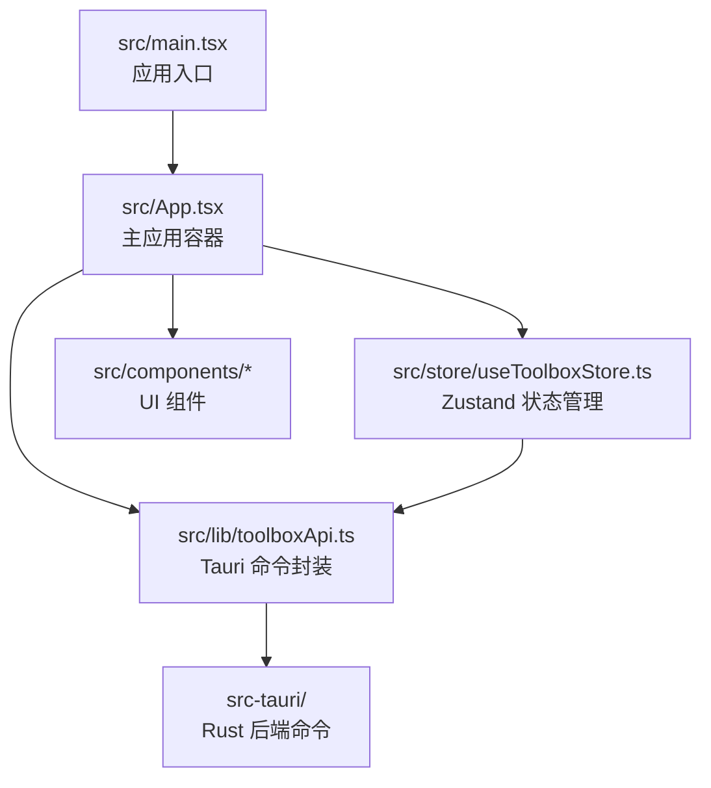
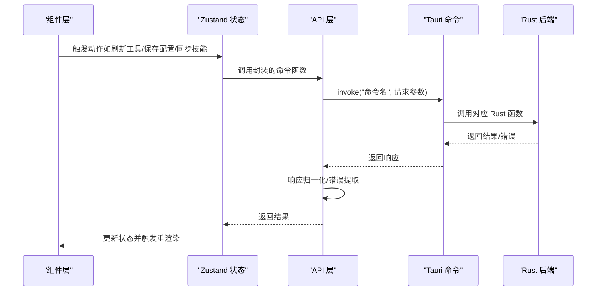
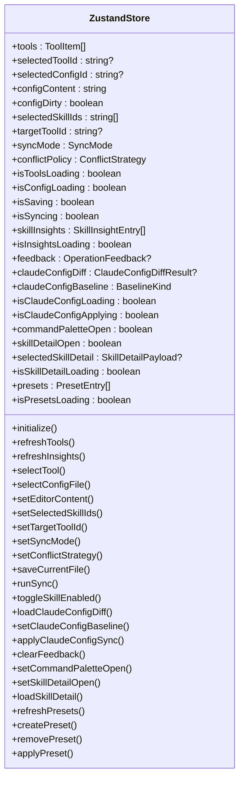
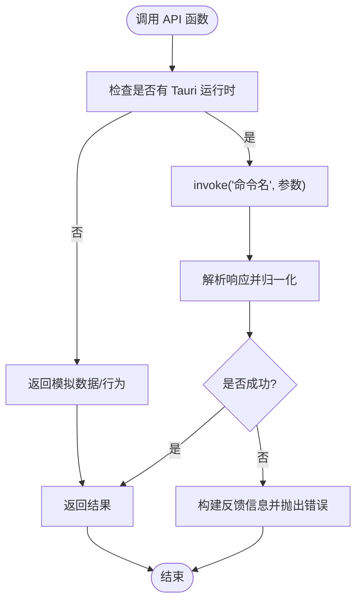
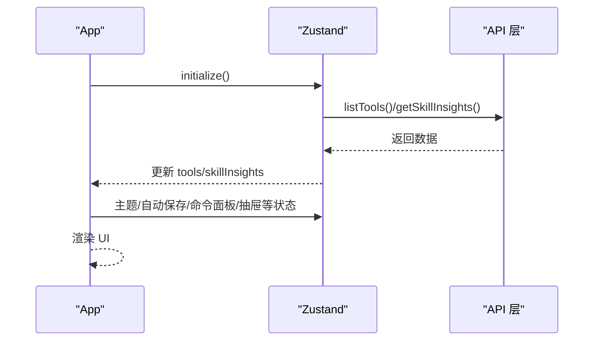
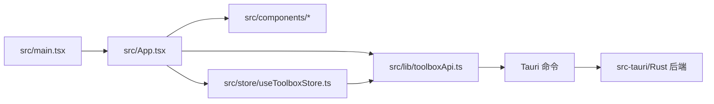

# 前端系统

<cite>
**本文引用的文件**
- [src/main.tsx](file://src/main.tsx)
- [src/App.tsx](file://src/App.tsx)
- [src/store.ts](file://src/store.ts)
- [src/store/useToolboxStore.ts](file://src/store/useToolboxStore.ts)
- [src/lib/toolboxApi.ts](file://src/lib/toolboxApi.ts)
- [src/types.ts](file://src/types.ts)
- [src/types/toolbox.ts](file://src/types/toolbox.ts)
- [src/components/CenterRepoPanel.tsx](file://src/components/CenterRepoPanel.tsx)
- [src/components/ClaudeConfigSyncPanel.tsx](file://src/components/ClaudeConfigSyncPanel.tsx)
- [src/components/CommandPalette.tsx](file://src/components/CommandPalette.tsx)
- [src/components/PresetManager.tsx](file://src/components/PresetManager.tsx)
- [src/components/SkillDetailDrawer.tsx](file://src/components/SkillDetailDrawer.tsx)
- [package.json](file://package.json)
- [vite.config.ts](file://vite.config.ts)
</cite>

## 目录
1. [简介](#简介)
2. [项目结构](#项目结构)
3. [核心组件](#核心组件)
4. [架构总览](#架构总览)
5. [详细组件分析](#详细组件分析)
6. [依赖关系分析](#依赖关系分析)
7. [性能考量](#性能考量)
8. [故障排查指南](#故障排查指南)
9. [结论](#结论)
10. [附录](#附录)

## 简介
本项目是一个基于 React + TypeScript + Zustand 的桌面端前端应用，通过 Tauri 与 Rust 后端交互，提供 AI 工具配置管理、技能同步、中央仓库、预设管理、以及 Claude 配置同步等能力。本文档围绕以下主题展开：
- React 组件体系设计与层次结构
- Zustand 状态管理模型、持久化与性能优化
- API 层（Tauri 命令封装）设计与错误处理
- TypeScript 类型系统与类型安全
- 实际代码示例路径与最佳实践

## 项目结构
前端采用“按功能模块组织”的目录结构，主要目录与职责如下：
- src/main.tsx：应用入口，挂载根组件
- src/App.tsx：主应用容器，负责主题、窗口控制、全局状态与页面布局
- src/store：Zustand 状态存储（旧版 store.ts 与新版 useToolboxStore.ts 并存）
- src/lib：API 层封装，统一调用 Tauri 命令并做响应归一化
- src/types：通用类型定义
- src/types/toolbox.ts：业务领域类型（工具、技能、配置、同步、预设、Claude 配置等）
- src/components：UI 组件（中央仓库面板、Claude 配置同步面板、命令面板、预设管理、技能详情抽屉）

图表来源
- [src/main.tsx:1-12](file://src/main.tsx#L1-L12)
- [src/App.tsx:1-120](file://src/App.tsx#L1-L120)
- [src/store/useToolboxStore.ts:149-185](file://src/store/useToolboxStore.ts#L149-L185)
- [src/lib/toolboxApi.ts:1-25](file://src/lib/toolboxApi.ts#L1-L25)

章节来源
- [src/main.tsx:1-12](file://src/main.tsx#L1-L12)
- [src/App.tsx:1-1556](file://src/App.tsx#L1-L1556)
- [src/store.ts:1-88](file://src/store.ts#L1-L88)
- [src/store/useToolboxStore.ts:1-609](file://src/store/useToolboxStore.ts#L1-L609)
- [src/lib/toolboxApi.ts:1-760](file://src/lib/toolboxApi.ts#L1-L760)
- [src/types.ts:1-38](file://src/types.ts#L1-L38)
- [src/types/toolbox.ts:1-155](file://src/types/toolbox.ts#L1-L155)

## 核心组件
- 主应用容器 App：负责主题切换、窗口控制、消息提示、工具列表与技能列表渲染、同步流程、编辑器模式、中央仓库抽屉、命令面板、预设管理等。
- Zustand 状态管理：集中管理工具、配置、技能洞察、反馈、Claude 配置差异、预设等状态，并提供异步动作（如刷新工具、保存配置、同步技能、应用 Claude 配置等）。
- API 层：以函数形式封装 Tauri 命令，统一响应解析与错误处理，支持预览模式下的模拟行为。
- 类型系统：涵盖工具、技能、配置文件、同步模式、冲突策略、反馈、预设、Claude 配置差异等完整领域模型。

章节来源
- [src/App.tsx:121-1556](file://src/App.tsx#L121-L1556)
- [src/store/useToolboxStore.ts:31-83](file://src/store/useToolboxStore.ts#L31-L83)
- [src/lib/toolboxApi.ts:391-473](file://src/lib/toolboxApi.ts#L391-L473)
- [src/types/toolbox.ts:1-155](file://src/types/toolbox.ts#L1-L155)

## 架构总览
前端采用“组件 + 状态 + API”三层架构：
- 组件层：负责 UI 渲染与用户交互（命令面板、中央仓库、Claude 配置同步、预设管理、技能详情抽屉）
- 状态层：Zustand 提供集中式状态与异步动作，支持派生状态与选择器
- API 层：统一调用 Tauri 命令，进行响应归一化与错误处理

图表来源
- [src/store/useToolboxStore.ts:178-225](file://src/store/useToolboxStore.ts#L178-L225)
- [src/lib/toolboxApi.ts:391-473](file://src/lib/toolboxApi.ts#L391-L473)

## 详细组件分析

### 组件体系与通信机制
- 组件层次
  - App 作为根容器，聚合多个子组件（工具列表、技能列表、编辑器、中央仓库抽屉、命令面板、预设管理、Claude 配置同步面板、技能详情抽屉）
  - 子组件通过 props 与回调进行解耦，同时通过 Zustand 订阅所需状态片段
- 通信机制
  - 父子组件通过 props 传递数据与回调
  - 组件与状态通过 Zustand hooks 订阅状态与触发动作
  - 组件与 API 通过封装函数进行异步调用

章节来源
- [src/App.tsx:600-800](file://src/App.tsx#L600-L800)
- [src/components/CenterRepoPanel.tsx:50-112](file://src/components/CenterRepoPanel.tsx#L50-L112)
- [src/components/ClaudeConfigSyncPanel.tsx:108-125](file://src/components/ClaudeConfigSyncPanel.tsx#L108-L125)
- [src/components/CommandPalette.tsx:40-48](file://src/components/CommandPalette.tsx#L40-L48)
- [src/components/PresetManager.tsx:178-186](file://src/components/PresetManager.tsx#L178-L186)
- [src/components/SkillDetailDrawer.tsx:18-35](file://src/components/SkillDetailDrawer.tsx#L18-L35)

### Zustand 状态管理模型
- 状态模型
  - 工具与配置：tools、selectedToolId、selectedConfigId、configContent、configDirty、selectedSkillIds、targetToolIds、syncMode、conflictPolicy、syncResults
  - 技能洞察与反馈：skillInsights、isInsightsLoading、feedback
  - Claude 配置同步：claudeConfigDiff、claudeConfigBaseline、isClaudeConfigLoading、isClaudeConfigApplying
  - 命令面板与技能详情：commandPaletteOpen、skillDetailOpen、selectedSkillDetail、isSkillDetailLoading
  - 预设：presets、isPresetsLoading
- 动作（异步）
  - 初始化、刷新工具、刷新洞察、选择工具/配置、设置编辑器内容、保存当前文件、运行同步、切换技能启用状态、加载 Claude 配置差异、设置基线、应用同步、清空反馈、打开/关闭命令面板、打开/关闭技能详情、加载技能详情、刷新/创建/删除/应用预设
- 选择器与派生状态
  - 使用选择器订阅状态片段，避免无关重渲染
  - 通过 resolveSelections 等逻辑确保选中项在工具变更后仍有效

图表来源
- [src/store/useToolboxStore.ts:31-83](file://src/store/useToolboxStore.ts#L31-L83)

章节来源
- [src/store/useToolboxStore.ts:149-609](file://src/store/useToolboxStore.ts#L149-L609)
- [src/store.ts:1-88](file://src/store.ts#L1-L88)

### API 接口层设计
- 命令封装
  - listTools、getSkillInsights、readConfigFile、saveConfigFile、syncSkills、listConfigBackups、openPathInFinder、deleteSkill、listToolRegistry、upsertToolRegistryItem、deleteToolRegistryItem、detectToolPaths、toggleSkillEnabled、discoverCenterSkills、batchImportToCenter、setSkillCategory、batchSyncFromCenter、listCenterSkills、deleteCenterSkill、syncFromCenter、importToCenter、installSkillFromGitToCenter、getSkillDetail、listPresets、savePreset、deletePreset、getClaudeConfigDiff、applyClaudeConfigFullSync、listClaudeSettingsSnapshots、restoreCswitchDbFromBackup
- 响应归一化
  - normalizeToolsResponse、normalizeSkill、normalizeConfigFile、normalizeRegistryConfigFile、normalizeToolRegistryEntry、normalizeSkillInsightsResponse、normalizeBackups
- 错误处理
  - 统一读取字符串消息 readMessageResponse，异常时构建 OperationFeedback 并通过状态反馈给 UI
- 预览模式
  - 在无 Tauri 运行时返回模拟数据或模拟行为，便于前端开发与演示

图表来源
- [src/lib/toolboxApi.ts:104-151](file://src/lib/toolboxApi.ts#L104-L151)
- [src/lib/toolboxApi.ts:391-473](file://src/lib/toolboxApi.ts#L391-L473)

章节来源
- [src/lib/toolboxApi.ts:1-760](file://src/lib/toolboxApi.ts#L1-L760)

### TypeScript 类型系统
- 通用类型
  - ConfigFile、SkillEntry、ToolEntry、ConfigPayload、SyncOutcome
- 业务领域类型
  - SyncMode、ConflictStrategy、SkillItem、ConfigFileItem、ToolItem、OperationFeedback、BackupItem、ToolRegistryConfigFile、ToolRegistryEntry、SkillDiff、LaggingToolInfo、SkillInsightEntry、ConfigDiffType、ValueKind、BaselineKind、ConfigDiffEntry、SnapshotMeta、ClaudeConfigDiffResult、ClaudeConfigSyncResult、SkillDetailPayload、PresetSkill、PresetEntry
- 类型安全实践
  - 对象字段读取使用 readString/readArray/readNumber 等安全读取函数
  - 归一化函数确保字段存在性与类型一致性
  - 通过联合类型与枚举约束同步模式与冲突策略

章节来源
- [src/types.ts:1-38](file://src/types.ts#L1-L38)
- [src/types/toolbox.ts:1-155](file://src/types/toolbox.ts#L1-L155)

### 组件 A 分析：App 主容器
- 职责
  - 主题与系统暗色模式联动、自动保存开关、命令面板、中央仓库抽屉、工具列表、技能列表、编辑器模式、同步流程、消息提示、窗口控制
- 生命周期管理
  - 初始化：useEffect 中调用 initialize，触发工具与洞察刷新
  - 主题与系统暗色模式：监听媒体查询变化，更新主题
  - 自动保存：基于定时器与脏状态，延迟保存
  - 反馈提示：根据 feedback 自动弹出消息
- 数据流
  - 通过 useToolboxStore 订阅状态与动作，驱动 UI 更新

图表来源
- [src/App.tsx:186-230](file://src/App.tsx#L186-L230)
- [src/store/useToolboxStore.ts:178-225](file://src/store/useToolboxStore.ts#L178-L225)

章节来源
- [src/App.tsx:121-1556](file://src/App.tsx#L121-L1556)
- [src/store/useToolboxStore.ts:149-225](file://src/store/useToolboxStore.ts#L149-L225)

### 组件 B 分析：CentralRepoPanel 中央仓库面板
- 功能
  - 列表展示、搜索过滤、来源筛选、同步状态统计、批量操作、从 Git 安装、从工具导入、扫描发现、批量同步、批量修改分类、删除技能
- 交互
  - 通过 Modal/Drawer 弹窗承载复杂交互，支持多步骤流程
  - 通过 API 函数执行批量导入、批量同步、设置分类、删除技能等操作
- 性能
  - 使用 useMemo 进行列表过滤与计算，减少不必要的重渲染

章节来源
- [src/components/CenterRepoPanel.tsx:50-112](file://src/components/CenterRepoPanel.tsx#L50-L112)
- [src/components/CenterRepoPanel.tsx:123-142](file://src/components/CenterRepoPanel.tsx#L123-L142)
- [src/components/CenterRepoPanel.tsx:144-288](file://src/components/CenterRepoPanel.tsx#L144-L288)

### 组件 C 分析：ClaudeConfigSyncPanel 配置同步面板
- 功能
  - 显示字段差异、基线选择（Live/Richest/Snapshot）、整段同步到 cc-switch、字段级 diff 查看
- 交互
  - 通过 DiffEditor 展示 JSON diff，支持左右侧对比
  - 二次确认弹窗，明确同步策略与风险提示
- 状态
  - 通过 Zustand 订阅 claudeConfigDiff、isClaudeConfigLoading、isClaudeConfigApplying 等状态

章节来源
- [src/components/ClaudeConfigSyncPanel.tsx:108-125](file://src/components/ClaudeConfigSyncPanel.tsx#L108-L125)
- [src/components/ClaudeConfigSyncPanel.tsx:162-216](file://src/components/ClaudeConfigSyncPanel.tsx#L162-L216)
- [src/components/ClaudeConfigSyncPanel.tsx:344-384](file://src/components/ClaudeConfigSyncPanel.tsx#L344-L384)

### 组件 D 分析：CommandPalette 命令面板
- 功能
  - 全局搜索工具与技能，键盘导航与快捷键支持（Cmd/Ctrl+K 打开、ESC 关闭、上下导航、Enter 选择）
- 交互
  - 使用 ref 管理焦点与滚动，键盘事件监听，动态高亮选中项

章节来源
- [src/components/CommandPalette.tsx:40-48](file://src/components/CommandPalette.tsx#L40-L48)
- [src/components/CommandPalette.tsx:108-166](file://src/components/CommandPalette.tsx#L108-L166)

### 组件 E 分析：PresetManager 预设管理
- 功能
  - 创建预设、应用预设到多个工具、删除预设、加载预设列表
- 交互
  - 通过 Modal 承载创建与应用流程，支持多选目标工具

章节来源
- [src/components/PresetManager.tsx:178-186](file://src/components/PresetManager.tsx#L178-L186)
- [src/components/PresetManager.tsx:198-203](file://src/components/PresetManager.tsx#L198-L203)
- [src/components/PresetManager.tsx:215-224](file://src/components/PresetManager.tsx#L215-L224)

### 组件 F 分析：SkillDetailDrawer 抽屉
- 功能
  - 展示技能的 skill.md 与 README.md 文档内容
- 交互
  - 加载中显示、无内容提示、内容区域样式化展示

章节来源
- [src/components/SkillDetailDrawer.tsx:18-35](file://src/components/SkillDetailDrawer.tsx#L18-L35)
- [src/components/SkillDetailDrawer.tsx:36-103](file://src/components/SkillDetailDrawer.tsx#L36-L103)

## 依赖关系分析
- 依赖图
  - main.tsx -> App.tsx
  - App.tsx -> 组件集合、Zustand、API
  - Zustand -> API
  - API -> Tauri 命令 -> Rust 后端

图表来源
- [src/main.tsx:1-12](file://src/main.tsx#L1-L12)
- [src/App.tsx:1-120](file://src/App.tsx#L1-L120)
- [src/store/useToolboxStore.ts:1-18](file://src/store/useToolboxStore.ts#L1-L18)
- [src/lib/toolboxApi.ts:1-25](file://src/lib/toolboxApi.ts#L1-L25)

章节来源
- [package.json:1-40](file://package.json#L1-L40)
- [vite.config.ts:1-8](file://vite.config.ts#L1-L8)

## 性能考量
- 状态粒度与选择器
  - 使用选择器订阅状态片段，避免不必要的重渲染
- 派生状态与缓存
  - 使用 useMemo 对过滤、排序、选项计算进行缓存
- 异步加载与节流
  - 自动保存使用定时器与脏状态控制，避免频繁写入
- UI 交互优化
  - 列表分页与虚拟滚动（如 Table 的 scroll 配置），减少 DOM 节点数量
- 类型安全与归一化
  - 通过类型系统与归一化函数降低运行时错误，提升稳定性

## 故障排查指南
- 常见问题
  - 无法读取工具列表：检查 initialize 是否被调用、网络/Tauri 环境是否可用
  - 保存配置失败：查看反馈消息，确认文件路径与权限
  - 同步失败：检查源工具/目标工具选择、技能选择、冲突策略
  - Claude 配置同步失败：确认 cc-switch 未锁定、备份路径可写
- 定位方法
  - 查看 feedback 状态，结合控制台日志
  - 使用 API 层的错误提取函数 readMessageResponse 获取具体错误信息
  - 在预览模式下验证 UI 行为与数据流

章节来源
- [src/store/useToolboxStore.ts:202-213](file://src/store/useToolboxStore.ts#L202-L213)
- [src/lib/toolboxApi.ts:342-352](file://src/lib/toolboxApi.ts#L342-L352)

## 结论
本前端系统通过清晰的组件分层、完善的 Zustand 状态模型、严谨的 API 封装与类型系统，实现了从工具配置管理到技能同步、中央仓库、预设与 Claude 配置同步的完整能力。系统具备良好的扩展性与可维护性，适合进一步引入数据持久化（如 localStorage/persist）、更细粒度的状态拆分与缓存策略，以及更丰富的 UI 交互与无障碍支持。

## 附录
- 最佳实践
  - 使用选择器订阅状态，避免全局重渲染
  - 对长列表与复杂计算使用 useMemo/useCallback
  - 在 API 层统一错误处理与反馈，保持 UI 一致性
  - 通过类型系统约束参数与返回值，减少运行时错误
  - 在预览模式下进行 UI 快速迭代，提高开发效率