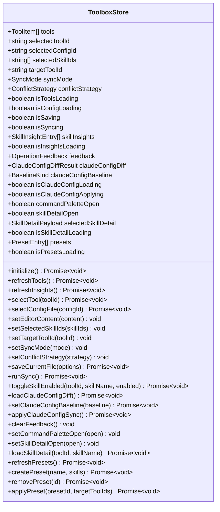
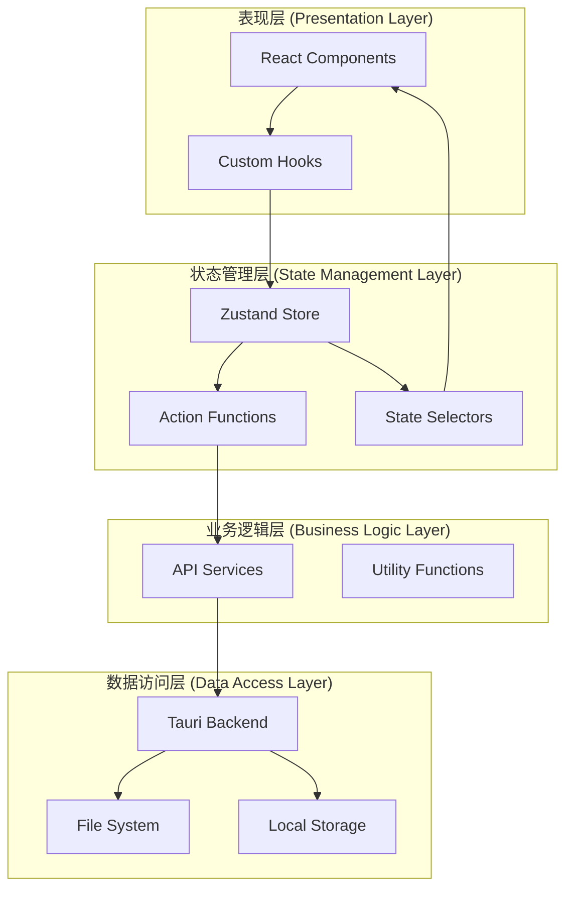
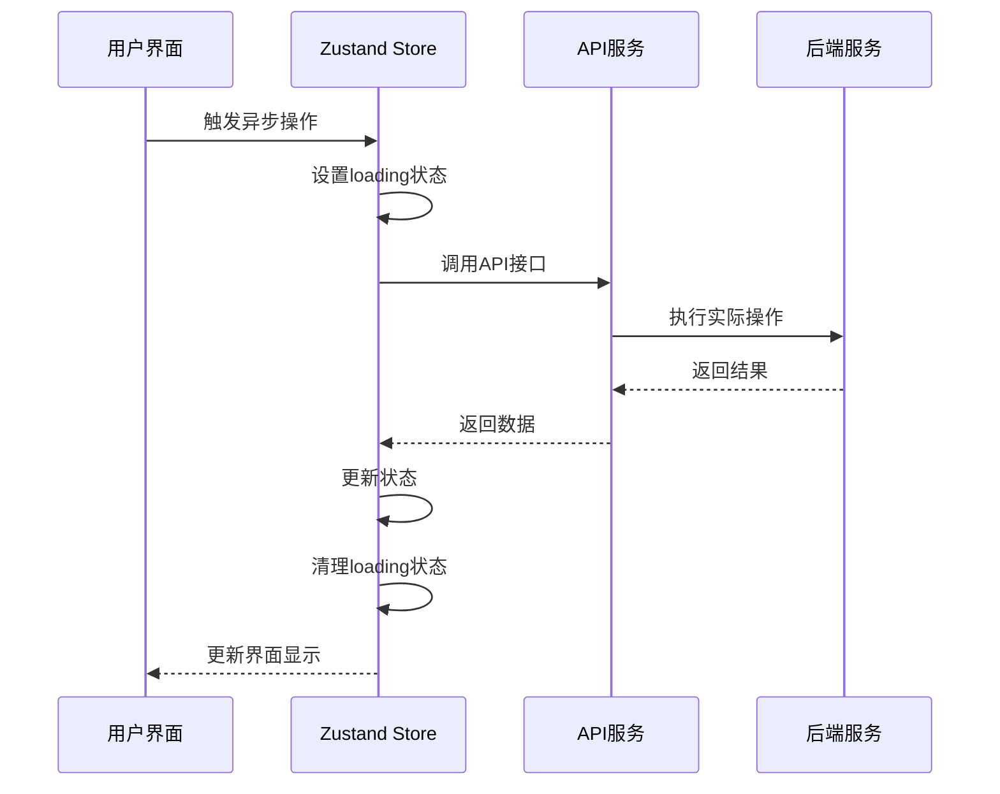
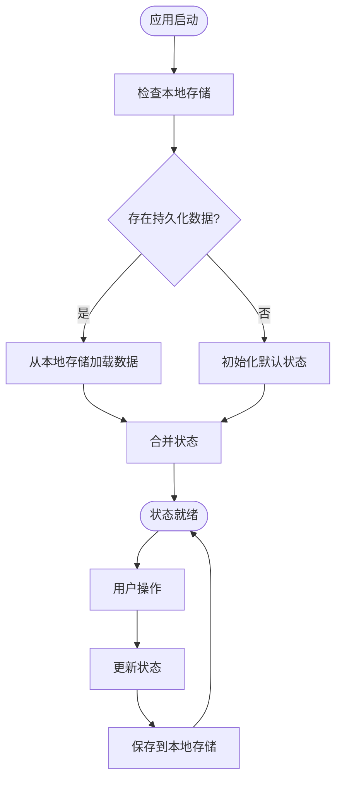
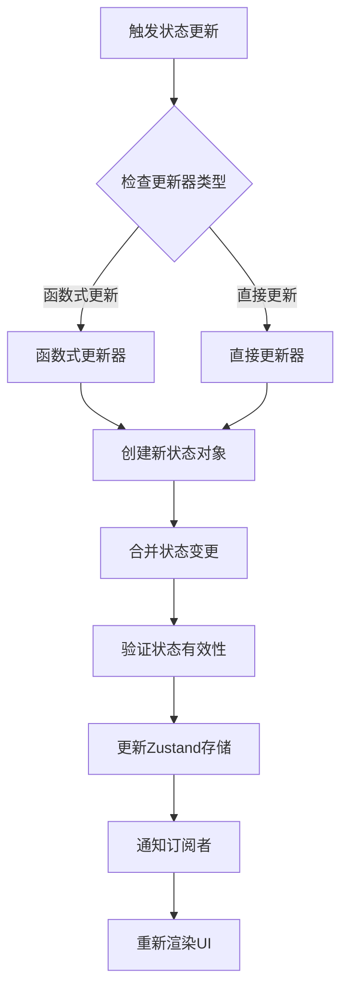
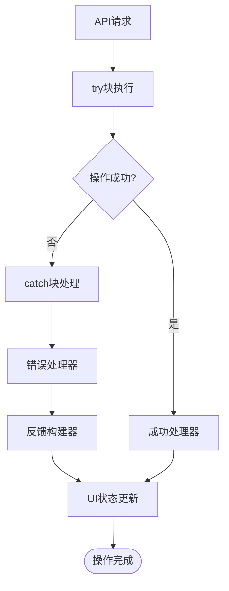
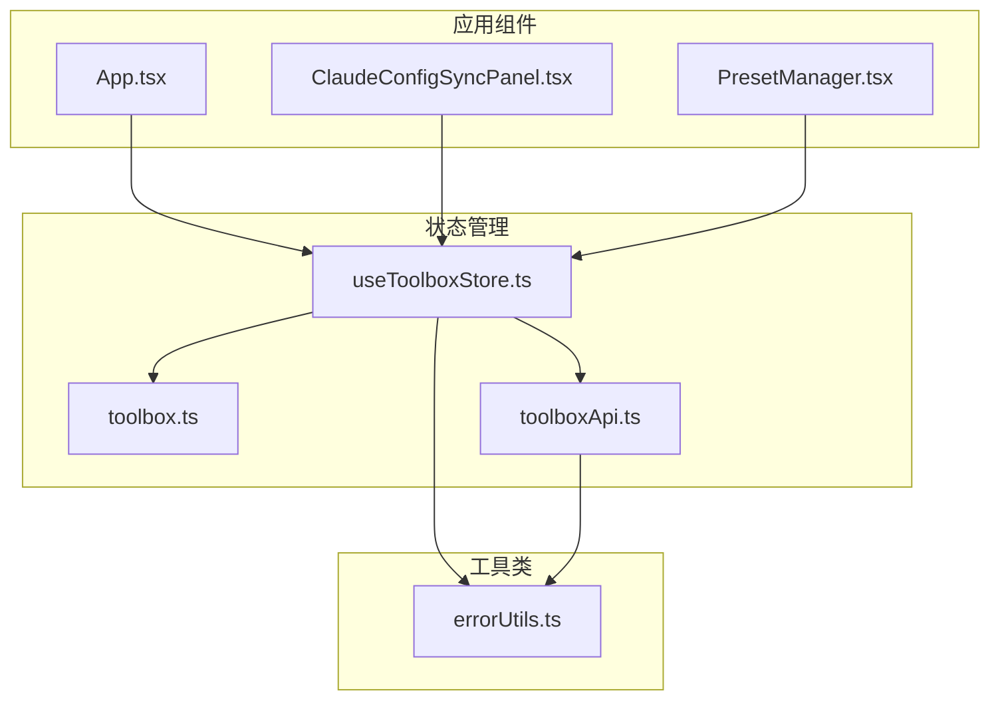
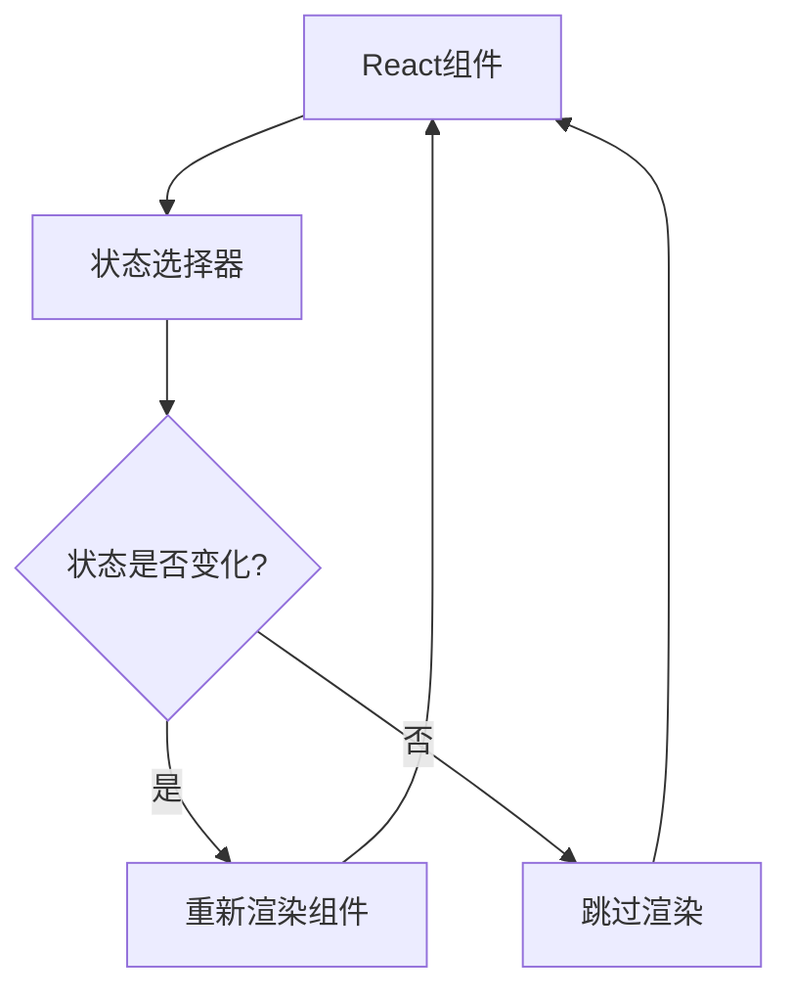

# 状态管理系统

<cite>
**本文档引用的文件**
- [useToolboxStore.ts](file://src/store/useToolboxStore.ts)
- [toolbox.ts](file://src/types/toolbox.ts)
- [toolboxApi.ts](file://src/lib/toolboxApi.ts)
- [errorUtils.ts](file://src/utils/errorUtils.ts)
- [ClaudeConfigSyncPanel.tsx](file://src/components/ClaudeConfigSyncPanel.tsx)
- [PresetManager.tsx](file://src/components/PresetManager.tsx)
- [App.tsx](file://src/App.tsx)
- [package.json](file://package.json)
</cite>

## 目录
1. [简介](#简介)
2. [项目结构](#项目结构)
3. [核心组件](#核心组件)
4. [架构概览](#架构概览)
5. [详细组件分析](#详细组件分析)
6. [依赖关系分析](#依赖关系分析)
7. [性能考虑](#性能考虑)
8. [故障排除指南](#故障排除指南)
9. [结论](#结论)

## 简介

AI工具箱采用Zustand作为其核心状态管理库，构建了一个功能完整、性能优异的状态管理系统。该系统通过声明式状态定义、异步操作处理和中间件支持，为复杂的工具配置管理和技能同步提供了可靠的状态管理解决方案。

Zustand版本为5.0.13，支持React 18+和现代JavaScript特性，通过immer实现不可变更新，确保状态变更的可预测性和性能优化。

## 项目结构

AI工具箱的状态管理系统主要由以下核心部分组成：

```mermaid
graph TB
subgraph "状态管理层"
Store[useToolboxStore.ts<br/>主状态存储]
Types[toolbox.ts<br/>类型定义]
Utils[errorUtils.ts<br/>错误处理工具]
end
subgraph "API层"
Api[toolboxApi.ts<br/>工具API封装]
end
subgraph "组件层"
App[App.tsx<br/>应用入口]
ClaudePanel[ClaudeConfigSyncPanel.tsx<br/>配置同步面板]
PresetMgr[PresetManager.tsx<br/>预设管理器]
end
subgraph "外部依赖"
Zustand[zustand@5.0.13<br/>状态管理库]
Tauri[@tauri-apps/api<br/>跨平台API]
React[react@19.2.5<br/>UI框架]
end
Store --> Types
Store --> Utils
Store --> Api
App --> Store
ClaudePanel --> Store
PresetMgr --> Store
Api --> Tauri
Store --> Zustand
App --> React
```

**图表来源**
- [useToolboxStore.ts:1-556](file://src/store/useToolboxStore.ts#L1-L556)
- [toolbox.ts:1-152](file://src/types/toolbox.ts#L1-L152)
- [toolboxApi.ts:1-784](file://src/lib/toolboxApi.ts#L1-L784)

**章节来源**
- [useToolboxStore.ts:145-173](file://src/store/useToolboxStore.ts#L145-L173)
- [toolbox.ts:32-84](file://src/types/toolbox.ts#L32-L84)

## 核心组件

### 主状态存储 (useToolboxStore)

主状态存储是整个应用的核心，定义了完整的状态结构和所有操作方法：

#### 状态结构定义

系统采用模块化的状态分片设计，将相关状态组织在逻辑分组中：



**图表来源**
- [useToolboxStore.ts:32-84](file://src/store/useToolboxStore.ts#L32-L84)

#### 数据类型定义

系统定义了完整的类型体系，确保类型安全和开发体验：

**章节来源**
- [useToolboxStore.ts:32-84](file://src/store/useToolboxStore.ts#L32-L84)
- [toolbox.ts:1-152](file://src/types/toolbox.ts#L1-L152)

## 架构概览

AI工具箱采用分层架构设计，实现了清晰的关注点分离：



**图表来源**
- [useToolboxStore.ts:145-556](file://src/store/useToolboxStore.ts#L145-L556)
- [toolboxApi.ts:387-784](file://src/lib/toolboxApi.ts#L387-L784)

## 详细组件分析

### 状态管理模式

#### 状态分片设计

系统采用逻辑分片的方式组织状态，每个分片负责特定的功能领域：

1. **工具状态分片**：管理工具列表、选中工具和配置文件
2. **同步状态分片**：处理技能同步和冲突解决
3. **反馈状态分片**：统一处理用户反馈和错误信息
4. **Claude配置状态分片**：专门处理Claude代码配置同步
5. **预设状态分片**：管理技能预设的创建和应用

#### 异步操作处理

系统通过精心设计的异步操作流程，确保复杂操作的可靠性和用户体验：



**图表来源**
- [useToolboxStore.ts:183-205](file://src/store/useToolboxStore.ts#L183-L205)
- [toolboxApi.ts:438-465](file://src/lib/toolboxApi.ts#L438-L465)

#### 状态订阅机制

系统通过React hooks实现高效的状态订阅：

**章节来源**
- [useToolboxStore.ts:174-181](file://src/store/useToolboxStore.ts#L174-L181)
- [App.tsx:172-201](file://src/App.tsx#L172-L201)

### 数据持久化策略

#### 本地存储集成

虽然当前实现主要依赖内存状态，但系统具备良好的扩展性以支持持久化：



**图表来源**
- [useToolboxStore.ts:174-181](file://src/store/useToolboxStore.ts#L174-L181)

#### 状态恢复机制

系统实现了智能的状态恢复机制，确保应用重启后的状态一致性：

**章节来源**
- [useToolboxStore.ts:119-143](file://src/store/useToolboxStore.ts#L119-L143)

### 状态更新最佳实践

#### Immer不可变更新

系统利用Zustand的Immer集成，实现高效的不可变更新：



**图表来源**
- [useToolboxStore.ts:285-300](file://src/store/useToolboxStore.ts#L285-L300)
- [useToolboxStore.ts:318-339](file://src/store/useToolboxStore.ts#L318-L339)

#### 批量更新策略

系统支持批量状态更新，减少不必要的重渲染：

**章节来源**
- [useToolboxStore.ts:189-193](file://src/store/useToolboxStore.ts#L189-L193)
- [useToolboxStore.ts:321-331](file://src/store/useToolboxStore.ts#L321-L331)

### 中间件使用

#### 错误处理中间件

系统实现了统一的错误处理机制：



**图表来源**
- [useToolboxStore.ts:198-202](file://src/store/useToolboxStore.ts#L198-L202)
- [errorUtils.ts:5-9](file://src/utils/errorUtils.ts#L5-L9)

**章节来源**
- [useToolboxStore.ts:86-95](file://src/store/useToolboxStore.ts#L86-L95)
- [errorUtils.ts:1-10](file://src/utils/errorUtils.ts#L1-L10)

## 依赖关系分析

### 核心依赖关系

```mermaid
graph TB
subgraph "运行时依赖"
Zustand[zustand@5.0.13]
React[react@19.2.5]
Immer[immer@^9.0.6]
end
subgraph "开发依赖"
TS[typescript@~6.0.2]
ESLint[eslint@^10.2.1]
Prettier[prettier@^3.8.3]
end
subgraph "应用依赖"
Antd[antd@^6.3.7]
Monaco[monaco-editor@^0.55.1]
TauriAPI[@tauri-apps/api@^2.10.1]
Icons[@ant-design/icons@^6.2.2]
end
Zustand --> React
Zustand --> Immer
Antd --> React
Monaco --> React
TauriAPI --> React
```

**图表来源**
- [package.json:29-63](file://package.json#L29-L63)

### 组件依赖图



**图表来源**
- [App.tsx:172-201](file://src/App.tsx#L172-L201)
- [ClaudeConfigSyncPanel.tsx:29](file://src/components/ClaudeConfigSyncPanel.tsx#L29)
- [PresetManager.tsx:1](file://src/components/PresetManager.tsx#L1)

**章节来源**
- [package.json:29-63](file://package.json#L29-L63)

## 性能考虑

### 状态选择器优化

系统通过精确的状态选择器减少不必要的重渲染：



**图表来源**
- [App.tsx:172-201](file://src/App.tsx#L172-L201)
- [ClaudeConfigSyncPanel.tsx:101-108](file://src/components/ClaudeConfigSyncPanel.tsx#L101-L108)

### 异步操作优化

系统通过合理的异步操作设计，避免UI阻塞：

**章节来源**
- [useToolboxStore.ts:183-205](file://src/store/useToolboxStore.ts#L183-L205)
- [useToolboxStore.ts:307-339](file://src/store/useToolboxStore.ts#L307-L339)

## 故障排除指南

### 常见问题及解决方案

#### 状态更新异常

**问题描述**：状态更新后UI未正确反映变化

**解决方案**：
1. 检查状态选择器的依赖数组
2. 确保使用正确的状态更新方式
3. 验证状态结构的正确性

#### 异步操作失败

**问题描述**：异步操作调用后无响应或报错

**解决方案**：
1. 检查API调用的参数和返回值
2. 验证错误处理逻辑
3. 确认网络连接状态

#### 内存泄漏问题

**问题描述**：长时间使用后内存占用持续增长

**解决方案**：
1. 检查组件卸载时的状态清理
2. 验证事件监听器的移除
3. 确认定时器的清理

**章节来源**
- [useToolboxStore.ts:198-202](file://src/store/useToolboxStore.ts#L198-L202)
- [errorUtils.ts:5-9](file://src/utils/errorUtils.ts#L5-L9)

### 调试技巧

#### 开发工具使用

1. **React DevTools**：监控组件渲染和状态变化
2. **Zustand DevTools**：跟踪状态更新历史
3. **浏览器开发者工具**：检查网络请求和错误日志

#### 日志记录策略

系统实现了统一的错误处理机制，便于问题诊断：

**章节来源**
- [useToolboxStore.ts:86-95](file://src/store/useToolboxStore.ts#L86-L95)
- [toolboxApi.ts:387-465](file://src/lib/toolboxApi.ts#L387-L465)

## 结论

AI工具箱的Zustand状态管理系统展现了现代前端状态管理的最佳实践。通过模块化的状态设计、完善的异步操作处理和高效的性能优化，系统为复杂的工具配置管理提供了可靠的技术基础。

系统的主要优势包括：

1. **类型安全**：完整的TypeScript类型定义确保开发时的类型安全
2. **性能优化**：精确的状态选择器和批量更新策略提升渲染效率
3. **可维护性**：清晰的模块化设计便于代码维护和扩展
4. **用户体验**：完善的错误处理和反馈机制提升用户满意度

未来可以考虑的方向包括：引入持久化中间件、添加状态快照功能、增强调试工具等，进一步提升系统的完整性和可用性。