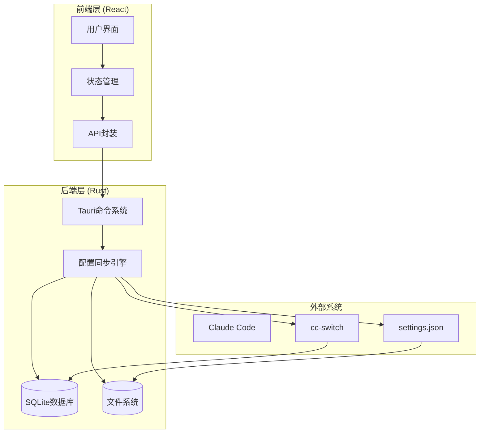
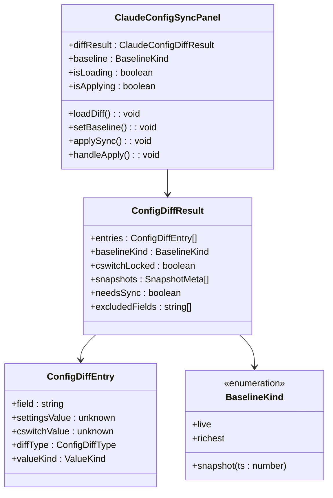
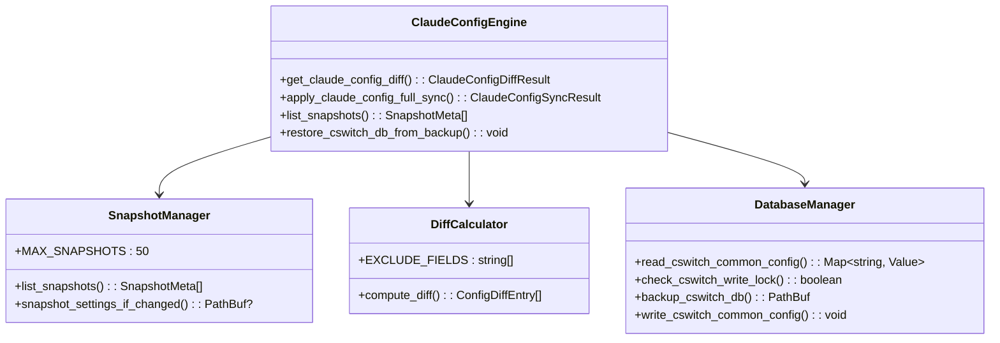
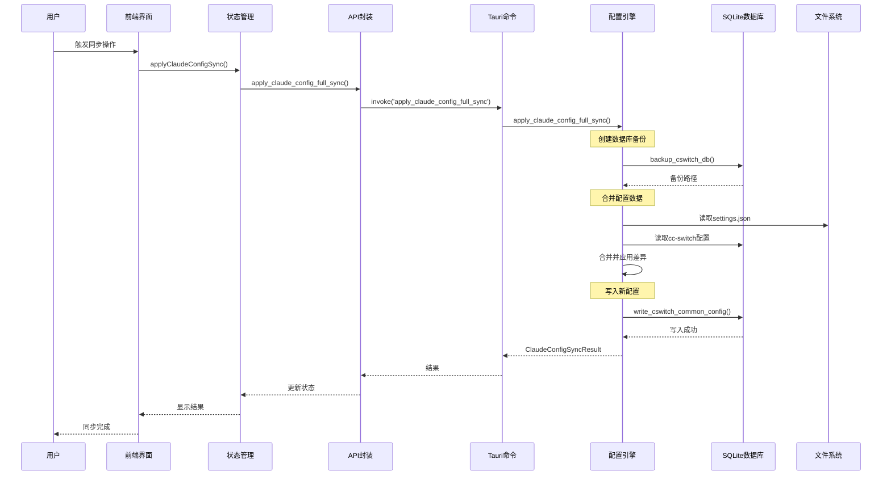
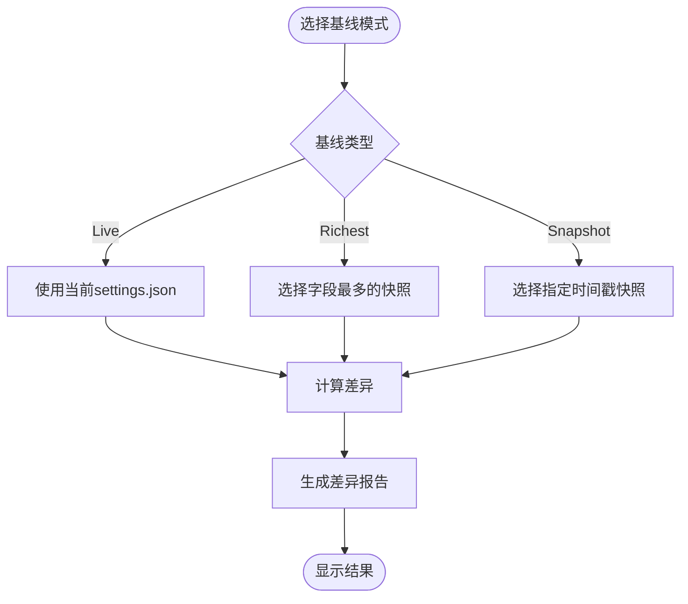
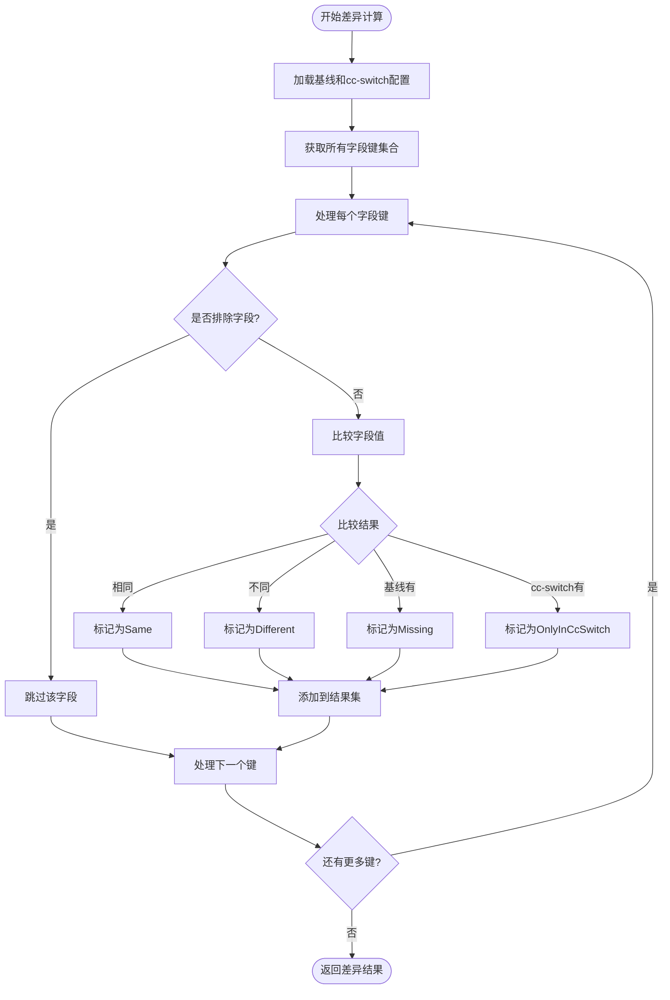
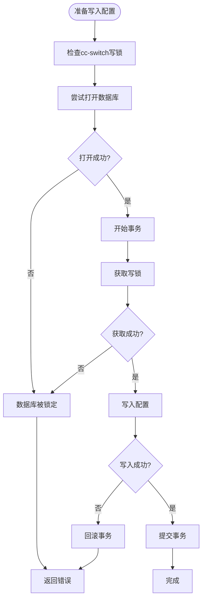
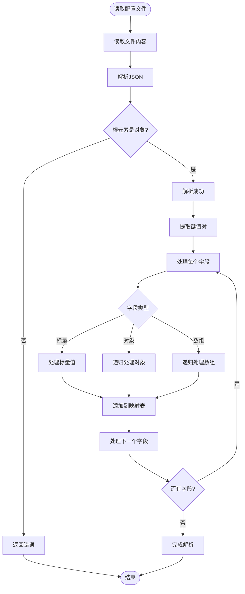
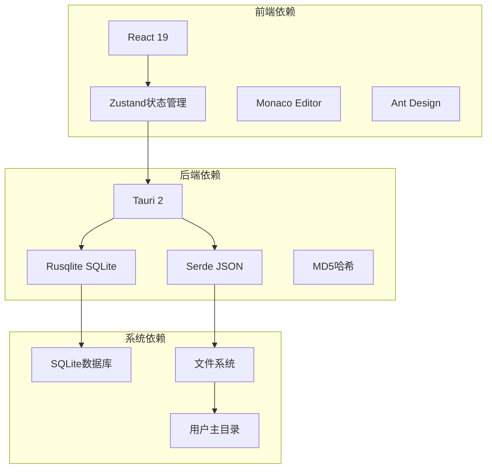

# Claude配置同步

<cite>
**本文档引用的文件**
- [ClaudeConfigSyncPanel.tsx](file://src/components/ClaudeConfigSyncPanel.tsx)
- [claude_config.rs](file://src-tauri/src/claude_config.rs)
- [toolboxApi.ts](file://src/lib/toolboxApi.ts)
- [useToolboxStore.ts](file://src/store/useToolboxStore.ts)
- [toolbox.ts](file://src/types/toolbox.ts)
- [lib.rs](file://src-tauri/src/lib.rs)
- [main.rs](file://src-tauri/src/main.rs)
- [README.md](file://README.md)
- [package.json](file://package.json)
</cite>

## 目录
1. [简介](#简介)
2. [项目结构](#项目结构)
3. [核心组件](#核心组件)
4. [架构概览](#架构概览)
5. [详细组件分析](#详细组件分析)
6. [依赖关系分析](#依赖关系分析)
7. [性能考虑](#性能考虑)
8. [故障排除指南](#故障排除指南)
9. [结论](#结论)
10. [附录](#附录)

## 简介

Claude配置同步模块是AI Toolbox项目中的一个关键功能，专门用于管理和同步Claude Code编辑器的配置设置。该模块提供了智能的配置差异检测、多种基线模式选择、快照管理、安全同步机制以及完整的回滚支持。

该模块的核心目标是确保用户在不同环境中的一致性体验，通过以下方式实现：
- 智能差异检测和可视化展示
- 多种基线模式（实时、最丰富、特定快照）
- 自动快照创建和版本控制
- 安全的数据库写入和冲突处理
- 完整的备份和回滚机制

## 项目结构

AI Toolbox采用前后端分离的架构设计，Claude配置同步功能跨越了前端React界面和后端Rust服务层：



**图表来源**
- [ClaudeConfigSyncPanel.tsx:101-438](file://src/components/ClaudeConfigSyncPanel.tsx#L101-L438)
- [toolboxApi.ts:756-784](file://src/lib/toolboxApi.ts#L756-L784)
- [lib.rs:1243-1267](file://src-tauri/src/lib.rs#L1243-L1267)

**章节来源**
- [README.md:44-67](file://README.md#L44-L67)
- [package.json:29-38](file://package.json#L29-L38)

## 核心组件

### 前端组件架构

Claude配置同步面板是用户交互的核心界面，提供了完整的配置同步体验：



**图表来源**
- [ClaudeConfigSyncPanel.tsx:101-438](file://src/components/ClaudeConfigSyncPanel.tsx#L101-L438)
- [toolbox.ts:119-134](file://src/types/toolbox.ts#L119-L134)

### 后端服务架构

后端采用模块化的Rust实现，提供了完整的配置同步功能：



**图表来源**
- [claude_config.rs:430-495](file://src-tauri/src/claude_config.rs#L430-L495)
- [claude_config.rs:151-225](file://src-tauri/src/claude_config.rs#L151-L225)
- [claude_config.rs:389-424](file://src-tauri/src/claude_config.rs#L389-L424)

**章节来源**
- [ClaudeConfigSyncPanel.tsx:101-438](file://src/components/ClaudeConfigSyncPanel.tsx#L101-L438)
- [claude_config.rs:1-523](file://src-tauri/src/claude_config.rs#L1-523)

## 架构概览

Claude配置同步模块采用了分层架构设计，确保了功能的模块化和可维护性：



**图表来源**
- [useToolboxStore.ts:432-459](file://src/store/useToolboxStore.ts#L432-L459)
- [toolboxApi.ts:764-770](file://src/lib/toolboxApi.ts#L764-L770)
- [lib.rs:1252-1257](file://src-tauri/src/lib.rs#L1252-L1257)

## 详细组件分析

### 基线模式设计

基线模式是Claude配置同步的核心概念，提供了三种不同的配置比较基准：

#### 实时基线 (Live)
实时基线直接使用当前的`settings.json`文件作为比较基准，反映用户当前的实际配置状态。

#### 最丰富基线 (Richest)
最丰富基线选择包含最多字段的快照作为基准，确保不会丢失任何配置信息。

#### 快照基线 (Snapshot)
快照基线允许用户选择特定时间点的配置快照进行比较，便于历史版本对比和回滚。



**图表来源**
- [claude_config.rs:227-277](file://src-tauri/src/claude_config.rs#L227-L277)
- [ClaudeConfigSyncPanel.tsx:85-99](file://src/components/ClaudeConfigSyncPanel.tsx#L85-L99)

**章节来源**
- [claude_config.rs:41-53](file://src-tauri/src/claude_config.rs#L41-L53)
- [toolbox.ts:102](file://src/types/toolbox.ts#L102)

### 差异对比算法

差异对比算法是整个同步系统的核心，负责精确识别配置文件之间的差异：

#### 差异类型分类

| 差异类型 | 描述 | 处理策略 |
|---------|------|----------|
| Missing | settings.json中有而cc-switch中没有 | 需要回灌到cc-switch |
| Different | 两边都有但值不同 | 整体覆盖cc-switch中的值 |
| Same | 两边完全一致 | 无需操作 |
| OnlyInCcSwitch | 仅cc-switch中有 | 保留不变 |

#### 算法实现流程



**图表来源**
- [claude_config.rs:389-424](file://src-tauri/src/claude_config.rs#L389-L424)

**章节来源**
- [claude_config.rs:57-62](file://src-tauri/src/claude_config.rs#L57-L62)
- [claude_config.rs:389-424](file://src-tauri/src/claude_config.rs#L389-L424)

### 快照创建与存储机制

快照机制提供了完整的版本控制和回滚能力：

#### 快照生成策略

```mermaid
flowchart TD
Start([检测配置变化]) --> CheckExists{settings.json存在?}
CheckExists --> |否| NoOp[无操作]
CheckExists --> |是| ReadContent[读取文件内容]
ReadContent --> CalcHash[计算MD5哈希]
CalcHash --> CheckDuplicate{检查重复快照?}
CheckDuplicate --> |是| SkipCreate[跳过创建]
CheckDuplicate --> |否| CreateDir[创建快照目录]
CreateDir --> GenFilename[生成文件名<br/>格式: {timestamp}-{hash8}.json]
GenFilename --> WriteFile[写入快照文件]
WriteFile --> CleanupOld[清理过期快照]
CleanupOld --> LimitCheck{超过限制?}
LimitCheck --> |是| RemoveOld[删除最旧的快照]
LimitCheck --> |否| Complete[完成]
RemoveOld --> Complete
SkipCreate --> Complete
NoOp --> Complete
```

**图表来源**
- [claude_config.rs:193-225](file://src-tauri/src/claude_config.rs#L193-L225)

#### 存储结构

快照文件采用统一的命名约定：`{timestamp}-{hash8}.json`，其中：
- `timestamp`: Unix时间戳（秒）
- `hash8`: MD5哈希的前8位字符

**章节来源**
- [claude_config.rs:151-191](file://src-tauri/src/claude_config.rs#L151-L191)
- [claude_config.rs:193-225](file://src-tauri/src/claude_config.rs#L193-L225)

### 安全同步机制

安全同步机制确保了配置更新的安全性和可靠性：

#### 写锁检测



**图表来源**
- [claude_config.rs:308-330](file://src-tauri/src/claude_config.rs#L308-L330)
- [claude_config.rs:354-383](file://src-tauri/src/claude_config.rs#L354-L383)

#### 冲突检测和解决策略

| 冲突类型 | 检测方法 | 解决策略 |
|---------|----------|----------|
| 数据库锁定 | 尝试获取写锁 | 返回锁定状态，阻止写入 |
| 写入失败 | 捕获数据库异常 | 自动回滚事务 |
| 备份失败 | 检查备份完整性 | 返回错误并终止操作 |
| 配置无效 | 验证JSON格式 | 返回解析错误 |

**章节来源**
- [claude_config.rs:308-330](file://src-tauri/src/claude_config.rs#L308-L330)
- [claude_config.rs:354-383](file://src-tauri/src/claude_config.rs#L354-L383)

### 配置文件解析和序列化

配置文件的解析和序列化过程确保了数据的完整性和一致性：

#### JSON解析流程



**图表来源**
- [claude_config.rs:138-145](file://src-tauri/src/claude_config.rs#L138-L145)

#### 序列化策略

配置数据采用美化格式进行序列化，确保：
- 可读性强的JSON输出
- 统一的缩进和格式
- 错误处理和回退机制

**章节来源**
- [claude_config.rs:138-145](file://src-tauri/src/claude_config.rs#L138-L145)
- [claude_config.rs:366](file://src-tauri/src/claude_config.rs#L366)

## 依赖关系分析

Claude配置同步模块的依赖关系体现了清晰的分层架构：



**图表来源**
- [package.json:29-38](file://package.json#L29-L38)
- [lib.rs:1-8](file://src-tauri/src/lib.rs#L1-L8)

**章节来源**
- [package.json:29-61](file://package.json#L29-L61)
- [lib.rs:1-8](file://src-tauri/src/lib.rs#L1-L8)

## 性能考虑

### 异步操作优化

Claude配置同步模块采用了多项性能优化措施：

1. **异步文件I/O**: 使用异步文件操作避免阻塞主线程
2. **缓存机制**: 缓存快照列表和配置数据减少重复计算
3. **增量更新**: 仅在配置发生变化时创建新的快照
4. **并发处理**: 支持多个工具的同时监控

### 内存管理

- **流式处理**: 大文件采用流式读取避免内存溢出
- **智能清理**: 及时释放不再使用的资源
- **限制策略**: 快照数量限制防止无限增长

### 数据库优化

- **连接池**: 使用SQLite连接池提高并发性能
- **事务管理**: 合理使用事务确保数据一致性
- **索引优化**: 在关键查询上使用适当的索引

## 故障排除指南

### 常见问题及解决方案

#### 配置同步失败

**症状**: 同步操作返回错误

**可能原因**:
1. cc-switch数据库被其他进程占用
2. 权限不足无法写入配置文件
3. 磁盘空间不足

**解决步骤**:
1. 关闭所有可能访问cc-switch的程序
2. 检查文件权限设置
3. 清理磁盘空间

#### 快照创建失败

**症状**: 无法创建新的配置快照

**可能原因**:
1. settings.json文件损坏
2. 快照目录权限问题
3. 磁盘空间不足

**解决步骤**:
1. 验证settings.json文件完整性
2. 检查`.ai-toolbox/snapshots/`目录权限
3. 清理不必要的快照文件

#### 差异检测异常

**症状**: 差异结果显示不准确

**可能原因**:
1. 排除字段配置错误
2. 缓存数据过期
3. 文件编码问题

**解决步骤**:
1. 检查排除字段列表
2. 刷新差异检测结果
3. 验证文件编码格式

**章节来源**
- [claude_config.rs:308-330](file://src-tauri/src/claude_config.rs#L308-L330)
- [claude_config.rs:193-225](file://src-tauri/src/claude_config.rs#L193-L225)

## 结论

Claude配置同步模块是一个设计精良、功能完备的配置管理解决方案。它通过以下关键特性实现了高质量的用户体验：

### 核心优势

1. **智能化基线管理**: 提供多种基线模式满足不同使用场景
2. **安全可靠的同步**: 完善的锁机制和错误处理确保操作安全
3. **完整的版本控制**: 自动快照和回滚机制提供数据保护
4. **直观的用户界面**: 丰富的可视化工具帮助用户理解配置差异

### 技术亮点

- **模块化架构**: 清晰的前后端分离设计便于维护和扩展
- **高性能实现**: 优化的数据结构和算法确保流畅的用户体验
- **健壮的错误处理**: 完善的异常捕获和恢复机制
- **跨平台兼容**: 支持Windows、macOS等主流操作系统

### 发展前景

该模块为AI Toolbox项目奠定了坚实的基础，未来可以进一步扩展：
- 支持更多配置格式和工具
- 增强自动化同步能力
- 提供更丰富的配置模板
- 集成云端同步功能

## 附录

### 使用指南

#### 基本使用流程

1. **启动应用**: 启动AI Toolbox应用程序
2. **选择基线**: 在下拉菜单中选择合适的基线模式
3. **查看差异**: 浏览配置差异报告了解具体变更
4. **执行同步**: 确认差异后执行整段同步操作
5. **验证结果**: 检查同步后的配置状态

#### 最佳实践

1. **定期创建快照**: 建议在重要配置变更前创建快照
2. **谨慎使用整段同步**: 整段同步会覆盖cc-switch中的所有配置
3. **监控cc-switch状态**: 确保cc-switch未被其他程序占用
4. **备份重要配置**: 在执行重大变更前做好备份

### 配置选项说明

| 选项 | 默认值 | 说明 |
|------|--------|------|
| 快照数量限制 | 50个 | 超过此数量的旧快照会被自动清理 |
| 数据库超时 | 3秒 | 数据库操作的最大等待时间 |
| 忙碌超时 | 200毫秒 | 检测数据库锁的超时时间 |
| 备份目录 | ~/.cc-switch/backups | 数据库备份文件的存储位置 |