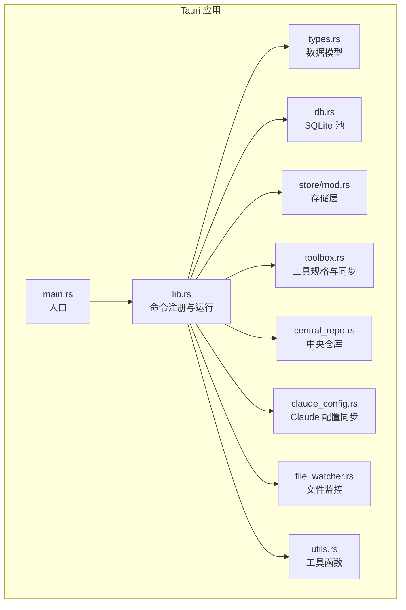
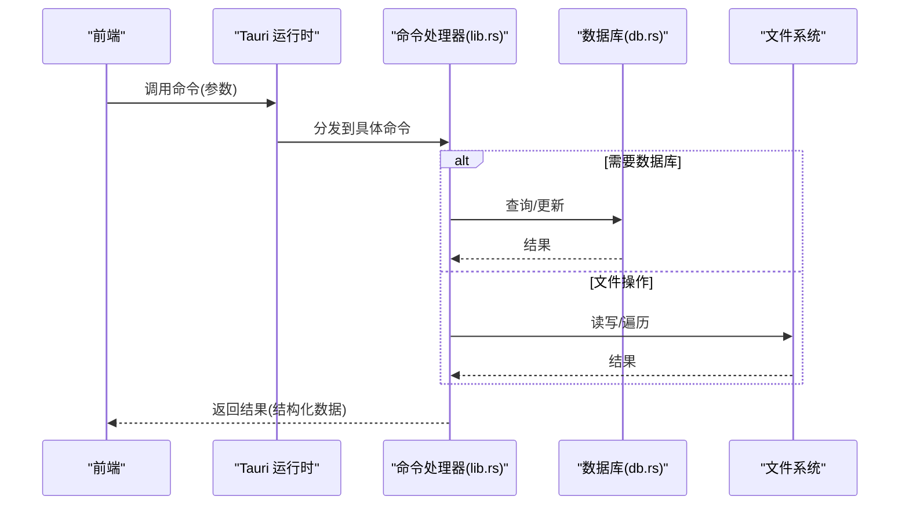
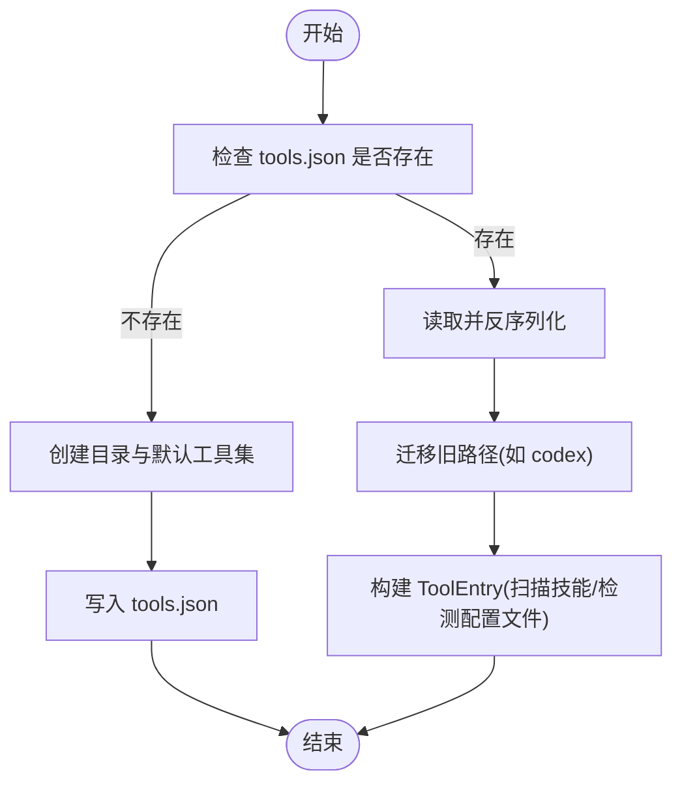
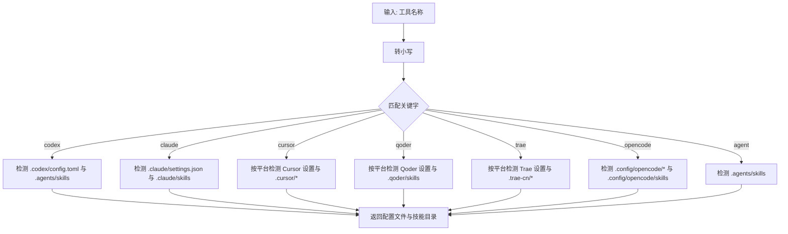
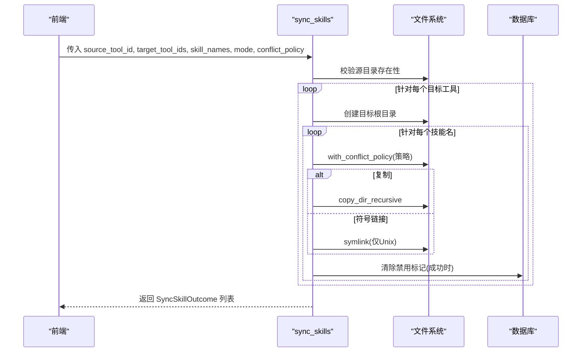
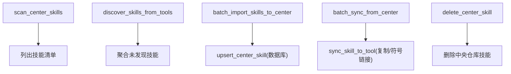
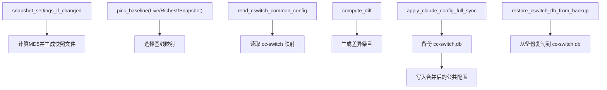
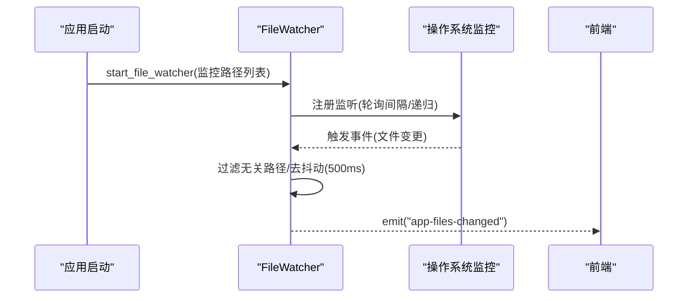
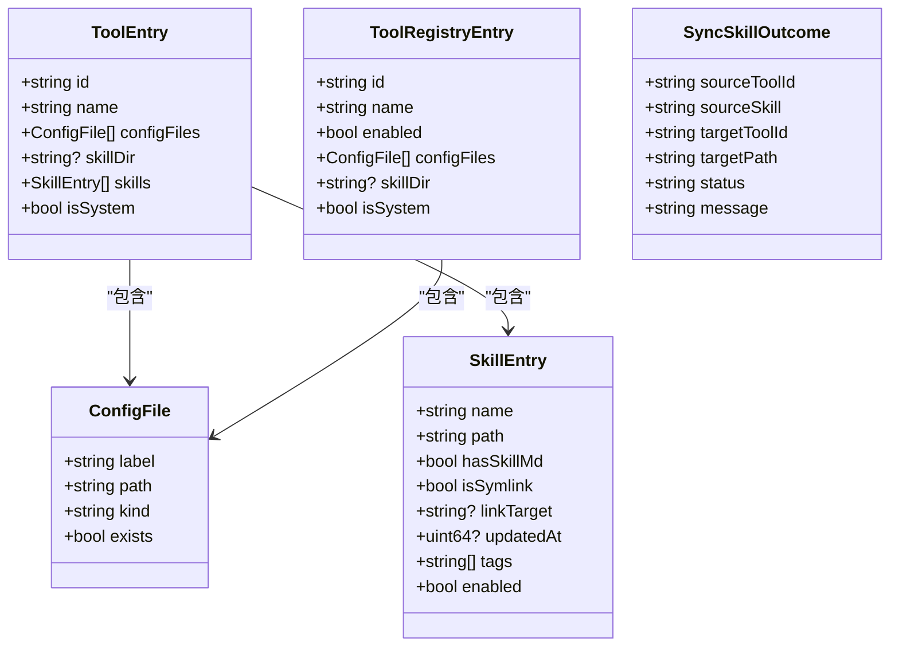
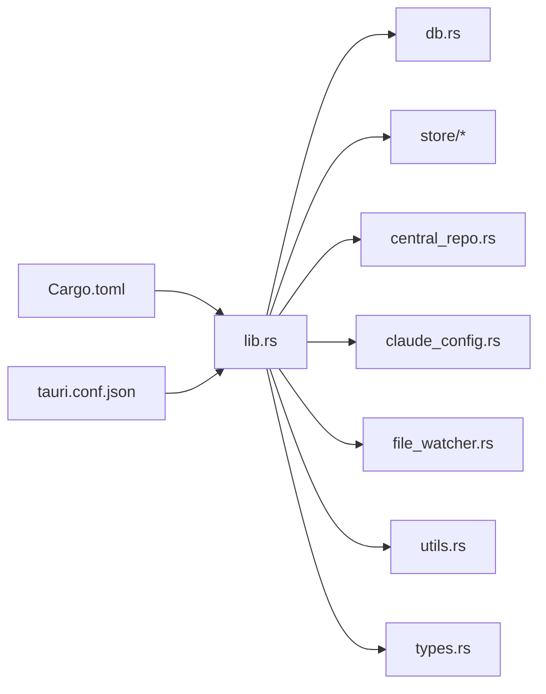

# Rust后端设计

<cite>
**本文档引用的文件**
- [src-tauri/src/main.rs](file://src-tauri/src/main.rs)
- [src-tauri/src/lib.rs](file://src-tauri/src/lib.rs)
- [src-tauri/Cargo.toml](file://src-tauri/Cargo.toml)
- [src-tauri/tauri.conf.json](file://src-tauri/tauri.conf.json)
- [src-tauri/src/types.rs](file://src-tauri/src/types.rs)
- [src-tauri/src/db.rs](file://src-tauri/src/db.rs)
- [src-tauri/src/store/mod.rs](file://src-tauri/src/store/mod.rs)
- [src-tauri/src/toolbox.rs](file://src-tauri/src/toolbox.rs)
- [src-tauri/src/central_repo.rs](file://src-tauri/src/central_repo.rs)
- [src-tauri/src/claude_config.rs](file://src-tauri/src/claude_config.rs)
- [src-tauri/src/file_watcher.rs](file://src-tauri/src/file_watcher.rs)
- [src-tauri/src/utils.rs](file://src-tauri/src/utils.rs)
</cite>

## 目录
1. [简介](#简介)
2. [项目结构](#项目结构)
3. [核心组件](#核心组件)
4. [架构总览](#架构总览)
5. [详细组件分析](#详细组件分析)
6. [依赖关系分析](#依赖关系分析)
7. [性能考虑](#性能考虑)
8. [故障排查指南](#故障排查指南)
9. [结论](#结论)
10. [附录](#附录)

## 简介
本项目是一个基于 Tauri 的桌面应用后端，主要面向 AI 技能工具箱场景，提供工具注册与管理、技能同步与差异分析、配置文件读写与备份、中央仓库管理以及 Claude Code 配置同步等功能。后端以 Rust 实现，通过 Tauri 的 #[tauri::command] 宏暴露命令给前端，实现前后端通信。

## 项目结构
后端位于 src-tauri 目录，采用模块化组织：
- 命令入口与运行时：main.rs、lib.rs
- 类型定义：types.rs
- 数据库与存储：db.rs、store/mod.rs 及其子模块
- 功能模块：toolbox.rs（工具规格与同步）、central_repo.rs（中央仓库）、claude_config.rs（Claude 配置同步）
- 文件监控：file_watcher.rs
- 工具函数：utils.rs
- 构建与配置：Cargo.toml、tauri.conf.json

**图表来源**
- [src-tauri/src/main.rs:1-7](file://src-tauri/src/main.rs#L1-L7)
- [src-tauri/src/lib.rs:1-20](file://src-tauri/src/lib.rs#L1-L20)

**章节来源**
- [src-tauri/src/main.rs:1-7](file://src-tauri/src/main.rs#L1-L7)
- [src-tauri/src/lib.rs:1-20](file://src-tauri/src/lib.rs#L1-L20)

## 核心组件
- 命令系统：通过 #[tauri::command] 宏声明的命令，统一由 lib.rs 中的 invoke_handler 注册，供前端调用。
- 工具注册与扫描：UserToolSpec 与 ToolEntry 描述工具及其配置文件、技能目录与技能项，支持默认工具集与用户自定义工具。
- 技能同步：支持复制与符号链接两种模式，提供冲突策略（跳过/覆盖/重命名），并记录同步结果。
- 中央仓库：集中管理可复用技能，支持从工具导入、Git 安装、批量同步至工具。
- 配置文件管理：读取/保存配置文件，生成备份，列出备份。
- Claude 配置同步：对比 settings.json 与 cc-switch 的公共配置，支持快照、全量同步与备份恢复。
- 文件监控：对技能目录与关键配置文件进行监控，触发去抖动事件通知前端。

**章节来源**
- [src-tauri/src/lib.rs:615-1408](file://src-tauri/src/lib.rs#L615-L1408)
- [src-tauri/src/types.rs:1-367](file://src-tauri/src/types.rs#L1-L367)
- [src-tauri/src/db.rs:1-222](file://src-tauri/src/db.rs#L1-L222)

## 架构总览
后端启动时初始化数据库池与文件监控，随后注册所有命令。前端通过 Tauri 的 invoke 或 IPC 调用命令，后端执行业务逻辑并返回结构化结果。

**图表来源**
- [src-tauri/src/lib.rs:1310-1408](file://src-tauri/src/lib.rs#L1310-L1408)
- [src-tauri/src/db.rs:210-222](file://src-tauri/src/db.rs#L210-L222)

**章节来源**
- [src-tauri/src/lib.rs:1310-1408](file://src-tauri/src/lib.rs#L1310-L1408)

## 详细组件分析

### 工具规格与注册流程
- 默认工具集：根据操作系统生成默认工具规格（包含 id、name、配置文件、技能目录等），并写入用户主目录下的 tools.json。
- 用户自定义：通过 upsert_tool_registry_item 新增或更新工具条目，支持校验与规范化。
- 加载与构建：load_tool_registry 读取并迁移旧版本路径，build_tool_entry_from_user 将 UserToolSpec 转换为 ToolEntry 并扫描技能目录。

**图表来源**
- [src-tauri/src/lib.rs:209-249](file://src-tauri/src/lib.rs#L209-L249)
- [src-tauri/src/lib.rs:255-282](file://src-tauri/src/lib.rs#L255-L282)

**章节来源**
- [src-tauri/src/lib.rs:28-184](file://src-tauri/src/lib.rs#L28-L184)
- [src-tauri/src/lib.rs:209-249](file://src-tauri/src/lib.rs#L209-L249)
- [src-tauri/src/lib.rs:255-282](file://src-tauri/src/lib.rs#L255-L282)

### 路径检测与自动发现
- detect_tool_paths_from_name：根据工具名称关键字匹配，检测配置文件与技能目录是否存在，并返回 DetectToolPathsResult。
- scan_skill_dir：递归扫描技能目录，识别 SKILL.md，计算更新时间，支持符号链接与禁用标记。

**图表来源**
- [src-tauri/src/lib.rs:325-431](file://src-tauri/src/lib.rs#L325-L431)
- [src-tauri/src/lib.rs:450-517](file://src-tauri/src/lib.rs#L450-L517)

**章节来源**
- [src-tauri/src/lib.rs:325-431](file://src-tauri/src/lib.rs#L325-L431)
- [src-tauri/src/lib.rs:450-517](file://src-tauri/src/lib.rs#L450-L517)

### 技能同步与冲突处理
- sync_skills：支持复制与符号链接两种模式，提供 skip/overwrite/rename 冲突策略，记录每项操作结果。
- compare_skill_folders：比较两个技能目录的文件集合，输出新增/修改/删除差异。
- toggle_skill_enabled：通过数据库标记控制技能启用状态，不影响文件系统。

**图表来源**
- [src-tauri/src/lib.rs:933-1037](file://src-tauri/src/lib.rs#L933-L1037)
- [src-tauri/src/lib.rs:591-613](file://src-tauri/src/lib.rs#L591-L613)

**章节来源**
- [src-tauri/src/lib.rs:933-1037](file://src-tauri/src/lib.rs#L933-L1037)
- [src-tauri/src/lib.rs:645-682](file://src-tauri/src/lib.rs#L645-L682)
- [src-tauri/src/lib.rs:1277-1303](file://src-tauri/src/lib.rs#L1277-L1303)

### 中央仓库与技能管理
- 中央仓库目录：~/.ai-toolbox/skills，支持扫描、导入、安装与删除。
- discover_skills_from_tools：扫描各工具技能目录，发现尚未在中央仓库中的技能。
- batch_import_skills_to_center：从工具导入技能到中央仓库，并写入中心技能元数据。
- batch_sync_from_center：将中央仓库技能批量同步到目标工具，支持冲突策略。

**图表来源**
- [src-tauri/src/central_repo.rs:104-149](file://src-tauri/src/central_repo.rs#L104-L149)
- [src-tauri/src/central_repo.rs:155-220](file://src-tauri/src/central_repo.rs#L155-L220)
- [src-tauri/src/central_repo.rs:226-301](file://src-tauri/src/central_repo.rs#L226-L301)
- [src-tauri/src/central_repo.rs:389-444](file://src-tauri/src/central_repo.rs#L389-L444)

**章节来源**
- [src-tauri/src/central_repo.rs:84-98](file://src-tauri/src/central_repo.rs#L84-L98)
- [src-tauri/src/central_repo.rs:104-149](file://src-tauri/src/central_repo.rs#L104-L149)
- [src-tauri/src/central_repo.rs:155-220](file://src-tauri/src/central_repo.rs#L155-L220)
- [src-tauri/src/central_repo.rs:226-301](file://src-tauri/src/central_repo.rs#L226-L301)
- [src-tauri/src/central_repo.rs:389-444](file://src-tauri/src/central_repo.rs#L389-L444)

### Claude 配置同步
- 快照：对 settings.json 进行 MD5 摘要，生成带时间戳与哈希的快照文件，限制最大数量。
- 对比：排除特定字段（如 env/model/apiKeyHelper），对比 settings.json 与 cc-switch 的公共配置。
- 同步：将 settings.json 中非排除字段整体覆盖到 cc-switch 的公共配置，保留 cc-switch 独有字段与排除字段。
- 备份与恢复：备份 cc-switch.db，支持从备份恢复。

**图表来源**
- [src-tauri/src/claude_config.rs:193-225](file://src-tauri/src/claude_config.rs#L193-L225)
- [src-tauri/src/claude_config.rs:227-277](file://src-tauri/src/claude_config.rs#L227-L277)
- [src-tauri/src/claude_config.rs:429-458](file://src-tauri/src/claude_config.rs#L429-L458)
- [src-tauri/src/claude_config.rs:463-495](file://src-tauri/src/claude_config.rs#L463-L495)
- [src-tauri/src/claude_config.rs:497-522](file://src-tauri/src/claude_config.rs#L497-L522)

**章节来源**
- [src-tauri/src/claude_config.rs:193-225](file://src-tauri/src/claude_config.rs#L193-L225)
- [src-tauri/src/claude_config.rs:227-277](file://src-tauri/src/claude_config.rs#L227-L277)
- [src-tauri/src/claude_config.rs:429-458](file://src-tauri/src/claude_config.rs#L429-L458)
- [src-tauri/src/claude_config.rs:463-495](file://src-tauri/src/claude_config.rs#L463-L495)
- [src-tauri/src/claude_config.rs:497-522](file://src-tauri/src/claude_config.rs#L497-L522)

### 文件监控与事件通知
- 启动时根据已启用工具的技能目录与 Claude 关键路径启动监控。
- 过滤无关临时文件，使用 500ms 去抖动，向前端发送 app-files-changed 事件。

**图表来源**
- [src-tauri/src/lib.rs:1322-1371](file://src-tauri/src/lib.rs#L1322-L1371)
- [src-tauri/src/file_watcher.rs:21-96](file://src-tauri/src/file_watcher.rs#L21-L96)

**章节来源**
- [src-tauri/src/lib.rs:1322-1371](file://src-tauri/src/lib.rs#L1322-L1371)
- [src-tauri/src/file_watcher.rs:21-96](file://src-tauri/src/file_watcher.rs#L21-L96)

### 数据模型与类型系统
- 请求/响应类型：ConfigFile、SkillEntry、ToolEntry、ToolRegistryEntry、SkillInsightEntry、SyncSkillOutcome、PresetEntry 等。
- 请求参数：SaveConfigRequest、SyncSkillsRequest、DeleteSkillRequest、UpsertToolRequest、ApplyPresetRequest 等。
- 工具函数：时间戳、路径转换、元数据修改时间、技能描述解析等。

**图表来源**
- [src-tauri/src/types.rs:9-151](file://src-tauri/src/types.rs#L9-L151)

**章节来源**
- [src-tauri/src/types.rs:1-367](file://src-tauri/src/types.rs#L1-L367)

## 依赖关系分析
- 运行时与框架：Tauri 2.x、tauri-plugin-log、notify、dirs、rusqlite、md-5、serde。
- 构建与打包：tauri-build、前端构建产物路径与 dev server 配置。
- 模块耦合：lib.rs 作为统一入口，依赖 db、store、central_repo、claude_config、file_watcher、utils；各模块职责清晰，低耦合高内聚。

**图表来源**
- [src-tauri/Cargo.toml:1-30](file://src-tauri/Cargo.toml#L1-L30)
- [src-tauri/tauri.conf.json:1-43](file://src-tauri/tauri.conf.json#L1-L43)
- [src-tauri/src/lib.rs:1-20](file://src-tauri/src/lib.rs#L1-L20)

**章节来源**
- [src-tauri/Cargo.toml:1-30](file://src-tauri/Cargo.toml#L1-L30)
- [src-tauri/tauri.conf.json:1-43](file://src-tauri/tauri.conf.json#L1-L43)

## 性能考虑
- 文件遍历与复制：大量目录扫描与复制操作建议在后台线程执行，避免阻塞主线程。
- 去抖动：文件监控事件使用 500ms 去抖动，减少频繁刷新。
- SQLite：使用连接池与索引优化查询，避免重复扫描与重建。
- 软链接：仅在 Unix 系统支持，Windows 使用符号链接需管理员权限，注意跨平台差异。
- 备份策略：配置文件备份与 cc-switch 备份采用时间戳命名，避免覆盖风险。

## 故障排查指南
- 命令调用失败：检查命令是否在 invoke_handler 中注册，参数是否符合请求类型定义。
- 数据库未初始化：确认 init_db_pool 成功，且数据库文件可读写。
- 路径不存在：确保工具配置文件与技能目录存在，必要时使用 detect_tool_paths 自动发现。
- 权限问题：符号链接在 Windows 上需要管理员权限；SQLite 写锁可能导致同步失败。
- 文件监控无效：确认监控路径存在且非临时文件，检查过滤规则与去抖动设置。

**章节来源**
- [src-tauri/src/lib.rs:1310-1408](file://src-tauri/src/lib.rs#L1310-L1408)
- [src-tauri/src/db.rs:210-222](file://src-tauri/src/db.rs#L210-L222)
- [src-tauri/src/claude_config.rs:308-330](file://src-tauri/src/claude_config.rs#L308-L330)

## 结论
本后端以模块化设计实现了工具注册、技能同步、中央仓库与 Claude 配置同步等核心能力，通过 Tauri 命令系统与前端解耦，具备良好的扩展性与跨平台能力。建议后续增强错误码标准化、日志分级与可观测性，完善单元测试覆盖关键路径。

## 附录
- 前端调用约定：命令名称与参数结构以 types.rs 中的请求/响应类型为准，返回值为结构化 JSON。
- 开发建议：新增命令时遵循现有模式（参数校验、错误包装、返回结构化结果），并在 lib.rs 的 invoke_handler 中注册。