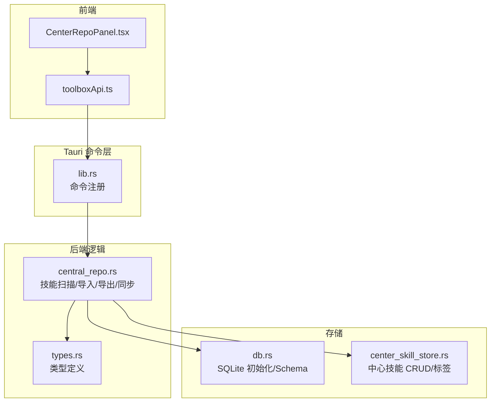
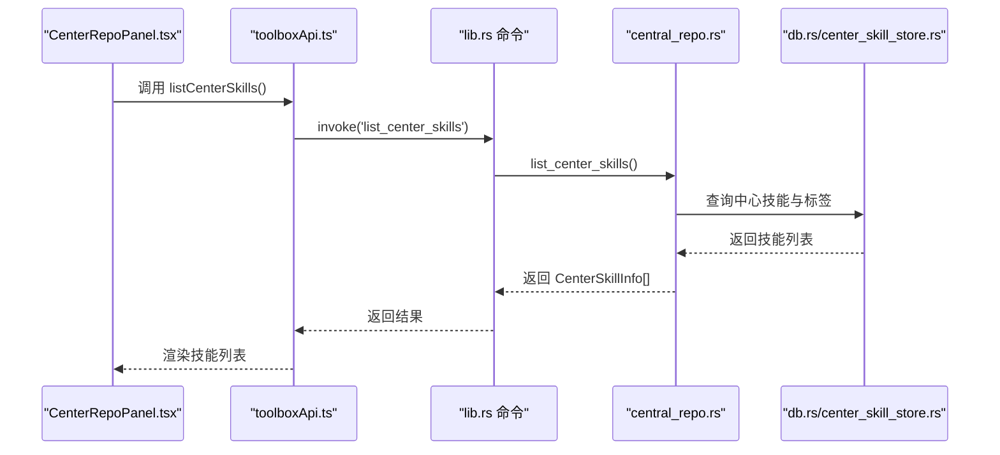
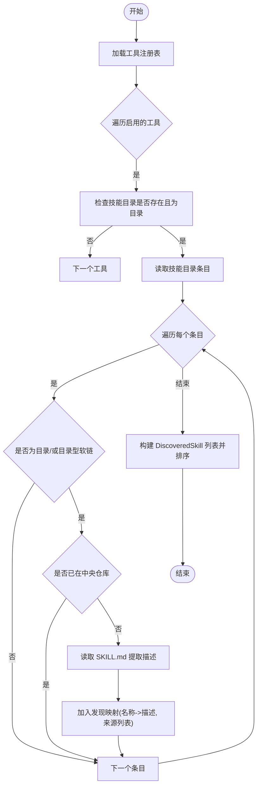
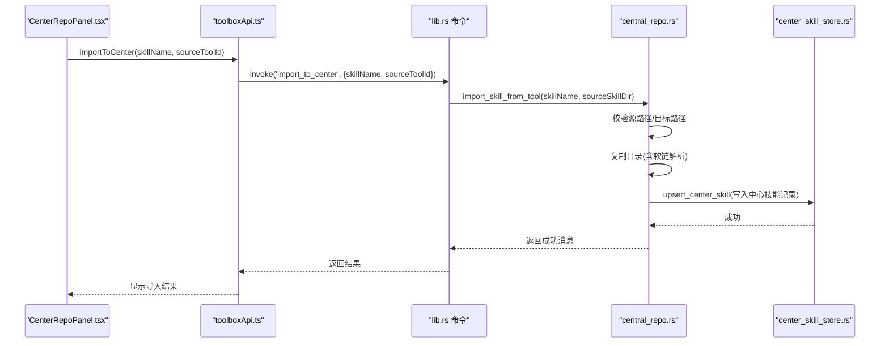
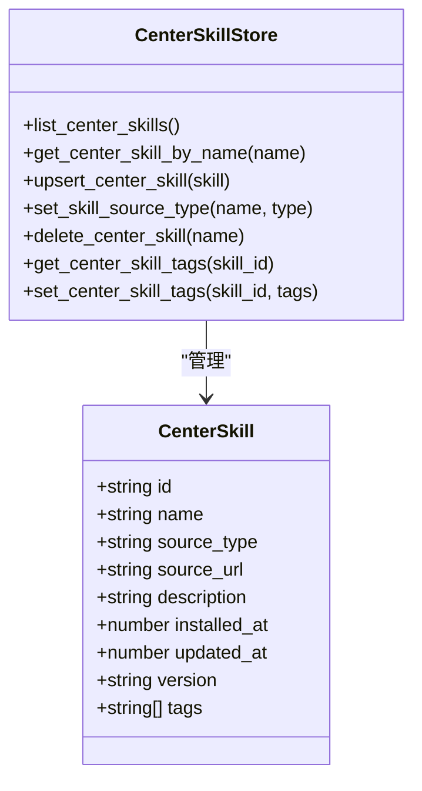
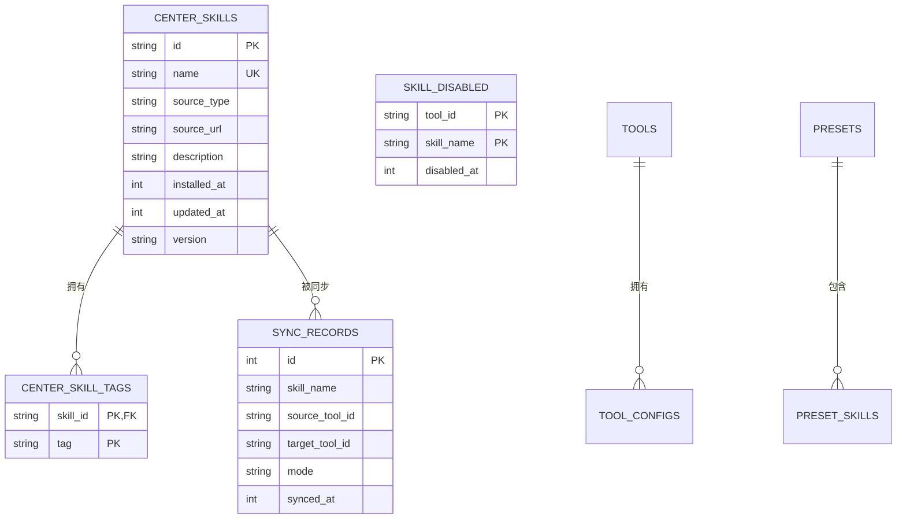
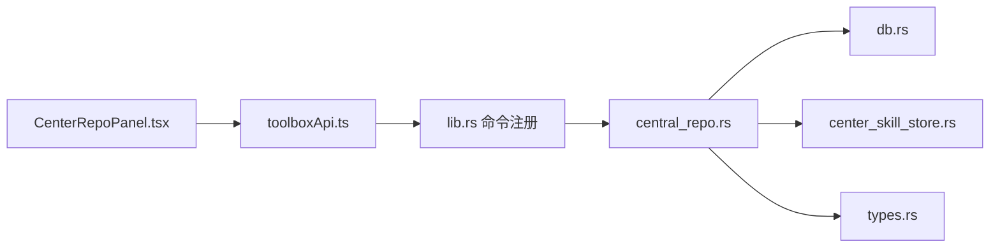

# 中央仓库系统

<cite>
**本文档引用的文件**
- [src/components/CenterRepoPanel.tsx](file://src/components/CenterRepoPanel.tsx)
- [src/lib/toolboxApi.ts](file://src/lib/toolboxApi.ts)
- [src-tauri/src/central_repo.rs](file://src-tauri/src/central_repo.rs)
- [src-tauri/src/store/center_skill_store.rs](file://src-tauri/src/store/center_skill_store.rs)
- [src-tauri/src/types.rs](file://src-tauri/src/types.rs)
- [src-tauri/src/db.rs](file://src-tauri/src/db.rs)
- [src-tauri/src/lib.rs](file://src-tauri/src/lib.rs)
- [src/types/toolbox.ts](file://src/types/toolbox.ts)
</cite>

## 目录
1. [简介](#简介)
2. [项目结构](#项目结构)
3. [核心组件](#核心组件)
4. [架构总览](#架构总览)
5. [详细组件分析](#详细组件分析)
6. [依赖关系分析](#依赖关系分析)
7. [性能考虑](#性能考虑)
8. [故障排除指南](#故障排除指南)
9. [结论](#结论)
10. [附录](#附录)

## 简介
本文件全面介绍中央仓库系统的设计与实现，重点覆盖以下方面：
- 技能发现机制：如何扫描工具中的技能并识别尚未入库的技能
- 技能导入与导出：从工具导入到中央仓库、从中央仓库同步到工具的流程
- 分类管理与搜索：技能来源分类、标签系统与前端搜索过滤
- 数据结构与存储：SQLite 数据模型、中心化技能信息与标签管理
- 使用指南与最佳实践：如何高效管理与利用中央仓库

## 项目结构
中央仓库系统由前端 React 组件、Tauri 命令层、Rust 后端逻辑与 SQLite 存储四部分组成。前端通过 toolboxApi.ts 调用后端命令，后端通过 central_repo.rs 实现技能扫描、导入、导出与同步，并通过 center_skill_store.rs 与数据库交互。

**图表来源**
- [src/components/CenterRepoPanel.tsx](file://src/components/CenterRepoPanel.tsx)
- [src/lib/toolboxApi.ts](file://src/lib/toolboxApi.ts)
- [src-tauri/src/lib.rs](file://src-tauri/src/lib.rs)
- [src-tauri/src/central_repo.rs](file://src-tauri/src/central_repo.rs)
- [src-tauri/src/store/center_skill_store.rs](file://src-tauri/src/store/center_skill_store.rs)
- [src-tauri/src/db.rs](file://src-tauri/src/db.rs)
- [src-tauri/src/types.rs](file://src-tauri/src/types.rs)

**章节来源**
- [src/components/CenterRepoPanel.tsx](file://src/components/CenterRepoPanel.tsx)
- [src/lib/toolboxApi.ts](file://src/lib/toolboxApi.ts)
- [src-tauri/src/lib.rs](file://src-tauri/src/lib.rs)

## 核心组件
- 中央仓库面板（CenterRepoPanel.tsx）：提供技能列表、搜索、分类、批量操作、扫描发现、安装与同步等 UI 功能
- 前端 API（toolboxApi.ts）：封装 Tauri 命令调用，暴露 discoverCenterSkills、batchImportToCenter、setSkillCategory、batchSyncFromCenter、listCenterSkills、deleteCenterSkill、syncFromCenter、importToCenter、installSkillFromGitToCenter 等方法
- 后端逻辑（central_repo.rs）：实现技能扫描、导入、导出、同步、删除、冲突处理、文件复制/软链等
- 数据存储（db.rs、center_skill_store.rs）：SQLite Schema、中心技能表与标签表、CRUD 操作
- 类型定义（types.rs、toolbox.ts）：统一前后端数据结构与枚举

**章节来源**
- [src/components/CenterRepoPanel.tsx](file://src/components/CenterRepoPanel.tsx)
- [src/lib/toolboxApi.ts](file://src/lib/toolboxApi.ts)
- [src-tauri/src/central_repo.rs](file://src-tauri/src/central_repo.rs)
- [src-tauri/src/store/center_skill_store.rs](file://src-tauri/src/store/center_skill_store.rs)
- [src-tauri/src/db.rs](file://src-tauri/src/db.rs)
- [src-tauri/src/types.rs](file://src-tauri/src/types.rs)
- [src/types/toolbox.ts](file://src/types/toolbox.ts)

## 架构总览
中央仓库系统采用“前端 UI + Tauri 命令 + Rust 业务逻辑 + SQLite 存储”的分层架构。前端通过 toolboxApi.ts 发起命令，lib.rs 注册命令，central_repo.rs 执行具体业务，db.rs 与 center_skill_store.rs 负责持久化。

**图表来源**
- [src/components/CenterRepoPanel.tsx](file://src/components/CenterRepoPanel.tsx)
- [src/lib/toolboxApi.ts](file://src/lib/toolboxApi.ts)
- [src-tauri/src/lib.rs](file://src-tauri/src/lib.rs)
- [src-tauri/src/central_repo.rs](file://src-tauri/src/central_repo.rs)
- [src-tauri/src/store/center_skill_store.rs](file://src-tauri/src/store/center_skill_store.rs)
- [src-tauri/src/db.rs](file://src-tauri/src/db.rs)

## 详细组件分析

### 技能发现机制
技能发现负责扫描各工具的技能目录，找出尚未入库的技能，并提取描述信息与来源工具信息，供用户批量导入。

- 关键实现位置：
  - 发现函数：[discover_skills_from_tools](file://src-tauri/src/central_repo.rs)
  - 前端触发：[handleDiscover](file://src/components/CenterRepoPanel.tsx)
  - 前端调用：[discoverCenterSkills](file://src/lib/toolboxApi.ts)

**图表来源**
- [src-tauri/src/central_repo.rs](file://src-tauri/src/central_repo.rs)
- [src/components/CenterRepoPanel.tsx](file://src/components/CenterRepoPanel.tsx)
- [src/lib/toolboxApi.ts](file://src/lib/toolboxApi.ts)

**章节来源**
- [src-tauri/src/central_repo.rs](file://src-tauri/src/central_repo.rs)
- [src/components/CenterRepoPanel.tsx](file://src/components/CenterRepoPanel.tsx)
- [src/lib/toolboxApi.ts](file://src/lib/toolboxApi.ts)

### 技能导入与导出流程
- 从工具导入到中央仓库：校验源技能存在性，删除目标路径（若存在），递归复制
- 从中央仓库导出到工具：根据模式（拷贝/软链）与冲突策略（跳过/覆盖/重命名）执行同步
- 批量导入与批量同步：前端选择多个技能，后端逐项处理并返回结果

- 关键实现位置：
  - 导入函数：[import_skill_from_tool](file://src-tauri/src/central_repo.rs)
  - 导出函数：[sync_skill_to_tool](file://src-tauri/src/central_repo.rs)
  - 批量导入：[batchImportToCenter](file://src/lib/toolboxApi.ts)
  - 批量同步：[batchSyncFromCenter](file://src/lib/toolboxApi.ts)
  - 单个同步：[syncFromCenter](file://src/lib/toolboxApi.ts)

**图表来源**
- [src/components/CenterRepoPanel.tsx](file://src/components/CenterRepoPanel.tsx)
- [src/lib/toolboxApi.ts](file://src/lib/toolboxApi.ts)
- [src-tauri/src/central_repo.rs](file://src-tauri/src/central_repo.rs)
- [src-tauri/src/store/center_skill_store.rs](file://src-tauri/src/store/center_skill_store.rs)

**章节来源**
- [src-tauri/src/central_repo.rs](file://src-tauri/src/central_repo.rs)
- [src/lib/toolboxApi.ts](file://src/lib/toolboxApi.ts)
- [src/components/CenterRepoPanel.tsx](file://src/components/CenterRepoPanel.tsx)

### 技能分类管理与搜索
- 分类管理：支持将技能标记为 custom/git/system 等来源类型；批量设置分类
- 搜索与过滤：关键词（名称/描述）、来源类型（custom/git/all）、同步状态（未同步/部分/全量）
- 标签系统：中心技能表与标签表分离，支持增删改标签

- 关键实现位置：
  - 分类设置：[setSkillCategory](file://src/lib/toolboxApi.ts) -> [set_skill_source_type](file://src-tauri/src/store/center_skill_store.rs)
  - 批量分类：[openBatchCategoryModal/handleBatchSetCategory](file://src/components/CenterRepoPanel.tsx)
  - 列表与详情：[listCenterSkills](file://src/lib/toolboxApi.ts) -> [list_center_skills](file://src-tauri/src/store/center_skill_store.rs)
  - 标签 CRUD：[set_center_skill_tags/get_center_skill_tags](file://src-tauri/src/store/center_skill_store.rs)

**图表来源**
- [src-tauri/src/store/center_skill_store.rs](file://src-tauri/src/store/center_skill_store.rs)
- [src/components/CenterRepoPanel.tsx](file://src/components/CenterRepoPanel.tsx)
- [src/lib/toolboxApi.ts](file://src/lib/toolboxApi.ts)

**章节来源**
- [src-tauri/src/store/center_skill_store.rs](file://src-tauri/src/store/center_skill_store.rs)
- [src/components/CenterRepoPanel.tsx](file://src/components/CenterRepoPanel.tsx)
- [src/lib/toolboxApi.ts](file://src/lib/toolboxApi.ts)

### 中央仓库的数据结构与存储机制
- 数据库 Schema：包含 tools、tool_configs、skill_tags、presets、preset_skills、center_skills、center_skill_tags、sync_records、skill_disabled 等表
- 中心技能实体：包含 id、name、source_type、source_url、description、installed_at、updated_at、version、tags
- 标签管理：中心技能标签表与中心技能表通过外键关联，支持批量更新标签

- 关键实现位置：
  - Schema 定义：[SCHEMA_V1](file://src-tauri/src/db.rs)
  - 中心技能 CRUD：[center_skill_store.rs](file://src-tauri/src/store/center_skill_store.rs)
  - 工具/标签/预设等其他表：同文件

**图表来源**
- [src-tauri/src/db.rs](file://src-tauri/src/db.rs)
- [src-tauri/src/store/center_skill_store.rs](file://src-tauri/src/store/center_skill_store.rs)

**章节来源**
- [src-tauri/src/db.rs](file://src-tauri/src/db.rs)
- [src-tauri/src/store/center_skill_store.rs](file://src-tauri/src/store/center_skill_store.rs)

## 依赖关系分析
- 前端依赖：Ant Design UI 组件、Ant Design Icons、@tauri-apps/api
- 后端依赖：serde、rusqlite、md-5、notify、dirs
- 命令绑定：lib.rs 中通过 #[tauri::command] 注解暴露命令给前端

**图表来源**
- [src/components/CenterRepoPanel.tsx](file://src/components/CenterRepoPanel.tsx)
- [src/lib/toolboxApi.ts](file://src/lib/toolboxApi.ts)
- [src-tauri/src/lib.rs](file://src-tauri/src/lib.rs)
- [src-tauri/src/central_repo.rs](file://src-tauri/src/central_repo.rs)
- [src-tauri/src/db.rs](file://src-tauri/src/db.rs)
- [src-tauri/src/store/center_skill_store.rs](file://src-tauri/src/store/center_skill_store.rs)
- [src-tauri/src/types.rs](file://src-tauri/src/types.rs)

**章节来源**
- [src-tauri/src/lib.rs](file://src-tauri/src/lib.rs)
- [src-tauri/Cargo.toml](file://src-tauri/Cargo.toml)

## 性能考虑
- 目录扫描与文件复制：采用递归遍历与按序处理，避免重复访问；软链解析与去重（基于 canonicalize）防止循环与重复复制
- 数据库事务：upsert_center_skill 使用事务保证一致性，减少多次写入开销
- 前端渲染：列表按名称排序，搜索与过滤在前端进行，避免频繁后端调用
- 冲突策略：跳过/覆盖/重命名三种策略，避免不必要的 IO 操作

[本节为通用指导，无需特定文件引用]

## 故障排除指南
- Git 克隆失败：检查网络与仓库地址，确保目标路径不存在
- 软链模式限制：仅在 Unix 系统支持软链，Windows 会提示不支持
- 目标已存在：根据冲突策略选择 skip/overwrite/rename
- 数据库未初始化：确保首次运行时完成数据库初始化与 Schema 创建
- 技能名称非法：禁止空名、点号、斜杠等非法字符

**章节来源**
- [src-tauri/src/central_repo.rs](file://src-tauri/src/central_repo.rs)
- [src-tauri/src/db.rs](file://src-tauri/src/db.rs)

## 结论
中央仓库系统通过清晰的分层架构与完善的命令接口，实现了技能的发现、导入、导出与分类管理。结合 SQLite 存储与标签系统，用户可以高效地集中管理多工具的技能资产，并通过批量操作提升运维效率。

[本节为总结，无需特定文件引用]

## 附录

### 使用指南与最佳实践
- 使用“扫描发现”功能定期扫描工具中的新技能，避免重复入库
- 对导入的技能及时设置分类（custom/git/system），便于后续筛选与管理
- 使用批量操作进行大规模同步与分类变更，减少重复劳动
- 合理选择同步模式（copy/symlink）与冲突策略（skip/overwrite/rename），平衡性能与一致性
- 定期清理不再使用的技能，保持仓库整洁

[本节为通用指导，无需特定文件引用]