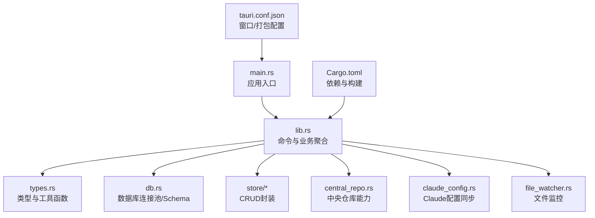
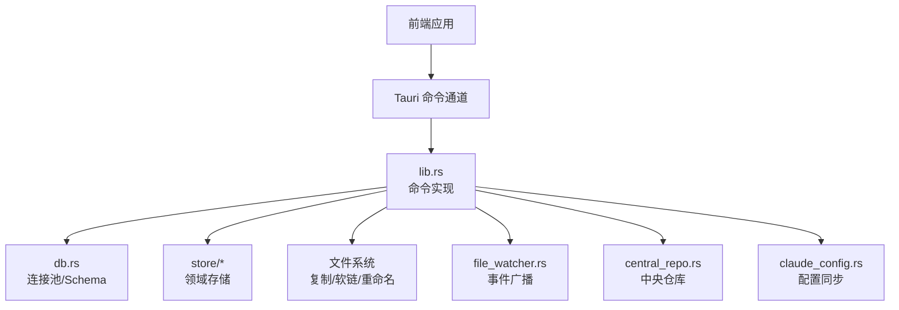
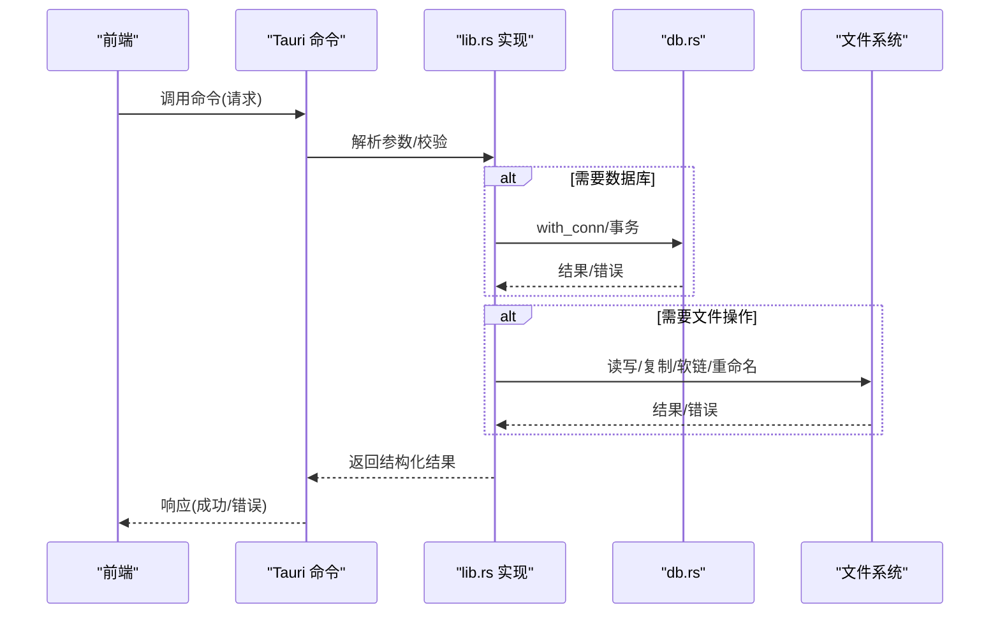
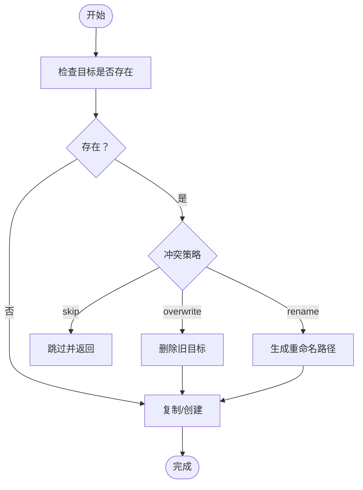
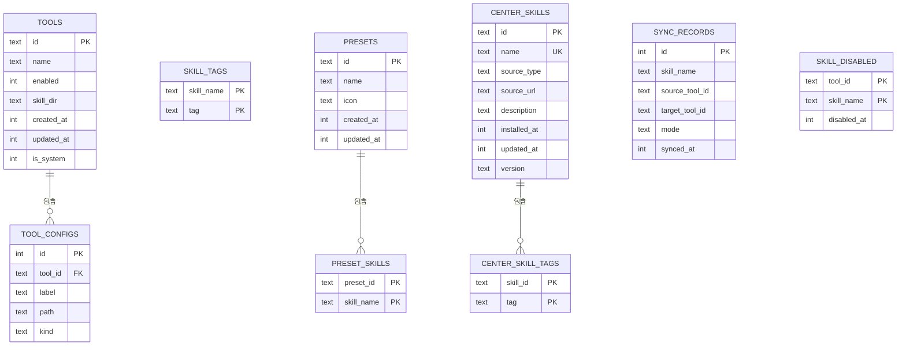
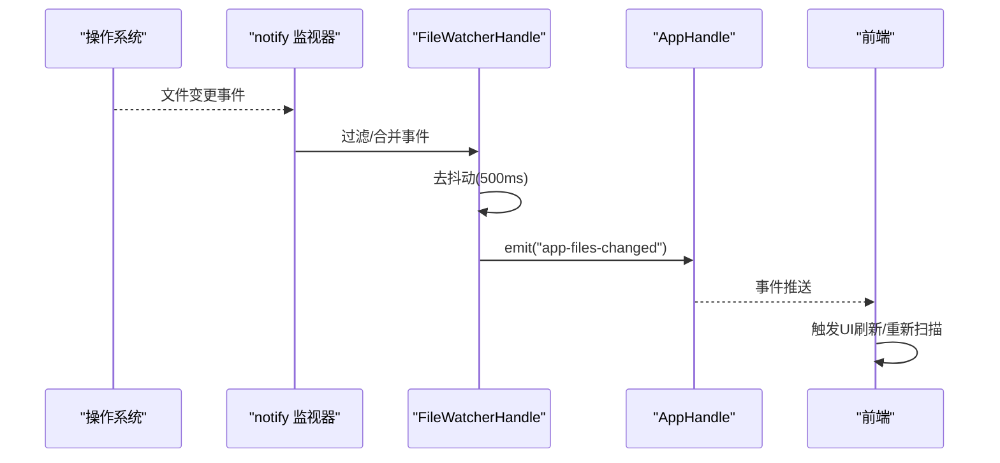
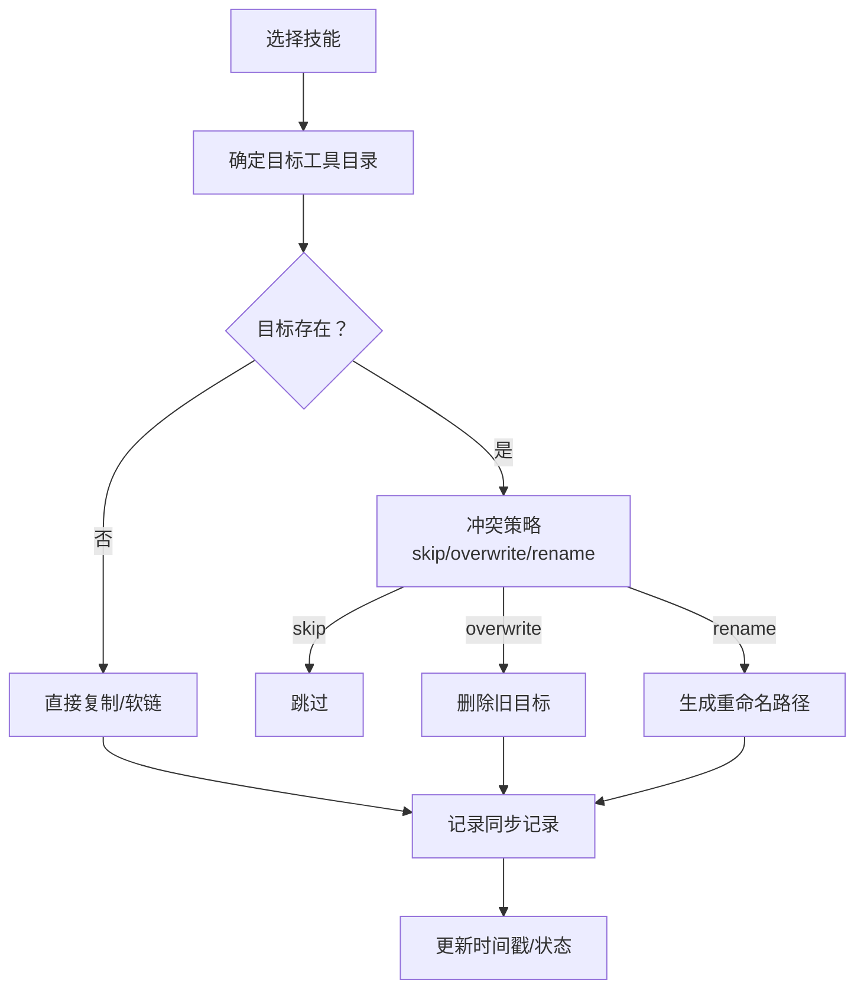
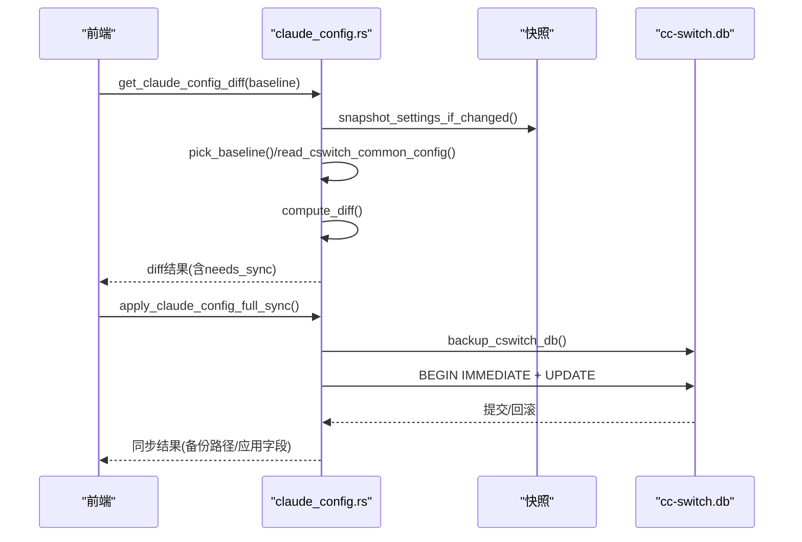
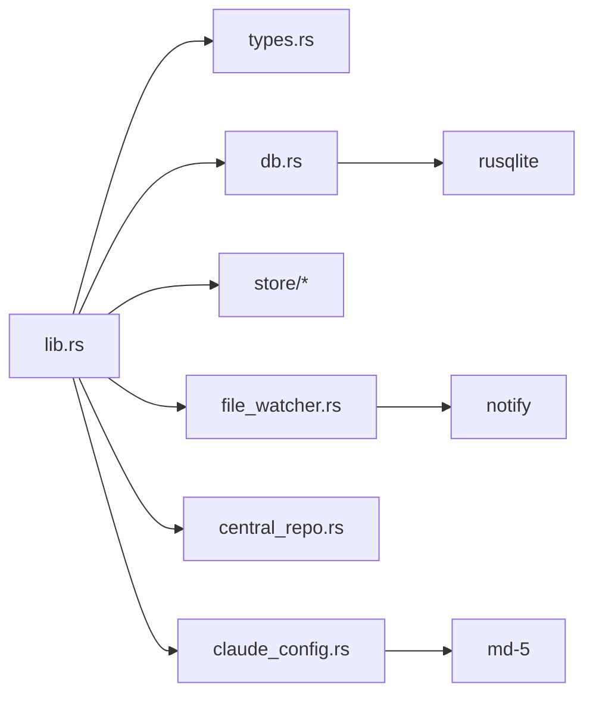

# 后端系统

<cite>
**本文引用的文件**
- [src-tauri/src/main.rs](file://src-tauri/src/main.rs)
- [src-tauri/src/lib.rs](file://src-tauri/src/lib.rs)
- [src-tauri/src/types.rs](file://src-tauri/src/types.rs)
- [src-tauri/src/db.rs](file://src-tauri/src/db.rs)
- [src-tauri/src/file_watcher.rs](file://src-tauri/src/file_watcher.rs)
- [src-tauri/src/central_repo.rs](file://src-tauri/src/central_repo.rs)
- [src-tauri/src/claude_config.rs](file://src-tauri/src/claude_config.rs)
- [src-tauri/src/store/mod.rs](file://src-tauri/src/store/mod.rs)
- [src-tauri/src/store/tool_store.rs](file://src-tauri/src/store/tool_store.rs)
- [src-tauri/src/store/tag_store.rs](file://src-tauri/src/store/tag_store.rs)
- [src-tauri/src/store/preset_store.rs](file://src-tauri/src/store/preset_store.rs)
- [src-tauri/src/store/center_skill_store.rs](file://src-tauri/src/store/center_skill_store.rs)
- [src-tauri/Cargo.toml](file://src-tauri/Cargo.toml)
- [src-tauri/tauri.conf.json](file://src-tauri/tauri.conf.json)
</cite>

## 目录
1. [简介](#简介)
2. [项目结构](#项目结构)
3. [核心组件](#核心组件)
4. [架构总览](#架构总览)
5. [详细组件分析](#详细组件分析)
6. [依赖关系分析](#依赖关系分析)
7. [性能考量](#性能考量)
8. [故障排查指南](#故障排查指南)
9. [结论](#结论)
10. [附录](#附录)

## 简介
本文件面向AI工具箱后端系统，聚焦Rust与Tauri实现，系统性梳理以下方面：
- Tauri命令的实现与调用方式
- 文件系统操作与安全策略
- SQLite数据库设计与查询优化
- 文件监控系统（变更监听、去抖动、事件传播）
- 后端与前端通信协议与数据传输格式
- 扩展开发指南与最佳实践

## 项目结构
后端位于 src-tauri 目录，采用“模块化+分层”组织方式：
- 入口与库导出：main.rs、lib.rs
- 类型定义：types.rs（请求/响应结构、工具函数）
- 数据层：db.rs（连接池、Schema、索引、迁移）
- 存储层：store/*（工具注册表、标签、预设、中心技能）
- 功能模块：central_repo.rs（中央仓库）、claude_config.rs（Claude配置同步）
- 文件监控：file_watcher.rs
- 构建与配置：Cargo.toml、tauri.conf.json

图表来源
- [src-tauri/src/main.rs:1-7](file://src-tauri/src/main.rs#L1-L7)
- [src-tauri/src/lib.rs:1-1300](file://src-tauri/src/lib.rs#L1-L1300)
- [src-tauri/Cargo.toml:1-29](file://src-tauri/Cargo.toml#L1-L29)
- [src-tauri/tauri.conf.json:1-42](file://src-tauri/tauri.conf.json#L1-L42)

章节来源
- [src-tauri/src/main.rs:1-7](file://src-tauri/src/main.rs#L1-L7)
- [src-tauri/src/lib.rs:1-1300](file://src-tauri/src/lib.rs#L1-L1300)
- [src-tauri/Cargo.toml:1-29](file://src-tauri/Cargo.toml#L1-L29)
- [src-tauri/tauri.conf.json:1-42](file://src-tauri/tauri.conf.json#L1-L42)

## 核心组件
- 应用入口与命令导出：通过静态库形式导出 run 函数供Tauri使用，集中注册所有 #[tauri::command]。
- 类型系统：统一的请求/响应结构体，配合 serde 的 camelCase 序列化，确保前后端一致的数据契约。
- 数据库层：单实例连接池、Schema版本化、索引与迁移，提供事务化CRUD。
- 存储层：按领域拆分（工具、标签、预设、中心技能），封装复杂查询与一致性保证。
- 文件系统：安全的复制/软链/重命名/冲突处理，路径规范化与元数据读取。
- 文件监控：基于 notify 的跨平台监控，事件过滤与去抖动，向前端广播变更。
- 中央仓库：技能导入/安装/同步/删除，哈希校验与差异计算。
- Claude配置：快照、基线选择、diff计算、cc-switch数据库备份与写入。

章节来源
- [src-tauri/src/lib.rs:513-800](file://src-tauri/src/lib.rs#L513-L800)
- [src-tauri/src/types.rs:1-367](file://src-tauri/src/types.rs#L1-L367)
- [src-tauri/src/db.rs:1-222](file://src-tauri/src/db.rs#L1-L222)
- [src-tauri/src/store/mod.rs:1-5](file://src-tauri/src/store/mod.rs#L1-L5)

## 架构总览
后端以 lib.rs 为中枢，将命令、类型、数据库、存储、监控等模块整合，通过 Tauri 将 Rust 能力暴露给前端。前端通过命令通道发起请求，后端执行业务逻辑并返回结构化结果。

图表来源
- [src-tauri/src/lib.rs:1-1300](file://src-tauri/src/lib.rs#L1-L1300)
- [src-tauri/src/db.rs:1-222](file://src-tauri/src/db.rs#L1-L222)
- [src-tauri/src/store/mod.rs:1-5](file://src-tauri/src/store/mod.rs#L1-L5)
- [src-tauri/src/file_watcher.rs:1-119](file://src-tauri/src/file_watcher.rs#L1-L119)
- [src-tauri/src/central_repo.rs:1-724](file://src-tauri/src/central_repo.rs#L1-L724)
- [src-tauri/src/claude_config.rs:1-504](file://src-tauri/src/claude_config.rs#L1-L504)

## 详细组件分析

### Tauri 命令与通信协议
- 命令注册：通过 #[tauri::command] 宏将函数暴露为可调用命令，参数与返回值均经由 serde 序列化/反序列化。
- 数据契约：请求/响应结构体统一使用 camelCase 字段名，便于与前端TS类型对齐。
- 错误处理：统一返回 Result<T, String>，错误字符串作为异常信息传递至前端。
- 典型命令：
  - 工具与配置：list_tools、list_tool_registry、upsert_tool_registry_item、delete_tool_registry_item、detect_tool_paths、read_config_file、save_config_file、list_config_backups
  - 技能洞察：get_skill_insights
  - 中央仓库：install_skill_from_git、import_skill_from_local、sync_skill_to_tool、check_sync_status、delete_center_skill、batch_import_skills_to_center
  - Claude配置：get_claude_config_diff、apply_claude_config_full_sync、restore_cswitch_db_from_backup
  - 文件监控：start_file_watcher、update_watch_paths、get_watched_paths（通过事件广播 app-files-changed）

图表来源
- [src-tauri/src/lib.rs:513-800](file://src-tauri/src/lib.rs#L513-L800)
- [src-tauri/src/types.rs:172-257](file://src-tauri/src/types.rs#L172-L257)
- [src-tauri/src/db.rs:50-57](file://src-tauri/src/db.rs#L50-L57)

章节来源
- [src-tauri/src/lib.rs:513-800](file://src-tauri/src/lib.rs#L513-L800)
- [src-tauri/src/types.rs:172-257](file://src-tauri/src/types.rs#L172-L257)

### 文件系统操作与安全策略
- 路径与冲突处理：
  - ensure_parent_dir：确保父目录存在
  - with_conflict_policy：支持 skip/overwrite/rename 三种策略
  - remove_existing_path：统一删除文件/目录/符号链接
- 目录递归复制：
  - copy_dir_recursive：遍历并复制，处理符号链接与目录
  - copy_file：原子写入目标路径
- 软链接与重命名：
  - create_symlink：Unix 平台创建软链接
  - build_renamed_path：带时间戳的重命名策略
- 元数据与时间戳：
  - metadata_mtime：提取修改时间
  - path_to_string：路径字符串化

图表来源
- [src-tauri/src/lib.rs:489-511](file://src-tauri/src/lib.rs#L489-L511)
- [src-tauri/src/lib.rs:424-474](file://src-tauri/src/lib.rs#L424-L474)
- [src-tauri/src/central_repo.rs:601-656](file://src-tauri/src/central_repo.rs#L601-L656)

章节来源
- [src-tauri/src/lib.rs:417-511](file://src-tauri/src/lib.rs#L417-L511)
- [src-tauri/src/central_repo.rs:526-656](file://src-tauri/src/central_repo.rs#L526-L656)

### SQLite 数据库设计与查询优化
- 设计概览：
  - 工具注册表：tools（主键id，启用状态，技能目录，时间戳）
  - 工具配置：tool_configs（外键关联tools）
  - 技能标签：skill_tags（联合主键：skill_name+tag）
  - 预设：presets
  - 预设技能：preset_skills（联合主键：preset_id+skill_name）
  - 中央仓库技能：center_skills
  - 中央仓库标签：center_skill_tags（联合主键：skill_id+tag）
  - 同步记录：sync_records
  - 技能禁用：skill_disabled（联合主键：tool_id+skill_name）
- 索引：
  - idx_tool_configs_tool_id、idx_skill_tags_skill、idx_preset_skills_preset、idx_center_skill_tags_skill、idx_sync_records_skill
- 查询优化要点：
  - 使用事务批量写入（工具/预设/中心技能）
  - 外键约束与级联删除保证数据一致性
  - 通过索引加速常用查询（标签、预设技能、同步记录）
  - 迁移时检测列是否存在，避免重复添加
- 关键接口：
  - is_skill_disabled、list_disabled_skills、disable_skill、enable_skill
  - 事务化 CRUD（工具、标签、预设、中心技能）

图表来源
- [src-tauri/src/db.rs:59-147](file://src-tauri/src/db.rs#L59-L147)

章节来源
- [src-tauri/src/db.rs:1-222](file://src-tauri/src/db.rs#L1-L222)
- [src-tauri/src/store/tool_store.rs:85-124](file://src-tauri/src/store/tool_store.rs#L85-L124)
- [src-tauri/src/store/preset_store.rs:57-127](file://src-tauri/src/store/preset_store.rs#L57-L127)
- [src-tauri/src/store/center_skill_store.rs:129-196](file://src-tauri/src/store/center_skill_store.rs#L129-L196)

### 文件监控系统：变更监听与实时更新
- 监控实现：
  - 使用 notify::RecommendedWatcher 创建 watcher
  - 事件过滤：排除临时文件、交换文件、备份文件及常见忽略目录
  - 去抖动：事件触发后延时500ms再广播，降低频繁刷新
  - 轮询配置：轮询间隔3秒，可选内容比较
- 路径管理：
  - start_file_watcher：注册多个监控路径
  - update_watch_paths：动态更新监控集合
  - get_watched_paths：查询当前监控路径
- 事件传播：
  - 通过 AppHandle 发射 app-files-changed 事件，前端订阅并刷新UI

图表来源
- [src-tauri/src/file_watcher.rs:21-96](file://src-tauri/src/file_watcher.rs#L21-L96)

章节来源
- [src-tauri/src/file_watcher.rs:1-119](file://src-tauri/src/file_watcher.rs#L1-L119)

### 中央仓库与技能同步
- 能力范围：
  - 扫描本地中央仓库、发现工具中的未收录技能
  - 从Git/本地导入技能到中央仓库
  - 将中央仓库技能同步到工具目录（拷贝/软链），支持冲突策略
  - 检查同步状态、删除技能、批量导入
- 差异与校验：
  - 比较文件列表与大小，识别新增/修改/删除
  - 可选MD5哈希（在中央仓库模块内提供），用于更细粒度差异
- 事务与一致性：
  - 批量导入/更新使用事务，失败回滚
  - 外键约束保证标签与技能的关联完整性

图表来源
- [src-tauri/src/central_repo.rs:387-442](file://src-tauri/src/central_repo.rs#L387-L442)
- [src-tauri/src/central_repo.rs:224-299](file://src-tauri/src/central_repo.rs#L224-L299)

章节来源
- [src-tauri/src/central_repo.rs:102-147](file://src-tauri/src/central_repo.rs#L102-L147)
- [src-tauri/src/central_repo.rs:305-346](file://src-tauri/src/central_repo.rs#L305-L346)
- [src-tauri/src/central_repo.rs:477-506](file://src-tauri/src/central_repo.rs#L477-L506)

### Claude 配置同步
- 快照管理：对 settings.json 变化进行MD5快照，限制最大数量并清理旧快照
- 基线选择：Live/Richest/Snapshot(ts) 三种基线，Richest优先字段数最多且最新
- Diff计算：排除敏感字段（env/model/apiKeyHelper），比较settings.json与cc-switch公共配置
- 同步策略：整段同步，保留cc-switch独有字段与排除字段原值，其余以基线为准覆盖
- 安全写入：备份cc-switch.db，获取写锁后提交，失败回滚

图表来源
- [src-tauri/src/claude_config.rs:411-476](file://src-tauri/src/claude_config.rs#L411-L476)
- [src-tauri/src/claude_config.rs:137-211](file://src-tauri/src/claude_config.rs#L137-L211)

章节来源
- [src-tauri/src/claude_config.rs:1-504](file://src-tauri/src/claude_config.rs#L1-L504)

### 存储层：工具/标签/预设/中心技能
- 工具注册表：加载/保存/更新工具及其配置文件，支持系统工具保护
- 标签：技能标签的增删改，自动去空格与去重
- 预设：预设的增删改查，技能列表与预设的多对多关联
- 中心技能：技能的CRUD与标签管理，支持设置来源类型

章节来源
- [src-tauri/src/store/tool_store.rs:10-198](file://src-tauri/src/store/tool_store.rs#L10-L198)
- [src-tauri/src/store/tag_store.rs:8-78](file://src-tauri/src/store/tag_store.rs#L8-L78)
- [src-tauri/src/store/preset_store.rs:9-181](file://src-tauri/src/store/preset_store.rs#L9-L181)
- [src-tauri/src/store/center_skill_store.rs:25-271](file://src-tauri/src/store/center_skill_store.rs#L25-L271)

## 依赖关系分析
- Rust生态：tauri、tauri-plugin-log、rusqlite、md-5、notify
- 构建：tauri-build、静态库导出 app_lib
- 前后端通信：命令通道 + JSON 序列化

图表来源
- [src-tauri/src/lib.rs:1-1300](file://src-tauri/src/lib.rs#L1-L1300)
- [src-tauri/Cargo.toml:20-29](file://src-tauri/Cargo.toml#L20-L29)

章节来源
- [src-tauri/Cargo.toml:1-29](file://src-tauri/Cargo.toml#L1-L29)

## 性能考量
- 数据库
  - 使用连接池与一次性初始化，避免频繁打开/关闭连接
  - 事务化批量写入，减少磁盘IO与WAL压力
  - 合理索引覆盖高频查询（标签、预设技能、同步记录）
- 文件系统
  - 递归复制时按序遍历，避免重复访问
  - 去抖动减少UI刷新频率，降低I/O与渲染压力
- 监控
  - 轮询间隔与内容比较可按需调整，平衡延迟与CPU占用
- 序列化
  - camelCase统一字段名，减少前后端映射成本

## 故障排查指南
- 数据库未初始化
  - 现象：get_db() 返回“数据库未初始化”
  - 排查：确认 init_db_pool 是否在应用启动时调用
- Schema迁移失败
  - 现象：列已存在导致添加失败
  - 排查：检查 migrate_add_is_system 的存在性判断
- 文件操作异常
  - 现象：复制/软链/重命名失败
  - 排查：检查路径权限、目标存在性与冲突策略
- 监控无事件
  - 现象：文件变更不触发UI刷新
  - 排查：确认过滤规则是否误伤、去抖动是否过长、轮询间隔是否合理
- Claude配置同步失败
  - 现象：cc-switch写锁、备份失败、字段未更新
  - 排查：检查数据库只读/写锁、URI模式、busy_timeout、备份目录权限

章节来源
- [src-tauri/src/db.rs:212-222](file://src-tauri/src/db.rs#L212-L222)
- [src-tauri/src/lib.rs:489-511](file://src-tauri/src/lib.rs#L489-L511)
- [src-tauri/src/file_watcher.rs:42-68](file://src-tauri/src/file_watcher.rs#L42-L68)
- [src-tauri/src/claude_config.rs:292-364](file://src-tauri/src/claude_config.rs#L292-L364)

## 结论
本后端系统以模块化与分层设计为核心，结合Tauri命令通道、SQLite事务化存储、notify文件监控与Claude配置同步能力，形成完整的工具箱后端支撑。通过统一的类型系统与错误处理机制，确保前后端交互的一致性与可靠性。建议在扩展新功能时遵循现有模式：命令封装、事务化存储、索引优化与事件驱动刷新。

## 附录
- 开发环境
  - Rust 版本：1.77.2
  - Tauri 版本：2.x
  - SQLite：rusqlite（内置/备份特性）
- 前端集成
  - 通过 Tauri 命令通道调用后端能力，返回结构化数据
  - 文件监控事件通过 app-files-changed 推送，前端订阅刷新