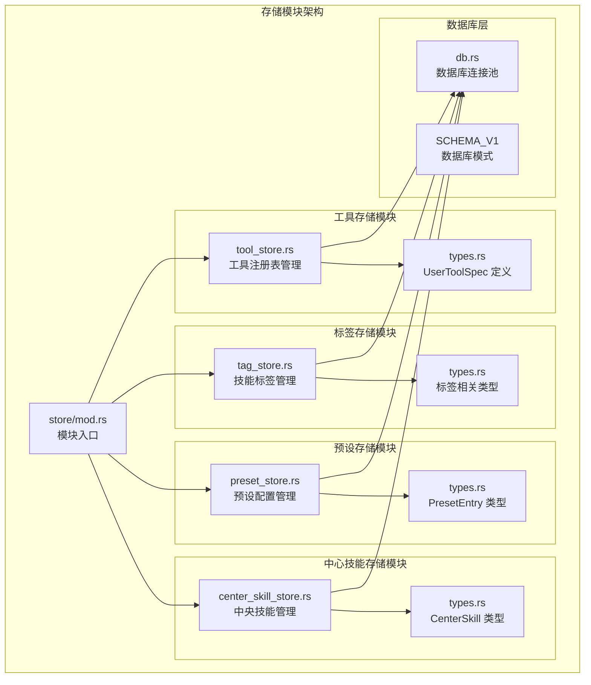
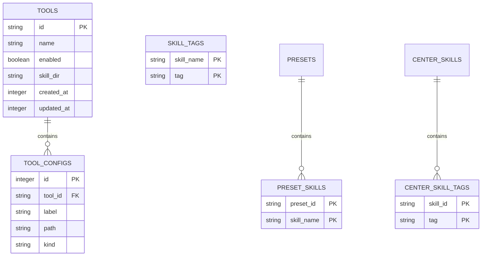
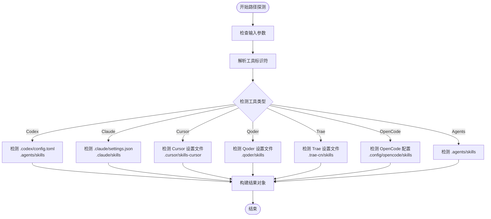
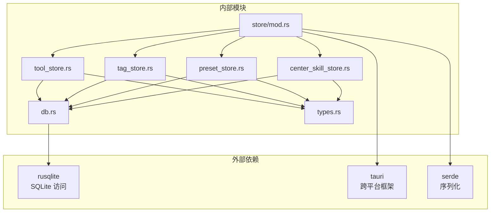

# 存储模块

<cite>
**本文档引用的文件**
- [tool_store.rs](file://src-tauri/src/store/tool_store.rs)
- [tag_store.rs](file://src-tauri/src/store/tag_store.rs)
- [preset_store.rs](file://src-tauri/src/store/preset_store.rs)
- [center_skill_store.rs](file://src-tauri/src/store/center_skill_store.rs)
- [mod.rs](file://src-tauri/src/store/mod.rs)
- [types.rs](file://src-tauri/src/types.rs)
- [db.rs](file://src-tauri/src/db.rs)
- [toolbox.ts](file://src/types/toolbox.ts)
- [useToolboxStore.ts](file://src/store/useToolboxStore.ts)
- [toolboxApi.ts](file://src/lib/toolboxApi.ts)
- [lib.rs](file://src-tauri/src/lib.rs)
- [toolbox.rs](file://src-tauri/src/toolbox.rs)
</cite>

## 目录
1. [简介](#简介)
2. [项目结构](#项目结构)
3. [核心组件](#核心组件)
4. [架构概览](#架构概览)
5. [详细组件分析](#详细组件分析)
6. [依赖分析](#依赖分析)
7. [性能考虑](#性能考虑)
8. [故障排除指南](#故障排除指南)
9. [结论](#结论)
10. [附录](#附录)

## 简介

存储模块是 AI Toolbox 应用程序的核心数据管理层，负责管理工具配置、技能标签、预设配置和中央技能仓库等关键数据。该模块采用 Rust 编写，基于 SQLite 数据库提供可靠的数据持久化能力，同时通过 Tauri 框架与前端 React 应用进行数据交互。

存储模块的主要职责包括：
- 工具注册表的完整生命周期管理
- 技能标签系统的维护和查询
- 用户预设配置的存储和应用
- 中央技能仓库的数据同步和管理
- 数据一致性保证和事务处理
- 跨平台兼容性和路径解析

## 项目结构

存储模块位于 Rust 后端代码结构中，采用模块化设计，每个存储模块负责特定领域的数据管理：



**图表来源**
- [mod.rs:1-5](file://src-tauri/src/store/mod.rs#L1-L5)
- [db.rs:59-147](file://src-tauri/src/db.rs#L59-L147)

**章节来源**
- [mod.rs:1-5](file://src-tauri/src/store/mod.rs#L1-L5)
- [db.rs:59-147](file://src-tauri/src/db.rs#L59-L147)

## 核心组件

存储模块包含四个主要的存储组件，每个组件都有明确的职责边界和数据模型：

### 工具存储模块 (tool_store)
负责管理用户工具的注册表，包括工具配置文件、技能目录和工具状态信息。

### 标签存储模块 (tag_store)
提供技能标签的 CRUD 操作，支持标签的查询、设置和管理。

### 预设存储模块 (preset_store)
管理用户预设配置，支持预设的创建、更新、删除和应用。

### 中心技能存储模块 (center_skill_store)
维护中央技能仓库的数据，支持技能的发现、导入和同步。

**章节来源**
- [tool_store.rs:11-86](file://src-tauri/src/store/tool_store.rs#L11-L86)
- [tag_store.rs:8-28](file://src-tauri/src/store/tag_store.rs#L8-L28)
- [preset_store.rs:9-55](file://src-tauri/src/store/preset_store.rs#L9-L55)
- [center_skill_store.rs:25-79](file://src-tauri/src/store/center_skill_store.rs#L25-L79)

## 架构概览

存储模块采用分层架构设计，确保数据访问的一致性和可靠性：

```mermaid
graph TB
subgraph "前端层"
Frontend[React 前端]
ZustandStore[useToolboxStore.ts<br/>状态管理]
API[toolboxApi.ts<br/>API 调用]
end
subgraph "后端层"
Tauri[Tauri 框架]
Commands[命令处理器<br/>lib.rs]
StoreModules[存储模块<br/>tool_store.rs<br/>tag_store.rs<br/>preset_store.rs<br/>center_skill_store.rs]
end
subgraph "数据层"
SQLite[SQLite 数据库]
DBPool[DbPool 连接池]
Schema[数据库模式]
end
Frontend --> ZustandStore
ZustandStore --> API
API --> Tauri
Tauri --> Commands
Commands --> StoreModules
StoreModules --> DBPool
DBPool --> SQLite
SQLite --> Schema
```



**图表来源**
- [toolboxApi.ts:387-396](file://src/lib/toolboxApi.ts#L387-L396)
- [lib.rs:615-628](file://src-tauri/src/lib.rs#L615-L628)
- [db.rs:5-57](file://src-tauri/src/db.rs#L5-L57)

## 详细组件分析

### 工具存储模块 (tool_store)

工具存储模块是存储系统中最复杂的组件，负责管理用户工具的完整生命周期。

#### 数据模型和关系



**图表来源**
- [db.rs:61-122](file://src-tauri/src/db.rs#L61-L122)

#### 核心功能实现

工具存储模块提供了完整的 CRUD 操作：

1. **加载工具注册表** (`load_tool_registry`)
   - 查询所有工具信息
   - 关联加载每个工具的配置文件
   - 执行数据迁移兼容性检查
   - 过滤无效数据

2. **保存工具注册表** (`save_tool_registry`)
   - 使用事务确保数据一致性
   - 清空现有数据后重新插入
   - 支持批量操作优化

3. **工具增删改** (`upsert_tool`, `delete_tool`)
   - 支持工具的创建、更新和删除
   - 系统工具保护机制
   - 自动配置文件关联

4. **工具路径探测** (`detect_tool_paths`)
   - 跨平台路径检测
   - 配置文件存在性验证
   - 技能目录自动识别

**章节来源**
- [tool_store.rs:11-127](file://src-tauri/src/store/tool_store.rs#L11-L127)
- [tool_store.rs:274-380](file://src-tauri/src/store/tool_store.rs#L274-L380)

#### 工具路径探测流程



**图表来源**
- [tool_store.rs:274-380](file://src-tauri/src/store/tool_store.rs#L274-L380)

### 标签存储模块 (tag_store)

标签存储模块提供简洁而高效的标签管理系统。

#### 核心功能

1. **获取所有标签** (`get_all_tags`)
   - 查询数据库中的所有唯一标签
   - 返回排序后的标签列表

2. **获取技能标签** (`get_skill_tags`)
   - 查询指定技能的所有标签
   - 支持标签过滤和排序

3. **设置技能标签** (`set_skill_tags`)
   - 删除现有标签关联
   - 插入新的标签集合
   - 自动去除空白标签

**章节来源**
- [tag_store.rs:8-78](file://src-tauri/src/store/tag_store.rs#L8-L78)

### 预设存储模块 (preset_store)

预设存储模块管理用户自定义的技能预设配置。

#### 数据模型

预设系统包含两个主要表：
- `presets`: 存储预设基本信息（ID、名称、图标）
- `preset_skills`: 存储预设与技能的多对多关系

#### 核心功能

1. **列出预设** (`list_presets`)
   - 查询所有预设及其关联技能
   - 支持预设的完整加载

2. **创建/更新预设** (`upsert_preset`)
   - 自动生成唯一预设 ID
   - 管理预设与技能的关联关系
   - 支持预设的更新操作

3. **删除预设** (`delete_preset`)
   - 验证预设存在性
   - 提供清晰的错误反馈

4. **按 ID 查询** (`get_preset_by_id`)
   - 支持预设的精确查询
   - 返回完整的预设信息

**章节来源**
- [preset_store.rs:9-181](file://src-tauri/src/store/preset_store.rs#L9-L181)

### 中心技能存储模块 (center_skill_store)

中心技能存储模块管理中央技能仓库的数据，支持技能的发现、导入和同步。

#### 数据模型

中心技能系统包含以下表结构：
- `center_skills`: 技能基本信息（ID、名称、来源类型、描述等）
- `center_skill_tags`: 技能与标签的关联表

#### 核心功能

1. **列出中心技能** (`list_center_skills`)
   - 查询所有中心技能
   - 关联加载技能标签
   - 支持技能的完整信息加载

2. **技能 CRUD 操作**
   - 创建/更新技能信息
   - 删除技能及其关联标签
   - 支持技能来源类型的管理

3. **标签管理** (`set_center_skill_tags`)
   - 删除旧标签关联
   - 插入新的标签集合
   - 维护标签的唯一性

**章节来源**
- [center_skill_store.rs:25-271](file://src-tauri/src/store/center_skill_store.rs#L25-L271)

## 依赖分析

存储模块之间的依赖关系体现了清晰的分层架构：



**图表来源**
- [mod.rs:1-5](file://src-tauri/src/store/mod.rs#L1-L5)
- [db.rs:1-7](file://src-tauri/src/db.rs#L1-L7)

### 数据库设计特点

存储模块采用关系型数据库设计，具有以下特点：

1. **外键约束**确保数据完整性
2. **索引优化**提升查询性能
3. **事务支持**保证操作原子性
4. **模式迁移**支持数据库演进

**章节来源**
- [db.rs:59-147](file://src-tauri/src/db.rs#L59-L147)

## 性能考虑

存储模块在设计时充分考虑了性能优化：

### 数据库优化策略

1. **连接池管理**
   - 单例模式的数据库连接池
   - 线程安全的连接复用
   - 自动连接状态管理

2. **查询优化**
   - 合理的索引设计
   - 预编译语句减少解析开销
   - 批量操作提升吞吐量

3. **内存管理**
   - 按需加载数据
   - 及时释放数据库连接
   - 避免内存泄漏

### 前端集成优化

1. **状态缓存**
   - Zustand 状态管理减少重复请求
   - 智能的数据更新策略
   - 错误状态的快速恢复

2. **API 调用优化**
   - 批量操作支持
   - 并发请求管理
   - 响应时间监控

## 故障排除指南

### 常见问题及解决方案

#### 数据库连接问题
- **症状**: 数据库操作失败，提示连接错误
- **原因**: 数据库文件损坏或权限不足
- **解决**: 检查数据库文件权限，重建数据库连接池

#### 数据一致性问题
- **症状**: 数据库操作后状态不一致
- **原因**: 事务未正确提交或回滚
- **解决**: 确保所有数据库操作都在事务中执行

#### 路径解析问题
- **症状**: 工具路径检测失败
- **原因**: 跨平台路径差异或权限问题
- **解决**: 使用统一的路径解析函数，检查文件系统权限

**章节来源**
- [db.rs:212-222](file://src-tauri/src/db.rs#L212-L222)
- [lib.rs:188-195](file://src-tauri/src/lib.rs#L188-L195)

## 结论

存储模块通过精心设计的架构和实现，为 AI Toolbox 应用提供了可靠、高效的数据管理能力。模块化的设计理念使得每个存储组件职责明确，易于维护和扩展。数据库层的事务支持和索引优化确保了数据操作的性能和一致性。

该模块的成功实施为整个应用程序奠定了坚实的数据基础，支持了从工具配置管理到技能同步的完整功能需求。

## 附录

### API 使用示例

#### 工具管理 API
```typescript
// 获取工具列表
const tools = await listTools()

// 保存工具配置
await upsertToolRegistryItem({
  id: 'codex',
  name: 'Codex',
  enabled: true,
  configFiles: [
    { label: 'config.toml', path: '~/.codex/config.toml', kind: 'toml' }
  ],
  skillDir: '~/.agents/skills'
})

// 删除工具
await deleteToolRegistryItem('codex')
```

#### 预设管理 API
```typescript
// 创建预设
await savePreset('开发环境', ['frontend-design', 'backend-api'])

// 应用预设
await applyPreset('preset-123', ['codex', 'claude'])

// 删除预设
await deletePreset('preset-123')
```

#### 中心技能 API
```typescript
// 发现中心技能
const skills = await discoverCenterSkills()

// 导入技能到中心仓库
await batchImportToCenter([
  { skillName: 'frontend-design', sourceToolId: 'codex' }
])

// 同步技能
await batchSyncFromCenter(
  ['frontend-design'], 
  'claude', 
  'copy', 
  'skip'
)
```

**章节来源**
- [toolboxApi.ts:734-750](file://src/lib/toolboxApi.ts#L734-L750)
- [useToolboxStore.ts:495-554](file://src/store/useToolboxStore.ts#L495-L554)