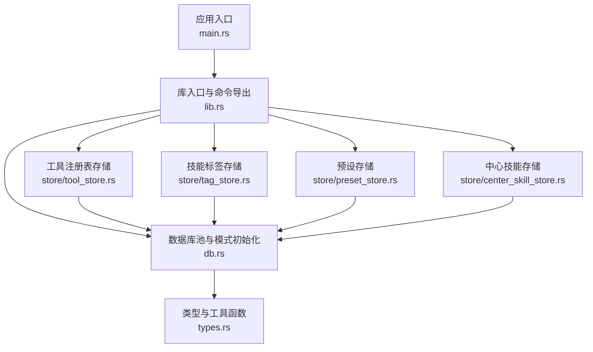
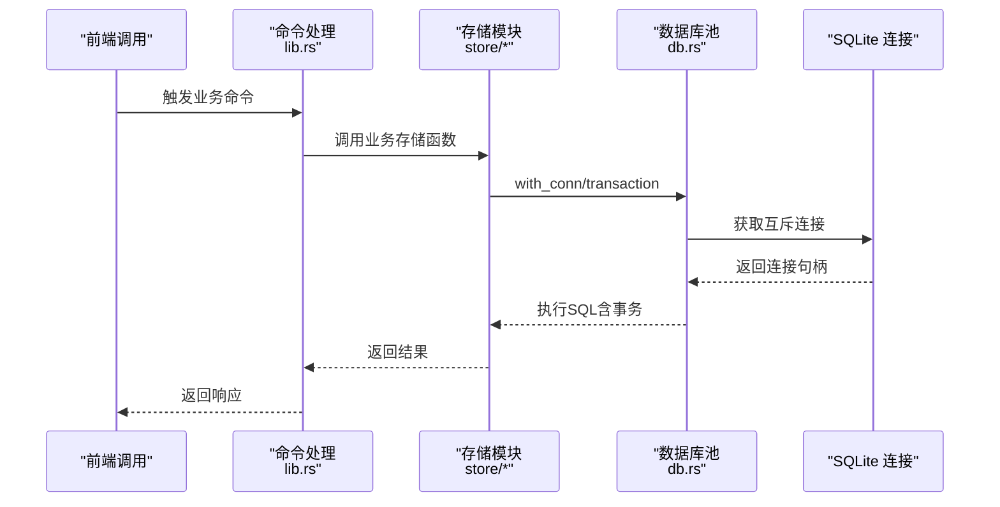
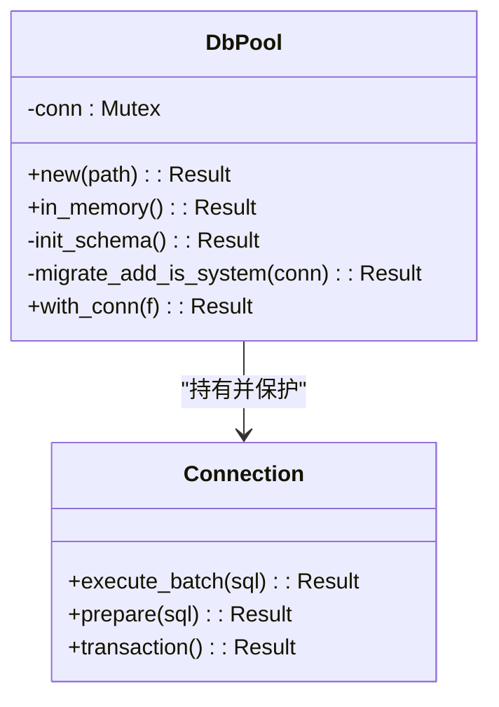
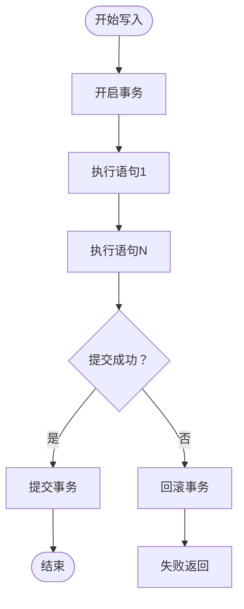
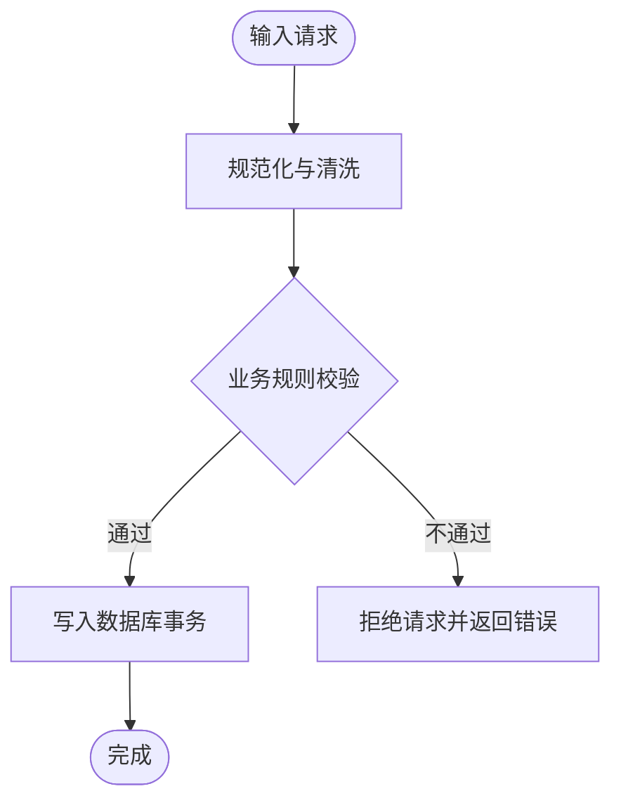
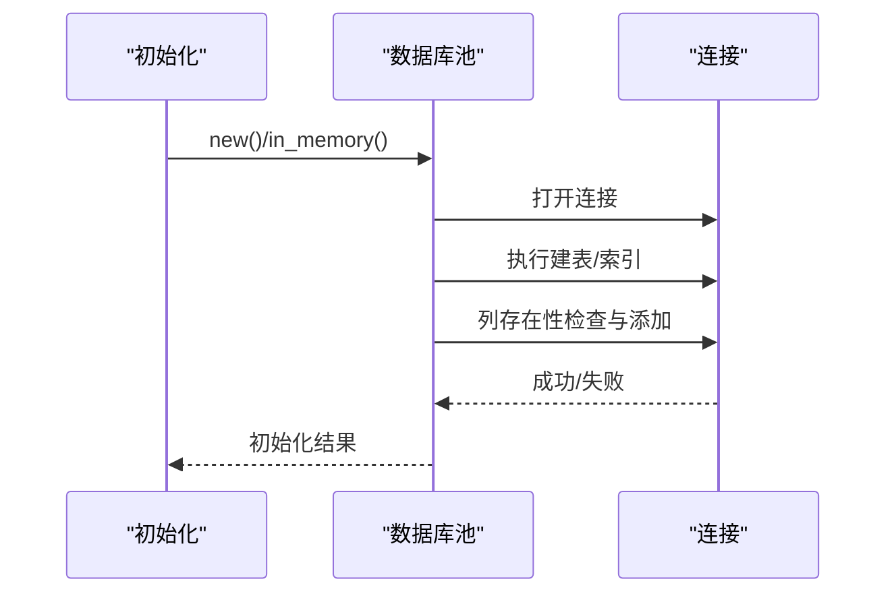
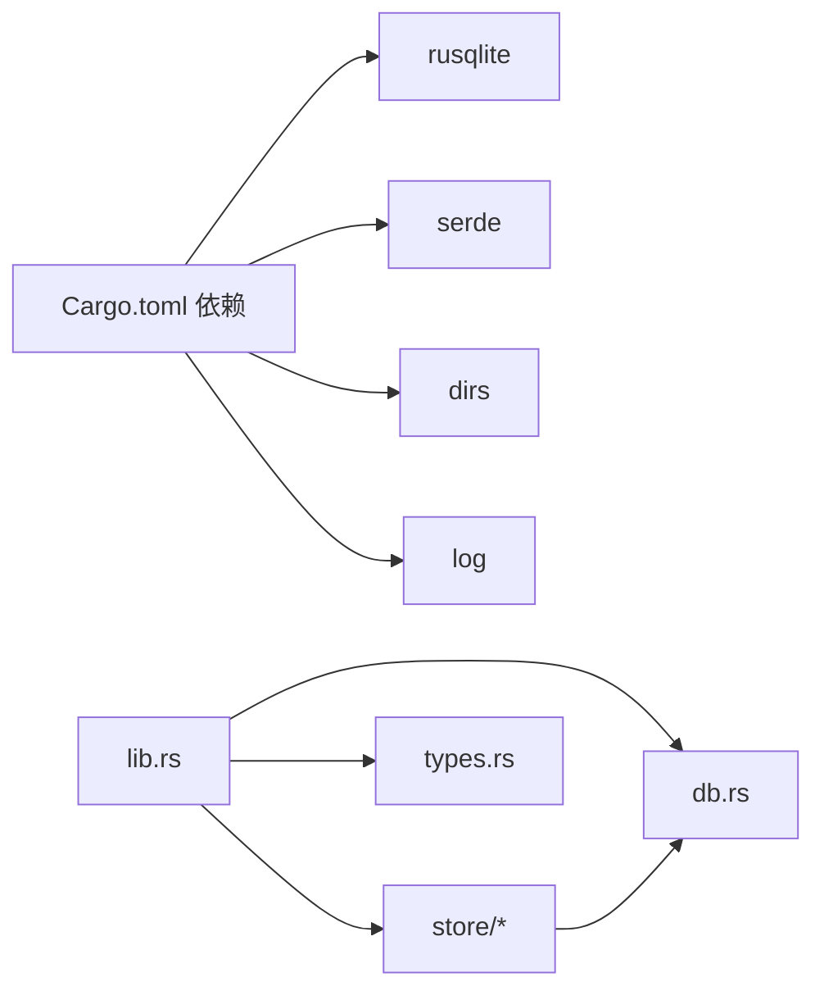

# 数据一致性

<cite>
**本文引用的文件**
- [src-tauri/src/db.rs](file://src-tauri/src/db.rs)
- [src-tauri/src/lib.rs](file://src-tauri/src/lib.rs)
- [src-tauri/src/types.rs](file://src-tauri/src/types.rs)
- [src-tauri/src/store/tool_store.rs](file://src-tauri/src/store/tool_store.rs)
- [src-tauri/src/store/tag_store.rs](file://src-tauri/src/store/tag_store.rs)
- [src-tauri/src/store/preset_store.rs](file://src-tauri/src/store/preset_store.rs)
- [src-tauri/src/store/center_skill_store.rs](file://src-tauri/src/store/center_skill_store.rs)
- [src-tauri/Cargo.toml](file://src-tauri/Cargo.toml)
</cite>

## 目录
1. [引言](#引言)
2. [项目结构](#项目结构)
3. [核心组件](#核心组件)
4. [架构总览](#架构总览)
5. [详细组件分析](#详细组件分析)
6. [依赖关系分析](#依赖关系分析)
7. [性能考量](#性能考量)
8. [故障排查指南](#故障排查指南)
9. [结论](#结论)
10. [附录](#附录)

## 引言
本文件围绕 SQLite 数据库在项目中的数据一致性保障进行系统化梳理，重点覆盖以下方面：
- 约束与完整性：外键约束、唯一性约束、检查约束的使用与效果
- 事务与并发：事务封装、并发访问控制与锁行为
- 数据验证与清理：应用层输入清洗、业务规则校验与历史数据清理
- 迁移与回滚：模式迁移与数据迁移的保护与回滚策略
- 备份与恢复：基于 SQLite 特性的备份能力与最佳实践
- 迁移与回滚：迁移过程中的数据保护与回滚机制
- 备份、恢复与迁移的最佳实践：确保数据安全与可靠性的方法论

## 项目结构
后端采用 Rust + Tauri 架构，数据库通过 rusqlite 访问 SQLite。核心数据库逻辑集中在数据库池与模式初始化，各业务模块通过统一的数据库池执行读写操作，并以事务包裹关键写入流程，确保原子性与一致性。



图表来源
- [src-tauri/src/main.rs:1-7](file://src-tauri/src/main.rs#L1-L7)
- [src-tauri/src/lib.rs:1-20](file://src-tauri/src/lib.rs#L1-L20)
- [src-tauri/src/db.rs:1-222](file://src-tauri/src/db.rs#L1-L222)
- [src-tauri/src/store/tool_store.rs:1-380](file://src-tauri/src/store/tool_store.rs#L1-L380)
- [src-tauri/src/store/tag_store.rs:1-78](file://src-tauri/src/store/tag_store.rs#L1-L78)
- [src-tauri/src/store/preset_store.rs:1-181](file://src-tauri/src/store/preset_store.rs#L1-L181)
- [src-tauri/src/store/center_skill_store.rs:1-299](file://src-tauri/src/store/center_skill_store.rs#L1-L299)
- [src-tauri/src/types.rs:1-367](file://src-tauri/src/types.rs#L1-L367)

章节来源
- [src-tauri/src/main.rs:1-7](file://src-tauri/src/main.rs#L1-L7)
- [src-tauri/src/lib.rs:1-20](file://src-tauri/src/lib.rs#L1-L20)
- [src-tauri/src/db.rs:1-222](file://src-tauri/src/db.rs#L1-L222)

## 核心组件
- 数据库池与连接管理：提供单实例连接与互斥访问，初始化时执行模式与迁移逻辑。
- 存储模块：按业务域拆分，统一通过数据库池执行读写，关键写入使用事务包裹。
- 类型与工具：提供输入清洗、时间戳等工具函数，支撑数据验证与一致性。
- 外键与索引：在模式中声明外键与复合主键，配合 SQLite 的级联删除与唯一约束，保障参照完整性。

章节来源
- [src-tauri/src/db.rs:1-222](file://src-tauri/src/db.rs#L1-L222)
- [src-tauri/src/store/tool_store.rs:1-380](file://src-tauri/src/store/tool_store.rs#L1-L380)
- [src-tauri/src/store/tag_store.rs:1-78](file://src-tauri/src/store/tag_store.rs#L1-L78)
- [src-tauri/src/store/preset_store.rs:1-181](file://src-tauri/src/store/preset_store.rs#L1-L181)
- [src-tauri/src/store/center_skill_store.rs:1-299](file://src-tauri/src/store/center_skill_store.rs#L1-L299)
- [src-tauri/src/types.rs:1-367](file://src-tauri/src/types.rs#L1-L367)

## 架构总览
整体采用“应用层命令 → 存储层 → 数据库池”的分层设计。所有写操作均通过事务封装，读取操作在互斥锁保护下执行；模式层面通过外键与唯一约束实现参照完整性和实体唯一性；迁移逻辑在初始化阶段执行，确保数据库结构演进的一致性。



图表来源
- [src-tauri/src/lib.rs:1-20](file://src-tauri/src/lib.rs#L1-L20)
- [src-tauri/src/db.rs:50-57](file://src-tauri/src/db.rs#L50-L57)
- [src-tauri/src/store/tool_store.rs:88-127](file://src-tauri/src/store/tool_store.rs#L88-L127)

## 详细组件分析

### 数据库池与模式初始化
- 单例连接池：使用互斥锁保护连接，避免并发写冲突；提供内存数据库与持久化数据库两种初始化方式。
- 模式初始化：在首次打开数据库时批量执行建表与索引创建；包含外键约束与复合主键定义。
- 迁移逻辑：在初始化完成后执行列存在性检测与增量添加，确保向后兼容。



图表来源
- [src-tauri/src/db.rs:5-57](file://src-tauri/src/db.rs#L5-L57)
- [src-tauri/src/db.rs:28-48](file://src-tauri/src/db.rs#L28-L48)

章节来源
- [src-tauri/src/db.rs:1-222](file://src-tauri/src/db.rs#L1-L222)

### 外键约束与参照完整性
- 工具配置与工具：工具配置表对工具主键建立外键，删除工具时通过级联删除清理配置。
- 预设与技能：预设技能表对预设主键建立外键，删除预设时级联删除关联技能。
- 中心技能与标签：中心技能标签表对技能主键建立外键，删除技能时级联删除标签。
- 复合主键：技能标签、预设技能、中心技能标签等使用复合主键，避免重复关联。

```mermaid
erDiagram
TOOLS {
text id PK
text name
integer enabled
text skill_dir
integer created_at
integer updated_at
}
TOOL_CONFIGS {
integer id PK
text tool_id FK
text label
text path
text kind
}
PRESETS {
text id PK
text name
text icon
integer created_at
integer updated_at
}
PRESET_SKILLS {
text preset_id FK
text skill_name
PK preset_id, skill_name
}
CENTER_SKILLS {
text id PK
text name UK
text source_type
text source_url
text description
integer installed_at
integer updated_at
text version
}
CENTER_SKILL_TAGS {
text skill_id FK
text tag
PK skill_id, tag
}
TOOLS ||--o{ TOOL_CONFIGS : "外键(级联删除)"
PRESETS ||--o{ PRESET_SKILLS : "外键(级联删除)"
CENTER_SKILLS ||--o{ CENTER_SKILL_TAGS : "外键(级联删除)"
```

图表来源
- [src-tauri/src/db.rs:59-147](file://src-tauri/src/db.rs#L59-L147)

章节来源
- [src-tauri/src/db.rs:59-147](file://src-tauri/src/db.rs#L59-L147)

### 唯一性约束与检查约束
- 唯一性：工具名称在中心技能表上声明唯一，防止重复安装同名技能。
- 复合唯一：技能标签、预设技能、中心技能标签的复合主键避免重复关联。
- 检查约束：代码中未显式声明 SQL CHECK 约束，但通过应用层清洗与校验实现业务规则（例如工具 ID 规范化、技能名称合法性、配置文件字段非空校验）。

章节来源
- [src-tauri/src/db.rs:107](file://src-tauri/src/db.rs#L107)
- [src-tauri/src/types.rs:289-303](file://src-tauri/src/types.rs#L289-L303)
- [src-tauri/src/types.rs:289-294](file://src-tauri/src/types.rs#L289-L294)

### 事务处理与并发控制
- 事务封装：工具注册表、标签、预设、中心技能等写入均使用事务包裹，确保多条语句的原子性。
- 并发控制：数据库池使用互斥锁保护连接，避免并发写导致的竞争条件；读取操作同样受锁保护，确保一致性视图。
- 锁机制：SQLite 的 WAL/互斥锁由 rusqlite 封装，应用层无需直接干预，但通过事务与串行化访问保障一致性。



图表来源
- [src-tauri/src/store/tool_store.rs:89-127](file://src-tauri/src/store/tool_store.rs#L89-L127)
- [src-tauri/src/store/tag_store.rs:52-76](file://src-tauri/src/store/tag_store.rs#L52-L76)
- [src-tauri/src/store/preset_store.rs:64-127](file://src-tauri/src/store/preset_store.rs#L64-L127)
- [src-tauri/src/store/center_skill_store.rs:129-196](file://src-tauri/src/store/center_skill_store.rs#L129-L196)

章节来源
- [src-tauri/src/store/tool_store.rs:88-127](file://src-tauri/src/store/tool_store.rs#L88-L127)
- [src-tauri/src/store/tag_store.rs:52-76](file://src-tauri/src/store/tag_store.rs#L52-L76)
- [src-tauri/src/store/preset_store.rs:64-127](file://src-tauri/src/store/preset_store.rs#L64-L127)
- [src-tauri/src/store/center_skill_store.rs:129-196](file://src-tauri/src/store/center_skill_store.rs#L129-L196)

### 数据验证规则与业务规则实现
- 输入清洗：工具 ID 规范化、技能名称合法性校验、配置文件字段修剪与过滤。
- 业务规则：系统工具不可删除/修改；工具注册表保存时清空并重插，确保数据整洁；中心技能更新时先删后插标签，保持一致性。
- 时间戳：统一使用当前时间戳作为创建/更新时间，保证时序一致性。



图表来源
- [src-tauri/src/types.rs:289-303](file://src-tauri/src/types.rs#L289-L303)
- [src-tauri/src/types.rs:289-294](file://src-tauri/src/types.rs#L289-L294)
- [src-tauri/src/lib.rs:783-800](file://src-tauri/src/lib.rs#L783-L800)
- [src-tauri/src/store/tool_store.rs:129-187](file://src-tauri/src/store/tool_store.rs#L129-L187)

章节来源
- [src-tauri/src/types.rs:289-303](file://src-tauri/src/types.rs#L289-L303)
- [src-tauri/src/types.rs:289-294](file://src-tauri/src/types.rs#L289-L294)
- [src-tauri/src/lib.rs:783-800](file://src-tauri/src/lib.rs#L783-L800)
- [src-tauri/src/store/tool_store.rs:129-187](file://src-tauri/src/store/tool_store.rs#L129-L187)

### 数据清理策略
- 历史系统工具清理：启动时清理旧版遗留的系统工具标记，避免脏数据残留。
- 注册表清理：保存注册表前清空旧数据，确保与新数据一致。
- 标签与预设：更新时先删除旧关联，再插入新关联，避免悬挂或重复。

章节来源
- [src-tauri/src/lib.rs:188-195](file://src-tauri/src/lib.rs#L188-L195)
- [src-tauri/src/store/tool_store.rs:88-127](file://src-tauri/src/store/tool_store.rs#L88-L127)
- [src-tauri/src/store/tag_store.rs:52-76](file://src-tauri/src/store/tag_store.rs#L52-L76)
- [src-tauri/src/store/preset_store.rs:64-127](file://src-tauri/src/store/preset_store.rs#L64-L127)

### 迁移过程中的数据保护与回滚机制
- 模式迁移：初始化阶段执行建表与列增量添加，失败即终止，避免半成品结构。
- 数据迁移：注册表迁移时整表清空后重插，结合事务确保原子性；若中途失败可回滚。
- 级联删除：外键级联删除确保删除父记录时自动清理子记录，避免悬挂引用。



图表来源
- [src-tauri/src/db.rs:10-26](file://src-tauri/src/db.rs#L10-L26)
- [src-tauri/src/db.rs:28-48](file://src-tauri/src/db.rs#L28-L48)

章节来源
- [src-tauri/src/db.rs:10-26](file://src-tauri/src/db.rs#L10-L26)
- [src-tauri/src/db.rs:28-48](file://src-tauri/src/db.rs#L28-L48)
- [src-tauri/src/store/tool_store.rs:88-127](file://src-tauri/src/store/tool_store.rs#L88-L127)

### 备份、恢复与迁移的最佳实践
- 备份能力：rusqlite 提供备份特性，可在运行时将数据库复制到目标文件，适合离线备份与迁移。
- 恢复策略：优先使用备份文件替换损坏文件；若数据库损坏，建议先从备份恢复，再执行必要的迁移。
- 迁移策略：迁移前先备份；迁移过程中使用事务包裹关键步骤；失败立即回滚并告警；迁移完成后验证数据完整性。

章节来源
- [src-tauri/Cargo.toml:26](file://src-tauri/Cargo.toml#L26)

## 依赖关系分析
- 外部依赖：rusqlite 提供 SQLite 访问与备份能力；serde/dirs/log 等用于序列化、路径与日志。
- 内部耦合：所有存储模块依赖数据库池；类型模块被广泛使用于清洗与校验；命令层统一调度存储模块。



图表来源
- [src-tauri/Cargo.toml:20-30](file://src-tauri/Cargo.toml#L20-L30)
- [src-tauri/src/lib.rs:1-20](file://src-tauri/src/lib.rs#L1-L20)

章节来源
- [src-tauri/Cargo.toml:20-30](file://src-tauri/Cargo.toml#L20-L30)
- [src-tauri/src/lib.rs:1-20](file://src-tauri/src/lib.rs#L1-L20)

## 性能考量
- 索引优化：为常用查询字段建立索引（如工具配置、标签、预设技能、中心技能标签、同步记录），提升查询效率。
- 事务批处理：批量写入使用事务，减少提交次数，降低磁盘写放大。
- 互斥锁粒度：数据库池互斥锁保护整个连接，避免并发写竞争；对于只读场景可考虑读写分离或快照读（SQLite 支持 WAL 模式）。
- I/O 优化：合理安排备份时机，避免在高并发写入期间进行大文件 IO。

章节来源
- [src-tauri/src/db.rs:142-146](file://src-tauri/src/db.rs#L142-L146)
- [src-tauri/src/store/tool_store.rs:88-127](file://src-tauri/src/store/tool_store.rs#L88-L127)

## 故障排查指南
- 初始化失败：检查数据库文件权限与路径；确认建表/索引执行是否报错；必要时删除损坏文件重新初始化。
- 写入失败：确认事务是否正确提交；检查外键约束是否被违反；查看是否有并发写入冲突。
- 数据不一致：核对事务边界；确认迁移是否完整执行；检查索引是否缺失导致查询异常。
- 备份恢复：优先使用备份文件；恢复后执行完整性校验；如遇问题，回滚到上一次备份。

章节来源
- [src-tauri/src/db.rs:10-26](file://src-tauri/src/db.rs#L10-L26)
- [src-tauri/src/store/tool_store.rs:88-127](file://src-tauri/src/store/tool_store.rs#L88-L127)

## 结论
本项目通过“模式约束 + 应用层清洗 + 事务包裹 + 并发互斥”的组合策略，在 SQLite 上实现了良好的数据一致性与完整性保障。外键与唯一约束确保参照与实体完整性，事务与互斥锁保证并发安全，应用层清洗与业务规则进一步强化了数据质量。配合 rusqlite 的备份能力与合理的迁移策略，能够有效保护数据并在异常情况下快速恢复。

## 附录
- 关键实现位置参考：
  - 数据库池与模式：[src-tauri/src/db.rs:1-222](file://src-tauri/src/db.rs#L1-L222)
  - 工具注册表存储：[src-tauri/src/store/tool_store.rs:1-380](file://src-tauri/src/store/tool_store.rs#L1-L380)
  - 标签存储：[src-tauri/src/store/tag_store.rs:1-78](file://src-tauri/src/store/tag_store.rs#L1-L78)
  - 预设存储：[src-tauri/src/store/preset_store.rs:1-181](file://src-tauri/src/store/preset_store.rs#L1-L181)
  - 中心技能存储：[src-tauri/src/store/center_skill_store.rs:1-299](file://src-tauri/src/store/center_skill_store.rs#L1-L299)
  - 类型与工具函数：[src-tauri/src/types.rs:1-367](file://src-tauri/src/types.rs#L1-L367)
  - 外部依赖：[src-tauri/Cargo.toml:20-30](file://src-tauri/Cargo.toml#L20-L30)