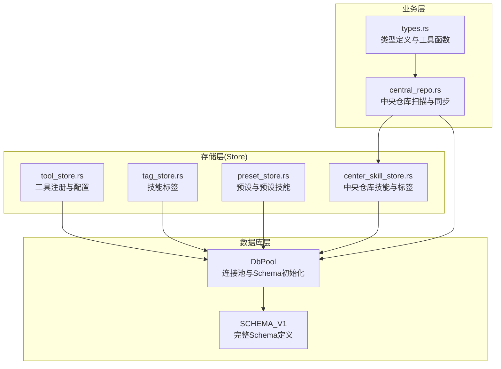
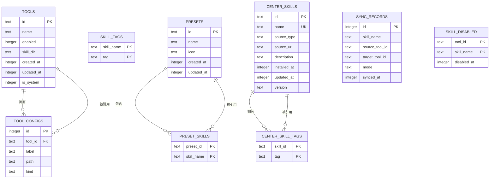
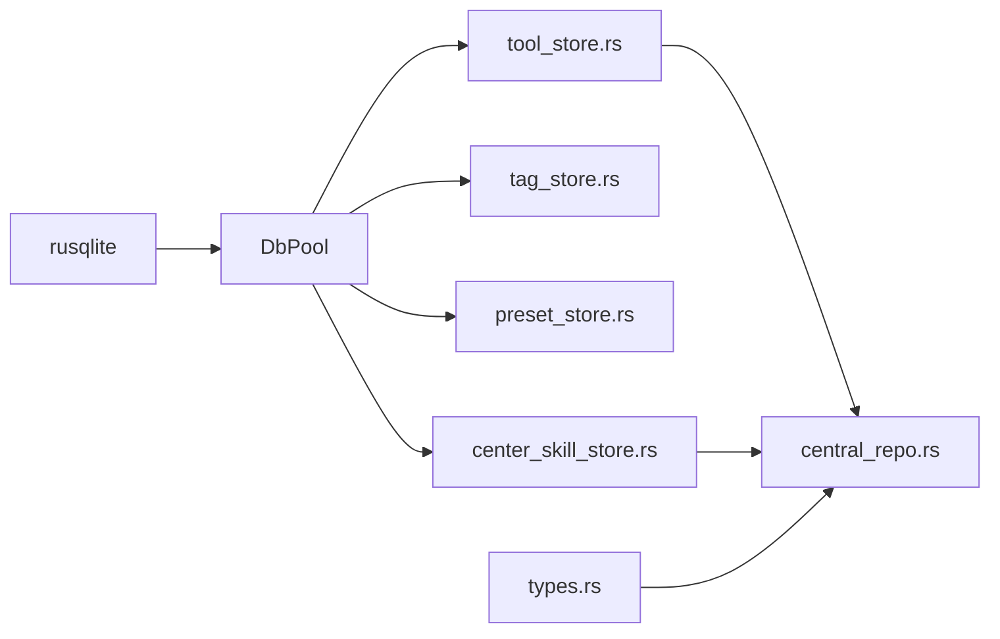

# 数据库架构

<cite>
**本文档引用的文件**
- [db.rs](file://src-tauri/src/db.rs)
- [tool_store.rs](file://src-tauri/src/store/tool_store.rs)
- [tag_store.rs](file://src-tauri/src/store/tag_store.rs)
- [preset_store.rs](file://src-tauri/src/store/preset_store.rs)
- [center_skill_store.rs](file://src-tauri/src/store/center_skill_store.rs)
- [central_repo.rs](file://src-tauri/src/central_repo.rs)
- [types.rs](file://src-tauri/src/types.rs)
</cite>

## 目录
1. [简介](#简介)
2. [项目结构](#项目结构)
3. [核心组件](#核心组件)
4. [架构总览](#架构总览)
5. [详细组件分析](#详细组件分析)
6. [依赖关系分析](#依赖关系分析)
7. [性能考虑](#性能考虑)
8. [故障排除指南](#故障排除指南)
9. [结论](#结论)

## 简介
本文件系统性梳理了 SQLite 数据库的整体设计与 schema 结构，覆盖工具表、工具配置表、技能标签表、预设表、预设技能表、中央仓库技能表、中央仓库技能标签关联表、同步记录表以及技能停用记录表等核心表。文档详细解释各表的字段、约束、索引与查询优化策略，并通过实体关系图展示表间关系与外键约束，帮助开发者快速理解数据模型并进行后续扩展与维护。

## 项目结构
数据库层采用集中式连接池封装，Schema 初始化与迁移逻辑集中在数据库层，业务层通过 Store 模块调用数据库接口完成 CRUD 操作。整体结构清晰，职责分离明确。

**图表来源**
- [db.rs:1-222](file://src-tauri/src/db.rs#L1-L222)
- [tool_store.rs:1-380](file://src-tauri/src/store/tool_store.rs#L1-L380)
- [tag_store.rs:1-78](file://src-tauri/src/store/tag_store.rs#L1-L78)
- [preset_store.rs:1-181](file://src-tauri/src/store/preset_store.rs#L1-L181)
- [center_skill_store.rs:1-299](file://src-tauri/src/store/center_skill_store.rs#L1-L299)
- [central_repo.rs:1-726](file://src-tauri/src/central_repo.rs#L1-L726)
- [types.rs:1-367](file://src-tauri/src/types.rs#L1-L367)

**章节来源**
- [db.rs:1-222](file://src-tauri/src/db.rs#L1-L222)

## 核心组件
- 数据库连接池与 Schema 初始化：集中管理 SQLite 连接、执行 Schema 创建与迁移（如新增 is_system 字段）。
- 存储层模块：按功能划分，分别处理工具、标签、预设、中央仓库技能等业务数据的增删改查。
- 中央仓库与同步：负责本地/远程技能的扫描、导入、安装与同步，同时维护同步记录与技能停用状态。

**章节来源**
- [db.rs:1-222](file://src-tauri/src/db.rs#L1-L222)
- [tool_store.rs:1-380](file://src-tauri/src/store/tool_store.rs#L1-L380)
- [tag_store.rs:1-78](file://src-tauri/src/store/tag_store.rs#L1-L78)
- [preset_store.rs:1-181](file://src-tauri/src/store/preset_store.rs#L1-L181)
- [center_skill_store.rs:1-299](file://src-tauri/src/store/center_skill_store.rs#L1-L299)
- [central_repo.rs:1-726](file://src-tauri/src/central_repo.rs#L1-L726)

## 架构总览
下图展示了数据库表之间的实体关系与外键约束，帮助理解数据模型的完整性与一致性。

**图表来源**
- [db.rs:59-147](file://src-tauri/src/db.rs#L59-L147)

## 详细组件分析

### 工具表（tools）
- 设计理念：记录工具的基本信息与启用状态，支持系统工具标记，便于区分可删除性。
- 主键与约束：id 为主键；enabled 默认 1；is_system 默认 0，用于限制系统工具删除。
- 关键字段：
  - id：工具唯一标识符
  - name：工具名称
  - enabled：是否启用
  - skill_dir：技能目录路径
  - created_at/updated_at：时间戳
  - is_system：是否为系统工具
- 查询优化：配合索引 idx_tool_configs_tool_id 实现按工具 ID 快速定位配置。

**章节来源**
- [db.rs:61-68](file://src-tauri/src/db.rs#L61-L68)
- [tool_store.rs:11-86](file://src-tauri/src/store/tool_store.rs#L11-L86)

### 工具配置表（tool_configs）
- 设计理念：为每个工具维护多个配置文件条目，支持多配置文件场景。
- 主键与约束：自增主键；外键指向 tools.id，删除时级联清理。
- 关键字段：
  - id：自增配置项 ID
  - tool_id：所属工具 ID
  - label/path/kind：配置文件标签、路径与类型
- 查询优化：索引 idx_tool_configs_tool_id 支持按工具 ID 快速检索配置。

**章节来源**
- [db.rs:71-78](file://src-tauri/src/db.rs#L71-L78)
- [tool_store.rs:35-52](file://src-tauri/src/store/tool_store.rs#L35-L52)

### 技能标签表（skill_tags）
- 设计理念：为技能建立多标签体系，支持标签去重与查询。
- 主键与约束：复合主键（skill_name, tag），避免重复标签。
- 关键字段：
  - skill_name：技能名
  - tag：标签值
- 查询优化：索引 idx_skill_tags_skill 支持按技能名检索标签。

**章节来源**
- [db.rs:81-85](file://src-tauri/src/db.rs#L81-L85)
- [tag_store.rs:30-50](file://src-tauri/src/store/tag_store.rs#L30-L50)

### 预设表（presets）
- 设计理念：保存用户自定义的技能组合（预设），支持图标与时间戳管理。
- 主键与约束：id 为主键；created_at/updated_at 记录变更时间。
- 关键字段：
  - id/name/icon：预设标识、名称与图标
  - created_at/updated_at：创建与更新时间

**章节来源**
- [db.rs:88-94](file://src-tauri/src/db.rs#L88-L94)
- [preset_store.rs:9-55](file://src-tauri/src/store/preset_store.rs#L9-L55)

### 预设技能表（preset_skills）
- 设计理念：建立预设与技能的多对多关联，支持批量应用预设。
- 主键与约束：复合主键（preset_id, skill_name）；外键指向 presets.id，删除时级联。
- 关键字段：
  - preset_id：预设 ID
  - skill_name：技能名
- 查询优化：索引 idx_preset_skills_preset 支持按预设 ID 查询技能列表。

**章节来源**
- [db.rs:97-102](file://src-tauri/src/db.rs#L97-L102)
- [preset_store.rs:28-51](file://src-tauri/src/store/preset_store.rs#L28-L51)

### 中央仓库技能表（center_skills）
- 设计理念：统一管理来自不同来源（git/local/zip/market）的技能元数据。
- 主键与约束：id 为主键；name 唯一；包含版本、描述、时间戳等。
- 关键字段：
  - id/name/source_type/source_url/version/description
  - installed_at/updated_at：安装与更新时间
- 查询优化：索引 idx_center_skill_tags_skill 支持按技能 ID 查询标签。

**章节来源**
- [db.rs:105-114](file://src-tauri/src/db.rs#L105-L114)
- [center_skill_store.rs:25-79](file://src-tauri/src/store/center_skill_store.rs#L25-L79)

### 中央仓库技能标签关联表（center_skill_tags）
- 设计理念：为中央仓库技能建立多标签体系，支持灵活筛选与搜索。
- 主键与约束：复合主键（skill_id, tag）；外键指向 center_skills.id，删除时级联。
- 关键字段：
  - skill_id：中央仓库技能 ID
  - tag：标签值

**章节来源**
- [db.rs:117-122](file://src-tauri/src/db.rs#L117-L122)
- [center_skill_store.rs:277-298](file://src-tauri/src/store/center_skill_store.rs#L277-L298)

### 同步记录表（sync_records）
- 设计理念：记录技能在工具间的同步历史，便于审计与追踪。
- 主键与约束：自增主键；无显式外键约束。
- 关键字段：
  - skill_name：技能名
  - source_tool_id：源工具 ID
  - target_tool_id：目标工具 ID
  - mode：同步模式（copy/symlink）
  - synced_at：同步时间戳
- 查询优化：索引 idx_sync_records_skill 支持按技能名检索同步记录。

**章节来源**
- [db.rs:125-132](file://src-tauri/src/db.rs#L125-L132)
- [central_repo.rs:389-444](file://src-tauri/src/central_repo.rs#L389-L444)

### 技能停用记录表（skill_disabled）
- 设计理念：记录特定工具下被停用的技能，支持启用/禁用切换。
- 主键与约束：复合主键（tool_id, skill_name）。
- 关键字段：
  - tool_id：工具 ID
  - skill_name：技能名
  - disabled_at：停用时间戳
- 查询优化：通过复合主键实现快速查询与更新。

**章节来源**
- [db.rs:135-140](file://src-tauri/src/db.rs#L135-L140)
- [db.rs:149-208](file://src-tauri/src/db.rs#L149-L208)

### 索引与查询优化策略
- 单列索引：
  - idx_tool_configs_tool_id：加速按工具 ID 查询配置
  - idx_skill_tags_skill：加速按技能名查询标签
  - idx_preset_skills_preset：加速按预设查询技能
  - idx_center_skill_tags_skill：加速按技能 ID 查询标签
  - idx_sync_records_skill：加速按技能名查询同步记录
- 复合主键：技能标签、预设技能、中央仓库技能标签、技能停用记录均采用复合主键，确保唯一性并提升查询效率。
- 外键级联：工具配置、预设技能、中央仓库技能标签均设置级联删除，保证数据一致性。

**章节来源**
- [db.rs:142-147](file://src-tauri/src/db.rs#L142-L147)

## 依赖关系分析
- 数据库层依赖 rusqlite 提供 SQLite 连接与事务支持。
- 存储层模块通过 DbPool 统一访问数据库，避免直接耦合具体 SQL。
- 中央仓库模块依赖存储层完成技能元数据与标签的持久化。
- 类型模块提供跨层的数据结构与工具函数，确保前后端一致。

**图表来源**
- [db.rs:1-3](file://src-tauri/src/db.rs#L1-L3)
- [tool_store.rs:1-6](file://src-tauri/src/store/tool_store.rs#L1-L6)
- [tag_store.rs:1-3](file://src-tauri/src/store/tag_store.rs#L1-L3)
- [preset_store.rs:1-4](file://src-tauri/src/store/preset_store.rs#L1-L4)
- [center_skill_store.rs:1-3](file://src-tauri/src/store/center_skill_store.rs#L1-L3)
- [central_repo.rs:1-10](file://src-tauri/src/central_repo.rs#L1-L10)
- [types.rs:1-10](file://src-tauri/src/types.rs#L1-L10)

**章节来源**
- [db.rs:1-222](file://src-tauri/src/db.rs#L1-L222)
- [tool_store.rs:1-380](file://src-tauri/src/store/tool_store.rs#L1-L380)
- [tag_store.rs:1-78](file://src-tauri/src/store/tag_store.rs#L1-L78)
- [preset_store.rs:1-181](file://src-tauri/src/store/preset_store.rs#L1-L181)
- [center_skill_store.rs:1-299](file://src-tauri/src/store/center_skill_store.rs#L1-L299)
- [central_repo.rs:1-726](file://src-tauri/src/central_repo.rs#L1-L726)
- [types.rs:1-367](file://src-tauri/src/types.rs#L1-L367)

## 性能考虑
- 使用连接池：DbPool 封装单连接互斥锁，减少频繁打开/关闭连接的开销。
- 事务批处理：工具注册、预设更新、中央仓库技能更新均使用事务，降低写入放大与锁竞争。
- 索引命中：针对高频查询字段建立索引，显著提升查询性能。
- 级联删除：通过外键级联删除减少冗余数据与碎片。
- 时间戳管理：统一使用秒级时间戳，便于排序与范围查询。

[本节为通用指导，无需列出具体文件来源]

## 故障排除指南
- 数据库未初始化：确认 init_db_pool 是否成功创建 ~/.ai-toolbox/toolbox.db 并加载 Schema。
- 系统工具不可删除：当 is_system=1 时，删除工具会返回错误提示。
- 技能停用状态异常：使用 is_skill_disabled/list_disabled_skills/disable_skill/enable_skill/clear_disabled_skills 接口排查。
- 中央仓库同步失败：检查 sync_records 表记录与技能路径权限，确认模式与冲突策略配置正确。
- 标签重复或缺失：通过 set_skill_tags/set_center_skill_tags 清理后重新写入，确保标签去重。

**章节来源**
- [db.rs:212-222](file://src-tauri/src/db.rs#L212-L222)
- [db.rs:149-208](file://src-tauri/src/db.rs#L149-L208)
- [central_repo.rs:389-444](file://src-tauri/src/central_repo.rs#L389-L444)
- [tag_store.rs:52-76](file://src-tauri/src/store/tag_store.rs#L52-L76)
- [center_skill_store.rs:240-271](file://src-tauri/src/store/center_skill_store.rs#L240-L271)

## 结论
该数据库架构以 SQLite 为核心，围绕工具、技能、预设与中央仓库构建了清晰的实体关系模型。通过合理的索引与外键约束、事务化的写入流程以及统一的连接池管理，实现了高性能与高可靠性的数据持久化能力。建议在后续扩展中继续遵循“表结构清晰、外键约束明确、索引覆盖高频查询”的设计原则，确保系统的可维护性与可扩展性。