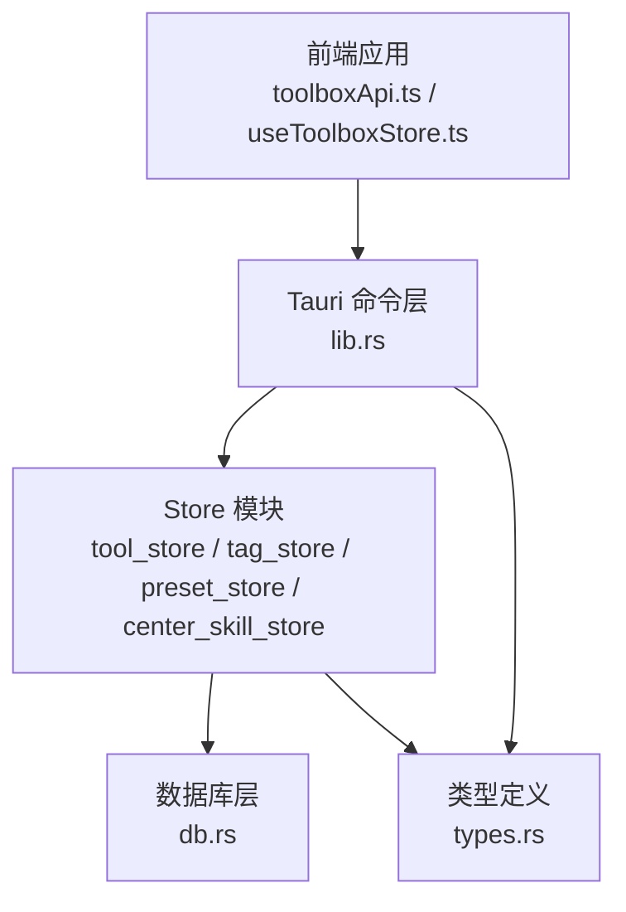
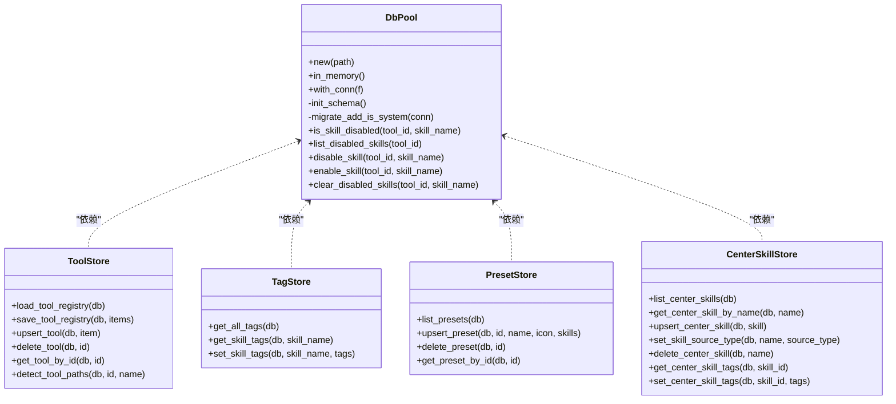
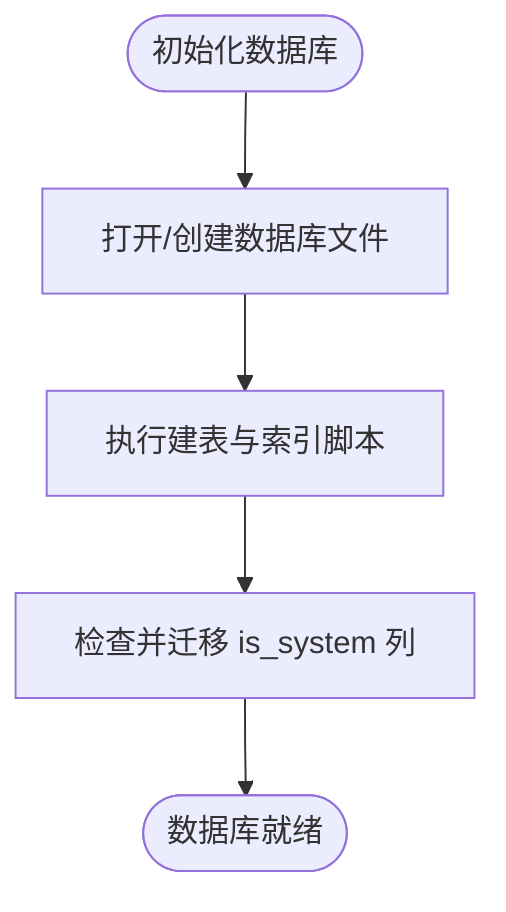
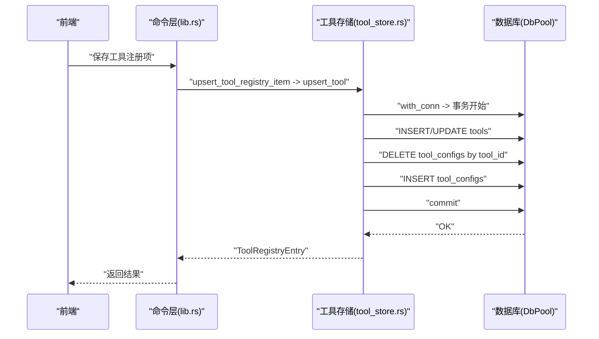
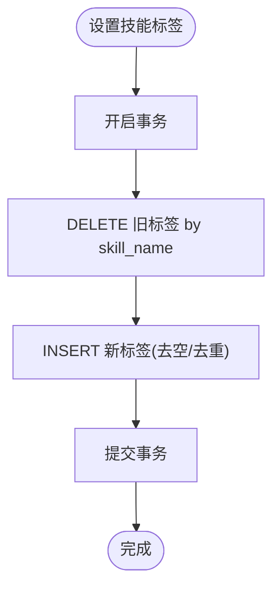
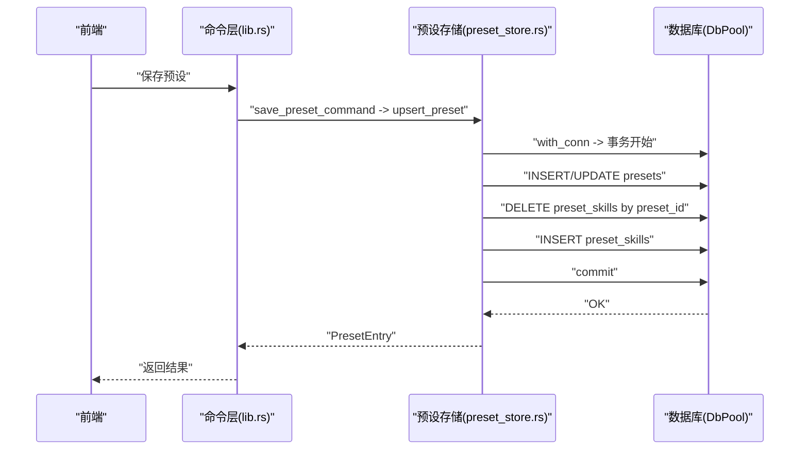
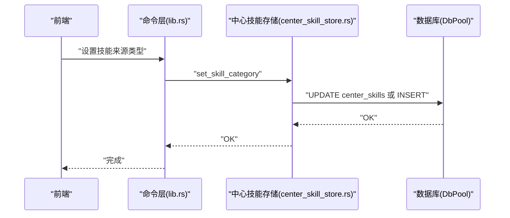
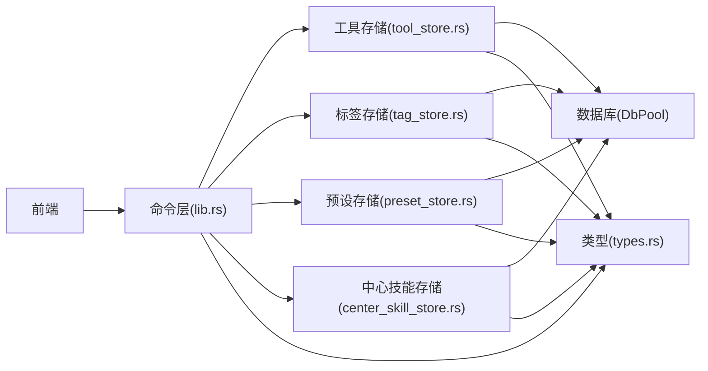
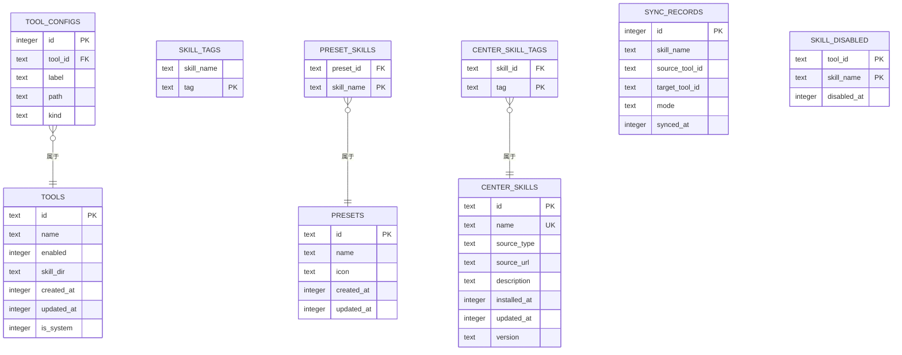

# 数据库设计

<cite>
**本文引用的文件**
- [db.rs](file://src-tauri/src/db.rs)
- [tool_store.rs](file://src-tauri/src/store/tool_store.rs)
- [tag_store.rs](file://src-tauri/src/store/tag_store.rs)
- [preset_store.rs](file://src-tauri/src/store/preset_store.rs)
- [center_skill_store.rs](file://src-tauri/src/store/center_skill_store.rs)
- [types.rs](file://src-tauri/src/types.rs)
- [lib.rs](file://src-tauri/src/lib.rs)
- [main.rs](file://src-tauri/src/main.rs)
- [toolboxApi.ts](file://src/lib/toolboxApi.ts)
- [useToolboxStore.ts](file://src/store/useToolboxStore.ts)
</cite>

## 目录
1. [简介](#简介)
2. [项目结构](#项目结构)
3. [核心组件](#核心组件)
4. [架构总览](#架构总览)
5. [详细组件分析](#详细组件分析)
6. [依赖分析](#依赖分析)
7. [性能考量](#性能考量)
8. [故障排查指南](#故障排查指南)
9. [结论](#结论)
10. [附录](#附录)

## 简介
本文件系统性梳理 AI 工具箱项目的数据库设计，聚焦 SQLite 整体架构与数据模型，涵盖工具表、技能标签表、预设表与中央仓库表的结构设计；详解各 store 模块（工具存储、标签存储、预设存储、中心技能存储）的功能职责与实现；阐述数据访问模式、查询优化策略与性能考虑；解释数据持久化机制与一致性保障；并通过 ER 图与类图帮助开发者快速理解数据模型的设计理念与实现细节。

## 项目结构
数据库层位于 Rust 后端（Tauri），通过命令接口向前端暴露能力。核心文件组织如下：
- 数据库与连接池：db.rs
- Store 层：store/mod.rs 及其子模块（tool_store、tag_store、preset_store、center_skill_store）
- 类型定义：types.rs
- 应用入口与命令注册：lib.rs、main.rs
- 前端 API 与状态管理：toolboxApi.ts、useToolboxStore.ts

**图表来源**
- [lib.rs:1310-1409](file://src-tauri/src/lib.rs#L1310-L1409)
- [db.rs:1-222](file://src-tauri/src/db.rs#L1-L222)
- [tool_store.rs:1-380](file://src-tauri/src/store/tool_store.rs#L1-L380)
- [tag_store.rs:1-78](file://src-tauri/src/store/tag_store.rs#L1-L78)
- [preset_store.rs:1-181](file://src-tauri/src/store/preset_store.rs#L1-L181)
- [center_skill_store.rs:1-299](file://src-tauri/src/store/center_skill_store.rs#L1-L299)
- [types.rs:1-367](file://src-tauri/src/types.rs#L1-L367)

**章节来源**
- [lib.rs:1310-1409](file://src-tauri/src/lib.rs#L1310-L1409)
- [db.rs:1-222](file://src-tauri/src/db.rs#L1-L222)

## 核心组件
- 数据库连接池与模式初始化：负责打开数据库、执行初始化脚本、迁移列、提供 with_conn 访问器
- 工具存储：维护工具注册表与工具配置文件，支持增删改查、批量导入导出、路径探测
- 标签存储：维护技能标签，支持查询与替换式更新
- 预设存储：维护预设及其绑定的技能集合，支持增删改查与批量应用
- 中心技能存储：维护中央仓库技能及其标签，支持增删改查与来源类型设置
- 类型系统：统一前后端数据结构，包含工具、技能、预设、配置等类型

**章节来源**
- [db.rs:1-222](file://src-tauri/src/db.rs#L1-L222)
- [tool_store.rs:1-380](file://src-tauri/src/store/tool_store.rs#L1-L380)
- [tag_store.rs:1-78](file://src-tauri/src/store/tag_store.rs#L1-L78)
- [preset_store.rs:1-181](file://src-tauri/src/store/preset_store.rs#L1-L181)
- [center_skill_store.rs:1-299](file://src-tauri/src/store/center_skill_store.rs#L1-L299)
- [types.rs:1-367](file://src-tauri/src/types.rs#L1-L367)

## 架构总览
数据库采用单文件 SQLite，通过连接池封装并发访问；所有业务逻辑通过 store 模块抽象，最终落到 SQL 执行与事务控制上。命令层将前端请求映射为 store 调用，并返回标准化结果。

**图表来源**
- [db.rs:1-222](file://src-tauri/src/db.rs#L1-L222)
- [tool_store.rs:1-380](file://src-tauri/src/store/tool_store.rs#L1-L380)
- [tag_store.rs:1-78](file://src-tauri/src/store/tag_store.rs#L1-L78)
- [preset_store.rs:1-181](file://src-tauri/src/store/preset_store.rs#L1-L181)
- [center_skill_store.rs:1-299](file://src-tauri/src/store/center_skill_store.rs#L1-L299)

## 详细组件分析

### 数据库层（DbPool 与 Schema）
- 单实例连接池：以互斥锁保护底层 Connection，提供 with_conn 统一访问入口
- 初始化流程：执行 SCHEMA_V1 定义的建表与索引；按需迁移添加 is_system 字段
- 关系型约束：外键约束确保数据完整性（如工具配置随工具删除而级联）
- 辅助查询：提供技能禁用状态检查与列表查询，支撑前端“启用/停用”体验

**图表来源**
- [db.rs:28-48](file://src-tauri/src/db.rs#L28-L48)

**章节来源**
- [db.rs:1-222](file://src-tauri/src/db.rs#L1-L222)

### 工具存储（tools 与 tool_configs）
- 功能职责
  - 工具注册表 CRUD：加载、保存、更新、删除工具；支持系统工具保护
  - 工具配置文件管理：每个工具可关联多个配置文件（label/path/kind）
  - 路径探测：根据工具名推断常见配置文件与技能目录位置
- 实现要点
  - 事务化保存：清空旧数据后批量写入，保证一致性
  - 兼容迁移：修正历史技能目录路径，必要时回写
  - 查询优化：按 created_at 排序，按需加载配置文件

**图表来源**
- [lib.rs:782-815](file://src-tauri/src/lib.rs#L782-L815)
- [tool_store.rs:129-187](file://src-tauri/src/store/tool_store.rs#L129-L187)
- [db.rs:50-57](file://src-tauri/src/db.rs#L50-L57)

**章节来源**
- [tool_store.rs:1-380](file://src-tauri/src/store/tool_store.rs#L1-L380)
- [lib.rs:782-815](file://src-tauri/src/lib.rs#L782-L815)

### 标签存储（skill_tags）
- 功能职责：查询全部标签、查询某技能标签、替换式设置技能标签（先删后插）
- 实现要点：忽略重复标签，保持唯一性；支持空标签过滤

**图表来源**
- [tag_store.rs:52-76](file://src-tauri/src/store/tag_store.rs#L52-L76)

**章节来源**
- [tag_store.rs:1-78](file://src-tauri/src/store/tag_store.rs#L1-L78)

### 预设存储（presets 与 preset_skills）
- 功能职责：列出预设、创建/更新预设、删除预设、按 id 查询；预设绑定多技能
- 实现要点：预设 id 支持显式传入或自动生成；技能列表同样采用“先删后插”策略

**图表来源**
- [lib.rs:1114-1124](file://src-tauri/src/lib.rs#L1114-L1124)
- [preset_store.rs:57-127](file://src-tauri/src/store/preset_store.rs#L57-L127)
- [db.rs:50-57](file://src-tauri/src/db.rs#L50-L57)

**章节来源**
- [preset_store.rs:1-181](file://src-tauri/src/store/preset_store.rs#L1-L181)
- [lib.rs:1114-1124](file://src-tauri/src/lib.rs#L1114-L1124)

### 中心技能存储（center_skills 与 center_skill_tags）
- 功能职责：列出中心技能、按名称查询、创建/更新、删除；设置来源类型；管理标签
- 实现要点：中心技能与标签通过外键级联删除；标签更新采用“先删后插”策略

**图表来源**
- [lib.rs:1182-1186](file://src-tauri/src/lib.rs#L1182-L1186)
- [center_skill_store.rs:198-219](file://src-tauri/src/store/center_skill_store.rs#L198-L219)

**章节来源**
- [center_skill_store.rs:1-299](file://src-tauri/src/store/center_skill_store.rs#L1-L299)
- [lib.rs:1182-1186](file://src-tauri/src/lib.rs#L1182-L1186)

## 依赖分析
- 命令到 Store：前端通过 Tauri 命令调用，命令层将请求转交对应 store
- Store 到 DB：所有 store 通过 DbPool.with_conn 统一访问数据库
- 类型耦合：store 与 lib.rs 共享 types.rs 定义的数据结构

**图表来源**
- [lib.rs:1372-1405](file://src-tauri/src/lib.rs#L1372-L1405)
- [db.rs:1-222](file://src-tauri/src/db.rs#L1-L222)
- [types.rs:1-367](file://src-tauri/src/types.rs#L1-L367)

**章节来源**
- [lib.rs:1372-1405](file://src-tauri/src/lib.rs#L1372-L1405)
- [db.rs:1-222](file://src-tauri/src/db.rs#L1-L222)
- [types.rs:1-367](file://src-tauri/src/types.rs#L1-L367)

## 性能考量
- 连接池与串行化：DbPool 使用互斥锁保护连接，避免并发竞争；适合桌面应用的低并发场景
- 事务批处理：工具与预设保存采用事务包裹，减少多次往返开销
- 索引覆盖：为常用查询建立索引（工具配置、技能标签、预设技能、中心技能标签、同步记录、禁用记录）
- 查询优化建议
  - 批量读取：工具注册表按 created_at 排序，避免全表扫描
  - 唯一约束：技能标签与预设技能采用复合主键，提升查找效率
  - 外键级联：通过数据库约束减少冗余清理逻辑
- I/O 与一致性
  - SQLite 文件位于用户主目录下，避免跨盘符复制带来的性能损耗
  - 对于大量技能同步，建议前端分批触发，后端按批处理，降低内存峰值

[本节为通用指导，不直接分析具体文件]

## 故障排查指南
- 数据库未初始化
  - 现象：调用 get_db 返回“未初始化”
  - 处理：确认应用启动时已执行 init_db_pool，并检查用户目录权限
- 系统工具保护
  - 现象：尝试修改/删除系统工具报错
  - 处理：仅允许普通工具进行修改与删除
- 技能禁用状态异常
  - 现象：启用/停用技能后状态未生效
  - 处理：检查 skill_disabled 表是否正确写入/删除；确认工具 id 与技能名匹配
- 预设或中心技能不存在
  - 现象：删除/更新时报“未找到”
  - 处理：确认 id/name 是否正确；检查是否存在大小写或空白字符差异

**章节来源**
- [db.rs:150-208](file://src-tauri/src/db.rs#L150-L208)
- [tool_store.rs:189-201](file://src-tauri/src/store/tool_store.rs#L189-L201)
- [preset_store.rs:129-141](file://src-tauri/src/store/preset_store.rs#L129-L141)
- [center_skill_store.rs:221-234](file://src-tauri/src/store/center_skill_store.rs#L221-L234)

## 结论
本数据库设计以 SQLite 为核心，结合连接池与事务化操作，实现了工具、标签、预设与中心技能的清晰分层与强约束。通过索引与唯一约束优化查询性能，借助外键保障数据一致性。前端通过命令层与 store 模块无缝对接，形成从 UI 到持久化的完整闭环。建议在后续迭代中关注批量操作的性能与错误恢复策略，进一步提升用户体验。

[本节为总结，不直接分析具体文件]

## 附录

### 数据库 Schema 与关系图

**图表来源**
- [db.rs:59-147](file://src-tauri/src/db.rs#L59-L147)

### 关键查询与访问模式
- 工具注册表加载：按 created_at 排序，同时加载每个工具的配置文件
- 标签查询：按技能名精确查询或列出全部标签
- 预设加载：按 created_at 排序，同时加载绑定技能
- 中心技能加载：按 name 排序，同时加载标签
- 技能禁用：按 (tool_id, skill_name) 主键查询/更新

**章节来源**
- [tool_store.rs:11-86](file://src-tauri/src/store/tool_store.rs#L11-L86)
- [tag_store.rs:8-50](file://src-tauri/src/store/tag_store.rs#L8-L50)
- [preset_store.rs:9-55](file://src-tauri/src/store/preset_store.rs#L9-L55)
- [center_skill_store.rs:25-79](file://src-tauri/src/store/center_skill_store.rs#L25-L79)
- [db.rs:150-208](file://src-tauri/src/db.rs#L150-L208)