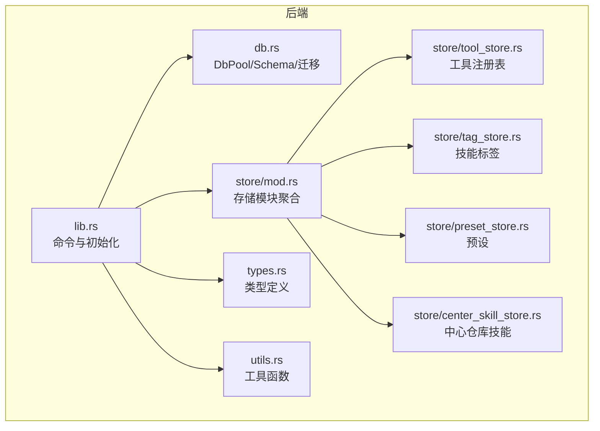
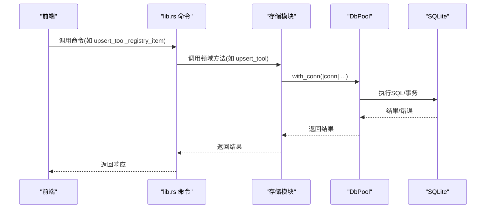
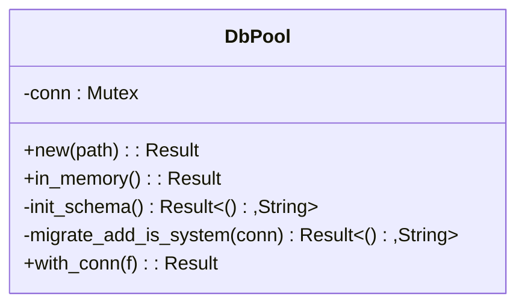
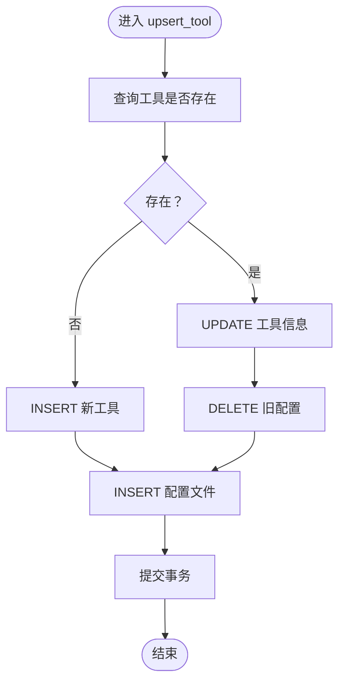
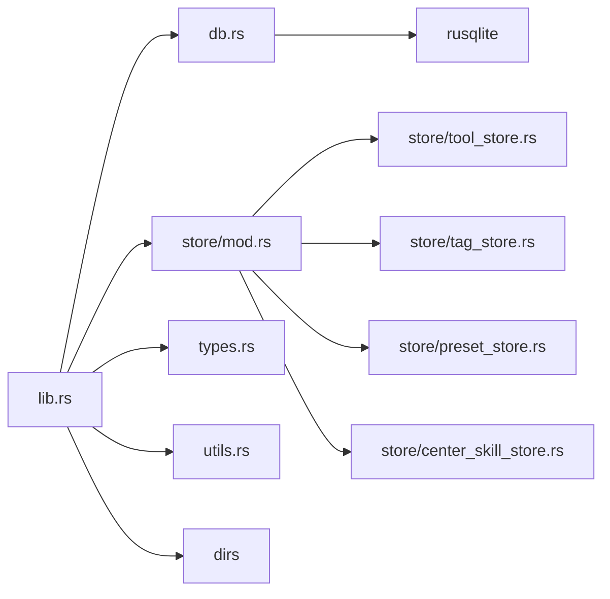

# 数据访问层

<cite>
**本文引用的文件**
- [db.rs](file://src-tauri/src/db.rs)
- [lib.rs](file://src-tauri/src/lib.rs)
- [Cargo.toml](file://src-tauri/Cargo.toml)
- [types.rs](file://src-tauri/src/types.rs)
- [utils.rs](file://src-tauri/src/utils.rs)
- [store/mod.rs](file://src-tauri/src/store/mod.rs)
- [store/tool_store.rs](file://src-tauri/src/store/tool_store.rs)
- [store/tag_store.rs](file://src-tauri/src/store/tag_store.rs)
- [store/preset_store.rs](file://src-tauri/src/store/preset_store.rs)
- [store/center_skill_store.rs](file://src-tauri/src/store/center_skill_store.rs)
- [main.rs](file://src-tauri/src/main.rs)
- [toolbox.rs](file://src-tauri/src/toolbox.rs)
</cite>

## 目录
1. [简介](#简介)
2. [项目结构](#项目结构)
3. [核心组件](#核心组件)
4. [架构总览](#架构总览)
5. [详细组件分析](#详细组件分析)
6. [依赖关系分析](#依赖关系分析)
7. [性能考量](#性能考量)
8. [故障排查指南](#故障排查指南)
9. [结论](#结论)
10. [附录](#附录)

## 简介
本文件面向开发者，系统化梳理数据访问层的设计与实现，重点覆盖：
- DbPool 连接池设计与线程安全机制
- 数据库初始化、Schema 迁移与版本兼容策略
- CRUD、复杂查询与事务处理
- 数据访问模式、性能优化与最佳实践
- 使用指南与示例路径

## 项目结构
数据访问层位于 Rust 后端（Tauri 应用），采用单实例连接池 + 存储模块分层的架构：
- 连接池与 Schema 定义集中在 db.rs
- 存储模块按领域拆分：工具、标签、预设、中心仓库技能
- 类型定义与工具函数集中在 types.rs、utils.rs
- 入口与命令暴露集中在 lib.rs，main.rs 负责应用入口

图表来源
- [lib.rs:1310-1409](file://src-tauri/src/lib.rs#L1310-L1409)
- [db.rs:1-222](file://src-tauri/src/db.rs#L1-L222)
- [store/mod.rs:1-5](file://src-tauri/src/store/mod.rs#L1-L5)
- [store/tool_store.rs:1-380](file://src-tauri/src/store/tool_store.rs#L1-L380)
- [store/tag_store.rs:1-78](file://src-tauri/src/store/tag_store.rs#L1-L78)
- [store/preset_store.rs:1-181](file://src-tauri/src/store/preset_store.rs#L1-L181)
- [store/center_skill_store.rs:1-299](file://src-tauri/src/store/center_skill_store.rs#L1-L299)
- [types.rs:1-367](file://src-tauri/src/types.rs#L1-L367)
- [utils.rs:1-12](file://src-tauri/src/utils.rs#L1-L12)

章节来源
- [lib.rs:1310-1409](file://src-tauri/src/lib.rs#L1310-L1409)
- [db.rs:1-222](file://src-tauri/src/db.rs#L1-L222)

## 核心组件
- DbPool：基于 Mutex 包裹 rusqlite::Connection 的单实例连接池；提供 with_conn 执行器以确保线程安全；内置 Schema 初始化与列迁移逻辑。
- 存储模块：围绕领域模型封装 CRUD、复杂查询与事务，统一通过 DbPool 访问数据库。
- 类型系统：集中定义请求/响应、实体、工具函数等，保证前后端契约一致。
- 工具函数：路径解析、时间戳、元数据读取等通用能力。

章节来源
- [db.rs:5-57](file://src-tauri/src/db.rs#L5-L57)
- [store/tool_store.rs:11-127](file://src-tauri/src/store/tool_store.rs#L11-L127)
- [store/tag_store.rs:8-76](file://src-tauri/src/store/tag_store.rs#L8-L76)
- [store/preset_store.rs:9-141](file://src-tauri/src/store/preset_store.rs#L9-L141)
- [store/center_skill_store.rs:25-196](file://src-tauri/src/store/center_skill_store.rs#L25-L196)
- [types.rs:106-257](file://src-tauri/src/types.rs#L106-L257)
- [utils.rs:1-12](file://src-tauri/src/utils.rs#L1-L12)

## 架构总览
数据访问层遵循“连接池 + 存储模块”的分层设计：
- 连接池层：DbPool 提供线程安全的数据库访问入口，并负责初始化与迁移。
- 存储层：各领域模块封装业务语义的 CRUD、查询与事务，避免上层直接操作 SQL。
- 命令层：lib.rs 将存储层能力暴露为 Tauri 命令，供前端调用。

图表来源
- [lib.rs:782-815](file://src-tauri/src/lib.rs#L782-L815)
- [store/tool_store.rs:129-187](file://src-tauri/src/store/tool_store.rs#L129-L187)
- [db.rs:50-56](file://src-tauri/src/db.rs#L50-L56)

## 详细组件分析

### DbPool 连接池与线程安全
- 设计要点
  - 单实例：通过 OnceLock 存储全局 DbPool 实例，避免重复初始化。
  - 线程安全：使用 Mutex 包裹 Connection，所有数据库操作通过 with_conn 获取锁后再执行。
  - 初始化：支持磁盘文件与内存数据库两种初始化方式；初始化时执行 Schema 创建与列迁移。
- 错误处理
  - 所有 rusqlite 错误转换为 String，向上抛出，便于命令层统一处理。
- 版本兼容
  - 通过迁移函数检测列是否存在并按需添加，保证升级后字段可用。

图表来源
- [db.rs:5-57](file://src-tauri/src/db.rs#L5-L57)

章节来源
- [db.rs:5-57](file://src-tauri/src/db.rs#L5-L57)
- [db.rs:210-222](file://src-tauri/src/db.rs#L210-L222)

### 数据库初始化与 Schema 管理
- 初始化流程
  - init_db_pool：创建用户目录 ~/.ai-toolbox，初始化数据库文件 toolbox.db，设置全局 DbPool。
  - get_db：获取全局 DbPool 引用，未初始化时返回错误。
- Schema 管理
  - SCHEMA_V1：定义初始表结构与索引。
  - 列迁移：在初始化阶段检查 tools 表是否包含 is_system 字段，若无则添加。
- 外键与索引
  - 多处外键约束保证数据一致性（如工具配置、预设技能、中心仓库标签等）。
  - 为高频查询建立索引，提升查询效率。

章节来源
- [db.rs:212-222](file://src-tauri/src/db.rs#L212-L222)
- [db.rs:28-48](file://src-tauri/src/db.rs#L28-L48)
- [db.rs:59-147](file://src-tauri/src/db.rs#L59-L147)

### CRUD 与复杂查询（工具注册表）
- 查询
  - load_tool_registry：一次性加载工具与配置文件，同时进行数据迁移兼容处理。
  - get_tool_by_id：按 id 查询工具及其配置文件。
- 写入
  - save_tool_registry：全量写入，先清空再批量插入，使用事务保证原子性。
  - upsert_tool：存在即更新，否则插入，同时维护配置文件集合。
- 删除
  - delete_tool：禁止删除系统工具，防止破坏核心功能。
- 复杂查询
  - 支持按工具 id 进行多表联结查询，组装 UserToolSpec 结构。

图表来源
- [store/tool_store.rs:129-187](file://src-tauri/src/store/tool_store.rs#L129-L187)

章节来源
- [store/tool_store.rs:11-127](file://src-tauri/src/store/tool_store.rs#L11-L127)
- [store/tool_store.rs:129-201](file://src-tauri/src/store/tool_store.rs#L129-L201)
- [store/tool_store.rs:203-245](file://src-tauri/src/store/tool_store.rs#L203-L245)

### 标签管理（技能标签）
- 功能点
  - get_all_tags/get_skill_tags：查询全部标签或指定技能的标签。
  - set_skill_tags：替换技能标签，先删除旧标签，再插入新标签，使用事务保证一致性。
- 性能
  - 使用事务包裹批量写入，减少多次提交开销。

章节来源
- [store/tag_store.rs:8-76](file://src-tauri/src/store/tag_store.rs#L8-L76)

### 预设管理
- 功能点
  - list_presets：查询预设列表及关联技能。
  - upsert_preset：支持按 id 更新或自动生成 id 插入，维护技能关联。
  - delete_preset：删除预设并级联处理技能关联。
  - get_preset_by_id：按 id 查询预设详情。
- 事务
  - 所有写入均在事务内完成，保证原子性。

章节来源
- [store/preset_store.rs:9-141](file://src-tauri/src/store/preset_store.rs#L9-L141)
- [store/preset_store.rs:143-180](file://src-tauri/src/store/preset_store.rs#L143-L180)

### 中心仓库技能管理
- 功能点
  - list_center_skills/get_center_skill_by_name：查询中心仓库技能及其标签。
  - upsert_center_skill：更新或插入技能，同时维护标签关联。
  - set_skill_source_type：设置技能来源类型（git/imported/custom/system）。
  - set_center_skill_tags：更新技能标签。
- 外键与级联
  - 删除技能会级联删除标签，避免脏数据。

章节来源
- [store/center_skill_store.rs:25-196](file://src-tauri/src/store/center_skill_store.rs#L25-L196)
- [store/center_skill_store.rs:198-271](file://src-tauri/src/store/center_skill_store.rs#L198-L271)

### 技能停用状态管理
- 功能点
  - is_skill_disabled/list_disabled_skills/disable_skill/enable_skill/clear_disabled_skills：围绕 skill_disabled 表进行 CRUD 与查询。
- 使用场景
  - 用于在不删除文件的前提下屏蔽某些技能，便于快速切换。

章节来源
- [db.rs:149-208](file://src-tauri/src/db.rs#L149-L208)

### 命令层与初始化
- 初始化
  - run：应用启动时初始化 DbPool 并执行一次性迁移清理。
- 命令暴露
  - lib.rs 将存储层能力映射为 Tauri 命令，供前端调用。
- 文件监控
  - 启动时根据工具配置开启文件监控，增强用户体验。

章节来源
- [lib.rs:1310-1409](file://src-tauri/src/lib.rs#L1310-L1409)
- [main.rs:4-7](file://src-tauri/src/main.rs#L4-L7)

## 依赖关系分析
- 外部依赖
  - rusqlite：SQLite 驱动，支持绑定参数、事务、备份等特性。
  - dirs：跨平台获取用户主目录。
- 内部依赖
  - types.rs：统一类型定义，避免命令层与存储层类型不一致。
  - utils.rs：提供路径与时间戳等通用工具。
  - store/*：按领域划分的存储模块，解耦业务逻辑与数据访问。

图表来源
- [Cargo.toml:20-30](file://src-tauri/Cargo.toml#L20-L30)
- [lib.rs:1-20](file://src-tauri/src/lib.rs#L1-L20)
- [db.rs:1-3](file://src-tauri/src/db.rs#L1-L3)

章节来源
- [Cargo.toml:20-30](file://src-tauri/Cargo.toml#L20-L30)

## 性能考量
- 连接池与并发
  - 使用 Mutex 包裹 Connection，同一时刻仅允许一个线程持有连接，避免竞态；适合单机应用与 GUI 线程模型。
  - 若需要更高并发，可考虑引入真正的连接池（如 r2d2 或 deadpool），但需评估锁竞争与上下文切换成本。
- 事务批处理
  - 所有批量写入均使用事务，显著降低提交次数带来的开销。
- 索引与查询
  - 为常用过滤字段建立索引，减少全表扫描。
- I/O 与文件系统
  - 技能同步涉及大量文件复制/链接，建议在非 GUI 线程执行，避免阻塞界面。

[本节为通用指导，无需特定文件来源]

## 故障排查指南
- 数据库未初始化
  - 现象：调用 get_db 返回“数据库未初始化”。
  - 排查：确认 init_db_pool 是否在应用启动时被调用。
  - 参考
    - [lib.rs:1310-1321](file://src-tauri/src/lib.rs#L1310-L1321)
    - [db.rs:212-222](file://src-tauri/src/db.rs#L212-L222)
- 连接异常
  - 现象：with_conn 报错或死锁。
  - 排查：检查是否在持有锁期间进行耗时操作；避免在回调中再次获取锁。
  - 参考
    - [db.rs:50-56](file://src-tauri/src/db.rs#L50-L56)
- 迁移失败
  - 现象：列迁移或 Schema 创建报错。
  - 排查：确认 SQLite 权限、路径存在性；查看具体 SQL 语句与约束冲突。
  - 参考
    - [db.rs:28-48](file://src-tauri/src/db.rs#L28-L48)
- 写入失败
  - 现象：upsert/save/delete 返回错误。
  - 排查：检查事务是否成功提交；确认外键约束与唯一性约束。
  - 参考
    - [store/tool_store.rs:88-127](file://src-tauri/src/store/tool_store.rs#L88-L127)
    - [store/preset_store.rs:57-127](file://src-tauri/src/store/preset_store.rs#L57-L127)
    - [store/center_skill_store.rs:129-196](file://src-tauri/src/store/center_skill_store.rs#L129-L196)

章节来源
- [lib.rs:1310-1321](file://src-tauri/src/lib.rs#L1310-L1321)
- [db.rs:212-222](file://src-tauri/src/db.rs#L212-L222)
- [db.rs:50-56](file://src-tauri/src/db.rs#L50-L56)
- [store/tool_store.rs:88-127](file://src-tauri/src/store/tool_store.rs#L88-L127)
- [store/preset_store.rs:57-127](file://src-tauri/src/store/preset_store.rs#L57-L127)
- [store/center_skill_store.rs:129-196](file://src-tauri/src/store/center_skill_store.rs#L129-L196)

## 结论
本数据访问层以 DbPool 为核心，结合存储模块的领域化封装，实现了：
- 简洁的线程安全访问模型
- 清晰的初始化与迁移流程
- 完整的 CRUD、复杂查询与事务处理
- 良好的扩展性与可维护性

对于后续演进，建议关注：
- 连接池并发优化与锁粒度控制
- 大规模数据场景下的索引与查询优化
- 事务边界与回滚策略的细化

[本节为总结，无需特定文件来源]

## 附录

### 使用指南与示例路径
- 初始化数据库
  - 路径参考：[lib.rs:1310-1321](file://src-tauri/src/lib.rs#L1310-L1321)
- 获取全局连接池
  - 路径参考：[db.rs:219-222](file://src-tauri/src/db.rs#L219-L222)
- 执行数据库操作
  - 路径参考：[db.rs:50-56](file://src-tauri/src/db.rs#L50-L56)
- 工具注册表 CRUD
  - 路径参考：[store/tool_store.rs:11-127](file://src-tauri/src/store/tool_store.rs#L11-L127)
- 标签管理
  - 路径参考：[store/tag_store.rs:8-76](file://src-tauri/src/store/tag_store.rs#L8-L76)
- 预设管理
  - 路径参考：[store/preset_store.rs:9-141](file://src-tauri/src/store/preset_store.rs#L9-L141)
- 中心仓库技能管理
  - 路径参考：[store/center_skill_store.rs:25-196](file://src-tauri/src/store/center_skill_store.rs#L25-L196)
- 技能停用状态管理
  - 路径参考：[db.rs:149-208](file://src-tauri/src/db.rs#L149-L208)

### 最佳实践清单
- 统一通过 DbPool.with_conn 执行 SQL，避免直接持有 Connection。
- 对批量写入使用事务，确保原子性。
- 为高频查询字段建立索引，避免全表扫描。
- 迁移时先检测字段/表是否存在，再决定是否执行 ALTER/CREATE。
- 错误统一转换为 String，便于命令层处理与前端展示。

[本节为通用指导，无需特定文件来源]