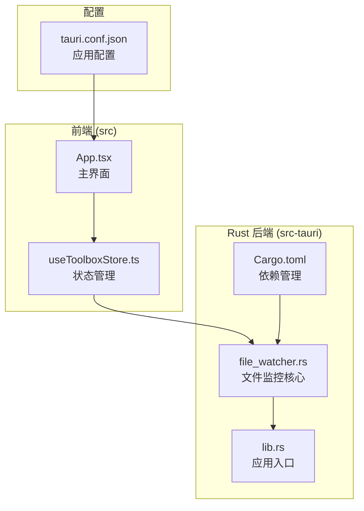
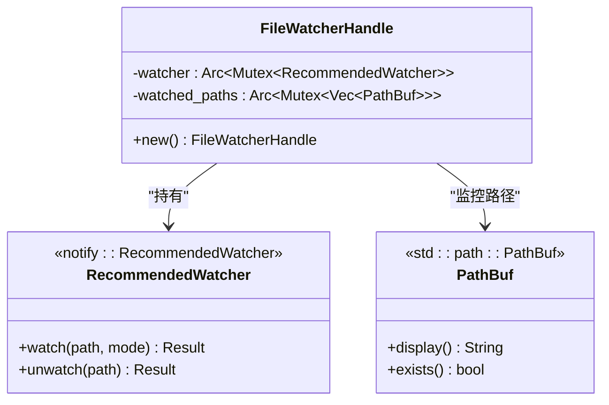
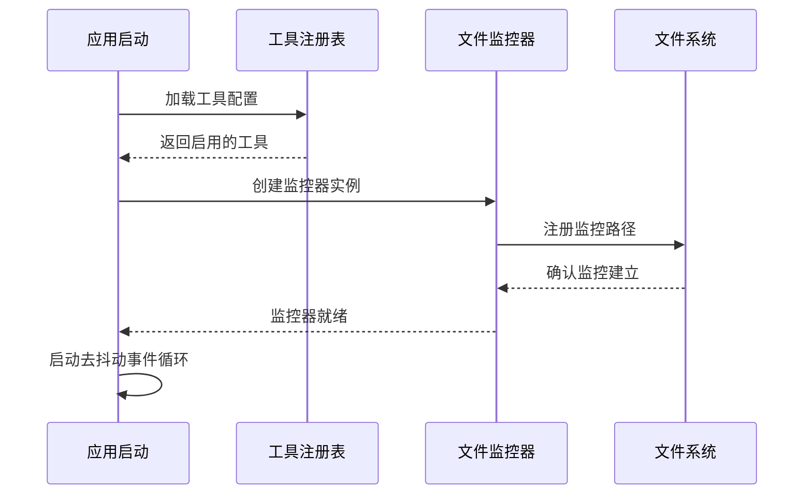
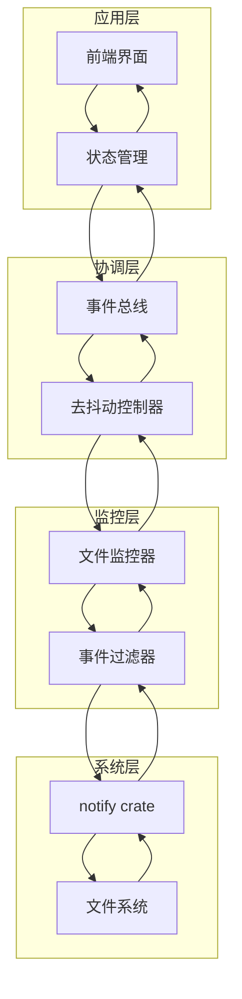
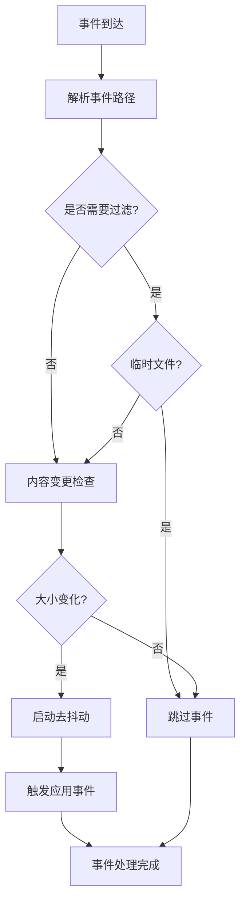
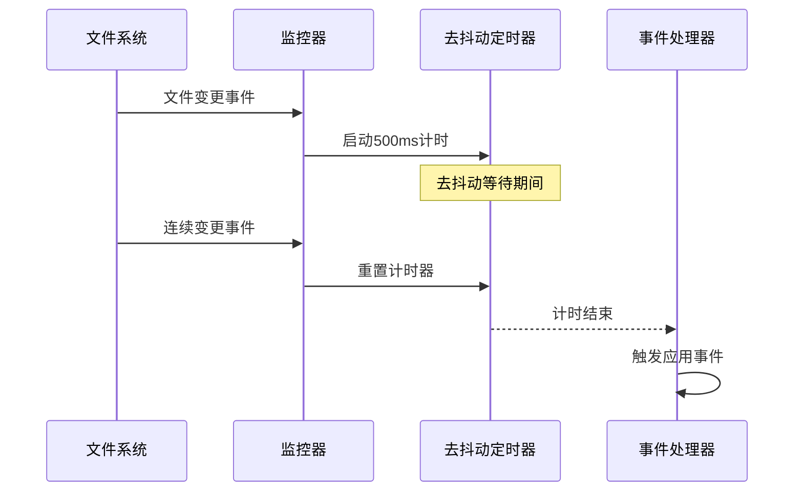
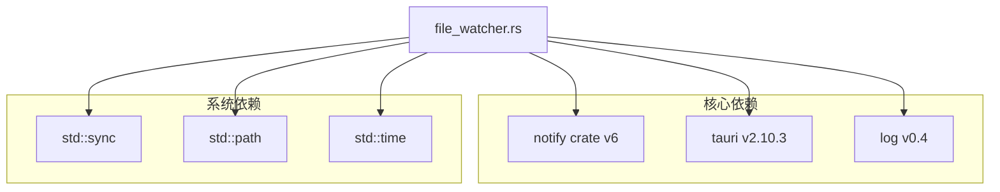
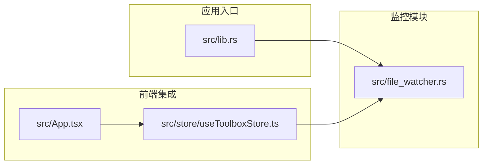
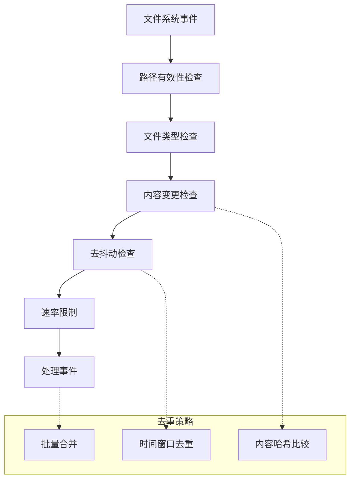
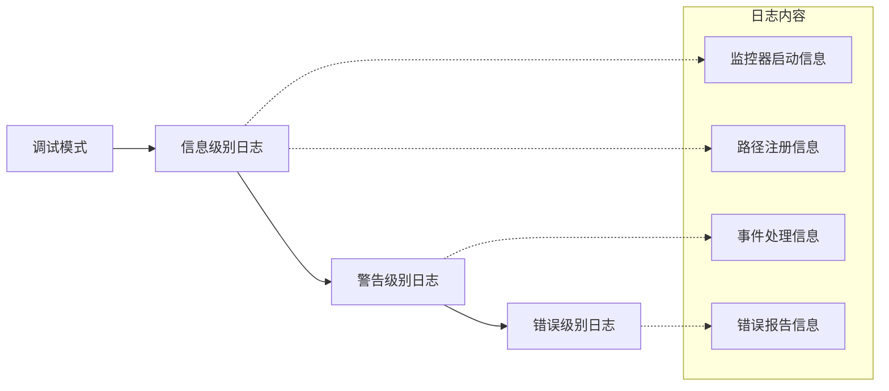

# 文件监控系统

<cite>
**本文档引用的文件**
- [src-tauri/src/file_watcher.rs](file://src-tauri/src/file_watcher.rs)
- [src-tauri/src/lib.rs](file://src-tauri/src/lib.rs)
- [src-tauri/Cargo.toml](file://src-tauri/Cargo.toml)
- [src-tauri/tauri.conf.json](file://src-tauri/tauri.conf.json)
- [src/store/useToolboxStore.ts](file://src/store/useToolboxStore.ts)
- [src/App.tsx](file://src/App.tsx)
</cite>

## 目录
1. [简介](#简介)
2. [项目结构](#项目结构)
3. [核心组件](#核心组件)
4. [架构概览](#架构概览)
5. [详细组件分析](#详细组件分析)
6. [依赖关系分析](#依赖关系分析)
7. [性能考虑](#性能考虑)
8. [故障排除指南](#故障排除指南)
9. [结论](#结论)

## 简介

文件监控系统是 AI Toolbox 应用程序的核心功能之一，负责实时监听用户 AI 开发工具配置文件和技能目录的变更。该系统基于 Rust 的 notify crate 实现，提供了跨平台的文件系统事件监听能力，能够精确识别文件和目录的创建、修改、删除等操作。

系统的主要目标是：
- 实时检测用户配置文件和技能目录的变更
- 提供去抖动机制避免频繁的重复通知
- 支持多种文件类型过滤，排除临时文件和系统文件
- 与前端界面无缝集成，提供即时的状态更新

## 项目结构

文件监控系统主要分布在以下模块中：



**图表来源**
- [src-tauri/src/file_watcher.rs:1-119](file://src-tauri/src/file_watcher.rs#L1-L119)
- [src-tauri/src/lib.rs:1320-1409](file://src-tauri/src/lib.rs#L1320-L1409)

**章节来源**
- [src-tauri/src/file_watcher.rs:1-119](file://src-tauri/src/file_watcher.rs#L1-L119)
- [src-tauri/src/lib.rs:1320-1409](file://src-tauri/src/lib.rs#L1320-L1409)

## 核心组件

### 文件监控处理器 (FileWatcherHandle)

文件监控系统的核心是一个线程安全的处理器结构体，负责管理监控器实例和被监控的路径列表：



**图表来源**
- [src-tauri/src/file_watcher.rs:7-19](file://src-tauri/src/file_watcher.rs#L7-L19)

### 监控器生命周期管理

系统采用智能的生命周期管理模式，确保监控器的正确初始化和清理：



**图表来源**
- [src-tauri/src/lib.rs:1335-1368](file://src-tauri/src/lib.rs#L1335-L1368)
- [src-tauri/src/file_watcher.rs:21-96](file://src-tauri/src/file_watcher.rs#L21-L96)

**章节来源**
- [src-tauri/src/file_watcher.rs:7-19](file://src-tauri/src/file_watcher.rs#L7-L19)
- [src-tauri/src/lib.rs:1335-1368](file://src-tauri/src/lib.rs#L1335-L1368)

## 架构概览

文件监控系统采用分层架构设计，实现了清晰的关注点分离：



**图表来源**
- [src-tauri/src/file_watcher.rs:41-68](file://src-tauri/src/file_watcher.rs#L41-L68)
- [src-tauri/src/lib.rs:1321-1368](file://src-tauri/src/lib.rs#L1321-L1368)

## 详细组件分析

### 文件监控器实现

文件监控器使用 notify crate 的 RecommendedWatcher 来实现跨平台兼容性：

#### 事件处理机制

监控器采用异步事件处理模型，通过回调函数响应文件系统事件：



**图表来源**
- [src-tauri/src/file_watcher.rs:42-63](file://src-tauri/src/file_watcher.rs#L42-L63)

#### 配置参数详解

监控器使用了特定的配置参数来优化性能和准确性：

| 参数 | 值 | 说明 |
|------|-----|------|
| poll_interval | 3秒 | 轮询间隔，平衡响应速度和CPU占用 |
| compare_contents | false | 不比较文件内容，只监听元数据变化 |
| recursive_mode | Recursive | 递归监控整个目录树 |

**章节来源**
- [src-tauri/src/file_watcher.rs:41-68](file://src-tauri/src/file_watcher.rs#L41-L68)

### 路径监控管理

系统支持动态添加和移除监控路径，具有良好的扩展性：

#### 路径过滤策略

监控器实现了多层过滤机制来提高效率：

```mermaid
flowchart LR
AllPaths[所有监控路径] --> Filter1[排除临时文件]
Filter1 --> Filter2[排除日志文件]
Filter2 --> Filter3[排除.git目录]
Filter3 --> Filter4[排除node_modules]
Filter4 --> ActivePaths[活跃监控路径]
subgraph "过滤规则"
Rule1[~ 结尾的临时文件]
Rule2[.tmp 临时文件]
Rule3[.swp Vim交换文件]
Rule4[.bak 备份文件]
Rule5[/node_modules/ 系统依赖]
Rule6[/.git/ 版本控制]
end
Filter1 -.-> Rule1
Filter2 -.-> Rule2
Filter3 -.-> Rule3
Filter4 -.-> Rule4
Filter4 -.-> Rule5
Filter4 -.-> Rule6
```

**图表来源**
- [src-tauri/src/file_watcher.rs:44-53](file://src-tauri/src/file_watcher.rs#L44-L53)

**章节来源**
- [src-tauri/src/file_watcher.rs:98-118](file://src-tauri/src/file_watcher.rs#L98-L118)

### 去抖动机制

为了避免频繁的重复事件触发，系统实现了500毫秒的去抖动延迟：

#### 去抖动工作流程



**图表来源**
- [src-tauri/src/file_watcher.rs:56-62](file://src-tauri/src/file_watcher.rs#L56-L62)

**章节来源**
- [src-tauri/src/file_watcher.rs:56-62](file://src-tauri/src/file_watcher.rs#L56-L62)

## 依赖关系分析

### 外部依赖

文件监控系统主要依赖于以下外部库：



**图表来源**
- [src-tauri/Cargo.toml:20-30](file://src-tauri/Cargo.toml#L20-L30)

### 内部模块依赖

系统内部模块之间的依赖关系清晰明确：



**图表来源**
- [src-tauri/src/lib.rs:1-10](file://src-tauri/src/lib.rs#L1-L10)
- [src-tauri/src/file_watcher.rs:1-6](file://src-tauri/src/file_watcher.rs#L1-L6)

**章节来源**
- [src-tauri/Cargo.toml:20-30](file://src-tauri/Cargo.toml#L20-L30)
- [src-tauri/src/lib.rs:1-10](file://src-tauri/src/lib.rs#L1-L10)

## 性能考虑

### 监控范围控制

系统通过智能的路径选择和过滤机制来控制监控范围：

#### 路径选择策略

1. **工具配置路径**：只监控启用工具的配置文件路径
2. **技能目录**：监控每个工具的技能目录
3. **特殊配置**：额外监控 Claude Code 的配置文件和数据库

#### 过滤优化

- **文件类型过滤**：排除临时文件、备份文件和系统文件
- **目录过滤**：忽略版本控制系统和依赖管理目录
- **路径验证**：只监控存在的有效路径

### 事件去重机制

系统实现了多层次的事件去重策略：



**图表来源**
- [src-tauri/src/file_watcher.rs:44-62](file://src-tauri/src/file_watcher.rs#L44-L62)

### 内存管理优化

系统采用了多种内存管理策略来确保长期运行的稳定性：

- **Arc/Mutex 组合**：使用原子引用计数和互斥锁确保线程安全
- **智能指针**：合理使用所有权转移避免不必要的拷贝
- **资源清理**：在应用退出时正确清理监控器资源

## 故障排除指南

### 常见问题诊断

#### 监控器启动失败

**症状**：应用启动时出现监控器初始化错误

**可能原因**：
1. 监控路径不存在或权限不足
2. notify crate 初始化失败
3. 系统资源限制

**解决方案**：
- 检查监控路径的有效性和访问权限
- 查看系统日志了解具体错误信息
- 减少同时监控的路径数量

#### 事件响应延迟

**症状**：文件变更后界面更新存在明显延迟

**可能原因**：
1. 去抖动时间设置过长
2. CPU 资源紧张
3. 监控路径过多导致性能下降

**解决方案**：
- 调整去抖动时间参数
- 优化监控路径列表
- 检查系统资源使用情况

#### 内存泄漏问题

**症状**：应用运行时间越长内存占用越大

**可能原因**：
1. 监控器实例未正确释放
2. 事件处理器持有过期引用
3. 缓存数据未及时清理

**解决方案**：
- 确保在应用退出时清理监控器
- 检查事件处理器的生命周期管理
- 实施定期的内存使用监控

### 调试技巧

#### 日志分析

系统提供了详细的日志记录功能，可以通过以下方式启用：



**图表来源**
- [src-tauri/src/lib.rs:1326-1332](file://src-tauri/src/lib.rs#L1326-L1332)

**章节来源**
- [src-tauri/src/lib.rs:1326-1332](file://src-tauri/src/lib.rs#L1326-L1332)

## 结论

文件监控系统通过精心设计的架构和优化策略，为 AI Toolbox 提供了稳定可靠的文件变更监听能力。系统的主要优势包括：

1. **跨平台兼容性**：基于 notify crate 实现，支持 Windows、macOS 和 Linux
2. **高性能设计**：通过去抖动、事件过滤和智能路径管理优化性能
3. **易于维护**：清晰的模块划分和完善的错误处理机制
4. **扩展性强**：支持动态路径管理和灵活的配置选项

未来可以考虑的改进方向：
- 实现更精细的事件分类和处理
- 添加监控统计和性能分析功能
- 支持更复杂的过滤规则和自定义监控条件
- 优化大文件监控的性能表现

通过持续的优化和改进，文件监控系统将继续为用户提供流畅、可靠的文件变更监听体验。