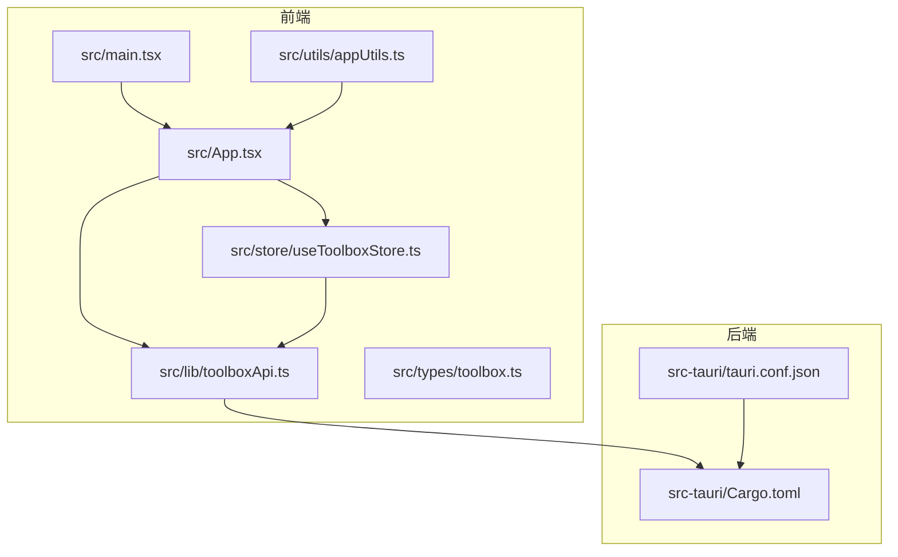
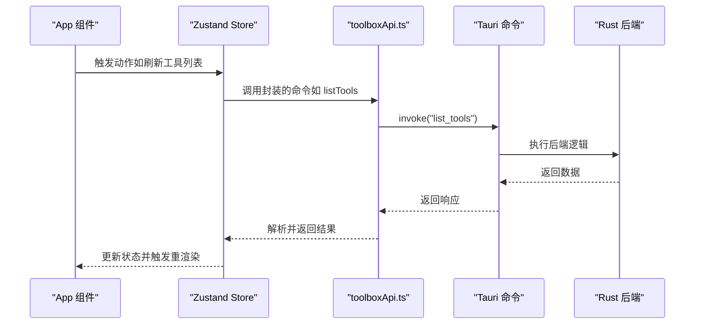
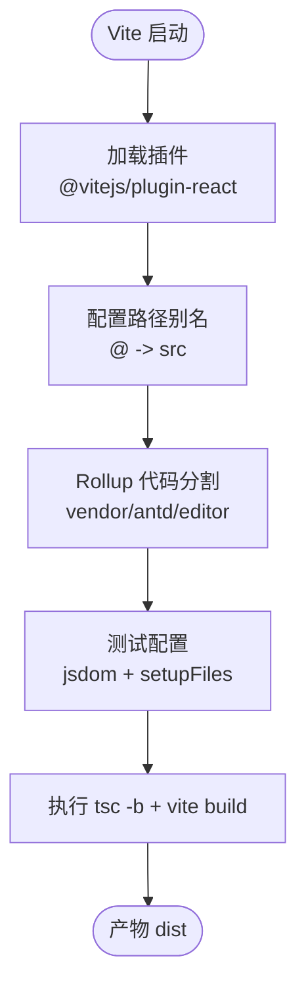
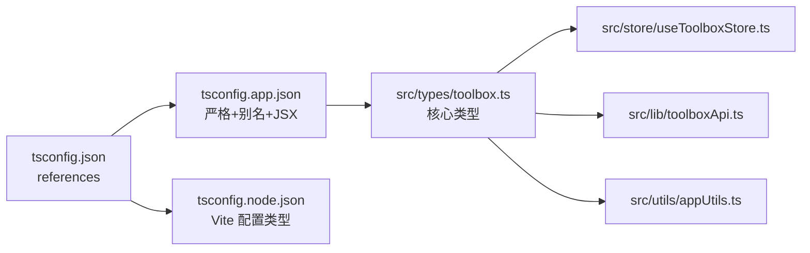
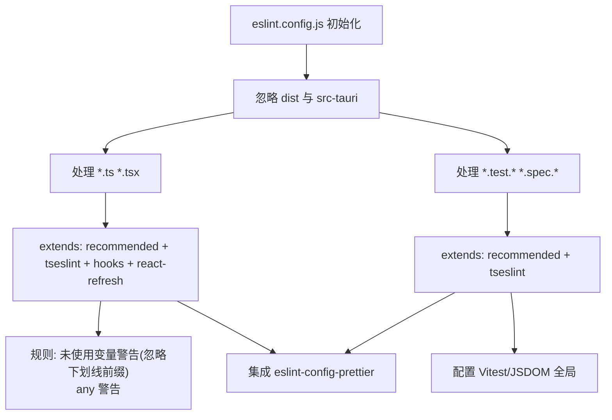
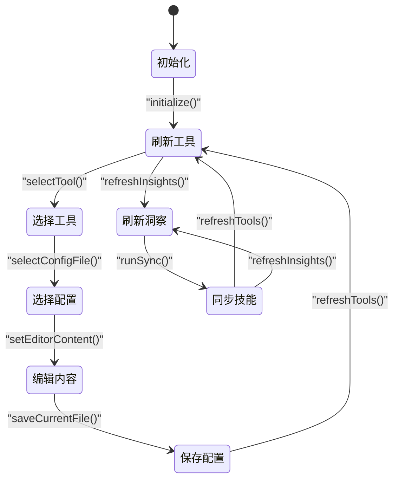
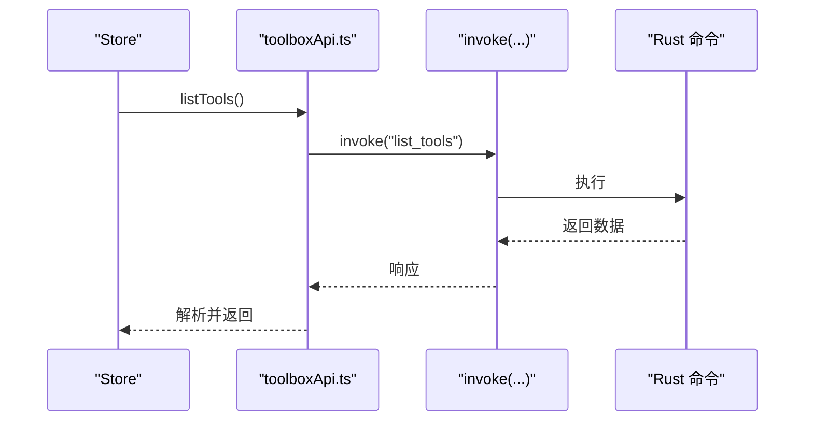
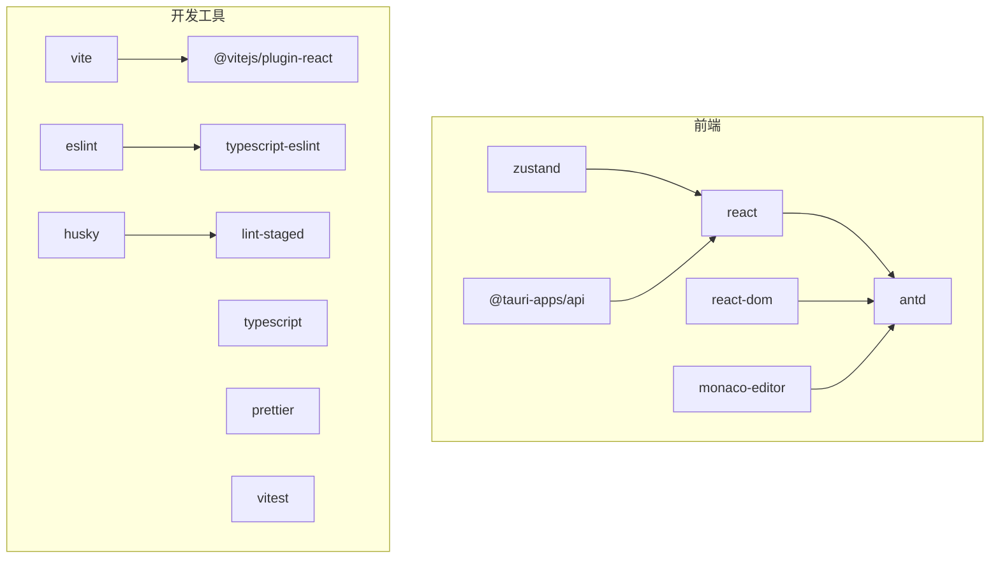

# 开发指南

<cite>
**本文引用的文件**
- [package.json](file://package.json)
- [vite.config.ts](file://vite.config.ts)
- [eslint.config.js](file://eslint.config.js)
- [tsconfig.json](file://tsconfig.json)
- [tsconfig.app.json](file://tsconfig.app.json)
- [tsconfig.node.json](file://tsconfig.node.json)
- [src/main.tsx](file://src/main.tsx)
- [src/App.tsx](file://src/App.tsx)
- [src/lib/toolboxApi.ts](file://src/lib/toolboxApi.ts)
- [src/store/useToolboxStore.ts](file://src/store/useToolboxStore.ts)
- [src/types/toolbox.ts](file://src/types/toolbox.ts)
- [src/utils/appUtils.ts](file://src/utils/appUtils.ts)
- [src-tauri/tauri.conf.json](file://src-tauri/tauri.conf.json)
- [src-tauri/Cargo.toml](file://src-tauri/Cargo.toml)
- [README.md](file://README.md)
</cite>

## 目录
1. [简介](#简介)
2. [项目结构](#项目结构)
3. [核心组件](#核心组件)
4. [架构总览](#架构总览)
5. [详细组件分析](#详细组件分析)
6. [依赖关系分析](#依赖关系分析)
7. [性能考虑](#性能考虑)
8. [故障排查指南](#故障排查指南)
9. [结论](#结论)
10. [附录](#附录)

## 简介
本开发指南面向参与 AI 工具箱项目的开发者，系统性介绍构建配置（Vite、TypeScript、ESLint）、开发环境搭建（依赖安装、环境变量、调试技巧）、代码规范与最佳实践（编码风格、注释规范、测试策略）、扩展开发方法（插件架构、扩展点识别、自定义工具支持）、以及性能优化与调试技巧。内容以仓库现有实现为依据，辅以可视化图表帮助理解。

## 项目结构
项目采用“前端 React + TypeScript + Vite + Ant Design + Zustand”与“后端 Rust + Tauri”的双端架构，前端负责 UI 与状态管理，后端通过 Tauri 暴露命令给前端调用，实现文件系统、技能同步、配置读写等能力。

**图表来源**
- [src/main.tsx:1-12](file://src/main.tsx#L1-L12)
- [src/App.tsx:1-800](file://src/App.tsx#L1-L800)
- [src/lib/toolboxApi.ts:1-784](file://src/lib/toolboxApi.ts#L1-L784)
- [src/store/useToolboxStore.ts:1-556](file://src/store/useToolboxStore.ts#L1-L556)
- [src/types/toolbox.ts:1-152](file://src/types/toolbox.ts#L1-L152)
- [src/utils/appUtils.ts:1-27](file://src/utils/appUtils.ts#L1-L27)
- [src-tauri/tauri.conf.json:1-43](file://src-tauri/tauri.conf.json#L1-L43)
- [src-tauri/Cargo.toml:1-30](file://src-tauri/Cargo.toml#L1-L30)

**章节来源**
- [README.md:44-67](file://README.md#L44-L67)
- [src/main.tsx:1-12](file://src/main.tsx#L1-L12)
- [src-tauri/tauri.conf.json:1-43](file://src-tauri/tauri.conf.json#L1-L43)

## 核心组件
- 应用入口与渲染：前端根组件负责挂载 React 根节点、引入样式与应用主组件。
- 主界面与交互：App 组件承载导航、工具列表、技能面板、编辑器、同步与管理功能。
- API 封装：toolboxApi.ts 对 Tauri 命令进行统一封装，提供类型安全的调用接口。
- 状态管理：useToolboxStore.ts 使用 Zustand 管理工具、配置、技能、反馈、预设等状态。
- 类型定义：toolbox.ts 定义了工具、配置文件、技能、洞察、同步模式等核心类型。
- 工具函数：appUtils.ts 提供运行时检测、路径规范化、时间格式化等通用工具。
- Tauri 配置：tauri.conf.json 定义窗口、打包、安全策略等；Cargo.toml 管理 Rust 依赖。

**章节来源**
- [src/main.tsx:1-12](file://src/main.tsx#L1-L12)
- [src/App.tsx:138-800](file://src/App.tsx#L138-L800)
- [src/lib/toolboxApi.ts:387-784](file://src/lib/toolboxApi.ts#L387-L784)
- [src/store/useToolboxStore.ts:145-556](file://src/store/useToolboxStore.ts#L145-L556)
- [src/types/toolbox.ts:1-152](file://src/types/toolbox.ts#L1-L152)
- [src/utils/appUtils.ts:1-27](file://src/utils/appUtils.ts#L1-L27)
- [src-tauri/tauri.conf.json:1-43](file://src-tauri/tauri.conf.json#L1-L43)
- [src-tauri/Cargo.toml:1-30](file://src-tauri/Cargo.toml#L1-L30)

## 架构总览
前端通过 @tauri-apps/api 与后端通信，调用 toolboxApi.ts 中封装的命令，实现工具发现、配置读写、技能同步、洞察分析等功能。状态管理集中在 Zustand Store，UI 由 React 组件树渲染。

**图表来源**
- [src/App.tsx:214-218](file://src/App.tsx#L214-L218)
- [src/store/useToolboxStore.ts:174-205](file://src/store/useToolboxStore.ts#L174-L205)
- [src/lib/toolboxApi.ts:387-396](file://src/lib/toolboxApi.ts#L387-L396)

**章节来源**
- [src/App.tsx:214-218](file://src/App.tsx#L214-L218)
- [src/store/useToolboxStore.ts:174-205](file://src/store/useToolboxStore.ts#L174-L205)
- [src/lib/toolboxApi.ts:387-396](file://src/lib/toolboxApi.ts#L387-L396)

## 详细组件分析

### Vite 配置与构建优化
- 插件与别名：启用 React 插件与路径别名 @ 指向 src，提升导入便捷性。
- 代码分割：按 vendor、antd、editor 三大块拆分，优化首屏与第三方库加载。
- 测试环境：配置 jsdom 环境、setup 文件与测试文件匹配规则。
- 构建脚本：先执行 tsc -b 生成 TS 构建信息，再由 Vite 打包。

**图表来源**
- [vite.config.ts:6-30](file://vite.config.ts#L6-L30)
- [package.json:6-18](file://package.json#L6-L18)

**章节来源**
- [vite.config.ts:6-30](file://vite.config.ts#L6-L30)
- [package.json:6-18](file://package.json#L6-L18)

### TypeScript 配置与类型体系
- 多 tsconfig 引用：根 tsconfig.json 通过 references 引入 app 与 node 两套配置。
- app 配置：严格模式、bundler 模式、路径别名、JSX、无 emit、严格未使用检查。
- node 配置：仅用于 Vite 配置文件的类型解析，避免污染应用类型。
- 类型集中：核心类型集中在 src/types/toolbox.ts，统一导出给 UI 与 Store 使用。

**图表来源**
- [tsconfig.json:1-8](file://tsconfig.json#L1-L8)
- [tsconfig.app.json:1-37](file://tsconfig.app.json#L1-L37)
- [tsconfig.node.json:1-25](file://tsconfig.node.json#L1-L25)
- [src/types/toolbox.ts:1-152](file://src/types/toolbox.ts#L1-L152)

**章节来源**
- [tsconfig.json:1-8](file://tsconfig.json#L1-L8)
- [tsconfig.app.json:1-37](file://tsconfig.app.json#L1-L37)
- [tsconfig.node.json:1-25](file://tsconfig.node.json#L1-L25)
- [src/types/toolbox.ts:1-152](file://src/types/toolbox.ts#L1-L152)

### ESLint 与代码质量
- 配置结构：flat config 形式，分别针对 ts/tsx 与测试文件设置 extends、globals、rules。
- 推荐规则：继承 recommended、typescript-eslint、react-hooks、react-refresh。
- 测试环境：为 Vitest 全局变量提供只读声明，避免误报。
- 与 Prettier 集成：通过 eslint-config-prettier 关闭与格式化冲突的规则。

**图表来源**
- [eslint.config.js:9-52](file://eslint.config.js#L9-L52)

**章节来源**
- [eslint.config.js:9-52](file://eslint.config.js#L9-L52)

### 状态管理与数据流
- Store 设计：围绕工具、配置文件、技能、洞察、反馈、预设、Claude 配置同步等状态域组织。
- 数据流转：初始化 -> 刷新工具 -> 读取配置 -> 编辑保存 -> 同步/洞察 -> 反馈提示。
- 异常处理：统一通过 buildFeedback 生成带时间戳的反馈消息，便于 UI 展示。

**图表来源**
- [src/store/useToolboxStore.ts:174-410](file://src/store/useToolboxStore.ts#L174-L410)

**章节来源**
- [src/store/useToolboxStore.ts:145-556](file://src/store/useToolboxStore.ts#L145-L556)

### API 封装与命令调用
- 命令封装：对 listTools、readConfigFile、saveConfigFile、syncSkills 等命令进行统一封装，包含预览模式与真实 Tauri 模式分支。
- 类型安全：所有请求/响应参数与返回值均通过类型定义约束。
- 错误处理：统一读取响应中的 message 字段或回退文本，保证 UI 友好提示。

**图表来源**
- [src/lib/toolboxApi.ts:387-396](file://src/lib/toolboxApi.ts#L387-L396)
- [src/store/useToolboxStore.ts:183-205](file://src/store/useToolboxStore.ts#L183-L205)

**章节来源**
- [src/lib/toolboxApi.ts:387-784](file://src/lib/toolboxApi.ts#L387-L784)

### 工具函数与运行时判断
- hasTauriRuntime：判断是否运行在 Tauri 环境，用于条件分支（预览 vs 真实）。
- normalizeFsPath：将 ~ 替换为实际 home 目录并规范化路径。
- formatTime：将 Unix 时间戳格式化为本地中文时间字符串。
- isInteractiveDragTarget：判断事件目标是否为可交互元素，避免误触窗口拖拽。

**章节来源**
- [src/utils/appUtils.ts:1-27](file://src/utils/appUtils.ts#L1-L27)

### Tauri 配置与打包
- 开发与构建：devUrl 指向 Vite 开发服务器，beforeDevCommand 在启动前执行 npm run dev。
- 窗口与透明：Windows 窗口无装饰、透明、可调整大小，设置最小宽高。
- 安全策略：csp 置空，允许前端自由注入样式与脚本。
- 打包图标：多尺寸图标与平台图标集合。

**章节来源**
- [src-tauri/tauri.conf.json:6-41](file://src-tauri/tauri.conf.json#L6-L41)

## 依赖关系分析
- 前端依赖：React、ReactDOM、Ant Design、Monaco Editor、Zustand、@tauri-apps/api。
- 开发依赖：Vite、TypeScript、ESLint、Prettier、React Hooks/Refresh 插件、Husky、lint-staged、Vitest。
- 后端依赖：Tauri、serde、rusqlite、notify、dirs 等。

**图表来源**
- [package.json:29-61](file://package.json#L29-L61)

**章节来源**
- [package.json:29-61](file://package.json#L29-L61)

## 性能考虑
- 代码分割：通过 Vite 的 manualChunks 将第三方库拆分为独立 chunk，减少重复加载与体积。
- 严格类型：开启严格模式与未使用检查，降低运行时错误与冗余计算。
- 状态粒度：Zustand Store 将状态按域划分，避免全局重渲染。
- 路径别名：统一 @/* 别名，减少相对路径层级，提升模块解析效率。
- 预览模式：在非 Tauri 环境下提供 mock 数据，避免阻塞开发流程。

**章节来源**
- [vite.config.ts:13-23](file://vite.config.ts#L13-L23)
- [tsconfig.app.json:10-32](file://tsconfig.app.json#L10-L32)
- [src/lib/toolboxApi.ts:387-400](file://src/lib/toolboxApi.ts#L387-L400)

## 故障排查指南
- 开发启动失败
  - 确认已安装依赖并执行 npm run tauri:dev。
  - 检查 tauri.conf.json 的 devUrl 与 beforeDevCommand 是否正确。
- Tauri 命令调用异常
  - 在 toolboxApi.ts 中检查 hasTauriRuntime 判断与 invoke 参数。
  - 查看后端命令实现是否正确返回数据或抛出错误。
- ESLint 报错
  - 检查 eslint.config.js 的 extends 与 rules 设置，确保与项目类型匹配。
  - 使用 npm run lint 或 npm run lint:fix 自动修复常见问题。
- 路径与权限问题
  - 使用 normalizeFsPath 规范化路径，确认 home 目录与技能目录存在。
  - 在 Windows/macOS 上检查文件系统权限与路径分隔符。

**章节来源**
- [src-tauri/tauri.conf.json:6-10](file://src-tauri/tauri.conf.json#L6-L10)
- [src/lib/toolboxApi.ts:104-110](file://src/lib/toolboxApi.ts#L104-L110)
- [eslint.config.js:9-52](file://eslint.config.js#L9-L52)
- [src/utils/appUtils.ts:10-11](file://src/utils/appUtils.ts#L10-L11)

## 结论
本指南基于仓库现有实现，系统梳理了构建配置、开发环境、代码规范、扩展开发与性能优化要点。建议在新功能开发中遵循现有类型与状态管理模式，保持 API 封装的一致性，并通过 ESLint/Vitest 确保代码质量与可维护性。

## 附录

### 开发环境设置步骤
- 安装依赖：执行 npm install。
- 启动开发：npm run tauri:dev。
- 构建发布：npm run tauri:build。
- 代码检查：npm run lint 与 npm run format。

**章节来源**
- [README.md:76-87](file://README.md#L76-L87)
- [package.json:6-18](file://package.json#L6-L18)

### 代码规范与最佳实践
- 编码风格：统一使用 ESLint + Prettier，flat config 已配置推荐规则与测试全局。
- 注释规范：为复杂逻辑与公共函数添加清晰注释，保持类型定义完整。
- 测试策略：使用 Vitest 编写单元测试，结合 @testing-library/react 进行组件测试。

**章节来源**
- [eslint.config.js:9-52](file://eslint.config.js#L9-L52)
- [vite.config.ts:24-29](file://vite.config.ts#L24-L29)

### 扩展开发方法
- 插件架构：通过 toolboxApi.ts 的 invoke 命令扩展新功能，保持类型定义与 Store 更新同步。
- 扩展点识别：关注 App 组件中的工具列表、技能面板、配置编辑器等区域，按需扩展 UI 与逻辑。
- 自定义工具支持：在工具注册表中新增条目，完善类型定义与 API 封装，确保路径与语言识别正确。

**章节来源**
- [src/lib/toolboxApi.ts:521-580](file://src/lib/toolboxApi.ts#L521-L580)
- [src/types/toolbox.ts:65-72](file://src/types/toolbox.ts#L65-L72)
- [src/App.tsx:758-800](file://src/App.tsx#L758-L800)