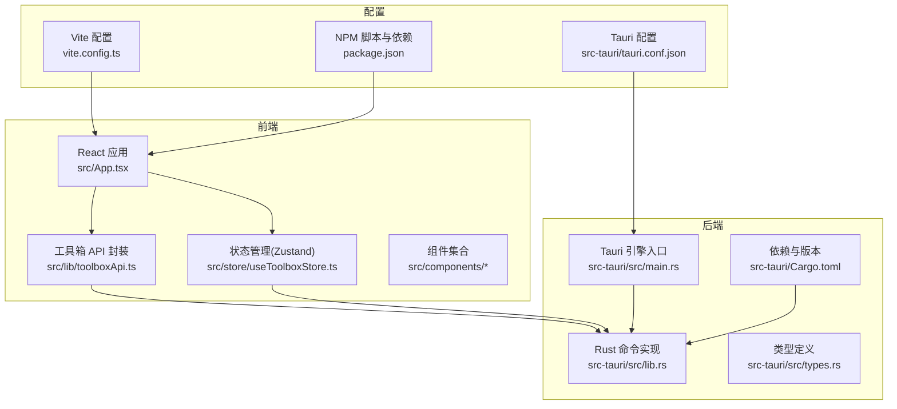
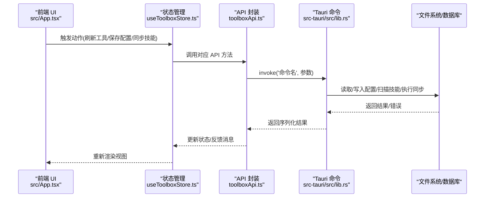
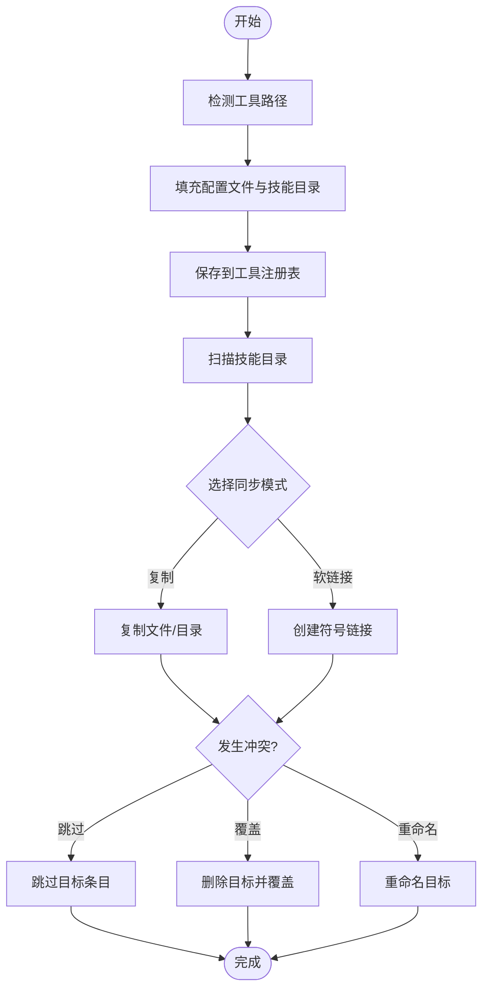
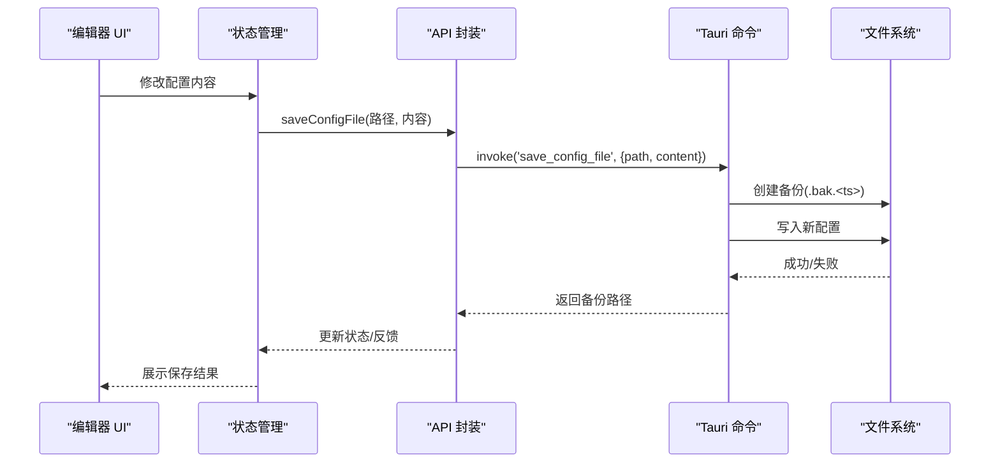
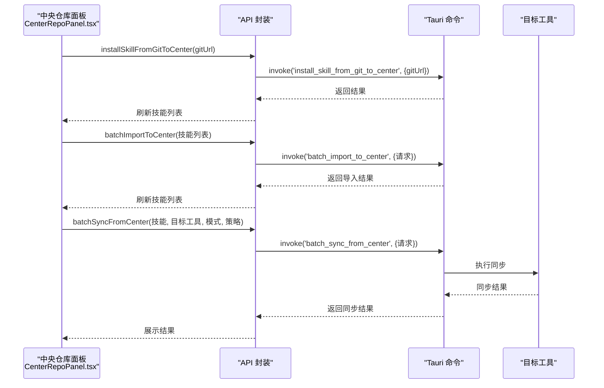
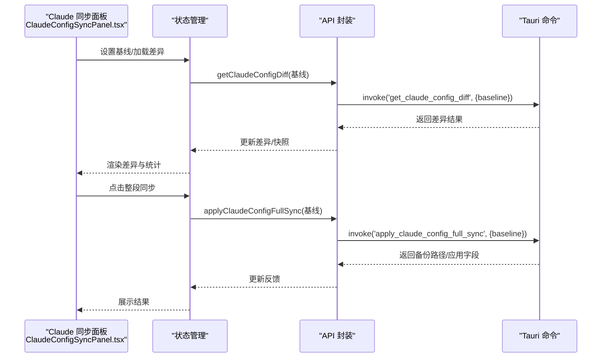
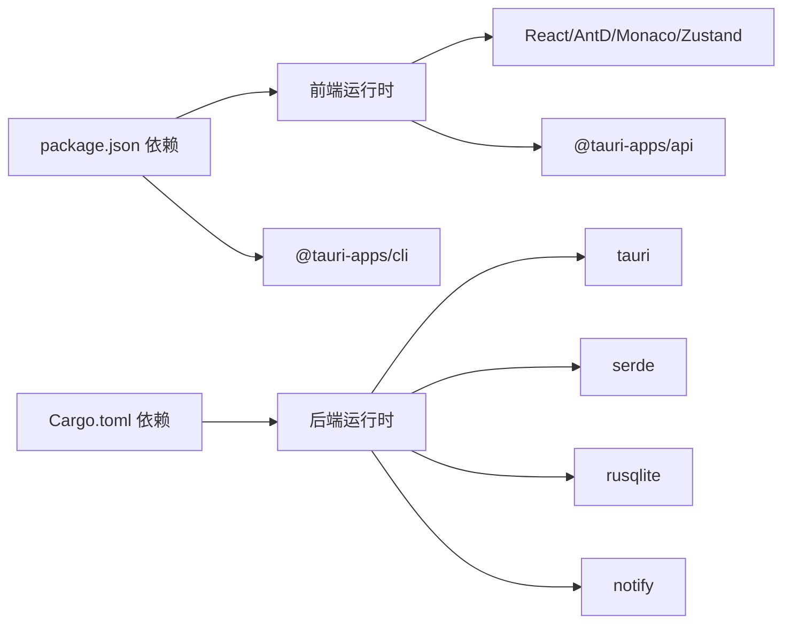

# 快速开始

<cite>
**本文引用的文件**
- [README.md](file://README.md)
- [package.json](file://package.json)
- [vite.config.ts](file://vite.config.ts)
- [src-tauri/tauri.conf.json](file://src-tauri/tauri.conf.json)
- [src-tauri/Cargo.toml](file://src-tauri/Cargo.toml)
- [src-tauri/src/main.rs](file://src-tauri/src/main.rs)
- [src-tauri/src/lib.rs](file://src-tauri/src/lib.rs)
- [src-tauri/src/types.rs](file://src-tauri/src/types.rs)
- [src/App.tsx](file://src/App.tsx)
- [src/lib/toolboxApi.ts](file://src/lib/toolboxApi.ts)
- [src/store/useToolboxStore.ts](file://src/store/useToolboxStore.ts)
- [src/types/toolbox.ts](file://src/types/toolbox.ts)
- [src/components/CenterRepoPanel.tsx](file://src/components/CenterRepoPanel.tsx)
- [src/components/ClaudeConfigSyncPanel.tsx](file://src/components/ClaudeConfigSyncPanel.tsx)
- [AGENTS.md](file://AGENTS.md)
</cite>

## 目录
1. [简介](#简介)
2. [项目结构](#项目结构)
3. [核心组件](#核心组件)
4. [架构总览](#架构总览)
5. [详细组件分析](#详细组件分析)
6. [依赖分析](#依赖分析)
7. [性能考虑](#性能考虑)
8. [故障排除指南](#故障排除指南)
9. [结论](#结论)
10. [附录](#附录)

## 简介
AI 工具箱是一个基于 Tauri + React 的桌面端 Agent 技能管理工具，支持多工具注册与管理、技能同步、配置编辑与变更洞察等功能。本文档提供从环境准备到开发、构建与使用的完整快速开始指南，帮助你快速上手项目。

## 项目结构
该项目采用前后端分离架构：
- 前端：React 19 + TypeScript + Vite + Ant Design 6，负责 UI 交互与状态管理。
- 后端：Rust + Tauri 2，负责工具与技能数据扫描、同步、配置读写与数据库操作。
- 配置：Vite、Tauri CLI、Cargo 管理依赖与构建流程。

图表来源
- [src-tauri/src/main.rs:1-7](file://src-tauri/src/main.rs#L1-L7)
- [src-tauri/src/lib.rs:1-200](file://src-tauri/src/lib.rs#L1-L200)
- [src-tauri/src/types.rs:1-120](file://src-tauri/src/types.rs#L1-L120)
- [src-tauri/Cargo.toml:1-29](file://src-tauri/Cargo.toml#L1-L29)
- [src-tauri/tauri.conf.json:1-42](file://src-tauri/tauri.conf.json#L1-L42)
- [vite.config.ts:1-8](file://vite.config.ts#L1-L8)
- [package.json:1-40](file://package.json#L1-L40)
- [src/App.tsx:1-120](file://src/App.tsx#L1-L120)
- [src/lib/toolboxApi.ts:1-60](file://src/lib/toolboxApi.ts#L1-L60)
- [src/store/useToolboxStore.ts:1-80](file://src/store/useToolboxStore.ts#L1-L80)

章节来源
- [README.md:44-67](file://README.md#L44-L67)
- [package.json:1-40](file://package.json#L1-L40)
- [vite.config.ts:1-8](file://vite.config.ts#L1-L8)
- [src-tauri/tauri.conf.json:1-42](file://src-tauri/tauri.conf.json#L1-L42)
- [src-tauri/Cargo.toml:1-29](file://src-tauri/Cargo.toml#L1-L29)

## 核心组件
- 前端应用入口与路由：React 组件树由 App.tsx 驱动，负责工具列表、技能列表、配置编辑、同步面板与中央仓库面板等模块。
- API 封装：toolboxApi.ts 提供与后端 Tauri 命令通信的统一接口，包括工具列表、技能洞察、配置读写、技能同步、预设与 Claude 配置同步等。
- 状态管理：useToolboxStore.ts 使用 Zustand 管理全局状态，包括工具、配置文件、技能洞察、反馈消息、预设与 Claude 配置差异等。
- 后端命令：lib.rs 定义了 list_tools、get_skill_insights、read_config_file、save_config_file、sync_skills 等 Tauri 命令，以及工具注册表、技能扫描、冲突处理等逻辑。
- 类型系统：toolbox.ts 与 types.rs 定义了前端与后端共享的数据结构，保证前后端数据契约一致。

章节来源
- [src/App.tsx:1-120](file://src/App.tsx#L1-L120)
- [src/lib/toolboxApi.ts:1-120](file://src/lib/toolboxApi.ts#L1-L120)
- [src/store/useToolboxStore.ts:1-120](file://src/store/useToolboxStore.ts#L1-L120)
- [src-tauri/src/lib.rs:513-740](file://src-tauri/src/lib.rs#L513-L740)
- [src/types/toolbox.ts:1-155](file://src/types/toolbox.ts#L1-L155)
- [src-tauri/src/types.rs:1-120](file://src-tauri/src/types.rs#L1-L120)

## 架构总览
下图展示了从浏览器到 Tauri 命令的调用链路，以及前端状态与后端数据的交互：

图表来源
- [src/App.tsx:320-480](file://src/App.tsx#L320-L480)
- [src/lib/toolboxApi.ts:390-475](file://src/lib/toolboxApi.ts#L390-L475)
- [src-tauri/src/lib.rs:513-740](file://src-tauri/src/lib.rs#L513-L740)

章节来源
- [src/App.tsx:320-480](file://src/App.tsx#L320-L480)
- [src/lib/toolboxApi.ts:390-475](file://src/lib/toolboxApi.ts#L390-L475)
- [src-tauri/src/lib.rs:513-740](file://src-tauri/src/lib.rs#L513-L740)

## 详细组件分析

### 组件一：工具注册与技能同步
- 注册工具：通过工具注册表管理工具 ID、名称、配置文件与技能目录，支持检测工具路径与保存/删除工具。
- 技能同步：支持复制与软链接两种模式，冲突策略包括跳过、覆盖与重命名，支持批量同步与预设应用。

图表来源
- [src/lib/toolboxApi.ts:527-607](file://src/lib/toolboxApi.ts#L527-L607)
- [src-tauri/src/lib.rs:476-511](file://src-tauri/src/lib.rs#L476-L511)

章节来源
- [src/lib/toolboxApi.ts:527-607](file://src/lib/toolboxApi.ts#L527-L607)
- [src-tauri/src/lib.rs:476-511](file://src-tauri/src/lib.rs#L476-L511)

### 组件二：配置编辑与备份
- 配置读取：根据工具与配置文件定位路径，读取内容并在编辑器中展示。
- 配置保存：保存前创建备份文件，支持列出备份并进行恢复。
- 自动保存：开启自动保存时，内容变更后延迟保存以减少频繁 IO。

图表来源
- [src/lib/toolboxApi.ts:423-444](file://src/lib/toolboxApi.ts#L423-L444)
- [src-tauri/src/lib.rs:748-766](file://src-tauri/src/lib.rs#L748-L766)

章节来源
- [src/lib/toolboxApi.ts:423-444](file://src/lib/toolboxApi.ts#L423-L444)
- [src-tauri/src/lib.rs:748-766](file://src-tauri/src/lib.rs#L748-L766)

### 组件三：中央仓库与技能导入/同步
- 中央仓库：集中管理技能来源（自定义/Git），支持按状态过滤、批量导入与批量同步。
- Git 安装：支持从 Git 仓库安装技能到中央仓库。
- 同步到工具：将中央仓库中的技能批量同步到目标工具，遵循冲突策略。

图表来源
- [src/components/CenterRepoPanel.tsx:144-200](file://src/components/CenterRepoPanel.tsx#L144-L200)
- [src/lib/toolboxApi.ts:639-682](file://src/lib/toolboxApi.ts#L639-L682)
- [src-tauri/src/lib.rs:299-400](file://src-tauri/src/lib.rs#L299-L400)

章节来源
- [src/components/CenterRepoPanel.tsx:144-200](file://src/components/CenterRepoPanel.tsx#L144-L200)
- [src/lib/toolboxApi.ts:639-682](file://src/lib/toolboxApi.ts#L639-L682)
- [src-tauri/src/lib.rs:299-400](file://src-tauri/src/lib.rs#L299-L400)

### 组件四：Claude 配置同步
- 配置差异：比较 settings.json 与 cc-switch 的字段差异，支持 live、richest 与 snapshot 基线。
- 整段同步：将差异字段应用到 cc-switch，生成备份并提示同步结果。

图表来源
- [src/components/ClaudeConfigSyncPanel.tsx:108-160](file://src/components/ClaudeConfigSyncPanel.tsx#L108-L160)
- [src/lib/toolboxApi.ts:739-751](file://src/lib/toolboxApi.ts#L739-L751)
- [src-tauri/src/lib.rs:1-200](file://src-tauri/src/lib.rs#L1-L200)

章节来源
- [src/components/ClaudeConfigSyncPanel.tsx:108-160](file://src/components/ClaudeConfigSyncPanel.tsx#L108-L160)
- [src/lib/toolboxApi.ts:739-751](file://src/lib/toolboxApi.ts#L739-L751)
- [src-tauri/src/lib.rs:1-200](file://src-tauri/src/lib.rs#L1-L200)

## 依赖分析
- 前端依赖：React、Ant Design、Monaco Editor、Zustand、@tauri-apps/api 等。
- 后端依赖：tauri、serde、rusqlite、notify、md-5 等。
- 构建与脚本：Vite、Tauri CLI、TypeScript、ESLint 等。

图表来源
- [package.json:14-38](file://package.json#L14-L38)
- [src-tauri/Cargo.toml:20-29](file://src-tauri/Cargo.toml#L20-L29)

章节来源
- [package.json:14-38](file://package.json#L14-L38)
- [src-tauri/Cargo.toml:20-29](file://src-tauri/Cargo.toml#L20-L29)

## 性能考虑
- 文件系统操作：复制/软链接与冲突处理在后端执行，避免前端阻塞主线程。
- 延迟保存：自动保存开启时，内容变更后延迟保存，减少频繁 IO。
- 技能扫描：仅扫描启用工具的技能目录，避免无意义遍历。
- 数据库：使用 rusqlite 进行轻量级持久化，配合索引与去重策略提升查询效率。

## 故障排除指南
- 无法启动开发服务器
  - 确认 Node.js 与 npm 已正确安装，执行依赖安装后再启动开发服务器。
  - 若端口被占用，调整 Tauri 开发端口或释放端口。
- Tauri 命令调用失败
  - 检查后端命令是否在 lib.rs 中正确定义并导出。
  - 确认前端 invoke 的命令名与参数与后端签名一致。
- 配置保存失败
  - 检查目标路径权限与父目录是否存在，必要时手动创建目录。
  - 查看备份文件是否生成，以便回滚。
- 技能同步异常
  - 检查源工具与目标工具的技能目录是否存在。
  - 根据冲突策略选择合适的处理方式（跳过/覆盖/重命名）。
- 中央仓库安装/同步失败
  - 确认 Git URL 可访问，网络代理设置正确。
  - 检查目标工具是否已注册并启用。

章节来源
- [src/lib/toolboxApi.ts:423-444](file://src/lib/toolboxApi.ts#L423-L444)
- [src-tauri/src/lib.rs:748-766](file://src-tauri/src/lib.rs#L748-L766)
- [src-tauri/src/lib.rs:476-511](file://src-tauri/src/lib.rs#L476-L511)
- [src/components/CenterRepoPanel.tsx:144-200](file://src/components/CenterRepoPanel.tsx#L144-L200)

## 结论
通过本文档，你可以完成环境准备、开发环境搭建、依赖安装、开发服务器启动与构建流程，并掌握工具注册、技能同步与中央仓库的基本使用方法。遇到问题时，可参考故障排除指南进行定位与解决。

## 附录

### 环境准备与安装
- Node.js 与 npm：用于前端依赖安装与开发脚本执行。
- Rust 工具链：用于编译 Tauri 后端与 Cargo 管理。
- Tauri CLI：用于启动开发模式与打包构建。
- 平台工具：根据目标平台安装额外依赖（如 macOS 的 Xcode 命令行工具、Windows 的 Visual Studio Build Tools）。

章节来源
- [README.md:69-87](file://README.md#L69-L87)
- [package.json:6-13](file://package.json#L6-L13)
- [src-tauri/tauri.conf.json:6-11](file://src-tauri/tauri.conf.json#L6-L11)
- [src-tauri/Cargo.toml:9-9](file://src-tauri/Cargo.toml#L9-L9)

### 开发环境搭建
- 安装依赖：执行前端依赖安装与后端依赖安装。
- 启动开发：使用 Tauri 开发脚本启动前端与后端联调。
- 预览构建：构建前端产物并由 Tauri 打包为桌面应用。

章节来源
- [README.md:76-87](file://README.md#L76-L87)
- [package.json:6-13](file://package.json#L6-L13)
- [vite.config.ts:1-8](file://vite.config.ts#L1-L8)
- [src-tauri/tauri.conf.json:6-11](file://src-tauri/tauri.conf.json#L6-L11)

### 基本使用教程
- 注册工具：打开“管理工具”面板，填写工具 ID/名称、配置文件与技能目录，点击保存。
- 配置技能目录：在工具列表中选择工具，进入“配置编辑”页签，查看与编辑配置文件。
- 执行技能同步：在“技能”页签选择技能，选择目标工具与同步模式，点击同步。
- 中央仓库：打开“中央仓库”面板，从 Git 安装技能或从其他工具导入，再批量同步到目标工具。

章节来源
- [src/App.tsx:323-440](file://src/App.tsx#L323-L440)
- [src/lib/toolboxApi.ts:446-473](file://src/lib/toolboxApi.ts#L446-L473)
- [src/components/CenterRepoPanel.tsx:144-200](file://src/components/CenterRepoPanel.tsx#L144-L200)

### Git 与回滚安全规则
- 每个新需求必须先创建独立分支，执行回滚、切换分支、清理文件前必须先检查状态。
- 回滚前必须备份当前改动，推荐生成 patch 或创建备份分支并提交。

章节来源
- [AGENTS.md:18-44](file://AGENTS.md#L18-L44)