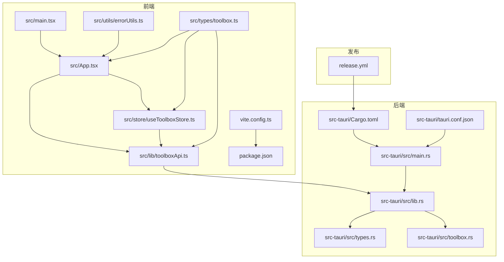
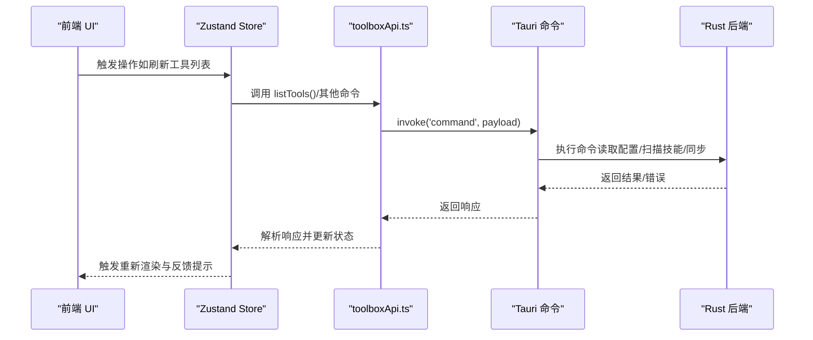
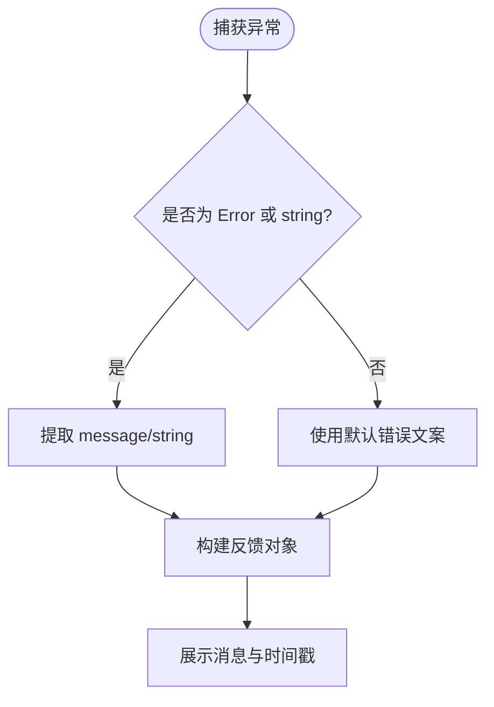
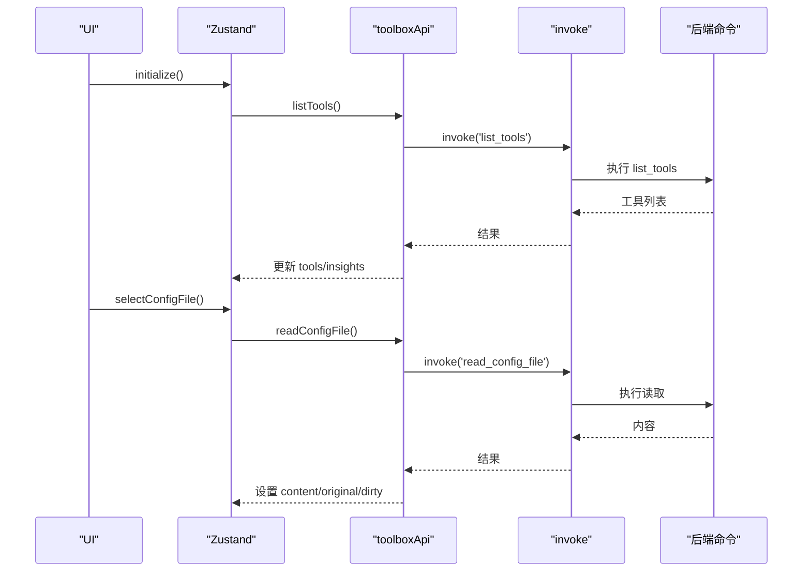
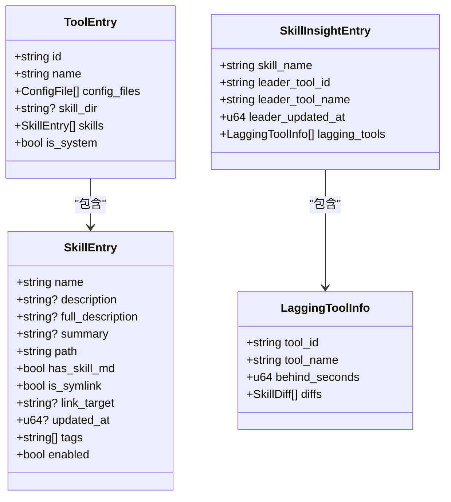
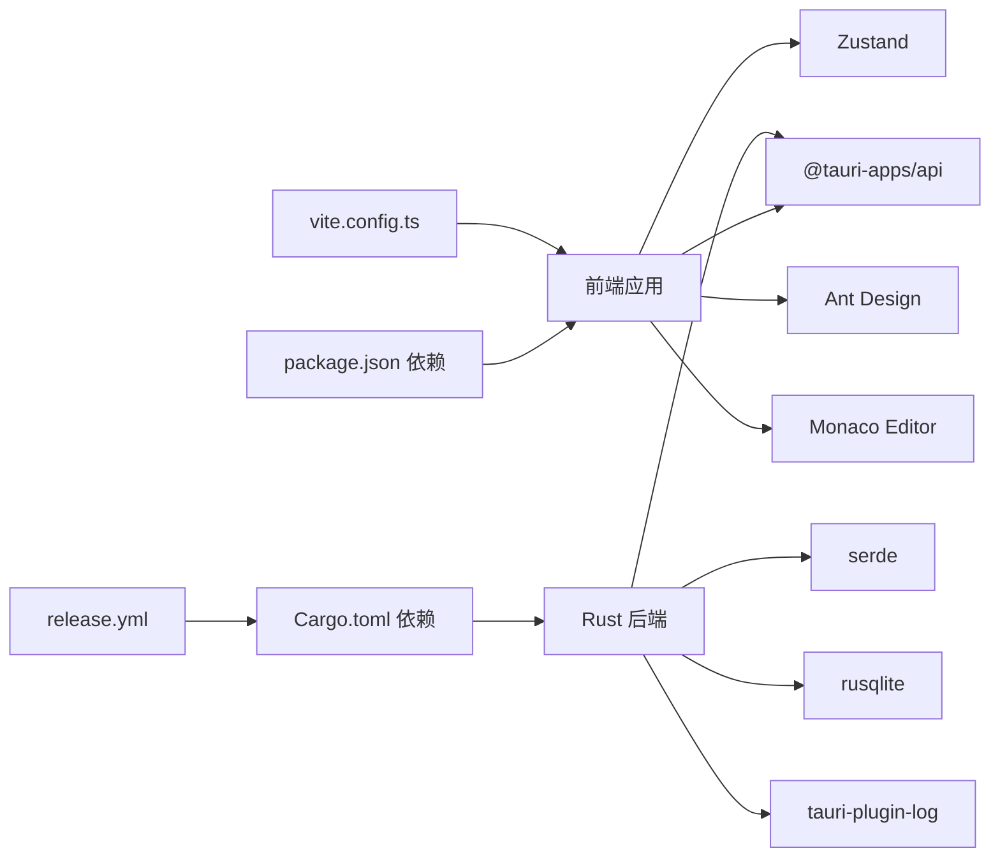

# 故障排除

<cite>
**本文引用的文件**
- [package.json](file://package.json)
- [README.md](file://README.md)
- [vite.config.ts](file://vite.config.ts)
- [.github/workflows/release.yml](file://.github/workflows/release.yml)
- [src-tauri/tauri.conf.json](file://src-tauri/tauri.conf.json)
- [src-tauri/Cargo.toml](file://src-tauri/Cargo.toml)
- [src-tauri/src/main.rs](file://src-tauri/src/main.rs)
- [src-tauri/src/lib.rs](file://src-tauri/src/lib.rs)
- [src-tauri/src/types.rs](file://src-tauri/src/types.rs)
- [src-tauri/src/toolbox.rs](file://src-tauri/src/toolbox.rs)
- [src/main.tsx](file://src/main.tsx)
- [src/App.tsx](file://src/App.tsx)
- [src/lib/toolboxApi.ts](file://src/lib/toolboxApi.ts)
- [src/store/useToolboxStore.ts](file://src/store/useToolboxStore.ts)
- [src/utils/errorUtils.ts](file://src/utils/errorUtils.ts)
- [src/types/toolbox.ts](file://src/types/toolbox.ts)
</cite>

## 目录
1. [简介](#简介)
2. [项目结构](#项目结构)
3. [核心组件](#核心组件)
4. [架构总览](#架构总览)
5. [详细组件分析](#详细组件分析)
6. [依赖关系分析](#依赖关系分析)
7. [性能考虑](#性能考虑)
8. [故障排除指南](#故障排除指南)
9. [结论](#结论)
10. [附录](#附录)

## 简介
本指南聚焦于 AI 工具箱项目的故障排除，覆盖安装、运行、性能三类问题，提供系统化的诊断方法与解决步骤。内容涵盖日志分析、性能监控、错误追踪技巧，以及调试工具使用（浏览器开发者工具、Rust 调试器、Tauri 调试模式）。同时给出常见错误的根因分析与修复步骤，包括文件权限、路径解析、网络连接等问题，并提供性能优化建议与内存泄漏检测思路。

## 项目结构
AI 工具箱采用 Tauri + React 架构，前端使用 Vite + React 19 + TypeScript，后端使用 Rust，通过 Tauri 命令桥接前后端。关键目录与文件如下：
- 前端入口与构建：src/main.tsx、vite.config.ts、package.json
- 应用主界面与状态：src/App.tsx、src/store/useToolboxStore.ts
- 前端命令封装：src/lib/toolboxApi.ts
- 错误统一处理：src/utils/errorUtils.ts
- 类型定义：src/types/toolbox.ts
- 后端配置与命令：src-tauri/tauri.conf.json、src-tauri/Cargo.toml、src-tauri/src/lib.rs、src-tauri/src/main.rs、src-tauri/src/types.rs、src-tauri/src/toolbox.rs
- 发布流程：.github/workflows/release.yml

**图表来源**
- [src/main.tsx:1-12](file://src/main.tsx#L1-L12)
- [src/App.tsx:1-120](file://src/App.tsx#L1-L120)
- [src/store/useToolboxStore.ts:1-120](file://src/store/useToolboxStore.ts#L1-L120)
- [src/lib/toolboxApi.ts:1-60](file://src/lib/toolboxApi.ts#L1-L60)
- [src/utils/errorUtils.ts:1-10](file://src/utils/errorUtils.ts#L1-L10)
- [src/types/toolbox.ts:1-60](file://src/types/toolbox.ts#L1-L60)
- [vite.config.ts:1-31](file://vite.config.ts#L1-L31)
- [package.json:1-63](file://package.json#L1-L63)
- [src-tauri/src/main.rs:1-7](file://src-tauri/src/main.rs#L1-L7)
- [src-tauri/src/lib.rs:1-40](file://src-tauri/src/lib.rs#L1-L40)
- [src-tauri/src/types.rs:1-60](file://src-tauri/src/types.rs#L1-L60)
- [src-tauri/src/toolbox.rs:1-60](file://src-tauri/src/toolbox.rs#L1-L60)
- [src-tauri/Cargo.toml:1-30](file://src-tauri/Cargo.toml#L1-L30)
- [src-tauri/tauri.conf.json:1-43](file://src-tauri/tauri.conf.json#L1-L43)
- [.github/workflows/release.yml:1-59](file://.github/workflows/release.yml#L1-L59)

**章节来源**
- [README.md:44-96](file://README.md#L44-L96)
- [package.json:6-19](file://package.json#L6-L19)
- [vite.config.ts:1-31](file://vite.config.ts#L1-L31)
- [src-tauri/tauri.conf.json:1-43](file://src-tauri/tauri.conf.json#L1-L43)
- [src-tauri/Cargo.toml:1-30](file://src-tauri/Cargo.toml#L1-L30)

## 核心组件
- 前端应用入口与渲染：负责挂载 React 根节点与全局样式。
- 主界面与交互：提供工具列表、配置编辑、技能同步、中央仓库等功能。
- 状态管理：集中管理工具、配置文件、技能洞察、反馈提示等状态。
- 命令封装层：通过 Tauri invoke 调用后端命令，统一封装请求与响应。
- 错误处理：统一从异常对象提取可读错误信息。
- 后端命令与类型：定义工具、技能、同步、洞察等数据结构与命令实现。

**章节来源**
- [src/main.tsx:1-12](file://src/main.tsx#L1-L12)
- [src/App.tsx:138-260](file://src/App.tsx#L138-L260)
- [src/store/useToolboxStore.ts:145-210](file://src/store/useToolboxStore.ts#L145-L210)
- [src/lib/toolboxApi.ts:387-465](file://src/lib/toolboxApi.ts#L387-L465)
- [src/utils/errorUtils.ts:5-9](file://src/utils/errorUtils.ts#L5-L9)
- [src/types/toolbox.ts:33-92](file://src/types/toolbox.ts#L33-L92)

## 架构总览
前端通过 @tauri-apps/api 的 invoke 与后端建立通信，后端以 Tauri 命令形式暴露能力，命令参数与返回值由 Rust 类型定义约束，最终在前端进行 UI 展示与用户反馈。

**图表来源**
- [src/lib/toolboxApi.ts:387-465](file://src/lib/toolboxApi.ts#L387-L465)
- [src/store/useToolboxStore.ts:183-205](file://src/store/useToolboxStore.ts#L183-L205)
- [src-tauri/src/lib.rs:620-628](file://src-tauri/src/lib.rs#L620-L628)

**章节来源**
- [src/lib/toolboxApi.ts:104-110](file://src/lib/toolboxApi.ts#L104-L110)
- [src-tauri/src/lib.rs:615-618](file://src-tauri/src/lib.rs#L615-L618)

## 详细组件分析

### 前端错误处理与反馈
- 统一错误提取：从未知错误中提取可读消息，避免直接展示内部异常细节。
- 反馈提示：通过状态管理构建反馈对象，驱动 UI 展示成功/错误/信息提示。
- 用户体验：在关键操作（读取、保存、同步、洞察）失败时，提供明确的错误文案与时间戳。

**图表来源**
- [src/utils/errorUtils.ts:5-9](file://src/utils/errorUtils.ts#L5-L9)
- [src/store/useToolboxStore.ts:198-201](file://src/store/useToolboxStore.ts#L198-L201)

**章节来源**
- [src/utils/errorUtils.ts:1-10](file://src/utils/errorUtils.ts#L1-L10)
- [src/store/useToolboxStore.ts:198-201](file://src/store/useToolboxStore.ts#L198-L201)

### 前端状态与命令调用链
- 初始化：首次加载时拉取工具列表与技能洞察。
- 读取配置：按需加载配置文件内容，标记脏/已加载状态。
- 保存配置：提交内容并返回备份路径或保存结果。
- 同步技能：选择源工具、目标工具与技能集合，执行同步并刷新状态。

**图表来源**
- [src/store/useToolboxStore.ts:174-205](file://src/store/useToolboxStore.ts#L174-L205)
- [src/lib/toolboxApi.ts:407-417](file://src/lib/toolboxApi.ts#L407-L417)
- [src-tauri/src/lib.rs:620-628](file://src-tauri/src/lib.rs#L620-L628)

**章节来源**
- [src/store/useToolboxStore.ts:174-283](file://src/store/useToolboxStore.ts#L174-L283)
- [src/lib/toolboxApi.ts:407-436](file://src/lib/toolboxApi.ts#L407-L436)

### 后端命令与数据结构
- 命令定义：通过 #[tauri::command] 注解暴露函数，参数与返回值由 Rust 类型定义。
- 数据结构：ToolEntry、SkillEntry、SkillInsightEntry、SyncSkillOutcome 等，确保前后端契约一致。
- 文件操作：路径解析、冲突策略（跳过/覆盖/重命名）、软链接与复制、目录递归拷贝等。

**图表来源**
- [src-tauri/src/types.rs:37-93](file://src-tauri/src/types.rs#L37-L93)
- [src/types/toolbox.ts:86-92](file://src/types/toolbox.ts#L86-L92)

**章节来源**
- [src-tauri/src/types.rs:9-151](file://src-tauri/src/types.rs#L9-L151)
- [src/types/toolbox.ts:86-92](file://src/types/toolbox.ts#L86-L92)

## 依赖关系分析
- 前端依赖：React、Ant Design、Monaco Editor、Zustand、@tauri-apps/api。
- 后端依赖：tauri、tauri-plugin-log、serde、rusqlite、notify、dirs 等。
- 构建与打包：Vite、Tauri CLI、Rust 编译链。
- 发布流程：GitHub Actions 在打标签时自动构建多平台安装包。

**图表来源**
- [package.json:29-61](file://package.json#L29-L61)
- [src-tauri/Cargo.toml:20-30](file://src-tauri/Cargo.toml#L20-L30)
- [vite.config.ts:1-31](file://vite.config.ts#L1-L31)
- [.github/workflows/release.yml:1-59](file://.github/workflows/release.yml#L1-L59)

**章节来源**
- [package.json:29-61](file://package.json#L29-L61)
- [src-tauri/Cargo.toml:20-30](file://src-tauri/Cargo.toml#L20-L30)
- [vite.config.ts:1-31](file://vite.config.ts#L1-L31)
- [.github/workflows/release.yml:1-59](file://.github/workflows/release.yml#L1-L59)

## 性能考虑
- 前端性能
  - 代码分割：vendor、antd、editor 等分包，减少首屏体积。
  - 状态粒度：Zustand 精准更新，避免不必要的重渲染。
  - 异步加载：按需读取配置文件，延迟计算与排序。
- 后端性能
  - 文件系统操作：路径解析与存在性检查前置，减少 IO。
  - 冲突策略：根据策略选择跳过/覆盖/重命名，避免重复 IO。
  - 日志与插件：合理配置日志级别，避免高频写入影响性能。

**章节来源**
- [vite.config.ts:13-23](file://vite.config.ts#L13-L23)
- [src/store/useToolboxStore.ts:264-283](file://src/store/useToolboxStore.ts#L264-L283)
- [src-tauri/src/lib.rs:519-537](file://src-tauri/src/lib.rs#L519-L537)

## 故障排除指南

### 一、安装问题
- 症状
  - macOS 提示“无法打开”，或安装后无响应。
  - Windows 安装包无法运行或报错。
- 诊断
  - 确认下载自官方 Releases，校验版本号与平台匹配。
  - macOS：系统设置 > 隐私与安全性，允许来自“已识别开发者”的应用。
  - Windows：以管理员身份运行，检查杀软拦截。
- 解决
  - 重新下载安装包，清理缓存后重试。
  - 如为沙盒/权限限制导致，调整系统权限或以管理员运行。

**章节来源**
- [README.md:13-18](file://README.md#L13-L18)

### 二、运行问题
- 症状
  - 开发模式无法启动或热更新失效。
  - 预览模式与 Tauri 模式行为不一致。
- 诊断
  - 检查前端开发服务器端口与 beforeDevCommand 是否冲突。
  - 确认 Tauri 命令是否正确注册，前端 invoke 是否命中后端命令。
  - 查看控制台与日志输出，区分预览与 Tauri 环境差异。
- 解决
  - 修改开发端口或关闭占用进程。
  - 确保命令名大小写与注解一致，前后端契约匹配。
  - 使用 Tauri 调试模式查看底层日志。

**章节来源**
- [src-tauri/tauri.conf.json:6-11](file://src-tauri/tauri.conf.json#L6-L11)
- [src/lib/toolboxApi.ts:104-110](file://src/lib/toolboxApi.ts#L104-L110)

### 三、性能问题
- 症状
  - 工具列表加载缓慢、配置文件读取卡顿、同步耗时长。
- 诊断
  - 前端：检查是否一次性加载过多配置文件，是否存在重复渲染。
  - 后端：检查磁盘 IO、路径解析与冲突策略开销。
- 优化
  - 前端：按需加载、分页/虚拟滚动、缓存最近访问的配置。
  - 后端：优先使用 exists 标记，减少重复 stat；对大目录采用增量扫描。

**章节来源**
- [src/store/useToolboxStore.ts:247-283](file://src/store/useToolboxStore.ts#L247-L283)
- [src-tauri/src/lib.rs:450-517](file://src-tauri/src/lib.rs#L450-L517)

### 四、日志分析
- 前端日志
  - 使用 message 组件展示反馈，结合时间戳定位问题发生时刻。
  - 对关键错误调用 getErrorMessage 提升可读性。
- 后端日志
  - 通过 tauri-plugin-log 输出日志，注意日志级别与目标。
  - 在命令执行前后打印关键参数与返回值，便于回溯。
- 日志位置
  - 前端：浏览器控制台与页面反馈。
  - 后端：系统日志或 Tauri 日志文件（取决于平台与配置）。

**章节来源**
- [src/store/useToolboxStore.ts:200-201](file://src/store/useToolboxStore.ts#L200-L201)
- [src/utils/errorUtils.ts:5-9](file://src/utils/errorUtils.ts#L5-L9)
- [src-tauri/Cargo.toml:24-25](file://src-tauri/Cargo.toml#L24-L25)

### 五、性能监控与错误追踪
- 前端
  - 使用 React DevTools 检查组件渲染次数与 props 变更。
  - 使用浏览器性能面板观察主线程阻塞点。
- 后端
  - 使用 perf、valgrind 或 rust 的 -Zinstrument-coverage 进行采样。
  - 对热点函数添加计时与统计，定位慢点。
- 错误追踪
  - 前端：统一错误提取与反馈，记录时间戳与操作上下文。
  - 后端：命令级 try/catch 包裹，返回结构化错误信息。

**章节来源**
- [src/App.tsx:250-258](file://src/App.tsx#L250-L258)
- [src/store/useToolboxStore.ts:332-338](file://src/store/useToolboxStore.ts#L332-L338)

### 六、调试工具使用
- 浏览器开发者工具
  - Network：查看 invoke 请求与响应，确认命令名与参数。
  - Console：查看错误堆栈与 message 提示。
  - Performance：分析 UI 卡顿原因。
- Rust 调试器
  - 使用 cargo run 或 rust-lldb/lldb-vscode 调试后端命令。
  - 在命令入口与关键路径设置断点，逐步执行。
- Tauri 调试模式
  - 使用 tauri dev 启动，结合日志插件输出详细信息。
  - 在 tauri.conf.json 中调整窗口与安全策略，便于调试。

**章节来源**
- [src-tauri/tauri.conf.json:12-30](file://src-tauri/tauri.conf.json#L12-L30)
- [src-tauri/src/main.rs:1-7](file://src-tauri/src/main.rs#L1-L7)

### 七、常见错误根因与修复
- 文件权限问题
  - 根因：读取/写入配置文件或技能目录权限不足。
  - 修复：提升目录权限或以管理员运行；检查家目录权限。
- 路径解析错误
  - 根因：相对路径拼接错误、符号链接目标不可达。
  - 修复：使用后端统一的 home_path 与 canonicalize；校验符号链接有效性。
- 网络连接问题
  - 根因：安装/更新/中心仓库访问受限。
  - 修复：检查代理与防火墙；必要时更换镜像源或离线导入。

**章节来源**
- [src-tauri/src/lib.rs:21-25](file://src-tauri/src/lib.rs#L21-L25)
- [src-tauri/src/lib.rs:578-589](file://src-tauri/src/lib.rs#L578-L589)

### 八、性能优化与内存泄漏检测
- 性能优化
  - 前端：拆分大组件、使用 memo 与选择器；减少深层订阅。
  - 后端：避免重复 IO，合并批量操作；使用索引与缓存。
- 内存泄漏检测
  - 前端：使用 React DevTools Profiler 与浏览器内存快照。
  - 后端：使用 valgrind/memflow 检测；关注长生命周期集合与闭包持有。

**章节来源**
- [src/store/useToolboxStore.ts:1-556](file://src/store/useToolboxStore.ts#L1-L556)
- [src-tauri/src/lib.rs:450-517](file://src-tauri/src/lib.rs#L450-L517)

### 九、社区支持与问题反馈
- 社区渠道
  - Issues：在仓库提交问题，附带版本、操作系统、复现步骤与日志。
  - 讨论区：用于经验分享与最佳实践交流。
- 反馈流程
  - 准备信息：版本号、平台、操作步骤、预期/实际结果。
  - 附加证据：日志片段、屏幕截图、最小可复现步骤。
  - 关注跟进：及时回复维护者提问，协助定位与验证修复。

**章节来源**
- [README.md:1-119](file://README.md#L1-L119)

## 结论
本指南提供了从安装到运行、从性能到调试的全链路故障排除方法。通过统一的错误提取、结构化的命令与类型定义、完善的日志与调试手段，能够快速定位并解决常见问题。建议在开发与运维过程中持续沉淀日志与监控指标，形成闭环的质量保障体系。

## 附录
- 快速检查清单
  - 确认版本与平台匹配，下载自官方渠道。
  - 开发模式端口无冲突，Tauri 命令注册正确。
  - 前端按需加载与状态隔离，后端 IO 与冲突策略合理。
  - 使用调试工具定位问题，保留日志与截图以便反馈。