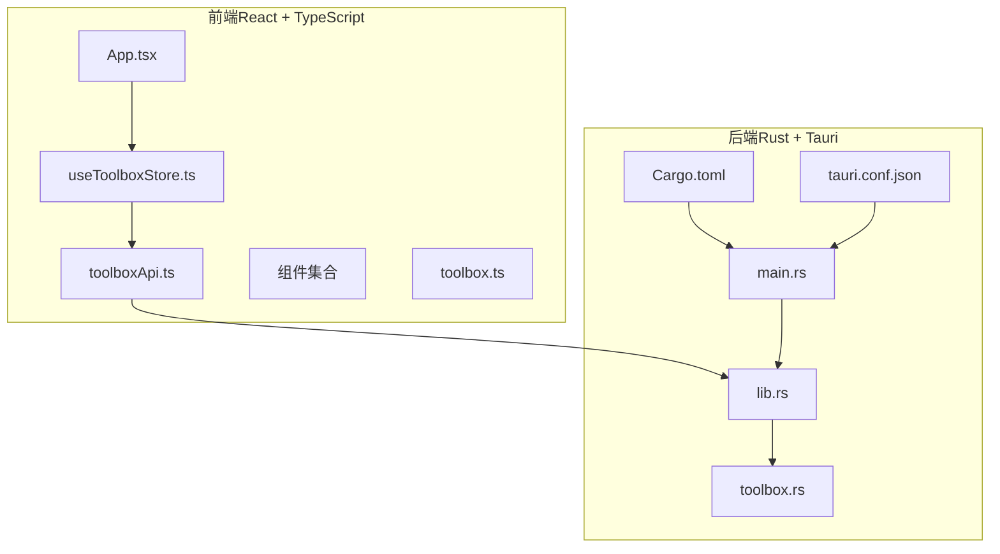
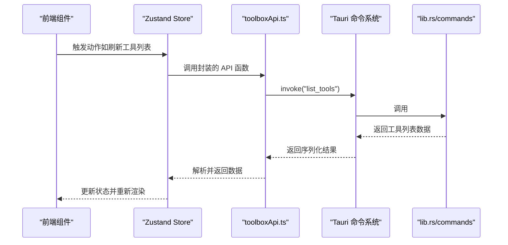
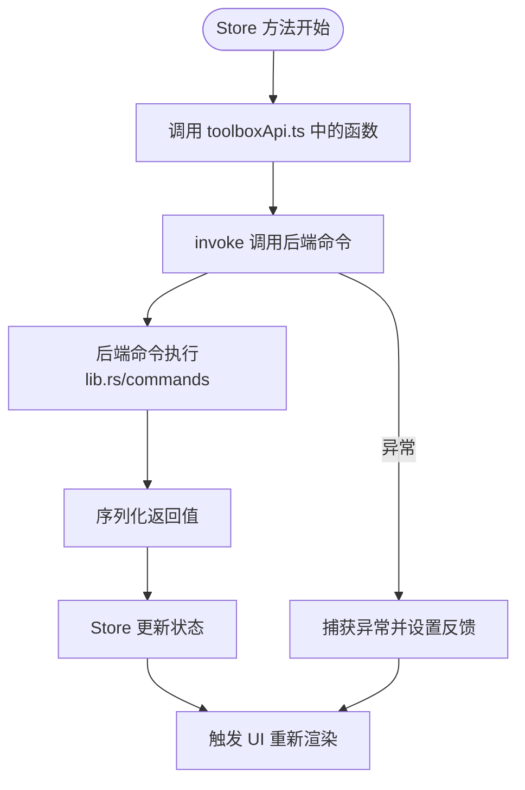
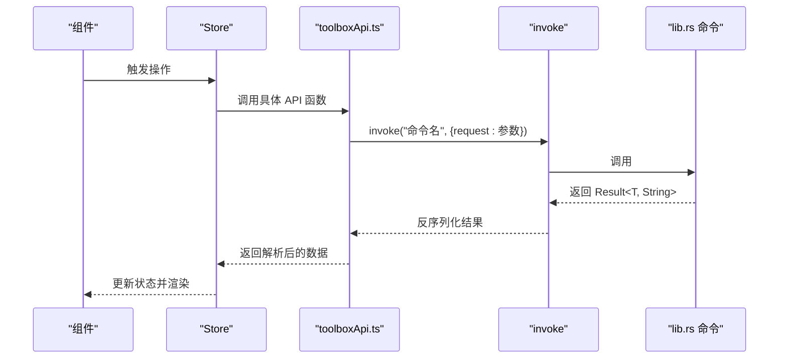
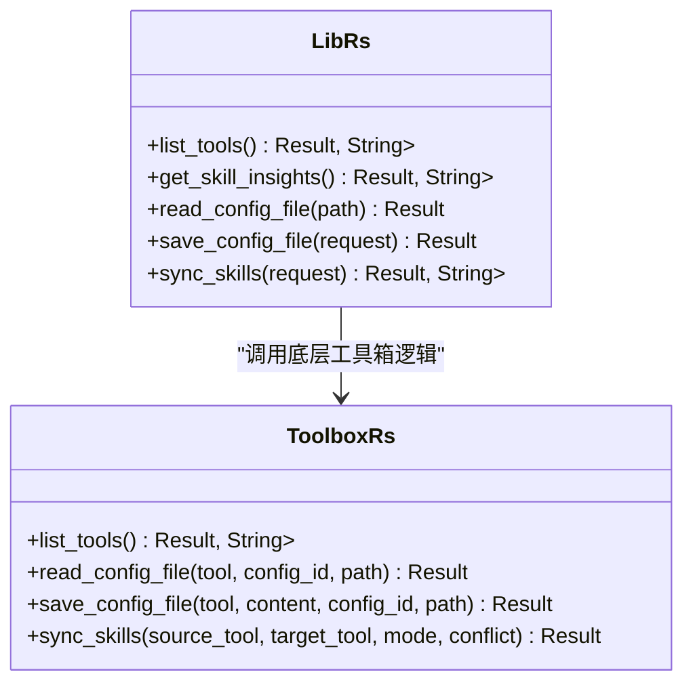
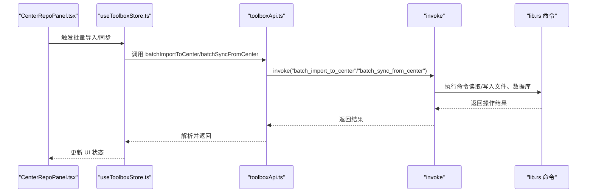
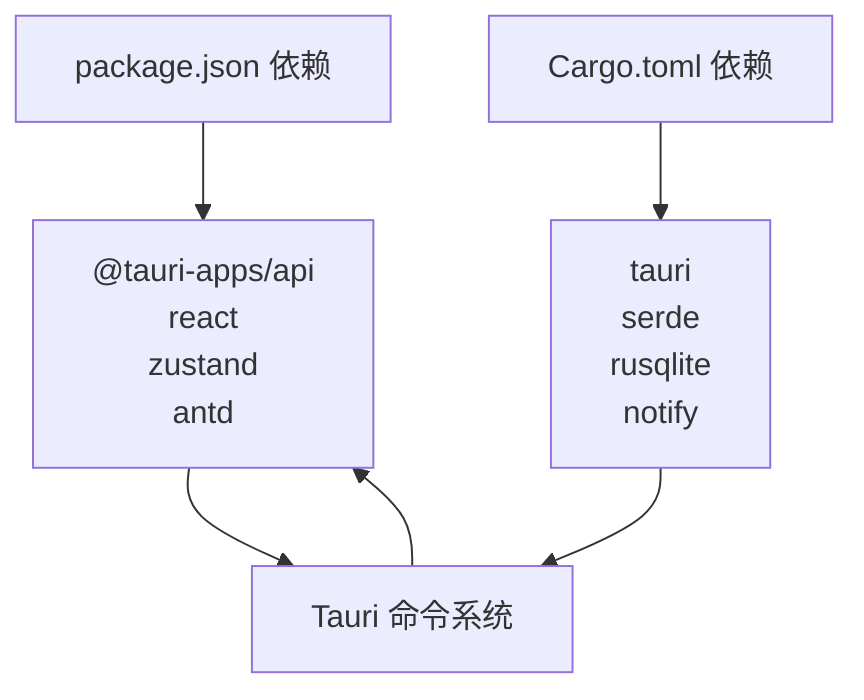

# 前后端分离架构

<cite>
**本文档引用的文件**
- [README.md](file://README.md)
- [package.json](file://package.json)
- [src-tauri/Cargo.toml](file://src-tauri/Cargo.toml)
- [src-tauri/tauri.conf.json](file://src-tauri/tauri.conf.json)
- [src/main.tsx](file://src/main.tsx)
- [src/App.tsx](file://src/App.tsx)
- [src/lib/toolboxApi.ts](file://src/lib/toolboxApi.ts)
- [src/store/useToolboxStore.ts](file://src/store/useToolboxStore.ts)
- [src/types/toolbox.ts](file://src/types/toolbox.ts)
- [src-tauri/src/lib.rs](file://src-tauri/src/lib.rs)
- [src-tauri/src/toolbox.rs](file://src-tauri/src/toolbox.rs)
- [src-tauri/src/main.rs](file://src-tauri/src/main.rs)
- [src/components/CenterRepoPanel.tsx](file://src/components/CenterRepoPanel.tsx)
- [src/components/ClaudeConfigSyncPanel.tsx](file://src/components/ClaudeConfigSyncPanel.tsx)
</cite>

## 目录
1. [引言](#引言)
2. [项目结构](#项目结构)
3. [核心组件](#核心组件)
4. [架构总览](#架构总览)
5. [详细组件分析](#详细组件分析)
6. [依赖关系分析](#依赖关系分析)
7. [性能考虑](#性能考虑)
8. [故障排除指南](#故障排除指南)
9. [结论](#结论)

## 引言
本项目采用前后端分离架构，前端基于 React + TypeScript + Vite，后端基于 Rust + Tauri 2，通过 Tauri 的命令系统实现前端与后端的无缝集成。前端负责用户界面与状态管理，后端负责文件系统操作、数据库访问与业务逻辑处理。Zustand 作为轻量级状态管理库，协调前端 UI 与后端数据持久化之间的交互。

## 项目结构
项目采用典型的“前端 + 后端”分层组织：
- 前端（src/）：React 应用、类型定义、状态管理、API 封装与组件
- 后端（src-tauri/）：Rust 应用、Tauri 命令实现、数据库与存储模块

**图表来源**
- [src/App.tsx:1-800](file://src/App.tsx#L1-L800)
- [src/lib/toolboxApi.ts:1-784](file://src/lib/toolboxApi.ts#L1-L784)
- [src/store/useToolboxStore.ts:1-556](file://src/store/useToolboxStore.ts#L1-L556)
- [src-tauri/src/main.rs:1-7](file://src-tauri/src/main.rs#L1-L7)
- [src-tauri/src/lib.rs:1-800](file://src-tauri/src/lib.rs#L1-L800)
- [src-tauri/src/toolbox.rs:1-800](file://src-tauri/src/toolbox.rs#L1-L800)
- [src-tauri/Cargo.toml:1-30](file://src-tauri/Cargo.toml#L1-L30)
- [src-tauri/tauri.conf.json:1-43](file://src-tauri/tauri.conf.json#L1-L43)

**章节来源**
- [README.md:44-67](file://README.md#L44-L67)
- [package.json:1-63](file://package.json#L1-L63)
- [src-tauri/Cargo.toml:1-30](file://src-tauri/Cargo.toml#L1-L30)
- [src-tauri/tauri.conf.json:1-43](file://src-tauri/tauri.conf.json#L1-L43)

## 核心组件
- 前端应用入口与主界面：负责渲染 UI、处理用户交互、调用状态管理与 API 层
- 状态管理（Zustand）：集中管理工具列表、配置文件内容、同步状态、反馈消息等
- API 封装（toolboxApi.ts）：统一封装 Tauri 命令调用，提供类型安全的函数接口
- 后端命令实现（lib.rs、toolbox.rs）：实现文件系统操作、数据库访问、技能同步等核心逻辑
- 组件层：如中央仓库面板、Claude 配置同步面板等，负责具体业务场景的 UI 与交互

**章节来源**
- [src/App.tsx:1-800](file://src/App.tsx#L1-L800)
- [src/store/useToolboxStore.ts:1-556](file://src/store/useToolboxStore.ts#L1-L556)
- [src/lib/toolboxApi.ts:1-784](file://src/lib/toolboxApi.ts#L1-L784)
- [src-tauri/src/lib.rs:1-800](file://src-tauri/src/lib.rs#L1-L800)
- [src-tauri/src/toolbox.rs:1-800](file://src-tauri/src/toolbox.rs#L1-L800)

## 架构总览
前端通过 @tauri-apps/api 的 invoke 接口调用后端命令，后端命令通过 #[tauri::command] 注解暴露给前端。命令参数与返回值通过 serde 进行序列化/反序列化，确保类型安全与跨语言兼容。Zustand 管理前端状态，与后端数据库/文件系统进行协调。

**图表来源**
- [src/lib/toolboxApi.ts:387-396](file://src/lib/toolboxApi.ts#L387-L396)
- [src-tauri/src/lib.rs:615-628](file://src-tauri/src/lib.rs#L615-L628)
- [src/store/useToolboxStore.ts:183-205](file://src/store/useToolboxStore.ts#L183-L205)

## 详细组件分析

### 前端状态管理（Zustand）
- 职责边界：集中管理应用状态（工具列表、配置文件内容、同步状态、反馈消息等），避免组件间重复请求与状态同步问题
- 协调模式：Store 方法内部调用 toolboxApi.ts 中的函数，这些函数通过 invoke 调用后端命令，完成后更新本地状态并触发 UI 重新渲染
- 错误处理：Store 在异步操作中捕获异常，构造反馈消息并通过 UI 展示

**图表来源**
- [src/store/useToolboxStore.ts:174-205](file://src/store/useToolboxStore.ts#L174-L205)
- [src/lib/toolboxApi.ts:387-396](file://src/lib/toolboxApi.ts#L387-L396)
- [src-tauri/src/lib.rs:615-628](file://src-tauri/src/lib.rs#L615-L628)

**章节来源**
- [src/store/useToolboxStore.ts:1-556](file://src/store/useToolboxStore.ts#L1-L556)

### API 封装与命令调用机制
- 统一入口：toolboxApi.ts 将所有 Tauri 命令封装为前端可直接调用的函数，隐藏 invoke 细节
- 参数与返回值：通过类型定义（toolbox.ts）约束参数结构与返回值格式，确保前后端一致性
- 预览模式：当检测到无 Tauri 运行时，API 返回模拟数据，便于前端开发与测试
- 错误处理：API 对 invoke 结果进行解析与错误提取，必要时抛出异常供上层处理

**图表来源**
- [src/lib/toolboxApi.ts:438-465](file://src/lib/toolboxApi.ts#L438-L465)
- [src-tauri/src/lib.rs:782-800](file://src-tauri/src/lib.rs#L782-L800)

**章节来源**
- [src/lib/toolboxApi.ts:1-784](file://src/lib/toolboxApi.ts#L1-L784)
- [src/types/toolbox.ts:1-152](file://src/types/toolbox.ts#L1-L152)

### 后端命令实现（lib.rs 与 toolbox.rs）
- 命令暴露：通过 #[tauri::command] 注解将 Rust 函数暴露为前端可调用的命令
- 数据持久化：使用 rusqlite 访问数据库，结合文件系统操作实现配置与技能数据的持久化
- 业务逻辑：实现工具扫描、技能同步、配置读写、差异分析等核心功能
- 类型安全：通过 serde 对命令参数与返回值进行序列化/反序列化，保证跨语言数据一致性

**图表来源**
- [src-tauri/src/lib.rs:615-780](file://src-tauri/src/lib.rs#L615-L780)
- [src-tauri/src/toolbox.rs:219-400](file://src-tauri/src/toolbox.rs#L219-L400)

**章节来源**
- [src-tauri/src/lib.rs:1-800](file://src-tauri/src/lib.rs#L1-L800)
- [src-tauri/src/toolbox.rs:1-800](file://src-tauri/src/toolbox.rs#L1-L800)

### 前端组件与后端数据持久化的协调
- 中央仓库面板：负责技能的导入、同步、分类等操作，通过 Store 调用 API，后端命令执行实际的文件系统操作
- Claude 配置同步面板：展示配置差异、支持快照选择与整段同步，后端命令读取配置文件与数据库并生成差异报告

**图表来源**
- [src/components/CenterRepoPanel.tsx:99-167](file://src/components/CenterRepoPanel.tsx#L99-L167)
- [src/lib/toolboxApi.ts:640-644](file://src/lib/toolboxApi.ts#L640-L644)
- [src-tauri/src/lib.rs:782-800](file://src-tauri/src/lib.rs#L782-L800)

**章节来源**
- [src/components/CenterRepoPanel.tsx:1-200](file://src/components/CenterRepoPanel.tsx#L1-L200)
- [src/components/ClaudeConfigSyncPanel.tsx:1-200](file://src/components/ClaudeConfigSyncPanel.tsx#L1-L200)

## 依赖关系分析
- 前端依赖：React、Zustand、Ant Design、Monaco Editor、@tauri-apps/api
- 后端依赖：tauri、serde、rusqlite、notify、dirs 等
- 配置文件：package.json（前端依赖）、Cargo.toml（后端依赖）、tauri.conf.json（Tauri 构建配置）

**图表来源**
- [package.json:29-38](file://package.json#L29-L38)
- [src-tauri/Cargo.toml:20-30](file://src-tauri/Cargo.toml#L20-L30)

**章节来源**
- [package.json:1-63](file://package.json#L1-L63)
- [src-tauri/Cargo.toml:1-30](file://src-tauri/Cargo.toml#L1-L30)
- [src-tauri/tauri.conf.json:1-43](file://src-tauri/tauri.conf.json#L1-L43)

## 性能考虑
- 前端渲染优化：使用 React.memo、useMemo、useCallback 等避免不必要的重渲染
- 状态粒度控制：Zustand 将状态按功能域拆分，减少全局状态变更带来的重渲染范围
- 后端 I/O 优化：文件系统操作与数据库访问尽量批量处理，避免频繁磁盘 IO
- 命令调用批量化：对多次调用进行合并或去抖，降低 Tauri 命令往返次数

## 故障排除指南
- 命令调用失败：检查 invoke 参数是否符合类型定义，确认后端命令是否正确实现
- 状态未更新：确认 Store 方法中的 try/catch 是否捕获异常并设置反馈，检查 UI 是否订阅了对应状态
- 文件权限问题：后端命令涉及文件系统操作时，确保应用具有相应权限
- 预览模式差异：在无 Tauri 运行时，API 返回模拟数据，注意与真实行为的差异

**章节来源**
- [src/store/useToolboxStore.ts:198-204](file://src/store/useToolboxStore.ts#L198-L204)
- [src/lib/toolboxApi.ts:104-110](file://src/lib/toolboxApi.ts#L104-L110)

## 结论
本项目通过 React + Tauri 的前后端分离架构，实现了桌面端 Agent 技能管理工具的高效开发与部署。前端专注于用户体验与状态管理，后端专注于数据持久化与业务逻辑，两者通过 Tauri 命令系统实现类型安全的数据交换。该架构具备良好的扩展性与维护性，适合持续迭代与功能扩展。