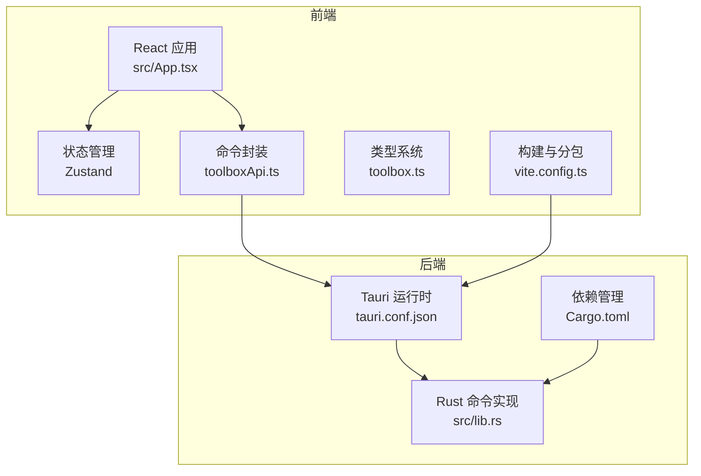
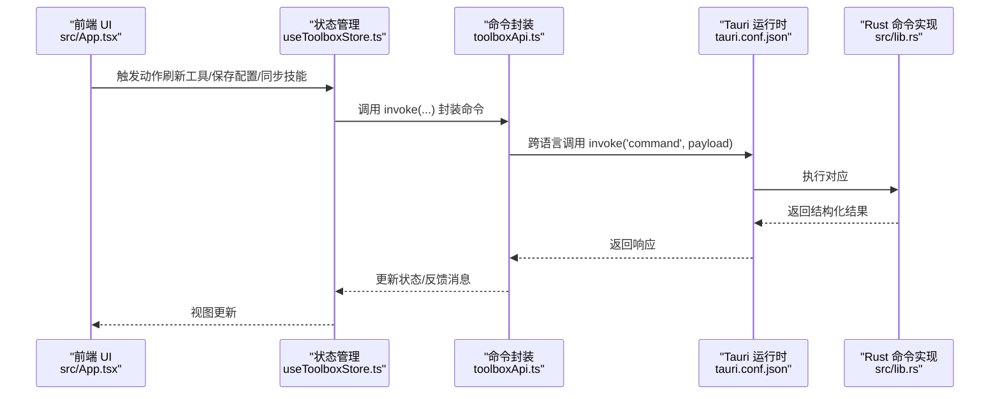
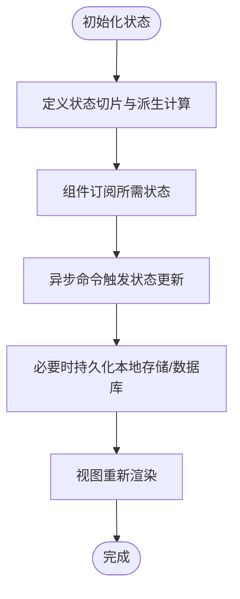
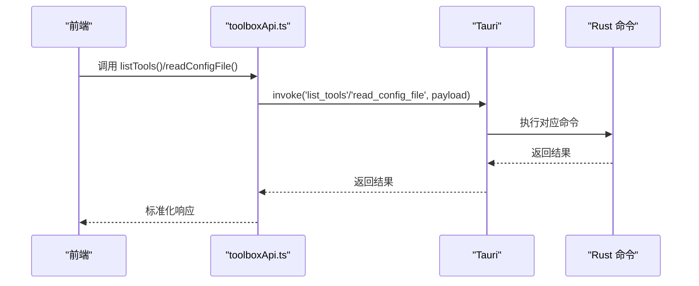
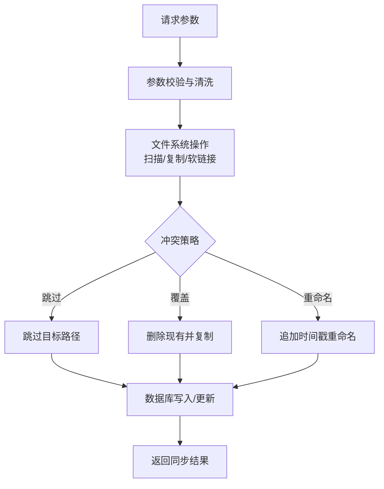
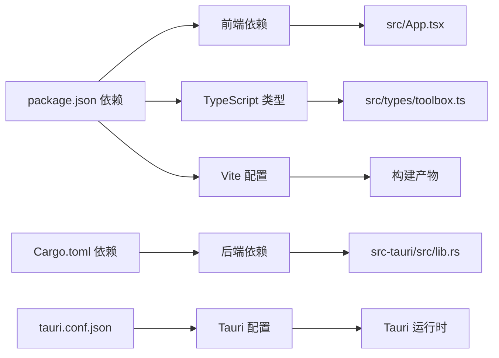

# 技术栈选型与权衡

<cite>
**本文档引用的文件**
- [package.json](file://package.json)
- [vite.config.ts](file://vite.config.ts)
- [tsconfig.json](file://tsconfig.json)
- [src/main.tsx](file://src/main.tsx)
- [src/App.tsx](file://src/App.tsx)
- [src/store/useToolboxStore.ts](file://src/store/useToolboxStore.ts)
- [src/lib/toolboxApi.ts](file://src/lib/toolboxApi.ts)
- [src/types/toolbox.ts](file://src/types/toolbox.ts)
- [src-tauri/Cargo.toml](file://src-tauri/Cargo.toml)
- [src-tauri/tauri.conf.json](file://src-tauri/tauri.conf.json)
- [src-tauri/src/lib.rs](file://src-tauri/src/lib.rs)
- [src-tauri/src/main.rs](file://src-tauri/src/main.rs)
- [README.md](file://README.md)
</cite>

## 目录
1. [引言](#引言)
2. [项目结构](#项目结构)
3. [核心组件](#核心组件)
4. [架构总览](#架构总览)
5. [详细组件分析](#详细组件分析)
6. [依赖关系分析](#依赖关系分析)
7. [性能考量](#性能考量)
8. [故障排查指南](#故障排查指南)
9. [结论](#结论)
10. [附录](#附录)

## 引言
本文件围绕 AI 工具箱项目的前端、后端与打包分发技术栈进行系统性选型与权衡分析，重点解释以下问题：
- 为何选择 React 19 而非其他前端框架
- 为何采用 TypeScript 而非 JavaScript
- 为何选择 Zustand 而非 Redux
- 为何采用 Tauri 而非 Electron
- Rust 在系统级编程中的应用价值与收益
- 技术选型的决策矩阵与替代方案对比

## 项目结构
项目采用“前后端分离 + 打包集成”的组织方式：
- 前端层：React 19 + TypeScript + Vite + Ant Design 6 + Monaco Editor
- 后端层：Rust + Tauri 2，通过命令暴露给前端调用
- 构建与打包：Vite 构建前端，Tauri 统一打包为原生应用

**图表来源**
- [src/App.tsx](file://src/App.tsx)
- [src/store/useToolboxStore.ts](file://src/store/useToolboxStore.ts)
- [src/lib/toolboxApi.ts](file://src/lib/toolboxApi.ts)
- [src-tauri/tauri.conf.json](file://src-tauri/tauri.conf.json)
- [src-tauri/src/lib.rs](file://src-tauri/src/lib.rs)
- [vite.config.ts](file://vite.config.ts)
- [src-tauri/Cargo.toml](file://src-tauri/Cargo.toml)

**章节来源**
- [README.md](file://README.md)
- [package.json](file://package.json)
- [vite.config.ts](file://vite.config.ts)
- [src-tauri/tauri.conf.json](file://src-tauri/tauri.conf.json)

## 核心组件
- 前端应用入口与渲染：React 19 + Ant Design 6，提供桌面端窗口控制、主题切换、命令面板、编辑器等交互。
- 状态管理：Zustand 轻量状态库，集中管理工具列表、配置文件、技能同步、预设等状态。
- 命令封装：统一通过 @tauri-apps/api 的 invoke 调用后端命令，屏蔽跨语言通信细节。
- 类型系统：TypeScript 定义工具、技能、配置、洞察等数据模型，提升开发体验与运行时稳定性。
- 后端命令：Rust 实现文件系统扫描、技能目录解析、同步策略、冲突处理、数据库访问等。

**章节来源**
- [src/main.tsx](file://src/main.tsx)
- [src/App.tsx](file://src/App.tsx)
- [src/store/useToolboxStore.ts](file://src/store/useToolboxStore.ts)
- [src/lib/toolboxApi.ts](file://src/lib/toolboxApi.ts)
- [src/types/toolbox.ts](file://src/types/toolbox.ts)
- [src-tauri/src/lib.rs](file://src-tauri/src/lib.rs)

## 架构总览
前端通过 Tauri 暴露的命令接口与后端交互，后端以 Rust 实现高性能与安全的系统级能力。

**图表来源**
- [src/App.tsx](file://src/App.tsx)
- [src/store/useToolboxStore.ts](file://src/store/useToolboxStore.ts)
- [src/lib/toolboxApi.ts](file://src/lib/toolboxApi.ts)
- [src-tauri/tauri.conf.json](file://src-tauri/tauri.conf.json)
- [src-tauri/src/lib.rs](file://src-tauri/src/lib.rs)

## 详细组件分析

### 前端框架与类型系统：React 19 与 TypeScript 的选型
- 选择 React 19 的原因
  - 更强的并发渲染与 Suspense 支持，适合复杂 UI 与异步加载场景（如技能洞察、配置文件读取）。
  - 与 Vite 生态无缝集成，开发体验更佳。
  - Ant Design 6 与 React 19 兼容良好，提供丰富的桌面端组件。
- 选择 TypeScript 的原因
  - 严格的类型约束降低跨语言调用与状态管理中的错误率。
  - 便于 IDE 智能提示与重构，提升团队协作效率。
  - 与 Tauri 命令参数/返回值的类型定义形成闭环，减少运行时异常。

**章节来源**
- [src/main.tsx](file://src/main.tsx)
- [src/App.tsx](file://src/App.tsx)
- [src/types/toolbox.ts](file://src/types/toolbox.ts)
- [tsconfig.json](file://tsconfig.json)

### 状态管理：Zustand 优于 Redux 的权衡
- 选择 Zustand 的原因
  - API 简洁，无需 Provider 包裹与中间件配置，降低样板代码。
  - 与 React Hooks 协作自然，易于按需订阅状态片段。
  - 对于本项目中“工具列表、配置文件、同步状态、反馈信息”等场景，Zustand 的函数式更新与不可变更新组合足以满足需求。
- 与 Redux 的对比
  - Redux 在大型应用中具备更强的可观测性与调试能力，但本项目规模适中，Zustand 的学习成本与维护成本更低。

**图表来源**
- [src/store/useToolboxStore.ts](file://src/store/useToolboxStore.ts)

**章节来源**
- [src/store/useToolboxStore.ts](file://src/store/useToolboxStore.ts)

### 命令封装与跨语言通信：Tauri 与 @tauri-apps/api
- 选择 Tauri 的原因
  - 通过 Rust 实现系统级能力（文件系统、进程、数据库），前端仅通过命令调用，避免直接暴露底层 API。
  - 与 Electron 相比，Tauri 更轻量、启动更快、打包体积更小。
- 命令封装策略
  - 所有与后端交互通过 toolboxApi.ts 的 invoke 调用，统一错误处理与响应格式。
  - 通过 hasTauriRuntime 判断运行环境，支持预览模式（无后端）与 Tauri 模式。

**图表来源**
- [src/lib/toolboxApi.ts](file://src/lib/toolboxApi.ts)
- [src-tauri/src/lib.rs](file://src-tauri/src/lib.rs)

**章节来源**
- [src/lib/toolboxApi.ts](file://src/lib/toolboxApi.ts)
- [src-tauri/tauri.conf.json](file://src-tauri/tauri.conf.json)

### 后端命令实现：Rust 的系统级能力
- 文件系统与目录扫描：遍历技能目录、解析软链接、统计文件差异。
- 技能同步策略：支持复制与软链接两种模式，冲突策略包含跳过、覆盖、重命名。
- 数据持久化：SQLite（rusqlite）用于技能标签、预设、洞察等数据的存储与查询。
- 跨平台编译：通过 Cargo 与 Tauri 的多平台打包能力，一次构建，多平台发布。

**图表来源**
- [src-tauri/src/lib.rs](file://src-tauri/src/lib.rs)
- [src-tauri/Cargo.toml](file://src-tauri/Cargo.toml)

**章节来源**
- [src-tauri/src/lib.rs](file://src-tauri/src/lib.rs)
- [src-tauri/Cargo.toml](file://src-tauri/Cargo.toml)

### 构建与分包：Vite 的工程化优势
- 通过 Vite 的 React 插件与别名配置，提升开发效率。
- Rollup 手动分包策略将 react、antd、monaco-editor 等大包独立打包，优化首屏加载与缓存命中。

**章节来源**
- [vite.config.ts](file://vite.config.ts)
- [package.json](file://package.json)

## 依赖关系分析
- 前端依赖
  - React 19 + Ant Design 6：提供 UI 与桌面端窗口控制能力。
  - Monaco Editor：内置代码编辑器，支持多语言高亮与智能提示。
  - Zustand：轻量状态管理。
  - TypeScript：类型系统保障。
- 后端依赖
  - Tauri 2：跨语言桥接与原生窗口控制。
  - rusqlite：SQLite 访问与备份能力。
  - notify：文件变更监听。
  - dirs：用户目录定位。

**图表来源**
- [package.json](file://package.json)
- [src-tauri/Cargo.toml](file://src-tauri/Cargo.toml)
- [src-tauri/tauri.conf.json](file://src-tauri/tauri.conf.json)
- [vite.config.ts](file://vite.config.ts)

**章节来源**
- [package.json](file://package.json)
- [src-tauri/Cargo.toml](file://src-tauri/Cargo.toml)
- [src-tauri/tauri.conf.json](file://src-tauri/tauri.conf.json)
- [vite.config.ts](file://vite.config.ts)

## 性能考量
- 前端性能
  - 使用 Vite 与 React 19 的并发渲染，减少长列表与复杂编辑器的卡顿。
  - 通过手动分包策略降低首屏体积，提升加载速度。
- 后端性能
  - Rust 的零成本抽象与内存安全，使文件扫描、差异比较等 IO 密集任务高效稳定。
  - SQLite 的轻量与内嵌特性，避免额外服务依赖。
- 与 Electron 的对比
  - Tauri 通过更少的 JS 进程与更精简的运行时，显著降低内存占用与启动时间。
  - 体积更小，安装包更易分发。

[本节为通用性能讨论，不直接分析具体文件]

## 故障排查指南
- 预览模式与 Tauri 模式切换
  - 通过 hasTauriRuntime 判断运行环境，预览模式下使用 mock 数据与本地模拟行为。
- 错误处理
  - 前端统一通过 message 组件展示反馈，错误信息通过 getErrorMessage 统一提取。
- 常见问题定位
  - 若命令调用失败，检查 tauri.conf.json 中的命令注册与权限配置。
  - 若文件同步异常，检查冲突策略与目标路径是否存在。

**章节来源**
- [src/lib/toolboxApi.ts](file://src/lib/toolboxApi.ts)
- [src/App.tsx](file://src/App.tsx)

## 结论
本项目在技术栈选择上遵循“前端体验优先、后端能力优先、工程化效率优先”的原则：
- 前端采用 React 19 + TypeScript + Zustand，兼顾开发体验与运行时稳定性。
- 后端采用 Rust + Tauri，提供高性能、安全、跨平台的系统级能力。
- 通过命令封装与类型系统，实现前后端的清晰边界与低耦合。

[本节为总结性内容，不直接分析具体文件]

## 附录

### 技术选型决策矩阵
- 前端框架
  - React 19：并发渲染、生态成熟、与 AntD 兼容性好
  - 替代方案：Vue 3（生态丰富但并发能力较弱）、Solid（更小但生态偏小）
- 类型系统
  - TypeScript：类型安全、IDE 支持好
  - 替代方案：Flow（已不活跃）、纯 JS（风险较高）
- 状态管理
  - Zustand：API 简洁、学习成本低
  - 替代方案：Redux（可观测性强但配置复杂）、Jotai（原子化状态，适合细粒度）
- 桌面端框架
  - Tauri：体积小、性能优、安全边界清晰
  - 替代方案：Electron：生态成熟但体积与性能劣势明显
- 后端语言
  - Rust：内存安全、并发模型强、跨平台编译
  - 替代方案：Go（生态成熟）、Node.js（生态成熟但性能一般）

### 替代方案对比
- React vs Vue
  - React 在并发与生态方面更契合本项目复杂 UI 与编辑器场景
- Zustand vs Redux
  - Zustand 更适合中小型项目，Redux 更适合超大型项目
- Tauri vs Electron
  - Tauri 在体积、性能与安全方面具有明显优势
- Rust vs Go
  - Rust 在内存安全与性能方面更优，Go 在开发效率与生态方面更优

[本节为概念性内容，不直接分析具体文件]