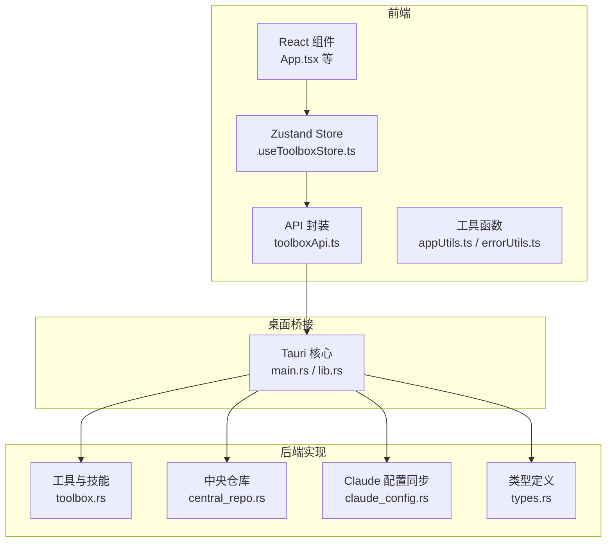
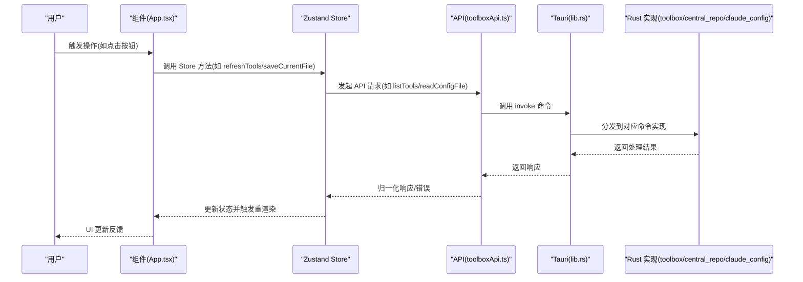
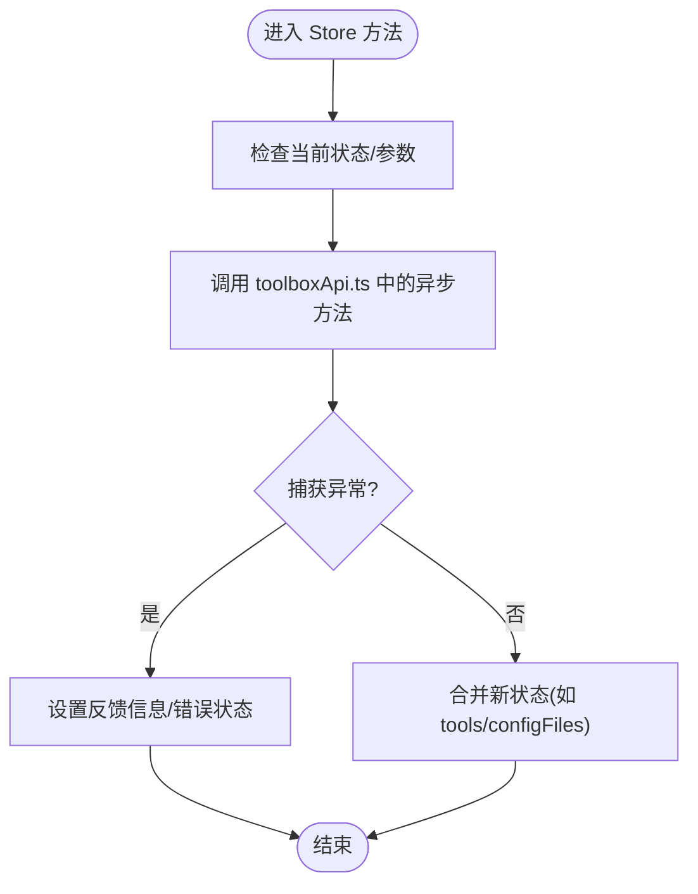
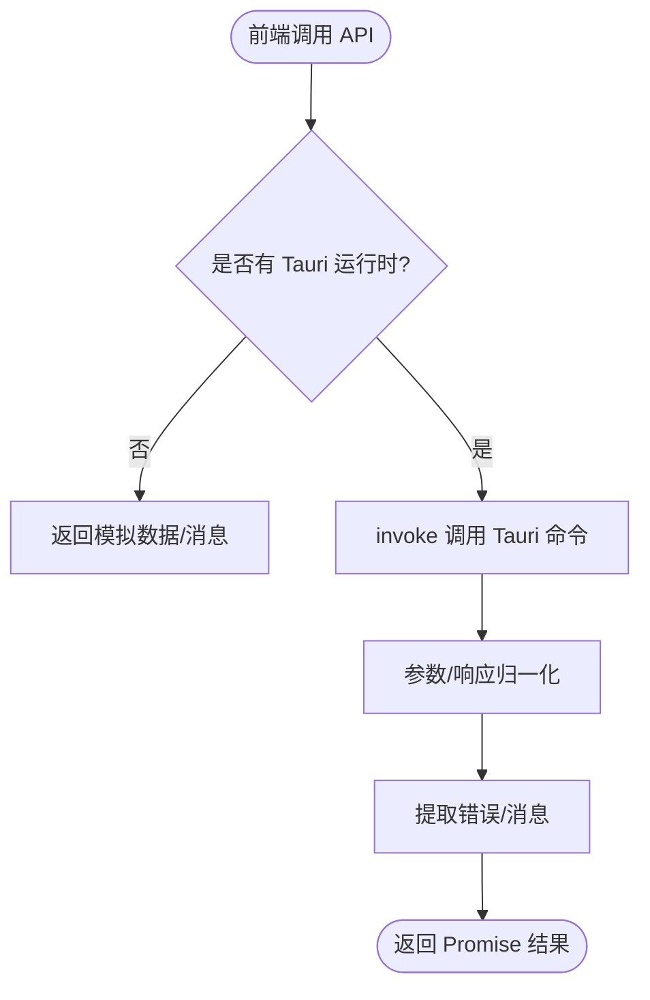
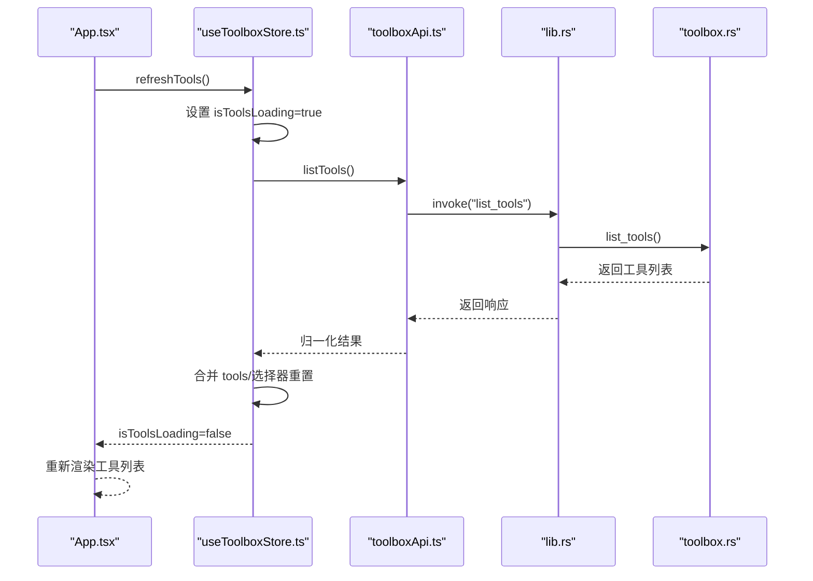
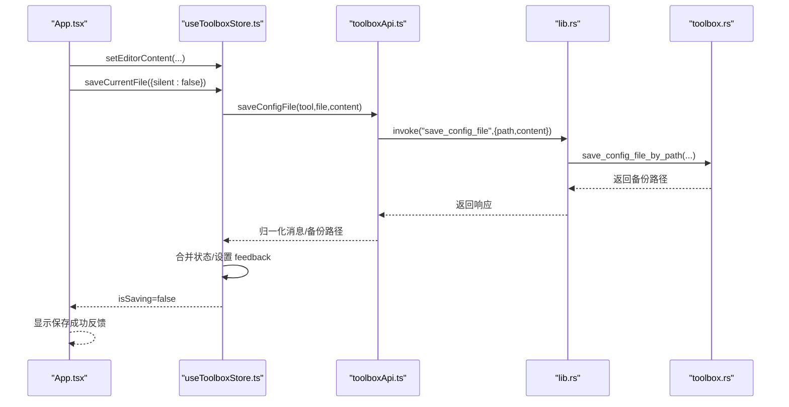
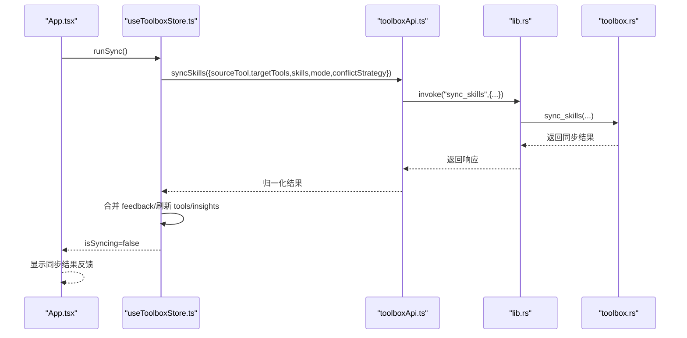
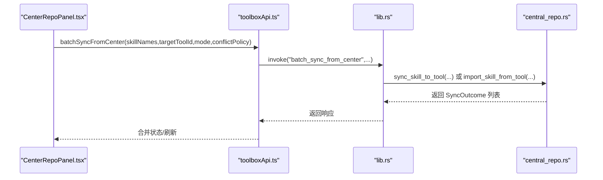
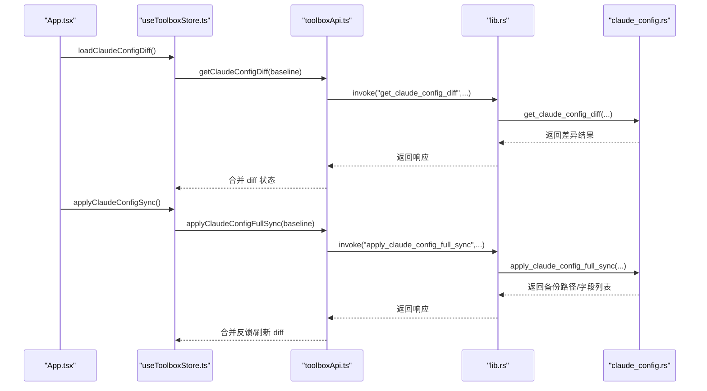
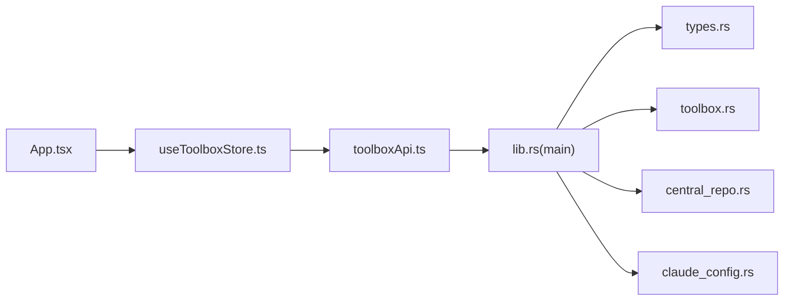

# 数据流设计

<cite>
**本文档引用的文件**
- [src/main.tsx](file://src/main.tsx)
- [src/App.tsx](file://src/App.tsx)
- [src/store/useToolboxStore.ts](file://src/store/useToolboxStore.ts)
- [src/lib/toolboxApi.ts](file://src/lib/toolboxApi.ts)
- [src/types/toolbox.ts](file://src/types/toolbox.ts)
- [src/components/CenterRepoPanel.tsx](file://src/components/CenterRepoPanel.tsx)
- [src/components/SkillDetailDrawer.tsx](file://src/components/SkillDetailDrawer.tsx)
- [src/utils/appUtils.ts](file://src/utils/appUtils.ts)
- [src/utils/errorUtils.ts](file://src/utils/errorUtils.ts)
- [src-tauri/src/main.rs](file://src-tauri/src/main.rs)
- [src-tauri/src/lib.rs](file://src-tauri/src/lib.rs)
- [src-tauri/src/toolbox.rs](file://src-tauri/src/toolbox.rs)
- [src-tauri/src/central_repo.rs](file://src-tauri/src/central_repo.rs)
- [src-tauri/src/claude_config.rs](file://src-tauri/src/claude_config.rs)
- [src-tauri/src/types.rs](file://src-tauri/src/types.rs)
</cite>

## 目录
1. [简介](#简介)
2. [项目结构](#项目结构)
3. [核心组件](#核心组件)
4. [架构总览](#架构总览)
5. [详细组件分析](#详细组件分析)
6. [依赖关系分析](#依赖关系分析)
7. [性能考虑](#性能考虑)
8. [故障排查指南](#故障排查指南)
9. [结论](#结论)

## 简介
本文件为 AI 工具箱项目的“数据流设计”文档，聚焦系统中数据从用户操作到 UI 更新的完整生命周期。文档解释状态管理的数据流向（用户操作触发、状态更新、API 调用、后端处理与 UI 响应），阐述前端状态管理、API 层封装与后端数据处理之间的转换与验证机制，并提供典型场景的数据流转图与代码示例路径，最后分析数据一致性、缓存策略与性能优化。

## 项目结构
项目采用前端 React + Zustand 状态管理 + Tauri 桌面桥接的分层架构：
- 前端层：React 组件负责 UI 与用户交互，Zustand Store 管理全局状态，工具函数提供通用能力。
- API 层：统一的 toolboxApi.ts 将前端调用映射为 Tauri 命令，负责参数校验、响应归一化与错误提取。
- 后端层：Rust 实现的 Tauri 命令处理业务逻辑，包含工具扫描、技能同步、中央仓库、Claude 配置同步等模块。

**图表来源**
- [src/main.tsx:1-12](file://src/main.tsx#L1-L12)
- [src/App.tsx:1-800](file://src/App.tsx#L1-L800)
- [src/store/useToolboxStore.ts:1-556](file://src/store/useToolboxStore.ts#L1-L556)
- [src/lib/toolboxApi.ts:1-784](file://src/lib/toolboxApi.ts#L1-L784)
- [src-tauri/src/main.rs:1-7](file://src-tauri/src/main.rs#L1-L7)
- [src-tauri/src/lib.rs:1-800](file://src-tauri/src/lib.rs#L1-L800)
- [src-tauri/src/toolbox.rs:1-800](file://src-tauri/src/toolbox.rs#L1-L800)
- [src-tauri/src/central_repo.rs:1-726](file://src-tauri/src/central_repo.rs#L1-L726)
- [src-tauri/src/claude_config.rs:1-523](file://src-tauri/src/claude_config.rs#L1-L523)
- [src-tauri/src/types.rs:1-367](file://src-tauri/src/types.rs#L1-L367)

**章节来源**
- [src/main.tsx:1-12](file://src/main.tsx#L1-L12)
- [src/App.tsx:1-800](file://src/App.tsx#L1-L800)

## 核心组件
- 前端入口与根组件：负责应用初始化、主题与运行环境检测。
- 状态管理：集中管理工具列表、配置文件、技能洞察、反馈信息、预设与 Claude 配置同步状态。
- API 封装：统一调用 Tauri 命令，进行参数标准化、响应归一化与错误提取。
- 组件层：工具面板、中央仓库面板、技能详情抽屉等，承载用户交互与数据展示。
- 后端命令：工具扫描、技能同步、中央仓库管理、Claude 配置差异与同步。

**章节来源**
- [src/store/useToolboxStore.ts:1-556](file://src/store/useToolboxStore.ts#L1-L556)
- [src/lib/toolboxApi.ts:1-784](file://src/lib/toolboxApi.ts#L1-L784)
- [src/components/CenterRepoPanel.tsx:1-852](file://src/components/CenterRepoPanel.tsx#L1-L852)
- [src/components/SkillDetailDrawer.tsx:1-120](file://src/components/SkillDetailDrawer.tsx#L1-L120)

## 架构总览
数据流遵循“用户操作 → 前端状态更新 → API 调用 → Tauri 命令 → Rust 实现 → 结果回传 → 状态更新 → UI 重新渲染”的闭环。

**图表来源**
- [src/App.tsx:1-800](file://src/App.tsx#L1-L800)
- [src/store/useToolboxStore.ts:1-556](file://src/store/useToolboxStore.ts#L1-L556)
- [src/lib/toolboxApi.ts:1-784](file://src/lib/toolboxApi.ts#L1-L784)
- [src-tauri/src/lib.rs:1-800](file://src-tauri/src/lib.rs#L1-L800)
- [src-tauri/src/toolbox.rs:1-800](file://src-tauri/src/toolbox.rs#L1-L800)
- [src-tauri/src/central_repo.rs:1-726](file://src-tauri/src/central_repo.rs#L1-L726)
- [src-tauri/src/claude_config.rs:1-523](file://src-tauri/src/claude_config.rs#L1-L523)

## 详细组件分析

### 状态管理与数据流向（Zustand Store）
- Store 聚合了工具列表、配置文件、技能洞察、反馈信息、预设与 Claude 配置同步状态。
- Store 方法通过异步 API 调用更新状态，统一处理错误并生成反馈信息。
- 选择器模式减少不必要的重渲染，提升性能。

**图表来源**
- [src/store/useToolboxStore.ts:174-205](file://src/store/useToolboxStore.ts#L174-L205)
- [src/store/useToolboxStore.ts:307-339](file://src/store/useToolboxStore.ts#L307-L339)

**章节来源**
- [src/store/useToolboxStore.ts:1-556](file://src/store/useToolboxStore.ts#L1-L556)

### API 层封装与数据转换
- API 层根据运行环境决定使用真实 Tauri 命令还是模拟数据。
- 参数标准化与响应归一化：统一处理数组、字符串、数字与对象字段，确保前后端契约稳定。
- 错误提取：统一从异常中提取可读消息，避免前端直接处理复杂异常。

**图表来源**
- [src/lib/toolboxApi.ts:387-396](file://src/lib/toolboxApi.ts#L387-L396)
- [src/lib/toolboxApi.ts:407-417](file://src/lib/toolboxApi.ts#L407-L417)
- [src/lib/toolboxApi.ts:438-465](file://src/lib/toolboxApi.ts#L438-L465)
- [src/utils/errorUtils.ts:1-10](file://src/utils/errorUtils.ts#L1-L10)

**章节来源**
- [src/lib/toolboxApi.ts:1-784](file://src/lib/toolboxApi.ts#L1-L784)
- [src/utils/errorUtils.ts:1-10](file://src/utils/errorUtils.ts#L1-L10)

### 典型场景：刷新工具列表
- 用户点击“刷新工具列表”，App.tsx 调用 Store 的 refreshTools。
- Store 设置加载状态，调用 listTools API。
- API 层调用 Tauri 命令，Rust 层扫描工具注册表并构建工具条目。
- 返回结果后 Store 合并状态并清除加载态，App.tsx 重新渲染工具列表。

**图表来源**
- [src/App.tsx:729-730](file://src/App.tsx#L729-L730)
- [src/store/useToolboxStore.ts:183-205](file://src/store/useToolboxStore.ts#L183-L205)
- [src/lib/toolboxApi.ts:387-396](file://src/lib/toolboxApi.ts#L387-L396)
- [src-tauri/src/lib.rs:620-628](file://src-tauri/src/lib.rs#L620-L628)
- [src-tauri/src/toolbox.rs:219-224](file://src-tauri/src/toolbox.rs#L219-L224)

**章节来源**
- [src/App.tsx:729-730](file://src/App.tsx#L729-L730)
- [src/store/useToolboxStore.ts:183-205](file://src/store/useToolboxStore.ts#L183-L205)
- [src/lib/toolboxApi.ts:387-396](file://src/lib/toolboxApi.ts#L387-L396)
- [src-tauri/src/lib.rs:620-628](file://src-tauri/src/lib.rs#L620-L628)
- [src-tauri/src/toolbox.rs:219-224](file://src-tauri/src/toolbox.rs#L219-L224)

### 典型场景：保存配置文件
- 用户编辑配置文件，Store 的 setEditorContent 更新内存状态。
- 用户触发保存，Store 的 saveCurrentFile 调用 saveConfigFile API。
- API 层调用 Tauri 命令，Rust 层创建备份并写入新内容。
- 返回备份路径与消息，Store 合并状态并生成反馈。

**图表来源**
- [src/store/useToolboxStore.ts:285-339](file://src/store/useToolboxStore.ts#L285-L339)
- [src/lib/toolboxApi.ts:419-436](file://src/lib/toolboxApi.ts#L419-L436)
- [src-tauri/src/lib.rs:615-618](file://src-tauri/src/lib.rs#L615-L618)
- [src-tauri/src/toolbox.rs:248-295](file://src-tauri/src/toolbox.rs#L248-L295)

**章节来源**
- [src/store/useToolboxStore.ts:285-339](file://src/store/useToolboxStore.ts#L285-L339)
- [src/lib/toolboxApi.ts:419-436](file://src/lib/toolboxApi.ts#L419-L436)
- [src-tauri/src/toolbox.rs:248-295](file://src-tauri/src/toolbox.rs#L248-L295)

### 典型场景：技能同步（工具间）
- 用户在 App.tsx 选择源工具、目标工具与技能集合，点击同步。
- Store 的 runSync 组装参数并调用 syncSkills API。
- API 层调用 Tauri 命令，Rust 层按模式与冲突策略执行复制/软链接。
- 返回同步结果，Store 合并状态并刷新洞察。

**图表来源**
- [src/App.tsx:497-512](file://src/App.tsx#L497-L512)
- [src/store/useToolboxStore.ts:341-384](file://src/store/useToolboxStore.ts#L341-L384)
- [src/lib/toolboxApi.ts:438-465](file://src/lib/toolboxApi.ts#L438-L465)
- [src-tauri/src/lib.rs:684-755](file://src-tauri/src/lib.rs#L684-L755)
- [src-tauri/src/toolbox.rs:297-400](file://src-tauri/src/toolbox.rs#L297-L400)

**章节来源**
- [src/App.tsx:497-512](file://src/App.tsx#L497-L512)
- [src/store/useToolboxStore.ts:341-384](file://src/store/useToolboxStore.ts#L341-L384)
- [src/lib/toolboxApi.ts:438-465](file://src/lib/toolboxApi.ts#L438-L465)
- [src-tauri/src/toolbox.rs:297-400](file://src-tauri/src/toolbox.rs#L297-L400)

### 典型场景：中央仓库技能同步
- 用户打开中央仓库面板，选择技能与目标工具，点击同步。
- CenterRepoPanel 调用 toolboxApi 的 batchSyncFromCenter。
- Rust 层遍历技能目录，按策略复制或软链接，记录结果。
- 返回结果后刷新中央仓库与工具状态。

**图表来源**
- [src/components/CenterRepoPanel.tsx:329-364](file://src/components/CenterRepoPanel.tsx#L329-L364)
- [src/lib/toolboxApi.ts:676-688](file://src/lib/toolboxApi.ts#L676-L688)
- [src-tauri/src/central_repo.rs:389-444](file://src-tauri/src/central_repo.rs#L389-L444)

**章节来源**
- [src/components/CenterRepoPanel.tsx:329-364](file://src/components/CenterRepoPanel.tsx#L329-L364)
- [src/lib/toolboxApi.ts:676-688](file://src/lib/toolboxApi.ts#L676-L688)
- [src-tauri/src/central_repo.rs:389-444](file://src-tauri/src/central_repo.rs#L389-L444)

### 典型场景：Claude 配置差异与同步
- 用户在 App.tsx 触发加载差异，Store 调用 getClaudeConfigDiff。
- API 层调用 Tauri 命令，Rust 层读取 settings.json 与 cc-switch 数据库，计算差异。
- 用户确认后调用 applyClaudeConfigFullSync，Rust 层备份并写入数据库。

**图表来源**
- [src/store/useToolboxStore.ts:412-425](file://src/store/useToolboxStore.ts#L412-L425)
- [src/store/useToolboxStore.ts:432-459](file://src/store/useToolboxStore.ts#L432-L459)
- [src/lib/toolboxApi.ts:756-770](file://src/lib/toolboxApi.ts#L756-L770)
- [src-tauri/src/claude_config.rs:430-458](file://src-tauri/src/claude_config.rs#L430-L458)
- [src-tauri/src/claude_config.rs:463-495](file://src-tauri/src/claude_config.rs#L463-L495)

**章节来源**
- [src/store/useToolboxStore.ts:412-459](file://src/store/useToolboxStore.ts#L412-L459)
- [src/lib/toolboxApi.ts:756-770](file://src/lib/toolboxApi.ts#L756-L770)
- [src-tauri/src/claude_config.rs:430-495](file://src-tauri/src/claude_config.rs#L430-L495)

## 依赖关系分析
- 组件依赖 Store：通过选择器读取状态，避免无关重渲染。
- Store 依赖 API：所有异步操作均通过 API 层封装，便于测试与切换运行时。
- API 依赖 Tauri：invoke 命令桥接到 Rust 实现。
- Rust 实现依赖类型定义与工具函数：types.rs 提供统一的请求/响应模型，utils 提供路径与元数据处理。

**图表来源**
- [src/App.tsx:1-800](file://src/App.tsx#L1-L800)
- [src/store/useToolboxStore.ts:1-556](file://src/store/useToolboxStore.ts#L1-L556)
- [src/lib/toolboxApi.ts:1-784](file://src/lib/toolboxApi.ts#L1-L784)
- [src-tauri/src/main.rs:1-7](file://src-tauri/src/main.rs#L1-L7)
- [src-tauri/src/lib.rs:1-800](file://src-tauri/src/lib.rs#L1-L800)
- [src-tauri/src/types.rs:1-367](file://src-tauri/src/types.rs#L1-L367)
- [src-tauri/src/toolbox.rs:1-800](file://src-tauri/src/toolbox.rs#L1-L800)
- [src-tauri/src/central_repo.rs:1-726](file://src-tauri/src/central_repo.rs#L1-L726)
- [src-tauri/src/claude_config.rs:1-523](file://src-tauri/src/claude_config.rs#L1-L523)

**章节来源**
- [src/App.tsx:1-800](file://src/App.tsx#L1-L800)
- [src/store/useToolboxStore.ts:1-556](file://src/store/useToolboxStore.ts#L1-L556)
- [src/lib/toolboxApi.ts:1-784](file://src/lib/toolboxApi.ts#L1-L784)
- [src-tauri/src/lib.rs:1-800](file://src-tauri/src/lib.rs#L1-L800)

## 性能考虑
- 状态粒度与选择器：Store 使用选择器读取状态，避免因全局状态变化导致的不必要重渲染。
- 异步加载与节流：工具列表与配置文件加载设置 loading 状态，避免重复请求。
- 自动保存防抖：编辑器内容变更后延迟保存，减少频繁 IO。
- 前端模拟：在非 Tauri 环境下返回模拟数据，降低开发调试成本。
- 后端幂等与增量：Rust 层对路径存在性、软链接与冲突策略进行幂等处理，避免重复写入。

[本节为通用指导，无需特定文件引用]

## 故障排查指南
- 统一错误提取：通过工具函数从异常中提取可读消息，便于 UI 展示。
- 反馈系统：Store 在错误时设置 feedback，UI 根据 feedback.tone/title/detail 展示提示。
- 运行时检测：hasTauriRuntime 用于区分 Tauri 与预览模式，避免在预览模式执行不支持的操作。
- 路径规范化：normalizeFsPath 将 ~ 替换为主目录，避免路径不一致问题。

**章节来源**
- [src/utils/errorUtils.ts:1-10](file://src/utils/errorUtils.ts#L1-L10)
- [src/store/useToolboxStore.ts:199-202](file://src/store/useToolboxStore.ts#L199-L202)
- [src/utils/appUtils.ts:1-27](file://src/utils/appUtils.ts#L1-L27)

## 结论
本项目通过清晰的分层架构与严格的 API 封装，实现了从前端交互到后端处理的完整数据流闭环。Zustand 状态管理与组件选择器配合，确保了 UI 的高效更新；API 层的参数与响应归一化提升了稳定性；Rust 后端在文件系统与数据库层面提供了可靠的持久化与一致性保障。结合反馈系统与运行时检测，系统在开发与生产环境下均具备良好的可观测性与可维护性。