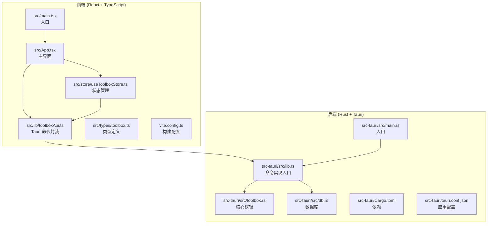
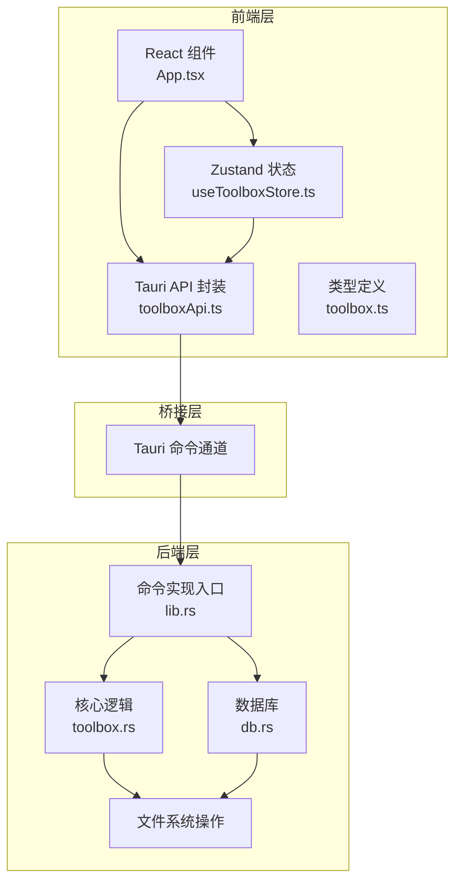
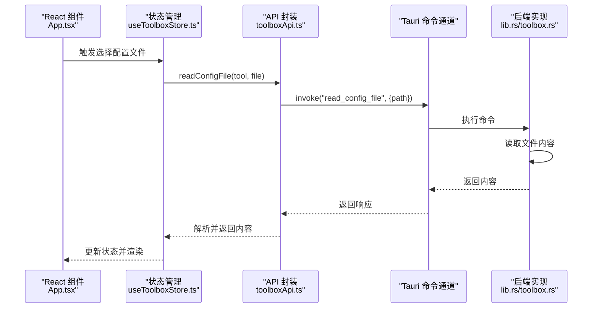
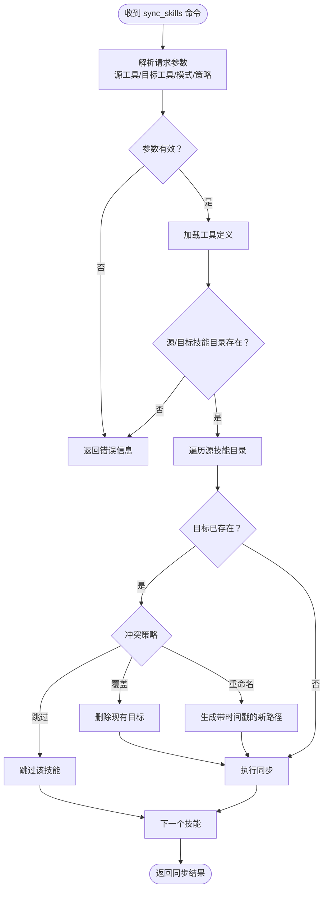
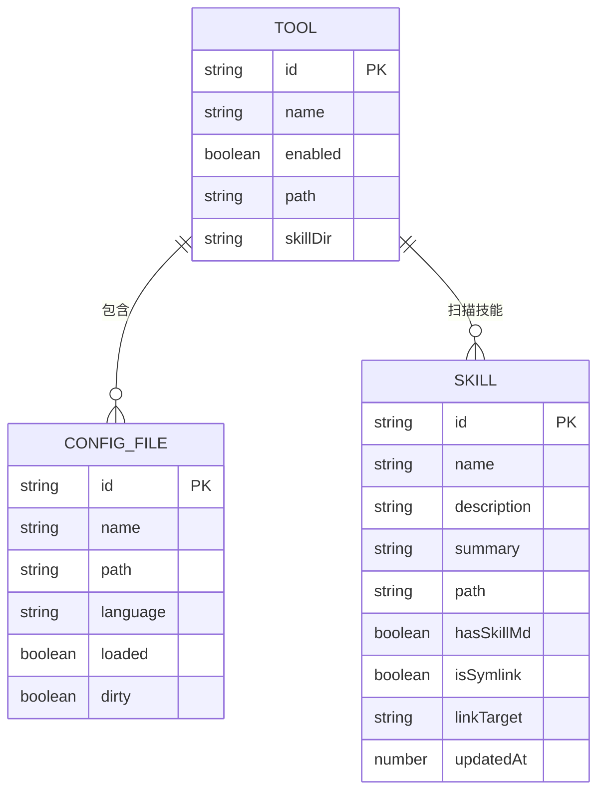
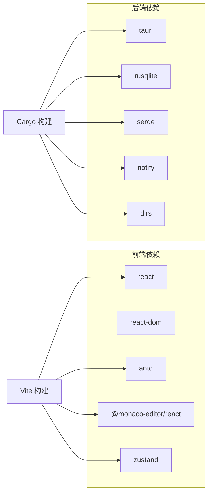

# 整体架构概览

<cite>
**本文档引用的文件**
- [package.json](file://package.json)
- [Cargo.toml](file://src-tauri/Cargo.toml)
- [tauri.conf.json](file://src-tauri/tauri.conf.json)
- [main.tsx](file://src/main.tsx)
- [App.tsx](file://src/App.tsx)
- [toolboxApi.ts](file://src/lib/toolboxApi.ts)
- [useToolboxStore.ts](file://src/store/useToolboxStore.ts)
- [toolbox.ts](file://src/types/toolbox.ts)
- [main.rs](file://src-tauri/src/main.rs)
- [lib.rs](file://src-tauri/src/lib.rs)
- [toolbox.rs](file://src-tauri/src/toolbox.rs)
- [db.rs](file://src-tauri/src/db.rs)
- [vite.config.ts](file://vite.config.ts)
- [README.md](file://README.md)
</cite>

## 目录
1. [引言](#引言)
2. [项目结构](#项目结构)
3. [核心组件](#核心组件)
4. [架构总览](#架构总览)
5. [详细组件分析](#详细组件分析)
6. [依赖关系分析](#依赖关系分析)
7. [性能考虑](#性能考虑)
8. [故障排除指南](#故障排除指南)
9. [结论](#结论)

## 引言

AI 工具箱是一个基于 Tauri + React 的桌面端 Agent 技能管理工具，旨在统一管理本地 AI 开发工具的配置文件、技能目录，并支持跨工具的技能同步。该项目采用前后端分离架构：前端使用 React + TypeScript + Vite 构建用户界面，后端使用 Rust + Tauri 提供系统级能力与数据持久化。

选择 Tauri 的技术背景在于其结合了 Web 技术的开发效率与原生应用的安全性与性能。相比传统桌面框架，Tauri 将 Web 内容嵌入轻量级运行时，避免了重型浏览器内核的开销，同时通过安全的命令通道与系统交互，确保对文件系统、进程等底层资源的访问控制。

## 项目结构

项目采用清晰的分层组织方式，前端与后端分别位于独立目录，便于独立开发与构建：

**图表来源**
- [main.tsx:1-12](file://src/main.tsx#L1-L12)
- [App.tsx:1-800](file://src/App.tsx#L1-L800)
- [toolboxApi.ts:1-784](file://src/lib/toolboxApi.ts#L1-L784)
- [useToolboxStore.ts:1-556](file://src/store/useToolboxStore.ts#L1-L556)
- [toolbox.ts:1-152](file://src/types/toolbox.ts#L1-L152)
- [main.rs:1-7](file://src-tauri/src/main.rs#L1-L7)
- [lib.rs:1-800](file://src-tauri/src/lib.rs#L1-L800)
- [toolbox.rs:1-800](file://src-tauri/src/toolbox.rs#L1-L800)
- [db.rs:1-222](file://src-tauri/src/db.rs#L1-L222)
- [Cargo.toml:1-30](file://src-tauri/Cargo.toml#L1-L30)
- [tauri.conf.json:1-43](file://src-tauri/tauri.conf.json#L1-L43)
- [vite.config.ts:1-31](file://vite.config.ts#L1-L31)

**章节来源**
- [README.md:44-67](file://README.md#L44-L67)
- [package.json:1-63](file://package.json#L1-L63)
- [vite.config.ts:1-31](file://vite.config.ts#L1-L31)
- [tauri.conf.json:1-43](file://src-tauri/tauri.conf.json#L1-L43)

## 核心组件

- 前端应用层
  - 主界面组件负责工具列表、配置编辑、技能同步与洞察展示。
  - 状态管理使用 Zustand，集中处理工具数据、配置内容、反馈消息与 Claude 配置同步状态。
  - API 层通过 @tauri-apps/api 与后端命令通信，封装各类业务请求。

- 后端服务层
  - Tauri 命令实现位于 lib.rs，暴露 list_tools、get_skill_insights、sync_skills 等命令。
  - 核心逻辑在 toolbox.rs 中，包含配置文件读写、技能同步、软链接/复制策略与冲突处理。
  - 数据持久化使用 rusqlite，通过 db.rs 提供的连接池管理工具注册表、技能标签、预设与同步记录等。

- 应用配置层
  - tauri.conf.json 定义窗口尺寸、透明装饰、安全策略与打包图标。
  - package.json 与 vite.config.ts 管理前端构建脚本与依赖分块。

**章节来源**
- [App.tsx:1-800](file://src/App.tsx#L1-L800)
- [useToolboxStore.ts:1-556](file://src/store/useToolboxStore.ts#L1-L556)
- [toolboxApi.ts:1-784](file://src/lib/toolboxApi.ts#L1-L784)
- [lib.rs:615-800](file://src-tauri/src/lib.rs#L615-L800)
- [toolbox.rs:297-400](file://src-tauri/src/toolbox.rs#L297-L400)
- [db.rs:1-222](file://src-tauri/src/db.rs#L1-L222)
- [tauri.conf.json:1-43](file://src-tauri/tauri.conf.json#L1-L43)
- [package.json:1-63](file://package.json#L1-L63)
- [vite.config.ts:1-31](file://vite.config.ts#L1-L31)

## 架构总览

AI 工具箱采用“前端 Web + 后端 Rust”的双层架构，通过 Tauri 的命令通道实现松耦合协作。前端负责用户交互与状态管理，后端负责文件系统操作、数据持久化与复杂业务逻辑。

**图表来源**
- [App.tsx:1-800](file://src/App.tsx#L1-L800)
- [useToolboxStore.ts:1-556](file://src/store/useToolboxStore.ts#L1-L556)
- [toolboxApi.ts:1-784](file://src/lib/toolboxApi.ts#L1-L784)
- [lib.rs:615-800](file://src-tauri/src/lib.rs#L615-L800)
- [toolbox.rs:297-400](file://src-tauri/src/toolbox.rs#L297-L400)
- [db.rs:1-222](file://src-tauri/src/db.rs#L1-L222)

**章节来源**
- [lib.rs:1-800](file://src-tauri/src/lib.rs#L1-L800)
- [toolbox.rs:1-800](file://src-tauri/src/toolbox.rs#L1-L800)
- [db.rs:1-222](file://src-tauri/src/db.rs#L1-L222)
- [toolboxApi.ts:1-784](file://src/lib/toolboxApi.ts#L1-L784)

## 详细组件分析

### 前端组件协作流程

前端通过 toolboxApi.ts 将用户操作转化为 Tauri 命令调用，再由后端执行具体逻辑。以下序列图展示了“读取配置文件”这一典型流程：

**图表来源**
- [App.tsx:1-800](file://src/App.tsx#L1-L800)
- [useToolboxStore.ts:247-283](file://src/store/useToolboxStore.ts#L247-L283)
- [toolboxApi.ts:407-417](file://src/lib/toolboxApi.ts#L407-L417)
- [lib.rs:615-628](file://src-tauri/src/lib.rs#L615-L628)
- [toolbox.rs:226-241](file://src-tauri/src/toolbox.rs#L226-L241)

**章节来源**
- [toolboxApi.ts:407-417](file://src/lib/toolboxApi.ts#L407-L417)
- [useToolboxStore.ts:247-283](file://src/store/useToolboxStore.ts#L247-L283)
- [lib.rs:615-628](file://src-tauri/src/lib.rs#L615-L628)

### 后端命令与核心逻辑

后端通过 #[tauri::command] 注解暴露命令，lib.rs 作为命令实现入口，根据请求参数调用 toolbox.rs 中的具体逻辑。例如“技能同步”命令的处理流程如下：

**图表来源**
- [lib.rs:684-755](file://src-tauri/src/lib.rs#L684-L755)
- [toolbox.rs:297-400](file://src-tauri/src/toolbox.rs#L297-L400)
- [toolbox.rs:591-630](file://src-tauri/src/toolbox.rs#L591-L630)

**章节来源**
- [lib.rs:684-755](file://src-tauri/src/lib.rs#L684-L755)
- [toolbox.rs:297-400](file://src-tauri/src/toolbox.rs#L297-L400)

### 数据模型与状态管理

前端使用 Zustand 管理全局状态，包括工具列表、当前选中的配置文件、技能洞察、反馈消息等。类型定义集中在 toolbox.ts，确保前后端数据契约一致。

**图表来源**
- [toolbox.ts:33-43](file://src/types/toolbox.ts#L33-L43)
- [toolbox.ts:22-31](file://src/types/toolbox.ts#L22-L31)
- [toolbox.ts:7-20](file://src/types/toolbox.ts#L7-L20)

**章节来源**
- [useToolboxStore.ts:32-84](file://src/store/useToolboxStore.ts#L32-L84)
- [toolbox.ts:1-152](file://src/types/toolbox.ts#L1-L152)

## 依赖关系分析

前端与后端的依赖关系通过 Tauri 命令通道解耦，构建时通过 vite.config.ts 对第三方库进行分块优化，提升首屏加载性能。

**图表来源**
- [package.json:29-38](file://package.json#L29-L38)
- [Cargo.toml:20-30](file://src-tauri/Cargo.toml#L20-L30)
- [vite.config.ts:14-23](file://vite.config.ts#L14-L23)

**章节来源**
- [package.json:29-38](file://package.json#L29-L38)
- [Cargo.toml:20-30](file://src-tauri/Cargo.toml#L20-L30)
- [vite.config.ts:14-23](file://vite.config.ts#L14-L23)

## 性能考虑

- 前端性能
  - 使用 Vite 的手动分块策略将 react、antd、monaco-editor 等大体积依赖拆分为独立 chunk，减少初始包体积。
  - React 19 的并发特性有助于提升交互流畅度。

- 后端性能
  - Rust 的零成本抽象与内存安全保证了文件系统操作的高效与稳定。
  - 数据库存取通过连接池复用连接，减少频繁创建销毁的开销。
  - 文件同步采用递归复制与符号链接策略，针对不同平台进行优化。

- 交互性能
  - Tauri 命令通道避免了传统 IPC 的高延迟，前端调用后端命令的往返时间较短。
  - 状态管理集中于 Zustand，避免不必要的组件重渲染。

[本节为通用指导，不直接分析具体文件]

## 故障排除指南

- 前端常见问题
  - 预览模式下部分功能不可用：当检测到非 Tauri 运行时，API 将返回模拟数据或空结果。可通过 hasTauriRuntime 判断运行环境。
  - 编辑器内容未保存：检查 isSaving 状态与 setEditorContent 的脏标记逻辑，确保内容变更被正确识别。

- 后端常见问题
  - 文件权限错误：读写配置文件前应确保父目录存在并具备写权限。
  - 技能同步失败：检查源/目标技能目录是否存在，冲突策略是否合理，必要时清理目标路径或调整策略。
  - 数据库初始化失败：确认用户主目录下 .ai-toolbox 目录可写，且数据库文件无损坏。

**章节来源**
- [toolboxApi.ts:387-405](file://src/lib/toolboxApi.ts#L387-L405)
- [toolboxApi.ts:419-436](file://src/lib/toolboxApi.ts#L419-L436)
- [toolboxApi.ts:445-465](file://src/lib/toolboxApi.ts#L445-L465)
- [db.rs:212-222](file://src-tauri/src/db.rs#L212-L222)

## 结论

AI 工具箱通过 Tauri + React 的组合实现了高性能、易维护的桌面应用架构。前端专注于用户体验与交互，后端专注系统能力与数据持久化，两者通过命令通道实现松耦合协作。该架构既保持了 Web 技术的开发效率，又获得了接近原生应用的性能与安全性，适合长期演进与功能扩展。