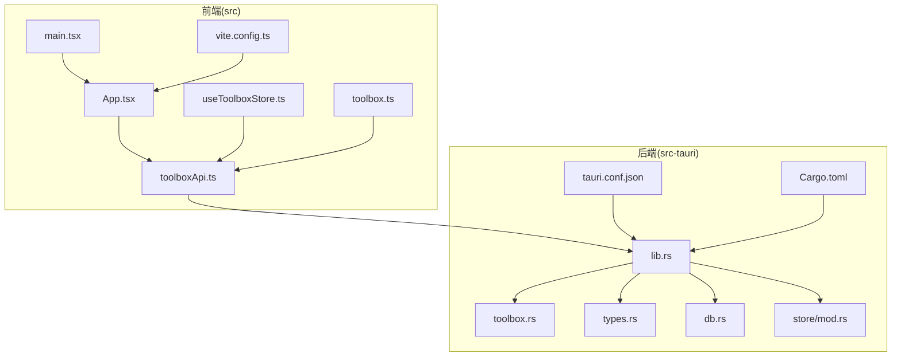
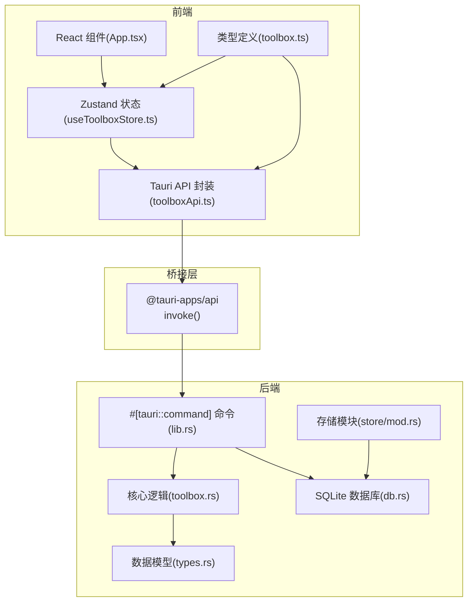
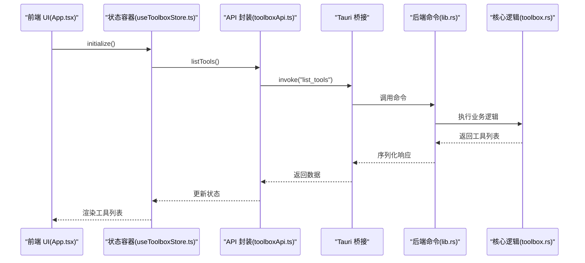
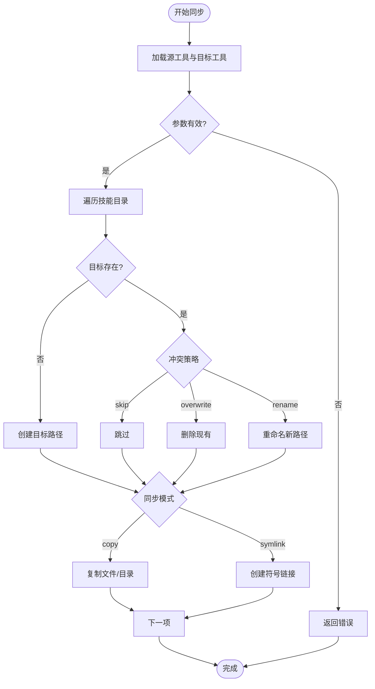
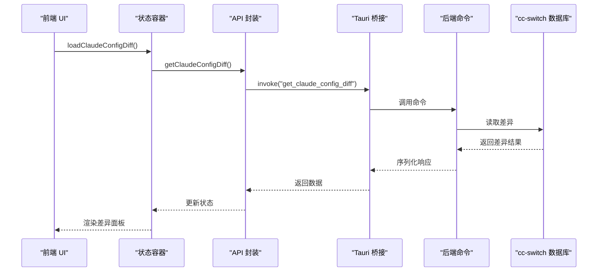
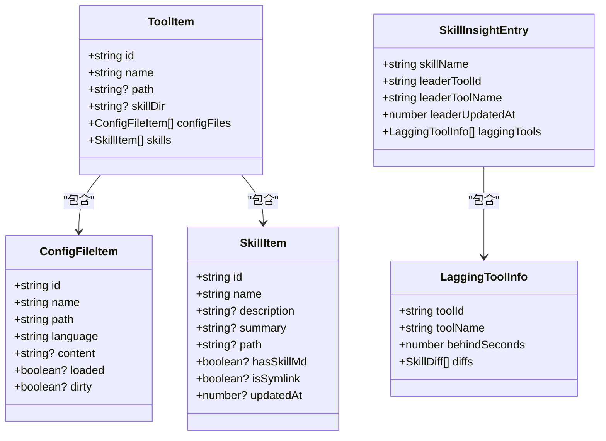
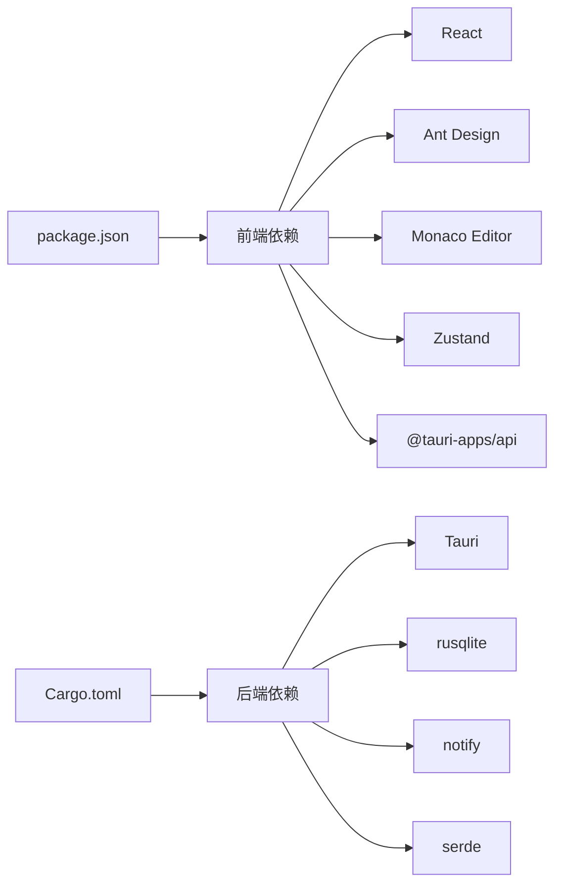

# 架构设计

<cite>
**本文档引用的文件**
- [README.md](file://README.md)
- [package.json](file://package.json)
- [src-tauri/Cargo.toml](file://src-tauri/Cargo.toml)
- [src-tauri/tauri.conf.json](file://src-tauri/tauri.conf.json)
- [src/main.tsx](file://src/main.tsx)
- [src/App.tsx](file://src/App.tsx)
- [src/lib/toolboxApi.ts](file://src/lib/toolboxApi.ts)
- [src/store/useToolboxStore.ts](file://src/store/useToolboxStore.ts)
- [src/types/toolbox.ts](file://src/types/toolbox.ts)
- [src-tauri/src/lib.rs](file://src-tauri/src/lib.rs)
- [src-tauri/src/toolbox.rs](file://src-tauri/src/toolbox.rs)
- [src-tauri/src/types.rs](file://src-tauri/src/types.rs)
- [src-tauri/src/db.rs](file://src-tauri/src/db.rs)
- [src-tauri/src/store/mod.rs](file://src-tauri/src/store/mod.rs)
- [vite.config.ts](file://vite.config.ts)
</cite>

## 目录
1. [引言](#引言)
2. [项目结构](#项目结构)
3. [核心组件](#核心组件)
4. [架构总览](#架构总览)
5. [详细组件分析](#详细组件分析)
6. [依赖关系分析](#依赖关系分析)
7. [性能考量](#性能考量)
8. [故障排除指南](#故障排除指南)
9. [结论](#结论)

## 引言
本项目是一个基于 Tauri + React 的桌面端 Agent 技能管理工具，旨在统一管理多款 AI 开发工具的配置文件与技能目录，并支持跨工具的技能同步与变更洞察。系统采用前后端分离架构：前端使用 React + TypeScript + Vite，后端使用 Rust + Tauri，通过 Tauri 命令桥接实现安全高效的原生能力调用。

## 项目结构
项目采用典型的“前端 + 后端”分层组织方式，前端负责用户界面与状态管理，后端负责文件系统操作、数据库持久化与业务逻辑处理。

**图表来源**
- [src/main.tsx:1-12](file://src/main.tsx#L1-L12)
- [src/App.tsx:1-800](file://src/App.tsx#L1-L800)
- [src/lib/toolboxApi.ts:1-760](file://src/lib/toolboxApi.ts#L1-L760)
- [src/store/useToolboxStore.ts:1-609](file://src/store/useToolboxStore.ts#L1-L609)
- [src/types/toolbox.ts:1-155](file://src/types/toolbox.ts#L1-L155)
- [src-tauri/src/lib.rs:1-800](file://src-tauri/src/lib.rs#L1-L800)
- [src-tauri/src/toolbox.rs:1-800](file://src-tauri/src/toolbox.rs#L1-L800)
- [src-tauri/src/types.rs:1-367](file://src-tauri/src/types.rs#L1-L367)
- [src-tauri/src/db.rs:1-200](file://src-tauri/src/db.rs#L1-L200)
- [src-tauri/src/store/mod.rs:1-5](file://src-tauri/src/store/mod.rs#L1-L5)
- [src-tauri/tauri.conf.json:1-42](file://src-tauri/tauri.conf.json#L1-L42)
- [src-tauri/Cargo.toml:1-29](file://src-tauri/Cargo.toml#L1-L29)
- [vite.config.ts:1-8](file://vite.config.ts#L1-L8)

**章节来源**
- [README.md:44-67](file://README.md#L44-L67)
- [package.json:1-40](file://package.json#L1-L40)
- [src-tauri/Cargo.toml:1-29](file://src-tauri/Cargo.toml#L1-L29)
- [src-tauri/tauri.conf.json:1-42](file://src-tauri/tauri.conf.json#L1-L42)

## 核心组件
- 前端应用入口与路由：负责渲染主界面、主题切换、窗口控制与全局状态初始化。
- 前端 API 封装：通过 @tauri-apps/api 的 invoke 调用后端命令，统一封装请求参数与响应解析。
- 前端状态管理：基于 Zustand 的轻量状态容器，集中管理工具列表、配置文件内容、同步状态、反馈信息等。
- 后端命令实现：通过 #[tauri::command] 注解暴露命令，处理工具注册表、技能扫描、配置读写、同步策略等。
- 数据模型与类型：前后端共享类型定义，确保数据结构一致性与编译期校验。
- 数据持久化：SQLite 数据库存储工具注册表、技能标签、预设、同步记录等元数据。

**章节来源**
- [src/main.tsx:1-12](file://src/main.tsx#L1-L12)
- [src/App.tsx:121-190](file://src/App.tsx#L121-L190)
- [src/lib/toolboxApi.ts:391-473](file://src/lib/toolboxApi.ts#L391-L473)
- [src/store/useToolboxStore.ts:149-609](file://src/store/useToolboxStore.ts#L149-L609)
- [src/types/toolbox.ts:1-155](file://src/types/toolbox.ts#L1-L155)
- [src-tauri/src/types.rs:9-166](file://src-tauri/src/types.rs#L9-L166)
- [src-tauri/src/db.rs:59-147](file://src-tauri/src/db.rs#L59-L147)

## 架构总览
系统采用“前端渲染 + 后端原生”的混合架构，前端负责 UI 与交互，后端负责文件系统与数据库操作。Tauri 作为桥接层，提供安全的命令通道与窗口控制能力。

**图表来源**
- [src/App.tsx:1-800](file://src/App.tsx#L1-L800)
- [src/store/useToolboxStore.ts:1-609](file://src/store/useToolboxStore.ts#L1-L609)
- [src/lib/toolboxApi.ts:1-760](file://src/lib/toolboxApi.ts#L1-L760)
- [src/types/toolbox.ts:1-155](file://src/types/toolbox.ts#L1-L155)
- [src-tauri/src/lib.rs:513-800](file://src-tauri/src/lib.rs#L513-L800)
- [src-tauri/src/toolbox.rs:299-400](file://src-tauri/src/toolbox.rs#L299-L400)
- [src-tauri/src/db.rs:1-200](file://src-tauri/src/db.rs#L1-L200)
- [src-tauri/src/types.rs:1-367](file://src-tauri/src/types.rs#L1-L367)
- [src-tauri/src/store/mod.rs:1-5](file://src-tauri/src/store/mod.rs#L1-L5)

## 详细组件分析

### 前端组件与状态流
- 初始化流程：应用启动后，通过 initialize 触发工具列表与洞察数据的加载，随后根据当前选中工具加载对应配置文件内容。
- 状态管理：Zustand 将工具、配置文件、同步状态、反馈信息等集中管理，避免组件间繁琐的状态传递。
- 用户交互：窗口拖拽、最大化/最小化、主题切换、工具管理弹窗、技能同步对话框等均由前端直接处理，必要时通过 API 调用后端能力。

**图表来源**
- [src/App.tsx:186-190](file://src/App.tsx#L186-L190)
- [src/store/useToolboxStore.ts:178-213](file://src/store/useToolboxStore.ts#L178-L213)
- [src/lib/toolboxApi.ts:391-400](file://src/lib/toolboxApi.ts#L391-L400)
- [src-tauri/src/lib.rs:513-521](file://src-tauri/src/lib.rs#L513-L521)
- [src-tauri/src/toolbox.rs:221-226](file://src-tauri/src/toolbox.rs#L221-L226)

**章节来源**
- [src/App.tsx:121-229](file://src/App.tsx#L121-L229)
- [src/store/useToolboxStore.ts:149-213](file://src/store/useToolboxStore.ts#L149-L213)
- [src/lib/toolboxApi.ts:391-400](file://src/lib/toolboxApi.ts#L391-L400)

### 技能同步与冲突处理
- 同步模式：支持复制(copy)与符号链接(symlink)两种模式，冲突策略包括跳过(skip)、覆盖(overwrite)、重命名(rename)。
- 文件处理：对符号链接进行特殊处理，确保复制与链接行为符合预期；对目录递归处理，保证子项完整迁移。
- 结果反馈：返回每条技能同步的操作明细，便于用户了解具体变更。

**图表来源**
- [src-tauri/src/toolbox.rs:299-400](file://src-tauri/src/toolbox.rs#L299-L400)
- [src-tauri/src/toolbox.rs:632-743](file://src-tauri/src/toolbox.rs#L632-L743)
- [src-tauri/src/lib.rs:489-511](file://src-tauri/src/lib.rs#L489-L511)

**章节来源**
- [src-tauri/src/toolbox.rs:299-400](file://src-tauri/src/toolbox.rs#L299-L400)
- [src-tauri/src/toolbox.rs:632-743](file://src-tauri/src/toolbox.rs#L632-L743)
- [src-tauri/src/lib.rs:489-511](file://src-tauri/src/lib.rs#L489-L511)

### Claude 配置同步
- 差异检测：比较设置文件与 cc-switch 数据库中的字段差异，生成差异列表与需要同步的字段集合。
- 全量同步：将差异字段应用到 cc-switch，生成备份路径以便回滚。
- 快照管理：列出快照元数据，支持从备份恢复数据库。

**图表来源**
- [src/store/useToolboxStore.ts:437-454](file://src/store/useToolboxStore.ts#L437-L454)
- [src/lib/toolboxApi.ts:739-743](file://src/lib/toolboxApi.ts#L739-L743)
- [src-tauri/src/lib.rs:513-800](file://src-tauri/src/lib.rs#L513-L800)

**章节来源**
- [src/store/useToolboxStore.ts:437-492](file://src/store/useToolboxStore.ts#L437-L492)
- [src/lib/toolboxApi.ts:739-760](file://src/lib/toolboxApi.ts#L739-L760)

### 数据模型与类型系统
- 前端类型：定义同步模式、冲突策略、工具项、配置文件、技能洞察等核心类型。
- 后端类型：与前端类型一一对应，确保序列化与反序列化的一致性。
- 共享约束：通过类型约束保证 API 参数与返回值的正确性，减少运行时错误。

**图表来源**
- [src/types/toolbox.ts:7-92](file://src/types/toolbox.ts#L7-L92)
- [src-tauri/src/types.rs:37-93](file://src-tauri/src/types.rs#L37-L93)

**章节来源**
- [src/types/toolbox.ts:1-155](file://src/types/toolbox.ts#L1-L155)
- [src-tauri/src/types.rs:9-166](file://src-tauri/src/types.rs#L9-L166)

## 依赖关系分析
- 前端依赖：React、Ant Design、Monaco Editor、Zustand、@tauri-apps/api、Vite。
- 后端依赖：Tauri、rusqlite、notify、md-5、serde 等。
- 配置文件：package.json 管理前端依赖，Cargo.toml 管理后端依赖，tauri.conf.json 配置窗口与打包参数。

**图表来源**
- [package.json:14-38](file://package.json#L14-L38)
- [src-tauri/Cargo.toml:20-29](file://src-tauri/Cargo.toml#L20-L29)

**章节来源**
- [package.json:14-38](file://package.json#L14-L38)
- [src-tauri/Cargo.toml:20-29](file://src-tauri/Cargo.toml#L20-L29)
- [src-tauri/tauri.conf.json:1-42](file://src-tauri/tauri.conf.json#L1-L42)

## 性能考量
- 状态粒度：Zustand 将状态按功能域拆分，避免不必要的重渲染；通过选择器精确订阅所需状态。
- 文件操作：同步时对符号链接与目录进行递归处理，注意去重与循环链接防护，避免无限递归。
- 数据库访问：SQLite 连接池与索引优化，减少频繁查询开销；迁移脚本保证 schema 兼容性。
- 前端构建：Vite 提供快速热重载与按需打包，生产构建优化资源体积。

## 故障排除指南
- 窗口控制：前端通过 @tauri-apps/api/window 控制窗口拖拽、最大化/最小化/关闭，异常时检查 Tauri 运行时是否存在。
- API 调用：toolboxApi.ts 对无 Tauri 环境提供模拟数据，便于开发调试；生产环境需确保 invoke 调用路径正确。
- 错误反馈：状态容器在发生错误时设置反馈信息，前端通过消息组件展示，便于定位问题。
- 数据库：db.rs 提供连接池与迁移脚本，若出现 schema 不匹配，检查迁移逻辑是否执行。

**章节来源**
- [src/App.tsx:516-568](file://src/App.tsx#L516-L568)
- [src/lib/toolboxApi.ts:391-400](file://src/lib/toolboxApi.ts#L391-L400)
- [src/store/useToolboxStore.ts:203-212](file://src/store/useToolboxStore.ts#L203-L212)
- [src-tauri/src/db.rs:28-48](file://src-tauri/src/db.rs#L28-L48)

## 结论
本项目通过 Tauri 将 React 前端与 Rust 后端有机结合，既保持了前端开发的灵活性与高性能，又利用 Rust 的安全与高效处理文件系统与数据库任务。Zustand 的轻量状态管理降低了复杂度，类型系统贯穿前后端提升了可靠性。整体架构清晰、职责分明，具备良好的扩展性与维护性。