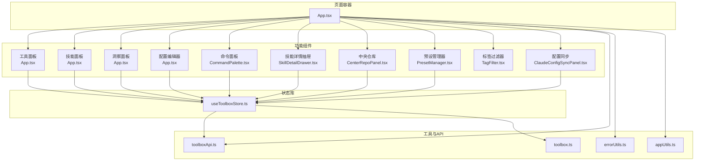
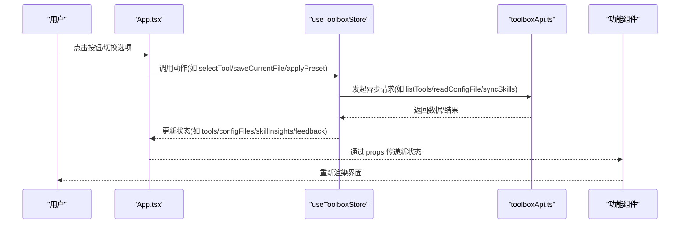
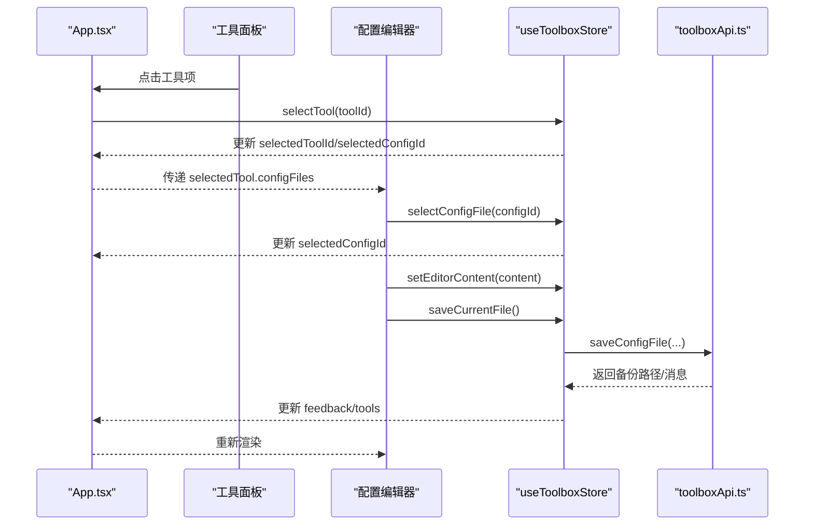
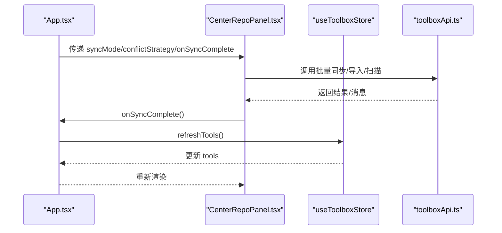
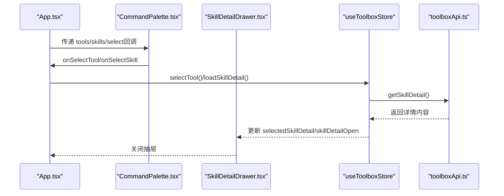
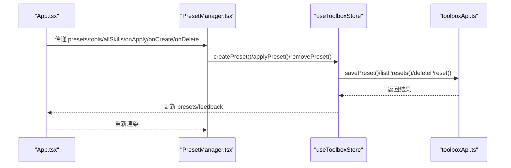
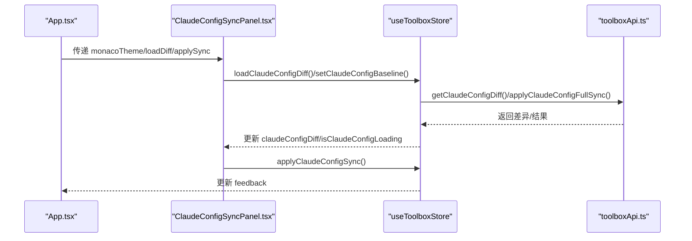
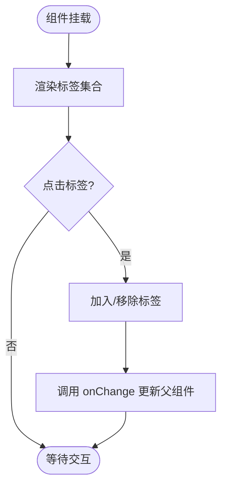
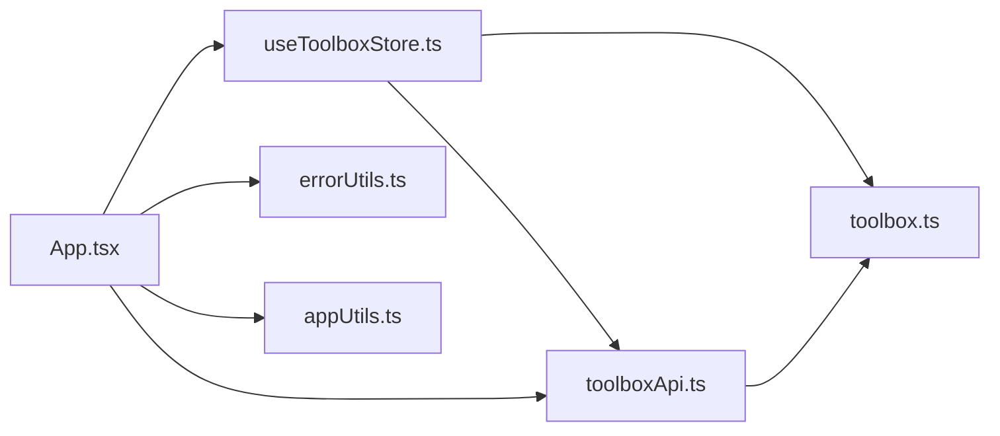

# 组件交互模式

<cite>
**本文引用的文件**
- [App.tsx](file://src/App.tsx)
- [useToolboxStore.ts](file://src/store/useToolboxStore.ts)
- [CenterRepoPanel.tsx](file://src/components/CenterRepoPanel.tsx)
- [ClaudeConfigSyncPanel.tsx](file://src/components/ClaudeConfigSyncPanel.tsx)
- [PresetManager.tsx](file://src/components/PresetManager.tsx)
- [CommandPalette.tsx](file://src/components/CommandPalette.tsx)
- [SkillDetailDrawer.tsx](file://src/components/SkillDetailDrawer.tsx)
- [TagFilter.tsx](file://src/components/TagFilter.tsx)
- [toolboxApi.ts](file://src/lib/toolboxApi.ts)
- [errorUtils.ts](file://src/utils/errorUtils.ts)
- [appUtils.ts](file://src/utils/appUtils.ts)
- [toolbox.ts](file://src/types/toolbox.ts)
</cite>

## 目录
1. [简介](#简介)
2. [项目结构](#项目结构)
3. [核心组件](#核心组件)
4. [架构总览](#架构总览)
5. [详细组件分析](#详细组件分析)
6. [依赖关系分析](#依赖关系分析)
7. [性能考量](#性能考量)
8. [故障排查指南](#故障排查指南)
9. [结论](#结论)
10. [附录](#附录)

## 简介
本文件系统性梳理 AI 工具箱项目的组件交互模式，重点覆盖：
- 父子组件通信：通过 props 传递状态与回调，实现工具面板、配置面板、中央仓库等关键组件的协作
- 兄弟组件协作：通过共享状态与回调函数协调命令面板、技能详情抽屉、预设管理器等
- 跨层级数据传递：通过全局状态库（Zustand）集中管理工具、配置、技能、洞察等数据
- 状态提升与回调：在 App 层集中管理主题、自动保存、同步参数等横切关注点
- 自定义 Hook 使用模式：通过 useToolboxStore 提供的状态与动作，统一管理副作用与性能优化
- 组件复用策略：通用过滤器、工具栏、模态框等组件的可复用设计
- 错误边界与反馈：统一错误消息提取与全局反馈提示

## 项目结构
项目采用“页面容器 + 功能组件 + 状态库 + 工具函数”的分层组织：
- 页面容器：App.tsx 负责布局、主题、全局状态初始化与跨组件协调
- 功能组件：工具面板、配置编辑器、中央仓库、配置同步、命令面板、技能详情抽屉、预设管理器等
- 状态库：useToolboxStore.ts 使用 Zustand 管理工具、配置、技能、洞察、反馈等状态
- 工具函数：toolboxApi.ts 提供与后端/桌面环境交互的 API；errorUtils.ts、appUtils.ts 提供错误与工具方法
- 类型定义：toolbox.ts 定义工具、技能、配置、洞察、同步模式等类型

图表来源
- [App.tsx:138-1766](file://src/App.tsx#L138-L1766)
- [useToolboxStore.ts:145-556](file://src/store/useToolboxStore.ts#L145-L556)
- [CenterRepoPanel.tsx:55-652](file://src/components/CenterRepoPanel.tsx#L55-L652)
- [ClaudeConfigSyncPanel.tsx:101-438](file://src/components/ClaudeConfigSyncPanel.tsx#L101-L438)
- [PresetManager.tsx:171-330](file://src/components/PresetManager.tsx#L171-L330)
- [CommandPalette.tsx:32-320](file://src/components/CommandPalette.tsx#L32-L320)
- [SkillDetailDrawer.tsx:18-120](file://src/components/SkillDetailDrawer.tsx#L18-L120)
- [toolboxApi.ts:387-784](file://src/lib/toolboxApi.ts#L387-L784)
- [errorUtils.ts:5-9](file://src/utils/errorUtils.ts#L5-L9)
- [appUtils.ts:1-27](file://src/utils/appUtils.ts#L1-L27)
- [toolbox.ts:1-152](file://src/types/toolbox.ts#L1-L152)

章节来源
- [App.tsx:138-1766](file://src/App.tsx#L138-L1766)
- [useToolboxStore.ts:145-556](file://src/store/useToolboxStore.ts#L145-L556)

## 核心组件
- App.tsx：页面主容器，负责主题切换、工具初始化、全局状态绑定、模态框与抽屉控制、命令面板与技能详情抽屉的联动
- useToolboxStore.ts：全局状态库，提供工具列表、配置文件、技能、洞察、反馈、预设、同步参数、Claude 配置差异等状态与动作
- CenterRepoPanel.tsx：中央仓库面板，支持从 Git 安装、扫描发现、导入/同步到工具、批量同步与分类管理
- ClaudeConfigSyncPanel.tsx：Claude 配置差异与整段同步面板，支持基线选择、差异查看、整段同步与二次确认
- PresetManager.tsx：预设管理器，支持创建、应用、删除预设，以及批量应用到多个目标工具
- CommandPalette.tsx：命令面板，支持工具与技能的快速搜索与选择
- SkillDetailDrawer.tsx：技能详情抽屉，展示技能的 skill.md 与 README.md 内容
- TagFilter.tsx：标签过滤器，支持多标签筛选与清空
- toolboxApi.ts：与后端/桌面环境交互的 API 封装，提供工具、技能、配置、同步、预设、中央仓库等命令
- errorUtils.ts：统一错误消息提取
- appUtils.ts：平台检测、路径规范化、时间格式化、拖拽判定等工具方法
- toolbox.ts：类型定义

章节来源
- [App.tsx:138-1766](file://src/App.tsx#L138-L1766)
- [useToolboxStore.ts:32-84](file://src/store/useToolboxStore.ts#L32-L84)
- [CenterRepoPanel.tsx:46-62](file://src/components/CenterRepoPanel.tsx#L46-L62)
- [ClaudeConfigSyncPanel.tsx:34-100](file://src/components/ClaudeConfigSyncPanel.tsx#L34-L100)
- [PresetManager.tsx:161-169](file://src/components/PresetManager.tsx#L161-L169)
- [CommandPalette.tsx:21-40](file://src/components/CommandPalette.tsx#L21-L40)
- [SkillDetailDrawer.tsx:9-14](file://src/components/SkillDetailDrawer.tsx#L9-L14)
- [TagFilter.tsx:5-9](file://src/components/TagFilter.tsx#L5-L9)
- [toolboxApi.ts:387-784](file://src/lib/toolboxApi.ts#L387-L784)
- [errorUtils.ts:5-9](file://src/utils/errorUtils.ts#L5-L9)
- [appUtils.ts:1-27](file://src/utils/appUtils.ts#L1-L27)
- [toolbox.ts:1-152](file://src/types/toolbox.ts#L1-L152)

## 架构总览
组件交互遵循“单向数据流 + 全局状态驱动”的模式：
- App.tsx 作为根容器，通过 useToolboxStore 读取与派发状态，同时管理主题、自动保存、同步参数等横切关注点
- 子组件通过 props 接收状态与回调，实现父子通信；兄弟组件通过共享状态与回调进行协作
- 跨层级数据传递通过全局状态库实现，避免层层传参
- 交互流程通常为：用户操作 -> App 层回调 -> 调用 useToolboxStore 动作 -> 更新全局状态 -> 触发渲染

图表来源
- [App.tsx:172-199](file://src/App.tsx#L172-L199)
- [useToolboxStore.ts:174-205](file://src/store/useToolboxStore.ts#L174-L205)
- [toolboxApi.ts:387-465](file://src/lib/toolboxApi.ts#L387-L465)

章节来源
- [App.tsx:172-199](file://src/App.tsx#L172-L199)
- [useToolboxStore.ts:174-205](file://src/store/useToolboxStore.ts#L174-L205)
- [toolboxApi.ts:387-465](file://src/lib/toolboxApi.ts#L387-L465)

## 详细组件分析

### 工具面板与配置编辑器（父子通信）
- 父组件 App.tsx 通过 useToolboxStore 读取 tools、selectedToolId、selectedConfigId、isSaving 等状态，并提供 selectTool、selectConfigFile、setEditorContent、saveCurrentFile 等动作
- 工具面板根据 tools 渲染工具列表，点击后触发 selectTool；配置编辑器根据 selectedTool.configFiles 渲染标签页，点击后触发 selectConfigFile
- 编辑器通过 Monaco Editor 实时更新内容，setEditorContent 将变更写入全局状态；保存按钮调用 saveCurrentFile 并处理反馈

图表来源
- [App.tsx:758-826](file://src/App.tsx#L758-L826)
- [App.tsx:1015-1122](file://src/App.tsx#L1015-L1122)
- [useToolboxStore.ts:219-339](file://src/store/useToolboxStore.ts#L219-L339)
- [toolboxApi.ts:407-436](file://src/lib/toolboxApi.ts#L407-L436)

章节来源
- [App.tsx:758-826](file://src/App.tsx#L758-L826)
- [App.tsx:1015-1122](file://src/App.tsx#L1015-L1122)
- [useToolboxStore.ts:219-339](file://src/store/useToolboxStore.ts#L219-L339)
- [toolboxApi.ts:407-436](file://src/lib/toolboxApi.ts#L407-L436)

### 中央仓库与批量同步（兄弟协作）
- App.tsx 通过 props 将 syncMode、conflictStrategy 传递给 CenterRepoPanel，后者在同步/导入/扫描等操作完成后回调 onSyncComplete，App 再调用 refreshTools 刷新工具列表
- 中央仓库面板内部通过本地状态管理安装、导入、扫描、批量同步等流程，最终通过 API 调用与反馈提示

图表来源
- [App.tsx:1754-1763](file://src/App.tsx#L1754-L1763)
- [CenterRepoPanel.tsx:55-62](file://src/components/CenterRepoPanel.tsx#L55-L62)
- [CenterRepoPanel.tsx:329-364](file://src/components/CenterRepoPanel.tsx#L329-L364)
- [useToolboxStore.ts:183-205](file://src/store/useToolboxStore.ts#L183-L205)

章节来源
- [App.tsx:1754-1763](file://src/App.tsx#L1754-L1763)
- [CenterRepoPanel.tsx:55-62](file://src/components/CenterRepoPanel.tsx#L55-L62)
- [CenterRepoPanel.tsx:329-364](file://src/components/CenterRepoPanel.tsx#L329-L364)
- [useToolboxStore.ts:183-205](file://src/store/useToolboxStore.ts#L183-L205)

### 命令面板与技能详情抽屉（跨组件协作）
- App.tsx 将 tools 与 skills 展平为命令面板的数据源，用户选择后通过回调切换工具或直接进入技能详情
- 抽屉组件通过 useToolboxStore 的 loadSkillDetail 动作加载技能详情，再通过 props 控制打开/关闭

图表来源
- [App.tsx:1725-1752](file://src/App.tsx#L1725-L1752)
- [CommandPalette.tsx:32-156](file://src/components/CommandPalette.tsx#L32-L156)
- [SkillDetailDrawer.tsx:18-120](file://src/components/SkillDetailDrawer.tsx#L18-L120)
- [useToolboxStore.ts:467-479](file://src/store/useToolboxStore.ts#L467-L479)
- [toolboxApi.ts:723-728](file://src/lib/toolboxApi.ts#L723-L728)

章节来源
- [App.tsx:1725-1752](file://src/App.tsx#L1725-L1752)
- [CommandPalette.tsx:32-156](file://src/components/CommandPalette.tsx#L32-L156)
- [SkillDetailDrawer.tsx:18-120](file://src/components/SkillDetailDrawer.tsx#L18-L120)
- [useToolboxStore.ts:467-479](file://src/store/useToolboxStore.ts#L467-L479)
- [toolboxApi.ts:723-728](file://src/lib/toolboxApi.ts#L723-L728)

### 预设管理器（状态共享与回调）
- App.tsx 将 presets、tools、allSkills 与 onApply/onCreate/onDelete 传递给 PresetManager
- 预设管理器内部通过本地状态管理创建/应用/删除流程，最终调用 useToolboxStore 的对应动作

图表来源
- [App.tsx:883-897](file://src/App.tsx#L883-L897)
- [PresetManager.tsx:171-330](file://src/components/PresetManager.tsx#L171-L330)
- [useToolboxStore.ts:495-554](file://src/store/useToolboxStore.ts#L495-L554)
- [toolboxApi.ts:734-750](file://src/lib/toolboxApi.ts#L734-L750)

章节来源
- [App.tsx:883-897](file://src/App.tsx#L883-L897)
- [PresetManager.tsx:171-330](file://src/components/PresetManager.tsx#L171-L330)
- [useToolboxStore.ts:495-554](file://src/store/useToolboxStore.ts#L495-L554)
- [toolboxApi.ts:734-750](file://src/lib/toolboxApi.ts#L734-L750)

### Claude 配置同步（状态提升与回调）
- App.tsx 通过 props 将 monaco 主题传递给 ClaudeConfigSyncPanel，面板内部通过 useToolboxStore 的动作加载差异、设置基线、整段同步
- 面板通过本地状态管理确认弹窗与字段 diff 查看

图表来源
- [App.tsx:852-862](file://src/App.tsx#L852-L862)
- [ClaudeConfigSyncPanel.tsx:101-153](file://src/components/ClaudeConfigSyncPanel.tsx#L101-L153)
- [useToolboxStore.ts:412-459](file://src/store/useToolboxStore.ts#L412-L459)
- [toolboxApi.ts:756-778](file://src/lib/toolboxApi.ts#L756-L778)

章节来源
- [App.tsx:852-862](file://src/App.tsx#L852-L862)
- [ClaudeConfigSyncPanel.tsx:101-153](file://src/components/ClaudeConfigSyncPanel.tsx#L101-L153)
- [useToolboxStore.ts:412-459](file://src/store/useToolboxStore.ts#L412-L459)
- [toolboxApi.ts:756-778](file://src/lib/toolboxApi.ts#L756-L778)

### 标签过滤器（通用组件复用）
- TagFilter.tsx 通过 props 接收 allTags、selectedTags 与 onChange，实现多标签筛选与清空
- 在 App.tsx 中可用于技能标签筛选等场景

图表来源
- [TagFilter.tsx:11-57](file://src/components/TagFilter.tsx#L11-L57)

章节来源
- [TagFilter.tsx:11-57](file://src/components/TagFilter.tsx#L11-L57)

## 依赖关系分析
- App.tsx 依赖 useToolboxStore 的状态与动作，同时依赖 toolboxApi.ts 进行数据读写与同步
- 各功能组件通过 useToolboxStore 间接依赖 toolboxApi.ts
- 错误处理统一由 errorUtils.ts 提供 getErrorMessage
- 工具方法由 appUtils.ts 提供平台检测、路径规范化、时间格式化等

图表来源
- [App.tsx:138-1766](file://src/App.tsx#L138-L1766)
- [useToolboxStore.ts:145-556](file://src/store/useToolboxStore.ts#L145-L556)
- [toolboxApi.ts:387-784](file://src/lib/toolboxApi.ts#L387-L784)
- [errorUtils.ts:5-9](file://src/utils/errorUtils.ts#L5-L9)
- [appUtils.ts:1-27](file://src/utils/appUtils.ts#L1-L27)
- [toolbox.ts:1-152](file://src/types/toolbox.ts#L1-L152)

章节来源
- [App.tsx:138-1766](file://src/App.tsx#L138-L1766)
- [useToolboxStore.ts:145-556](file://src/store/useToolboxStore.ts#L145-L556)
- [toolboxApi.ts:387-784](file://src/lib/toolboxApi.ts#L387-L784)
- [errorUtils.ts:5-9](file://src/utils/errorUtils.ts#L5-L9)
- [appUtils.ts:1-27](file://src/utils/appUtils.ts#L1-L27)
- [toolbox.ts:1-152](file://src/types/toolbox.ts#L1-L152)

## 性能考量
- 状态提升与局部更新：App.tsx 通过 useMemo 与 useCallback 对过滤、排序、选项计算进行缓存，减少不必要的重渲染
- 异步加载与节流：自动保存通过定时器节流，避免频繁写入；同步与保存操作通过 loading 状态避免重复提交
- 虚拟滚动与懒加载：编辑器与长列表采用虚拟滚动与懒加载，提升大文件与大数据集的渲染性能
- 全局状态粒度：useToolboxStore 将工具、配置、技能、洞察等聚合在一个状态树中，减少跨组件通信成本

## 故障排查指南
- 统一错误处理：通过 getErrorMessage 提取错误消息，结合 feedback 状态与全局 message 提示，便于定位问题
- 平台检测：hasTauriRuntime 用于区分桌面环境与预览环境，避免在无桌面能力的环境下调用相关命令
- 路径规范化：normalizeFsPath 将 ~ 替换为真实 home 目录，避免路径解析错误
- 拖拽判定：isInteractiveDragTarget 用于判断事件目标是否为可交互元素，避免误触窗口拖拽

章节来源
- [errorUtils.ts:5-9](file://src/utils/errorUtils.ts#L5-L9)
- [appUtils.ts:2-3](file://src/utils/appUtils.ts#L2-L3)
- [appUtils.ts:10-11](file://src/utils/appUtils.ts#L10-L11)
- [appUtils.ts:20-26](file://src/utils/appUtils.ts#L20-L26)

## 结论
AI 工具箱项目通过“页面容器 + 全局状态 + 功能组件”的架构实现了清晰的组件交互模式：
- 父子组件通过 props 与回调实现明确的数据流向
- 兄弟组件通过共享状态与回调协作，降低耦合
- 跨层级数据通过全局状态库统一管理，避免深层传递
- 自定义 Hook（useToolboxStore）封装了状态共享、副作用与性能优化，提升了代码复用与可维护性
- 通过统一的错误处理与工具方法，增强了系统的健壮性与一致性

## 附录
- 同步参数与模式：App.tsx 维护 syncMode 与 conflictStrategy，贯穿工具面板、中央仓库、命令面板等组件
- 主题与自动保存：App.tsx 维护主题与自动保存状态，影响编辑器与全局反馈
- 预设与批量应用：PresetManager 与 useToolboxStore 的 applyPreset 动作实现批量同步到多个目标工具