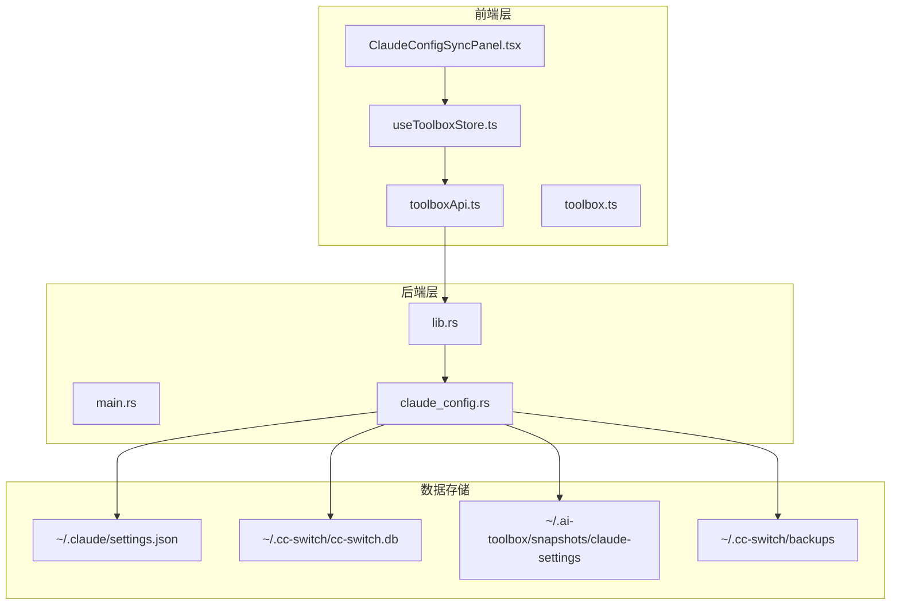
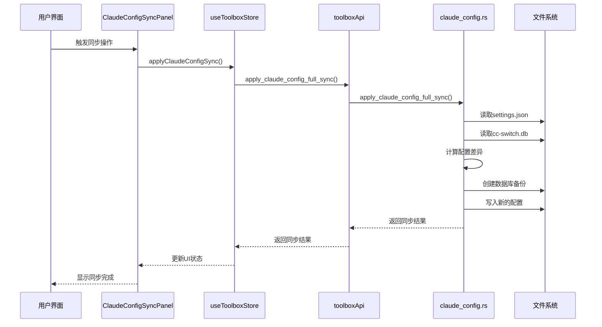
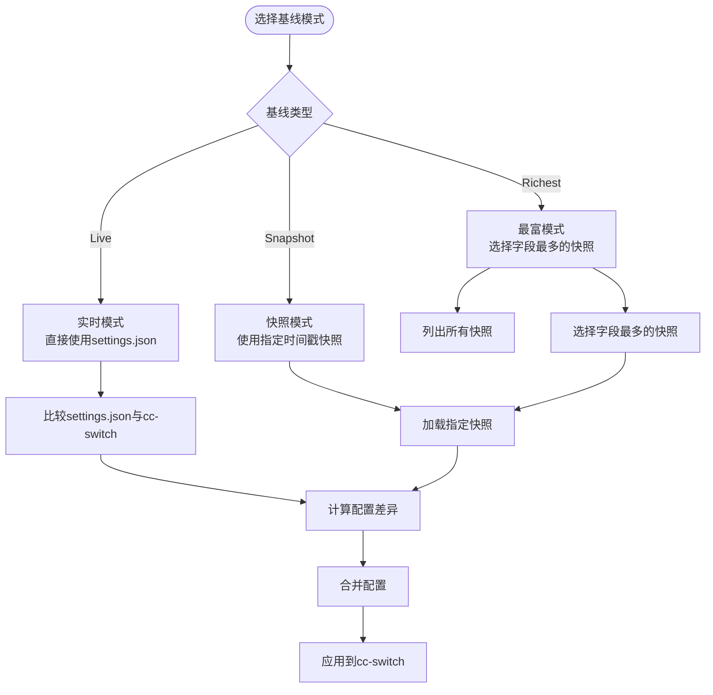
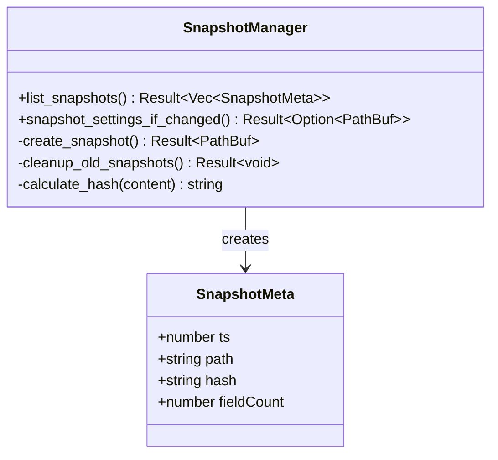
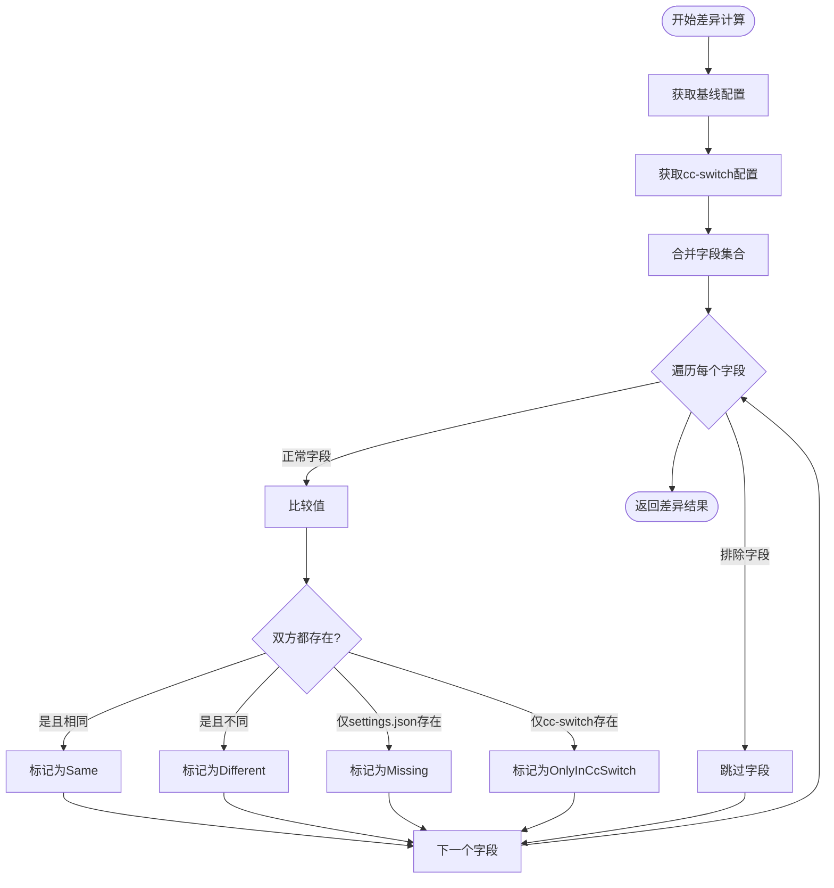
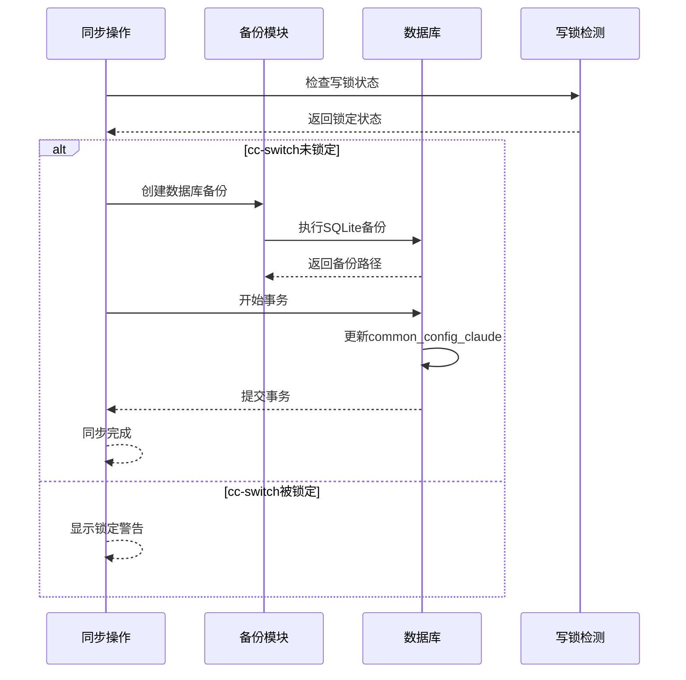
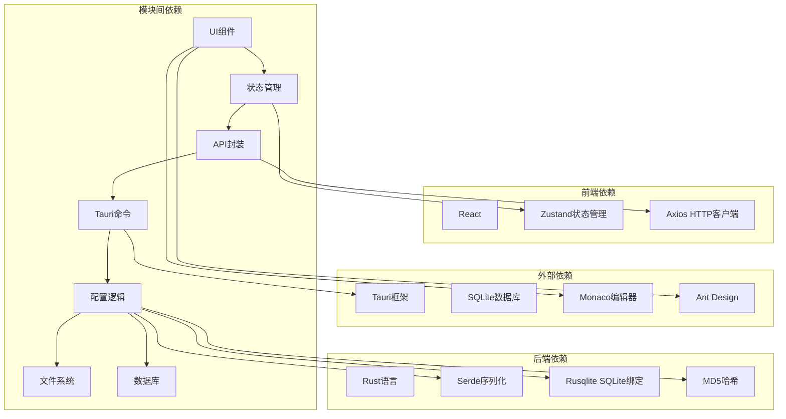

# Claude配置同步模块

<cite>
**本文档引用的文件**
- [ClaudeConfigSyncPanel.tsx](file://src/components/ClaudeConfigSyncPanel.tsx)
- [toolboxApi.ts](file://src/lib/toolboxApi.ts)
- [claude_config.rs](file://src-tauri/src/claude_config.rs)
- [useToolboxStore.ts](file://src/store/useToolboxStore.ts)
- [toolbox.ts](file://src/types/toolbox.ts)
- [lib.rs](file://src-tauri/src/lib.rs)
- [main.rs](file://src-tauri/src/main.rs)
</cite>

## 目录
1. [简介](#简介)
2. [项目结构](#项目结构)
3. [核心组件](#核心组件)
4. [架构概览](#架构概览)
5. [详细组件分析](#详细组件分析)
6. [依赖关系分析](#依赖关系分析)
7. [性能考虑](#性能考虑)
8. [故障排除指南](#故障排除指南)
9. [结论](#结论)

## 简介

Claude配置同步模块是AI工具箱中的一个关键功能，专门用于同步Claude Code编辑器的配置设置。该模块实现了智能的配置差异检测、基线模式设计、快照管理和安全同步机制，确保用户能够在不同的配置源之间进行可靠的配置同步。

该模块的核心特性包括：
- **智能差异检测**：自动比较Claude settings.json和cc-switch公共配置
- **多种基线模式**：支持实时模式、最富模式和快照模式
- **安全同步机制**：完整的备份和回滚支持
- **冲突预防**：通过排除字段机制避免provider私有配置冲突
- **可视化界面**：提供直观的配置同步面板

## 项目结构

Claude配置同步模块采用前后端分离的架构设计，主要由以下组件构成：

**图表来源**
- [ClaudeConfigSyncPanel.tsx:101-438](file://src/components/ClaudeConfigSyncPanel.tsx#L101-L438)
- [useToolboxStore.ts:145-556](file://src/store/useToolboxStore.ts#L145-L556)
- [toolboxApi.ts:756-784](file://src/lib/toolboxApi.ts#L756-L784)
- [claude_config.rs:12-523](file://src-tauri/src/claude_config.rs#L12-L523)

**章节来源**
- [ClaudeConfigSyncPanel.tsx:1-438](file://src/components/ClaudeConfigSyncPanel.tsx#L1-L438)
- [useToolboxStore.ts:1-556](file://src/store/useToolboxStore.ts#L1-L556)
- [toolboxApi.ts:1-784](file://src/lib/toolboxApi.ts#L1-L784)
- [claude_config.rs:1-523](file://src-tauri/src/claude_config.rs#L1-L523)

## 核心组件

### 前端组件

Claude配置同步面板是用户交互的主要界面，提供了完整的配置同步体验：

- **差异显示**：以表格形式展示配置差异，支持字段级别的对比
- **基线选择**：允许用户选择不同的基线模式（实时、最富、快照）
- **同步控制**：提供一键同步功能和详细的同步状态反馈
- **可视化diff**：支持字段级的JSON diff查看

### 后端服务

后端模块负责实际的配置同步逻辑，包括：

- **配置读取**：从Claude settings.json读取配置
- **差异计算**：比较配置文件和cc-switch公共配置
- **快照管理**：自动创建和管理配置快照
- **安全同步**：执行同步操作并提供备份和回滚

### 数据类型定义

模块使用了完整的类型系统来确保类型安全：

- **BaselineKind**：基线模式枚举
- **ConfigDiffType**：配置差异类型
- **SnapshotMeta**：快照元数据
- **ClaudeConfigDiffResult**：差异结果结构

**章节来源**
- [ClaudeConfigSyncPanel.tsx:38-148](file://src/components/ClaudeConfigSyncPanel.tsx#L38-L148)
- [toolbox.ts:98-134](file://src/types/toolbox.ts#L98-L134)
- [claude_config.rs:41-111](file://src-tauri/src/claude_config.rs#L41-L111)

## 架构概览

Claude配置同步模块采用了分层架构设计，确保了良好的可维护性和扩展性：

**图表来源**
- [useToolboxStore.ts:432-459](file://src/store/useToolboxStore.ts#L432-L459)
- [toolboxApi.ts:764-770](file://src/lib/toolboxApi.ts#L764-L770)
- [claude_config.rs:463-495](file://src-tauri/src/claude_config.rs#L463-L495)

**章节来源**
- [useToolboxStore.ts:412-459](file://src/store/useToolboxStore.ts#L412-L459)
- [toolboxApi.ts:756-770](file://src/lib/toolboxApi.ts#L756-L770)
- [claude_config.rs:430-495](file://src-tauri/src/claude_config.rs#L430-L495)

## 详细组件分析

### 基线模式设计

基线模式是配置同步的核心概念，提供了三种不同的配置来源：

#### 实时模式 (Live)
- **描述**：直接使用当前的settings.json作为基线
- **特点**：最及时反映最新配置变更
- **适用场景**：需要立即同步最新配置的场景

#### 最富模式 (Richest)
- **描述**：选择字段数量最多的快照作为基线
- **特点**：优先保留最完整的配置信息
- **适用场景**：需要最大化保留配置信息的场景

#### 快照模式 (Snapshot)
- **描述**：使用指定时间戳的快照作为基线
- **特点**：可以回溯到历史特定时刻的配置状态
- **适用场景**：需要精确控制同步基线的场景

**图表来源**
- [claude_config.rs:227-277](file://src-tauri/src/claude_config.rs#L227-L277)
- [claude_config.rs:389-424](file://src-tauri/src/claude_config.rs#L389-L424)

**章节来源**
- [claude_config.rs:43-53](file://src-tauri/src/claude_config.rs#L43-L53)
- [claude_config.rs:227-277](file://src-tauri/src/claude_config.rs#L227-L277)

### 快照管理功能

快照管理是配置同步的重要安全保障机制：

#### 自动快照创建
- **触发条件**：每次读取配置差异时自动检查
- **去重机制**：基于MD5哈希值避免重复快照
- **存储策略**：最多保留50个快照，超出则删除最旧的

#### 快照存储格式
- **文件命名**：`{timestamp}-{hash8}.json`
- **存储位置**：`~/.ai-toolbox/snapshots/claude-settings/`
- **元数据**：包含时间戳、哈希值、字段数量

#### 快照检索
- **排序规则**：按时间戳降序排列
- **字段统计**：记录每个快照的字段数量
- **完整性验证**：确保快照内容为JSON对象

**图表来源**
- [claude_config.rs:84-89](file://src-tauri/src/claude_config.rs#L84-L89)
- [claude_config.rs:151-225](file://src-tauri/src/claude_config.rs#L151-L225)

**章节来源**
- [claude_config.rs:151-225](file://src-tauri/src/claude_config.rs#L151-L225)
- [claude_config.rs:28-29](file://src-tauri/src/claude_config.rs#L28-L29)

### 差异对比算法

差异对比算法是配置同步的核心逻辑，实现了智能的配置比较：

#### 排除字段机制
- **排除列表**：`["env", "model", "apiKeyHelper"]`
- **目的**：避免provider私有配置的冲突
- **处理方式**：这些字段不会参与对比和同步

#### 差异类型分类
- **Missing**：settings.json存在而cc-switch不存在
- **Different**：双方都存在但值不同
- **Same**：双方都存在且值相同
- **OnlyInCcSwitch**：cc-switch存在而settings.json不存在

#### 比较策略
- **字段集合并**：使用BTreeSet确保有序遍历
- **值类型识别**：区分标量、对象、数组类型
- **深度比较**：递归比较嵌套结构

**图表来源**
- [claude_config.rs:389-424](file://src-tauri/src/claude_config.rs#L389-L424)
- [claude_config.rs:33-35](file://src-tauri/src/claude_config.rs#L33-L35)

**章节来源**
- [claude_config.rs:389-424](file://src-tauri/src/claude_config.rs#L389-L424)
- [claude_config.rs:33-35](file://src-tauri/src/claude_config.rs#L33-L35)

### 安全同步机制

安全同步机制确保了配置同步过程的可靠性和可恢复性：

#### 数据库备份
- **备份时机**：同步前自动创建数据库备份
- **备份格式**：`cc-switch.db.aitoolbox-bak.{timestamp}`
- **存储位置**：`~/.cc-switch/backups/`
- **完整性保证**：使用SQLite原生备份API

#### 写锁检测
- **检测机制**：尝试获取IMMEDIATE写锁
- **锁定判断**：无法获取写锁视为被占用
- **用户提示**：向用户显示cc-switch运行状态

#### 回滚支持
- **备份恢复**：支持从备份文件恢复数据库
- **原子操作**：使用事务确保操作的原子性
- **错误处理**：失败时自动回滚并清理

**图表来源**
- [claude_config.rs:308-330](file://src-tauri/src/claude_config.rs#L308-L330)
- [claude_config.rs:332-352](file://src-tauri/src/claude_config.rs#L332-L352)
- [claude_config.rs:463-495](file://src-tauri/src/claude_config.rs#L463-L495)

**章节来源**
- [claude_config.rs:308-383](file://src-tauri/src/claude_config.rs#L308-L383)
- [claude_config.rs:463-495](file://src-tauri/src/claude_config.rs#L463-L495)

### API接口文档

Claude配置同步模块提供了完整的API接口，支持前端调用和后端集成：

#### getClaudeConfigDiff
- **功能**：获取配置差异结果
- **参数**：`baseline?: BaselineKind`（可选基线模式）
- **返回值**：`Promise<ClaudeConfigDiffResult>`
- **用途**：刷新和显示配置差异

#### applyClaudeConfigFullSync
- **功能**：执行整段同步到cc-switch
- **参数**：`baseline?: BaselineKind`（可选基线模式）
- **返回值**：`Promise<ClaudeConfigSyncResult>`
- **用途**：执行配置同步操作

#### listClaudeSettingsSnapshots
- **功能**：列出所有快照
- **参数**：无
- **返回值**：`Promise<SnapshotMeta[]>`
- **用途**：显示可用的快照选项

#### restoreCswitchDbFromBackup
- **功能**：从备份恢复cc-switch数据库
- **参数**：`backupPath: string`
- **返回值**：`Promise<void>`
- **用途**：提供手动回滚能力

**章节来源**
- [toolboxApi.ts:756-774](file://src/lib/toolboxApi.ts#L756-L774)
- [lib.rs:1244-1262](file://src-tauri/src/lib.rs#L1244-L1262)

## 依赖关系分析

Claude配置同步模块的依赖关系体现了清晰的分层架构：

**图表来源**
- [toolboxApi.ts:1-21](file://src/lib/toolboxApi.ts#L1-L21)
- [useToolboxStore.ts:1-31](file://src/store/useToolboxStore.ts#L1-L31)
- [claude_config.rs:1-10](file://src-tauri/src/claude_config.rs#L1-L10)

**章节来源**
- [toolboxApi.ts:1-21](file://src/lib/toolboxApi.ts#L1-L21)
- [useToolboxStore.ts:1-31](file://src/store/useToolboxStore.ts#L1-L31)
- [claude_config.rs:1-10](file://src-tauri/src/claude_config.rs#L1-L10)

## 性能考虑

Claude配置同步模块在设计时充分考虑了性能优化：

### 异步操作
- **非阻塞UI**：所有网络和文件操作都是异步的
- **进度反馈**：提供loading状态和进度指示
- **并发处理**：支持多个操作同时进行

### 缓存策略
- **快照缓存**：避免重复计算相同的快照
- **差异缓存**：缓存最近的差异结果
- **配置缓存**：减少重复读取配置文件

### 内存管理
- **流式处理**：大文件采用流式读取
- **及时释放**：及时释放不再使用的资源
- **垃圾回收**：合理使用JavaScript的垃圾回收机制

### 数据库优化
- **连接池**：使用SQLite连接池提高性能
- **批量操作**：尽量使用批量数据库操作
- **索引优化**：为常用查询建立适当的索引

## 故障排除指南

### 常见问题及解决方案

#### cc-switch数据库锁定
**症状**：同步操作失败，提示cc-switch正在运行
**原因**：cc-switch进程持有数据库写锁
**解决方法**：
1. 关闭cc-switch桌面应用程序
2. 等待数据库锁释放
3. 重新尝试同步操作

#### 快照创建失败
**症状**：无法创建配置快照
**原因**：权限不足或磁盘空间不足
**解决方法**：
1. 检查`~/.ai-toolbox/snapshots/`目录权限
2. 确保有足够的磁盘空间
3. 清理旧的快照文件

#### 配置同步失败
**症状**：同步过程中断或部分失败
**原因**：数据库写入失败或备份创建失败
**解决方法**：
1. 检查数据库文件权限
2. 验证备份目录空间
3. 使用备份恢复功能回滚

### 调试技巧

#### 日志分析
- **前端日志**：检查浏览器开发者工具的console输出
- **后端日志**：查看Tauri应用的日志文件
- **数据库日志**：监控SQLite操作日志

#### 状态检查
- **配置文件状态**：验证settings.json文件完整性
- **数据库状态**：检查cc-switch.db文件可访问性
- **快照状态**：确认快照文件存在且可读

**章节来源**
- [claude_config.rs:308-330](file://src-tauri/src/claude_config.rs#L308-L330)
- [claude_config.rs:497-522](file://src-tauri/src/claude_config.rs#L497-L522)

## 结论

Claude配置同步模块是一个设计精良、功能完整的配置管理解决方案。它通过智能的基线模式、完善的快照管理和严格的安全机制，为用户提供了可靠的配置同步体验。

### 主要优势
- **智能化设计**：支持多种基线模式，适应不同使用场景
- **安全性保障**：完整的备份和回滚机制
- **用户体验**：直观的可视化界面和详细的反馈信息
- **扩展性**：清晰的架构设计便于功能扩展

### 技术亮点
- **差异算法**：高效的配置差异检测和比较
- **快照管理**：智能的快照创建和存储策略
- **安全同步**：可靠的数据库备份和事务处理
- **错误处理**：完善的异常处理和用户提示

该模块为AI工具箱提供了重要的配置管理能力，是整个系统不可或缺的一部分。通过持续的优化和改进，它将继续为用户提供更好的配置同步体验。