# 中央仓库模块

<cite>
**本文档引用的文件**
- [central_repo.rs](file://src-tauri/src/central_repo.rs)
- [toolboxApi.ts](file://src/lib/toolboxApi.ts)
- [CenterRepoPanel.tsx](file://src/components/CenterRepoPanel.tsx)
- [useToolboxStore.ts](file://src/store/useToolboxStore.ts)
- [center_skill_store.rs](file://src-tauri/src/store/center_skill_store.rs)
- [lib.rs](file://src-tauri/src/lib.rs)
- [toolbox.ts](file://src/types/toolbox.ts)
</cite>

## 目录
1. [简介](#简介)
2. [项目结构](#项目结构)
3. [核心组件](#核心组件)
4. [架构概览](#架构概览)
5. [详细组件分析](#详细组件分析)
6. [依赖关系分析](#依赖关系分析)
7. [性能考虑](#性能考虑)
8. [故障排除指南](#故障排除指南)
9. [结论](#结论)

## 简介

中央仓库模块是AI工具箱的核心功能之一，负责统一管理和协调各个工具间的技能资源。该模块提供了完整的技能生命周期管理，包括技能发现、导入、同步、分类和状态跟踪等功能。

本模块采用前后端分离的设计架构，前端使用React构建用户界面，后端使用Rust实现高性能的数据处理和文件操作。通过Tauri框架实现跨平台兼容性，支持Windows、macOS和Linux操作系统。

## 项目结构

中央仓库模块主要分布在以下目录和文件中：

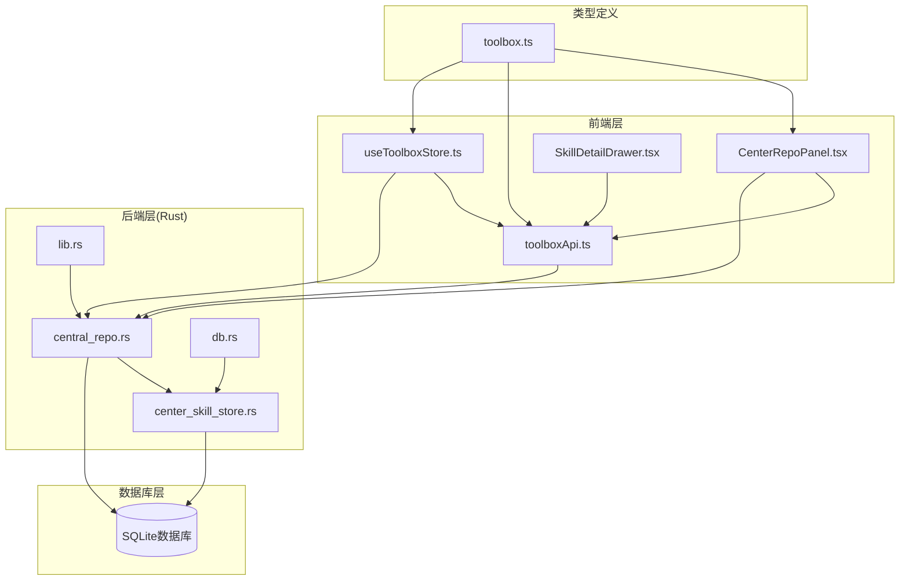

**图表来源**
- [CenterRepoPanel.tsx:1-852](file://src/components/CenterRepoPanel.tsx#L1-L852)
- [toolboxApi.ts:1-784](file://src/lib/toolboxApi.ts#L1-L784)
- [central_repo.rs:1-726](file://src-tauri/src/central_repo.rs#L1-L726)

**章节来源**
- [central_repo.rs:1-726](file://src-tauri/src/central_repo.rs#L1-L726)
- [toolboxApi.ts:1-784](file://src/lib/toolboxApi.ts#L1-L784)
- [CenterRepoPanel.tsx:1-852](file://src/components/CenterRepoPanel.tsx#L1-L852)

## 核心组件

### 1. 技能发现机制

中央仓库实现了智能的技能发现算法，能够自动扫描各工具目录中的技能资源：

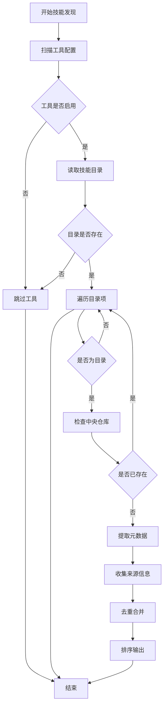

**图表来源**
- [central_repo.rs:155-220](file://src-tauri/src/central_repo.rs#L155-L220)

### 2. 技能导入流程

支持多种导入方式，包括从工具导入、Git安装和批量导入：

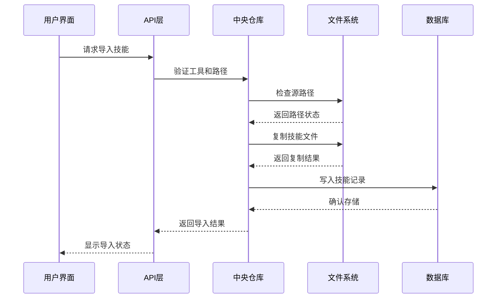

**图表来源**
- [central_repo.rs:226-301](file://src-tauri/src/central_repo.rs#L226-L301)
- [toolboxApi.ts:636-721](file://src/lib/toolboxApi.ts#L636-L721)

### 3. 技能分类管理系统

提供灵活的分类标签系统，支持自定义分类和批量管理：

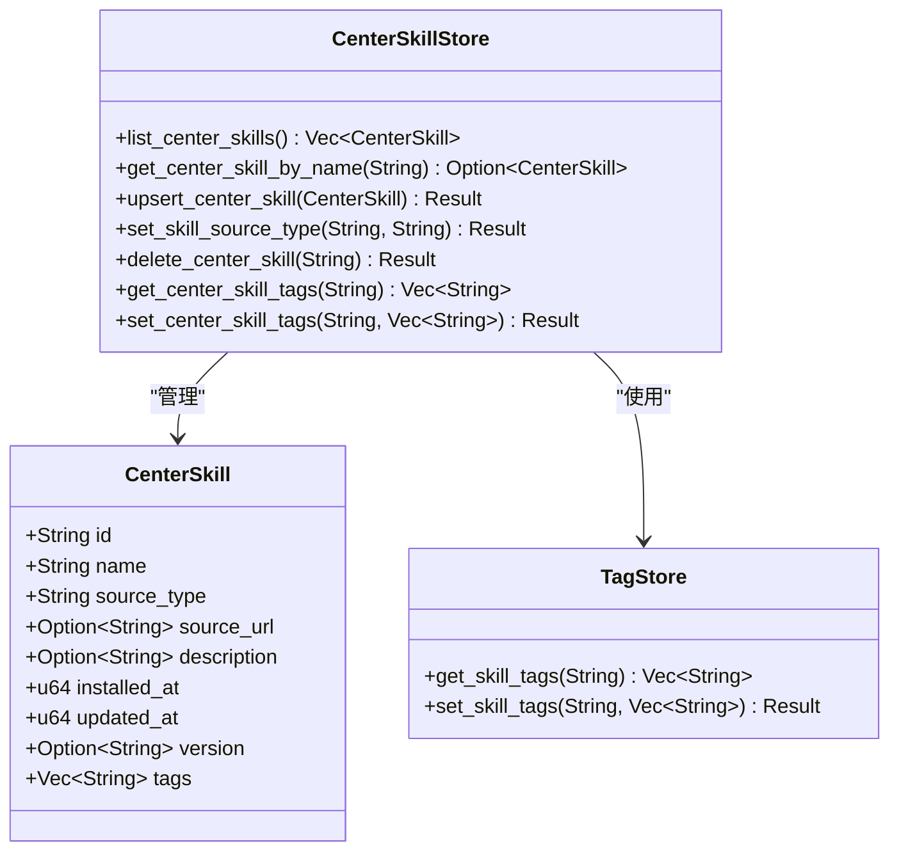

**图表来源**
- [center_skill_store.rs:8-299](file://src-tauri/src/store/center_skill_store.rs#L8-L299)

**章节来源**
- [central_repo.rs:155-220](file://src-tauri/src/central_repo.rs#L155-L220)
- [toolboxApi.ts:636-721](file://src/lib/toolboxApi.ts#L636-L721)
- [center_skill_store.rs:8-299](file://src-tauri/src/store/center_skill_store.rs#L8-L299)

## 架构概览

中央仓库模块采用分层架构设计，确保了良好的可维护性和扩展性：

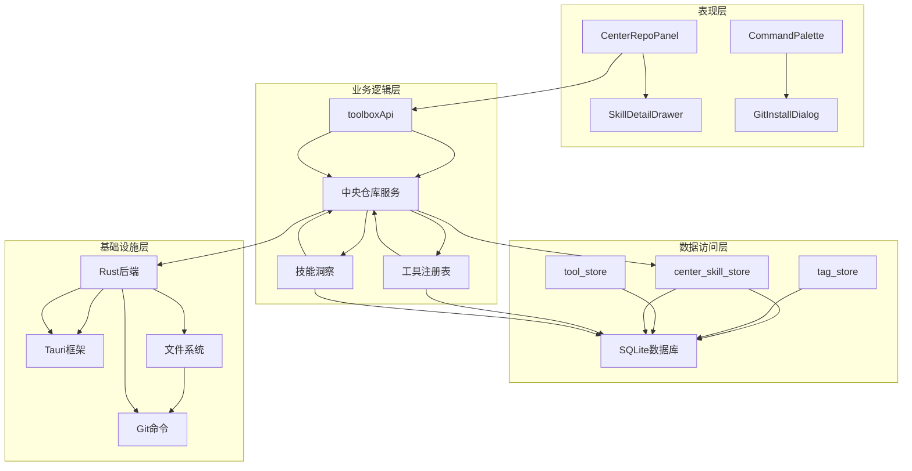

**图表来源**
- [lib.rs:1-800](file://src-tauri/src/lib.rs#L1-L800)
- [toolboxApi.ts:1-784](file://src/lib/toolboxApi.ts#L1-L784)

## 详细组件分析

### 技能发现算法

技能发现机制是中央仓库的核心功能，它能够智能地扫描各工具的技能目录，识别出尚未入库的技能资源。

#### 发现算法流程

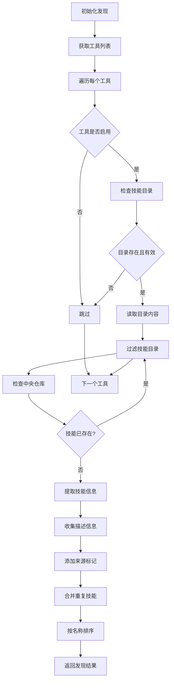

**图表来源**
- [central_repo.rs:155-220](file://src-tauri/src/central_repo.rs#L155-L220)

#### 元数据提取机制

系统能够从SKILL.md文件中提取丰富的元数据信息：

| 元数据字段 | 提取来源 | 用途 |
|------------|----------|------|
| 技能名称 | 目录名称 | 标识和排序 |
| 技能描述 | SKILL.md | 用户界面展示 |
| 版本信息 | SKILL.md | 版本控制和更新检测 |
| 作者信息 | SKILL.md | 版权和归属标识 |
| 依赖关系 | SKILL.md | 依赖管理 |
| 使用示例 | SKILL.md | 教程和演示 |

**章节来源**
- [central_repo.rs:155-220](file://src-tauri/src/central_repo.rs#L155-L220)
- [central_repo.rs:130-145](file://src-tauri/src/central_repo.rs#L130-L145)

### 技能导入流程

系统支持多种技能导入方式，每种方式都有其特定的使用场景和优势。

#### Git安装流程

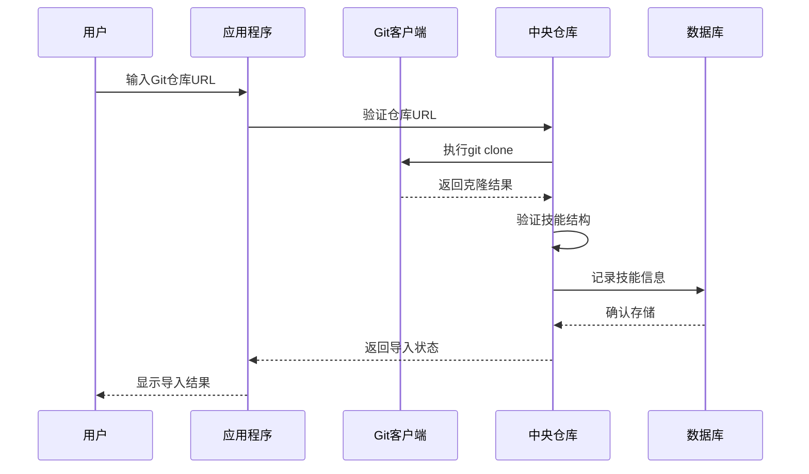

**图表来源**
- [central_repo.rs:307-348](file://src-tauri/src/central_repo.rs#L307-L348)

#### 工具导入流程

从其他工具导入技能时，系统会保持原有的文件结构和权限设置：

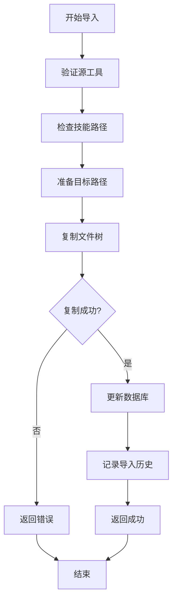

**图表来源**
- [central_repo.rs:450-473](file://src-tauri/src/central_repo.rs#L450-L473)

**章节来源**
- [central_repo.rs:307-348](file://src-tauri/src/central_repo.rs#L307-L348)
- [central_repo.rs:450-473](file://src-tauri/src/central_repo.rs#L450-L473)

### 技能同步状态跟踪

系统提供了完整的同步状态跟踪机制，能够实时监控技能在各工具间的同步状态。

#### 同步状态检查

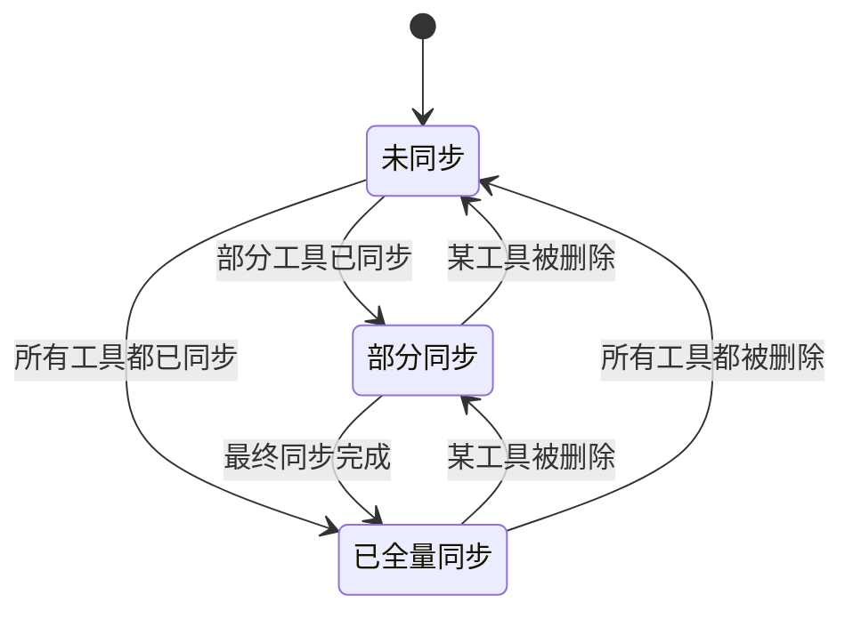

**图表来源**
- [CenterRepoPanel.tsx:122-129](file://src/components/CenterRepoPanel.tsx#L122-L129)

#### 冲突解决策略

系统支持三种冲突解决策略：

| 策略 | 行为 | 适用场景 |
|------|------|----------|
| 跳过 | 直接跳过目标已存在的文件 | 需要保护现有数据 |
| 覆盖 | 删除目标文件后重新同步 | 需要完全一致的副本 |
| 重命名 | 在目标路径添加时间戳后缀 | 需要保留所有版本 |

**章节来源**
- [CenterRepoPanel.tsx:122-129](file://src/components/CenterRepoPanel.tsx#L122-L129)
- [central_repo.rs:403-444](file://src-tauri/src/central_repo.rs#L403-L444)

### 分类管理功能

中央仓库提供了灵活的分类管理系统，支持多维度的技能组织和检索。

#### 分类标签系统

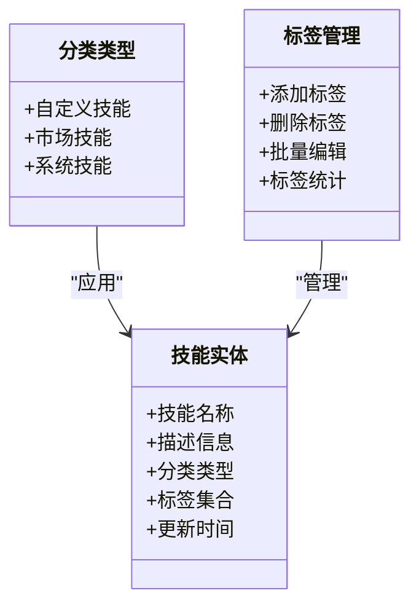

**图表来源**
- [CenterRepoPanel.tsx:405-409](file://src/components/CenterRepoPanel.tsx#L405-L409)

#### 搜索和过滤功能

系统支持多种搜索和过滤方式：

| 过滤类型 | 实现方式 | 性能特点 |
|----------|----------|----------|
| 关键词搜索 | 全文索引 | 快速匹配 |
| 分类过滤 | 数据库查询 | 高效筛选 |
| 状态过滤 | 内存计算 | 即时响应 |
| 时间范围 | 服务器端过滤 | 精确控制 |

**章节来源**
- [CenterRepoPanel.tsx:131-148](file://src/components/CenterRepoPanel.tsx#L131-L148)
- [toolboxApi.ts:658-666](file://src/lib/toolboxApi.ts#L658-L666)

## 依赖关系分析

中央仓库模块的依赖关系体现了清晰的分层架构：

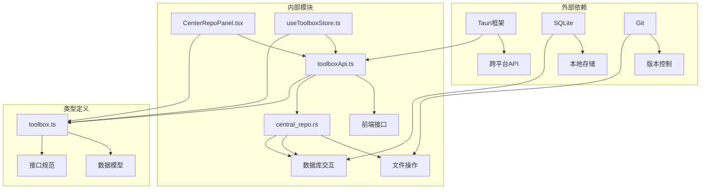

**图表来源**
- [lib.rs:1-800](file://src-tauri/src/lib.rs#L1-L800)
- [toolboxApi.ts:1-784](file://src/lib/toolboxApi.ts#L1-L784)

**章节来源**
- [lib.rs:1-800](file://src-tauri/src/lib.rs#L1-L800)
- [toolboxApi.ts:1-784](file://src/lib/toolboxApi.ts#L1-L784)

## 性能考虑

### 文件操作优化

中央仓库模块在文件操作方面采用了多项优化措施：

1. **递归复制优化**: 使用深度优先搜索算法，减少内存占用
2. **符号链接处理**: 正确解析和处理符号链接，避免无限循环
3. **并发处理**: 对于独立的技能导入任务，支持并行执行

### 数据库性能

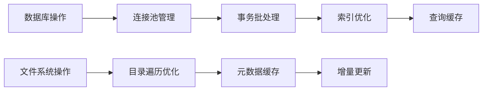

**图表来源**
- [center_skill_store.rs:129-196](file://src-tauri/src/store/center_skill_store.rs#L129-L196)

### 内存管理

系统采用渐进式加载策略，避免一次性加载大量数据：

- **分页加载**: 技能列表支持分页显示
- **懒加载**: 图标和详细信息按需加载
- **缓存策略**: 频繁访问的数据进行缓存

## 故障排除指南

### 常见问题及解决方案

| 问题类型 | 症状 | 可能原因 | 解决方案 |
|----------|------|----------|----------|
| 技能导入失败 | 导入后技能缺失 | Git仓库不可访问 | 检查网络连接和仓库URL |
| 同步冲突 | 目标文件被覆盖 | 冲突策略设置不当 | 调整冲突解决策略 |
| 搜索无结果 | 关键词无法匹配 | 数据库索引损坏 | 重建索引或重启应用 |
| 性能缓慢 | 页面加载卡顿 | 缓存未生效 | 清除缓存或重启应用 |

### 错误处理机制

系统提供了完善的错误处理和用户反馈机制：

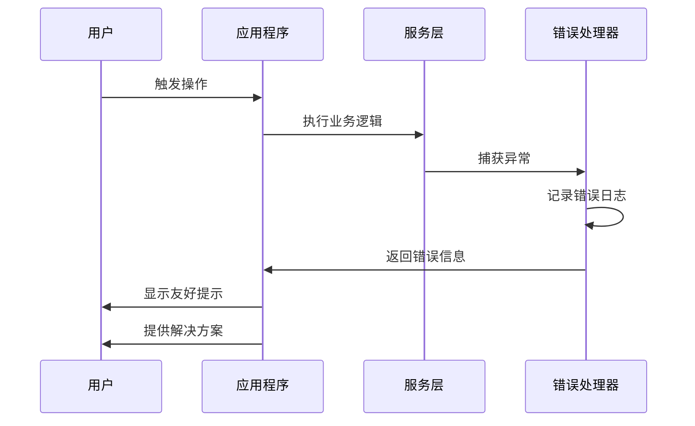

**图表来源**
- [toolboxApi.ts:184-215](file://src/lib/toolboxApi.ts#L184-L215)

**章节来源**
- [toolboxApi.ts:184-215](file://src/lib/toolboxApi.ts#L184-L215)

## 结论

中央仓库模块为AI工具箱提供了强大而灵活的技能管理能力。通过智能的技能发现机制、多样化的导入方式、完善的分类管理和精确的状态跟踪，该模块有效地解决了多工具间技能资源的统一管理问题。

模块的设计充分考虑了性能、可维护性和用户体验，在保证功能完整性的同时，也确保了系统的稳定性和扩展性。未来可以进一步增强的功能包括：

1. **智能推荐系统**: 基于使用历史和相似度算法推荐相关技能
2. **版本比较工具**: 提供详细的版本差异对比和合并建议
3. **批量操作优化**: 支持更大规模的批量导入和同步操作
4. **云端同步**: 支持多设备间的技能同步和备份

通过持续的优化和改进，中央仓库模块将继续为用户提供卓越的技能管理体验。