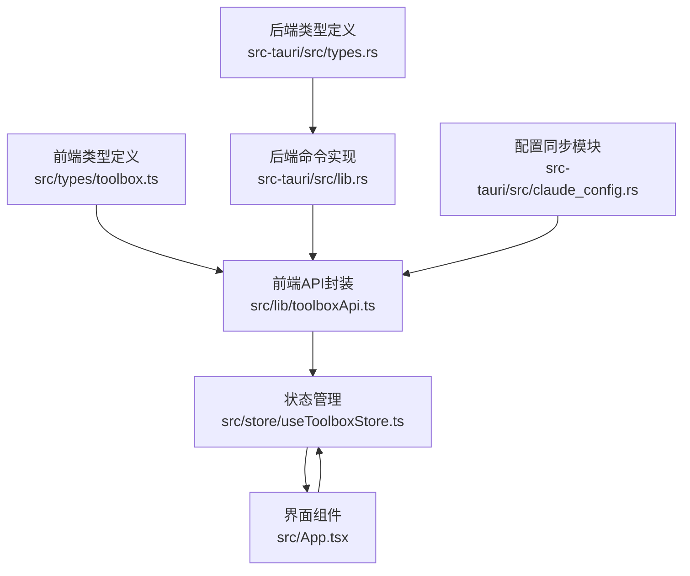
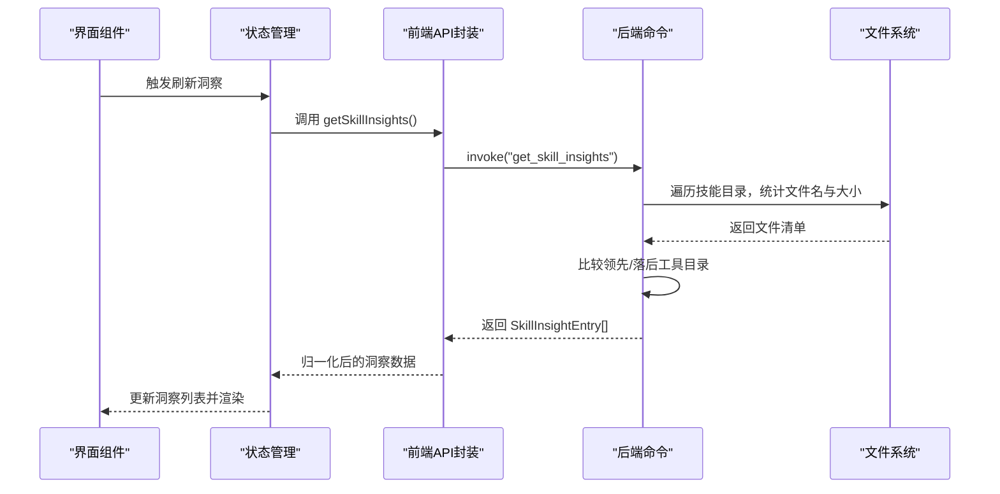
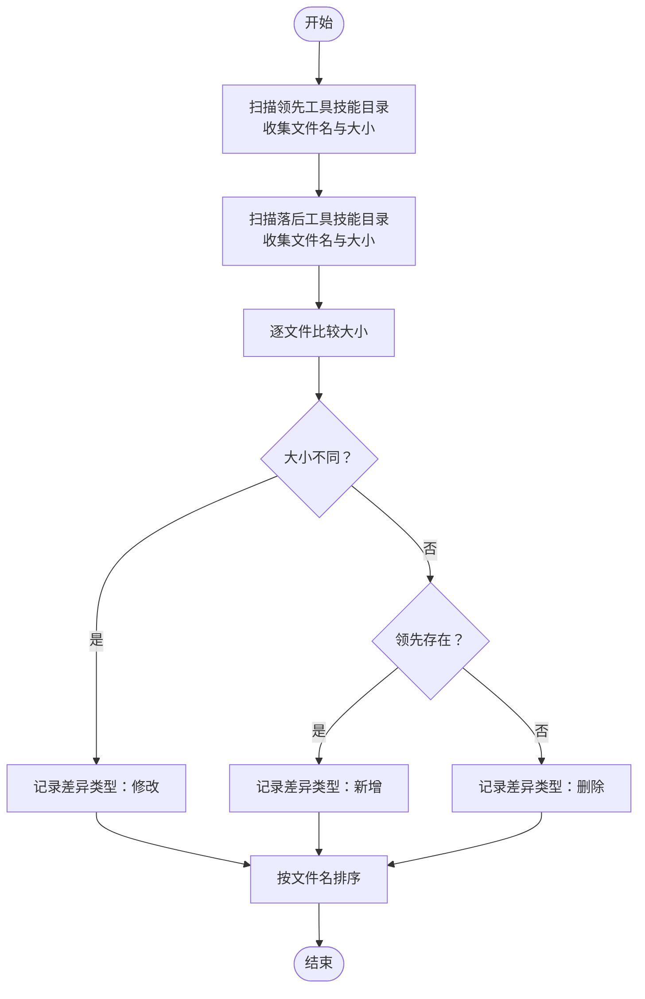
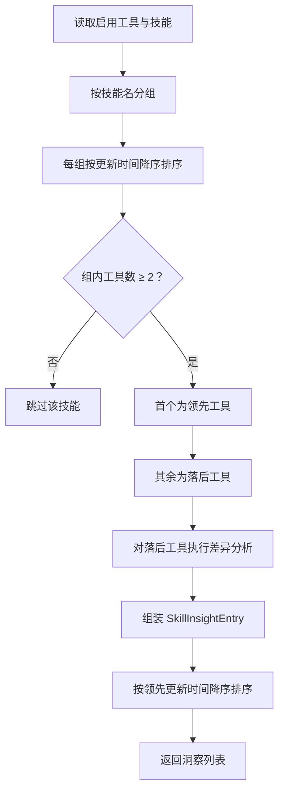
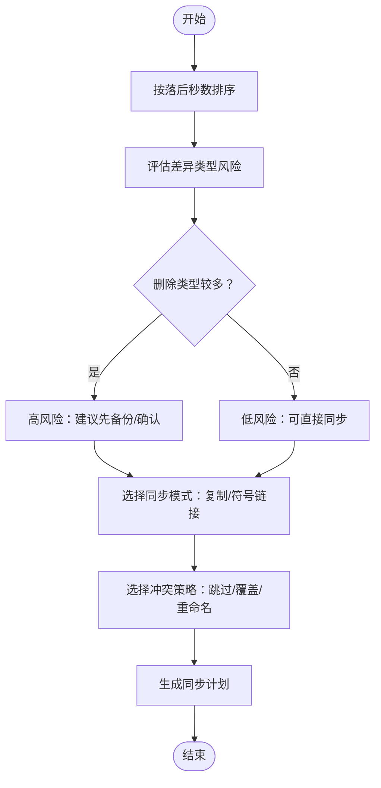
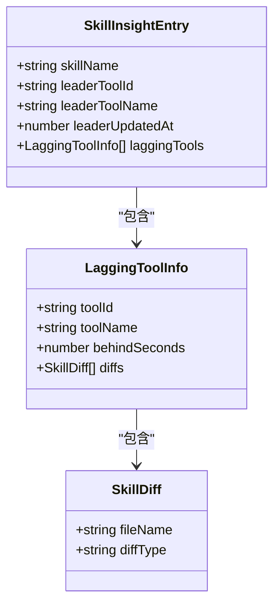
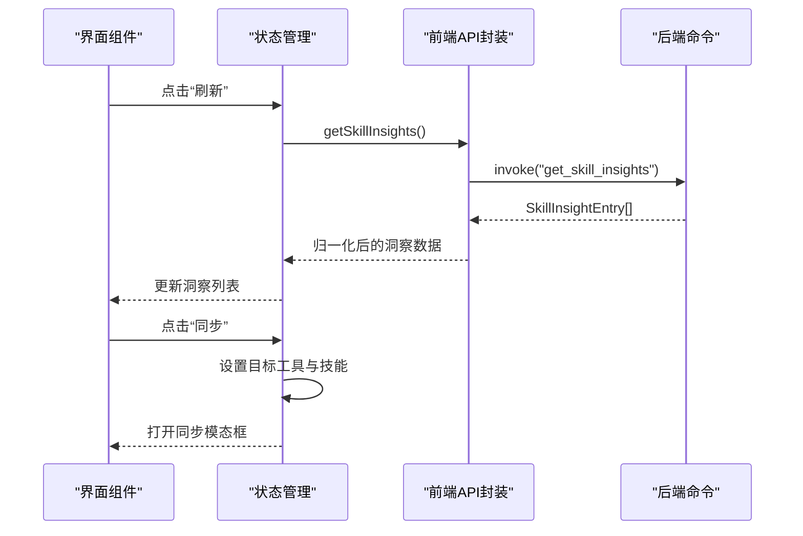
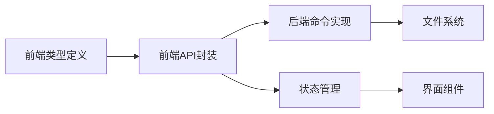

# 变动洞察模块

<cite>
**本文档引用的文件**
- [src/types/toolbox.ts](file://src/types/toolbox.ts)
- [src-tauri/src/types.rs](file://src-tauri/src/types.rs)
- [src/lib/toolboxApi.ts](file://src/lib/toolboxApi.ts)
- [src-tauri/src/lib.rs](file://src-tauri/src/lib.rs)
- [src-tauri/src/claude_config.rs](file://src-tauri/src/claude_config.rs)
- [src/App.tsx](file://src/App.tsx)
- [src/store/useToolboxStore.ts](file://src/store/useToolboxStore.ts)
- [src/components/ClaudeConfigSyncPanel.tsx](file://src/components/ClaudeConfigSyncPanel.tsx)
</cite>

## 目录
1. [简介](#简介)
2. [项目结构](#项目结构)
3. [核心组件](#核心组件)
4. [架构总览](#架构总览)
5. [详细组件分析](#详细组件分析)
6. [依赖关系分析](#依赖关系分析)
7. [性能考量](#性能考量)
8. [故障排查指南](#故障排查指南)
9. [结论](#结论)
10. [附录](#附录)

## 简介
变动洞察模块负责对多工具环境中的技能文件进行差异分析与同步建议，帮助用户识别“领先工具”与“落后工具”，并提供差异详情与一键同步入口。模块涵盖以下能力：
- 技能文件对比：基于文件名与大小的差异检测，识别新增、修改、删除三类差异。
- 工具比较机制：按技能维度聚合各工具的更新时间，确定领先工具与落后工具。
- 同步建议生成：基于时间差与差异详情，给出同步优先级与风险提示。
- 洞察数据结构：统一的洞察模型与前端渲染组件，支持刷新与交互。

## 项目结构
变动洞察相关代码分布在前端类型定义、前端API封装、后端命令实现与UI组件中，形成“类型定义 → API封装 → 命令实现 → UI渲染”的完整链路。

图表来源
- [src/types/toolbox.ts:86-92](file://src/types/toolbox.ts#L86-L92)
- [src/lib/toolboxApi.ts:398-405](file://src/lib/toolboxApi.ts#L398-L405)
- [src-tauri/src/types.rs:87-93](file://src-tauri/src/types.rs#L87-L93)
- [src-tauri/src/lib.rs:684-755](file://src-tauri/src/lib.rs#L684-L755)
- [src-tauri/src/claude_config.rs:93-103](file://src-tauri/src/claude_config.rs#L93-L103)

章节来源
- [src/types/toolbox.ts:1-152](file://src/types/toolbox.ts#L1-L152)
- [src-tauri/src/types.rs:1-367](file://src-tauri/src/types.rs#L1-L367)

## 核心组件
- 洞察数据结构
  - SkillInsightEntry：技能洞察条目，包含技能名、领先工具信息与落后工具列表。
  - LaggingToolInfo：落后工具信息，包含工具ID/名称、落后秒数与差异详情。
  - SkillDiff：差异条目，包含文件名与差异类型（新增/修改/删除）。
- 前端API
  - getSkillInsights：调用后端命令获取洞察数据，并进行响应归一化。
- 后端命令
  - get_skill_insights：从工具注册表中提取启用工具及其技能，按技能分组并计算领先/落后工具及差异。
- UI组件
  - 变动洞察卡片：展示技能名、领先工具、落后数量、刷新按钮与一键同步按钮。
  - 状态管理：维护洞察列表、加载状态与交互行为。

章节来源
- [src/types/toolbox.ts:74-92](file://src/types/toolbox.ts#L74-L92)
- [src/lib/toolboxApi.ts:398-405](file://src/lib/toolboxApi.ts#L398-L405)
- [src-tauri/src/lib.rs:684-755](file://src-tauri/src/lib.rs#L684-L755)
- [src/App.tsx:1146-1358](file://src/App.tsx#L1146-L1358)

## 架构总览
变动洞察的端到端流程如下：
- 前端通过API封装调用后端命令。
- 后端从工具注册表中筛选启用工具，收集每个技能的更新时间与路径。
- 对每个技能，按更新时间排序，确定领先工具与落后工具。
- 对落后工具，比较其技能目录与领先工具目录，生成差异详情。
- 将洞察结果按领先更新时间降序排列，返回给前端。
- 前端进行响应归一化与渲染。

图表来源
- [src/lib/toolboxApi.ts:398-405](file://src/lib/toolboxApi.ts#L398-L405)
- [src-tauri/src/lib.rs:684-755](file://src-tauri/src/lib.rs#L684-L755)
- [src-tauri/src/lib.rs:630-682](file://src-tauri/src/lib.rs#L630-L682)

## 详细组件分析

### 差异分析算法
- 文件扫描
  - 遍历技能目录，收集文件名与大小，按文件名排序。
- 差异判定
  - 若文件存在于领先目录且大小不同，则标记为“修改”。
  - 若文件仅存在于领先目录，则标记为“新增”。
  - 若文件仅存在于落后目录，则标记为“删除”。
- 结果输出
  - 差异列表按文件名排序，作为落后工具的差异详情。

图表来源
- [src-tauri/src/lib.rs:630-682](file://src-tauri/src/lib.rs#L630-L682)

章节来源
- [src-tauri/src/lib.rs:630-682](file://src-tauri/src/lib.rs#L630-L682)

### 工具比较机制
- 数据聚合
  - 从工具注册表中筛选启用工具，遍历每个工具的技能，提取技能名、更新时间与路径。
- 排序与分组
  - 按技能名分组，每组内按更新时间降序排序。
- 领先/落后判定
  - 更新时间最高的工具为领先工具；其余为落后工具。
- 差异生成
  - 对落后工具，调用差异分析算法生成差异详情。
- 结果排序
  - 按领先工具的更新时间降序排列洞察结果。

图表来源
- [src-tauri/src/lib.rs:684-755](file://src-tauri/src/lib.rs#L684-L755)

章节来源
- [src-tauri/src/lib.rs:684-755](file://src-tauri/src/lib.rs#L684-L755)

### 同步建议算法
- 同步优先级
  - 以“落后秒数”作为优先级指标：落后越久，优先级越高。
- 冲突风险评估
  - 基于差异详情中的“修改/删除”类型评估冲突风险；删除类型通常风险更高。
- 最优同步路径推荐
  - 建议优先同步“修改”较多的落后工具，其次为“新增”；避免直接覆盖“删除”导致的数据丢失。
  - 提供“复制/符号链接”两种模式与“跳过/覆盖/重命名”三种冲突策略，由用户选择。

图表来源
- [src-tauri/src/lib.rs:971-1007](file://src-tauri/src/lib.rs#L971-L1007)
- [src-tauri/src/lib.rs:600-613](file://src-tauri/src/lib.rs#L600-L613)

章节来源
- [src-tauri/src/lib.rs:971-1007](file://src-tauri/src/lib.rs#L971-L1007)
- [src-tauri/src/lib.rs:600-613](file://src-tauri/src/lib.rs#L600-L613)

### 洞察数据结构
- SkillInsightEntry
  - skillName：技能名
  - leaderToolId/leaderToolName：领先工具ID与名称
  - leaderUpdatedAt：领先工具更新时间
  - laggingTools：落后工具数组
- LaggingToolInfo
  - toolId/toolName：工具ID与名称
  - behindSeconds：落后秒数
  - diffs：差异详情数组
- SkillDiff
  - fileName：文件名
  - diffType：差异类型（added/modified/deleted）

图表来源
- [src/types/toolbox.ts:86-92](file://src/types/toolbox.ts#L86-L92)
- [src-tauri/src/types.rs:87-93](file://src-tauri/src/types.rs#L87-L93)

章节来源
- [src/types/toolbox.ts:74-92](file://src/types/toolbox.ts#L74-L92)
- [src-tauri/src/types.rs:71-93](file://src-tauri/src/types.rs#L71-L93)

### getSkillInsights API 使用指南
- 调用方式
  - 前端通过API封装调用后端命令：invoke("get_skill_insights")。
- 返回数据解析
  - 响应可能为数组或包含data/items字段的对象，API会统一解析为SkillInsightEntry[]。
  - 对每个洞察条目，解析落后工具数组与差异详情数组。
- 洞察结果展示
  - UI组件展示技能名、领先工具、落后数量、领先更新时间与一键同步按钮。
  - 支持刷新按钮触发重新拉取洞察。
- 用户交互设计
  - 点击“同步”按钮，自动填充目标工具（落后工具）与技能，打开同步模态框。
  - 提供同步模式与冲突策略选择，完成后刷新工具列表与洞察。

图表来源
- [src/lib/toolboxApi.ts:398-405](file://src/lib/toolboxApi.ts#L398-L405)
- [src-tauri/src/lib.rs:684-755](file://src-tauri/src/lib.rs#L684-L755)
- [src/App.tsx:1300-1358](file://src/App.tsx#L1300-L1358)

章节来源
- [src/lib/toolboxApi.ts:398-405](file://src/lib/toolboxApi.ts#L398-L405)
- [src/App.tsx:1300-1358](file://src/App.tsx#L1300-L1358)

### 实际使用场景与最佳实践
- 场景一：多工具团队协作
  - 团队成员使用不同工具（如Codex、Claude等），通过变动洞察识别谁是“领先者”，谁是“落后者”，并按“落后秒数”优先同步。
- 场景二：技能版本演进
  - 当某个技能在领先工具中频繁更新时，落后工具需要尽快同步；对于“删除”类型的差异，建议先确认是否误删再覆盖。
- 场景三：自动化同步
  - 可结合定时任务定期刷新洞察，配合“复制/符号链接”与“跳过/覆盖/重命名”策略，实现半自动化同步。
- 最佳实践
  - 优先处理“修改”差异，其次“新增”，最后“删除”。
  - 使用“符号链接”模式减少磁盘占用，但需确保跨平台兼容性。
  - 冲突策略建议默认“跳过”，在确认安全后再选择“覆盖”或“重命名”。

## 依赖关系分析
- 前端类型与后端类型
  - 前端类型定义与后端类型定义一一对应，保证序列化/反序列化一致性。
- 前端API与后端命令
  - 前端API封装通过invoke调用后端命令，后端命令负责业务逻辑与文件系统操作。
- UI与状态管理
  - 状态管理负责加载状态、错误反馈与交互控制，UI负责展示与事件绑定。

图表来源
- [src/types/toolbox.ts:86-92](file://src/types/toolbox.ts#L86-L92)
- [src/lib/toolboxApi.ts:398-405](file://src/lib/toolboxApi.ts#L398-L405)
- [src-tauri/src/lib.rs:684-755](file://src-tauri/src/lib.rs#L684-L755)
- [src/store/useToolboxStore.ts:207-217](file://src/store/useToolboxStore.ts#L207-L217)

章节来源
- [src/store/useToolboxStore.ts:207-217](file://src/store/useToolboxStore.ts#L207-L217)

## 性能考量
- 文件扫描复杂度
  - 对每个技能目录进行O(n log n)排序（n为文件数），整体复杂度与技能数量与文件数量线性相关。
- 内存占用
  - 差异分析使用哈希映射存储文件名与大小，空间复杂度为O(n)。
- I/O优化
  - 建议缓存工具注册表与技能元数据，减少重复读取。
- 并发与批处理
  - 可考虑并发处理多个技能的差异分析，进一步提升吞吐量。

## 故障排查指南
- 无法获取洞察
  - 检查工具注册表是否正确加载，确认启用工具与技能路径有效。
  - 查看后端日志，确认文件系统访问权限与路径是否存在。
- 差异为空
  - 确认领先/落后工具的技能目录是否真实存在，文件是否被正确扫描。
- 同步失败
  - 检查冲突策略与同步模式是否合适；必要时选择“跳过”或“重命名”。
  - 确认目标路径权限与磁盘空间充足。

章节来源
- [src-tauri/src/lib.rs:684-755](file://src-tauri/src/lib.rs#L684-L755)
- [src-tauri/src/lib.rs:971-1007](file://src-tauri/src/lib.rs#L971-L1007)

## 结论
变动洞察模块通过“时间戳比较 + 文件级差异分析 + 可视化交互”的方式，帮助用户快速定位落后工具并生成合理的同步建议。结合灵活的同步模式与冲突策略，可在保证数据安全的前提下高效完成多工具环境下的技能同步。

## 附录
- 相关类型定义与命令实现可参考以下文件：
  - [src/types/toolbox.ts](file://src/types/toolbox.ts)
  - [src-tauri/src/types.rs](file://src-tauri/src/types.rs)
  - [src/lib/toolboxApi.ts](file://src/lib/toolboxApi.ts)
  - [src-tauri/src/lib.rs](file://src-tauri/src/lib.rs)
  - [src-tauri/src/claude_config.rs](file://src-tauri/src/claude_config.rs)
  - [src/App.tsx](file://src/App.tsx)
  - [src/store/useToolboxStore.ts](file://src/store/useToolboxStore.ts)
  - [src/components/ClaudeConfigSyncPanel.tsx](file://src/components/ClaudeConfigSyncPanel.tsx)