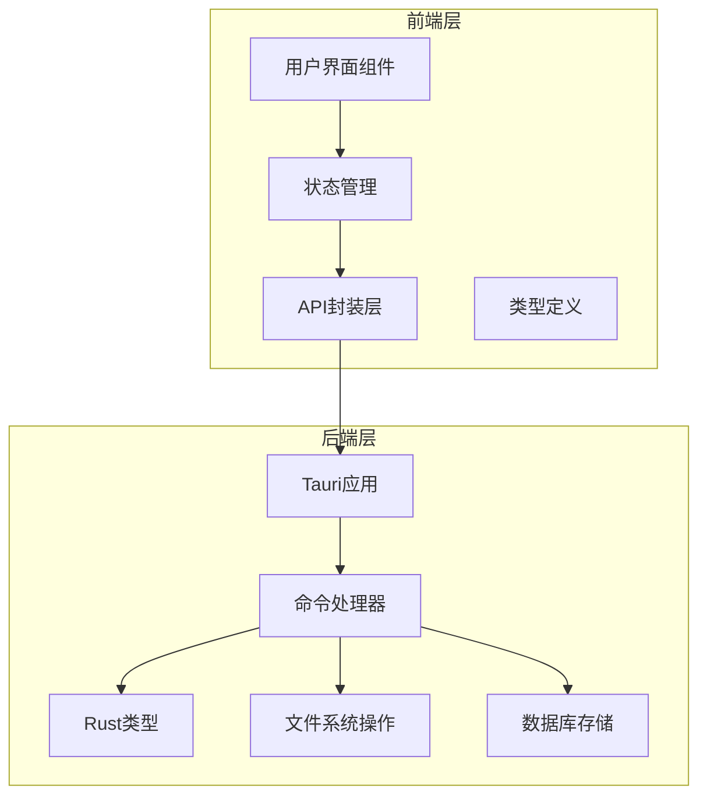
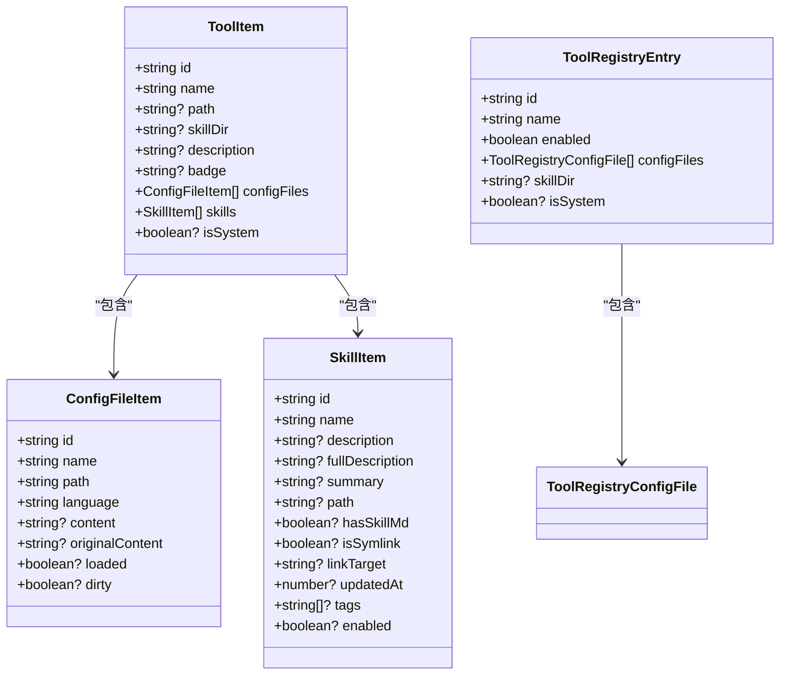
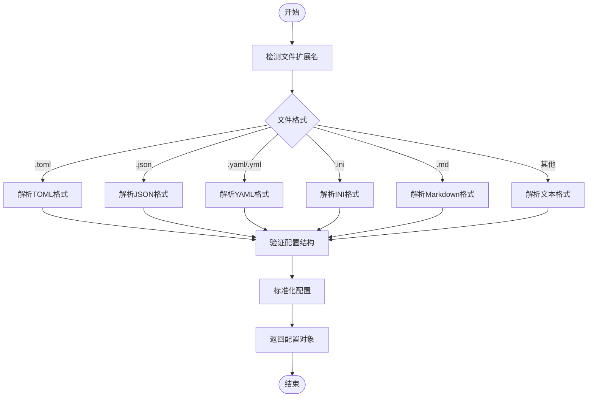
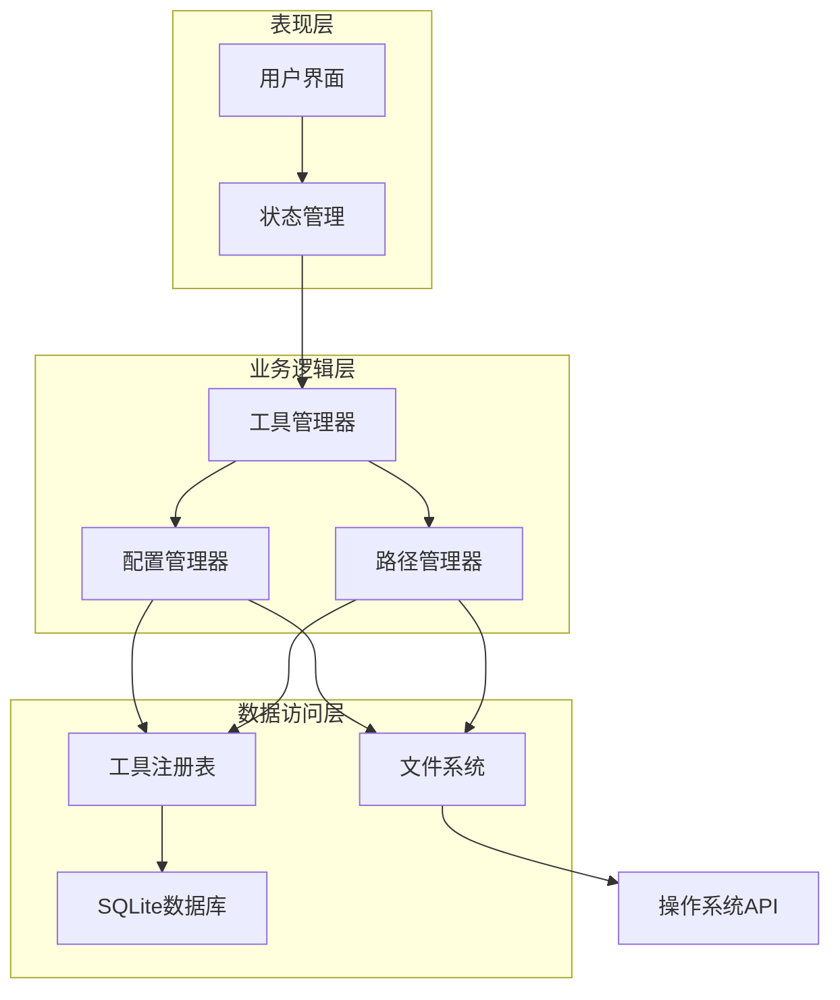
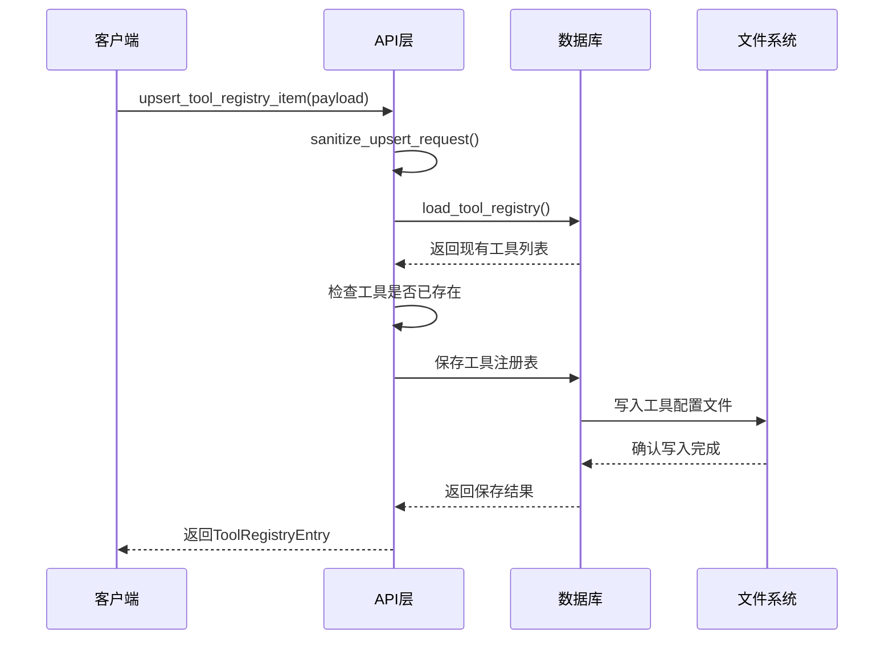
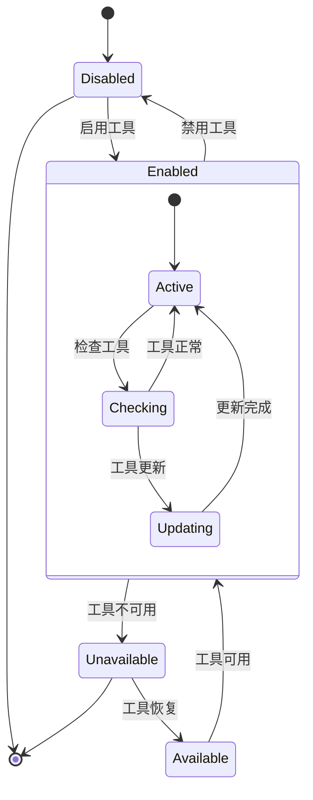
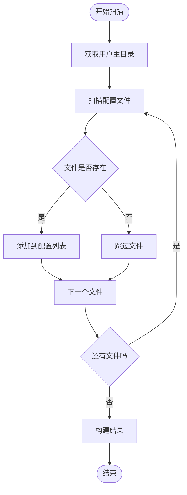
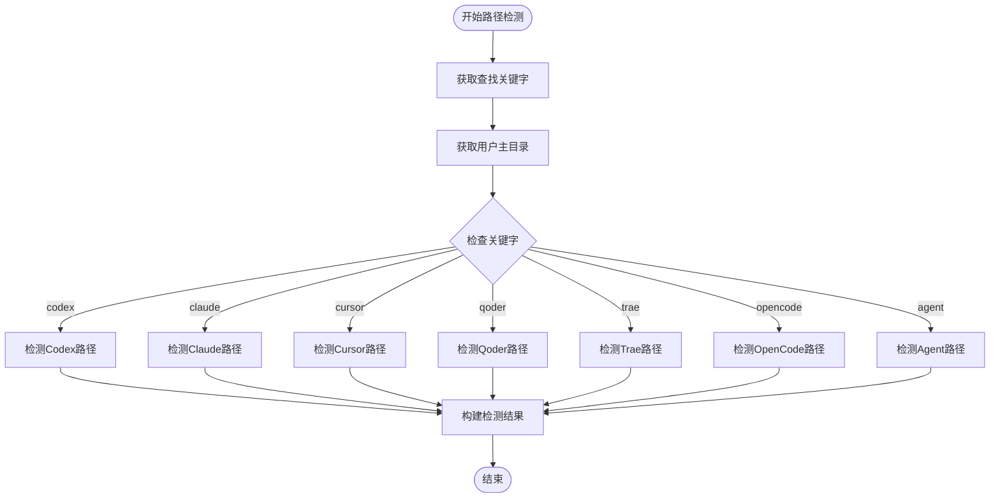
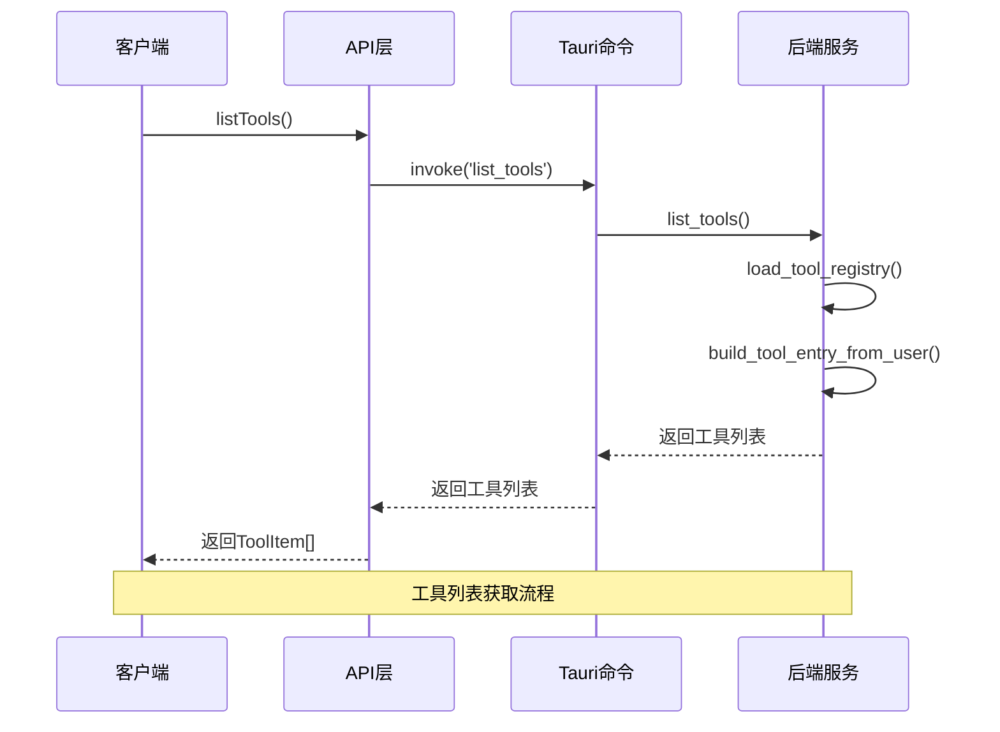

# 工具管理模块

<cite>
**本文档引用的文件**
- [useToolboxStore.ts](file://src/store/useToolboxStore.ts)
- [toolboxApi.ts](file://src/lib/toolboxApi.ts)
- [toolbox.ts](file://src/types/toolbox.ts)
- [lib.rs](file://src-tauri/src/lib.rs)
- [types.rs](file://src-tauri/src/types.rs)
- [toolbox.rs](file://src-tauri/src/toolbox.rs)
- [tool_store.rs](file://src-tauri/src/store/tool_store.rs)
- [main.rs](file://src-tauri/src/main.rs)
</cite>

## 目录
1. [简介](#简介)
2. [项目结构](#项目结构)
3. [核心组件](#核心组件)
4. [架构概览](#架构概览)
5. [详细组件分析](#详细组件分析)
6. [依赖关系分析](#依赖关系分析)
7. [性能考虑](#性能考虑)
8. [故障排除指南](#故障排除指南)
9. [结论](#结论)

## 简介

AI工具箱的工具管理模块是一个完整的工具注册、配置管理和状态控制系统。该模块提供了工具规格定义、配置文件检测和路径解析、工具状态管理、配置文件管理以及工具路径检测算法等功能。

模块采用前后端分离的设计模式：
- **前端层**：React + Zustand 状态管理，提供用户界面和交互逻辑
- **后端层**：Tauri + Rust 实现，负责底层文件系统操作和工具管理

## 项目结构

工具管理模块主要分布在以下目录中：



**图表来源**
- [useToolboxStore.ts:1-556](file://src/store/useToolboxStore.ts#L1-L556)
- [toolboxApi.ts:1-784](file://src/lib/toolboxApi.ts#L1-L784)
- [lib.rs:1-1409](file://src-tauri/src/lib.rs#L1-L1409)

**章节来源**
- [useToolboxStore.ts:1-556](file://src/store/useToolboxStore.ts#L1-L556)
- [toolboxApi.ts:1-784](file://src/lib/toolboxApi.ts#L1-L784)
- [lib.rs:1-1409](file://src-tauri/src/lib.rs#L1-L1409)

## 核心组件

### 工具规格定义

工具规格是整个系统的核心数据结构，定义了工具的基本信息、配置文件和技能目录。



**图表来源**
- [toolbox.ts:33-72](file://src/types/toolbox.ts#L33-L72)
- [toolbox.ts:7-20](file://src/types/toolbox.ts#L7-L20)

### 配置文件管理

配置文件管理系统支持多种格式的配置文件，包括 TOML、JSON、YAML、INI 等。



**图表来源**
- [toolboxApi.ts:153-182](file://src/lib/toolboxApi.ts#L153-L182)
- [toolboxApi.ts:217-243](file://src/lib/toolboxApi.ts#L217-L243)

**章节来源**
- [toolbox.ts:33-72](file://src/types/toolbox.ts#L33-L72)
- [toolboxApi.ts:153-182](file://src/lib/toolboxApi.ts#L153-L182)
- [toolboxApi.ts:217-243](file://src/lib/toolboxApi.ts#L217-L243)

## 架构概览

工具管理模块采用分层架构设计，确保了良好的可维护性和扩展性：



**图表来源**
- [useToolboxStore.ts:145-556](file://src/store/useToolboxStore.ts#L145-L556)
- [lib.rs:621-836](file://src-tauri/src/lib.rs#L621-L836)

## 详细组件分析

### 工具注册机制

工具注册机制是整个模块的核心功能，负责工具的发现、注册和管理。

#### 工具注册表结构

```mermaid
erDiagram
TOOL_REGISTRY {
string id PK
string name
boolean enabled
boolean is_system
string? skill_dir
timestamp created_at
timestamp updated_at
}
TOOL_CONFIG {
string id PK
string tool_id FK
string label
string path
string kind
timestamp created_at
}
TOOL_REGISTRY ||--o{ TOOL_CONFIG : "包含"
```

**图表来源**
- [types.rs:131-139](file://src-tauri/src/types.rs#L131-L139)
- [types.rs:123-127](file://src-tauri/src/types.rs#L123-L127)

#### 工具注册流程



**图表来源**
- [lib.rs:782-836](file://src-tauri/src/lib.rs#L782-L836)
- [tool_store.rs:88-127](file://src-tauri/src/store/tool_store.rs#L88-L127)

**章节来源**
- [lib.rs:782-836](file://src-tauri/src/lib.rs#L782-L836)
- [tool_store.rs:88-127](file://src-tauri/src/store/tool_store.rs#L88-L127)

### 工具状态管理

工具状态管理包括启用/禁用状态、工具可用性检查和错误处理机制。

#### 工具状态流转



#### 错误处理策略

工具状态管理实现了多层次的错误处理机制：

1. **输入验证**：确保工具ID和名称的有效性
2. **系统保护**：防止删除系统工具
3. **状态一致性**：确保至少保留一个启用工具
4. **回滚机制**：在操作失败时恢复到之前的状态

**章节来源**
- [lib.rs:817-836](file://src-tauri/src/lib.rs#L817-L836)
- [lib.rs:849-873](file://src-tauri/src/lib.rs#L849-L873)

### 工具配置文件管理

配置文件管理支持动态加载和管理各种格式的配置文件。

#### 配置文件扫描算法



**图表来源**
- [lib.rs:839-847](file://src-tauri/src/lib.rs#L839-L847)
- [tool_store.rs:274-379](file://src-tauri/src/store/tool_store.rs#L274-L379)

#### 配置文件格式识别

系统支持多种配置文件格式的自动识别和解析：

| 文件扩展名 | 格式类型 | 语言标识 |
|------------|----------|----------|
| .toml | TOML配置 | toml |
| .json | JSON配置 | json |
| .yaml, .yml | YAML配置 | yaml |
| .ini | INI配置 | ini |
| .md | Markdown文档 | markdown |
| .sh | Shell脚本 | shell |
| .js, .cjs, .mjs | JavaScript | javascript |
| .ts | TypeScript | typescript |

**章节来源**
- [toolboxApi.ts:153-182](file://src/lib/toolboxApi.ts#L153-L182)
- [lib.rs:325-431](file://src-tauri/src/lib.rs#L325-L431)

### 工具路径检测算法

工具路径检测算法实现了智能的工具路径发现和验证功能。

#### 路径检测流程



**图表来源**
- [lib.rs:325-431](file://src-tauri/src/lib.rs#L325-L431)
- [tool_store.rs:274-379](file://src-tauri/src/store/tool_store.rs#L274-L379)

#### 多平台兼容性

路径检测算法考虑了不同操作系统的路径差异：

| 平台 | 配置文件路径 |
|------|--------------|
| macOS | Library/Application Support/工具名/User/settings.json |
| Windows | AppData/Roaming/工具名/User/settings.json |
| Linux | .config/工具名/User/settings.json |

**章节来源**
- [lib.rs:325-431](file://src-tauri/src/lib.rs#L325-L431)
- [tool_store.rs:274-379](file://src-tauri/src/store/tool_store.rs#L274-L379)

### 工具管理API接口

工具管理模块提供了完整的API接口，支持工具的增删改查和状态管理。

#### 核心API方法

| 方法名 | 功能描述 | 参数 | 返回值 |
|--------|----------|------|--------|
| listTools | 获取工具列表 | 无 | ToolItem[] |
| detectToolPaths | 检测工具路径 | {id?: string, name?: string} | DetectToolPathsResult |
| upsertToolRegistryItem | 创建或更新工具 | UpsertToolRequest | ToolRegistryEntry |
| deleteToolRegistryItem | 删除工具 | DeleteToolRequest | string |
| readConfigFile | 读取配置文件 | {path: string} | string |
| saveConfigFile | 保存配置文件 | {path: string, content: string} | SaveConfigResult |
| syncSkills | 同步技能 | SyncSkillsRequest | SyncSkillOutcome[] |

#### API调用序列



**图表来源**
- [toolboxApi.ts:387-396](file://src/lib/toolboxApi.ts#L387-L396)
- [lib.rs:621-628](file://src-tauri/src/lib.rs#L621-L628)

**章节来源**
- [toolboxApi.ts:387-396](file://src/lib/toolboxApi.ts#L387-L396)
- [toolboxApi.ts:582-604](file://src/lib/toolboxApi.ts#L582-L604)
- [toolboxApi.ts:547-573](file://src/lib/toolboxApi.ts#L547-L573)

## 依赖关系分析

工具管理模块的依赖关系体现了清晰的分层架构：

```mermaid
graph TB
subgraph "前端依赖"
React[React框架]
Zustand[Zustand状态管理]
TauriAPI[@tauri-apps/api]
Types[类型定义]
end
subgraph "后端依赖"
Tauri[Tauri框架]
Serde[Serde序列化]
Rusqlite[Rusqlite数据库]
TauriPlugin[日志插件]
end
subgraph "系统依赖"
FileSystem[文件系统]
SQLite[SQLite数据库]
OSAPI[操作系统API]
end
React --> Zustand
Zustand --> TauriAPI
TauriAPI --> Tauri
Tauri --> Serde
Tauri --> Rusqlite
Tauri --> TauriPlugin
Serde --> FileSystem
Rusqlite --> SQLite
Tauri --> OSAPI
```

**图表来源**
- [main.rs:1-7](file://src-tauri/src/main.rs#L1-L7)
- [lib.rs:1-25](file://src-tauri/src/lib.rs#L1-L25)

**章节来源**
- [main.rs:1-7](file://src-tauri/src/main.rs#L1-L7)
- [lib.rs:1-25](file://src-tauri/src/lib.rs#L1-L25)

## 性能考虑

工具管理模块在设计时充分考虑了性能优化：

### 缓存策略
- **工具列表缓存**：避免频繁的文件系统扫描
- **配置文件缓存**：减少重复的文件读取操作
- **路径检测缓存**：缓存已检测到的工具路径

### 异步处理
- **并发操作**：支持多个工具的并发检测
- **异步文件操作**：避免阻塞UI线程
- **流式处理**：大文件的分块处理

### 内存优化
- **懒加载**：按需加载工具配置
- **增量更新**：只更新变化的部分
- **资源池**：复用数据库连接和文件句柄

## 故障排除指南

### 常见问题及解决方案

#### 工具无法检测到
1. **检查权限**：确保应用程序有访问用户目录的权限
2. **验证路径**：确认工具配置文件的实际路径
3. **重启应用**：重新启动应用以刷新缓存

#### 配置文件读取失败
1. **检查格式**：验证配置文件的格式正确性
2. **权限检查**：确认文件具有正确的读取权限
3. **编码问题**：检查文件编码是否为UTF-8

#### 同步操作失败
1. **磁盘空间**：确保有足够的磁盘空间
2. **目标路径**：验证目标路径的可写性
3. **冲突解决**：根据冲突策略处理文件冲突

**章节来源**
- [lib.rs:849-873](file://src-tauri/src/lib.rs#L849-L873)
- [lib.rs:933-1037](file://src-tauri/src/lib.rs#L933-L1037)

## 结论

AI工具箱的工具管理模块是一个设计精良、功能完整的系统。它通过清晰的分层架构、完善的错误处理机制和高效的性能优化，为用户提供了一个强大而易用的工具管理解决方案。

模块的主要优势包括：
- **模块化设计**：清晰的职责分离和接口定义
- **跨平台支持**：统一的API在不同操作系统上运行
- **扩展性强**：易于添加新的工具类型和配置格式
- **用户体验**：直观的界面和流畅的操作体验

未来可以考虑的功能增强：
- 更丰富的工具类型支持
- 更智能的配置文件检测算法
- 更完善的备份和恢复机制
- 更详细的日志和监控功能