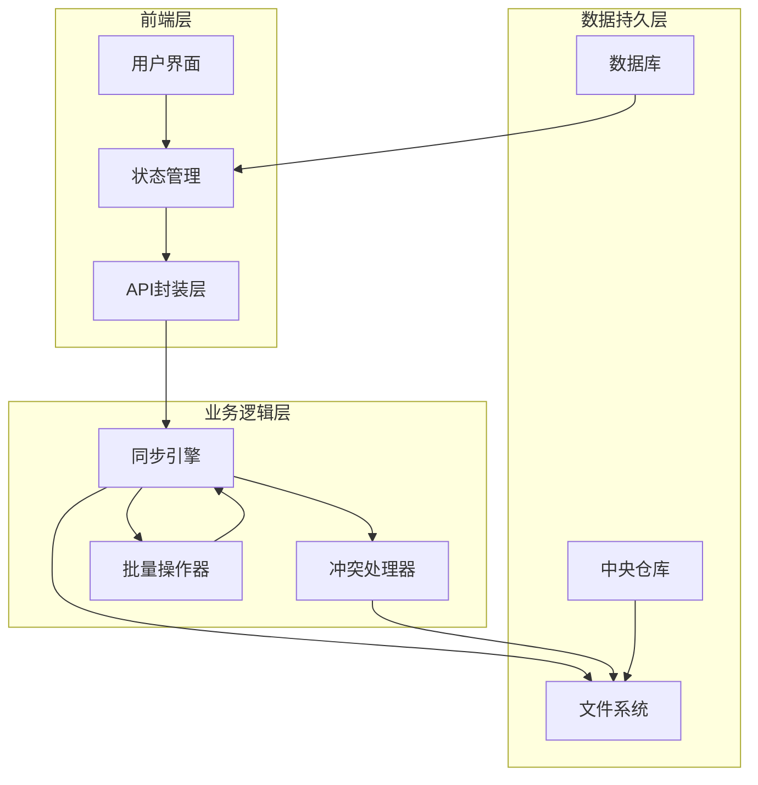
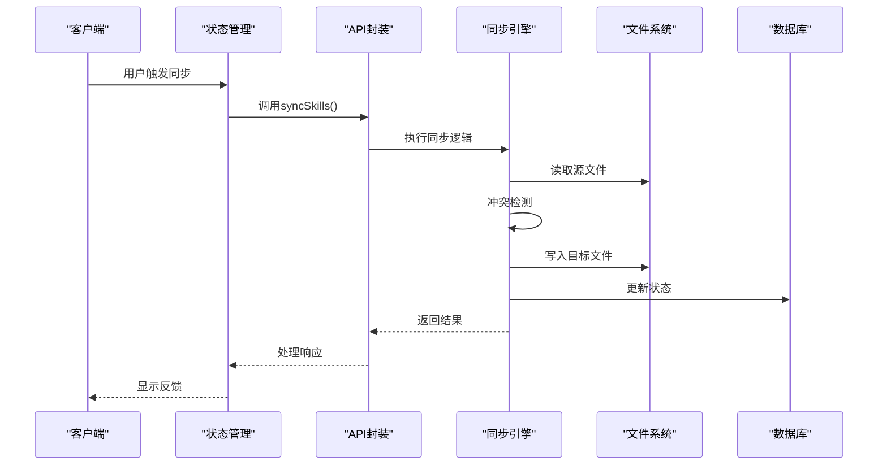
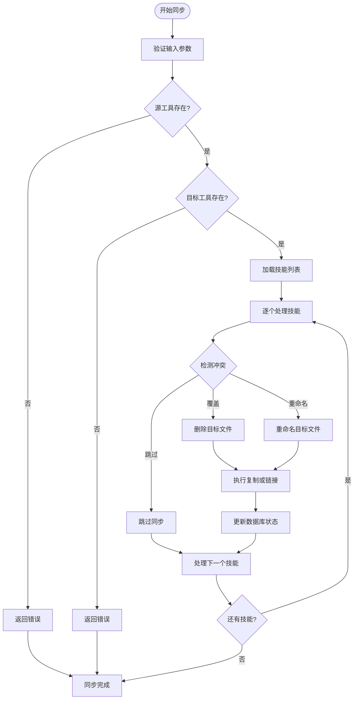
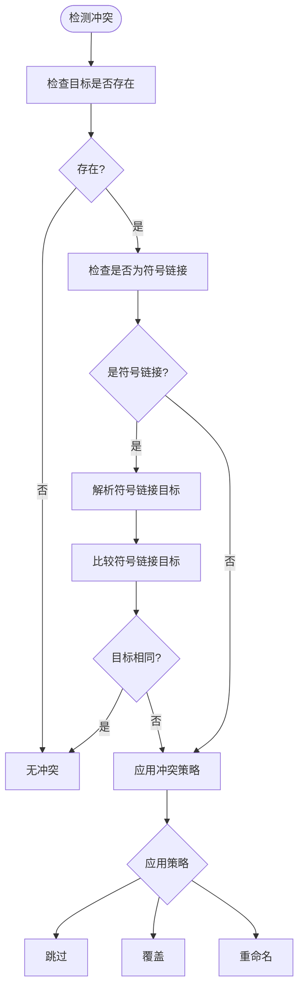
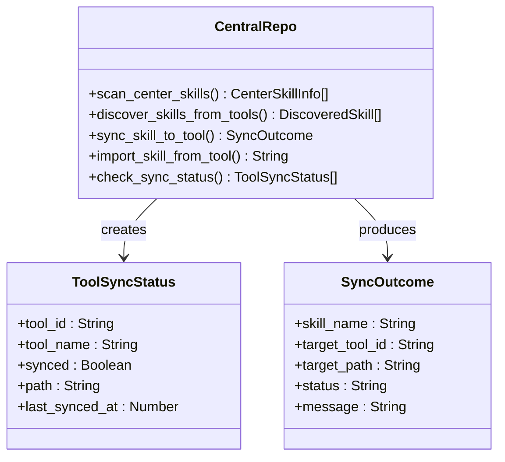
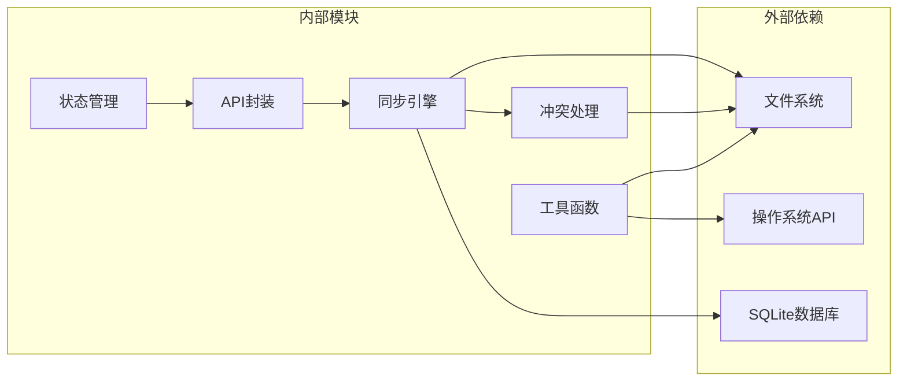
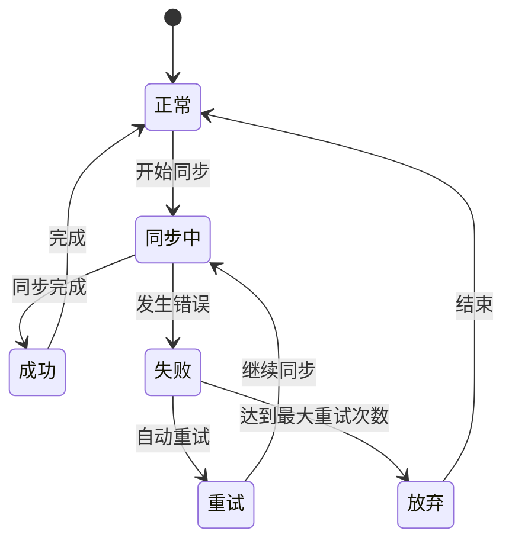

# 技能同步模块

<cite>
**本文档引用的文件**
- [toolboxApi.ts](file://src/lib/toolboxApi.ts)
- [useToolboxStore.ts](file://src/store/useToolboxStore.ts)
- [toolbox.ts](file://src/types/toolbox.ts)
- [lib.rs](file://src-tauri/src/lib.rs)
- [toolbox.rs](file://src-tauri/src/toolbox.rs)
- [central_repo.rs](file://src-tauri/src/central_repo.rs)
- [types.rs](file://src-tauri/src/types.rs)
</cite>

## 目录
1. [简介](#简介)
2. [项目结构](#项目结构)
3. [核心组件](#核心组件)
4. [架构概览](#架构概览)
5. [详细组件分析](#详细组件分析)
6. [依赖关系分析](#依赖关系分析)
7. [性能考虑](#性能考虑)
8. [故障排除指南](#故障排除指南)
9. [结论](#结论)

## 简介

AI工具箱的技能同步模块是一个完整的跨工具技能管理解决方案，支持在多个AI工具之间同步技能文件。该模块提供了灵活的同步策略、智能的冲突处理机制和强大的批量操作能力。

技能同步模块的核心功能包括：
- 支持复制模式和符号链接模式两种同步方式
- 提供覆盖、跳过、重命名三种冲突处理策略
- 支持单个技能和批量技能同步
- 实时同步状态跟踪和错误恢复机制
- 中央仓库与工具间的双向同步

## 项目结构

技能同步模块采用前后端分离的架构设计，主要分为三个层次：

**图表来源**
- [toolboxApi.ts:438-465](file://src/lib/toolboxApi.ts#L438-L465)
- [useToolboxStore.ts:341-384](file://src/store/useToolboxStore.ts#L341-L384)
- [lib.rs:932-1037](file://src-tauri/src/lib.rs#L932-L1037)

**章节来源**
- [toolboxApi.ts:1-784](file://src/lib/toolboxApi.ts#L1-L784)
- [useToolboxStore.ts:1-556](file://src/store/useToolboxStore.ts#L1-L556)
- [lib.rs:1310-1409](file://src-tauri/src/lib.rs#L1310-L1409)

## 核心组件

### 同步模式

技能同步模块支持两种核心同步模式：

**复制模式 (Copy Mode)**
- 创建技能文件的完整副本
- 独立于源文件的完全独立存储
- 占用更多磁盘空间但提供更好的隔离性
- 适用于需要完全独立技能副本的场景

**符号链接模式 (Symlink Mode)**
- 创建指向源文件的符号链接
- 节省内存空间但依赖源文件存在
- 实时反映源文件的更改
- 适用于需要节省空间且源文件稳定的场景

### 冲突处理策略

模块提供三种智能的冲突处理策略：

**跳过策略 (Skip)**
- 当目标位置已存在同名文件时直接跳过
- 保护现有数据不被意外覆盖
- 适用于谨慎的数据保护场景

**覆盖策略 (Overwrite)**
- 自动删除现有文件并替换为新内容
- 确保目标始终是最新的
- 需要谨慎使用以避免数据丢失

**重命名策略 (Rename)**
- 自动为新文件添加时间戳后缀
- 保留所有历史版本
- 适用于需要版本控制的场景

**章节来源**
- [toolbox.ts:1-4](file://src/types/toolbox.ts#L1-L4)
- [lib.rs:591-613](file://src-tauri/src/lib.rs#L591-L613)
- [toolbox.rs:351-367](file://src-tauri/src/toolbox.rs#L351-L367)

## 架构概览

技能同步模块采用分层架构设计，确保了良好的可维护性和扩展性：

**图表来源**
- [toolboxApi.ts:438-465](file://src/lib/toolboxApi.ts#L438-L465)
- [useToolboxStore.ts:341-384](file://src/store/useToolboxStore.ts#L341-L384)
- [lib.rs:932-1037](file://src-tauri/src/lib.rs#L932-L1037)

## 详细组件分析

### 同步引擎实现

同步引擎是整个模块的核心，负责协调所有同步操作：

**图表来源**
- [lib.rs:932-1037](file://src-tauri/src/lib.rs#L932-L1037)
- [toolbox.rs:297-400](file://src-tauri/src/toolbox.rs#L297-L400)

### 冲突检测算法

冲突检测算法采用多层次判断机制：

**图表来源**
- [lib.rs:591-613](file://src-tauri/src/lib.rs#L591-L613)
- [toolbox.rs:351-367](file://src-tauri/src/toolbox.rs#L351-L367)

### 批量操作支持

模块支持高效的批量技能同步操作：

**批量同步流程**
1. **技能选择**：用户可以选择多个技能进行同步
2. **目标选择**：可以同时同步到多个目标工具
3. **并发处理**：每个技能-目标组合独立处理
4. **进度跟踪**：实时显示同步进度和状态
5. **错误隔离**：单个技能失败不影响其他技能

**章节来源**
- [lib.rs:1188-1217](file://src-tauri/src/lib.rs#L1188-L1217)
- [useToolboxStore.ts:523-554](file://src/store/useToolboxStore.ts#L523-L554)

### 中央仓库集成

中央仓库提供了统一的技能管理中心：

**图表来源**
- [central_repo.rs:17-78](file://src-tauri/src/central_repo.rs#L17-L78)
- [central_repo.rs:39-47](file://src-tauri/src/central_repo.rs#L39-L47)

**章节来源**
- [central_repo.rs:104-149](file://src-tauri/src/central_repo.rs#L104-L149)
- [central_repo.rs:389-444](file://src-tauri/src/central_repo.rs#L389-L444)

## 依赖关系分析

技能同步模块的依赖关系清晰明确：

**图表来源**
- [lib.rs:1372-1405](file://src-tauri/src/lib.rs#L1372-L1405)
- [toolboxApi.ts:3-19](file://src/lib/toolboxApi.ts#L3-L19)

**章节来源**
- [lib.rs:1-8](file://src-tauri/src/lib.rs#L1-L8)
- [toolboxApi.ts:1-21](file://src/lib/toolboxApi.ts#L1-L21)

## 性能考虑

### 同步策略优化

**复制模式 vs 符号链接模式**
- **复制模式**：CPU开销较高，I/O频繁，但提供最佳的隔离性
- **符号链接模式**：CPU开销低，I/O少，但需要考虑源文件变更影响

**内存使用优化**
- 使用流式文件处理减少内存占用
- 智能缓存策略避免重复读取
- 及时释放不再使用的资源

**并发处理**
- 异步文件操作避免阻塞UI线程
- 合理的并发数量控制
- 错误恢复机制确保稳定性

### 存储空间管理

**符号链接模式的优势**
- 显著减少磁盘空间占用
- 支持多工具共享同一技能副本
- 自动反映源文件更新

**冲突处理的性能影响**
- 跳过策略最快但最保守
- 覆盖策略需要额外的文件删除操作
- 重命名策略需要文件重命名和移动

## 故障排除指南

### 常见问题及解决方案

**同步失败**
- 检查源文件是否存在
- 验证目标目录权限
- 确认磁盘空间充足

**符号链接创建失败**
- 确认运行平台支持符号链接
- 检查管理员权限
- 验证目标路径有效性

**冲突处理异常**
- 检查冲突策略配置
- 验证目标文件状态
- 查看日志获取详细错误信息

**性能问题**
- 考虑使用复制模式而非符号链接
- 减少同时同步的技能数量
- 优化文件系统性能

### 错误恢复机制

模块提供了完善的错误恢复机制：

**章节来源**
- [lib.rs:1009-1032](file://src-tauri/src/lib.rs#L1009-L1032)
- [toolboxApi.ts:377-383](file://src/lib/toolboxApi.ts#L377-L383)

## 结论

AI工具箱的技能同步模块是一个功能完整、设计合理的跨工具技能管理解决方案。通过精心设计的同步策略、智能的冲突处理机制和强大的批量操作能力，该模块能够满足各种复杂的技能同步需求。

模块的主要优势包括：
- **灵活性**：支持多种同步模式和冲突处理策略
- **可靠性**：完善的错误处理和恢复机制
- **性能**：优化的文件操作和内存使用
- **可扩展性**：清晰的架构设计便于功能扩展

未来可以考虑的功能增强包括：
- 更精细的同步进度跟踪
- 支持增量同步
- 增强的冲突可视化
- 更丰富的同步报告