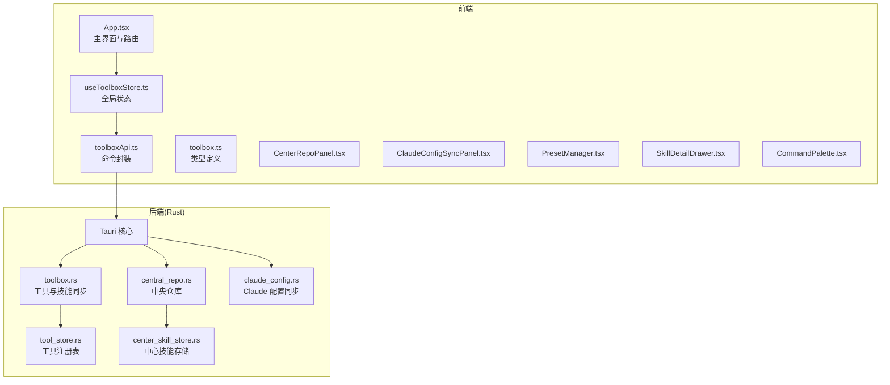
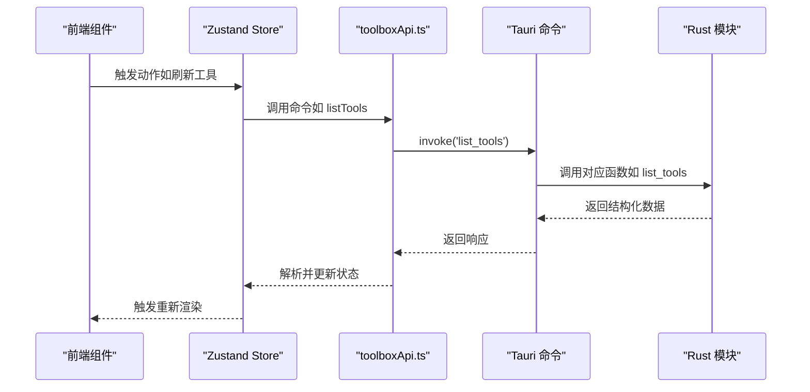
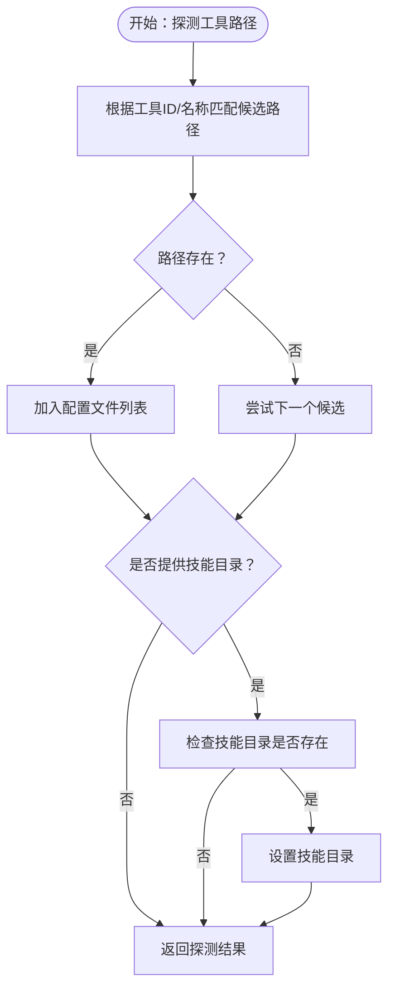
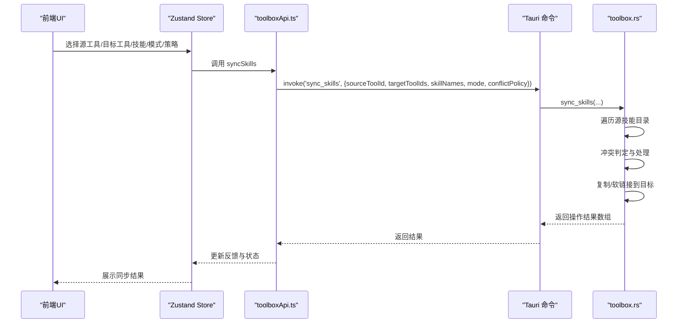
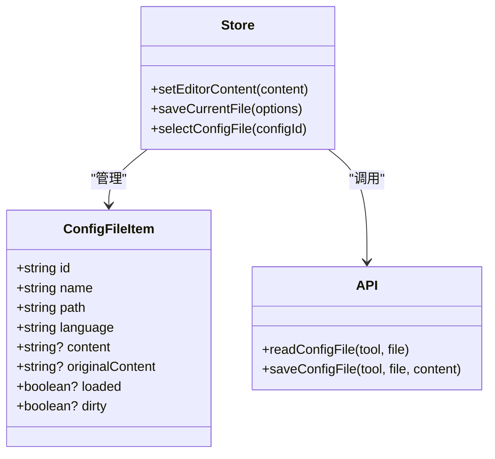
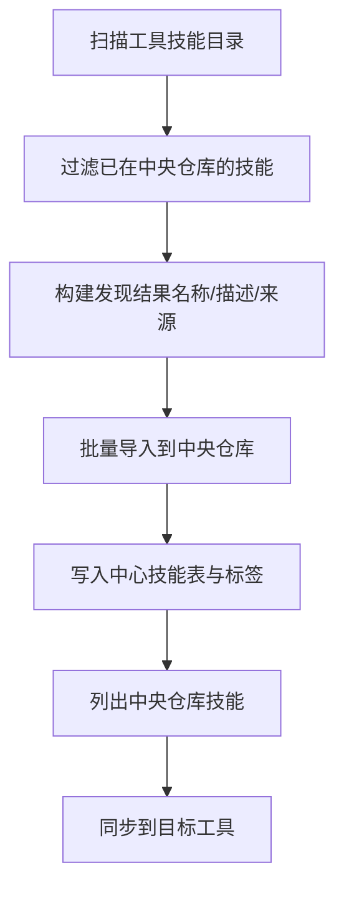
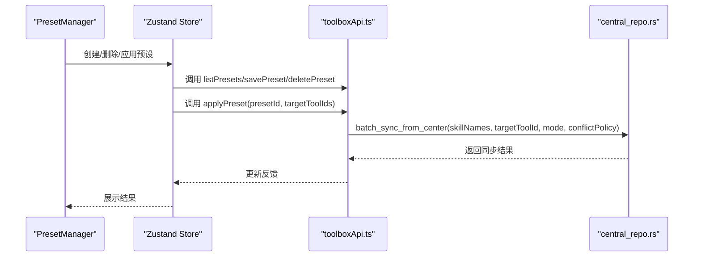
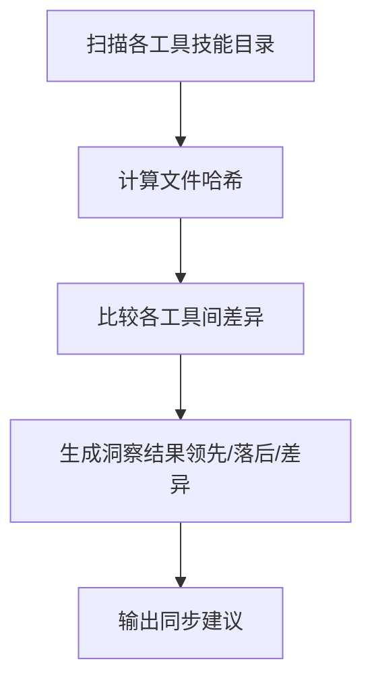
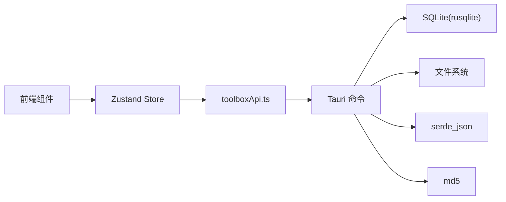

# 核心功能模块

<cite>
**本文档引用的文件**
- [App.tsx](file://src/App.tsx)
- [main.tsx](file://src/main.tsx)
- [useToolboxStore.ts](file://src/store/useToolboxStore.ts)
- [toolboxApi.ts](file://src/lib/toolboxApi.ts)
- [toolbox.ts](file://src/types/toolbox.ts)
- [CenterRepoPanel.tsx](file://src/components/CenterRepoPanel.tsx)
- [ClaudeConfigSyncPanel.tsx](file://src/components/ClaudeConfigSyncPanel.tsx)
- [PresetManager.tsx](file://src/components/PresetManager.tsx)
- [SkillDetailDrawer.tsx](file://src/components/SkillDetailDrawer.tsx)
- [CommandPalette.tsx](file://src/components/CommandPalette.tsx)
- [toolbox.rs](file://src-tauri/src/toolbox.rs)
- [central_repo.rs](file://src-tauri/src/central_repo.rs)
- [claude_config.rs](file://src-tauri/src/claude_config.rs)
- [tool_store.rs](file://src-tauri/src/store/tool_store.rs)
- [center_skill_store.rs](file://src-tauri/src/store/center_skill_store.rs)
</cite>

## 目录
1. [简介](#简介)
2. [项目结构](#项目结构)
3. [核心组件](#核心组件)
4. [架构总览](#架构总览)
5. [详细组件分析](#详细组件分析)
6. [依赖关系分析](#依赖关系分析)
7. [性能考虑](#性能考虑)
8. [故障排查指南](#故障排查指南)
9. [结论](#结论)

## 简介
本文件为 AI 工具箱核心功能模块的全面技术文档，涵盖以下模块：
- 工具管理模块：工具注册、路径检测、状态管理
- 技能同步模块：同步算法、冲突处理、批量操作
- 配置编辑模块：Monaco Editor 集成、多格式支持、实时预览
- 中央仓库模块：技能发现与管理
- 预设管理模块：创建、应用与持久化
- 变动洞察模块：差异分析与同步建议

文档提供代码级架构图、流程图、使用示例与扩展指南，帮助开发者快速理解与二次开发。

## 项目结构
前端采用 React + TypeScript + Zustand 状态管理，后端基于 Tauri + Rust 实现跨平台能力。核心交互通过 `toolboxApi.ts` 将前端 UI 与 Rust 命令桥接。

**图表来源**
- [App.tsx:138-610](file://src/App.tsx#L138-L610)
- [useToolboxStore.ts:145-556](file://src/store/useToolboxStore.ts#L145-L556)
- [toolboxApi.ts:387-784](file://src/lib/toolboxApi.ts#L387-L784)
- [toolbox.rs:219-400](file://src-tauri/src/toolbox.rs#L219-L400)
- [central_repo.rs:104-149](file://src-tauri/src/central_repo.rs#L104-L149)
- [claude_config.rs:430-495](file://src-tauri/src/claude_config.rs#L430-L495)
- [tool_store.rs:11-86](file://src-tauri/src/store/tool_store.rs#L11-L86)
- [center_skill_store.rs:25-79](file://src-tauri/src/store/center_skill_store.rs#L25-L79)

**章节来源**
- [main.tsx:1-12](file://src/main.tsx#L1-L12)
- [App.tsx:138-610](file://src/App.tsx#L138-L610)

## 核心组件
- 工具管理：负责工具注册表的增删改查、路径探测、技能目录扫描与配置文件读写。
- 技能同步：支持复制与软链接两种模式，提供跳过、覆盖、重命名三种冲突策略。
- 配置编辑：基于 Monaco Editor 提供多语言高亮、实时保存与备份。
- 中央仓库：统一技能来源，支持从 Git 安装、批量导入、扫描发现与同步。
- 预设管理：保存常用技能组合，一键应用到多个目标工具。
- 变动洞察：计算技能在各工具间的差异，生成同步建议。

**章节来源**
- [toolboxApi.ts:387-784](file://src/lib/toolboxApi.ts#L387-L784)
- [useToolboxStore.ts:145-556](file://src/store/useToolboxStore.ts#L145-L556)
- [toolbox.ts:1-152](file://src/types/toolbox.ts#L1-L152)

## 架构总览
前端通过 `toolboxApi.ts` 调用后端命令，后端根据命令执行具体逻辑并返回结果。状态管理集中于 Zustand store，UI 组件通过 store 方法触发异步操作。

**图表来源**
- [useToolboxStore.ts:183-205](file://src/store/useToolboxStore.ts#L183-L205)
- [toolboxApi.ts:387-396](file://src/lib/toolboxApi.ts#L387-L396)
- [toolbox.rs:219-224](file://src-tauri/src/toolbox.rs#L219-L224)

**章节来源**
- [useToolboxStore.ts:145-556](file://src/store/useToolboxStore.ts#L145-L556)
- [toolboxApi.ts:387-784](file://src/lib/toolboxApi.ts#L387-L784)

## 详细组件分析

### 工具管理模块
职责：
- 工具注册与路径探测：支持按工具 ID 或名称探测配置文件与技能目录。
- 工具状态管理：加载工具列表、切换选中工具、读取/保存配置文件。
- 技能目录扫描：递归扫描技能目录，识别 SKILL.md 并提取信息。

实现要点：
- 注册表 CRUD：通过 SQLite 存储工具元数据与配置文件映射。
- 路径探测：根据工具关键字匹配常见路径，返回存在的文件与技能目录。
- 技能扫描：遍历技能目录，识别符号链接与真实目录，收集技能元信息。

**图表来源**
- [tool_store.rs:274-379](file://src-tauri/src/store/tool_store.rs#L274-L379)

使用示例：
- 在工具管理面板点击“探测路径”，自动填充配置文件与技能目录。
- 新增/编辑工具时，保存注册表并刷新工具列表。

扩展指南：
- 新增工具类型：在路径探测逻辑中添加新的关键字与路径映射。
- 支持更多配置文件格式：在类型定义与解析器中扩展语言识别。

**章节来源**
- [tool_store.rs:11-201](file://src-tauri/src/store/tool_store.rs#L11-L201)
- [toolboxApi.ts:521-604](file://src/lib/toolboxApi.ts#L521-L604)
- [App.tsx:413-430](file://src/App.tsx#L413-L430)

### 技能同步模块
职责：
- 单工具内技能复制或软链接到目标工具。
- 冲突处理：跳过、覆盖、重命名三种策略。
- 批量同步：支持多技能一次性同步到多个目标工具。

实现要点：
- 同步模式：复制完整目录树或创建符号链接。
- 冲突策略：目标存在时按策略决定是否覆盖或重命名。
- 结果追踪：记录每项操作的状态与目标路径。

**图表来源**
- [useToolboxStore.ts:341-384](file://src/store/useToolboxStore.ts#L341-L384)
- [toolboxApi.ts:438-465](file://src/lib/toolboxApi.ts#L438-L465)
- [toolbox.rs:297-400](file://src-tauri/src/toolbox.rs#L297-L400)

使用示例：
- 在“技能”页勾选多个技能，选择目标工具，设置同步模式与冲突策略，提交后查看反馈。
- 使用“批量同步”功能，从中央仓库一次性同步多个技能到目标工具。

扩展指南：
- 新增同步模式：在 Rust 中扩展枚举与分支处理。
- 冲突策略优化：引入更细粒度的冲突检测与合并策略。

**章节来源**
- [toolboxApi.ts:438-465](file://src/lib/toolboxApi.ts#L438-L465)
- [toolbox.rs:297-400](file://src-tauri/src/toolbox.rs#L297-L400)
- [App.tsx:474-512](file://src/App.tsx#L474-L512)

### 配置编辑模块
职责：
- 基于 Monaco Editor 提供多语言高亮与语法校验。
- 实时保存配置文件，自动备份并提示备份路径。
- 支持预览模式下的本地草稿保存。

实现要点：
- 语言识别：根据文件扩展名自动选择语言模式。
- 实时保存：开启自动保存后定时保存，避免频繁 IO。
- 备份策略：保存前创建带时间戳的备份文件。

**图表来源**
- [toolbox.ts:22-31](file://src/types/toolbox.ts#L22-L31)
- [useToolboxStore.ts:247-339](file://src/store/useToolboxStore.ts#L247-L339)
- [toolboxApi.ts:407-436](file://src/lib/toolboxApi.ts#L407-L436)

使用示例：
- 在工具配置页选择配置文件，编辑器自动加载内容并高亮显示。
- 修改完成后自动保存或手动保存，查看备份提示。

扩展指南：
- 支持更多语言：在语言识别逻辑中扩展扩展名映射。
- 预览增强：集成 Markdown 预览或 JSON Schema 校验。

**章节来源**
- [useToolboxStore.ts:247-339](file://src/store/useToolboxStore.ts#L247-L339)
- [toolboxApi.ts:407-436](file://src/lib/toolboxApi.ts#L407-L436)

### 中央仓库模块
职责：
- 技能发现：扫描各工具技能目录，发现尚未入库的技能。
- 技能安装：支持从 Git 仓库克隆或从本地目录导入。
- 技能同步：将中央仓库中的技能同步到任意工具。
- 分类与标签：为技能设置来源类型与标签。

实现要点：
- 中央仓库目录：统一存放技能，便于跨工具共享。
- 扫描与去重：以技能名为键聚合来源信息，保留描述。
- 同步策略：与工具间同步一致，支持复制与软链接、冲突策略。

**图表来源**
- [central_repo.rs:155-220](file://src-tauri/src/central_repo.rs#L155-L220)
- [central_repo.rs:226-301](file://src-tauri/src/central_repo.rs#L226-L301)
- [center_skill_store.rs:25-79](file://src-tauri/src/store/center_skill_store.rs#L25-L79)

使用示例：
- 在“中央仓库”面板点击“扫描发现”，选择技能后一键导入。
- 从 Git 安装技能，或直接从工具导入已有技能。
- 选择技能批量同步到目标工具，设置模式与策略。

扩展指南：
- 支持 ZIP/压缩包安装：扩展安装逻辑以支持多种来源。
- 智能分类：基于技能内容自动标注标签。

**章节来源**
- [CenterRepoPanel.tsx:99-120](file://src/components/CenterRepoPanel.tsx#L99-L120)
- [central_repo.rs:307-348](file://src-tauri/src/central_repo.rs#L307-L348)
- [center_skill_store.rs:129-196](file://src-tauri/src/store/center_skill_store.rs#L129-L196)

### 预设管理模块
职责：
- 创建预设：保存一组技能名称。
- 应用预设：将预设中的技能批量同步到目标工具。
- 持久化：通过数据库存储预设与技能列表。

实现要点：
- 预设结构：包含 ID、名称、图标与技能列表。
- 应用流程：逐个目标工具执行批量同步，汇总结果反馈。

**图表来源**
- [PresetManager.tsx:171-329](file://src/components/PresetManager.tsx#L171-L329)
- [useToolboxStore.ts:523-554](file://src/store/useToolboxStore.ts#L523-L554)
- [toolboxApi.ts:676-688](file://src/lib/toolboxApi.ts#L676-L688)
- [central_repo.rs:389-444](file://src-tauri/src/central_repo.rs#L389-L444)

使用示例：
- 创建“前端开发套装”预设，包含多个常用技能。
- 一键应用到多个工具，查看每个工具的同步数量。

扩展指南：
- 预设模板：内置常用组合，支持快速选择。
- 版本控制：记录预设版本与变更历史。

**章节来源**
- [PresetManager.tsx:171-329](file://src/components/PresetManager.tsx#L171-L329)
- [useToolboxStore.ts:523-554](file://src/store/useToolboxStore.ts#L523-L554)

### 变动洞察模块
职责：
- 计算技能在各工具中的差异，识别领先者与落后者。
- 生成同步建议：针对落后工具给出应同步的文件差异。

实现要点：
- 差异来源：基于技能目录结构与文件哈希比较。
- 结果结构：包含技能名、领先工具、落后工具及其差异列表。

**图表来源**
- [toolboxApi.ts:398-405](file://src/lib/toolboxApi.ts#L398-L405)
- [toolbox.rs:428-516](file://src-tauri/src/toolbox.rs#L428-L516)

使用示例：
- 刷新“变动洞察”，查看哪些工具落后以及具体差异文件。
- 基于建议一键同步到落后工具。

**章节来源**
- [useToolboxStore.ts:207-217](file://src/store/useToolboxStore.ts#L207-L217)
- [toolboxApi.ts:398-405](file://src/lib/toolboxApi.ts#L398-L405)

## 依赖关系分析
- 前端依赖：
  - Zustand：集中状态管理，封装 API 调用与反馈。
  - Ant Design：UI 组件库，提供对话框、表格、标签等。
  - Monaco Editor：代码编辑器，支持多语言高亮与差异展示。
- 后端依赖：
  - rusqlite：SQLite 访问，用于工具注册表与中心技能存储。
  - serde/serde_json：序列化与反序列化，处理配置与结果结构。
  - walkdir/md5：文件遍历与哈希计算，用于差异分析与备份。

**图表来源**
- [useToolboxStore.ts:1-31](file://src/store/useToolboxStore.ts#L1-L31)
- [toolboxApi.ts:1-21](file://src/lib/toolboxApi.ts#L1-L21)
- [central_repo.rs:660-725](file://src-tauri/src/central_repo.rs#L660-L725)

**章节来源**
- [useToolboxStore.ts:1-31](file://src/store/useToolboxStore.ts#L1-L31)
- [toolboxApi.ts:1-21](file://src/lib/toolboxApi.ts#L1-L21)

## 性能考虑
- 文件遍历与哈希：
  - 使用迭代式遍历替代递归，减少栈溢出风险。
  - 哈希计算按需进行，避免重复计算。
- 数据库访问：
  - 使用事务批量写入，减少磁盘 IO。
  - 查询时使用索引字段（如 name），提升检索效率。
- 前端渲染：
  - 列表虚拟化与懒加载，降低大列表渲染压力。
  - 状态更新最小化，避免不必要的重渲染。

## 故障排查指南
- 工具路径探测失败：
  - 检查工具关键字是否正确，确认候选路径是否存在。
  - 查看注册表中工具配置是否正确。
- 技能同步失败：
  - 检查目标路径权限与磁盘空间。
  - 切换冲突策略（覆盖/重命名）解决冲突。
- 中央仓库安装失败：
  - 确认 Git 可用且网络正常。
  - 检查技能名称合法性与目标目录权限。
- 配置保存失败：
  - 查看备份目录权限与磁盘空间。
  - 检查文件是否被其他进程占用。

**章节来源**
- [tool_store.rs:274-379](file://src-tauri/src/store/tool_store.rs#L274-L379)
- [central_repo.rs:307-348](file://src-tauri/src/central_repo.rs#L307-L348)
- [toolbox.rs:596-630](file://src-tauri/src/toolbox.rs#L596-L630)

## 结论
AI 工具箱通过清晰的前后端分层与模块化设计，实现了工具管理、技能同步、配置编辑、中央仓库、预设管理与变动洞察的完整闭环。前端以 React + Zustand 提供流畅体验，后端以 Rust + SQLite 提供高性能与可靠性。未来可在冲突策略、智能分类、版本控制等方面进一步增强，满足更复杂的跨工具协作场景。