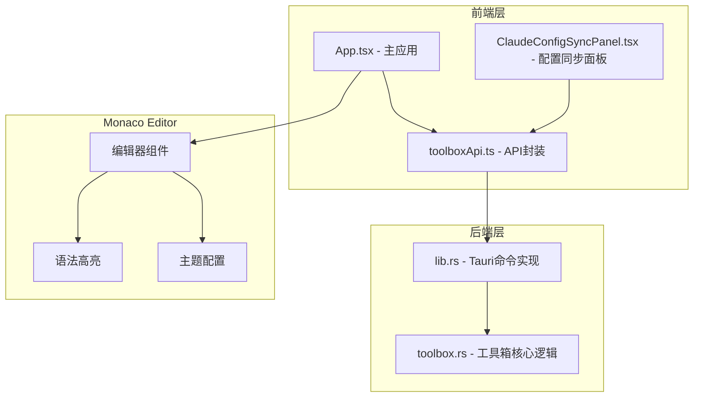
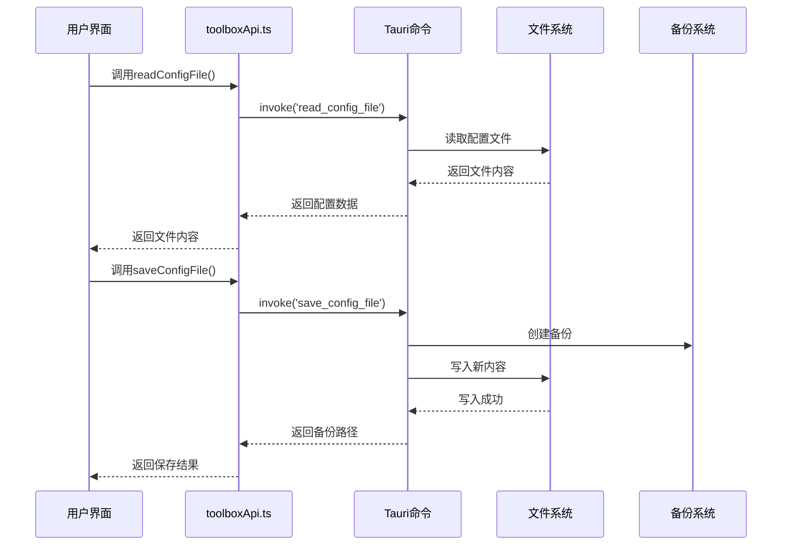
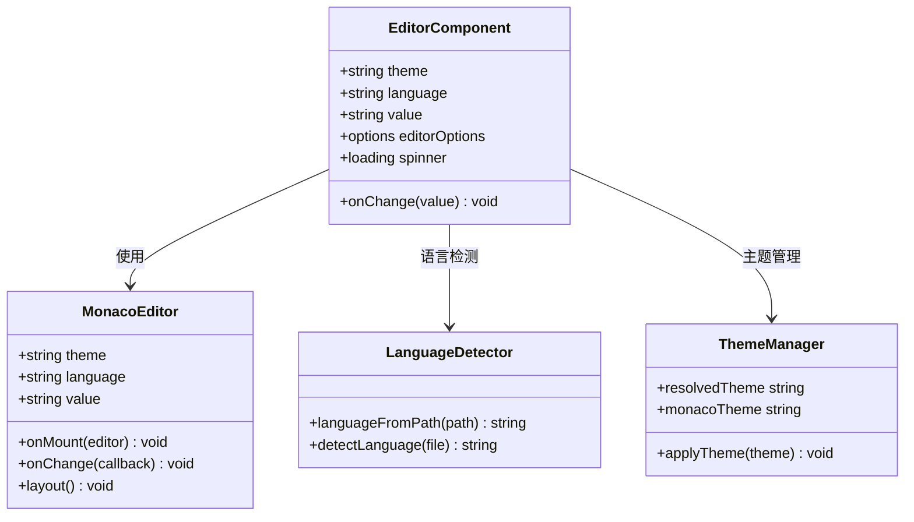
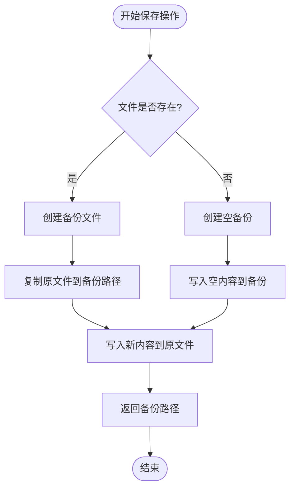
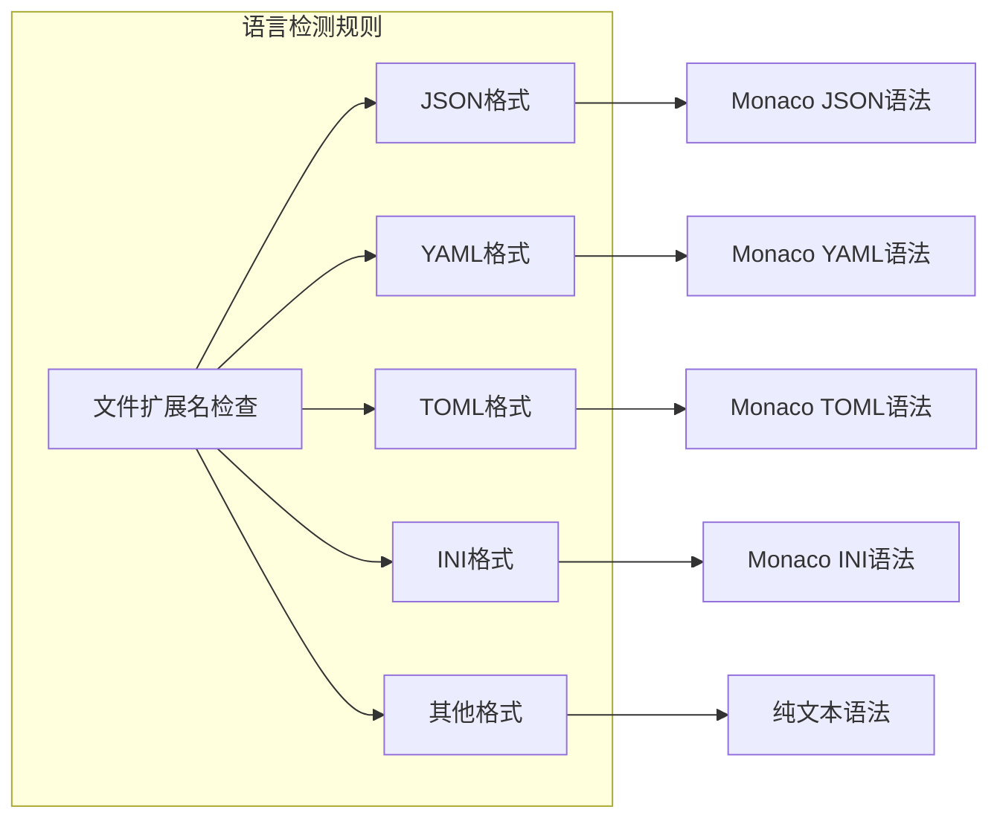

# 配置编辑模块

<cite>
**本文档引用的文件**
- [README.md](file://README.md)
- [App.tsx](file://src/App.tsx)
- [toolboxApi.ts](file://src/lib/toolboxApi.ts)
- [ClaudeConfigSyncPanel.tsx](file://src/components/ClaudeConfigSyncPanel.tsx)
- [lib.rs](file://src-tauri/src/lib.rs)
- [toolbox.rs](file://src-tauri/src/toolbox.rs)
</cite>

## 目录
1. [简介](#简介)
2. [项目结构](#项目结构)
3. [核心组件](#核心组件)
4. [架构概览](#架构概览)
5. [详细组件分析](#详细组件分析)
6. [依赖关系分析](#依赖关系分析)
7. [性能考虑](#性能考虑)
8. [故障排除指南](#故障排除指南)
9. [结论](#结论)

## 简介

配置编辑模块是AI工具箱的核心功能之一，基于Monaco Editor提供强大的配置文件编辑体验。该模块支持多种配置格式（JSON、YAML、TOML、INI等），具备实时预览、语法验证、自动备份和版本管理等功能。

根据项目README描述，配置编辑模块具有以下关键特性：
- 内置Monaco Editor代码编辑器
- 支持JSON/YAML/TOML等配置格式
- 自动保存与手动保存
- 配置文件备份与恢复

## 项目结构

配置编辑模块主要分布在前端和后端两个层面：



**图表来源**
- [App.tsx:1085-1125](file://src/App.tsx#L1085-L1125)
- [toolboxApi.ts:407-436](file://src/lib/toolboxApi.ts#L407-L436)
- [lib.rs:860-905](file://src-tauri/src/lib.rs#L860-L905)

**章节来源**
- [README.md:33-37](file://README.md#L33-L37)
- [App.tsx:1085-1125](file://src/App.tsx#L1085-L1125)

## 核心组件

### Monaco Editor集成

配置编辑模块采用Monaco Editor作为核心编辑器组件，提供了丰富的编辑体验：

**编辑器初始化配置：**
- 主题适配：根据系统主题自动切换vs或vs-dark
- 语言支持：基于文件扩展名自动识别语言类型
- 选项配置：包含自动布局、字体大小、缩放、滚动等参数

**语言支持映射：**
- JSON: `.json` 文件
- YAML: `.yaml` 或 `.yml` 文件  
- TOML: `.toml` 文件
- INI: `.ini` 文件
- Markdown: `.md` 文件
- Shell脚本: `.sh` 文件
- JavaScript: `.js`、`.cjs`、`.mjs` 文件
- TypeScript: `.ts` 文件

**章节来源**
- [App.tsx:1089-1107](file://src/App.tsx#L1089-L1107)
- [toolboxApi.ts:153-182](file://src/lib/toolboxApi.ts#L153-L182)

### 配置文件API接口

模块提供了完整的配置文件操作API：

**主要API方法：**
- `readConfigFile`: 读取配置文件内容
- `saveConfigFile`: 保存配置文件并创建备份
- `listConfigBackups`: 列出配置文件备份

**章节来源**
- [toolboxApi.ts:407-436](file://src/lib/toolboxApi.ts#L407-L436)
- [toolboxApi.ts:489-496](file://src/lib/toolboxApi.ts#L489-L496)

## 架构概览

配置编辑模块采用前后端分离的架构设计：



**图表来源**
- [toolboxApi.ts:407-436](file://src/lib/toolboxApi.ts#L407-L436)
- [lib.rs:860-873](file://src-tauri/src/lib.rs#L860-L873)

## 详细组件分析

### 编辑器组件分析

配置编辑器组件实现了完整的编辑功能：



**图表来源**
- [App.tsx:1089-1107](file://src/App.tsx#L1089-L1107)
- [toolboxApi.ts:153-182](file://src/lib/toolboxApi.ts#L153-L182)

**章节来源**
- [App.tsx:231-233](file://src/App.tsx#L231-L233)
- [App.tsx:1089-1107](file://src/App.tsx#L1089-L1107)

### 备份机制分析

配置文件备份系统提供了完整的版本管理功能：



**图表来源**
- [lib.rs:860-873](file://src-tauri/src/lib.rs#L860-L873)
- [toolbox.rs:268-280](file://src-tauri/src/toolbox.rs#L268-L280)

**章节来源**
- [lib.rs:860-905](file://src-tauri/src/lib.rs#L860-L905)
- [toolbox.rs:569-578](file://src-tauri/src/toolbox.rs#L569-L578)

### 语言支持分析

系统支持多种配置格式的语言高亮：



**图表来源**
- [toolboxApi.ts:153-182](file://src/lib/toolboxApi.ts#L153-L182)

**章节来源**
- [toolboxApi.ts:153-182](file://src/lib/toolboxApi.ts#L153-L182)

## 依赖关系分析

配置编辑模块的依赖关系如下：

```mermaid
graph TB
subgraph "外部依赖"
A[@monaco-editor/react]
B[Ant Design]
C[Tauri]
end
subgraph "内部模块"
D[App.tsx]
E[toolboxApi.ts]
F[lib.rs]
G[toolbox.rs]
end
subgraph "Monaco Editor"
H[语法高亮]
I[主题系统]
J[编辑功能]
end
A --> D
B --> D
C --> F
D --> E
E --> F
F --> G
D --> H
H --> I
I --> J
```

**图表来源**
- [App.tsx:1-50](file://src/App.tsx#L1-L50)
- [toolboxApi.ts:1-21](file://src/lib/toolboxApi.ts#L1-L21)

**章节来源**
- [App.tsx:1-76](file://src/App.tsx#L1-L76)
- [toolboxApi.ts:1-21](file://src/lib/toolboxApi.ts#L1-L21)

## 性能考虑

配置编辑模块在性能方面采用了多项优化措施：

1. **延迟加载**: Monaco Editor支持loading状态，避免阻塞界面渲染
2. **自动保存节流**: 1.2秒防抖延迟，减少不必要的保存操作
3. **主题缓存**: 主题状态持久化到localStorage
4. **文件监听**: 后端提供文件变更检测机制
5. **内存管理**: 及时清理定时器和事件监听器

## 故障排除指南

### 常见问题及解决方案

**编辑器无法加载**
- 检查Monaco Editor依赖是否正确安装
- 确认网络连接正常，能够加载编辑器资源
- 验证主题配置是否正确

**文件保存失败**
- 检查目标文件权限
- 确认磁盘空间充足
- 验证文件路径有效性

**备份创建失败**
- 检查备份目录权限
- 确认备份文件命名冲突
- 验证时间戳生成逻辑

**章节来源**
- [lib.rs:860-873](file://src-tauri/src/lib.rs#L860-L873)
- [toolbox.rs:268-280](file://src-tauri/src/toolbox.rs#L268-L280)

## 结论

配置编辑模块通过Monaco Editor提供了专业级的配置文件编辑体验。模块具备完善的语言支持、主题适配、备份管理和API接口，为用户提供了可靠的配置文件管理解决方案。

主要优势包括：
- 基于Monaco Editor的专业编辑体验
- 多格式语言支持和语法高亮
- 自动备份和版本管理
- 完整的API接口封装
- 响应式主题适配

未来可以考虑的功能增强：
- 实时语法验证和错误提示
- 配置文件模板系统
- 批量配置管理
- 集成更多配置格式支持