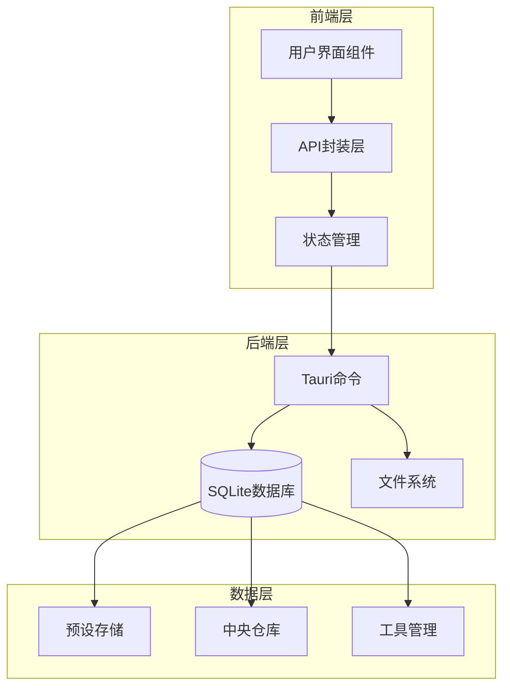
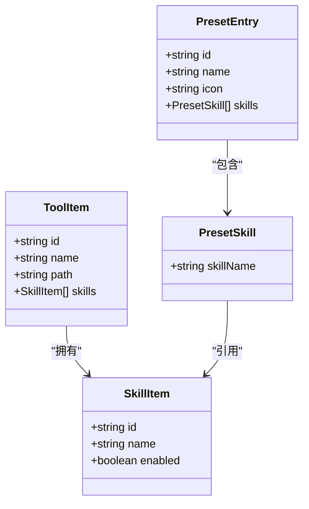
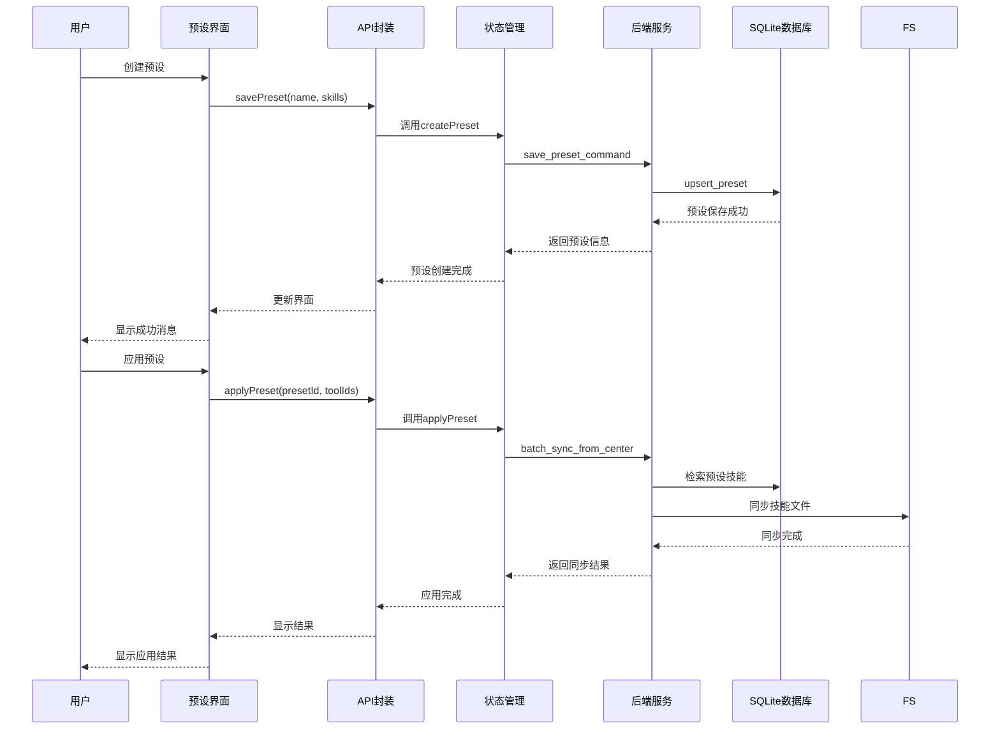
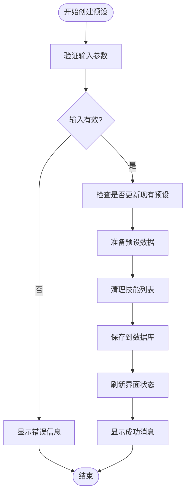
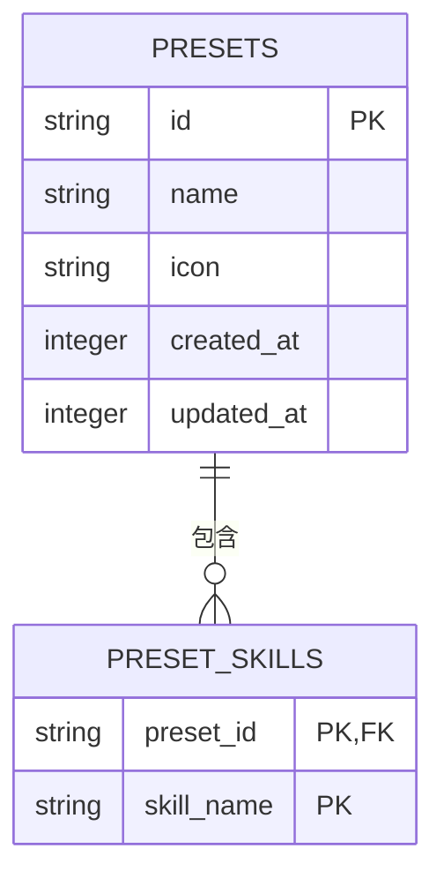
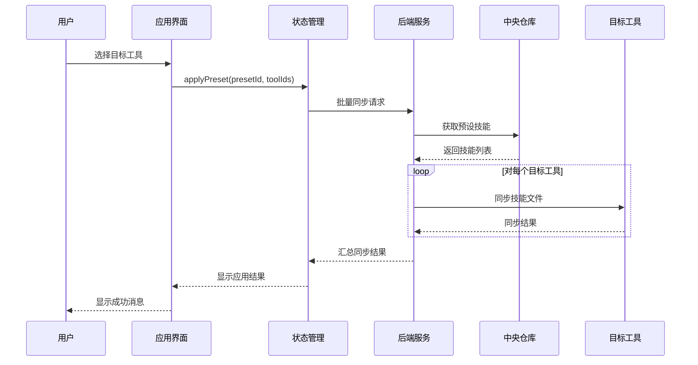
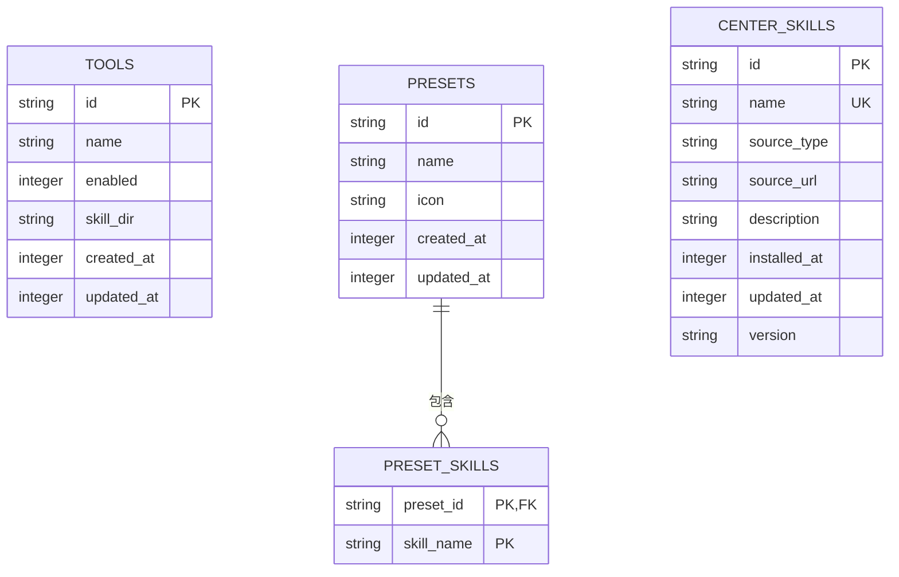
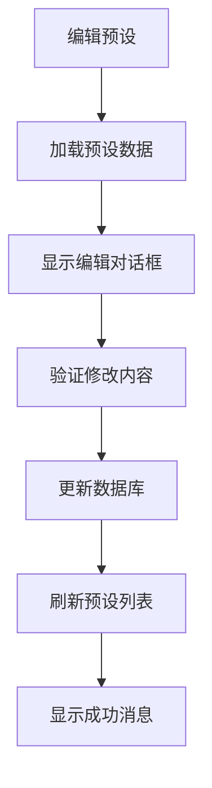
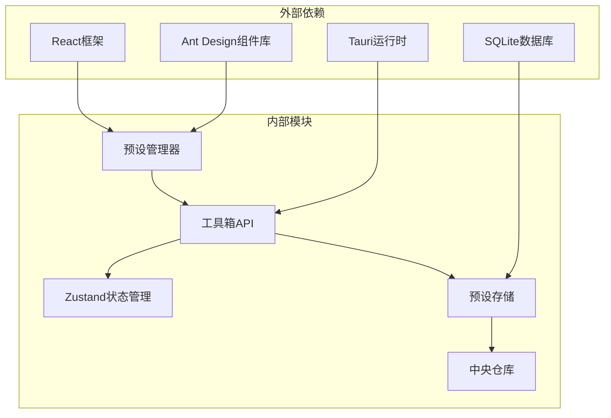

# 预设管理模块

<cite>
**本文档引用的文件**
- [src/components/PresetManager.tsx](file://src/components/PresetManager.tsx)
- [src/lib/toolboxApi.ts](file://src/lib/toolboxApi.ts)
- [src/store/useToolboxStore.ts](file://src/store/useToolboxStore.ts)
- [src/types/toolbox.ts](file://src/types/toolbox.ts)
- [src-tauri/src/store/preset_store.rs](file://src-tauri/src/store/preset_store.rs)
- [src-tauri/src/db.rs](file://src-tauri/src/db.rs)
- [src-tauri/src/types.rs](file://src-tauri/src/types.rs)
- [src-tauri/src/lib.rs](file://src-tauri/src/lib.rs)
- [src-tauri/src/central_repo.rs](file://src-tauri/src/central_repo.rs)
</cite>

## 目录
1. [简介](#简介)
2. [项目结构](#项目结构)
3. [核心组件](#核心组件)
4. [架构概览](#架构概览)
5. [详细组件分析](#详细组件分析)
6. [依赖关系分析](#依赖关系分析)
7. [性能考虑](#性能考虑)
8. [故障排除指南](#故障排除指南)
9. [结论](#结论)
10. [附录](#附录)

## 简介

AI工具箱的预设管理模块是一个完整的技能预设管理系统，允许用户创建、管理和应用技能预设。该模块提供了直观的用户界面、强大的后端存储能力和灵活的预设应用机制。

预设管理模块的核心功能包括：
- **预设创建**：基于技能集合创建自定义预设
- **预设存储**：使用SQLite数据库进行持久化存储
- **预设应用**：支持一键应用和批量应用
- **冲突处理**：智能的冲突检测和解决机制
- **数据管理**：完整的增删改查操作

## 项目结构

预设管理模块采用前后端分离的架构设计，主要由以下组件构成：



**图表来源**
- [src/components/PresetManager.tsx:1-330](file://src/components/PresetManager.tsx#L1-L330)
- [src/lib/toolboxApi.ts:734-750](file://src/lib/toolboxApi.ts#L734-L750)
- [src-tauri/src/lib.rs:1108-1130](file://src-tauri/src/lib.rs#L1108-L1130)

**章节来源**
- [src/components/PresetManager.tsx:1-330](file://src/components/PresetManager.tsx#L1-L330)
- [src/lib/toolboxApi.ts:1-784](file://src/lib/toolboxApi.ts#L1-L784)
- [src-tauri/src/lib.rs:1380-1409](file://src-tauri/src/lib.rs#L1380-L1409)

## 核心组件

### 预设数据模型

预设管理模块使用标准化的数据模型来表示预设信息：



**图表来源**
- [src/types/toolbox.ts:142-152](file://src/types/toolbox.ts#L142-L152)
- [src-tauri/src/types.rs:106-119](file://src-tauri/src/types.rs#L106-L119)

### 用户界面组件

预设管理界面提供了直观的操作体验：

- **创建对话框**：用于创建新的预设
- **应用模态框**：用于将预设应用到目标工具
- **预设列表**：显示所有已创建的预设
- **操作菜单**：提供编辑、删除等操作选项

**章节来源**
- [src/components/PresetManager.tsx:12-330](file://src/components/PresetManager.tsx#L12-L330)

## 架构概览

预设管理模块采用分层架构设计，确保了良好的代码组织和可维护性：



**图表来源**
- [src/lib/toolboxApi.ts:738-750](file://src/lib/toolboxApi.ts#L738-L750)
- [src/store/useToolboxStore.ts:495-554](file://src/store/useToolboxStore.ts#L495-L554)
- [src-tauri/src/lib.rs:1114-1130](file://src-tauri/src/lib.rs#L1114-L1130)

## 详细组件分析

### 预设创建机制

预设创建过程包含多个验证和处理步骤：



**图表来源**
- [src/lib/toolboxApi.ts:738-746](file://src/lib/toolboxApi.ts#L738-L746)
- [src-tauri/src/store/preset_store.rs:57-127](file://src-tauri/src/store/preset_store.rs#L57-L127)

#### 技能集合选择

系统支持多种技能来源的选择方式：

- **技能名称选择**：直接从可用技能列表中选择
- **技能过滤**：支持按关键词过滤技能
- **批量选择**：支持多选技能组合
- **去重处理**：自动去除重复的技能选择

#### 预设命名规则

预设名称遵循以下规则：
- 最小长度：1个字符
- 最大长度：255个字符
- 允许字符：字母、数字、中文字符、空格
- 空白字符处理：自动去除首尾空白

#### 存储结构

预设数据采用关系型数据库存储：



**图表来源**
- [src-tauri/src/db.rs:87-102](file://src-tauri/src/db.rs#L87-L102)
- [src-tauri/src/store/preset_store.rs:9-55](file://src-tauri/src/store/preset_store.rs#L9-L55)

**章节来源**
- [src/components/PresetManager.tsx:31-104](file://src/components/PresetManager.tsx#L31-L104)
- [src-tauri/src/store/preset_store.rs:57-127](file://src-tauri/src/store/preset_store.rs#L57-L127)

### 预设应用流程

预设应用提供了灵活的应用策略：



**图表来源**
- [src/store/useToolboxStore.ts:523-554](file://src/store/useToolboxStore.ts#L523-L554)
- [src-tauri/src/lib.rs:1189-1217](file://src-tauri/src/lib.rs#L1189-L1217)

#### 一键应用

一键应用适用于单个工具的快速预设应用：
- 自动检测目标工具
- 批量同步预设中的所有技能
- 实时显示同步进度
- 统一的错误处理机制

#### 批量应用

批量应用支持同时应用到多个工具：
- 支持多工具选择
- 并行处理多个同步任务
- 逐个工具的详细结果反馈
- 统一的汇总报告

#### 冲突处理

系统提供三种冲突处理策略：

| 策略 | 行为描述 | 使用场景 |
|------|----------|----------|
| skip | 跳过已存在的文件 | 保护现有配置，避免意外覆盖 |
| overwrite | 直接覆盖目标文件 | 强制同步最新版本 |
| rename | 自动重命名新文件 | 保留原始文件，创建副本 |

**章节来源**
- [src/store/useToolboxStore.ts:523-554](file://src/store/useToolboxStore.ts#L523-L554)
- [src-tauri/src/central_repo.rs:389-444](file://src-tauri/src/central_repo.rs#L389-L444)

### 数据持久化

预设管理模块采用SQLite作为数据存储引擎：

#### 数据库设计



**图表来源**
- [src-tauri/src/db.rs:59-147](file://src-tauri/src/db.rs#L59-L147)

#### 版本管理

数据库采用版本控制机制：
- **SCHEMA_V1**：初始版本
- **迁移支持**：自动检测和应用数据库迁移
- **向后兼容**：确保新版本兼容旧数据

#### 数据序列化

预设数据在传输过程中使用JSON格式：
- **前端序列化**：React组件自动处理数据转换
- **后端序列化**：Rust结构体自动序列化为JSON
- **类型安全**：编译时类型检查确保数据完整性

**章节来源**
- [src-tauri/src/db.rs:28-57](file://src-tauri/src/db.rs#L28-L57)
- [src-tauri/src/types.rs:106-119](file://src-tauri/src/types.rs#L106-L119)

### 预设编辑功能

预设编辑功能提供了完整的CRUD操作：

#### 预设修改



**图表来源**
- [src-tauri/src/store/preset_store.rs:81-112](file://src-tauri/src/store/preset_store.rs#L81-L112)

#### 预设重命名

重命名操作遵循以下流程：
- 检查新名称的唯一性
- 验证名称格式的有效性
- 更新数据库中的预设记录
- 刷新前端界面状态

#### 预设删除

删除操作包含安全检查：
- 确认删除操作的必要性
- 检查是否有其他依赖关系
- 执行级联删除操作
- 清理相关的技能关联

**章节来源**
- [src-tauri/src/store/preset_store.rs:129-141](file://src-tauri/src/store/preset_store.rs#L129-L141)

## 依赖关系分析

预设管理模块的依赖关系清晰明确：



**图表来源**
- [src/components/PresetManager.tsx:1-330](file://src/components/PresetManager.tsx#L1-L330)
- [src/lib/toolboxApi.ts:1-784](file://src/lib/toolboxApi.ts#L1-L784)
- [src-tauri/src/lib.rs:1380-1409](file://src-tauri/src/lib.rs#L1380-L1409)

**章节来源**
- [src/components/PresetManager.tsx:161-330](file://src/components/PresetManager.tsx#L161-L330)
- [src/lib/toolboxApi.ts:3-19](file://src/lib/toolboxApi.ts#L3-L19)

## 性能考虑

预设管理模块在设计时充分考虑了性能优化：

### 数据库优化

- **索引优化**：为常用查询字段建立索引
- **事务处理**：批量操作使用事务确保原子性
- **连接池**：复用数据库连接减少开销
- **查询优化**：使用参数化查询防止SQL注入

### 前端性能

- **虚拟滚动**：大量预设时使用虚拟滚动
- **懒加载**：延迟加载非关键资源
- **状态缓存**：缓存常用数据减少请求
- **防抖处理**：输入验证使用防抖机制

### 同步性能

- **并发处理**：多工具同步时使用并发处理
- **进度跟踪**：实时显示同步进度
- **错误隔离**：单个工具失败不影响整体进度

## 故障排除指南

### 常见问题及解决方案

#### 预设创建失败

**问题症状**：创建预设时出现错误提示

**可能原因**：
- 技能名称无效
- 数据库连接失败
- 网络异常

**解决方案**：
1. 检查技能名称格式
2. 验证数据库连接状态
3. 重新尝试网络连接

#### 预设应用失败

**问题症状**：应用预设时部分技能同步失败

**可能原因**：
- 目标工具配置问题
- 文件权限不足
- 磁盘空间不足

**解决方案**：
1. 检查目标工具的技能目录
2. 验证文件系统权限
3. 清理磁盘空间

#### 数据库异常

**问题症状**：预设数据丢失或损坏

**可能原因**：
- 突然断电
- 程序异常退出
- 磁盘故障

**解决方案**：
1. 检查数据库文件完整性
2. 使用备份恢复数据
3. 重建数据库结构

**章节来源**
- [src/store/useToolboxStore.ts:495-554](file://src/store/useToolboxStore.ts#L495-L554)
- [src-tauri/src/store/preset_store.rs:129-141](file://src-tauri/src/store/preset_store.rs#L129-L141)

## 结论

AI工具箱的预设管理模块提供了一个完整、高效且用户友好的技能预设管理系统。通过精心设计的架构和完善的错误处理机制，该模块能够满足各种复杂的预设管理需求。

模块的主要优势包括：
- **易用性**：直观的用户界面和流畅的操作体验
- **可靠性**：完善的错误处理和数据备份机制
- **扩展性**：模块化的架构设计便于功能扩展
- **性能**：优化的数据库查询和并发处理能力

未来可以考虑的功能增强：
- 预设模板系统
- 预设版本历史
- 预设分享功能
- 高级冲突解决策略

## 附录

### API接口文档

#### listPresets

列出所有预设信息

**返回值**：`Promise<PresetEntry[]>`

**使用示例**：
```typescript
const presets = await listPresets();
console.log(`找到 ${presets.length} 个预设`);
```

#### savePreset

保存或更新预设

**参数**：
- `name: string` - 预设名称
- `skills: string[]` - 技能名称数组
- `id?: string` - 预设ID（可选）

**返回值**：`Promise<PresetEntry>`

**使用示例**：
```typescript
const preset = await savePreset('前端开发套装', ['frontend-design', 'openai-docs']);
console.log(`预设 ${preset.name} 创建成功`);
```

#### deletePreset

删除指定预设

**参数**：
- `id: string` - 预设ID

**返回值**：`Promise<void>`

**使用示例**：
```typescript
await deletePreset('preset-123');
console.log('预设删除成功');
```

### 最佳实践

1. **预设命名**：使用描述性的名称，便于识别和管理
2. **技能选择**：合理选择技能组合，避免冗余
3. **定期备份**：定期备份预设数据，防止意外丢失
4. **冲突策略**：根据使用场景选择合适的冲突处理策略
5. **性能监控**：关注大量预设时的性能表现

### 实际使用案例

#### 案例1：团队协作预设

团队可以创建共享的预设，包含常用的开发技能组合，提高团队协作效率。

#### 案例2：环境切换预设

根据不同开发环境（开发、测试、生产）创建相应的预设，快速切换配置。

#### 案例3：项目特定预设

为特定项目创建定制化的预设，包含项目所需的专用技能和配置。