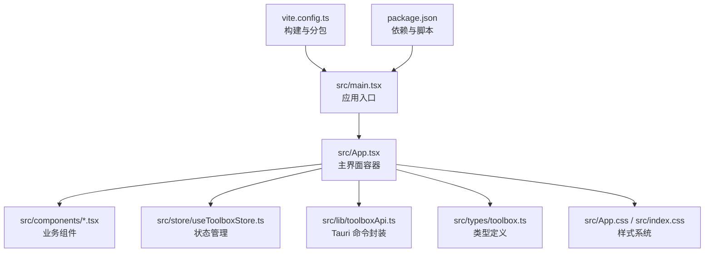
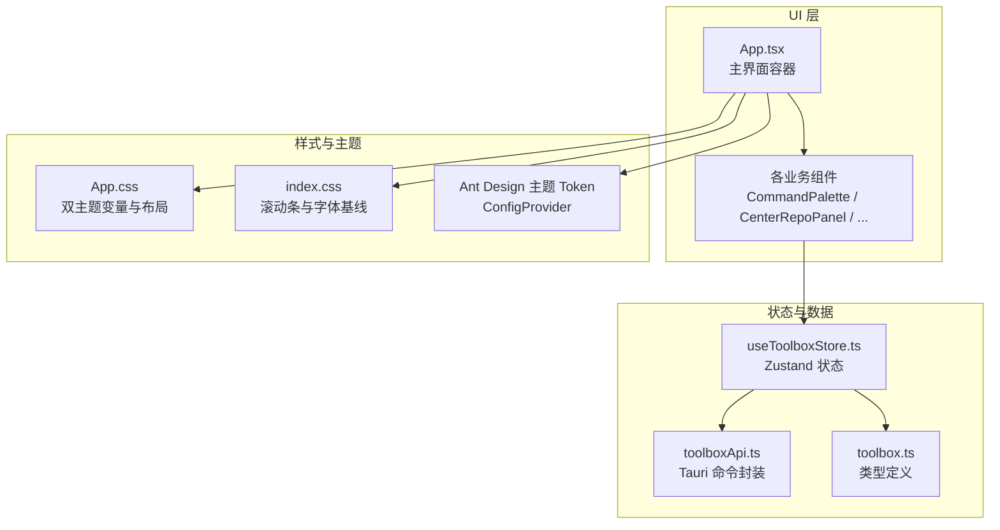
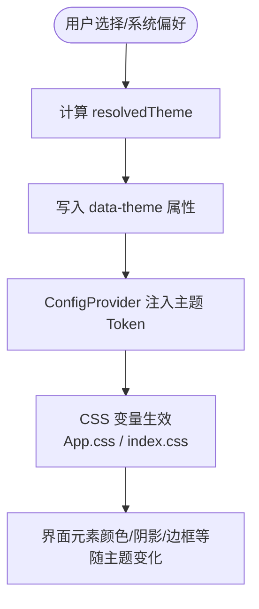
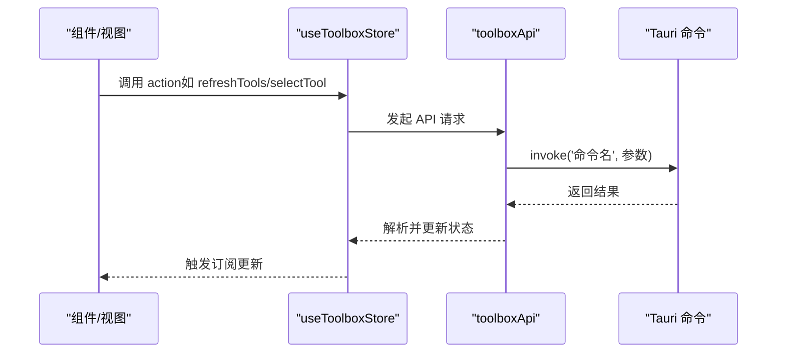
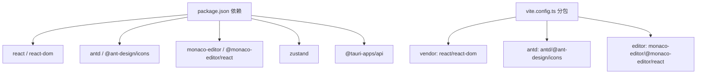

# 用户界面组件

<cite>
**本文引用的文件**
- [src/App.tsx](file://src/App.tsx)
- [src/main.tsx](file://src/main.tsx)
- [src/App.css](file://src/App.css)
- [src/index.css](file://src/index.css)
- [src/components/CenterRepoPanel.tsx](file://src/components/CenterRepoPanel.tsx)
- [src/components/ClaudeConfigSyncPanel.tsx](file://src/components/ClaudeConfigSyncPanel.tsx)
- [src/components/CommandPalette.tsx](file://src/components/CommandPalette.tsx)
- [src/components/PresetManager.tsx](file://src/components/PresetManager.tsx)
- [src/components/SkillDetailDrawer.tsx](file://src/components/SkillDetailDrawer.tsx)
- [src/components/TagFilter.tsx](file://src/components/TagFilter.tsx)
- [src/store/useToolboxStore.ts](file://src/store/useToolboxStore.ts)
- [src/lib/toolboxApi.ts](file://src/lib/toolboxApi.ts)
- [src/types/toolbox.ts](file://src/types/toolbox.ts)
- [package.json](file://package.json)
- [vite.config.ts](file://vite.config.ts)
- [README.md](file://README.md)
</cite>

## 目录
1. [简介](#简介)
2. [项目结构](#项目结构)
3. [核心组件](#核心组件)
4. [架构总览](#架构总览)
5. [组件详解](#组件详解)
6. [依赖关系分析](#依赖关系分析)
7. [性能考量](#性能考量)
8. [故障排查指南](#故障排查指南)
9. [结论](#结论)
10. [附录](#附录)

## 简介
本文件面向“AI 工具箱”项目的用户界面组件，系统性梳理其布局系统、主题系统、交互设计、Ant Design 使用规范、样式管理策略、组件设计规范与最佳实践，并解释组件间通信与状态共享模式。目标是帮助开发者快速理解并高效扩展 UI 组件体系。

## 项目结构
- 前端采用 React + TypeScript + Vite + Ant Design 6，状态管理使用 Zustand。
- 主入口负责注入全局样式与渲染根组件；App.tsx 作为主界面容器，组织头部、网格布局与右侧抽屉/抽屉面板。
- 组件按功能分层存放于 src/components，类型定义集中在 src/types，状态逻辑集中在 src/store，API 封装在 src/lib。
- 构建配置通过 vite.config.ts 拆分 vendor/antd/editor 等代码块，提升缓存命中与加载性能。

图表来源
- [src/main.tsx:1-12](file://src/main.tsx#L1-L12)
- [src/App.tsx:1-120](file://src/App.tsx#L1-L120)
- [vite.config.ts:1-31](file://vite.config.ts#L1-L31)
- [package.json:1-63](file://package.json#L1-L63)

章节来源
- [src/main.tsx:1-12](file://src/main.tsx#L1-L12)
- [src/App.tsx:1-120](file://src/App.tsx#L1-L120)
- [vite.config.ts:1-31](file://vite.config.ts#L1-L31)
- [package.json:1-63](file://package.json#L1-L63)

## 核心组件
- 主界面容器：负责主题切换、消息提示、窗口拖拽、工具列表与技能视图、编辑器模式切换、中央仓库抽屉等。
- 业务组件：命令面板、技能详情抽屉、预设管理、Claude 配置同步面板、中央仓库面板、标签过滤器。
- 状态与 API：集中于 Zustand store 与 toolboxApi，提供工具、技能、配置、预设、同步、洞察等能力。

章节来源
- [src/App.tsx:138-640](file://src/App.tsx#L138-L640)
- [src/store/useToolboxStore.ts:145-556](file://src/store/useToolboxStore.ts#L145-L556)
- [src/lib/toolboxApi.ts:387-784](file://src/lib/toolboxApi.ts#L387-L784)

## 架构总览
UI 层以 App.tsx 为中心，通过 ConfigProvider 注入 Ant Design 主题算法与 Token，结合 CSS 变量实现双主题系统。组件通过 useToolboxStore 订阅状态，通过 toolboxApi 调用 Tauri 命令，实现数据驱动的交互与持久化。

图表来源
- [src/App.tsx:609-640](file://src/App.tsx#L609-L640)
- [src/App.css:1-200](file://src/App.css#L1-L200)
- [src/index.css:1-101](file://src/index.css#L1-L101)
- [src/store/useToolboxStore.ts:145-556](file://src/store/useToolboxStore.ts#L145-L556)
- [src/lib/toolboxApi.ts:387-784](file://src/lib/toolboxApi.ts#L387-L784)
- [src/types/toolbox.ts:1-152](file://src/types/toolbox.ts#L1-L152)

## 组件详解

### 布局系统与响应式设计
- 网格布局：App.tsx 使用 CSS Grid 将界面划分为左工具列表、中间工作区（含技能/编辑器/洞察）、右侧面板，支持编辑模式下的左右面板切换动画。
- 响应式：通过媒体查询与 CSS 变量适配浅色/深色主题，头部与工具列表区域在小屏下仍保持可读性与可用性。
- 窗口交互：支持无边框窗口拖拽与双击最大化，提升桌面应用体验。

章节来源
- [src/App.tsx:739-740](file://src/App.tsx#L739-L740)
- [src/App.tsx:443-531](file://src/App.tsx#L443-L531)
- [src/App.tsx:555-592](file://src/App.tsx#L555-L592)

### 主题系统与双主题设计
- 数据驱动主题：根据用户选择与系统偏好计算最终主题，写入 data-theme 属性，配合 CSS 变量实现全站主题切换。
- Ant Design 主题：通过 ConfigProvider 注入算法与 Token，分别针对浅色/深色主题设置主色、信息色、成功/警告/错误色、背景与文字色、圆角与字体族。
- CSS 变量：App.css 定义了大量主题变量，如页面背景、面板背景、文字色、强调色、工具专属色、组件色与尺寸变量；index.css 提供滚动条与字体基线。

图表来源
- [src/App.tsx:138-248](file://src/App.tsx#L138-L248)
- [src/App.tsx:609-638](file://src/App.tsx#L609-L638)
- [src/App.css:28-130](file://src/App.css#L28-L130)
- [src/index.css:1-43](file://src/index.css#L1-L43)

章节来源
- [src/App.tsx:138-248](file://src/App.tsx#L138-L248)
- [src/App.tsx:609-638](file://src/App.tsx#L609-L638)
- [src/App.css:28-130](file://src/App.css#L28-L130)
- [src/index.css:1-43](file://src/index.css#L1-L43)

### Ant Design 组件使用规范
- 统一注入：通过 ConfigProvider 一次性注入算法与 Token，避免在各组件内重复配置。
- 组件选择：常用组件包括 Button、Input、Select、Table、Modal、Drawer、Space、Typography、Tag、Form、message 等，均来自 antd 与 @ant-design/icons。
- 表单与校验：Form.useForm 与 validateFields 用于工具注册表单与预设创建表单，确保输入合法后再提交。
- 消息反馈：message.useMessage 提供全局提示，结合 store 中 feedback 字段进行展示。

章节来源
- [src/App.tsx:28-49](file://src/App.tsx#L28-L49)
- [src/App.tsx:138-140](file://src/App.tsx#L138-L140)
- [src/components/PresetManager.tsx:31-104](file://src/components/PresetManager.tsx#L31-L104)

### 自定义组件开发方法
- 命名与职责：组件名采用帕斯卡命名，职责单一，如 CommandPalette、CenterRepoPanel、PresetManager、SkillDetailDrawer、TagFilter。
- Props 设计：明确开放属性，如 open、tools、skills、onSelectTool/onSelectSkill、onClose 等，便于父组件控制与回调。
- 事件处理：统一使用受控模式（open/close、value/onChange），并在必要时提供 onOpen 回调以支持快捷键触发。
- 可访问性：为列表与键盘导航提供 aria-* 属性与 role，保证可访问性。

章节来源
- [src/components/CommandPalette.tsx:21-40](file://src/components/CommandPalette.tsx#L21-L40)
- [src/components/CenterRepoPanel.tsx:46-62](file://src/components/CenterRepoPanel.tsx#L46-L62)
- [src/components/PresetManager.tsx:161-169](file://src/components/PresetManager.tsx#L161-L169)
- [src/components/SkillDetailDrawer.tsx:9-14](file://src/components/SkillDetailDrawer.tsx#L9-L14)
- [src/components/TagFilter.tsx:5-9](file://src/components/TagFilter.tsx#L5-L9)

### 样式管理策略
- 双主题变量：App.css 定义 :root 与 [data-theme='dark'] 下的变量，覆盖页面背景、面板、文字、强调色、工具专属色、组件色与尺寸。
- 布局与动画：通过 CSS Grid 与 Flex 实现布局，配合过渡与动画类实现面板滑动与显隐。
- 滚动条与字体：index.css 统一滚动条颜色与字体族，确保跨浏览器一致性。
- 构建优化：vite.config.ts 对 vendor/antd/editor 进行手动分包，减少首屏体积与提升缓存复用。

章节来源
- [src/App.css:132-707](file://src/App.css#L132-L707)
- [src/index.css:45-101](file://src/index.css#L45-L101)
- [vite.config.ts:13-23](file://vite.config.ts#L13-L23)

### 组件设计规范
- 命名约定：组件文件名与导出函数名一致，使用帕斯卡命名；样式类名采用 BEM 风格（如 .panel-header、.tool-item）。
- Props 设计：以“数据 + 回调”的方式传递，如 open/closed、tools/skills、onSelectTool/onSelectSkill/onClose。
- 事件处理：统一使用受控模式，避免内部维护本地状态；对键盘事件（如 ESC、上下箭头、Enter）进行集中处理。
- 错误与加载：统一使用 Modal/Alert/Empty/Spin 展示错误、空状态与加载态，确保用户体验一致。

章节来源
- [src/components/CommandPalette.tsx:102-156](file://src/components/CommandPalette.tsx#L102-L156)
- [src/components/CenterRepoPanel.tsx:99-120](file://src/components/CenterRepoPanel.tsx#L99-L120)
- [src/components/ClaudeConfigSyncPanel.tsx:211-217](file://src/components/ClaudeConfigSyncPanel.tsx#L211-L217)

### 组件使用示例与最佳实践
- 命令面板：通过 open 与 onClose 控制显隐，支持键盘快捷键（Cmd/Ctrl+K）打开，支持 ESC 关闭与上下导航。
- 中央仓库：支持 Git 安装、扫描发现、批量同步、分类标记等，使用 Modal/Drawer/Select/Table/Alert 等组合。
- 预设管理：CreatePresetDialog 与 ApplyPresetModal 分离创建与应用流程，避免复杂状态耦合。
- 抽屉详情：SkillDetailDrawer 以宽度固定抽屉承载技能文档内容，支持加载态与空态。
- 标签过滤：TagFilter 以 CheckableTag 实现多选与清空，适合技能标签筛选场景。

章节来源
- [src/components/CommandPalette.tsx:244-318](file://src/components/CommandPalette.tsx#L244-L318)
- [src/components/CenterRepoPanel.tsx:411-772](file://src/components/CenterRepoPanel.tsx#L411-L772)
- [src/components/PresetManager.tsx:171-329](file://src/components/PresetManager.tsx#L171-L329)
- [src/components/SkillDetailDrawer.tsx:18-118](file://src/components/SkillDetailDrawer.tsx#L18-L118)
- [src/components/TagFilter.tsx:11-55](file://src/components/TagFilter.tsx#L11-L55)

### 组件间通信与状态共享
- 状态集中：useToolboxStore 统一管理工具、技能、配置、洞察、反馈、预设、Claude 配置差异等状态。
- 订阅与派发：组件通过 store 的 action（如 refreshTools/selectTool/saveCurrentFile/loadClaudeConfigDiff 等）更新状态。
- API 调用：toolboxApi 封装 Tauri 命令，返回 Promise，组件在 useEffect 或事件回调中调用并处理结果。
- 事件流：App.tsx 作为顶层协调者，处理窗口拖拽、主题切换、消息提示、命令面板开关等全局事件。

图表来源
- [src/store/useToolboxStore.ts:174-205](file://src/store/useToolboxStore.ts#L174-L205)
- [src/lib/toolboxApi.ts:387-465](file://src/lib/toolboxApi.ts#L387-L465)

章节来源
- [src/store/useToolboxStore.ts:145-556](file://src/store/useToolboxStore.ts#L145-L556)
- [src/lib/toolboxApi.ts:387-784](file://src/lib/toolboxApi.ts#L387-L784)

## 依赖关系分析
- 依赖矩阵：React、Ant Design、Monaco Editor、Zustand、@tauri-apps/api。
- 构建分包：vendor（react/react-dom）、antd（antd/@ant-design/icons）、editor（monaco-editor/@monaco-editor/react）。
- 类型与工具：TypeScript、ESLint、Prettier、Vitest。

图表来源
- [package.json:29-38](file://package.json#L29-L38)
- [vite.config.ts:13-23](file://vite.config.ts#L13-L23)

章节来源
- [package.json:1-63](file://package.json#L1-L63)
- [vite.config.ts:1-31](file://vite.config.ts#L1-L31)

## 性能考量
- 代码分割：通过手动分包减少首屏体积，提升加载速度。
- 状态粒度：Zustand 将状态按领域拆分，避免不必要的重渲染。
- 列表优化：使用 useMemo 与稳定引用，减少渲染次数。
- 图标与主题：Ant Design 主题 Token 与 CSS 变量减少重复计算与样式抖动。
- 编辑器：Monaco Editor 作为独立抽屉/抽屉面板，按需加载，避免常驻内存。

## 故障排查指南
- 主题不生效：检查 data-theme 是否正确写入，确认 CSS 变量是否被覆盖。
- 消息提示不显示：确认 message.useMessage 在 ConfigProvider 内部初始化，且上下文在 App.tsx 中。
- 窗口拖拽失效：确认 hasTauriRuntime 与 getCurrentWindow 调用条件，避免在预览模式下执行。
- 同步/保存失败：查看 store 中 feedback 字段与 toolboxApi 的错误处理，定位具体命令与参数。
- 预设应用失败：确认预设存在、目标工具列表有效、批量同步返回结果。

章节来源
- [src/App.tsx:250-258](file://src/App.tsx#L250-L258)
- [src/App.tsx:555-607](file://src/App.tsx#L555-L607)
- [src/store/useToolboxStore.ts:495-554](file://src/store/useToolboxStore.ts#L495-L554)
- [src/lib/toolboxApi.ts:438-465](file://src/lib/toolboxApi.ts#L438-L465)

## 结论
本 UI 组件体系以 App.tsx 为核心，结合 ConfigProvider 主题系统、Zustand 状态管理与 toolboxApi 的 Tauri 命令封装，形成清晰的“视图-状态-API-主题”链路。Ant Design 组件与自定义组件协同，既保证了开发效率，又兼顾了可维护性与可扩展性。遵循本文的设计规范与最佳实践，可快速迭代并稳定扩展 UI 能力。

## 附录
- 快速开始与开发环境参考 README。
- 技术栈与版本信息见 package.json 与 README。

章节来源
- [README.md:69-87](file://README.md#L69-L87)
- [package.json:1-63](file://package.json#L1-L63)