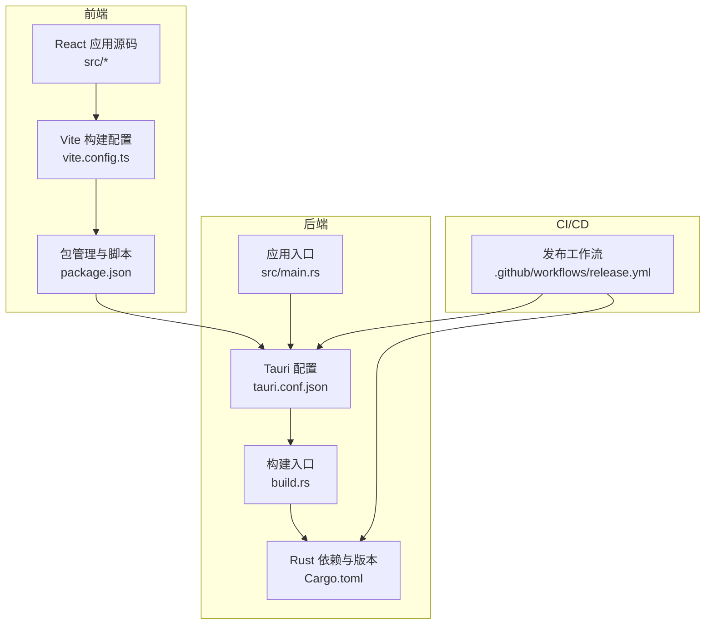
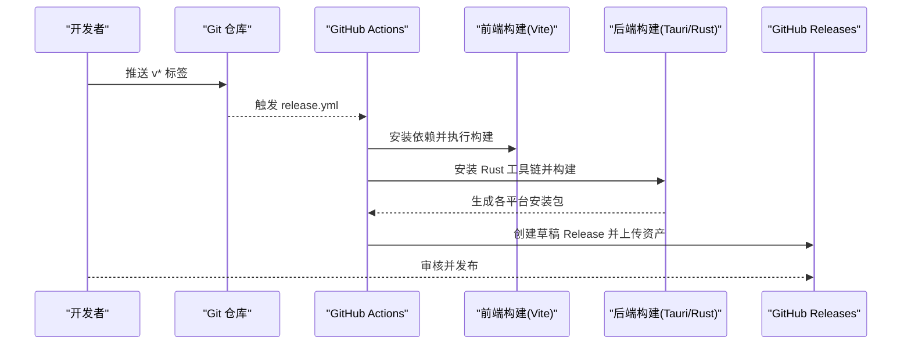
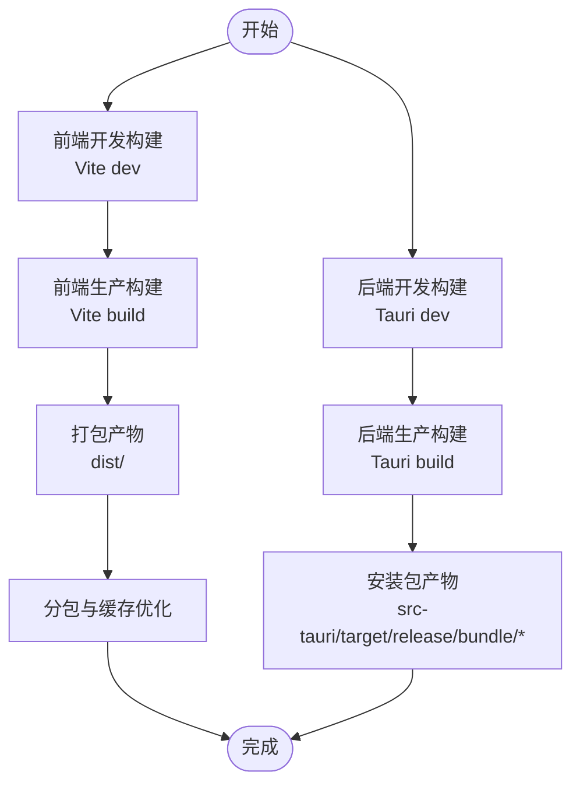
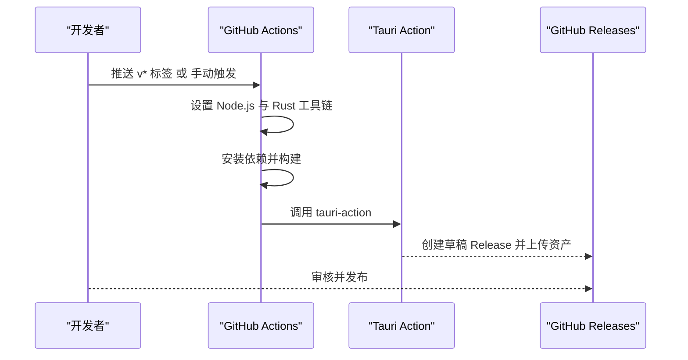
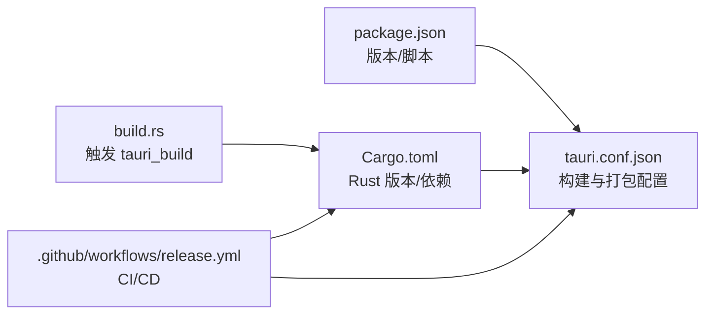

# 部署与发布

<cite>
**本文引用的文件**
- [package.json](file://package.json)
- [vite.config.ts](file://vite.config.ts)
- [src-tauri/Cargo.toml](file://src-tauri/Cargo.toml)
- [src-tauri/tauri.conf.json](file://src-tauri/tauri.conf.json)
- [.github/workflows/release.yml](file://.github/workflows/release.yml)
- [src-tauri/build.rs](file://src-tauri/build.rs)
- [src-tauri/src/main.rs](file://src-tauri/src/main.rs)
- [README.md](file://README.md)
- [docs/RELEASE.md](file://docs/RELEASE.md)
- [src-tauri/capabilities/default.json](file://src-tauri/capabilities/default.json)
</cite>

## 目录
1. [简介](#简介)
2. [项目结构](#项目结构)
3. [核心组件](#核心组件)
4. [架构总览](#架构总览)
5. [详细组件分析](#详细组件分析)
6. [依赖关系分析](#依赖关系分析)
7. [性能考虑](#性能考虑)
8. [故障排查指南](#故障排查指南)
9. [结论](#结论)
10. [附录](#附录)

## 简介
本文件面向开发者与运维人员，系统化梳理 AI 工具箱项目的部署与发布流程，涵盖：
- 构建流程：开发构建、生产构建与资源优化
- 发布流程：GitHub Actions 工作流、版本管理与自动化发布
- 平台部署：Windows 与 macOS 安装包制作与分发
- 更新机制：版本检查、增量更新与回滚策略
- 最佳实践与运维建议

## 项目结构
项目采用 Tauri + React 技术栈，前端通过 Vite 构建，后端由 Rust 驱动，借助 Tauri 进行打包与分发。关键目录与文件如下：
- 前端：src、public、vite.config.ts、package.json
- 后端：src-tauri（Rust 项目）、tauri.conf.json、Cargo.toml、build.rs
- CI/CD：.github/workflows/release.yml
- 文档：README.md、docs/RELEASE.md

图表来源
- [vite.config.ts:1-31](file://vite.config.ts#L1-L31)
- [package.json:1-63](file://package.json#L1-L63)
- [src-tauri/tauri.conf.json:1-43](file://src-tauri/tauri.conf.json#L1-L43)
- [src-tauri/Cargo.toml:1-30](file://src-tauri/Cargo.toml#L1-L30)
- [src-tauri/build.rs:1-4](file://src-tauri/build.rs#L1-L4)
- [src-tauri/src/main.rs:1-7](file://src-tauri/src/main.rs#L1-L7)
- [.github/workflows/release.yml:1-59](file://.github/workflows/release.yml#L1-L59)

章节来源
- [package.json:1-63](file://package.json#L1-L63)
- [vite.config.ts:1-31](file://vite.config.ts#L1-L31)
- [src-tauri/tauri.conf.json:1-43](file://src-tauri/tauri.conf.json#L1-L43)
- [src-tauri/Cargo.toml:1-30](file://src-tauri/Cargo.toml#L1-L30)
- [.github/workflows/release.yml:1-59](file://.github/workflows/release.yml#L1-L59)

## 核心组件
- 前端构建与资源优化
  - 使用 Vite 进行开发与生产构建，配置别名与分包策略，提升加载性能与缓存命中率。
  - 通过 Rollup 的 manualChunks 将第三方库拆分为独立 chunk，减少重复打包。
- 后端打包与平台配置
  - Tauri 配置统一管理产品名称、版本、窗口参数与打包图标等。
  - Rust 侧通过 build.rs 触发 tauri_build，确保原生能力与资源编译。
- 自动化发布
  - GitHub Actions 在推送 v* 标签或手动触发时，分别构建 macOS 与 Windows 平台安装包，并创建草稿 Release。

章节来源
- [vite.config.ts:13-23](file://vite.config.ts#L13-L23)
- [src-tauri/tauri.conf.json:6-41](file://src-tauri/tauri.conf.json#L6-L41)
- [src-tauri/build.rs:1-4](file://src-tauri/build.rs#L1-L4)
- [.github/workflows/release.yml:9-59](file://.github/workflows/release.yml#L9-L59)

## 架构总览
下图展示从代码提交到安装包产出的关键路径，以及版本号一致性与产物命名规范。

图表来源
- [.github/workflows/release.yml:3-59](file://.github/workflows/release.yml#L3-L59)
- [package.json:6-18](file://package.json#L6-L18)
- [src-tauri/tauri.conf.json:6-11](file://src-tauri/tauri.conf.json#L6-L11)
- [src-tauri/Cargo.toml:1-10](file://src-tauri/Cargo.toml#L1-L10)

## 详细组件分析

### 构建流程
- 开发构建
  - 前端：通过脚本启动开发服务器，支持热更新与跨主机访问。
  - 后端：通过 Tauri CLI 启动开发模式，自动编译并注入前端开发地址。
- 生产构建
  - 前端：TypeScript 编译与 Vite 生产构建，按需拆分 vendor、antd、editor 等大依赖。
  - 后端：Tauri 打包，生成多平台安装包；Windows 使用 EXE/MSI，macOS 使用 DMG。
- 资源优化
  - 通过分包策略降低首屏体积，提升缓存复用；同时保持模块化便于后续按需加载。

图表来源
- [package.json:6-10](file://package.json#L6-L10)
- [vite.config.ts:13-23](file://vite.config.ts#L13-L23)
- [src-tauri/tauri.conf.json:6-11](file://src-tauri/tauri.conf.json#L6-L11)

章节来源
- [package.json:6-18](file://package.json#L6-L18)
- [vite.config.ts:13-23](file://vite.config.ts#L13-L23)
- [src-tauri/tauri.conf.json:6-11](file://src-tauri/tauri.conf.json#L6-L11)

### 发布流程与自动化
- 触发条件
  - 推送 v* 标签或手动触发 workflow_dispatch。
- 平台矩阵
  - macOS：指定 aarch64 目标，构建 DMG 安装包。
  - Windows：默认目标，构建 EXE/MSI 安装包。
- 关键步骤
  - 安装 Node.js 与 Rust 工具链，启用 Rust 工作区缓存。
  - 安装前端依赖并执行构建。
  - 使用 Tauri Action 上传产物至草稿 Release。
- 版本管理
  - 前端版本号与后端版本号需保持一致，避免运行时版本不匹配。

图表来源
- [.github/workflows/release.yml:3-59](file://.github/workflows/release.yml#L3-L59)

章节来源
- [.github/workflows/release.yml:1-59](file://.github/workflows/release.yml#L1-L59)
- [docs/RELEASE.md:1-47](file://docs/RELEASE.md#L1-L47)
- [README.md:95-100](file://README.md#L95-L100)

### 平台部署策略
- Windows
  - 产物类型：EXE 与 MSI，适合企业内部分发与静默安装。
  - 配置项：窗口尺寸、透明装饰、最小尺寸等在 Tauri 配置中集中管理。
- macOS
  - 产物类型：DMG，支持 Apple Silicon 目标。
  - 配置项：产品名称、标识符、图标集合、窗口参数等。
- 通用策略
  - 保持版本号一致，确保安装包命名规范与下载说明同步更新。

章节来源
- [src-tauri/tauri.conf.json:14-41](file://src-tauri/tauri.conf.json#L14-L41)
- [README.md:13-18](file://README.md#L13-L18)

### 更新机制与回滚策略
- 版本检查
  - 建议在应用启动时读取当前版本并与远程版本进行比对，提示用户更新。
- 增量更新
  - 可结合 Tauri 的 Updater 插件实现应用内更新；若无内置，可参考现有发布流程，通过 GitHub Releases 提供新版本安装包。
- 回滚策略
  - 建议保留上一版本安装包，或在用户选择“回滚”时引导其卸载当前版本并安装历史版本。
- 数据与配置
  - 通过能力配置与权限声明，确保应用具备必要的文件系统与窗口操作能力，保障升级过程中的数据迁移与 UI 行为正常。

章节来源
- [src-tauri/capabilities/default.json:8-17](file://src-tauri/capabilities/default.json#L8-L17)
- [src-tauri/src/main.rs:1-7](file://src-tauri/src/main.rs#L1-L7)

## 依赖关系分析
- 前端与后端耦合点
  - 前端构建产物路径由 Tauri 配置统一指向 dist 目录，保证打包时能正确嵌入静态资源。
  - 版本号在 package.json 与 Cargo.toml/tauri.conf.json 中同步，避免运行期版本不一致。
- CI/CD 依赖
  - Actions 依赖 Node.js 与 Rust 工具链，且通过 Rust 工作区缓存加速构建。
  - Tauri Action 依赖 GitHub Token 以创建草稿 Release 并上传资产。

图表来源
- [package.json:4,6-10](file://package.json#L4,L6-L10)
- [src-tauri/tauri.conf.json:4,6-11](file://src-tauri/tauri.conf.json#L4,L6-L11)
- [src-tauri/Cargo.toml:3,20-30](file://src-tauri/Cargo.toml#L3,L20-L30)
- [src-tauri/build.rs:1-4](file://src-tauri/build.rs#L1-L4)
- [.github/workflows/release.yml:29-58](file://.github/workflows/release.yml#L29-L58)

章节来源
- [package.json:4,6-10](file://package.json#L4,L6-L10)
- [src-tauri/tauri.conf.json:4,6-11](file://src-tauri/tauri.conf.json#L4,L6-L11)
- [src-tauri/Cargo.toml:3,20-30](file://src-tauri/Cargo.toml#L3,L20-L30)
- [src-tauri/build.rs:1-4](file://src-tauri/build.rs#L1-L4)
- [.github/workflows/release.yml:29-58](file://.github/workflows/release.yml#L29-L58)

## 性能考虑
- 前端性能
  - 使用分包策略减少首屏体积，提升加载速度与缓存命中率。
  - 在开发阶段开启跨主机访问，便于多设备联调。
- 后端性能
  - 通过 Rust 与 Tauri 的轻量封装，减少运行时开销。
  - 合理设置窗口尺寸与透明装饰，平衡视觉效果与渲染性能。
- CI/CD 性能
  - 启用 Rust 工作区缓存，显著缩短构建时间。
  - 并行矩阵构建不同平台产物，提高发布效率。

章节来源
- [vite.config.ts:13-23](file://vite.config.ts#L13-L23)
- [src-tauri/tauri.conf.json:14-30](file://src-tauri/tauri.conf.json#L14-L30)
- [.github/workflows/release.yml:40-44](file://.github/workflows/release.yml#L40-L44)

## 故障排查指南
- 版本不一致导致的运行异常
  - 确认 package.json、tauri.conf.json、Cargo.toml 的版本号一致。
- 构建失败
  - 检查 Node.js 与 Rust 工具链版本是否满足要求；查看 CI 日志定位具体错误。
- 安装包缺失或命名不规范
  - 确认 Tauri 配置中的图标与产品信息完整；检查发布工作流是否成功上传资产。
- 权限不足
  - 若涉及文件系统或窗口操作，检查能力配置与权限声明是否齐全。

章节来源
- [docs/RELEASE.md:30-36](file://docs/RELEASE.md#L30-L36)
- [src-tauri/tauri.conf.json:34-41](file://src-tauri/tauri.conf.json#L34-L41)
- [src-tauri/capabilities/default.json:8-17](file://src-tauri/capabilities/default.json#L8-L17)

## 结论
本项目通过清晰的前后端分离与 Tauri 打包体系，配合 GitHub Actions 的自动化发布，实现了高效、稳定的桌面应用交付。遵循本文档的版本管理、构建优化与运维建议，可进一步提升发布质量与用户体验。

## 附录
- 快速参考
  - 开发模式：前端与后端分别启动，确保开发服务器与 Tauri 开发模式协同工作。
  - 生产构建：统一执行前端与后端构建，生成 dist 与安装包产物。
  - 自动发布：推送 v* 标签或手动触发，自动生成草稿 Release 并上传资产。
  - 平台产物：Windows（EXE/MSI）、macOS（DMG），命名与说明需与 README 保持一致。

章节来源
- [README.md:76-95](file://README.md#L76-L95)
- [docs/RELEASE.md:16-26](file://docs/RELEASE.md#L16-L26)
- [src-tauri/tauri.conf.json:31-41](file://src-tauri/tauri.conf.json#L31-L41)