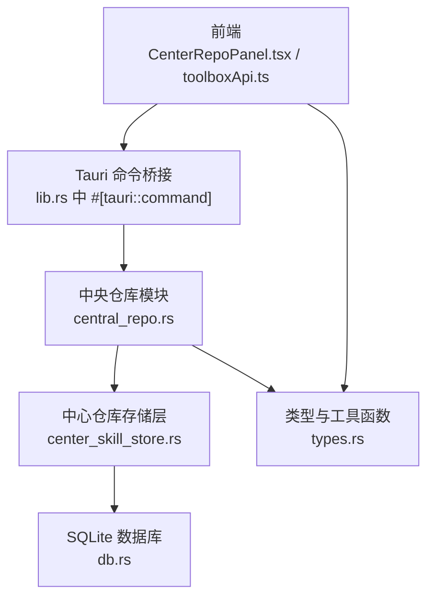
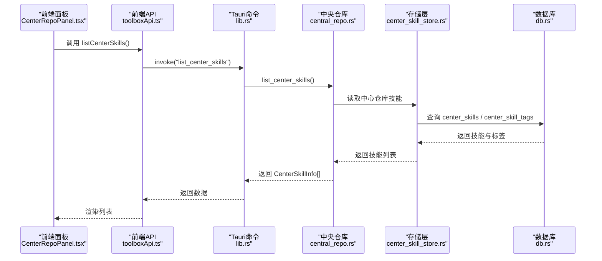
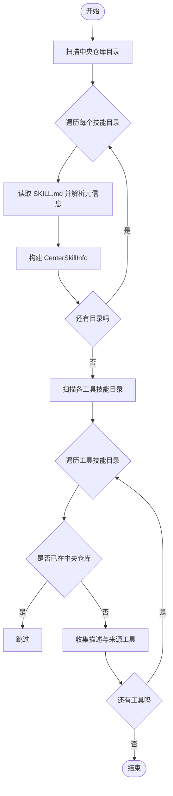
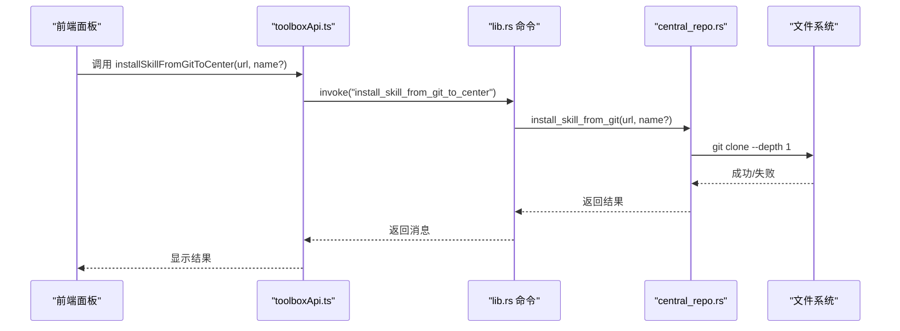
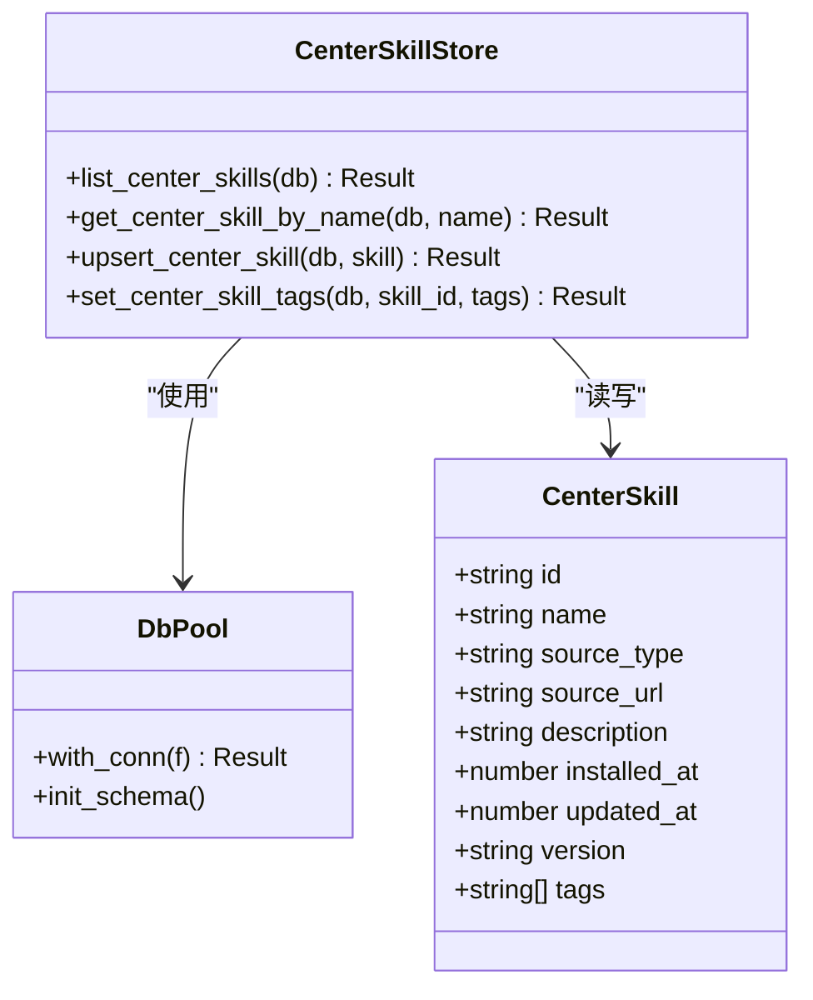
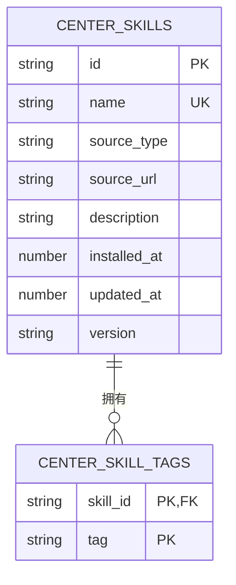
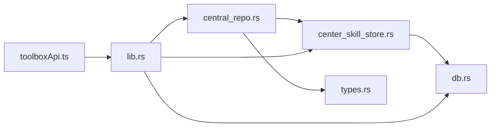

# 中央仓库

<cite>
**本文引用的文件**   
- [src-tauri/src/central_repo.rs](file://src-tauri/src/central_repo.rs)
- [src-tauri/src/store/center_skill_store.rs](file://src-tauri/src/store/center_skill_store.rs)
- [src-tauri/src/db.rs](file://src-tauri/src/db.rs)
- [src-tauri/src/types.rs](file://src-tauri/src/types.rs)
- [src/lib/toolboxApi.ts](file://src/lib/toolboxApi.ts)
- [src/components/CenterRepoPanel.tsx](file://src/components/CenterRepoPanel.tsx)
- [src/types/toolbox.ts](file://src/types/toolbox.ts)
- [src-tauri/src/lib.rs](file://src-tauri/src/lib.rs)
- [src-tauri/Cargo.toml](file://src-tauri/Cargo.toml)
</cite>

## 目录
1. [简介](#简介)
2. [项目结构](#项目结构)
3. [核心组件](#核心组件)
4. [架构总览](#架构总览)
5. [详细组件分析](#详细组件分析)
6. [依赖分析](#依赖分析)
7. [性能考虑](#性能考虑)
8. [故障排查指南](#故障排查指南)
9. [结论](#结论)
10. [附录](#附录)

## 简介
本文件为 AI 工具箱“中央仓库”功能的使用与开发文档。围绕技能发现、导入/导出、分类与标签、数据模型与持久化、API 接口、扩展性与第三方技能源集成、UI 交互体验以及技能质量评估与推荐机制进行系统化说明，帮助使用者与开发者快速上手并深度定制。

## 项目结构
中央仓库位于 Rust 后端模块中，前端通过 Tauri 命令桥接调用后端能力；同时配合 SQLite 数据库存储技能元数据与标签信息。核心文件分布如下：
- 后端核心：中央仓库扫描与导入导出、工具函数与类型定义
- 存储层：中心仓库技能的增删改查与标签管理
- 数据库：schema 定义与连接池
- 前端 API：统一的命令封装与类型声明
- 前端面板：中央仓库 UI、筛选、批量操作与交互
- 类型定义：前后端通用类型与工具函数

图表来源
- [src/components/CenterRepoPanel.tsx](file://src/components/CenterRepoPanel.tsx)
- [src/lib/toolboxApi.ts](file://src/lib/toolboxApi.ts)
- [src-tauri/src/lib.rs](file://src-tauri/src/lib.rs)
- [src-tauri/src/central_repo.rs](file://src-tauri/src/central_repo.rs)
- [src-tauri/src/store/center_skill_store.rs](file://src-tauri/src/store/center_skill_store.rs)
- [src-tauri/src/db.rs](file://src-tauri/src/db.rs)
- [src-tauri/src/types.rs](file://src-tauri/src/types.rs)

章节来源
- [src-tauri/src/central_repo.rs](file://src-tauri/src/central_repo.rs)
- [src-tauri/src/store/center_skill_store.rs](file://src-tauri/src/store/center_skill_store.rs)
- [src-tauri/src/db.rs](file://src-tauri/src/db.rs)
- [src-tauri/src/types.rs](file://src-tauri/src/types.rs)
- [src/lib/toolboxApi.ts](file://src/lib/toolboxApi.ts)
- [src/components/CenterRepoPanel.tsx](file://src/components/CenterRepoPanel.tsx)
- [src-tauri/src/lib.rs](file://src-tauri/src/lib.rs)

## 核心组件
- 中央仓库扫描与发现：遍历中央仓库目录与各工具技能目录，提取 SKILL.md 元信息，构建可导入清单
- 技能导入/导出：支持从 Git/本地目录导入到中央仓库，支持从工具导入到中央仓库；支持复制/符号链接同步到工具
- 分类与标签：中心仓库技能支持分类字段与标签集合，前端提供分类切换与批量设置
- 数据模型与持久化：中心仓库技能表与标签关联表，事务性写入与标签重建
- 前端 API 与 UI：统一命令封装、列表/搜索/筛选、批量同步、分类设置、模态框交互

章节来源
- [src-tauri/src/central_repo.rs](file://src-tauri/src/central_repo.rs)
- [src-tauri/src/store/center_skill_store.rs](file://src-tauri/src/store/center_skill_store.rs)
- [src/lib/toolboxApi.ts](file://src/lib/toolboxApi.ts)
- [src/components/CenterRepoPanel.tsx](file://src/components/CenterRepoPanel.tsx)

## 架构总览
中央仓库采用“前端命令桥接 + Rust 后端 + SQLite 存储”的分层架构。前端通过 toolboxApi.ts 统一调用 Tauri 命令，后端在 lib.rs 中以 #[tauri::command] 注册命令，具体逻辑由 central_repo.rs 与 store 层实现，数据持久化由 db.rs 提供连接池与 schema。

图表来源
- [src/components/CenterRepoPanel.tsx](file://src/components/CenterRepoPanel.tsx)
- [src/lib/toolboxApi.ts](file://src/lib/toolboxApi.ts)
- [src-tauri/src/lib.rs](file://src-tauri/src/lib.rs)
- [src-tauri/src/central_repo.rs](file://src-tauri/src/central_repo.rs)
- [src-tauri/src/store/center_skill_store.rs](file://src-tauri/src/store/center_skill_store.rs)
- [src-tauri/src/db.rs](file://src-tauri/src/db.rs)

## 详细组件分析

### 技能发现机制
- 扫描中央仓库：遍历 ~/.ai-toolbox/skills 下的每个子目录，读取 SKILL.md 提取摘要，统计更新时间，生成 CenterSkillInfo 列表
- 工具扫描发现：遍历各工具的技能目录，若某技能不在中央仓库中，则收集其描述与来源工具信息，形成 DiscoveredSkill 列表
- 元数据提取：优先解析 SKILL.md 的 YAML frontmatter description 字段；若无则取前若干段落作为摘要

图表来源
- [src-tauri/src/central_repo.rs](file://src-tauri/src/central_repo.rs)
- [src-tauri/src/types.rs](file://src-tauri/src/types.rs)

章节来源
- [src-tauri/src/central_repo.rs](file://src-tauri/src/central_repo.rs)
- [src-tauri/src/types.rs](file://src-tauri/src/types.rs)

### 技能导入/导出流程
- 从 Git 安装：确保中央仓库目录存在，克隆指定仓库到 ~/.ai-toolbox/skills/<技能名>，支持浅克隆
- 从本地导入：校验技能名合法性，复制源目录到中央仓库
- 从工具导入：从指定工具的技能目录复制到中央仓库，覆盖同名路径
- 同步到工具：支持复制或符号链接两种模式，冲突策略支持跳过/覆盖/重命名
- 完整性校验：通过 MD5 计算文件哈希（见文件哈希工具函数），可用于后续一致性比对

图表来源
- [src/lib/toolboxApi.ts](file://src/lib/toolboxApi.ts)
- [src-tauri/src/lib.rs](file://src-tauri/src/lib.rs)
- [src-tauri/src/central_repo.rs](file://src-tauri/src/central_repo.rs)

章节来源
- [src-tauri/src/central_repo.rs](file://src-tauri/src/central_repo.rs)
- [src/lib/toolboxApi.ts](file://src/lib/toolboxApi.ts)

### 分类管理与标签系统
- 分类字段：前端提供“自定义/市场/系统”三类分类，通过 setSkillCategory 设置
- 标签系统：中心仓库技能支持标签集合，存储层提供标签增删改查与事务性重建
- 搜索与过滤：前端支持按关键字、分类、同步状态（未同步/部分/全量）进行筛选

图表来源
- [src-tauri/src/store/center_skill_store.rs](file://src-tauri/src/store/center_skill_store.rs)
- [src-tauri/src/db.rs](file://src-tauri/src/db.rs)
- [src-tauri/src/types.rs](file://src-tauri/src/types.rs)

章节来源
- [src-tauri/src/store/center_skill_store.rs](file://src-tauri/src/store/center_skill_store.rs)
- [src/components/CenterRepoPanel.tsx](file://src/components/CenterRepoPanel.tsx)

### 数据结构设计与持久化策略
- 中心仓库技能表：唯一 name，source_type/source_url/description/installed_at/updated_at/version
- 标签关联表：技能与标签多对多，主键为 (skill_id, tag)，外键级联删除
- 索引：对 center_skill_tags 的 (skill_id, tag) 建立主键索引，提升查询与去重效率
- 事务：upsert_center_skill 使用事务，先删除旧标签再插入新标签，保证一致性

图表来源
- [src-tauri/src/db.rs](file://src-tauri/src/db.rs)

章节来源
- [src-tauri/src/db.rs](file://src-tauri/src/db.rs)
- [src-tauri/src/store/center_skill_store.rs](file://src-tauri/src/store/center_skill_store.rs)

### API 接口文档
以下为与中央仓库直接相关的命令与类型（命令名来自前端 toolboxApi.ts 的 invoke 调用，类型定义来自 types.rs 与 toolbox.ts）：

- 列出中央仓库技能
  - 前端调用：listCenterSkills()
  - 命令：list_center_skills
  - 返回：CenterSkillInfo[]（含 name/path/description/sourceType/updatedAt/hasSkillMd/syncStatuses）

- 扫描发现可导入技能
  - 前端调用：discoverCenterSkills()
  - 命令：discover_center_skills
  - 返回：DiscoveredSkill[]（含 name/description/sources[]）

- 批量导入到中央仓库
  - 前端调用：batchImportToCenter(items)
  - 命令：batch_import_to_center
  - 参数：[{ skillName, sourceToolId }]
  - 返回：ImportOutcome[]（含 skillName/status/message）

- 设置技能分类
  - 前端调用：setSkillCategory(skillName, category)
  - 命令：set_skill_category
  - 参数：{ skillName, category }

- 同步技能到工具
  - 前端调用：syncFromCenter(skillName, targetToolId, mode, conflictPolicy)
  - 命令：sync_from_center
  - 返回：SyncOutcome（含 skillName/targetToolId/targetPath/status/message）

- 批量同步到工具
  - 前端调用：batchSyncFromCenter(skillNames, targetToolId, mode, conflictPolicy)
  - 命令：batch_sync_from_center
  - 返回：SyncOutcome[]

- 从工具导入到中央仓库
  - 前端调用：importToCenter(skillName, sourceToolId)
  - 命令：import_to_center

- 从 Git 安装到中央仓库
  - 前端调用：installSkillFromGitToCenter(gitUrl, skillName?)
  - 命令：install_skill_from_git_to_center

- 删除中央仓库技能
  - 前端调用：deleteCenterSkill(skillName)
  - 命令：delete_center_skill_command

- 技能详情
  - 前端调用：getSkillDetail(toolId, skillName)
  - 命令：get_skill_detail
  - 返回：SkillDetailPayload（含 skillMdContent/readmeContent）

章节来源
- [src/lib/toolboxApi.ts](file://src/lib/toolboxApi.ts)
- [src-tauri/src/lib.rs](file://src-tauri/src/lib.rs)
- [src-tauri/src/types.rs](file://src-tauri/src/types.rs)
- [src/types/toolbox.ts](file://src/types/toolbox.ts)

### 扩展性设计与第三方技能源集成
- 工具注册与路径检测：后端内置多平台默认工具规格，支持根据名称推断配置文件与技能目录
- 分类字段扩展：source_type 支持 "git"/"local"/"zip"/"market"，便于区分来源与扩展市场
- 命令式扩展：所有能力均通过 #[tauri::command] 暴露，便于新增命令与前端对接
- 第三方技能源：可通过 discover_center_skills 发现分散在各工具中的技能，结合批量导入统一入库；也可通过 set_skill_category 对“市场”类技能进行归档

章节来源
- [src-tauri/src/lib.rs](file://src-tauri/src/lib.rs)
- [src-tauri/src/central_repo.rs](file://src-tauri/src/central_repo.rs)

### 用户界面设计与交互体验
- 面板布局：右侧抽屉式面板，顶部工具栏包含“扫描发现/刷新/从 Git 安装”
- 搜索与筛选：关键词搜索、来源分类（自定义/市场/全部）、同步状态筛选
- 批量操作：勾选多个技能进行批量同步与批量分类设置
- 模态框交互：导入/同步/安装/分类设置均有独立确认对话框，避免误操作
- 实时反馈：操作结果通过消息提示与重新加载列表实现即时反馈

章节来源
- [src/components/CenterRepoPanel.tsx](file://src/components/CenterRepoPanel.tsx)

### 技能质量评估与推荐
- 质量评估：基于 SKILL.md 元信息与技能目录内容，结合工具侧的 get_skill_insights 输出，可评估技能在不同工具间的更新时间差与差异文件，辅助判断质量与一致性
- 推荐机制：可基于“最近更新者”与“差异文件”进行排序与推荐，前端提供 Insight 列表用于展示领先工具与滞后工具的差异

章节来源
- [src-tauri/src/lib.rs](file://src-tauri/src/lib.rs)

## 依赖分析
- 外部依赖：rusqlite（SQLite）、md-5（哈希计算）、notify（文件监控，用于后续扩展）、dirs（跨平台目录）
- 内部模块：central_repo.rs 依赖 store/center_skill_store.rs 与 types.rs 工具函数；store 层依赖 db.rs 连接池；lib.rs 注册命令并与前端 API 对接

图表来源
- [src-tauri/src/central_repo.rs](file://src-tauri/src/central_repo.rs)
- [src-tauri/src/store/center_skill_store.rs](file://src-tauri/src/store/center_skill_store.rs)
- [src-tauri/src/db.rs](file://src-tauri/src/db.rs)
- [src-tauri/src/types.rs](file://src-tauri/src/types.rs)
- [src-tauri/src/lib.rs](file://src-tauri/src/lib.rs)
- [src/lib/toolboxApi.ts](file://src/lib/toolboxApi.ts)

章节来源
- [src-tauri/Cargo.toml](file://src-tauri/Cargo.toml)
- [src-tauri/src/central_repo.rs](file://src-tauri/src/central_repo.rs)
- [src-tauri/src/store/center_skill_store.rs](file://src-tauri/src/store/center_skill_store.rs)
- [src-tauri/src/db.rs](file://src-tauri/src/db.rs)
- [src-tauri/src/types.rs](file://src-tauri/src/types.rs)
- [src-tauri/src/lib.rs](file://src-tauri/src/lib.rs)
- [src/lib/toolboxApi.ts](file://src/lib/toolboxApi.ts)

## 性能考虑
- 扫描与导入：使用浅克隆与递归复制，减少网络与磁盘 IO；对大目录建议分批导入
- 数据库：标签重建使用事务，避免频繁写入导致的锁竞争；索引建立在 (skill_id, tag) 上，查询与去重更高效
- 前端渲染：列表项按名称排序，搜索与筛选在前端内存中进行，建议控制列表规模或引入虚拟滚动
- 文件哈希：MD5 计算按块读取，适合大文件校验，但建议仅在需要时触发

[本节为通用指导，无需列出章节来源]

## 故障排查指南
- Git 安装失败：检查 git 可执行文件可用性与网络连通性；查看 stderr 错误输出
- 技能名非法：确保技能名非空且不含非法字符
- 目标已存在：根据冲突策略选择 skip/overwrite/rename
- 数据库未初始化：确认 ~/.ai-toolbox/toolbox.db 是否存在，必要时重启应用以触发初始化
- 权限问题：确保 ~/.ai-toolbox/skills 目录具备读写权限

章节来源
- [src-tauri/src/central_repo.rs](file://src-tauri/src/central_repo.rs)
- [src-tauri/src/db.rs](file://src-tauri/src/db.rs)

## 结论
中央仓库通过清晰的模块划分与命令式接口，实现了技能的统一发现、导入/导出与分类管理，并以 SQLite 提供可靠的持久化能力。前端面板提供了直观的交互与批量操作，配合质量洞察与推荐机制，能够有效提升技能管理效率与一致性。

[本节为总结性内容，无需列出章节来源]

## 附录
- 常用命令一览
  - 列出中央仓库技能：list_center_skills
  - 扫描发现：discover_center_skills
  - 批量导入：batch_import_to_center
  - 设置分类：set_skill_category
  - 同步到工具：sync_from_center / batch_sync_from_center
  - 从工具导入：import_to_center
  - 从 Git 安装：install_skill_from_git_to_center
  - 删除技能：delete_center_skill_command
  - 技能详情：get_skill_detail

章节来源
- [src/lib/toolboxApi.ts](file://src/lib/toolboxApi.ts)
- [src-tauri/src/lib.rs](file://src-tauri/src/lib.rs)