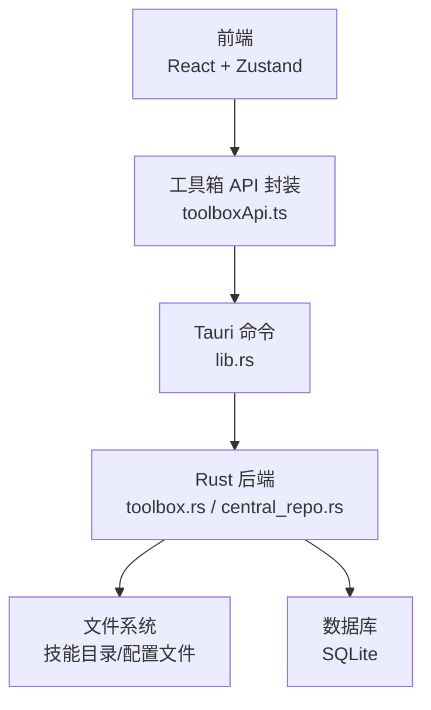
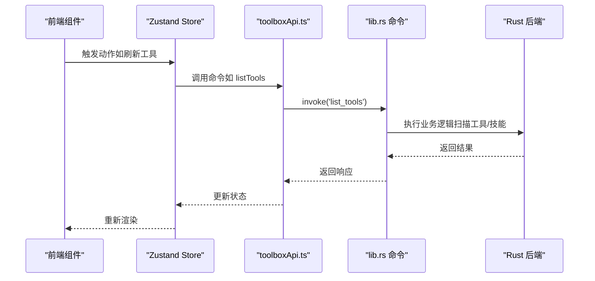
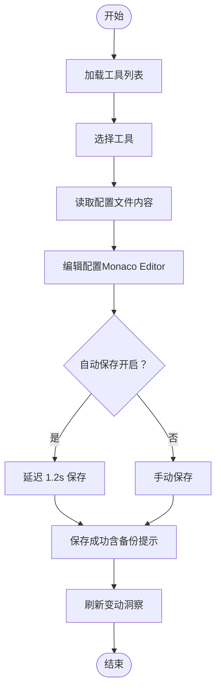
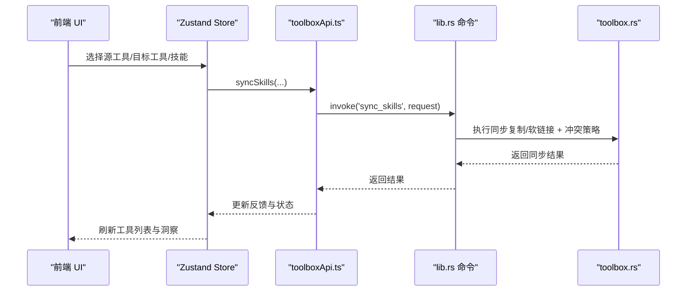
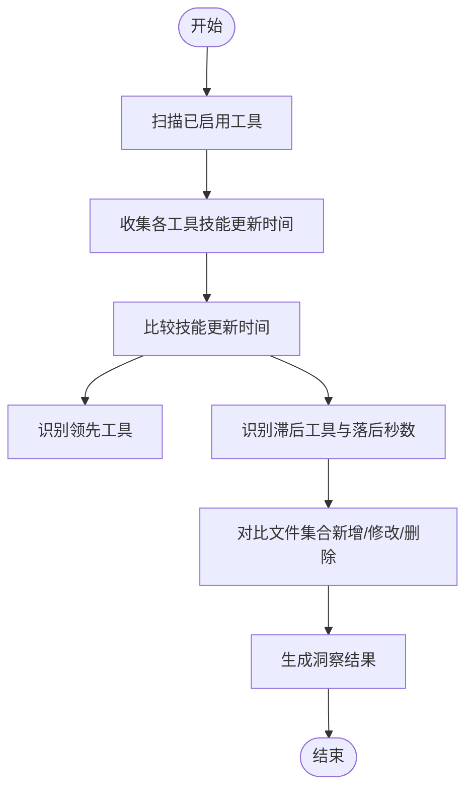
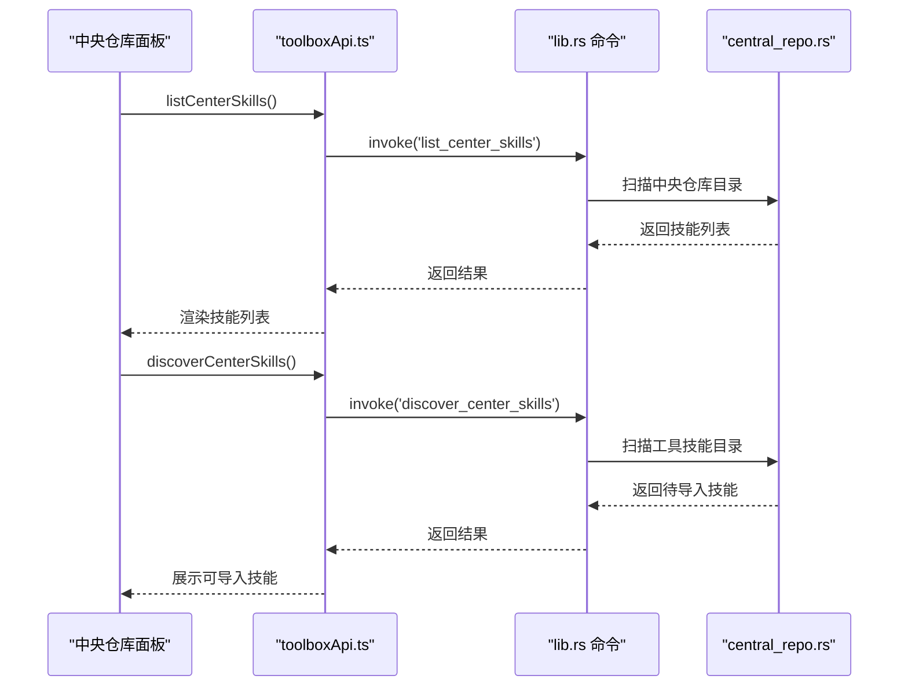
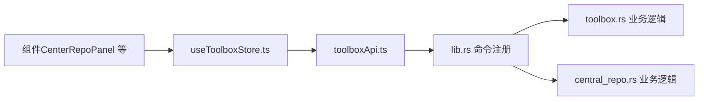

# 功能特性

<cite>
**本文引用的文件**
- [README.md](file://README.md)
- [package.json](file://package.json)
- [src/main.tsx](file://src/main.tsx)
- [src/App.tsx](file://src/App.tsx)
- [src/store/useToolboxStore.ts](file://src/store/useToolboxStore.ts)
- [src/types/toolbox.ts](file://src/types/toolbox.ts)
- [src/lib/toolboxApi.ts](file://src/lib/toolboxApi.ts)
- [src/components/CenterRepoPanel.tsx](file://src/components/CenterRepoPanel.tsx)
- [src/components/ClaudeConfigSyncPanel.tsx](file://src/components/ClaudeConfigSyncPanel.tsx)
- [src/components/CommandPalette.tsx](file://src/components/CommandPalette.tsx)
- [src/components/PresetManager.tsx](file://src/components/PresetManager.tsx)
- [src/components/SkillDetailDrawer.tsx](file://src/components/SkillDetailDrawer.tsx)
- [src/components/TagFilter.tsx](file://src/components/TagFilter.tsx)
- [src-tauri/src/lib.rs](file://src-tauri/src/lib.rs)
- [src-tauri/src/toolbox.rs](file://src-tauri/src/toolbox.rs)
- [src-tauri/src/central_repo.rs](file://src-tauri/src/central_repo.rs)
</cite>

## 目录
1. [简介](#简介)
2. [项目结构](#项目结构)
3. [核心组件](#核心组件)
4. [架构总览](#架构总览)
5. [详细组件分析](#详细组件分析)
6. [依赖分析](#依赖分析)
7. [性能考虑](#性能考虑)
8. [故障排查指南](#故障排查指南)
9. [结论](#结论)
10. [附录](#附录)

## 简介
AI 工具箱是一个基于 Tauri + React 的桌面端 Agent 技能管理工具，提供多工具注册与管理、技能同步、配置编辑、变动洞察等能力，帮助开发者统一管理本地 AI 开发工具的配置文件与技能目录，并在多工具间进行高效同步与对齐。

- 功能概览
  - 工具管理：自动扫描工具目录，识别配置文件与技能目录，支持启用/禁用与路径探测。
  - 技能同步：支持复制与软链接两种模式，提供跳过/覆盖/重命名三种冲突策略，支持批量与单个技能同步。
  - 配置编辑：内置 Monaco Editor，支持多种配置格式，提供自动保存与手动保存、备份与恢复。
  - 变动洞察：实时监控各工具技能差异，识别领先工具与滞后工具，显示技能更新时间对比。
  - 中央仓库：集中管理技能，支持从 Git 安装、从工具导入、批量同步与分类标记。
  - 预设管理：保存常用技能组合，一键应用到多个目标工具。
  - Claude 配置同步：对比 settings.json 与 cc-switch 公共配置，支持整段同步与快照基线。

- 技术栈
  - 前端：React 19 + TypeScript + Vite + Ant Design 6 + Zustand
  - 后端：Rust + Tauri 2
  - 编辑器：Monaco Editor
  - 数据存储：SQLite（通过数据库池）

**章节来源**
- [README.md:20-43](file://README.md#L20-L43)
- [package.json:29-38](file://package.json#L29-L38)

## 项目结构
项目采用前后端分离架构：
- 前端（src/）：React + TypeScript，负责 UI、状态管理、命令封装与组件化。
- 后端（src-tauri/）：Rust + Tauri，负责系统命令、文件系统操作、数据库与技能扫描。
- 类型定义（src/types/）：统一的数据模型与枚举类型。
- 组件（src/components/）：功能面板与交互控件。
- 工具函数（src/lib/）：与后端命令的桥接层，封装 invoke 调用与响应处理。

**图表来源**
- [src/main.tsx:1-12](file://src/main.tsx#L1-L12)
- [src/lib/toolboxApi.ts:1-20](file://src/lib/toolboxApi.ts#L1-L20)
- [src-tauri/src/lib.rs:1-20](file://src-tauri/src/lib.rs#L1-L20)
- [src-tauri/src/toolbox.rs:1-20](file://src-tauri/src/toolbox.rs#L1-L20)
- [src-tauri/src/central_repo.rs:1-20](file://src-tauri/src/central_repo.rs#L1-L20)

**章节来源**
- [README.md:44-67](file://README.md#L44-L67)
- [src/main.tsx:1-12](file://src/main.tsx#L1-L12)
- [src/App.tsx:138-218](file://src/App.tsx#L138-L218)

## 核心组件
- 工具管理与配置编辑
  - 工具列表与选择：支持刷新工具列表、切换工具、查看配置文件。
  - 配置编辑：Monaco Editor 内置，支持自动保存与手动保存，提供备份提示。
  - 路径探测：根据工具名称自动探测配置文件与技能目录。
- 技能同步
  - 单工具内同步：复制或软链接模式，冲突策略可选。
  - 多工具间同步：支持选择多个目标工具与技能集合，批量执行。
- 变动洞察
  - 对比各工具技能目录，识别领先与滞后工具，展示差异文件。
- 中央仓库
  - 技能集中管理：支持从 Git 安装、从工具导入、批量同步、分类标记。
- 预设管理
  - 保存技能组合，一键应用到多个目标工具。
- Claude 配置同步
  - 对比 settings.json 与 cc-switch 公共配置，支持整段同步与快照基线。

**章节来源**
- [src/App.tsx:351-512](file://src/App.tsx#L351-L512)
- [src/store/useToolboxStore.ts:174-384](file://src/store/useToolboxStore.ts#L174-L384)
- [src/components/CenterRepoPanel.tsx:99-364](file://src/components/CenterRepoPanel.tsx#L99-L364)
- [src/components/ClaudeConfigSyncPanel.tsx:101-345](file://src/components/ClaudeConfigSyncPanel.tsx#L101-L345)
- [src/components/PresetManager.tsx:171-328](file://src/components/PresetManager.tsx#L171-L328)

## 架构总览
前端通过 toolboxApi.ts 调用 Tauri 命令，后端在 lib.rs 中注册命令，具体逻辑分布在 toolbox.rs 与 central_repo.rs 中。状态管理由 Zustand 的 useToolboxStore.ts 统一维护，组件通过 store 方法触发命令与更新 UI。

**图表来源**
- [src/store/useToolboxStore.ts:174-205](file://src/store/useToolboxStore.ts#L174-L205)
- [src/lib/toolboxApi.ts:387-396](file://src/lib/toolboxApi.ts#L387-L396)
- [src-tauri/src/lib.rs:620-628](file://src-tauri/src/lib.rs#L620-L628)

**章节来源**
- [src/store/useToolboxStore.ts:145-555](file://src/store/useToolboxStore.ts#L145-L555)
- [src/lib/toolboxApi.ts:387-784](file://src/lib/toolboxApi.ts#L387-L784)
- [src-tauri/src/lib.rs:615-780](file://src-tauri/src/lib.rs#L615-L780)

## 详细组件分析

### 工具管理与配置编辑
- 功能要点
  - 自动扫描工具目录，识别配置文件与技能目录。
  - 支持启用/禁用工具，路径探测辅助配置。
  - 配置文件读取与保存，支持备份提示。
- 使用场景
  - 新增工具：使用“路径探测”自动填充配置文件与技能目录。
  - 编辑配置：在 Monaco Editor 中编辑 JSON/YAML/TOML 等格式。
  - 切换工具：在工具列表中选择目标工具，自动加载其配置文件。
- 技术实现亮点
  - 前端状态管理：通过 useToolboxStore 维护工具列表、选中工具、配置文件内容与脏状态。
  - 自动保存：开启自动保存后，延迟 1.2 秒自动保存当前配置文件。
  - 响应式 UI：根据工具是否为系统工具、是否有配置文件、是否启用等状态动态渲染。

**图表来源**
- [src/App.tsx:363-376](file://src/App.tsx#L363-L376)
- [src/store/useToolboxStore.ts:307-339](file://src/store/useToolboxStore.ts#L307-L339)
- [src/store/useToolboxStore.ts:219-245](file://src/store/useToolboxStore.ts#L219-L245)

**章节来源**
- [src/App.tsx:351-473](file://src/App.tsx#L351-L473)
- [src/store/useToolboxStore.ts:174-339](file://src/store/useToolboxStore.ts#L174-L339)

### 技能同步
- 功能要点
  - 支持复制与软链接两种模式。
  - 冲突策略：跳过、覆盖、重命名。
  - 单工具内同步与多工具批量同步。
- 使用场景
  - 将某工具的技能同步到另一个工具。
  - 一键将一组技能同步到多个目标工具。
- 技术实现亮点
  - 后端实现复制与软链接两种同步方式，支持递归复制与符号链接。
  - 冲突策略在目标路径存在时按策略处理，避免覆盖已有文件。
  - 前端通过对话框选择目标工具与技能，提交后刷新工具列表与洞察。

**图表来源**
- [src/App.tsx:474-512](file://src/App.tsx#L474-L512)
- [src/store/useToolboxStore.ts:341-384](file://src/store/useToolboxStore.ts#L341-L384)
- [src/lib/toolboxApi.ts:438-465](file://src/lib/toolboxApi.ts#L438-L465)
- [src-tauri/src/toolbox.rs:297-400](file://src-tauri/src/toolbox.rs#L297-L400)

**章节来源**
- [src/App.tsx:474-512](file://src/App.tsx#L474-L512)
- [src/store/useToolboxStore.ts:341-384](file://src/store/useToolboxStore.ts#L341-L384)
- [src/lib/toolboxApi.ts:438-465](file://src/lib/toolboxApi.ts#L438-L465)
- [src-tauri/src/toolbox.rs:297-400](file://src-tauri/src/toolbox.rs#L297-L400)

### 变动洞察
- 功能要点
  - 对比各工具技能目录，识别领先工具与滞后工具。
  - 展示滞后工具落后秒数与差异文件列表。
- 使用场景
  - 快速定位哪些工具的技能更新较慢。
  - 一键同步滞后工具到领先工具。
- 技术实现亮点
  - 后端遍历各工具技能目录，比较更新时间戳，计算落后秒数。
  - 对于存在差异的技能，进一步对比文件集合，识别新增/修改/删除文件。

**图表来源**
- [src-tauri/src/lib.rs:684-755](file://src-tauri/src/lib.rs#L684-L755)

**章节来源**
- [src-tauri/src/lib.rs:684-755](file://src-tauri/src/lib.rs#L684-L755)
- [src/store/useToolboxStore.ts:207-217](file://src/store/useToolboxStore.ts#L207-L217)

### 中央仓库
- 功能要点
  - 集中管理技能，支持从 Git 安装、从工具导入、批量同步与分类标记。
  - 扫描各工具未入库技能，支持一键导入。
- 使用场景
  - 将分散在各工具的技能统一入库，便于集中管理与复用。
  - 从 Git 仓库快速安装新技能到中央仓库。
- 技术实现亮点
  - 中央仓库目录统一管理，支持批量导入与同步。
  - 发现机制扫描各工具技能目录，过滤已在中央仓库的技能。

**图表来源**
- [src/components/CenterRepoPanel.tsx:99-120](file://src/components/CenterRepoPanel.tsx#L99-L120)
- [src/components/CenterRepoPanel.tsx:245-294](file://src/components/CenterRepoPanel.tsx#L245-L294)
- [src/lib/toolboxApi.ts:636-638](file://src/lib/toolboxApi.ts#L636-L638)
- [src-tauri/src/central_repo.rs:104-149](file://src-tauri/src/central_repo.rs#L104-L149)
- [src-tauri/src/central_repo.rs:155-220](file://src-tauri/src/central_repo.rs#L155-L220)

**章节来源**
- [src/components/CenterRepoPanel.tsx:99-364](file://src/components/CenterRepoPanel.tsx#L99-L364)
- [src/lib/toolboxApi.ts:676-721](file://src/lib/toolboxApi.ts#L676-L721)
- [src-tauri/src/central_repo.rs:104-220](file://src-tauri/src/central_repo.rs#L104-L220)

### 预设管理
- 功能要点
  - 创建预设：选择技能集合，保存为预设。
  - 应用预设：选择目标工具，一键同步预设中的技能。
  - 删除预设：安全删除不再使用的预设。
- 使用场景
  - 团队共享常用技能组合，快速部署到多工具。
- 技术实现亮点
  - 前端通过 PresetManager 组件管理预设的创建、应用与删除。
  - 应用预设时调用批量同步命令，逐个工具执行同步并汇总结果。

**章节来源**
- [src/components/PresetManager.tsx:171-328](file://src/components/PresetManager.tsx#L171-L328)
- [src/store/useToolboxStore.ts:523-554](file://src/store/useToolboxStore.ts#L523-L554)

### Claude 配置同步
- 功能要点
  - 对比 settings.json 与 cc-switch 公共配置，支持整段同步。
  - 支持多种基线：当前文件（Live）、字段最全快照（Richest）、指定快照。
  - 写锁检测：检测 cc-switch 是否持有写锁，避免写入失败。
- 使用场景
  - 将本地 settings.json 的字段整段同步到 cc-switch 公共配置。
- 技术实现亮点
  - 前端 ClaudeConfigSyncPanel 展示差异统计与字段对比，支持查看 JSON Diff。
  - 后端提供差异计算与整段同步命令，自动备份到 ~/.cc-switch/backups/。

**章节来源**
- [src/components/ClaudeConfigSyncPanel.tsx:101-345](file://src/components/ClaudeConfigSyncPanel.tsx#L101-L345)
- [src/store/useToolboxStore.ts:412-459](file://src/store/useToolboxStore.ts#L412-L459)
- [src/lib/toolboxApi.ts:756-784](file://src/lib/toolboxApi.ts#L756-L784)

## 依赖分析
- 前端依赖
  - React、Ant Design、Monaco Editor、Zustand、@tauri-apps/api。
- 后端依赖
  - Tauri 2、Serde、SQLite（通过数据库池）。
- 命令映射
  - 前端通过 toolboxApi.ts 的 invoke 调用后端命令，命令在 lib.rs 中注册，具体实现位于 toolbox.rs 与 central_repo.rs。

**图表来源**
- [src/lib/toolboxApi.ts:1-20](file://src/lib/toolboxApi.ts#L1-L20)
- [src-tauri/src/lib.rs:1-20](file://src-tauri/src/lib.rs#L1-L20)
- [src-tauri/src/toolbox.rs:1-20](file://src-tauri/src/toolbox.rs#L1-L20)
- [src-tauri/src/central_repo.rs:1-20](file://src-tauri/src/central_repo.rs#L1-L20)

**章节来源**
- [package.json:29-61](file://package.json#L29-L61)
- [src/lib/toolboxApi.ts:1-20](file://src/lib/toolboxApi.ts#L1-L20)
- [src-tauri/src/lib.rs:1-20](file://src-tauri/src/lib.rs#L1-L20)

## 性能考虑
- 前端性能
  - 使用 Zustand 减少不必要的重渲染，合理拆分组件状态。
  - 自动保存采用防抖延迟，避免频繁 IO。
- 后端性能
  - 文件系统操作采用递归复制与符号链接，避免重复读写。
  - 技能扫描与差异对比使用哈希与时间戳，减少冗余计算。
- I/O 优化
  - 配置文件保存前自动备份，避免数据丢失风险。
  - 中央仓库批量导入与同步时，按工具逐一处理并汇总结果。

[本节为通用指导，不直接分析具体文件]

## 故障排查指南
- 常见问题
  - 工具列表为空：检查工具注册文件是否存在与可读，尝试刷新工具列表。
  - 配置保存失败：检查目标路径权限与磁盘空间，查看备份路径提示。
  - 技能同步失败：检查冲突策略与目标路径是否存在，确认模式（复制/软链接）是否正确。
  - Claude 配置同步失败：检查 cc-switch 是否运行，确保无写锁。
- 定位方法
  - 查看 Store 中的 feedback 提示，结合错误信息定位问题。
  - 在控制台查看 invoke 调用返回的错误消息。
- 解决建议
  - 重启 cc-switch GUI，释放写锁后再进行同步。
  - 更换冲突策略（如从“跳过”改为“覆盖”），或手动清理目标路径。
  - 使用“路径探测”功能自动填充配置文件与技能目录。

**章节来源**
- [src/store/useToolboxStore.ts:183-205](file://src/store/useToolboxStore.ts#L183-L205)
- [src/store/useToolboxStore.ts:307-339](file://src/store/useToolboxStore.ts#L307-L339)
- [src/components/ClaudeConfigSyncPanel.tsx:301-308](file://src/components/ClaudeConfigSyncPanel.tsx#L301-L308)

## 结论
AI 工具箱通过统一的工具管理、灵活的技能同步、强大的配置编辑与洞察分析，有效提升了多工具环境下技能与配置的一致性与可维护性。中央仓库与预设管理进一步增强了团队协作与规模化部署能力。Claude 配置同步功能则为特定生态提供了深度集成与安全保障。

[本节为总结性内容，不直接分析具体文件]

## 附录
- 快速开始
  - 安装依赖：npm install
  - 开发模式：npm run tauri:dev
  - 构建安装包：npm run tauri:build
- 版本与分支
  - 当前版本：v0.2.1
  - 主分支：main
  - 开发分支：codex/tool-registry-management

**章节来源**
- [README.md:76-119](file://README.md#L76-L119)